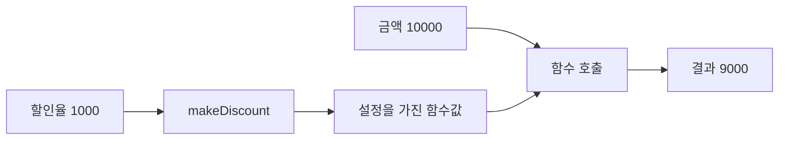

# 7장. Closures

고차 함수가 새 함수를 반환하려면 그 함수가 필요한 설정을 기억해야 할 때가 있다.
클로저는 함수의 코드와 그 코드가 사용하는 어휘적 환경을 함께 다루는 개념이다.
이번 장에서는 할인율과 임계값을 기억하는 함수로 환경의 의미를 살펴본다.

클로저를 “변수 값을 복사해서 저장하는 함수”라고만 설명하면 중요한 버그를 놓친다.
무엇을 캡처했는지, 그 대상이 나중에 바뀔 수 있는지, 언제 읽는지를 구분해야 한다.
특히 Python의 반복문에서 만든 함수들은 이 차이를 선명하게 보여 준다.

---

## 1. 개념과 기본 구분

### 자유 변수와 환경

함수 본문에서 사용하지만 매개변수나 지역 정의로 주어지지 않은 변수를 자유 변수라고 부른다.
그 변수의 의미는 함수가 정의된 어휘적 범위에서 찾아진다.
클로저는 코드와 필요한 환경을 함께 유지하여 정의 범위를 벗어난 뒤에도 함수를 사용할 수 있게
한다.

```text
함수 코드: amount - amount * rate / 10000
자유 변수: rate
환경:      rate가 가리키는 값 또는 바인딩
클로저:    코드 + 환경
```

환경을 저장하는 구체적인 방식은 언어와 구현에 따라 다르다.
개념적으로 중요한 것은 호출 위치가 아니라 정의 위치의 범위를 따른다는 점이다.
이를 어휘적 스코프라고 한다.

### 캡처와 복사

캡처가 항상 깊은 복사인 것은 아니다.
가변 객체의 참조를 캡처하면 그 객체의 나중 변경을 볼 수 있다.
재할당 가능한 바인딩을 캡처하면 호출 시점의 바인딩 값을 읽을 수 있다.

### 클로저와 순수성

불변 설정만 캡처하고 외부 효과가 없으면 클로저를 순수 함수처럼 사용할 수 있다.
반대로 내부 카운터를 갱신하거나 외부 설정을 읽으면 호출 이력에 의존한다.
클로저라는 구현 형태만으로 순수성을 판단하지 않는다.

### 수명의 확장

반환된 함수가 환경을 참조하면 환경의 일부는 바깥 함수가 끝난 뒤에도 살아 있을 수 있다.
필요한 작은 값만 캡처하면 명확하지만 큰 객체 전체를 붙잡으면 메모리 수명이 길어질 수 있다.
자원 핸들을 캡처할 때는 메모리 생존과 자원 유효성을 구분해야 한다.

---

## 2. 명령형 스타일과 함수형 스타일

### 전역 설정을 읽는 함수

```scala
var currentRate = 1000

def discount(amount: Long): Long =
  amount - amount * currentRate / 10000
```

이 함수의 결과는 호출 당시 전역 할인율에 달려 있다.
같은 정책을 선택했다고 생각해도 설정 변경 후 다른 결과를 낼 수 있다.
정책의 의미가 시간에 따라 변하는 설계다.

### 설정을 고정한 함수 생성

```scala
def makeDiscount(rate: Int): Long => Long =
  amount => amount - amount * rate / 10000

val tenPercent = makeDiscount(1000)
val twentyPercent = makeDiscount(2000)
```

각 함수는 자신의 설정 환경을 가진다.
새 함수를 만들 때 할인율을 선택하고, 나중에 금액을 전달해 실행한다.
설정과 실행을 분리하는 구조가 된다.

### 가변 환경을 캡처한 반례

```scala
var rate = 1000
val livePolicy: Long => Long =
  amount => amount - amount * rate / 10000

rate = 2000
val changedResult = livePolicy(10000)
```

`livePolicy`는 처음의 숫자를 영구 스냅샷으로 복사한 것이 아니다.
가변 바인딩을 통해 나중 값의 영향을 받는다.
실시간 설정 반영이 목적이라면 올바를 수 있지만 고정 정책이 목적이라면 버그다.
중요한 것은 요구한 의미를 명시하는 것이다.

---

## 3. 왜 이 개념을 사용하는가?

### 작은 환경을 가진 동작

클로저는 설정값을 매 호출마다 반복해서 전달하지 않게 해 준다.
정렬 기준, 권한 검사, 할인 정책처럼 작은 환경을 가진 함수를 만들 때 유용하다.
하지만 환경이 숨겨지므로 이름과 생성 위치가 더 중요해진다.

### 테스트의 단순화

원하는 설정으로 함수를 만든 뒤 입력별 결과를 검사할 수 있다.
전역 설정을 테스트마다 바꿀 필요가 없다.
여러 설정의 함수를 동시에 만들어 서로 영향을 주지 않는지도 확인할 수 있다.

### 환경의 스냅샷

정책을 재현하려면 필요한 설정을 불변 값으로 모아 캡처할 수 있다.
가변 딕셔너리나 리스트의 참조만 넘기면 진짜 스냅샷이 아닐 수 있다.
불변성 장에서 다룬 객체 그래프의 관점이 그대로 적용된다.

### 사용자에게 보일 계약

함수를 반환하는 API는 설정 변경이 기존 함수에 반영되는지 설명해야 한다.
“생성 시점의 설정”과 “실행 시점의 설정”은 서로 다른 제품 동작이다.
둘 가운데 어느 쪽이 더 함수형처럼 보이는지보다 업무 요구가 우선이다.

### 객체와의 비교

환경을 필드에 담은 호출 가능한 객체로 같은 구조를 표현할 수 있다.
환경을 검사하거나 직렬화해야 하면 객체가 더 명확할 수 있다.
작은 동작을 짧게 조립할 때는 클로저가 자연스러울 수 있다.
표현 방식보다 환경의 의미가 중요하다.

---

## 4. Scala에서의 표현

### Scala의 고정 환경과 가변 환경

다음 프로그램은 두 종류의 클로저를 대비한다.
금액 범위는 작은 예제 범위로 제한하여 산술보다 캡처 의미에 집중한다.
실무 금액 계산의 범위와 반올림 정책은 별도로 설계해야 한다.

<!-- executable:scala -->
```scala
object Chapter07:
  def makeDiscount(rate: Int): Long => Long =
    require(rate >= 0 && rate <= 10000)
    amount =>
      require(amount >= 0 && amount <= 1000000000L)
      amount - amount * rate / 10000

  def atLeast(threshold: Int): Int => Boolean =
    value => value >= threshold

  def makeCounter(): () => Int =
    var count = 0
    () =>
      count += 1
      count

  def snapshotMembership(values: Vector[String]): String => Boolean =
    value => values.contains(value)

  def check(): Unit =
    val ten = makeDiscount(1000)
    val twenty = makeDiscount(2000)
    assert(ten(10000) == 9000)
    assert(twenty(10000) == 8000)
    assert(ten(10000) == 9000)
    assert(ten(0) == 0)

    val predicates = List(10, 20, 30).map(atLeast)
    assert(predicates.map(p => p(25)) == List(true, true, false))

    var threshold = 10
    val live: Int => Boolean = value => value >= threshold
    val fixed = atLeast(threshold)
    assert(live(15))
    threshold = 20
    assert(!live(15))
    assert(fixed(15))

    val a = makeCounter()
    val b = makeCounter()
    assert(a() == 1)
    assert(a() == 2)
    assert(b() == 1)

    val allowed = snapshotMembership(Vector("A", "B"))
    assert(allowed("A"))
    assert(!allowed("C"))
```

### 같은 코드와 다른 환경

`ten`과 `twenty`는 같은 함수 본문에서 만들어졌지만 할인율이 다르다.
따라서 코드 모양만으로 함수의 의미를 완전히 설명할 수 없다.
환경도 의미의 일부다.

### 카운터는 의도적으로 비순수하다

`makeCounter`가 반환한 함수는 호출할 때마다 값을 바꾼다.
서로 다른 카운터는 독립 환경을 가지지만 각 카운터 내부에는 상태가 있다.
상태가 전역이 아니라는 이유로 순수해지는 것은 아니다.

### 캡처 범위를 작게 한다

환경에 전체 서비스 객체를 넣으면 필요한 필드 외의 자원도 살아 있을 수 있다.
필요한 값만 추출해 캡처하면 의존성을 읽기 쉽고 수명도 줄일 수 있다.
이는 메모리 최적화뿐 아니라 설계의 투명성에 관한 선택이다.

---

## 5. 상태 변경보다 값 변환

### 환경을 입력의 일부로 읽는다

클로저가 겉으로는 금액 하나만 받더라도 의미상 할인율도 계산에 참여한다.
그 할인율은 함수 생성 시점에 공급된 입력이다.
따라서 클로저를 이해할 때 생성 단계와 호출 단계를 함께 읽어야 한다.



생성 단계의 입력이 불변이면 함수값의 의미를 안정적으로 추적할 수 있다.
가변 환경을 캡처하면 생성 이후에도 의미가 달라질 수 있다.
둘 가운데 어느 계약인지 함수 이름이나 타입 주변 설명에 드러내는 것이 좋다.

### 스냅샷의 깊이

목록을 튜플로 바꾸어 캡처해도 원소가 가변이면 내부 변경을 볼 수 있다.
원소가 문자열이나 정수 같은 불변 값일 때와 다르다.
깊은 스냅샷이 필요한지 단순한 목록 구조의 스냅샷이면 충분한지 판단해야 한다.

### 값으로 만든 설정

환경을 작은 불변 설정 레코드로 정의하면 생성 시점의 정책을 기록하기 쉽다.
함수와 설정 데이터를 분리해서 보관할 수도 있다.
후반부의 Reader와 의존성 주입은 환경을 더 명시적으로 다루는 다른 선택지다.

---

## 6. 함수 합성과 데이터 흐름

### 클로저의 합성

서로 다른 설정을 가진 함수들을 합성할 수 있다.
예를 들어 할인 함수 다음에 통화 표시 함수를 연결한다.
각 함수의 환경이 불변이면 합성된 함수의 의미도 비교적 안정적으로 읽을 수 있다.

```scala
def label(currency: String): Long => String =
  amount => s"$amount $currency"

val policy = Chapter07.makeDiscount(1000)
val render = label("KRW")
val display = policy.andThen(render)
```

두 클로저가 같은 가변 환경을 공유하면 합성의 의미가 복잡해진다.
앞 함수의 실행이 환경을 바꾸어 뒤 함수의 결과에 영향을 줄 수도 있다.
함수 타입이 이어진다는 사실만으로 독립성을 가정하지 않는다.

### 부분 적용과의 관계

일부 인자를 먼저 공급해 함수를 만드는 작업은 클로저로 구현할 수 있다.
하지만 부분 적용은 인자 공급 방식이고 클로저는 환경을 보관하는 개념이다.
둘을 같은 용어로 쓰지 않는다.

### 커링과의 관계

커링된 함수는 인자를 하나씩 받아 다음 함수를 반환한다.
각 단계가 이전 인자를 환경에 보관할 수 있다.
이 관계는 2부에서 타입과 예제를 통해 자세히 다룬다.

---

## 7. 장점과 트레이드오프

### 장점

작은 설정을 가진 동작을 간결하게 만들 수 있다.
전역 상태를 줄이고 여러 정책 인스턴스를 독립적으로 구성할 수 있다.
함수 반환을 통해 설정 단계와 실행 단계를 분리할 수 있다.

### 주의점

환경이 코드에 직접 드러나지 않아 의존성을 놓치기 쉽다.
가변 캡처는 호출 시점에 따라 결과를 바꾼다.
큰 객체나 자원을 붙잡아 예상보다 수명을 늘릴 수 있다.

| 환경의 종류 | 결과에 미치는 영향 | 검토할 점 |
| --- | --- | --- |
| 불변 정수 설정 | 생성 시 의미 고정 | 범위와 정책 버전 |
| 가변 바인딩 | 나중 재대입 반영 가능 | 실행 시점 |
| 가변 객체 참조 | 내부 변경 반영 가능 | 별칭과 깊이 |
| 파일 핸들 | 자원 상태에 의존 | 닫힘과 수명 |
| 내부 카운터 | 호출 이력에 의존 | 재진입과 동시성 |
| 큰 서비스 객체 | 넓은 의존성 유지 | 메모리와 권한 범위 |

### 이름 있는 구조가 더 나을 때

설정값을 사용자에게 보여 주거나 저장해야 하면 데이터 클래스가 더 명확할 수 있다.
여러 관련 동작을 같은 환경에서 제공해야 하면 작은 객체가 자연스럽다.
클로저를 선택할 때도 디버깅과 유지보수의 관측 가능성을 고려한다.

### 미세 최적화의 경계

클로저 생성과 호출 비용은 언어 구현과 사용 패턴에 따라 달라진다.
환경이 작다고 비용이 항상 사라지는 것은 아니다.
병목이 확인되기 전에는 의미가 명확한 표현을 우선한다.

---

## 8. 상태와 부수효과의 경계

### 자원과 메모리는 다르다

파일 객체를 클로저가 참조한다고 파일이 반드시 열려 있는 것은 아니다.
외부에서 이미 닫았을 수 있다.
메모리 객체가 살아 있는 것과 자원 사용 권한이 유효한 것은 다른 조건이다.

### 지연 실행의 경계

함수를 만들어 반환하면 실제 효과가 나중에 발생할 수 있다.
호출자가 실행하지 않으면 효과도 발생하지 않을 수 있다.
실행 횟수와 취소, 오류 전달의 책임을 명시해야 한다.

### 공유 카운터의 동시성

클로저 안의 카운터도 공유 상태다.
여러 실행 흐름이 같은 함수를 호출하면 갱신 충돌을 검토해야 한다.
캡처된 변수가 외부에서 직접 보이지 않는다는 사실이 동기화를 대신하지 않는다.

### 테스트의 격리

각 테스트가 새 클로저를 만들면 내부 상태를 격리할 수 있다.
하지만 모듈 수준에서 만든 상태ful 클로저를 공유하면 테스트 순서에 의존할 수 있다.
함수 생성 위치 역시 상태 수명의 설계다.

### 권한 축소

전체 저장소 객체 대신 필요한 조회 함수 하나를 캡처할 수 있다.
이는 의존성 표면을 줄이지만 실제 함수가 가진 효과까지 제거하지는 않는다.
의존성 주입과 효과 경계의 관점에서 함께 검토한다.

---

## 9. Python에서 적용하기

### Python의 늦은 바인딩과 스냅샷

반복문에서 만든 함수가 반복 변수의 나중 값을 읽는 현상을 먼저 검사한다.
그다음 함수 팩토리로 각 임계값을 독립적으로 고정한다.
기본 인자를 이용한 고정도 가능하지만 그것이 깊은 복사는 아니라는 점을 함께 기억한다.

<!-- executable:python -->
```python
from collections.abc import Callable, Iterable


def make_discount(rate: int) -> Callable[[int], int]:
    if not 0 <= rate <= 10_000:
        raise ValueError("invalid rate")

    def apply(amount: int) -> int:
        if amount < 0:
            raise ValueError("negative amount")
        return amount - amount * rate // 10_000

    return apply


def at_least(threshold: int) -> Callable[[int], bool]:
    def predicate(value: int) -> bool:
        return value >= threshold
    return predicate


def make_counter() -> Callable[[], int]:
    count = 0

    def next_value() -> int:
        nonlocal count
        count += 1
        return count

    return next_value


def snapshot_membership(values: Iterable[str]) -> Callable[[str], bool]:
    snapshot = frozenset(values)
    return lambda value: value in snapshot


def test_independent_settings() -> None:
    ten = make_discount(1000)
    twenty = make_discount(2000)
    assert ten(10_000) == 9000
    assert twenty(10_000) == 8000
    assert ten(10_000) == 9000


def test_late_binding() -> None:
    late = [lambda value: value >= threshold for threshold in (10, 20, 30)]
    assert [predicate(25) for predicate in late] == [False, False, False]
    fixed = [at_least(threshold) for threshold in (10, 20, 30)]
    assert [predicate(25) for predicate in fixed] == [True, True, False]
    defaults = [
        lambda value, threshold=threshold: value >= threshold
        for threshold in (10, 20, 30)
    ]
    assert [predicate(25) for predicate in defaults] == [True, True, False]


def test_mutable_capture() -> None:
    allowed = ["A", "B"]
    live = lambda value: value in allowed
    fixed = snapshot_membership(allowed)
    allowed.append("C")
    assert live("C")
    assert not fixed("C")


def test_counter_state() -> None:
    a = make_counter()
    b = make_counter()
    assert a() == 1
    assert a() == 2
    assert b() == 1


if __name__ == "__main__":
    test_independent_settings()
    test_late_binding()
    test_mutable_capture()
    test_counter_state()
```

### 기본 인자 방식의 해석

`threshold=threshold`는 함수 정의 시점에 기본 인자 값을 평가한다.
따라서 이 예제의 불변 정수는 각 함수에 고정된다.
가변 리스트를 기본 인자로 넣으면 그 리스트 객체가 공유될 수 있으므로 같은 해결책으로 일반화하지
않는다.

### 함수 팩토리의 장점

`at_least`는 임계값이 정책의 설정이라는 의미를 이름으로 드러낸다.
호출자가 두 번째 인자로 기본값을 덮어쓰는 표면도 만들지 않는다.
간단한 문법 차이가 API 계약 차이가 될 수 있다.

---

## 10. Python의 표현 한계

### `nonlocal`은 상태 변경이다

`nonlocal`은 바깥 함수의 바인딩을 재대입하도록 한다.
내부에 숨겨져 있어도 호출 이력에 의존하는 상태가 된다.
순수한 정책과 상태ful 생성기를 같은 종류의 함수로 문서화하지 않는다.

### 자동 깊은 캡처는 없다

클로저가 참조한 객체를 자동으로 깊게 복사한다고 가정하지 않는다.
스냅샷이 필요하면 값의 구조와 원소의 변경 가능성을 검토하여 명시적으로 구성한다.
복사할 수 없는 자원은 별도 수명 모델이 필요하다.

### 정적 표현의 한계

`Callable` 타입만으로 어떤 환경을 캡처했는지 일반적으로 드러나지 않는다.
효과와 수명 계약은 함수 팩토리의 문서와 구현에 남겨야 한다.
중요한 환경을 별도 데이터 객체로 노출하는 것도 방법이다.

### 캡처 환경의 관찰

구현 세부 속성으로 클로저 내부를 조사할 수 있어도 업무 로직이 그 구조에 의존하게 만들지 않는다.
디버깅용 관찰과 안정적인 공개 API는 다르다.
장기 보관이나 프로세스 간 전송이 필요하면 명시적인 설정 데이터를 사용한다.

---

## 11. 핵심 정리

### 핵심 결론

클로저는 코드와 환경을 함께 유지한다.
캡처는 항상 값의 깊은 복사가 아니며 가변 환경의 나중 변경을 볼 수 있다.
고정 정책과 실시간 설정 반영은 다른 계약이다.
내부 상태와 자원 수명은 클로저 안에서도 명시적으로 관리해야 한다.

### 연습 1: 반복 변수

Python에서 반복문으로 만든 세 함수가 모두 마지막 임계값을 쓰는 이유를 설명하라.
함수 팩토리와 기본 인자 방식으로 각각 수정하라.

**해설.** 함수가 반복 변수의 바인딩을 나중에 읽기 때문이다.
팩토리는 각 호출의 별도 환경을 만들고 기본 인자는 정의 시점에 값을 평가한다.
두 방식의 함수 시그니처 차이도 확인해야 한다.

### 연습 2: 가변 기본값

리스트를 기본 인자로 캡처한 함수에서 원본 리스트를 수정했다.
그 함수가 변경을 볼 수 있는 이유를 설명하라.

**해설.** 기본 인자에는 리스트 객체에 대한 참조가 보관된다.
정의 시점 평가가 깊은 복사를 뜻하지 않는다.
필요하면 불변 원소로 구성한 새 스냅샷을 만들어야 한다.

### 연습 3: 카운터의 순수성

각 카운터가 독립적이면 반환된 카운터 함수는 순수한가?

**해설.** 아니다. 같은 무인자 호출이 이전 호출 횟수에 따라 다른 값을 낸다.
상태가 전역인지 지역 환경인지와 순수성 여부는 다른 질문이다.
독립 환경은 간섭을 줄이지만 상태 자체를 없애지는 않는다.

### 연습 4: 닫힌 파일

파일을 연 범위 안에서 읽기 클로저를 만든 뒤 파일을 닫고 함수를 반환했다.
어떤 계약이 깨질 수 있는가?

**해설.** 나중 호출 시 파일 객체는 살아 있어도 실제 자원은 닫혀 있을 수 있다.
값을 미리 읽어 반환하거나 자원 사용을 유효한 범위 안에서 실행하도록 설계해야 한다.
메모리 수명과 자원 수명을 구분한다.

### 다음 장과 참고 자료

다음 장은 함수를 자기 자신에게 연결하는 재귀를 다룬다.
함수의 환경뿐 아니라 호출 스택에 어떤 미완료 계산이 남는지도 중요해진다.

[Python 공식 FAQ: lambdas defined in a loop](https://docs.python.org/3.14/faq/programming.html#why-do-lambdas-defined-in-a-loop-with-different-values-all-return-the-same-result)
[Scala 공식 문서: Higher-Order Functions](https://docs.scala-lang.org/scala3/book/fun-hofs.html)
