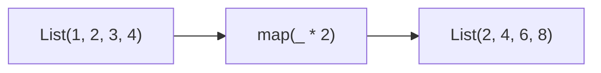
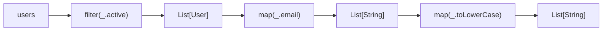
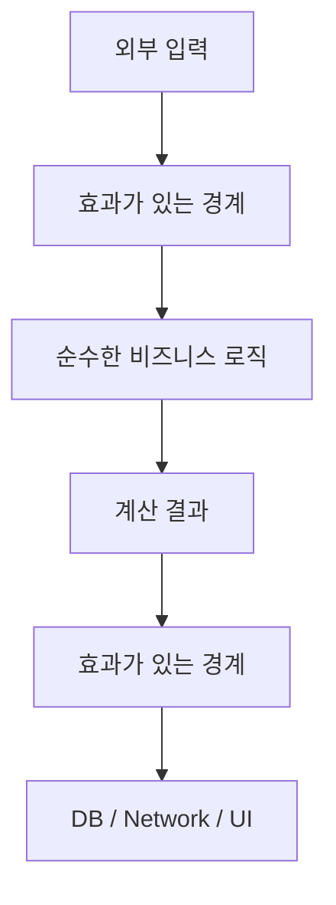

# 1장. Expression-Oriented Programming


표현식 중심 프로그래밍(Expression-Oriented Programming, EOP)은 프로그램의 주요 구성 요소를
**값을 계산하는 표현식(Expression)** 중심으로 작성하는 스타일입니다.

명령형 프로그래밍에서는 제어 흐름과 상태 변경을 중심으로 코드를 구성하는 경우가 많습니다. 반면
표현식 중심 프로그래밍에서는 가능한 한 많은 연산을 **“어떤 동작을 수행할 것인가?”보다 “어떤 값을
계산할 것인가?”**의 관점에서 구성합니다.

이러한 접근은 불변성(Immutability), 순수 함수(Pure Function), 함수 합성(Function Composition)과
자연스럽게 연결되며, 함수형 프로그래밍의 중요한 기초가 됩니다.

---

## 1. 개념과 기본 구분

EOP를 이해하려면 먼저 문장(Statement)과 표현식(Expression)을 구분해야 합니다.

- **문장(Statement)**: 프로그램의 실행 흐름이나 상태 변경을 나타내는 코드 단위입니다. 일반적으로 그 자체를 다른 표현식의 값으로 직접 사용할 수 없습니다.
- **표현식(Expression)**: 평가(Evaluation)되면 하나의 값(Value)이 되는 코드 단위입니다.

| 구분 | 문장 (Statement) | 표현식 (Expression) |
| --- | --- | --- |
| **평가 결과** | 다른 계산에 직접 사용할 값을 만들지 않는 경우가 많음 | 하나의 값으로 평가됨 |
| **주요 역할** | 상태 변경, 제어 흐름, 효과 수행 | 계산 및 새로운 값 생성 |
| **예시** | `if (...) { ... }`, `x = x + 1` | `a + b`, `a > b ? a : b` |

중요한 점은 `void`, `Unit`, `None`을 모두 단순히 “반환값이 없다”고 동일하게 취급해서는 안 된다는
것입니다.

예를 들어 Scala의 `Unit`은 실제로 하나의 값을 가지는 타입입니다. 다만 그 값이 의미 있는 계산
결과를 표현하기보다 “주요 결과값이 없다”는 의미로 사용됩니다.

---

## 2. 명령형 스타일과 함수형 스타일

### 명령형 스타일 (Statement-Oriented Style)

명령형 스타일에서는 가변 변수를 선언하고, 제어 흐름에 따라 그 값을 변경하는 방식이 자주
사용됩니다.

```java
String status;

if (score >= 80) {
    status = "Pass";
} else {
    status = "Fail";
}
```

이 코드의 흐름은 다음과 같습니다.


`status`라는 저장 공간을 먼저 만들고 이후 실행 흐름에 따라 값을 대입합니다.

### 표현식 중심 스타일 (Expression-Oriented Style)

표현식 중심 언어에서는 조건문 자체가 값을 계산할 수 있습니다.

Scala에서는 다음과 같이 작성할 수 있습니다.

```scala
val status =
  if score >= 80 then "Pass"
  else "Fail"
```

이 경우 `if` 전체가 하나의 값으로 평가됩니다.


가변 상태를 먼저 만든 뒤 수정할 필요가 없습니다.

---

## 3. 왜 이 개념을 사용하는가?

표현식 중심 스타일은 함수형 프로그래밍의 여러 특성을 자연스럽게 유도합니다.

### 1) 불변성(Immutability)을 사용하기 쉬워진다

값을 나중에 변경하기보다 계산 결과를 바로 변수에 바인딩할 수 있습니다.

```scala
val status =
  if score >= 80 then "Pass"
  else "Fail"
```

반면 명령형 스타일에서는 종종 다음과 같이 가변 변수가 필요합니다.

```scala
var status = ""

if score >= 80 then
  status = "Pass"
else
  status = "Fail"
```

표현식 중심 코드는 `var` 대신 `val`을 사용하기 쉬운 구조를 만듭니다.

### 2) 상태 변경의 범위를 줄일 수 있다

가변 상태가 많아질수록 프로그램의 결과가 이전 실행 순서에 의존하기 쉬워집니다.

표현식 중심 스타일은 상태를 수정하기보다 새로운 값을 계산하도록 유도하므로 이러한 복잡성을
줄이는 데 도움이 됩니다.

### 3) 코드를 지역적으로 이해하기 쉬워진다

표현식은 무엇을 변경하는지보다 **무슨 값을 만들어내는지**에 집중합니다.

```scala
val discount =
  if user.isVip then 0.2
  else 0.0
```

이 코드는 외부 상태를 추적하지 않고도 결과를 비교적 쉽게 이해할 수 있습니다.

다만 표현식 중심이라는 이유만으로 자동으로 순수성이나 테스트 용이성이 보장되는 것은 아닙니다.

예를 들어 다음 역시 표현식입니다.

```scala
readLine()
```

하지만 외부 입력이라는 부수효과를 포함합니다.

따라서 **표현식 중심 프로그래밍과 순수 함수는 관련은 있지만 동일한 개념은 아닙니다.**

---

## 4. Scala에서의 표현

Scala는 표현식 중심 스타일을 강하게 지원하는 언어입니다.

### 1) `if` 표현식

Scala의 `if`는 값을 반환합니다.

```scala
val max =
  if a > b then a
  else b
```

`if` 전체가 `a` 또는 `b`라는 하나의 값으로 평가됩니다.

### 2) `match` 표현식

Scala의 패턴 매칭 역시 값으로 평가됩니다.

```scala
val userType = "VIP"

val discount =
  userType match
    case "VIP"     => 0.2
    case "REGULAR" => 0.05
    case _         => 0.0
```

`match`는 단순히 분기만 수행하는 것이 아니라 선택된 `case`의 결과를 전체 표현식의 값으로
사용합니다.

### 3) 블록 표현식

Scala에서는 코드 블록도 하나의 표현식으로 사용할 수 있습니다.

```scala
val result =
  val x = 10
  val y = 20
  x + y
```

마지막 표현식인 `x + y`의 결과가 전체 블록의 값이 됩니다.

따라서 `result`는 `30`이 됩니다.

### 4) 함수 본문 표현식

Scala 함수의 본문 역시 표현식으로 작성할 수 있습니다.

```scala
def add(a: Int, b: Int): Int =
  a + b
```

함수 본문의 표현식 `a + b`가 평가된 값이 함수 결과가 됩니다.

이러한 스타일에서는 일반적으로 명시적인 `return`을 사용할 필요가 없습니다.

---

## 5. 상태 변경보다 값 변환

명령형 프로그래밍은 흔히 다음 질문을 중심으로 작성됩니다.

> 기존 상태를 어떻게 변경할 것인가?

예를 들어:

```scala
var x = 10
x = x + 1
```

기존의 `x` 값을 직접 변경합니다.

함수형 스타일에서는 다음 질문을 더 자주 사용합니다.

> 현재 값으로부터 어떤 새로운 값을 만들 것인가?

예를 들어 컬렉션을 변환한다고 해봅시다.

```scala
val numbers = List(1, 2, 3, 4)

val doubled =
  numbers.map(_ * 2)
```

기존 `numbers`를 변경하지 않고 새로운 리스트를 계산합니다.



필터링도 마찬가지입니다.

```scala
val positives =
  numbers.filter(_ > 0)
```

핵심은 기존 값을 수정하는 대신 **입력값에서 새로운 값을 계산하는 것**입니다.

---

## 6. 함수 합성과 데이터 흐름

표현식은 값으로 평가되므로 다른 표현식이나 함수의 입력으로 쉽게 연결할 수 있습니다.

```scala
val result =
  process(
    if isReady then fetchRawData()
    else defaultData()
  )
```

먼저 `if` 표현식이 하나의 값을 계산하고, 그 결과를 `process`의 입력으로 전달합니다.

컬렉션 변환에서는 이러한 특성이 더 분명하게 나타납니다.

```scala
val emails =
  users
    .filter(_.active)
    .map(_.email)
    .map(_.toLowerCase)
```

각 단계는 새로운 값을 반환하고 그 결과가 다음 단계의 입력이 됩니다.



이러한 구조는 이후에 다룰 함수 합성의 기초가 됩니다.

---

## 7. 장점과 트레이드오프

### 코드의 간결함

임시 변수와 반복적인 대입을 줄일 수 있습니다.

명령형 코드:

```scala
var result = 0

if condition then
  result = calculateA()
else
  result = calculateB()
```

표현식 중심 코드:

```scala
val result =
  if condition then calculateA()
  else calculateB()
```

### 데이터 흐름이 명확해진다

코드가 어떤 상태를 변경하는지 추적하기보다 어떤 입력이 어떤 출력으로 변환되는지 볼 수 있습니다.

### 불변성을 촉진한다

값을 계산과 동시에 바인딩할 수 있기 때문에 재할당이 필요한 경우가 줄어듭니다.

### 합성하기 쉽다

각 계산의 결과를 다음 계산으로 바로 넘길 수 있어 작은 연산을 조립하여 큰 프로그램을 구성하기
쉬워집니다.

---

## 8. 상태와 부수효과의 경계

그렇지 않습니다.

실제 프로그램에는 필연적으로 상태와 부수효과가 존재합니다.

예를 들어 다음 작업은 외부 세계와 상호작용합니다.

- 파일 읽기와 쓰기
- 데이터베이스 저장
- 네트워크 요청
- 로그 출력
- 사용자 입력
- UI 갱신

함수형 프로그래밍의 목표는 이러한 작업 자체를 없애는 것이 아닙니다.

중요한 것은 **부수효과를 어디에서 발생시키고, 어디까지 순수한 값 변환으로 유지할 것인지 명확하게
구분하는 것**입니다.

예를 들어 프로그램을 다음과 같이 구성할 수 있습니다.



이러한 접근은 이후에 다룰 **Functional Core, Imperative Shell**과 연결됩니다.

---

## 9. Python에서 적용하기

Python은 Scala만큼 표현식 중심으로 설계된 언어는 아니지만, 일부 영역에서는 표현식 중심 스타일을
충분히 사용할 수 있습니다.

### 조건 표현식

```python
status = "Pass" if score >= 80 else "Fail"
```

일반적인 `if` 문장을 사용하여 상태를 변경하는 대신 하나의 값으로 계산할 수 있습니다.

### 리스트 컴프리헨션

```python
squares = [
    x * x
    for x in range(10)
    if x % 2 == 0
]
```

명령형으로 작성하면 다음과 같습니다.

```python
squares = []

for x in range(10):
    if x % 2 == 0:
        squares.append(x * x)
```

컴프리헨션을 사용하면 전체 데이터 변환을 하나의 표현식으로 나타낼 수 있습니다.

### 함수 표현식

```python
add = lambda a, b: a + b
```

다만 Python의 `lambda`는 기능적으로 제한적이므로 일반적인 함수 정의가 더 읽기 좋은 경우가
많습니다.

```python
def add(a: int, b: int) -> int:
    return a + b
```

함수형 프로그래밍에서 중요한 것은 `lambda` 사용 자체가 아니라 **입력에서 출력으로 값을 변환하는
구조**입니다.

---

## 10. Python의 표현 한계

Python은 문장과 표현식을 비교적 명확하게 구분합니다.

따라서 Scala와 동일한 수준의 표현식 중심 스타일을 사용할 수는 없습니다.

### 1) 일반 `if`는 표현식이 아니다

다음 코드는 가능합니다.

```python
status = "Pass" if score >= 80 else "Fail"
```

하지만 일반적인 `if` 블록 자체를 값으로 사용할 수는 없습니다.

```python
if score >= 80:
    status = "Pass"
else:
    status = "Fail"
```

다음과 같은 문법은 존재하지 않습니다.

```python-invalid
status = if score >= 80:
    "Pass"
else:
    "Fail"
```

### 2) `match`는 값을 반환하는 표현식이 아니다

Python의 구조적 패턴 매칭은 문장입니다.

```python
match status:
    case "success":
        result = 1
    case "failure":
        result = 0
```

Scala처럼 다음과 같이 사용할 수는 없습니다.

```scala
val result =
  status match
    case "success" => 1
    case "failure" => 0
```

Python에서는 보통 별도의 함수로 감싸는 방식이 더 적절합니다.

```python
def status_code(status: str) -> int:
    match status:
        case "success":
            return 1
        case "failure":
            return 0
        case _:
            return -1
```

### 3) 일반 블록이 값을 가지지 않는다

Scala에서는:

```scala
val result =
  val x = 10
  val y = 20
  x + y
```

처럼 여러 줄의 블록을 하나의 값으로 사용할 수 있습니다.

Python의 일반 코드 블록은 이런 방식으로 값을 반환하지 않습니다.

따라서 복잡한 계산은 함수로 추출하는 경우가 많습니다.

```python
def calculate() -> int:
    x = 10
    y = 20
    return x + y


result = calculate()
```

### 4) `lambda`에는 하나의 표현식만 사용할 수 있다

Python의 `lambda` 본문은 하나의 표현식이어야 합니다.

```python
double = lambda x: x * 2
```

여러 문장으로 구성된 복잡한 로직은 넣을 수 없습니다.

이 경우 일반 함수를 사용해야 합니다.

```python
def calculate(x: int) -> int:
    y = x * 2

    if y > 10:
        return y

    return 10
```

따라서 Python에서는 표현식 중심 스타일을 무리하게 강제하기보다, 언어에 자연스러운 범위에서
적용하는 것이 중요합니다.

---

## 11. 핵심 정리

1. 표현식(Expression)은 평가되면 하나의 값이 되며, 문장(Statement)은 주로 실행 흐름이나 상태 변경을 나타냅니다.
2. 표현식 중심 프로그래밍은 프로그램을 상태 변경의 연속보다 **값 계산과 값 변환의 조합**으로 바라보는 스타일입니다.
3. Scala에서는 `if`, `match`, 코드 블록, 함수 본문 등이 값으로 평가될 수 있어 표현식 중심 코드를 자연스럽게 작성할 수 있습니다.
4. 표현식 중심 스타일은 불변성과 합성을 촉진하지만, 그 자체가 순수 함수나 부수효과의 부재를 보장하지는 않습니다.
5. Python에서도 조건 표현식, 컴프리헨션, 함수 등을 통해 이러한 사고방식을 적용할 수 있지만 일반 `if`, `match`, 반복문, 코드 블록은 표현식으로 사용할 수 없습니다.
6. 실무에서는 모든 상태와 부수효과를 제거하기보다 **순수한 값 변환과 효과가 발생하는 경계를 분리하는 것**이 중요합니다.

### 실행 실습: 분기를 값으로 읽기

다음 프로그램은 앞의 문법 조각과 달리 필요한 입력을 모두 포함한다.
Scala의 블록 표현식, 조건 표현식, 패턴 매칭을 같은 계산 안에서 사용한다.
Python 버전은 일반 함수를 사용해 같은 입력과 출력 계약을 구현한다.

<!-- executable:scala -->
```scala
object Chapter01:
  def grade(score: Int): String =
    if score >= 80 then "Pass" else "Fail"

  def discount(tier: String): Int =
    tier match
      case "VIP" => 2000
      case "REGULAR" => 500
      case _ => 0

  def amount(price: Int, tier: String): Int =
    val reduction = price * discount(tier) / 10000
    price - reduction

  def check(): Unit =
    assert(grade(79) == "Fail")
    assert(grade(80) == "Pass")
    assert(amount(10000, "VIP") == 8000)
    assert(amount(10000, "REGULAR") == 9500)
    assert(amount(10000, "UNKNOWN") == 10000)
```

<!-- executable:python -->
```python
def grade(score: int) -> str:
    return "Pass" if score >= 80 else "Fail"


def discount(tier: str) -> int:
    match tier:
        case "VIP":
            return 2000
        case "REGULAR":
            return 500
        case _:
            return 0


def amount(price: int, tier: str) -> int:
    reduction = price * discount(tier) // 10_000
    return price - reduction


if __name__ == "__main__":
    assert grade(79) == "Fail"
    assert grade(80) == "Pass"
    assert amount(10_000, "VIP") == 8000
    assert amount(10_000, "REGULAR") == 9500
    assert amount(10_000, "UNKNOWN") == 10_000
```

### 연습과 해설

**문제 1.** `print("hello")`는 Python에서 표현식인가? 순수한가?

**해설.** 함수 호출이므로 표현식이며 결과는 `None`이다.
하지만 화면 출력이라는 관측 가능한 효과를 수행하므로 순수한 계산은 아니다.
표현식 여부와 순수성 여부는 다른 축이다.

**문제 2.** 복잡한 분기를 한 줄의 조건 표현식으로 바꾸면 언제나 더 좋은가?

**해설.** 중첩이 깊어지면 읽기 어렵고 오류 위치를 찾기 힘들다.
Python에서는 이름 있는 함수와 명확한 반환문이 더 좋은 경계가 될 수 있다.
표현식 중심 사고는 줄 수를 최소화하라는 규칙이 아니다.

**문제 3.** 할인 계산이 표현식이어도 DB 조회가 포함되면 무엇을 추가로 고려해야 하는가?

**해설.** 조회 실패, 실행 시점, 반복 호출의 결과 차이를 고려해야 한다.
가격 스냅샷을 먼저 얻고 계산에 값으로 전달하면 효과와 계산을 분리할 수 있다.
다음 장의 순수 함수가 이 구분을 자세히 다룬다.

### 참고 자료

[Scala 공식 문서: Control Structures](https://docs.scala-lang.org/scala3/book/control-structures.html)
[Python 언어 참조: Expressions](https://docs.python.org/3.14/reference/expressions.html)
[Python 언어 참조: Compound statements](https://docs.python.org/3.14/reference/compound_stmts.html)
