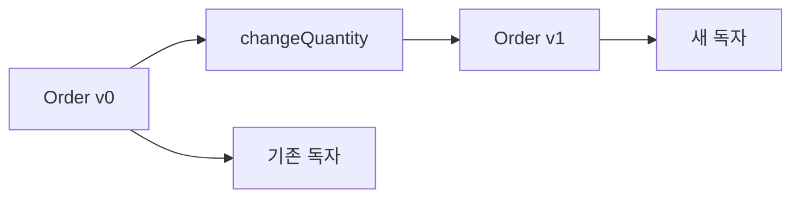

# 3장. Immutability


앞 장에서 입력과 출력의 경계를 분리했다면, 이제 입력값이 실행 도중 바뀌지 않는지 확인할 차례다.
불변성은 변수가 없는 프로그램을 뜻하지 않는다.
한 번 만든 값의 의미를 유지하면서 변화는 새로운 값 사이의 관계로 표현하는 설계다.

이 장에서는 주문의 품목 목록을 수정하는 작업을 일관된 예제로 사용한다.
원본 주문, 수정된 주문, 두 값을 동시에 가진 호출자의 관점을 차례로 살펴본다.
핵심 질문은 “이 코드에 대입문이 있는가?”가 아니라 “누가 같은 객체를 보고 있는가?”다.

---

## 1. 개념과 기본 구분

### 바인딩과 객체

바인딩은 이름과 값의 연결이다.
객체의 상태는 그 이름으로 접근하는 대상의 내용이다.
이름을 다른 객체에 연결하지 못하게 해도 대상의 내용까지 고정되는 것은 아니다.

```scala
val buffer = scala.collection.mutable.ArrayBuffer(1, 2)
buffer += 3
```

`buffer`라는 이름을 재할당하지 않았지만 배열 버퍼의 내용은 바뀌었다.
`val`은 참조의 재바인딩을 제한하는 장치이며 모든 도달 가능한 객체의 불변성을 뜻하지 않는다.
반면 불변 컬렉션의 갱신 연산은 기존 컬렉션을 바꾸지 않고 새 값을 돌려준다.

### 얕은 불변성과 깊은 불변성

레코드의 필드 재할당만 막으면 얕은 불변성이다.
필드가 가리키는 리스트와 그 안의 객체까지 변하지 않아야 깊은 불변성에 가까워진다.
이 구분은 하나의 객체가 아니라 도달 가능한 객체 그래프에 대한 구분이다.

```text
Order ──> items ──> Item
  이름       목록       품목 내용
```

주문 필드를 고정해도 `items`가 가변 리스트면 목록을 바꿀 수 있다.
목록을 고정해도 `Item`이 가변이면 단가나 수량을 바꿀 수 있다.
어떤 깊이까지 값으로 취급하는지 계약을 명시해야 한다.

### 불변성과 영속성

불변성은 기존 값이 바뀌지 않는 성질이다.
영속 자료구조는 갱신 후에도 이전 버전을 사용할 수 있는 자료구조다.
구조 공유는 그런 버전들을 효율적으로 구현하는 기법이다.
이 세 용어를 같은 뜻으로 사용하지 않는다.

전체 복사로 불변 갱신을 구현할 수도 있다.
그 경우 의미는 올바르더라도 시간과 메모리 비용이 클 수 있다.
구조 공유의 구체적 구현은 8부에서 다룬다.

---

## 2. 명령형 스타일과 함수형 스타일

### 별칭이 만드는 뜻밖의 변경

다음 Python 코드는 문제 상황을 보여 준다.
새 이름을 붙였다고 새 목록이 생기는 것은 아니다.

```python
original = [{"sku": "A", "quantity": 1}]
alias = original
alias.append({"sku": "B", "quantity": 2})

assert len(original) == 2
```

별칭을 가진 모든 사용자가 같은 변경을 본다.
호출자가 주문의 과거 상태를 보관했다고 생각해도 실제로는 현재 상태와 같은 객체를 보관했을 수
있다.
버그는 변경한 함수가 아니라 나중에 과거 상태를 읽는 함수에서 드러나기도 한다.

### 얕은 복사의 한계

```python
original = [{"sku": "A", "quantity": 1}]
shallow = original.copy()
shallow[0]["quantity"] = 9

assert original[0]["quantity"] == 9
```

바깥 리스트는 분리되었지만 내부 딕셔너리는 공유한다.
`copy()`라는 이름만 보고 전체 객체 그래프가 복사되었다고 판단하면 안 된다.
깊은 복사도 모든 객체의 의미를 올바르게 복제하는 만능 해결책은 아니다.
파일 핸들, 연결, 잠금 같은 자원은 단순한 값 복제와 다르다.

### 새 값을 만드는 갱신

불변 품목과 불변 목록으로 주문을 표현하면 변경은 새 주문의 생성이 된다.
기존 주문은 그대로 보관할 수 있다.
어떤 품목이 달라졌는지 두 값을 비교하기도 쉽다.

이제 갱신 함수는 “주문을 수정했다”는 부수효과보다 “수정된 주문을 반환했다”는 계약을 갖는다.
반환값을 사용하지 않으면 원본은 바뀌지 않는다.
호출자는 새 값을 채택할 책임을 명시적으로 가진다.

---

## 3. 왜 이 개념을 사용하는가?

### 시간에 따른 추론 비용

가변 객체를 읽을 때는 현재 값뿐 아니라 누가 언제 수정했는지 알아야 한다.
별칭이 많아질수록 가능한 변경 경로도 많아진다.
불변 값은 생성 이후의 변경 경로를 제거하여 그 추적 범위를 줄인다.

### 스냅샷과 감사

주문 수정 전후 값을 함께 보관하면 변경 기록을 만들기 쉽다.
견적을 계산할 때 사용한 입력을 보존하는 데도 유리하다.
다만 값이 불변이라는 사실만으로 데이터베이스에 영구 저장되지는 않는다.
메모리의 버전 보존과 디스크의 내구성은 다른 성질이다.

### 동시성

여러 실행 흐름이 동일한 불변 값을 읽는 동안에는 그 값의 갱신 때문에 읽기 결과가 달라지지 않는다.
그러나 어떤 새 버전을 현재 상태로 채택할지는 여전히 동기화가 필요한 문제다.
불변 주문을 만들어도 두 요청이 같은 이전 버전에서 각각 갱신하면 한 변경을 잃을 수 있다.

```text
버전 7 -> 요청 A -> 버전 8-A
버전 7 -> 요청 B -> 버전 8-B
```

이 충돌에는 버전 검사, 원자적 교체, 트랜잭션 같은 별도 규칙이 필요하다.
불변성은 공유 변경을 줄이지만 동시성 프로토콜을 대신하지 않는다.

### 디버깅

값이 바뀌지 않으면 로그에 기록한 입력과 이후 계산의 입력을 연결하기 쉽다.
그러나 개인정보와 대용량 객체를 무조건 로그에 남겨서는 안 된다.
불변 값도 민감정보를 포함할 수 있으며 보관 정책이 필요하다.

---

## 4. Scala에서의 표현

### Scala의 불변 주문

`case class`와 불변 `Vector`로 예제를 구성한다.
새 주문을 만드는 함수는 원본을 변경하지 않는다.
아래 프로그램의 객체 동일성 검사 대신 값의 동일성 검사에 주목하자.

<!-- executable:scala -->
```scala
object Chapter03:
  final case class Item(
    sku: String,
    quantity: Int,
    unitPrice: Long
  )

  final case class Order(
    id: String,
    items: Vector[Item],
    revision: Int
  )

  def changeQuantity(
    order: Order,
    sku: String,
    quantity: Int
  ): Order =
    require(quantity >= 0)
    val nextItems = order.items.map { item =>
      if item.sku == sku then
        item.copy(quantity = quantity)
      else
        item
    }
    if nextItems == order.items then order
    else order.copy(items = nextItems, revision = order.revision + 1)

  def append(order: Order, item: Item): Order =
    require(!order.items.exists(_.sku == item.sku))
    order.copy(
      items = order.items :+ item,
      revision = order.revision + 1
    )

  def total(order: Order): Long =
    order.items.map(i => i.unitPrice * i.quantity).sum

  def check(): Unit =
    val original = Order(
      "O-1",
      Vector(Item("A", 1, 1000), Item("B", 2, 500)),
      0
    )
    val changed = changeQuantity(original, "A", 3)
    val extended = append(changed, Item("C", 1, 200))

    assert(total(original) == 2000)
    assert(total(changed) == 4000)
    assert(total(extended) == 4200)
    assert(original.items.head.quantity == 1)
    assert(changed.items.head.quantity == 3)
    assert(original.revision == 0)
    assert(changed.revision == 1)
    assert(extended.revision == 2)
    assert(changeQuantity(original, "missing", 2) == original)
    assert(changeQuantity(changed, "A", 3) == changed)
```

### 사례의 정책을 읽는다

이 예제는 존재하지 않는 품목의 수량 변경을 아무 변화 없는 요청으로 처리한다.
실무에서는 오류를 반환하는 정책이 더 적절할 수 있다.
품목 코드의 유일성은 `append`에서 검사하지만 처음 생성된 주문에도 그 조건이 필요하다.
생성 경로를 제한하는 방법은 스마트 생성자 장에서 보강한다.

`revision`은 설명을 위한 버전 값이다.
이 필드가 있다는 사실만으로 낙관적 동시성 제어가 구현되지는 않는다.
저장 시점에 기대 버전과 실제 버전을 원자적으로 비교해야 한다.

### 복사와 공유

`copy`는 바뀐 필드만 지정해 새 레코드를 만들게 해 준다.
나머지 필드가 참조하는 값은 공유될 수 있다.
공유되는 값이 불변이면 이 공유가 과거 버전의 의미를 바꾸지 않는다.

---

## 5. 상태 변경보다 값 변환

### 갱신을 함수로 읽기

가변 설계에서는 메서드 호출 전후의 같은 객체를 비교해야 한다.
불변 설계에서는 입력 주문과 출력 주문을 별개의 값으로 비교한다.
이 차이는 테스트의 관측 지점을 단순하게 만든다.



기존 독자는 계속 `v0`을 볼 수 있다.
새 독자에게 `v1`을 전달하는 일은 호출자의 책임이다.
어느 버전을 현재 상태로 삼는지는 별도의 상태 관리 정책이다.

### 값의 동일성과 객체의 동일성

서로 다른 객체가 같은 필드 값을 가질 수 있다.
불변 모델에서는 대개 의미상 같은지 비교하는 값의 동일성이 중요하다.
메모리 주소나 참조 동일성에 의존하면 합법적인 복사와 구조 공유를 구분해야 하는 부담이 생긴다.

반대로 캐시나 UI 최적화는 참조 동일성을 빠른 힌트로 사용할 수 있다.
그때도 참조가 같다는 사실과 의미가 같다는 사실의 관계를 명확히 정의해야 한다.
예제의 정합성은 특정 구조 공유 구현에 의존하지 않는다.

---

## 6. 함수 합성과 데이터 흐름

### 갱신 함수의 연속 적용

하나의 갱신을 `Order => Order`로 표현하면 여러 갱신을 합성할 수 있다.
그러나 같은 타입이라고 해서 순서를 바꿔도 된다는 뜻은 아니다.
수량을 두 번 덮어쓰는 연산은 마지막 연산의 값이 남는다.

```scala
val setTwo: Chapter03.Order => Chapter03.Order =
  order => Chapter03.changeQuantity(order, "A", 2)

val setFive: Chapter03.Order => Chapter03.Order =
  order => Chapter03.changeQuantity(order, "A", 5)

val update = setTwo.andThen(setFive)
```

`update`는 최종 수량을 5로 만든다.
순서를 바꾸면 2가 된다.
불변성은 중간값을 보존하지만 연산의 교환법칙을 보장하지 않는다.

### 독립 필드의 갱신

서로 독립인 두 품목만 바꾸는 연산은 특정 조건에서 같은 최종 품목 목록을 만들 수 있다.
하지만 변경 이력이나 버전 증가 규칙까지 포함하면 관측 결과가 달라질 수 있다.
어떤 필드를 동등성에 포함하는지 먼저 정해야 한다.

이 관점은 Lens의 법칙을 이해할 때 다시 등장한다.
갱신 연산의 법칙은 단순한 문법보다 관측 모델과 도메인 정책에 달려 있다.

---

## 7. 장점과 트레이드오프

### 이득과 비용의 균형

| 항목 | 불변 모델의 이득 | 남는 문제 |
| --- | --- | --- |
| 과거 값 | 이전 버전 유지 | 메모리 보관 기간 |
| 함수 테스트 | 입력 보존 확인 | 전체 객체 그래프 검토 |
| 동시 읽기 | 공유 변경 감소 | 현재 버전의 원자적 교체 |
| 캐시 | 키의 안정성 | 캐시 크기와 정책 |
| 갱신 추적 | 전후 값 비교 | 큰 값의 비교 비용 |
| API 계약 | 반환값에 변경 표시 | 결과를 무시하는 호출자 |

### 복사 비용

단순한 배열이나 튜플을 매번 복사하면 갱신당 선형 비용을 지불할 수 있다.
갱신을 반복하면 전체 비용이 이차적으로 커지는 패턴도 생긴다.
불변 인터페이스를 유지하면서 내부에서 빌더를 사용하거나 적절한 영속 자료구조를 선택할 수 있다.

성능 판단에는 데이터 크기, 갱신 빈도, 오래된 버전의 생존 시간을 함께 고려한다.
“불변은 느리다”와 “구조 공유면 비용이 없다”는 모두 지나친 일반화다.
측정할 연산과 비교 대상을 먼저 정의해야 한다.

### 변경이 더 자연스러운 곳

장치 드라이버, 그래픽 버퍼, 외부 API의 상태 등은 변경 자체가 작업의 목적일 수 있다.
이런 경계까지 전부 값 복사로 감싸면 코드와 비용이 복잡해질 수 있다.
불변 모델은 변경을 금지하는 신념보다 변경 범위를 관리하는 선택지로 사용한다.

---

## 8. 상태와 부수효과의 경계

### 현재 주문을 저장하는 경계

불변 주문을 계산한 뒤 데이터베이스에 저장하는 일은 효과다.
함수가 새 주문을 반환했다고 저장이 완료된 것은 아니다.
계산 결과와 저장 결과를 같은 타입으로 혼동하지 않도록 주의한다.

```text
load(orderId) -> Order v7
update(v7)   -> Order v8
save(expected=7, next=v8) -> 저장 성공 또는 충돌
```

두 요청이 같은 버전 7을 읽었다면 둘 다 유효한 새 값을 계산할 수 있다.
저장 계층은 두 값 가운데 어떤 것을 받아들일지 판단해야 한다.
실패한 저장의 재시도는 최신 상태에서 정책을 다시 계산해야 할 수도 있다.

### 외부로 전달하는 값

불변 객체를 가변 라이브러리에 넘길 때는 어댑터에서 필요한 표현으로 변환한다.
그 라이브러리가 넘겨받은 배열을 수정하는지 계약을 확인한다.
반대로 외부 라이브러리의 가변 결과를 그대로 보관하면 내부 불변 모델의 가정이 깨질 수 있다.

### 수명과 메모리

이전 버전을 보관하는 참조가 남아 있으면 그 버전이 사용하는 데이터도 살아 있다.
구조 공유는 메모리를 줄이지만 참조가 유지하는 생존 범위까지 없애지는 않는다.
긴 이력과 큰 객체를 함께 보관하는 시스템에서는 제거 정책이 필요하다.

---

## 9. Python에서 적용하기

### Python의 불변 값 모델

튜플과 frozen 데이터 클래스를 조합한다.
품목 필드는 문자열과 정수라 공유해도 내용이 바뀌지 않는다.
`replace`는 새 데이터 클래스를 만들며 기존 객체를 수정하지 않는다.

<!-- executable:python -->
```python
from dataclasses import dataclass, replace


@dataclass(frozen=True)
class Item:
    sku: str
    quantity: int
    unit_price: int


@dataclass(frozen=True)
class Order:
    order_id: str
    items: tuple[Item, ...]
    revision: int = 0


def change_quantity(order: Order, sku: str, quantity: int) -> Order:
    if quantity < 0:
        raise ValueError("negative quantity")
    next_items = tuple(
        replace(item, quantity=quantity) if item.sku == sku else item
        for item in order.items
    )
    if next_items == order.items:
        return order
    return replace(order, items=next_items, revision=order.revision + 1)


def append_item(order: Order, item: Item) -> Order:
    if any(existing.sku == item.sku for existing in order.items):
        raise ValueError("duplicate sku")
    return replace(
        order,
        items=order.items + (item,),
        revision=order.revision + 1,
    )


def total(order: Order) -> int:
    return sum(item.quantity * item.unit_price for item in order.items)


def test_versions() -> None:
    original = Order("O-1", (Item("A", 1, 1000), Item("B", 2, 500)))
    changed = change_quantity(original, "A", 3)
    extended = append_item(changed, Item("C", 1, 200))

    assert total(original) == 2000
    assert total(changed) == 4000
    assert total(extended) == 4200
    assert original.items[0].quantity == 1
    assert changed.items[0].quantity == 3
    assert (original.revision, changed.revision, extended.revision) == (0, 1, 2)
    assert change_quantity(original, "missing", 2) == original


def test_update_order() -> None:
    original = Order("O-2", (Item("A", 1, 100),))
    two_then_five = change_quantity(change_quantity(original, "A", 2), "A", 5)
    five_then_two = change_quantity(change_quantity(original, "A", 5), "A", 2)
    assert two_then_five.items[0].quantity == 5
    assert five_then_two.items[0].quantity == 2
    assert original.items[0].quantity == 1


def test_shallow_copy_counterexample() -> None:
    original = [{"quantity": 1}]
    shallow = original.copy()
    shallow[0]["quantity"] = 9
    assert original[0]["quantity"] == 9


def test_noop() -> None:
    original = Order("O-3", (Item("A", 2, 100),))
    assert change_quantity(original, "A", 2) == original
    assert change_quantity(original, "A", 0).items[0].quantity == 0
    assert original.revision == 0


if __name__ == "__main__":
    test_versions()
    test_update_order()
    test_shallow_copy_counterexample()
    test_noop()
```

### 문법 모방이 아니라 같은 계약

Python 예제도 원본 보존, 새 버전 생성, 중복 품목 거부라는 같은 계약을 따른다.
언어 문법을 모방하는 대신 관측 가능한 동작을 비교한다.
튜플 연결은 새 튜플을 만들므로 대량의 반복 추가에는 비용을 확인해야 한다.

앞의 반례 테스트는 잘못된 구현을 제품 코드로 권장하는 것이 아니다.
얕은 복사의 공유 관계를 실행으로 확인하기 위해 남겼다.
예제에서 의도적인 실패 모델과 권장 구현을 구분하는 습관이 중요하다.

---

## 10. Python의 표현 한계

### `frozen`은 보안 경계가 아니다

`frozen=True`는 일반적인 필드 대입을 막는 편의 기능이다.
모든 우회 경로를 차단하는 메모리 보호나 보안 격리가 아니다.
악의적인 코드에 대해 절대 변경 불가능하다는 의미로 사용해서는 안 된다.

### 중첩 값의 책임

frozen 데이터 클래스 안에 가변 리스트가 들어가면 그 리스트는 여전히 바뀔 수 있다.
튜플 안의 원소도 가변 객체일 수 있다.
타입 설계와 생성 경계에서 도달 가능한 값의 성질을 확인해야 한다.

### `Final`과 실행 시점

타입 힌트의 `Final`은 정적 검사 도구가 재대입을 경고하도록 돕는다.
Python 실행기가 모든 변경을 자동으로 차단하는 기능은 아니다.
`Final`과 frozen 객체, 불변 내장 타입은 서로 다른 층의 장치다.

### 자동 구조 공유의 부재

표준 튜플과 데이터 클래스만으로 모든 갱신이 효율적인 영속 트리 연산이 되지는 않는다.
표준 기능의 비용 모델을 먼저 이해하고 필요할 때 별도 자료구조를 검토한다.
이 장의 작은 주문 예제는 특정 라이브러리의 성능을 주장하지 않는다.

---

## 11. 핵심 정리

### 이 장의 결론

이름의 재할당 제한과 객체의 불변성은 다르다.
얕은 복사는 바깥 컨테이너만 분리하며 중첩 객체는 공유될 수 있다.
불변 갱신은 이전 값을 보존하고 새 값을 반환한다.
동시 저장, 내구성, 보안 격리는 불변성과 별도의 계약이다.

### 연습 1: 객체 그래프 그리기

frozen 주문 안에 리스트가 있고, 그 리스트 안에 가변 품목이 있는 구조를 그려라.
주문, 리스트, 품목 가운데 무엇을 바꿀 수 있는지 구분하라.

**해설.** 주문 필드의 일반 재대입만 막힌다.
리스트의 추가와 삭제, 품목 내부 필드의 변경은 별도 제한이 없으면 가능하다.
깊은 불변성을 원하면 도달 가능한 각 층의 표현을 바꿔야 한다.

### 연습 2: 두 요청의 충돌

같은 버전 7을 읽은 요청 A와 B가 서로 다른 품목을 수정했다.
불변 객체를 사용했는데도 갱신 유실이 가능한 이유를 설명하라.

**해설.** 각각의 계산은 올바르지만 마지막 저장이 앞선 결과를 덮어쓸 수 있다.
저장 경계가 기대 버전을 검사하거나 도메인에 맞는 병합을 수행해야 한다.
불변성은 계산 중의 공유 변경을 막을 뿐 저장 순서를 조정하지 않는다.

### 연습 3: 복사 비용 추정

길이 `n`인 튜플 끝에 원소를 하나씩 추가하는 작업을 `n`번 반복한다고 하자.
매번 전체 참조 배열을 복사하는 모델에서 전체 복사량을 설명하라.

**해설.** 대략 `1 + 2 + ... + n`개의 참조를 복사하므로 이차적 증가가 나타난다.
내부 빌더로 모은 뒤 한 번 불변 값으로 바꾸거나 다른 자료구조를 고려할 수 있다.
실제 측정에서는 할당, 캐시, 원소 크기를 따로 구분한다.

### 연습 4: 무변경 요청의 버전

같은 수량을 다시 지정할 때 버전을 증가시키는 설계와 유지하는 설계를 비교하라.
어느 쪽이 언제 적절한지 설명하라.

**해설.** 상태 변화의 버전이면 유지가 자연스러울 수 있다.
요청 처리 이력을 세는 번호라면 증가가 필요할 수 있다.
두 의미를 하나의 필드에 섞지 말고 상태 버전과 감사 이벤트를 구분한다.

### 다음 장과의 연결

불변 값은 표현식을 결과값으로 바꾸어 읽는 추론을 돕는다.
다음 장은 그 치환이 언제 의미를 보존하는지 살펴본다.
“같은 객체”와 “같은 값”의 구분이 참조 투명성의 예제를 이해하는 출발점이 된다.

### 참고 자료

[Scala 공식 문서: Immutable Values](https://docs.scala-lang.org/scala3/book/fp-immutable-values.html)는 `val`과 불변 데이터의 구분을 설명한다.
[Python 공식 문서: dataclasses](https://docs.python.org/3.14/library/dataclasses.html)는 frozen 인스턴스의 제한을 설명한다.
[Python 공식 문서: copy](https://docs.python.org/3.14/library/copy.html)는 얕은 복사와 깊은 복사를 구분한다.
