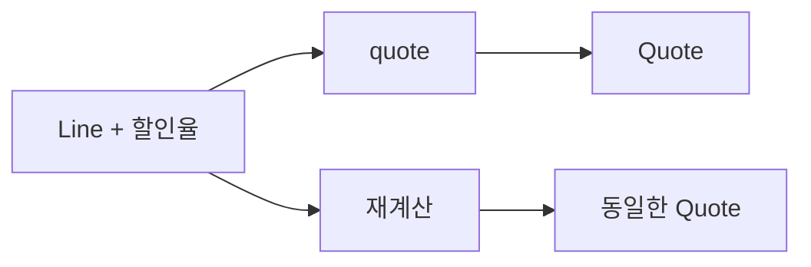

# 2장. Pure Functions


앞 장에서는 계산을 값으로 읽는 방법을 배웠다.
이번 장은 그 값이 언제 믿을 만한지를 묻는다.
같은 주문으로 견적을 두 번 계산했는데 결과가 다르다면, 입력에 드러나지 않은 무언가가 계산에
참여한 것이다.
순수 함수는 그런 숨은 참여자를 찾아 함수의 경계를 다시 그리는 도구다.

이 장의 예제에서는 원화와 같은 최소 화폐 단위의 정수를 사용한다.
할인율은 10,000분율인 basis point로 나타낸다.
외부 결제 시스템을 구현하려는 예제가 아니라 계산과 관측을 분리하는 연습이다.

---

## 1. 개념과 기본 구분

### 같은 인자만으로 충분한가?

순수 함수는 명시된 입력과 고정된 정의만으로 결과를 결정하고, 호출자가 관측할 수 있는 외부 상태를
변경하지 않는 함수다.
동일 입력에 동일 결과라는 조건과 외부 효과가 없다는 조건은 함께 필요하다.
항상 `0`을 반환하면서 파일을 삭제하는 함수는 첫 조건만 만족한다.
아무것도 쓰지 않더라도 현재 시간을 읽는 함수는 시간이라는 숨은 입력에 의존한다.

```text
순수 계산:       입력 값 ──> 계산 ──> 결과 값
숨은 읽기:      입력 값 + 현재 환경 ──> 결과 값
관측 가능한 쓰기: 입력 값 ──> 결과 값 + 외부 변화
```

### 결정성, 순수성, 전체성

결정성은 같은 조건에서 같은 실행 결과가 나온다는 성질이다.
순수성은 환경과 상호작용하지 않는다는 경계에 관한 성질이다.
전체성은 허용한 모든 입력에서 결과를 내고 종료한다는 성질이다.
이 셋은 서로 관련되지만 같은 말은 아니다.

`n / 0`은 외부 상태를 쓰지 않아도 정상적인 결과값을 만들지 못한다.
무한 재귀도 외부 효과 없이 종료하지 않을 수 있다.
이 책에서는 실패 가능성을 설명할 때 순수하다는 말로 전체성을 대신하지 않는다.
실패가 예상되는 함수는 이후 장에서 `Either` 같은 결과 타입으로 정의역을 명확히 한다.

### 관측 범위를 먼저 정한다

함수 안에서 지역 배열을 만들고 채운 다음 불변 결과만 반환할 수 있다.
배열이 외부로 누출되지 않고 다른 호출과 공유되지 않으면 그 내부 변경은 호출자의 관점에서 감춰질
수 있다.
따라서 소스 코드에 대입문이 있다는 이유만으로 외부 순수성을 부정할 수는 없다.
반대로 `val`로 선언한 참조가 공유 가변 객체를 가리키면 외부 변화가 발생할 수 있다.

실행 시간과 메모리 사용량까지 모든 관측을 같게 만들겠다는 뜻도 아니다.
통상적인 순수성 논의는 프로그램의 값과 효과에 관한 관측 모델을 전제한다.
성능과 보안의 부채널 분석은 별도의 요구사항이다.

---

## 2. 명령형 스타일과 함수형 스타일

### 숨은 가격표를 읽는 견적

다음 Scala 조각은 문제를 보여 주기 위한 예제다.
가격표가 전역 상태이면 함수의 타입에 의존성이 드러나지 않는다.

```scala
var currentUnitPrice = 1000
var totalCalls = 0

def quoteHidden(quantity: Int): Int =
  totalCalls += 1
  quantity * currentUnitPrice

val first = quoteHidden(2)
currentUnitPrice = 1200
val second = quoteHidden(2)
```

두 호출의 인자는 모두 `2`이지만 결과는 다르다.
또한 호출 횟수도 바뀐다.
이 함수의 테스트는 전역 가격표와 호출 횟수의 초기화 순서에 의존한다.

### 입력을 값으로 끌어낸다

```scala
def quoteExplicit(unitPrice: Int, quantity: Int): Int =
  unitPrice * quantity

val first = quoteExplicit(1000, 2)
val second = quoteExplicit(1200, 2)
```

이제 다른 결과를 설명하는 입력이 모두 호출 지점에 보인다.
가격표를 읽는 일은 없어지지 않았다.
다만 가격 조회와 견적 계산이 다른 함수의 책임이 되었다.

이 구분은 단순히 인자를 많이 만드는 리팩터링이 아니다.
견적 시점에 적용된 가격을 기록하고 재현할 수 있게 하는 설계다.
현재 가격이 바뀌어도 과거 견적은 당시의 입력으로 다시 계산할 수 있다.

### 잘못된 개선

전역 가격표를 객체 필드로 옮기기만 하면 숨은 의존성이 사라지지 않는다.
객체가 언제 생성되었고 그 필드가 언제 바뀌는지를 여전히 알아야 한다.
클로저로 감싸도 캡처된 값이 가변이면 같은 문제가 남는다.
핵심은 클래스의 유무가 아니라 관측 가능한 입력의 완전성이다.

---

## 3. 왜 이 개념을 사용하는가?

### 재현 가능한 업무 규칙

청구 오류를 조사할 때 가장 먼저 필요한 것은 입력과 규칙의 버전이다.
순수 함수는 이를 자연스럽게 요구한다.
단가, 수량, 할인율이 같으면 견적이 같아야 한다는 계약을 작은 단위에서 확인할 수 있다.

시간 의존 할인도 순수하게 계산할 수 있다.
현재 시각을 함수 안에서 읽지 말고 기준 시각을 입력으로 받는다.
테스트는 자정 직전과 직후를 기다리지 않고 두 시각을 값으로 전달하면 된다.

### 테스트의 독립성

외부 상태를 사용하지 않는 테스트는 다른 테스트가 무엇을 실행했는지 알 필요가 적다.
데이터베이스 정리나 네트워크 준비 없이 경계값을 조밀하게 검사할 수 있다.
이것이 모든 테스트를 단위 테스트로 대체한다는 뜻은 아니다.
가격 조회, 저장, 통신의 정확성은 경계의 통합 테스트로 확인해야 한다.

### 계산을 재배치할 수 있는 근거

순수 계산은 결과가 사용되지 않을 때 생략하거나, 같은 입력의 결과를 재사용할 여지가 있다.
그러나 언어 구현이 실제로 그러한 최적화를 수행한다는 보장은 아니다.
캐시 정책과 메모리 비용은 개발자가 별도로 판단할 문제다.

동시 실행 역시 저절로 생기지 않는다.
공유 상태가 없으면 데이터 경합을 줄일 수 있지만 실행기와 자원 제한은 여전히 필요하다.
순수성은 병렬화를 검토할 근거이지 처리 속도의 보증서가 아니다.

### 적용할 질문

가격 정책을 검토할 때는 먼저 함수가 현재 시각을 읽는지 묻는다.
그다음 난수, 전역 설정, 데이터베이스, 공유 컬렉션을 확인한다.
결과에 영향을 주는 값을 발견하면 명시적 입력으로 옮길 수 있는지 검토한다.
외부 작업 자체는 바깥 계층에 남겨 둔다.

---

## 4. Scala에서의 표현

### 불변 견적 모델

다음 프로그램은 독립적으로 실행할 수 있는 Scala 예제다.
`Quote`는 계산 결과이며 저장된 주문이나 결제 완료 상태를 의미하지 않는다.
검증 실패는 여기서는 `require`로 드러내고, 오류를 값으로 다루는 설계는 4부에서 확장한다.

<!-- executable:scala -->
```scala
object Chapter02:
  final case class Line(
    unitPrice: Long,
    quantity: Int
  )

  final case class Quote(
    subtotal: Long,
    discount: Long,
    payable: Long
  )

  def quote(line: Line, discountBps: Int): Quote =
    require(line.unitPrice >= 0)
    require(line.unitPrice <= 1000000000L)
    require(line.quantity >= 0)
    require(line.quantity <= 1000000)
    require(discountBps >= 0 && discountBps <= 10000)

    val subtotal = line.unitPrice * line.quantity
    val discount =
      (BigInt(subtotal) * discountBps / 10000).toLong

    Quote(
      subtotal = subtotal,
      discount = discount,
      payable = subtotal - discount
    )

  def total(lines: List[Line], discountBps: Int): Long =
    lines.map(line => quote(line, discountBps).payable).sum

  def check(): Unit =
    val line = Line(1500, 4)
    val original = line.copy()
    val a = quote(line, 1000)
    val b = quote(line, 1000)

    assert(a == Quote(6000, 600, 5400))
    assert(a == b)
    assert(line == original)
    assert(quote(Line(0, 3), 0).payable == 0)
    assert(quote(Line(100, 0), 0).payable == 0)
    assert(quote(Line(100, 1), 10000).payable == 0)
    assert(total(List.empty, 0) == 0)
    assert(total(List(line, line), 1000) == 10800)
```

### 산술 경계도 계약이다

`Long`의 범위를 무시하면 결정적이지만 틀린 계산을 얻을 수 있다.
단가와 수량의 상한을 명시하고 할인 중간값은 `BigInt`로 계산했다.
상한은 이 예제의 가정이며 실제 서비스의 정책이 아니다.
정확한 금액 처리에는 통화별 최소 단위와 반올림 규칙을 따로 정해야 한다.

정수 나눗셈은 양수 할인액의 소수 부분을 버린다.
품목마다 버리는지 전체 합계에서 한 번 버리는지는 서로 다른 정책이다.
순수 함수는 정책을 선명하게 표현할 뿐 어떤 정책이 법적·회계적으로 옳은지 결정하지 않는다.

### 읽어야 할 타입

`Line`과 할인율이 입력이며 `Quote`가 출력이다.
파일 핸들, 저장소, 시계, HTTP 클라이언트는 나타나지 않는다.
하지만 타입 모양만으로 함수 본문이 순수하다고 증명되지는 않는다.
Scala에서는 본문이 외부 효과를 수행할 수 있으므로 구현과 경계를 함께 검토해야 한다.

---

## 5. 상태 변경보다 값 변환

### 값의 이력과 계산의 이력

계산 결과를 새 값으로 반환하면 이전 견적을 유지할 수 있다.
기존 견적의 `payable`만 덮어쓰면 어떤 할인 규칙이 적용되었는지 잃기 쉽다.
입력과 결과를 함께 보관하면 정책 변경 전후를 비교하기 쉬워진다.



여기서 그림의 두 화살표는 실제로 두 번 저장한다는 뜻이 아니다.
같은 입력에서 같은 결과를 얻는 관계를 나타낸다.
결과 저장은 뒤에서 다루는 효과의 경계에 속한다.

### 변경을 허용할 위치

큰 컬렉션을 효율적으로 만들기 위해 함수 내부에서 빌더를 사용할 수 있다.
다만 빌더를 전역 변수에 보관하거나 반환값에 그대로 노출하면 공유 상태가 된다.
순수한 인터페이스를 유지하려면 생성 중인 상태의 소유 범위를 명확히 해야 한다.

입력을 복사했다고 해서 자동으로 격리되는 것도 아니다.
얕은 복사는 중첩된 리스트나 객체를 공유한다.
불변성 장에서는 이 차이를 객체 그래프로 분석한다.

---

## 6. 함수 합성과 데이터 흐름

### 순수 함수 두 개의 연결

견적을 만든 뒤 표시 문자열을 만드는 함수도 입력에만 의존하도록 구성할 수 있다.
통화 기호, 언어, 반올림 정책을 전역 설정에서 읽는 대신 인자로 받으면 표시 계산 역시 재현
가능하다.

```scala
def payableLabel(amount: Long, currency: String): String =
  s"$amount $currency"

val label = payableLabel(5400, "KRW")
```

반면 문자열을 반환하면서 로그를 출력한다면 그 함수는 순수한 포매터가 아니다.
로그가 필요한 곳에서 포매터의 결과를 출력하도록 책임을 분리한다.
작은 함수의 합성이 예측 가능하려면 각 구성 요소의 효과 계약이 맞아야 한다.

### 실패하는 계산의 연결

순수 함수라도 정의역을 벗어난 입력에서 예외를 던질 수 있다.
`quote`의 전제조건을 만족하지 않는 데이터를 바로 연결하면 합성 전체가 중단된다.
따라서 외부 입력은 먼저 검증하거나 파싱해야 한다.

```text
문자열 입력
  -> 형식 파싱
  -> 범위 검사
  -> Line
  -> Quote
  -> 표시용 값
```

지금 단계에서는 연결 순서만 이해하면 된다.
4부의 `Either`는 실패 가능성을 연결 연산 자체에 포함한다.
순수성은 그 실패 모델을 대신하지 않는다.

---

## 7. 장점과 트레이드오프

### 얻는 것

입력과 출력이 명확해지면 버그 재현 자료가 작아진다.
정책 변경 전후를 같은 입력 집합에 적용하여 차이를 비교할 수 있다.
계산 함수만 떼어 새로운 서비스나 배치 작업에서 재사용하기도 쉽다.

### 지불하는 것

환경에서 읽던 정보를 인자로 전달해야 하므로 경계의 코드가 늘 수 있다.
새 값을 만드는 비용과 오래된 버전을 보관하는 비용도 생긴다.
입력 객체가 지나치게 커지면 실제 의존성이 다시 흐려진다.

| 설계 선택 | 이득 | 주의할 비용 |
| --- | --- | --- |
| 기준 시각을 입력으로 전달 | 시간 경계 테스트 | 시각의 일관된 수집 |
| 가격 스냅샷을 전달 | 과거 견적 재현 | 스냅샷 저장과 버전 관리 |
| 결과를 새 값으로 반환 | 이전 결과 보존 | 할당과 보관 비용 |
| 작은 계산으로 분리 | 개별 규칙 검증 | 지나친 함수 분할 |
| 캐시를 경계에 배치 | 반복 계산 절감 | 키와 무효화 정책 |

### 불필요한 추상화를 피한다

덧셈 한 번을 수행하는 함수마다 별도 인터페이스와 객체 계층을 만들 필요는 없다.
규칙의 이름과 테스트 경계가 실제로 유용할 때 분리한다.
순수 함수라는 목표가 코드 탐색 비용을 무제한 늘려도 된다는 허가는 아니다.

짧은 명령형 루프가 가장 읽기 좋은 구현일 수도 있다.
중요한 기준은 외부와의 계약이며 문법의 유행이 아니다.

---

## 8. 상태와 부수효과의 경계

### 순수한 핵심과 효과가 있는 외곽

실제 견적 서비스는 가격을 조회하고 계산한 뒤 저장한다.
외부 작업을 없앨 수 없으므로 경계를 분리한다.
계산이 성공했다는 사실과 저장이 성공했다는 사실은 다른 상태다.

```text
가격 조회: 실패하거나 지연될 수 있음
견적 계산: 입력에 의해 결정됨
견적 저장: 실패하거나 중복될 수 있음
응답 전송: 저장 후에도 실패할 수 있음
```

응답이 유실되어 같은 요청이 재전송되면 순수 계산은 같은 결과를 낼 수 있다.
그러나 저장이나 결제가 중복되지 않는다는 보장은 별도로 필요하다.
멱등성 키, 트랜잭션, 재시도 범위는 효과 경계의 문제다.

### 시계와 난수의 위치

시각을 입력으로 전달하면 정책의 시간 의존성이 명시된다.
난수도 시드나 난수 결과를 입력으로 전달할 수 있다.
다만 보안용 난수를 임의의 결정적 생성기로 바꾸는 것은 다른 요구사항을 훼손할 수 있다.
순수성 확보와 보안 강도는 별도로 검토해야 한다.

### 감사 로그의 위치

계산이 만든 설명 정보를 반환값에 포함할 수 있다.
예를 들어 적용된 할인 규칙 이름과 계산 근거를 값으로 반환한다.
그 설명을 실제 로그 저장소에 쓰는 일은 호출자가 담당한다.
이 접근은 Writer 장에서 다시 다룬다.

---

## 9. Python에서 적용하기

### 독립 실행 예제

Python에서도 함수의 계약을 같은 방식으로 설계할 수 있다.
아래 코드는 외부 패키지 없이 실행된다.
`frozen=True`만으로 모든 중첩 객체가 불변이 되는 것은 아니지만 여기의 필드는 정수뿐이다.

<!-- executable:python -->
```python
from dataclasses import dataclass


@dataclass(frozen=True)
class Line:
    unit_price: int
    quantity: int


@dataclass(frozen=True)
class Quote:
    subtotal: int
    discount: int
    payable: int


def quote(line: Line, discount_bps: int) -> Quote:
    if not 0 <= line.unit_price <= 1_000_000_000:
        raise ValueError("unit_price out of range")
    if not 0 <= line.quantity <= 1_000_000:
        raise ValueError("quantity out of range")
    if not 0 <= discount_bps <= 10_000:
        raise ValueError("discount_bps out of range")

    subtotal = line.unit_price * line.quantity
    discount = subtotal * discount_bps // 10_000
    return Quote(
        subtotal=subtotal,
        discount=discount,
        payable=subtotal - discount,
    )


def total(lines: tuple[Line, ...], discount_bps: int) -> int:
    return sum(quote(line, discount_bps).payable for line in lines)


def test_reproducible() -> None:
    line = Line(1500, 4)
    first = quote(line, 1000)
    second = quote(line, 1000)
    assert first == Quote(6000, 600, 5400)
    assert first == second
    assert line == Line(1500, 4)


def test_boundaries() -> None:
    assert quote(Line(0, 3), 0).payable == 0
    assert quote(Line(100, 0), 0).payable == 0
    assert quote(Line(100, 1), 10_000).payable == 0
    assert quote(Line(101, 1), 1000).payable == 91
    assert total((), 0) == 0


def test_invariants() -> None:
    for price in range(0, 50):
        for quantity in range(0, 5):
            for rate in (0, 1, 3333, 9999, 10_000):
                result = quote(Line(price, quantity), rate)
                assert result.subtotal == price * quantity
                assert 0 <= result.discount <= result.subtotal
                assert result.payable + result.discount == result.subtotal


def test_rejection() -> None:
    invalid = (
        (Line(-1, 1), 0),
        (Line(1, -1), 0),
        (Line(1, 1), 10_001),
    )
    for line, rate in invalid:
        try:
            quote(line, rate)
        except ValueError:
            continue
        raise AssertionError("invalid input was accepted")


if __name__ == "__main__":
    test_reproducible()
    test_boundaries()
    test_invariants()
    test_rejection()
```

### 테스트 결과가 말하는 범위

반복 검사에서는 작은 유한 입력 영역을 탐색한다.
이는 모든 정수 입력에 대한 수학적 증명이 아니다.
하지만 예제값 하나만 확인하는 것보다 할인 경계와 산술 불변식을 더 넓게 검사한다.

`payable + discount == subtotal`은 결과들 사이의 관계다.
이런 관계를 먼저 적으면 구현이 바뀌어도 유지해야 할 계약을 알 수 있다.
함수 본문을 그대로 복사한 기대값 계산만 쓰면 동일한 버그를 테스트에 옮길 위험이 있다.

---

## 10. Python의 표현 한계

### 타입 힌트는 효과 검사가 아니다

`def quote(...) -> Quote`라는 주석은 외부 I/O를 막지 않는다.
개발자가 본문에 로그 출력이나 데이터베이스 조회를 추가할 수 있다.
표준 Python 타입 힌트는 순수 함수라는 보증을 표현하거나 강제하지 않는다.

### 값의 종류까지 검증하지는 않았다

예제는 타입 힌트를 따르는 내부 호출자를 전제로 한다.
네트워크에서 들어온 값이 진짜 정수인지 검증하는 기능은 별도다.
특히 Python의 `bool`은 `int`의 하위 타입이므로 엄격한 숫자 입력 정책에는 추가 판단이 필요하다.

### 예외와 전체성

입력 범위를 벗어나면 예외가 발생한다.
따라서 이 예제는 범위가 명시된 부분 함수로 읽어야 한다.
사용자 오류를 정상 결과로 다루려면 `Ok | Err` 같은 합 타입을 도입할 수 있다.
그 구현은 오류 처리 장의 주제다.

### 프레임워크의 경계

ORM 모델을 그대로 입력으로 받으면 속성 접근이 조회를 일으킬 수 있다.
계산을 순수하게 보이게 만드는 타입 주석만으로 지연 로딩을 제거할 수 없다.
필요한 필드를 먼저 평범한 값으로 읽고, 그 스냅샷을 계산에 전달하는 편이 경계를 명확히 한다.

---

## 11. 핵심 정리

### 이 장의 결론

순수성은 같은 결과라는 성질과 외부 효과가 없다는 성질을 함께 요구한다.
시간, 난수, 전역 설정도 결과를 바꾸면 입력의 일부다.
순수 함수는 효과를 제거하기보다 계산과 효과의 책임을 구분한다.
불변 데이터는 그 구분을 유지하는 데 도움이 되지만 두 개념이 동일하지는 않다.

### 연습 1: 할인 정책의 단위

두 품목의 가격이 각각 15이고 할인율이 10%라고 하자.
품목별 할인 후 합산과 합산 후 할인 결과를 각각 계산하라.
어떤 함수의 입력과 출력에 정책 차이를 드러낼지 설명하라.

**해설.** 품목별 정수 할인은 각 1이므로 최종 합계는 28이다.
합계 30에 대한 할인은 3이므로 최종 합계는 27이다.
반올림 지점을 명시한 정책을 함수 이름이나 정책 값으로 구분해야 한다.
순수성만으로 이 둘 중 하나를 선택할 수는 없다.

### 연습 2: 오늘의 할인

함수 내부에서 오늘 날짜를 읽는 코드를 순수한 핵심과 효과 경계로 분리하라.
날짜를 여러 번 읽을 때 자정을 지나면 생길 수 있는 문제도 설명하라.

**해설.** 경계에서 기준 날짜를 한 번 수집하고 계산 함수에 전달한다.
여러 규칙이 같은 기준 날짜를 사용하도록 스냅샷을 공유한다.
기준 시간대 역시 정책 입력 또는 고정 계약으로 명시한다.

### 연습 3: 지역 리스트

함수 내부에서 새 리스트에 결과를 추가한 뒤 튜플로 반환하면 반드시 비순수한가?
입력 리스트를 그대로 수정하는 경우와 비교하라.

**해설.** 지역 리스트가 외부와 공유되지 않으면 내부 변경을 외부에서 관측하지 못할 수 있다.
입력 리스트를 수정하면 호출자가 가진 별칭을 통해 변화가 보인다.
소스의 대입문 수보다 객체의 공유 관계가 중요하다.

### 연습 4: 테스트의 빈틈

동일 입력을 두 번 호출하는 테스트만으로 순수성을 증명할 수 있는가?
항상 같은 숫자를 반환하며 파일에 로그를 추가하는 함수를 반례로 들어라.

**해설.** 반환값의 동일성은 외부 효과의 부재를 검사하지 않는다.
경계 설계, 코드 검토, 효과를 감지하는 테스트를 함께 사용해야 한다.
테스트는 관측한 실행에 대한 증거이며 모든 실행에 대한 일반 증명은 아니다.

### 다음 장과의 연결

다음 장은 함수가 다루는 값 자체가 언제 바뀔 수 있는지 설명한다.
순수한 계산이라도 호출자가 입력 객체를 동시에 수정하면 안정적인 스냅샷을 전제할 수 없다.
불변성과 별칭을 이해하면 순수 함수의 경계가 더 분명해진다.

### 참고 자료

[Scala 공식 문서: Pure Functions](https://docs.scala-lang.org/scala3/book/fp-pure-functions.html)는 순수 함수의 언어적 설명을 제공한다.
[Python 공식 문서: dataclasses](https://docs.python.org/3.14/library/dataclasses.html)는 `frozen`의 동작과 제한을 설명한다.
이 장의 견적 규칙, 계산 예제, 테스트와 연습 해설은 이 책을 위해 구성했다.
