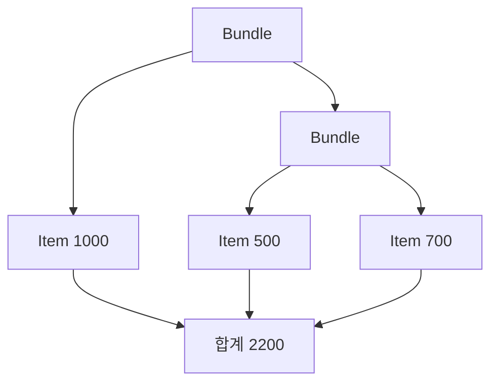

# 8장. Recursion


재귀는 문제를 더 작은 같은 형태의 문제로 정의하는 방법이다.
반복문을 금지하는 문법 규칙이 아니라 데이터와 계산의 구조를 맞추는 도구다.
이번 장에서는 주문 묶음 트리의 합계를 계산하면서 종료 조건과 호출 스택을 함께 분석한다.

앞 장들이 함수와 환경을 다뤘다면 이번 장은 함수 호출 사이에 남는 일을 다룬다.
재귀식이 간단해 보여도 미완료 계산이 많이 쌓이면 스택 비용이 커질 수 있다.
Scala의 꼬리 재귀 검사와 Python의 명시적 스택을 비교하여 의미와 실행 전략을 분리한다.

---

## 1. 개념과 기본 구분

### 기저 사례와 재귀 단계

재귀 정의에는 더 작게 나눌 필요가 없는 기저 사례가 있다.
나머지 경우는 더 작은 입력에 같은 계산을 적용하고 결과를 조합한다.
종료를 설명하려면 무엇이 줄어드는지 말할 수 있어야 한다.

```text
트리 합계
  잎: 저장된 금액
  묶음: 각 자식의 합계를 모두 더한 값
```

자식으로 내려갈 때 남은 트리의 구조가 작아진다는 가정이 중요하다.
순환 참조가 있는 그래프는 같은 논리로 종료를 보장하지 못한다.
트리와 그래프를 구분하고 필요하면 방문 집합을 사용해야 한다.

### 직접 재귀와 상호 재귀

직접 재귀는 함수가 자신을 호출한다.
상호 재귀는 여러 함수가 서로를 통해 다시 호출한다.
언어의 최적화와 검사 기능은 이 둘을 다르게 취급할 수 있다.

### 꼬리 위치

재귀 호출의 결과를 받은 뒤 더 할 일이 없으면 그 호출은 꼬리 위치에 있다.
`n * factorial(n - 1)`은 곱셈이 남아 있으므로 꼬리 호출이 아니다.
누적값을 인자로 전달하면 미완료 곱셈을 데이터로 옮길 수 있다.

### 종료와 스택 안전성

입력이 줄어들어 결국 종료한다는 사실과 실행 중 스택이 넘치지 않는다는 사실은 다르다.
유한하지만 매우 깊은 트리도 호출 스택을 넘길 수 있다.
종료 논증과 자원 비용 분석을 별도로 수행해야 한다.

---

## 2. 명령형 스타일과 함수형 스타일

### 반복문의 상태

반복문에서는 현재 위치와 누적값을 변수로 유지한다.
재귀에서는 같은 정보를 매개변수와 호출 관계로 표현할 수 있다.
두 방식 모두 같은 수학적 계산을 구현할 수 있다.

```scala
def sumLoop(values: List[Int]): Long =
  var total = 0L
  for value <- values do
    total += value
  total
```

이 구현은 지역 누적값을 변경한다.
외부 입력을 수정하지 않으므로 호출자에게는 값 계산으로 제공할 수 있다.
재귀보다 덜 함수형이라는 이유만으로 배제할 필요는 없다.

### 구조적 재귀

```scala
def sumRecursive(values: List[Int]): Long =
  values match
    case Nil => 0L
    case head :: tail => head.toLong + sumRecursive(tail)
```

리스트의 생성자와 함수의 경우가 대응한다.
빈 목록은 기저 사례이고 `head :: tail`은 원소와 더 작은 목록으로 분해된다.
하지만 덧셈이 남아 있으므로 이 구현은 꼬리 재귀가 아니다.

### 누적값으로 바꾸기

```text
sum([1,2,3])
  = 1 + sum([2,3])
  = 1 + 2 + sum([3])

loop([1,2,3], 0)
  -> loop([2,3], 1)
  -> loop([3], 3)
  -> loop([], 6)
```

두 번째 표현은 남은 계산을 누적값에 담는다.
언어가 해당 꼬리 호출을 최적화할 때 스택 프레임을 재사용할 수 있다.
문법 변환만으로 모든 언어에서 최적화가 발생하는 것은 아니다.

---

## 3. 왜 이 개념을 사용하는가?

### 데이터 구조와 계산 구조의 일치

트리와 재귀적인 문법 구조는 재귀 함수로 자연스럽게 읽히는 경우가 많다.
각 생성자에 대한 처리를 빠뜨리지 않도록 패턴 매칭과 함께 사용할 수 있다.
재귀 호출의 결과를 조합하는 방식도 데이터 구조에 맞춰 설명하기 쉽다.

### 증명의 구조

기저 사례에서 성질이 성립하고 더 작은 입력에서 성립한다고 가정하여 큰 입력을 설명할 수 있다.
이것이 구조적 귀납법의 직관이다.
테스트는 유한 사례를 확인하지만 귀납적 설명은 왜 일반적으로 성립하는지의 근거를 제공한다.

### 분할 정복

문제를 독립적인 하위 문제로 나누고 결과를 합치는 알고리즘은 재귀적으로 표현하기 좋다.
다만 하위 문제가 겹치면 같은 계산을 반복할 수 있다.
메모이제이션은 그런 중복 계산을 줄이는 별도 기법이다.

### 재귀가 불필요한 경우

단순한 선형 순회는 반복문이나 `fold`가 더 명확할 수 있다.
특히 Python에서는 깊이가 입력 크기에 비례하는 재귀를 신중하게 사용한다.
목표는 재귀 호출 수를 늘리는 것이 아니라 문제 구조를 정확히 표현하는 것이다.

### 비용을 이름 붙인다

입력 크기, 최대 깊이, 방문 노드 수, 중간 결과 크기를 따로 분석한다.
트리의 노드 수가 같아도 균형 트리와 한쪽으로 치우친 트리의 깊이는 다르다.
실행 시간과 최대 스택 사용량은 같은 척도가 아니다.

---

## 4. Scala에서의 표현

### Scala의 꼬리 재귀와 트리 순회

다음 프로그램은 리스트 합계의 꼬리 재귀와 트리의 일반 재귀를 대비한다.
`@tailrec`는 해당 메서드가 꼬리 재귀 최적화 가능한 형태인지 컴파일러가 확인하게 한다.
일반 트리 재귀가 자동으로 같은 보장을 얻는 것은 아니다.

<!-- executable:scala -->
```scala
object Chapter08:
  import scala.annotation.tailrec

  enum Basket:
    case Item(amount: Long)
    case Bundle(children: List[Basket])

  def sumList(values: List[Int]): Long =
    @tailrec
    def loop(rest: List[Int], total: Long): Long =
      rest match
        case Nil => total
        case head :: tail => loop(tail, total + head)
    loop(values, 0L)

  def totalRecursive(basket: Basket): Long =
    basket match
      case Basket.Item(amount) => amount
      case Basket.Bundle(children) =>
        children.map(totalRecursive).sum

  def totalStack(basket: Basket): Long =
    @tailrec
    def loop(pending: List[Basket], total: Long): Long =
      pending match
        case Nil => total
        case Basket.Item(amount) :: rest =>
          loop(rest, total + amount)
        case Basket.Bundle(children) :: rest =>
          loop(children ::: rest, total)
    loop(List(basket), 0L)

  def factorial(n: Int): BigInt =
    require(n >= 0)
    @tailrec
    def loop(remaining: Int, result: BigInt): BigInt =
      if remaining == 0 then result
      else loop(remaining - 1, result * remaining)
    loop(n, BigInt(1))

  def check(): Unit =
    import Basket.*
    val basket = Bundle(List(
      Item(1000),
      Bundle(List(Item(500), Item(700))),
      Bundle(Nil)
    ))
    assert(sumList(Nil) == 0)
    assert(sumList(List(1, 2, 3)) == 6)
    assert(totalRecursive(basket) == 2200)
    assert(totalStack(basket) == 2200)
    assert(totalStack(Bundle(Nil)) == 0)
    assert(factorial(0) == 1)
    assert(factorial(5) == 120)
    assert(sumList((1 to 100000).toList) == 5000050000L)
```

### 명시적 대기 목록

`totalStack`의 `pending`은 아직 방문하지 않은 노드들이다.
호출 스택에 숨겨지던 작업을 값으로 표현한다.
꼬리 재귀가 최적화되어도 대기 목록 자체의 메모리 비용은 남는다.

### 복잡도 읽기

노드를 한 번씩 방문하면 기본 방문 시간은 노드 수에 비례한다.
여기서 자식 목록을 앞에 붙이는 비용도 자식 수에 비례하여 전체 간선 수 안에서 분석할 수 있다.
최대 대기 목록 크기는 트리의 모양과 순회 순서에 영향을 받는다.
스택 안전이라는 말이 상수 메모리를 뜻하지는 않는다.

---

## 5. 상태 변경보다 값 변환

### 미완료 계산을 값으로 옮긴다

일반 재귀는 호출 스택에 돌아올 위치와 남은 계산을 보관한다.
누적값이나 명시적 스택은 그 정보를 프로그램의 데이터로 옮긴다.
이 관점은 나중의 CPS와 재귀 스킴을 이해하는 연결점이다.



트리의 구조와 합계 계산의 구조가 대응한다.
각 잎의 금액이 결과에 한 번 기여한다는 불변식을 세울 수 있다.
방문 순서를 바꾸어도 정수 덧셈의 범위 문제가 없다면 같은 수학적 합계를 얻는다.

### 숫자 범위의 가정

Scala의 고정 폭 정수는 범위를 넘길 수 있다.
재귀 알고리즘이 올바르다는 사실만으로 산술 결과가 항상 정확해지는 것은 아니다.
큰 금액이나 큰 팩토리얼에는 적절한 정수 표현과 범위 검사를 사용한다.

### 순환 구조

트리라고 가정한 입력이 실제로 순환 그래프이면 구조 감소 논증이 깨진다.
외부에서 임의 객체 그래프를 받는 API는 순환 가능성을 별도로 처리해야 한다.
ADT의 모양과 런타임 객체의 생성 경계를 함께 검토한다.

---

## 6. 함수 합성과 데이터 흐름

### 재귀와 고차 함수

트리의 자식 목록에 같은 함수를 적용하는 부분은 `map`으로 표현할 수 있다.
그 결과를 합치는 부분은 `sum`이나 `fold`로 표현할 수 있다.
재귀는 구조를 내려가고 고차 함수는 같은 층의 처리를 조합한다.

```text
트리 재귀
  = 현재 생성자 분해
  + 자식에 재귀 적용
  + 자식 결과 조합
```

후반부의 재귀 스킴은 이 구조를 더 일반화한다.
지금은 구체적인 트리에서 각 단계의 책임을 구분하는 것으로 충분하다.
추상화 이름을 먼저 외우기보다 실제 재귀의 반복 구조를 관찰한다.

### 누적값의 불변식

리스트 합계의 `loop(rest, total)`에서 `total`은 이미 처리한 원소의 합계다.
`rest`는 아직 처리하지 않은 원소다.
두 부분을 합치면 항상 원래 목록 전체의 합계가 된다는 불변식을 유지한다.

### 함수 합성과 꼬리 위치

재귀 호출 뒤에 포매터나 검증 함수를 붙이면 꼬리 위치가 사라질 수 있다.
겉보기로 마지막 줄에 재귀 호출이 있다는 사실만으로 판단하지 않는다.
호출 결과를 받은 뒤 실제로 남는 연산이 있는지 확인해야 한다.

---

## 7. 장점과 트레이드오프

### 표현력과 비용

| 방식 | 읽기 쉬운 대상 | 주요 비용 또는 제한 |
| --- | --- | --- |
| 구조적 재귀 | 트리와 문법 구조 | 깊이에 따른 호출 스택 |
| 꼬리 재귀 | 누적형 선형 계산 | 언어의 최적화 조건 |
| 반복문 | 단순 선형 순회 | 상태 불변식의 명시 |
| 명시적 스택 | 깊은 트리 | 대기 작업 메모리 |
| 메모이제이션 | 겹치는 하위 문제 | 캐시 보관과 키 |
| 트램펄린 | 호출을 데이터화한 흐름 | 객체와 실행 루프 비용 |

### 최적화의 범위

Scala의 `@tailrec`는 지원되는 자기 재귀 형태를 검사한다.
임의의 상호 재귀나 모든 고차 함수 경유 호출을 같은 방식으로 최적화한다고 가정하지 않는다.
검사에 실패하면 알고리즘 구조를 다시 보거나 명시적 반복 전략을 선택한다.

### 가독성

누적값을 여러 개 추가하면 꼬리 재귀가 원래 정의보다 이해하기 어려워질 수 있다.
불변식을 이름 붙이고 매개변수의 의미를 설명해야 한다.
성능 요구가 낮고 깊이가 작으면 직접적인 구조적 재귀가 더 좋은 교육·유지보수 선택일 수 있다.

### 측정 대상

처리한 노드 수와 최대 깊이를 함께 기록하면 병목을 이해하기 쉽다.
실행 시간만 비교하면 스택 한계나 메모리 증가를 놓칠 수 있다.
입력 모양이 다른 테스트를 포함해야 한다.

---

## 8. 상태와 부수효과의 경계

### 재귀 안의 효과

재귀 함수가 노드마다 저장이나 출력을 수행하면 방문 순서가 외부에서 관측된다.
깊이 우선과 너비 우선은 같은 노드 집합을 방문해도 효과 순서가 다르다.
합계 값이 같다는 이유로 순회 전략을 자유롭게 바꿀 수 없다.

### 중간 실패

깊은 곳에서 예외가 발생하면 앞서 수행한 외부 효과는 이미 남아 있을 수 있다.
재귀 호출이 되돌아간다고 저장이 자동으로 롤백되지는 않는다.
효과를 먼저 계획 값으로 모으고 경계에서 실행하는 설계도 검토할 수 있다.

### 자원 중첩

재귀 단계마다 파일이나 연결을 열면 깊이에 비례해 자원이 동시에 열릴 수 있다.
호출 스택뿐 아니라 열린 자원의 수명도 분석해야 한다.
명시적 순회와 자원 범위를 분리하면 제한을 관리하기 쉬워질 수 있다.

### 취소와 긴 계산

오래 걸리는 순회에는 취소 확인이나 작업 분할이 필요할 수 있다.
순수한 합계 함수라는 사실이 실행 시간을 제한해 주지는 않는다.
비동기 효과 장에서는 협력적 취소와 자원 정리를 별도로 다룬다.

---

## 9. Python에서 적용하기

### Python의 재귀와 명시적 스택

Python에서는 꼬리 재귀 형태로 바꾸는 것만으로 호출 스택이 제거되지 않는다.
깊은 입력에는 반복문이나 명시적 스택을 사용하는 것이 더 예측 가능하다.
아래 코드는 작은 트리의 재귀 결과와 반복 결과를 비교하고 깊은 트리는 반복 버전으로 검사한다.

<!-- executable:python -->
```python
from dataclasses import dataclass


@dataclass(frozen=True)
class Item:
    amount: int


@dataclass(frozen=True)
class Bundle:
    children: tuple["Basket", ...]


Basket = Item | Bundle


def total_recursive(basket: Basket) -> int:
    match basket:
        case Item(amount):
            return amount
        case Bundle(children):
            return sum(total_recursive(child) for child in children)
    raise TypeError("unknown basket")


def total_stack(basket: Basket) -> int:
    pending = [basket]
    total = 0
    while pending:
        current = pending.pop()
        match current:
            case Item(amount):
                total += amount
            case Bundle(children):
                pending.extend(reversed(children))
            case _:
                raise TypeError("unknown basket")
    return total


def factorial_loop(n: int) -> int:
    if n < 0:
        raise ValueError("negative factorial input")
    result = 1
    for value in range(2, n + 1):
        result *= value
    return result


def test_small_tree() -> None:
    basket = Bundle((
        Item(1000),
        Bundle((Item(500), Item(700))),
        Bundle(()),
    ))
    assert total_recursive(basket) == 2200
    assert total_stack(basket) == 2200
    assert total_recursive(Bundle(())) == 0
    assert total_stack(Bundle(())) == 0


def test_deep_tree() -> None:
    basket: Basket = Item(7)
    for _ in range(10_000):
        basket = Bundle((basket,))
    assert total_stack(basket) == 7


def test_factorial() -> None:
    assert factorial_loop(0) == 1
    assert factorial_loop(1) == 1
    assert factorial_loop(5) == 120
    assert factorial_loop(100) > 0
    try:
        factorial_loop(-1)
    except ValueError:
        pass
    else:
        raise AssertionError("negative input accepted")


def test_wide_tree() -> None:
    basket = Bundle(tuple(Item(value) for value in range(1000)))
    assert total_stack(basket) == 999 * 1000 // 2
    assert total_recursive(basket) == total_stack(basket)


if __name__ == "__main__":
    test_small_tree()
    test_deep_tree()
    test_factorial()
    test_wide_tree()
```

### 깊은 입력 테스트의 의도

깊이 10,000의 트리에 재귀 버전을 일부러 호출하지 않았다.
환경의 재귀 한계를 올려 통과시키는 대신 실행 전략을 바꾼 것이다.
깊은 트리와 넓은 트리는 서로 다른 메모리 패턴을 만들므로 둘 다 검사한다.

---

## 10. Python의 표현 한계

### 꼬리 호출 최적화의 부재

일반적인 Python 실행 모델에서 꼬리 재귀를 자동으로 상수 스택 반복으로 바꾼다고 가정하지 않는다.
재귀 한도를 높이는 것은 알고리즘의 스택 사용량을 제거하지 않는다.
너무 높은 설정은 프로세스 안정성에도 영향을 줄 수 있으므로 단순 해결책으로 권장하지 않는다.

### 타입 힌트와 종료

재귀 타입 주석은 데이터 모양을 설명할 뿐 함수의 종료를 증명하지 않는다.
순환 입력이나 잘못된 런타임 객체는 별도 검증이 필요하다.
예제는 불변 트리를 올바른 생성자로 구성한다는 계약을 전제로 한다.

### 패턴 매칭의 완전성

Python의 `match`는 Scala의 닫힌 ADT와 같은 방식으로 모든 경우를 컴파일러가 강제하지 않는다.
알 수 없는 경우의 처리와 정적 검사 도구의 지원을 별도로 고려해야 한다.
여기서는 마지막 `TypeError`로 잘못된 입력을 드러낸다.

### 큰 정수의 비용

Python 정수는 큰 값을 표현할 수 있지만 산술 비용이 상수라는 뜻은 아니다.
팩토리얼의 결과 자릿수가 커지면 곱셈과 메모리 비용도 증가한다.
반복 횟수만으로 전체 계산 비용을 설명하지 않는다.

---

## 11. 핵심 정리

### 핵심 결론

재귀는 데이터 구조와 계산 구조를 맞추는 도구다.
종료 조건과 줄어드는 척도를 설명해야 한다.
종료하는 계산도 깊이가 크면 스택 문제가 생길 수 있다.
꼬리 재귀, 반복문, 명시적 스택은 의미와 비용을 비교하여 선택한다.

### 연습 1: 꼬리 위치

`return n * factorial(n - 1)`이 꼬리 재귀가 아닌 이유를 설명하라.

**해설.** 재귀 호출이 돌아온 뒤 `n`과 곱해야 한다.
그 미완료 계산을 보관해야 하므로 호출 결과를 바로 반환하는 꼬리 위치가 아니다.
누적값을 인자로 전달하면 곱셈을 호출 전에 수행할 수 있다.

### 연습 2: 종료 논증

트리 합계의 재귀가 종료하는 이유와 순환 그래프에서 그 논증이 실패하는 이유를 설명하라.

**해설.** 유한 트리에서는 자식으로 내려갈 때 남은 구조가 작아진다.
순환 그래프에서는 같은 노드로 돌아올 수 있어 감소 척도가 성립하지 않는다.
방문 기록이나 별도의 그래프 알고리즘이 필요하다.

### 연습 3: 스택과 메모리

명시적 스택을 사용하면 항상 상수 메모리인가?
넓은 묶음 노드를 반례로 설명하라.

**해설.** 호출 스택 대신 대기 노드 목록을 보관한다.
자식이 많은 노드에서는 대기 목록이 크게 늘 수 있다.
스택 오버플로를 피하는 것과 전체 메모리를 상수로 만드는 것은 다르다.

### 연습 4: 효과 순서

노드마다 로그를 남기는 순회를 깊이 우선에서 너비 우선으로 바꾸었다.
합계가 같으면 같은 프로그램이라고 할 수 있는가?

**해설.** 로그 순서가 달라질 수 있으므로 효과를 포함한 관측은 다르다.
값 계산의 법칙과 효과 실행의 계약을 구분해야 한다.
필요하면 먼저 순수하게 결과를 계산하고 별도의 순서로 효과를 실행한다.

### 다음 부와 참고 자료

1부에서 값, 함수, 환경, 재귀의 기초를 익혔다.
2부에서는 작은 함수를 합성하고 컬렉션의 변환 법칙을 체계적으로 다룬다.

[Scala API: tailrec annotation](https://www.scala-lang.org/api/current/scala/annotation/tailrec.html)
[Python 공식 문서: sys.getrecursionlimit](https://docs.python.org/3.14/library/sys.html#sys.getrecursionlimit)
