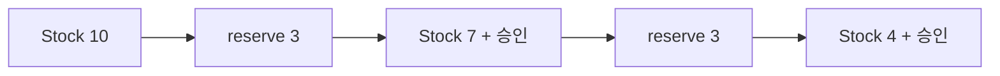

# 4장. Referential Transparency

같은 계산을 여러 번 적은 코드와 한 번 계산한 값을 재사용하는 코드는 언제 같은 프로그램일까?
앞 장의 불변성은 값의 안정성을 다루었다.
이번 장의 참조 투명성은 표현식을 그 값으로 치환해도 관측 가능한 의미가 보존되는지를 다룬다.

이 성질을 이해하면 함수 추출, 공통 계산 재사용, 캐시, 지연 평가를 같은 관점에서 검토할 수 있다.
이 장의 중심 사례는 재고 예약을 계산하는 순수 모델과 재고를 직접 차감하는 모델이다.
두 모델의 반환값이 비슷해도 치환 가능한 범위는 다르다.

---

## 1. 개념과 기본 구분

### 표현식을 값으로 바꿔 보기

어떤 표현식 `e`가 값 `v`로 평가된다고 하자.
프로그램 안의 `e`를 `v`로 바꾸어도 관측 가능한 의미가 같다면 그 위치에서 치환이 정당하다.
참조 투명성은 이런 치환을 안정적으로 수행할 수 있는 성질이다.

```text
e = 2 + 3
v = 5

(2 + 3) * (2 + 3)
          ⇓
5 * 5
```

값만 계산하는 산술식에서는 익숙한 변환이다.
프로그램에는 시간, 상태, 예외, I/O가 있으므로 같은 추론을 무조건 적용할 수 없다.
표현식의 표면 문법이 아니라 실행의 의미를 살펴야 한다.

### 참조라는 단어의 오해

여기서 참조는 포인터 주소가 같다는 뜻이 아니다.
같은 메모리 객체를 가리키는지와 의미를 보존하는 치환인지는 다른 질문이다.
서로 다른 객체라도 관측하는 값이 같을 수 있다.
반대로 같은 객체를 반복해서 읽어도 중간에 변경되면 결과가 달라질 수 있다.

### 관측 동등성

무엇을 관측하는지 먼저 정해야 한다.
반환값뿐 아니라 출력, 저장, 예외, 종료 여부가 중요한 프로그램이라면 그것들도 비교에 포함한다.
반환 숫자가 같다고 전체 프로그램이 동등한 것은 아니다.

이 책의 예제에서는 값, 명시적 오류, 관측 가능한 효과를 구분한다.
메모리 주소와 실행 시간까지 완전히 같다는 주장을 하지는 않는다.
성능상 동등성과 의미상 동등성은 별도의 평가 대상이다.

### 순수성과의 관계

순수 함수는 참조 투명한 표현식을 구성하는 핵심 수단이다.
하지만 설명의 초점은 다르다.
순수 함수는 입력과 효과의 계약을 설명하고, 참조 투명성은 프로그램을 바꾸어 읽는 추론을 설명한다.
둘을 구분하면 최적화와 리팩터링의 전제조건을 더 정확히 말할 수 있다.

---

## 2. 명령형 스타일과 함수형 스타일

### 상태를 차감하는 호출

아래 예제는 반환값만 보고 호출을 합치면 안 되는 상황이다.
`take`는 호출할 때마다 재고를 변경한다.

```scala
var stock = 10

def take(quantity: Int): Boolean =
  if stock >= quantity then
    stock -= quantity
    true
  else false

val a = take(3)
val b = take(3)
```

두 호출은 모두 `true`를 반환할 수 있다.
그러나 재고는 6만큼 줄었다.
첫 호출의 결과를 재사용하여 `b = a`로 바꾸면 재고는 3만큼만 줄어든다.
반환값의 겉모습은 같아도 전체 프로그램의 의미는 달라진다.

### 상태를 값으로 전달한다

```scala
def reserve(stock: Int, quantity: Int): (Int, Boolean) =
  if quantity >= 0 && stock >= quantity then
    (stock - quantity, true)
  else
    (stock, false)
```

이제 동일한 `stock`과 `quantity`로 호출하면 같은 쌍이 나온다.
두 번째 예약을 표현하려면 첫 결과의 새 재고를 다음 입력으로 전달한다.
상태 변화가 함수 호출 사이에 숨지 않고 데이터 흐름에 나타난다.

```text
reserve(10, 3) = (7, true)
reserve(7, 3)  = (4, true)
```

같은 계산의 재사용과 새로운 상태에 대한 다음 계산이 구분된다.
이 차이는 State 추상화의 출발점이 된다.

---

## 3. 왜 이 개념을 사용하는가?

### 리팩터링의 정당성

공통 부분식을 지역 변수로 추출하면 가독성이 좋아질 수 있다.
하지만 추출로 평가 횟수나 평가 시점이 달라지면 효과가 있는 표현식에서는 동작도 달라질 수 있다.
참조 투명성은 어떤 추출을 안전하게 검토할 수 있는지 알려 준다.

### 테스트의 설명력

실패한 계산을 입력값 하나로 재현할 수 있으면 원인 분석이 단순해진다.
이전 호출들의 순서를 재구성할 필요가 적어진다.
상태가 필요한 계산도 상태를 값으로 전달하면 재현 입력에 포함할 수 있다.

### 캐시의 의미

캐시는 이전 계산의 결과로 다음 계산을 대체하는 장치다.
따라서 입력이 같다는 판정과 결과를 재사용해도 된다는 계약이 필요하다.
현재 재고를 읽는 함수를 재고 번호만으로 캐시하면 그 전제가 깨질 수 있다.

캐시 키에 재고 버전을 포함하면 다른 계약을 만들 수 있다.
이 경우 “현재 재고”가 아니라 “특정 버전의 재고”를 조회한다는 뜻이 된다.
단순히 캐시 라이브러리를 붙이는 것보다 입력의 의미를 정하는 일이 먼저다.

### 코드 순서의 검토

독립적인 순수 계산은 특정 조건에서 순서를 바꾸어도 값이 같다.
그러나 예외와 종료 여부가 달라질 수 있는 계산은 더 신중하게 검토해야 한다.
어떤 계산이 실제로 필요하지 않아 생략되는지까지 포함해 평가 전략을 확인한다.

참조 투명성을 말할 때 “아무 순서로 실행해도 된다”라고 축약하지 않는다.
허용한 관측과 정의역을 명시해야 정확한 주장이다.

---

## 4. Scala에서의 표현

### 순수 예약 모델

다음 Scala 프로그램은 재고를 값으로 표현한다.
예약 결과는 새 재고와 승인 여부다.
예제의 실패는 재고를 바꾸지 않는다는 계약을 가진다.

<!-- executable:scala -->
```scala
object Chapter04:
  final case class Stock(available: Int)
  final case class Reservation(next: Stock, accepted: Boolean)

  def reserve(stock: Stock, quantity: Int): Reservation =
    require(stock.available >= 0)
    require(quantity >= 0)
    if stock.available >= quantity then
      Reservation(Stock(stock.available - quantity), true)
    else
      Reservation(stock, false)

  def reserveTwice(stock: Stock, quantity: Int): Stock =
    val first = reserve(stock, quantity)
    val second = reserve(first.next, quantity)
    second.next

  def expressionVersion(stock: Stock): Int =
    reserve(stock, 3).next.available +
      reserve(stock, 3).next.available

  def valueVersion(stock: Stock): Int =
    val result = reserve(stock, 3)
    result.next.available + result.next.available

  def check(): Unit =
    val initial = Stock(10)
    val expected = Reservation(Stock(7), true)
    assert(reserve(initial, 3) == expected)
    assert(reserve(initial, 3) == reserve(initial, 3))
    assert(initial == Stock(10))
    assert(expressionVersion(initial) == valueVersion(initial))
    assert(expressionVersion(initial) == 14)
    assert(reserveTwice(initial, 3) == Stock(4))
    assert(reserve(Stock(2), 3) == Reservation(Stock(2), false))
    assert(reserve(Stock(2), 0) == Reservation(Stock(2), true))

    for available <- 0 to 20 do
      for quantity <- 0 to 20 do
        val before = Stock(available)
        val result = reserve(before, quantity)
        assert(result.next.available >= 0)
        if result.accepted then
          assert(result.next.available + quantity == available)
        else
          assert(result.next == before)
```

### 두 종류의 반복을 구별한다

`expressionVersion`은 같은 최초 재고에 대한 계산을 두 번 평가한다.
`reserveTwice`는 첫 결과의 상태를 다음 계산으로 전달한다.
전자는 같은 질문을 두 번 묻고 후자는 두 번의 예약을 모델링한다.
이 둘을 같은 작업이라고 생각하면 상태를 값으로 옮긴 뒤에도 오류가 생긴다.

### `val` 추출의 의미

`valueVersion`은 동일 계산을 한 번 수행하고 결과값을 재사용한다.
순수 모델에서는 이 치환이 값의 의미를 보존한다.
반면 실제 저장소에 예약을 기록하는 함수를 같은 방식으로 바꾸면 기록 횟수가 달라질 수 있다.

### 전제조건

음수 재고와 음수 예약 수량은 정의역에서 제외했다.
`require`가 실패하는 실행까지 정상 결과의 법칙으로 덮어 설명하지 않는다.
전체 함수로 만들려면 오류를 반환 타입에 포함하여 별도 경우로 다루면 된다.

---

## 5. 상태 변경보다 값 변환

### 상태 전이도 값이 될 수 있다

불변성은 상태 변화가 없다는 뜻이 아니다.
상태 전이는 이전 상태와 다음 상태의 관계로 표현할 수 있다.
그 관계를 계산하는 함수는 참조 투명하게 만들 수 있다.



화살표마다 입력이 다르므로 계산 결과가 다른 것은 순수성과 충돌하지 않는다.
“같은 입력”이라는 조건에서 상태값도 입력의 일부다.
상태를 전역 변수에 숨기면 그 조건을 확인하기 어려워진다.

### 치환의 범위

`reserve(Stock(10), 3)`을 그 결과값으로 바꾸는 것은 한 계산을 대체한다.
저장소에서 현재 재고를 읽는 작업까지 대체한다는 뜻은 아니다.
조회한 스냅샷과 현재 저장소 상태를 구분해야 한다.

### 이력의 보존

이전 상태를 값으로 보관하면 여러 시나리오를 같은 시작점에서 비교할 수 있다.
예약 A를 먼저 적용한 경우와 예약 B를 먼저 적용한 경우를 각각 계산할 수 있다.
시뮬레이션 결과 가운데 하나를 실제로 채택하는 일은 별도 효과다.

---

## 6. 함수 합성과 데이터 흐름

### 등식으로 읽는 합성

함수 `f`와 `g`가 각각 순수하고 정의역이 맞으면 `g(f(x))`를 단계별 값으로 읽을 수 있다.
중간값을 이름 붙이는 것은 계산의 설명을 바꾸지만 관측 가능한 의미를 바꾸지 않는다.
이것이 데이터 흐름을 작은 단위로 분해하는 근거다.

```text
f(x) = y

g(f(x))
   = g(y)
   = z
```

중간값 `y`를 로그에 출력하는 코드를 넣으면 새로운 효과가 추가된다.
그 프로그램은 원래 프로그램과 완전히 같은 효과를 가진다고 할 수 없다.
디버깅용 관측도 프로그램 의미의 일부가 될 수 있다는 점을 기억하자.

### 평가 전략과 중복

엄격 평가 언어에서는 인자를 전달하기 전에 평가하는 경우가 일반적이다.
지연 평가에서는 사용 시점까지 계산을 미룰 수 있다.
같은 수식 형태라도 예외 발생 시점과 자원 수명이 달라질 수 있다.

지연 평가 장에서는 계산을 설명하는 값과 실제 실행을 구분한다.
여기서는 효과가 있는 호출을 임의로 복제하거나 제거하지 않는다는 원칙을 먼저 잡는다.

### 객체 동일성의 함정

항상 새 가변 리스트를 반환하는 함수는 내용이 같아도 별칭 관계가 달라질 수 있다.
호출 결과를 하나로 공유하면 두 사용자의 변경이 서로 보이게 된다.
따라서 “내용이 같으니 캐시해도 된다”는 추론은 결과 객체의 변경 가능성까지 검토해야 한다.

---

## 7. 장점과 트레이드오프

### 장점

등식으로 중간 계산을 바꾸어 읽을 수 있으면 코드 리뷰의 단위가 작아진다.
함수 추출과 결과 재사용의 전제조건을 설명하기 쉬워진다.
테스트 입력을 값으로 보관하여 동일 조건을 재현할 수도 있다.

### 한계

관측 동등성을 엄밀하게 증명하는 일은 단순한 출력 비교보다 어렵다.
예외, 종료, 자원, 별칭 관계가 모두 의미에 참여할 수 있다.
실무에서는 필요한 관측 범위를 정하고 단계적으로 검토한다.

| 바꾸려는 코드 | 먼저 확인할 조건 |
| --- | --- |
| 같은 호출을 한 번으로 합치기 | 호출 횟수가 효과에 영향을 주는가 |
| 결과를 캐시하기 | 입력 키와 결과의 공유가 안전한가 |
| 두 계산의 순서를 바꾸기 | 의존성, 예외, 종료가 달라지는가 |
| 계산을 뒤로 미루기 | 입력 스냅샷과 자원 수명이 유지되는가 |
| 공통 변수를 함수로 추출하기 | 캡처된 환경이 바뀌는가 |
| 함수 결과를 값으로 치환하기 | 반환값 이외의 관측이 있는가 |

### 최적화와 의미를 분리한다

치환이 의미상 정당해도 실제 실행 속도가 빨라진다는 보장은 없다.
캐시는 메모리를 쓰고, 함수 추출은 디버깅 경험을 바꿀 수 있다.
의미 보존을 확인한 다음 비용을 측정해야 한다.

성능이 같다는 테스트도 의미 보존의 증명이 아니다.
두 질문을 분리하면 최적화의 근거를 과장하지 않게 된다.

---

## 8. 상태와 부수효과의 경계

### 계산의 설명과 실행

I/O 작업을 설명하는 값을 만들 수 있다.
예를 들어 “이 파일을 읽어라”라는 명령 데이터를 구성하는 일은 순수하게 할 수 있다.
하지만 그 명령을 실제로 해석하면 외부 효과가 발생한다.

같은 명령 값을 두 번 실행하면 효과도 두 번 발생할 수 있다.
명령 값이 불변이라고 실행이 멱등적인 것은 아니다.
IO와 Algebra & Interpreter 장에서 이 구분을 다시 사용한다.

### 재고 예약 서비스

순수한 `reserve`는 스냅샷에 대한 결정을 계산한다.
실제 서비스는 그 스냅샷이 저장 시점에도 유효한지 확인해야 한다.
다른 요청이 재고를 변경했다면 계산 결과를 그대로 저장해서는 안 될 수 있다.

```text
스냅샷 읽기
  -> 순수 예약 계산
  -> 기대 버전으로 조건부 저장
  -> 충돌 시 최신 스냅샷에서 재검토
```

참조 투명성은 가운데 계산에 적용된다.
바깥의 읽기와 조건부 저장까지 순수한 등식으로 바꾸지는 않는다.
경계를 명시해야 개념의 적용 범위를 과장하지 않는다.

### 오류의 관측

예외를 던지는 호출을 미리 계산해 변수로 뽑으면 원래 실행되지 않던 분기에서도 예외가 발생할 수
있다.
조건부 평가의 위치를 바꾸는 리팩터링은 특히 주의해야 한다.
실패 가능성을 값으로 드러내면 이런 의존성을 더 쉽게 볼 수 있다.

---

## 9. Python에서 적용하기

### Python의 치환 실험

다음 코드는 값 모델의 치환과 효과 모델의 반례를 함께 검사한다.
반례는 전역 상태 대신 작은 지역 객체를 사용하여 테스트 간 영향을 피한다.
그 객체의 변경 자체가 관측하려는 효과다.

<!-- executable:python -->
```python
from dataclasses import dataclass


@dataclass(frozen=True)
class Stock:
    available: int


@dataclass(frozen=True)
class Reservation:
    next_stock: Stock
    accepted: bool


def reserve(stock: Stock, quantity: int) -> Reservation:
    if stock.available < 0 or quantity < 0:
        raise ValueError("negative stock or quantity")
    if stock.available >= quantity:
        return Reservation(Stock(stock.available - quantity), True)
    return Reservation(stock, False)


def expression_version(stock: Stock) -> int:
    return (
        reserve(stock, 3).next_stock.available
        + reserve(stock, 3).next_stock.available
    )


def value_version(stock: Stock) -> int:
    result = reserve(stock, 3)
    return result.next_stock.available + result.next_stock.available


class MutableStock:
    def __init__(self, available: int) -> None:
        self.available = available

    def take(self, quantity: int) -> bool:
        if self.available >= quantity:
            self.available -= quantity
            return True
        return False


def test_substitution() -> None:
    for available in range(0, 30):
        stock = Stock(available)
        assert expression_version(stock) == value_version(stock)
        assert stock.available == available


def test_sequential_state() -> None:
    first = reserve(Stock(10), 3)
    second = reserve(first.next_stock, 3)
    assert first.next_stock == Stock(7)
    assert second.next_stock == Stock(4)
    assert first.accepted and second.accepted


def test_effect_counterexample() -> None:
    twice = MutableStock(10)
    a = twice.take(3)
    b = twice.take(3)
    shared = MutableStock(10)
    cached = shared.take(3)
    assert (a, b) == (cached, cached)
    assert twice.available == 4
    assert shared.available == 7
    assert twice.available != shared.available


def test_failed_reservation() -> None:
    stock = Stock(2)
    result = reserve(stock, 3)
    assert result == Reservation(stock, False)
    assert reserve(stock, 0) == Reservation(stock, True)


if __name__ == "__main__":
    test_substitution()
    test_sequential_state()
    test_effect_counterexample()
    test_failed_reservation()
```

### 반환값이 아니라 관측 전체를 비교한다

反례에서는 두 프로그램의 승인 여부가 같다.
그러나 마지막 재고가 다르므로 전체 관측은 다르다.
이것이 반환값 비교만으로 리팩터링을 승인해서는 안 되는 이유다.

값 모델의 반복 검사는 작은 재고 범위에 대한 실행 증거다.
일반적인 정당성은 `reserve`가 입력 외의 상태를 사용하지 않는다는 정의와 경우 분석에서 나온다.
테스트와 추론의 역할을 구분해서 읽자.

---

## 10. Python의 표현 한계

### 자동 검증의 부재

표준 Python 타입 힌트는 표현식의 참조 투명성을 증명하지 않는다.
`Callable[[Stock, int], Reservation]`도 내부에서 로그를 출력할 수 있다.
정적 타입의 입력·출력 모양과 효과 계약은 구분해야 한다.

### 프로퍼티와 사용자 정의 연산

속성 읽기처럼 보이는 코드가 프로퍼티를 통해 계산이나 I/O를 수행할 수 있다.
`a + b`도 사용자 정의 `__add__`를 호출할 수 있다.
표면상 단순한 표현식이라고 순수한 산술이라고 단정하면 안 된다.

### 캐시 결과의 별칭

캐시된 가변 객체를 여러 호출자에게 반환하면 새 공유 관계가 생긴다.
불변 반환값을 사용하거나 반환 경계에서 복사하는 등 명시적 정책이 필요하다.
캐시 데코레이터는 이런 의미상의 선택을 자동으로 해결하지 않는다.

### 동일성 비교의 범위

사용자 정의 `__eq__` 역시 임의의 코드를 실행할 수 있다.
값 비교가 무엇을 관측하는지 모델의 계약을 확인해야 한다.
이 장의 데이터 클래스 예제는 정수와 불변 레코드의 구조적 비교를 전제로 한다.

---

## 11. 핵심 정리

### 핵심 결론

참조 투명성은 표현식을 값으로 치환하는 추론의 근거다.
반환값뿐 아니라 효과와 종료 등 필요한 관측을 포함해야 한다.
상태를 입력과 출력 값으로 표현하면 상태 전이 자체를 순수하게 계산할 수 있다.
실제 조회와 저장의 경계는 여전히 별도로 다뤄야 한다.

### 연습 1: 호출 횟수

항상 `true`를 반환하면서 로그를 한 줄 쓰는 함수를 두 번 호출했다.
한 번 호출한 결과를 재사용하도록 바꾸면 같은 프로그램인가?

**해설.** 반환값은 같지만 로그의 줄 수가 다르다.
로그가 관측에 포함되는 계약이라면 동등하지 않다.
효과를 제거하거나 중복 실행하는 변환에는 별도 근거가 필요하다.

### 연습 2: 조건 밖으로 이동

`if enabled then risky() else 0`에서 `risky()`를 조건 앞의 변수로 추출했다.
`risky`가 예외를 던질 수 있을 때 어떤 차이가 생기는가?

**해설.** 원래는 `enabled`가 거짓이면 호출되지 않는다.
추출 후에는 조건과 무관하게 실행되어 예외가 발생할 수 있다.
평가 위치는 의미의 일부다.

### 연습 3: 재고 캐시

현재 재고 조회를 품목 코드만으로 캐시하는 설계를 검토하라.
품목 코드와 버전을 함께 키로 쓰면 계약이 어떻게 바뀌는가?

**해설.** 품목 코드만으로는 시간에 따라 달라지는 현재 상태를 구분하지 못한다.
버전을 포함하면 특정 스냅샷에 대한 조회를 재사용할 수 있다.
단, 버전의 유일성과 데이터의 불변성이 유지되어야 한다.

### 연습 4: 리스트 반환

항상 `[1, 2]`를 새로 반환하는 함수를 캐시했다.
첫 호출자가 원소를 추가하면 두 번째 호출자는 무엇을 볼 수 있는가?

**해설.** 캐시가 같은 리스트 객체를 돌려주면 변경된 목록을 보게 된다.
새 객체 반환과 공유 객체 반환은 별칭 관점에서 다르다.
결과 내용만이 아니라 반환값의 변경 가능성을 검토해야 한다.

### 다음 장으로

이제 함수를 호출하는 규칙을 넘어 함수 자체를 값으로 다룬다.
일급 함수는 계산을 저장하고 전달하고 반환하는 기반이다.
참조 투명성은 그렇게 전달되는 함수의 효과 계약을 읽는 데 계속 사용된다.

### 참고 자료

[Scala 공식 문서: Pure Functions](https://docs.scala-lang.org/scala3/book/fp-pure-functions.html)
[Python 공식 문서: functools](https://docs.python.org/3.14/library/functools.html)
이 장의 치환식과 재고 사례는 효과의 관측 범위를 설명하기 위해 직접 구성한 예제다.
