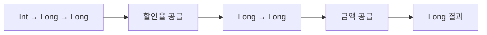

# 16장. Currying

부분 적용은 일부 인자를 실제로 공급하는 작업이었다.
커링은 그보다 앞선 함수 형태의 변환이다.
두 인자를 한 번에 받는 함수를 첫 인자를 받은 뒤 두 번째 인자를 기다리는 함수를 반환하도록
바꾼다.

이 장에서는 할인율과 금액을 사용하는 계산으로 커링과 언커링을 왕복한다.
표기만 바꾸는 장난이 아니라 설정과 데이터의 순서, 타입 추론, API 조립을 이해하기 위한 도구다.
동시에 모든 함수를 커링하면 더 좋다는 오해도 피한다.

---

## 1. 개념과 기본 구분

### 함수 형태의 변환

두 인자 함수의 커링은 다음과 같은 타입 변환이다.
결과 함수는 첫 인자를 받아 다음 함수를 반환한다.
반환된 함수가 두 번째 인자를 받아 최종 결과를 만든다.

```text
uncurried: (A, B) -> C
curried:   A -> (B -> C)

curry(f)(a)(b) = f(a, b)
```

화살표의 괄호를 생략할 때는 보통 오른쪽으로 결합한다고 읽는다.
`A -> B -> C`는 `(A -> B) -> C`와 다르다.
전자는 인자를 단계적으로 받고 후자는 함수 자체를 인자로 받는다.

### 언커링

언커링은 커링된 함수를 다시 두 인자를 한 번에 받는 함수로 바꾼다.
동일한 계산의 서로 다른 호출 인터페이스를 연결한다.
입력값과 결과의 관계가 유지되는지 왕복 법칙으로 확인할 수 있다.

### 부분 적용과의 차이

커링된 함수 `curried`를 만드는 것만으로 특정 인자가 고정되지는 않는다.
`curried(a)`를 호출해야 첫 인자가 실제로 공급된다.
이 호출이 부분 적용에 해당하는 효과를 만든다.

### 클로저의 역할

첫 호출에서 받은 값을 다음 함수가 사용하려면 환경을 보관해야 한다.
클로저가 이를 구현하는 자연스러운 수단이다.
하지만 언어의 최적화나 표현 방식은 별도 문제이므로 매 단계의 비용이 무조건 사라진다고 가정하지
않는다.

---

## 2. 명령형 스타일과 함수형 스타일

### 한 번에 받는 함수

```scala
def discounted(rate: Int, amount: Long): Long =
  amount - amount * rate / 10000

val result = discounted(1000, 10000)
```

호출자가 두 값을 동시에 제공한다.
설정과 데이터가 같은 호출 경계에 있다.
이 구조는 간단하고 많은 API에서 충분히 적절하다.

### 단계적으로 받는 함수

```scala
val curried: Int => Long => Long =
  rate => amount => discounted(rate, amount)

val tenPercent = curried(1000)
val result = tenPercent(10000)
```

첫 단계는 할인율을 선택한다.
두 번째 단계는 실제 금액을 처리한다.
중간 결과의 타입이 `Long => Long`이므로 목록 변환이나 파이프라인에 전달하기 쉽다.

### 여러 매개변수 목록

Scala에서는 메서드에 여러 매개변수 목록을 선언할 수 있다.
이 문법은 커링된 함수와 비슷한 호출 형태를 제공하지만 메서드와 함수값의 구분은 유지한다.
필요한 위치에서 함수값으로 변환되는 규칙을 함께 이해해야 한다.

```scala
def configured(rate: Int)(amount: Long): Long =
  discounted(rate, amount)
```

이 형태가 모든 인자를 실제로 하나씩만 받아야 한다는 뜻은 아니다.
각 매개변수 목록 안에 여러 인자를 둘 수도 있다.
설정, 데이터, 함수 인자, 문맥 인자의 묶음을 설계하는 기능으로 읽는다.

---

## 3. 왜 이 개념을 사용하는가?

### 자주 고정하는 인자의 배치

앞쪽 인자를 먼저 공급하면 뒤쪽 입력만 기다리는 함수가 된다.
따라서 자주 고정되는 설정을 앞에 두면 조립이 자연스러울 수 있다.
하지만 기존 도메인의 명확한 인자 의미를 해치면서 순서를 바꿀 필요는 없다.

### 타입의 단계적 설명

각 호출 후 어떤 타입이 남는지 읽으면 복잡한 함수도 분해할 수 있다.
`A -> B -> C`에서 `A`를 공급하면 `B -> C`가 남는다.
이것은 타입을 단순한 장식이 아니라 계산의 남은 요구사항으로 읽는 연습이다.

### 고차 함수의 API

컬렉션을 먼저 받고 변환 함수를 뒤의 인자 목록에서 받는 API를 만들 수 있다.
앞 목록에서 원소 타입을 알게 되어 뒤 람다를 읽거나 추론하기 쉬운 경우가 있다.
구체적인 추론 능력은 언어와 문맥에 따라 다르므로 만능 규칙으로 일반화하지 않는다.

### 조립과 실행

설정별 정책 함수를 미리 만들고 실제 데이터 처리에 재사용할 수 있다.
설정이 잘못된 경우 어느 단계에서 실패할지 명시해야 한다.
커링은 검증 시점을 자동으로 정해 주지 않는다.

### 도입하지 않아도 되는 경우

항상 모든 인자를 한 번에 전달하고 중간 함수가 쓰이지 않으면 커링의 이득이 작을 수 있다.
괄호와 중간 함수가 오히려 호출을 복잡하게 만들 수 있다.
언어의 관용구와 실제 조립 요구를 기준으로 선택한다.

---

## 4. Scala에서의 표현

### Scala의 커링과 언커링

다음 프로그램은 직접 구현한 변환과 표준 함수 변환을 비교한다.
왕복 법칙은 함수 객체의 동일성이 아니라 모든 검사 입력에서 결과가 같다는 의미로 확인한다.
유한 테스트와 일반적인 등식 설명의 역할을 구분한다.

<!-- executable:scala -->
```scala
object Chapter16:
  def curry[A, B, C](f: (A, B) => C): A => B => C =
    a => b => f(a, b)

  def uncurry[A, B, C](f: A => B => C): (A, B) => C =
    (a, b) => f(a)(b)

  def discounted(rate: Int, amount: Long): Long =
    require(rate >= 0 && rate <= 10000)
    require(amount >= 0 && amount <= 1000000000L)
    amount - amount * rate / 10000

  def configured(rate: Int)(amount: Long): Long =
    discounted(rate, amount)

  def transform[A, B](values: List[A])(f: A => B): List[B] =
    values.map(f)

  def check(): Unit =
    val original: (Int, Long) => Long = discounted
    val curried = curry(original)
    val restored = uncurry(curried)
    val tenPercent: Long => Long = curried(1000)
    assert(tenPercent(10000) == 9000)
    assert(configured(1000)(10000) == 9000)
    assert(transform(List(10000L, 20000L))(tenPercent) == List(9000L, 18000L))

    val standard = original.curried
    val standardRestored = Function.uncurried(standard)
    for rate <- List(0, 1000, 5000, 10000) do
      for amount <- List(0L, 1L, 999L, 10000L) do
        assert(curried(rate)(amount) == original(rate, amount))
        assert(restored(rate, amount) == original(rate, amount))
        assert(standardRestored(rate, amount) == original(rate, amount))
        assert(curry(uncurry(curried))(rate)(amount) == curried(rate)(amount))

    var events = Vector.empty[String]
    val staged: Int => Int => Int = a =>
      events = events :+ s"configured:$a"
      b =>
        events = events :+ s"executed:$b"
        a + b
    val addTen = staged(10)
    assert(events == Vector("configured:10"))
    assert(addTen(2) == 12)
    assert(events == Vector("configured:10", "executed:2"))
```

### 단계마다 효과가 있을 수 있다

마지막의 `staged`는 첫 인자를 받는 단계에서도 로그 기록에 해당하는 변경을 수행한다.
커링된 타입이라는 이유로 중간 적용이 항상 순수한 함수 생성이라고 가정하면 안 된다.
각 단계의 구현과 효과 계약을 확인해야 한다.

### 왕복 법칙의 범위

직접 정의한 순수한 `curry`와 `uncurry`는 같은 인자를 같은 순서로 원래 함수에 전달한다.
그러나 임의의 효과 있는 중간 함수 생성 과정을 재배치하면 호출 시점이 달라질 수 있다.
함수 형태의 등식과 실제 효과 실행의 관측을 구분한다.

### 메서드의 매개변수 목록

`configured(rate)(amount)`는 두 목록을 가진 메서드 호출이다.
`curried(rate)(amount)`는 함수값의 연속 호출로 읽을 수 있다.
겉모양이 비슷해도 언어의 선언과 변환 규칙을 정확히 구분하는 습관이 중요하다.

---

## 5. 상태 변경보다 값 변환

### 남은 입력을 값으로 표현한다

커링된 함수를 일부 적용하면 아직 필요한 입력을 받는 함수가 남는다.
그 함수는 설정된 계산을 나타내는 값이다.
입력 공급의 진행 상황이 타입 변화에 드러난다.



함수의 중간 결과는 계산된 할인 금액이 아니다.
금액을 받으면 계산할 수 있는 동작이다.
이 차이를 이해하면 콜백 등록과 설정 단계의 오류를 줄일 수 있다.

### 환경의 고정

첫 인자가 불변 값이면 중간 함수가 그 값을 안정적으로 사용할 수 있다.
첫 인자가 가변 객체면 나중 변경이 결과에 영향을 줄 수 있다.
커링은 앞 장에서 본 캡처와 별칭 문제를 없애지 않는다.

### 여러 단계의 인자

세 인자 함수도 `A -> B -> C -> D` 형태로 바꿀 수 있다.
하지만 실제 API에서는 관련 있는 인자를 한 목록이나 레코드로 묶는 편이 더 명확할 수 있다.
단일 인자 연쇄라는 이론적 형태와 사용자 친화적인 인터페이스는 같은 목표가 아니다.

---

## 6. 함수 합성과 데이터 흐름

### 부분 적용과 합성의 연결

커링된 할인 함수에 할인율을 공급하면 한 인자 금액 함수가 된다.
그 함수를 표시 함수와 합성하면 금액에서 문자열로 가는 파이프라인이 된다.
각 변환의 타입을 순서대로 적어 보면 조립이 분명해진다.

```text
Int -> Long -> Long
  할인율 적용
Long -> Long
  표시 함수와 합성
Long -> String
```

### 인자 뒤집기

데이터와 설정의 순서가 합성에 맞지 않으면 인자 순서를 바꾸는 작은 래퍼를 만들 수 있다.
하지만 같은 타입의 인자가 많으면 순서 변경을 눈으로 확인하기 어렵다.
명명된 매개변수나 설정 레코드를 사용하는 것이 더 안전할 수 있다.

### 튜플 함수와의 구분

튜플 하나를 받는 함수와 두 인자를 받는 함수는 언어에서 다른 호출 형태일 수 있다.
커링·언커링·튜플화는 관련되지만 서로 다른 인터페이스 변환이다.
표준 라이브러리의 변환 이름과 정확한 타입을 확인해야 한다.

### 법칙을 입력에 적용해 본다

`uncurry(curry(f))(a, b)`를 정의대로 전개하면 `f(a, b)`가 된다.
이 간단한 전개가 왕복 법칙의 핵심이다.
함수 객체의 주소나 내부 환경 구조가 같다는 뜻은 아니다.

---

## 7. 장점과 트레이드오프

### 장점과 트레이드오프

| 관점 | 이득 | 주의점 |
| --- | --- | --- |
| 설정의 단계화 | 정책 함수 생성 | 검증과 효과 시점 |
| 타입의 단계적 읽기 | 남은 입력 명확 | 깊은 함수 타입 |
| 고차 함수 연결 | 한 인자 콜백 생성 | 인자 순서 의존 |
| 표준 변환 | 인터페이스 왕복 | 메서드·튜플 구분 |
| 작은 조립 | 중복 전달 감소 | 래퍼와 환경 비용 |

### 읽기 쉬운 경계

업무 설정을 모두 하나씩 받는 긴 연쇄는 사용하기 어려울 수 있다.
관련 설정을 레코드로 묶고 실제 데이터와 구분하는 편이 더 명확할 때가 많다.
커링은 가능한 표현 방식이지 모든 API의 최종 형태가 아니다.

### 성능

중간 함수를 만드는 비용과 캡처 환경의 수명이 생길 수 있다.
컴파일러가 어떤 경우를 최적화하는지는 구현과 호출 문맥에 달려 있다.
이론적 함수 동등성을 실행 비용의 동일성으로 확장하지 않는다.

### 도구와 생태계

언어의 라이브러리들이 주로 어떤 호출 형태를 사용하는지 고려한다.
Python에서는 키워드 인자와 명시적 함수가 더 자연스러운 경우가 많다.
Scala에서도 모든 함수가 완전히 커링된 형태여야 하는 것은 아니다.

---

## 8. 상태와 부수효과의 경계

### 첫 단계의 효과

설정을 받는 단계에서 파일을 열거나 네트워크 연결을 만들 수도 있다.
그 결과로 반환된 함수가 해당 자원을 사용할 수 있다.
이 경우 중간 함수의 수명과 자원 정리 책임을 명시해야 한다.

### 재사용과 호출 횟수

같은 중간 함수를 여러 번 호출하면 마지막 단계의 효과가 여러 번 실행될 수 있다.
첫 단계의 효과는 한 번만 실행되었을 수도 있다.
이 차이는 자원 생성, 트랜잭션, 로깅의 의미에 영향을 준다.

```text
configured = make(config)   # 설정 단계
configured(data1)          # 실행 단계 1
configured(data2)          # 실행 단계 2
```

### 요청별 문맥

사용자 권한이나 요청 시각을 오래 살아 있는 중간 함수에 고정하면 오래된 문맥을 사용할 수 있다.
정적 설정과 요청별 입력을 구분하여 적절한 단계에서 공급한다.
일찍 공급할수록 항상 좋은 것은 아니다.

### 효과 타입의 도움과 한계

효과를 명시한 반환 타입을 사용하면 어느 단계에서 실행 설명을 만드는지 표현할 수 있다.
하지만 단순한 커링 자체는 효과를 추적하지 않는다.
후반부의 Reader와 IO는 이 문제를 다른 수준에서 다룬다.

---

## 9. Python에서 적용하기

### Python의 직접 구현

Python은 일반적으로 자동 커링을 수행하지 않는다.
중첩 함수를 반환하여 명시적으로 같은 구조를 만들 수 있다.
아래 코드는 두 인자 함수의 커링과 언커링을 타입 변수로 표현한다.

<!-- executable:python -->
```python
from collections.abc import Callable
from typing import TypeVar

A = TypeVar("A")
B = TypeVar("B")
C = TypeVar("C")


def curry(function: Callable[[A, B], C]) -> Callable[[A], Callable[[B], C]]:
    def first(a: A) -> Callable[[B], C]:
        def second(b: B) -> C:
            return function(a, b)
        return second
    return first


def uncurry(function: Callable[[A], Callable[[B], C]]) -> Callable[[A, B], C]:
    def combined(a: A, b: B) -> C:
        return function(a)(b)
    return combined


def discounted(rate: int, amount: int) -> int:
    if not 0 <= rate <= 10_000:
        raise ValueError("invalid rate")
    if amount < 0:
        raise ValueError("negative amount")
    return amount - amount * rate // 10_000


def test_application_stages() -> None:
    curried = curry(discounted)
    ten_percent = curried(1000)
    assert callable(ten_percent)
    assert ten_percent(10_000) == 9000
    assert [ten_percent(value) for value in (10_000, 20_000)] == [9000, 18_000]


def test_round_trip() -> None:
    curried = curry(discounted)
    restored = uncurry(curried)
    round_trip = curry(uncurry(curried))
    for rate in (0, 1000, 5000, 10_000):
        for amount in (0, 1, 999, 10_000):
            expected = discounted(rate, amount)
            assert curried(rate)(amount) == expected
            assert restored(rate, amount) == expected
            assert round_trip(rate)(amount) == expected


def test_stage_effects() -> None:
    events: list[str] = []

    def staged(a: int) -> Callable[[int], int]:
        events.append(f"configured:{a}")

        def execute(b: int) -> int:
            events.append(f"executed:{b}")
            return a + b

        return execute

    add_ten = staged(10)
    assert events == ["configured:10"]
    assert add_ten(2) == 12
    assert add_ten(3) == 13
    assert events == ["configured:10", "executed:2", "executed:3"]


def test_not_automatic() -> None:
    try:
        discounted(1000)  # 런타임 호출 규약 반례를 의도적으로 검사한다.
    except TypeError:
        pass
    else:
        raise AssertionError("ordinary function unexpectedly auto-curried")


if __name__ == "__main__":
    test_application_stages()
    test_round_trip()
    test_stage_effects()
    test_not_automatic()
```

### 의도적인 호출 오류 테스트

마지막 테스트는 올바른 제품 코드를 권장하는 것이 아니다.
일반 Python 함수가 인자 하나만 받으면 자동으로 나머지를 기다리는 함수가 되지 않는다는 사실을
확인한다.
정적 검사에서는 이 줄이 의도적인 오류로 보고될 수 있으므로 예제의 목적을 구분해야 한다.

---

## 10. Python의 표현 한계

### 자동 커링의 부재

일반 함수의 인자가 부족하면 Python은 보통 호출 오류를 낸다.
명시적으로 중첩 함수를 만들거나 부분 적용 도구를 사용해야 한다.
다른 언어의 호출 문법을 그대로 가져와 가상의 Python 예제로 설명하지 않는다.

### 임의 인자 목록

키워드 전용 인자, 기본값, 가변 인자를 가진 모든 함수를 자동 커링하는 도구는 호출 완료 시점을
정하기 어렵다.
언제까지 인자를 모으고 언제 실행할지 별도 규칙이 필요하다.
단순한 두 인자 예제를 모든 Python 호출 규약에 무리하게 일반화하지 않는다.

### 정적 타입의 복잡도

중첩 `Callable`이 깊어지면 타입 주석이 읽기 어려워질 수 있다.
설정 레코드와 이름 있는 함수가 더 명확한 API를 제공할 수 있다.
정적 정확성을 포기한 범용 데코레이터가 항상 더 좋은 추상화는 아니다.

### 효과와 수명

타입 주석만으로 각 적용 단계의 효과나 자원 수명을 보장하지 않는다.
함수를 생성하는 단계와 실행하는 단계의 계약을 문서에 남겨야 한다.
클로저 안의 공유 상태도 일반적인 동시성 규칙을 따른다.

---

## 11. 핵심 정리

### 핵심 결론

커링은 다중 인자 함수를 단일 인자 함수의 연쇄로 바꾸는 형태 변환이다.
부분 적용은 인자를 실제로 공급하는 작업이다.
언커링은 호출 인터페이스를 되돌리며 값의 관계를 왕복 법칙으로 설명할 수 있다.
효과 시점, 인자 순서, 중간 함수의 수명은 별도로 검토해야 한다.

### 연습 1: 타입 읽기

`A -> B -> C`와 `(A -> B) -> C`의 첫 입력을 각각 설명하라.

**해설.** 전자는 `A`를 받아 `B -> C` 함수를 반환한다.
후자는 `A -> B` 함수 자체를 받아 `C`를 만든다.
화살표의 결합 방향과 괄호가 의미를 결정한다.

### 연습 2: 왕복 전개

`uncurry(curry(f))(a, b)`를 정의에 따라 전개하라.

**해설.** `curry(f)(a)(b)`가 되고 최종적으로 `f(a, b)`가 된다.
같은 인자를 같은 계산에 전달한다는 값의 관계를 보여 준다.
함수 객체의 메모리 동일성을 주장하는 것은 아니다.

### 연습 3: 자동 실행 시점

기본값과 가변 인자를 가진 함수를 자동 커링하려고 한다.
인자 공급이 끝났는지 판단하기 어려운 이유를 설명하라.

**해설.** 더 많은 인자를 받을 수 있으면서 현재 인자만으로도 호출이 가능한 경우가 있다.
도구는 별도의 종료 규칙이나 명시적 실행 연산을 필요로 할 수 있다.
언어의 모든 호출 규약을 단순한 연쇄로 바꾸는 데는 추가 설계가 필요하다.

### 연습 4: 효과 횟수

첫 적용에서 파일을 열고 두 번째 적용에서 쓰는 커링된 함수를 재사용한다.
무엇을 문서화해야 하는가?

**해설.** 파일의 생성·공유·닫힘 시점과 쓰기 호출 횟수를 명시해야 한다.
재사용이 하나의 자원을 공유하는지 매번 새 자원을 만드는지 구분한다.
커링은 자원 관리 정책을 자동으로 제공하지 않는다.

### 다음 부와 참고 자료

2부에서 변환을 연결하는 방법을 배웠다.
3부는 그 변환이 다루는 값의 형태를 설계하여 잘못된 상태를 줄이는 방법을 다룬다.

[Scala 공식 문서: Multiple Parameter Lists](https://docs.scala-lang.org/tour/multiple-parameter-lists.html)
[Python 공식 문서: Function definitions](https://docs.python.org/3.14/reference/compound_stmts.html#function-definitions)
[Python 공식 문서: functools.partial](https://docs.python.org/3.14/library/functools.html#functools.partial)
