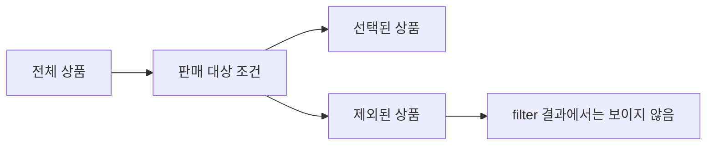

# 11장. Filter

`map`이 원소를 바꾼다면 `filter`는 어떤 원소를 남길지 결정한다.
품절되지 않은 상품, 활성 고객, 처리 대상 주문을 고르는 작업에 자연스럽게 적용할 수 있다.
이번 장은 선택 조건의 의미와 제거된 정보의 책임을 함께 다룬다.

조건을 만족하지 않는 값을 버리는 것과 잘못된 입력의 오류를 설명하는 것은 다르다.
단순한 선택이 검증을 대신하면서 정보가 사라지는 설계를 특히 주의해야 한다.
예제에서는 재고와 공개 여부를 가진 상품 목록을 사용한다.

---

## 1. 개념과 기본 구분

### 술어와 부분 목록

술어는 입력에 대해 참 또는 거짓을 계산하는 함수다.
목록 `filter`는 술어가 참인 원소만 남긴다.
원소의 값과 상대적 순서는 유지되며 결과 길이는 입력보다 길어지지 않는다.

```text
List[A] + (A -> Boolean) -> List[A]

[a, b, c, d]
   조건: 참, 거짓, 참, 거짓
[a, c]
```

`filter`는 남은 원소를 변환하지 않는다.
하지만 같은 가변 객체를 결과에 담을 수 있으므로 깊은 복사를 의미하지 않는다.
새 목록이 생겨도 원소의 별칭은 유지될 수 있다.

### 선택과 검증

선택은 대상 중 일부를 고르는 일이다.
검증은 값이 규칙을 만족하는지 판단하고 필요하면 실패 이유를 제공하는 일이다.
거짓인 원소를 버리면 왜 제외되었는지 알 수 없어진다.

### 전체 선택과 빈 선택

항상 참인 술어는 원래 목록과 같은 값을 만든다.
항상 거짓인 술어는 빈 목록을 만든다.
빈 입력에서는 술어가 호출되지 않는다.

### 분할

선택된 값과 제외된 값을 모두 필요로 하면 분할을 고려한다.
두 목록으로 나누는 `partition`은 정보 손실을 줄일 수 있다.
다만 제외 이유까지 필요하면 불리언보다 풍부한 결과 타입이 필요하다.

---

## 2. 명령형 스타일과 함수형 스타일

### 반복문으로 대상 선택

```python
products = [
    {"sku": "A", "stock": 3, "visible": True},
    {"sku": "B", "stock": 0, "visible": True},
]
selected = []
for product in products:
    if product["visible"] and product["stock"] > 0:
        selected.append(product)
```

선택 조건과 결과 수집이 한 코드에 섞여 있다.
작은 경우에는 충분히 명확하지만 조건이 반복되면 별도 술어로 이름 붙일 수 있다.

### 이름 있는 술어

```scala
final case class Product(sku: String, stock: Int, visible: Boolean)

def sellable(product: Product): Boolean =
  product.visible && product.stock > 0

val products = List(Product("A", 3, true), Product("B", 0, true))
val selected = products.filter(sellable)
```

`filter`는 순회와 선택 구조를 담당한다.
`sellable`은 업무상 판매 대상이라는 의미를 담당한다.
조건의 이름이 실제 정책보다 강한 보장을 암시하지 않도록 주의한다.

### 판매 가능성의 범위

재고가 있고 공개되어 있다는 사실만으로 실제 결제가 가능하다고 단정할 수 없다.
판매 기간, 지역 제한, 권한, 가격 상태 등이 추가로 필요할 수 있다.
예제의 술어는 명시한 두 조건만 확인한다.
도메인 이름을 붙일 때 검사 범위를 문서화해야 한다.

---

## 3. 왜 이 개념을 사용하는가?

### 선택 의도의 명확성

목록 전체를 읽고 일부만 남기는 작업을 한 연산으로 표현한다.
원소를 바꾸는 `map`과 구분되어 파이프라인의 구조가 선명해진다.
선택 조건을 독립적으로 테스트하기도 쉽다.

### 조건의 재사용

같은 공개·재고 조건을 여러 화면에서 사용할 수 있다.
그러나 화면마다 권한이나 시점이 다르면 술어를 무조건 공유해서는 안 된다.
실제로 같은 정책인지 확인한 뒤 공통화한다.

### 비용 절감

비싼 변환 전에 불필요한 원소를 제거하면 계산량을 줄일 수 있다.
하지만 변환 전후의 조건이 같은 의미인지 검토해야 한다.
정규화 이전의 문자열 조건과 정규화 이후의 조건은 다를 수 있다.

### 오류 은폐를 막는다

잘못된 가격을 가진 상품을 조용히 버리면 사용자에게는 상품 수가 적게 보일 뿐 원인을 알 수 없다.
운영자는 데이터 오류를 놓칠 수 있다.
정상적인 제외와 비정상 입력을 서로 다른 결과로 표현하는 편이 더 적절할 수 있다.

### 필터링은 보안 경계의 일부일 수 있다

권한에 따라 결과를 고르는 경우 서버 측 정책을 명확히 적용해야 한다.
클라이언트에서만 숨기는 필터는 데이터 접근을 차단하지 않는다.
함수형 연산 자체가 권한 검증의 위치를 결정해 주지는 않는다.

---

## 4. Scala에서의 표현

### Scala의 선택과 분할

아래 프로그램은 공개 여부와 재고 조건을 분리하고 합친다.
선택된 값과 제외된 값을 함께 다루는 경우도 비교한다.
법칙 테스트는 순수한 술어를 전제로 한다.

<!-- executable:scala -->
```scala
object Chapter11:
  final case class Product(sku: String, stock: Int, visible: Boolean)

  def inStock(product: Product): Boolean = product.stock > 0
  def isVisible(product: Product): Boolean = product.visible
  def sellable(product: Product): Boolean =
    isVisible(product) && inStock(product)

  def check(): Unit =
    val products = List(
      Product("A", 3, true),
      Product("B", 0, true),
      Product("C", 5, false),
      Product("D", 1, true)
    )
    val selected = products.filter(sellable)
    assert(selected.map(_.sku) == List("A", "D"))
    assert(selected.length <= products.length)
    assert(products.map(_.sku) == List("A", "B", "C", "D"))
    assert(products.filter(_ => true) == products)
    assert(products.filter(_ => false).isEmpty)
    assert(List.empty[Product].filter(sellable).isEmpty)
    assert(products.filter(sellable).filter(sellable) == selected)
    assert(products.filter(isVisible).filter(inStock) == selected)

    val (accepted, rejected) = products.partition(sellable)
    assert(accepted.map(_.sku) == List("A", "D"))
    assert(rejected.map(_.sku) == List("B", "C"))
    assert(accepted.length + rejected.length == products.length)

    var calls = Vector.empty[String]
    val traced: Product => Boolean = product =>
      calls = calls :+ product.sku
      sellable(product)
    products.filter(traced)
    assert(calls == Vector("A", "B", "C", "D"))

    for size <- 0 to 20 do
      val values = (0 until size).toList
      val even = values.filter(_ % 2 == 0)
      assert(even.forall(_ % 2 == 0))
      assert(even.length <= values.length)
      assert(even.filter(_ % 2 == 0) == even)
```

### 같은 조건을 반복 적용하는 의미

동일한 순수 술어로 두 번 선택해도 첫 선택에서 살아남은 원소는 다시 살아남는다.
이것이 여기서의 멱등성 법칙이다.
술어가 호출 횟수나 난수에 의존하면 같은 주장을 할 수 없다.

### 분할의 순서

각 결과 목록 안에서는 원래 상대적 순서가 유지된다.
하지만 두 결과 목록을 단순히 이어 붙이면 원래 전체 순서가 복원되지는 않는다.
원래 위치가 필요하면 인덱스나 식별자를 함께 보관해야 한다.

### 부정의 의미

`not sellable`은 이 예제의 조건을 만족하지 않는다는 뜻이다.
상품이 잘못되었다거나 영원히 판매 불가능하다는 뜻은 아니다.
술어 이름과 그 부정이 업무에서 무엇을 의미하는지 분명히 한다.

---

## 5. 상태 변경보다 값 변환

### 선택은 정보의 축소다

`filter` 결과에는 선택된 원소만 남는다.
제외된 원소와 제외 이유는 결과 타입에 없다.
이 정보 손실이 의도한 것인지 확인해야 한다.



단순 화면 목록에서는 이 손실이 자연스러울 수 있다.
입력 검증이나 감사 보고서에서는 적절하지 않을 수 있다.
같은 술어라도 사용하는 경계에 따라 필요한 결과가 달라진다.

### 값을 증명으로 바꾸지는 않는다

원소가 술어를 통과했다고 반환 타입이 자동으로 더 강한 도메인 타입이 되는 것은 아니다.
`List[Product]`는 여전히 같은 타입이다.
유효성을 이후 코드에 전달하려면 스마트 생성자나 파싱 결과 타입을 검토한다.

### 스냅샷의 한계

현재 재고가 양수인 상품을 골랐어도 결제 시점에 재고가 달라질 수 있다.
선택은 당시 스냅샷에 대한 판단이다.
실제 예약과 저장은 별도의 원자적 경계가 필요하다.

---

## 6. 함수 합성과 데이터 흐름

### 술어의 결합

두 순수 술어를 논리곱으로 결합하면 두 조건을 모두 만족하는 값을 고를 수 있다.
단락 평가에서는 앞 조건이 거짓이면 뒤 조건을 호출하지 않는다.
비싼 조건을 어디에 둘지 검토할 때 이 호출 규칙이 중요하다.

```text
filter(p, filter(q, xs))

filter(x => q(x) && p(x), xs)
```

순수한 술어라면 결과값이 같다.
효과가 있으면 단계별 호출 순서가 달라질 수 있다.
앞 장의 `map` 융합과 같은 종류의 주의가 필요하다.

### `map`과 순서 바꾸기

`filter(p).map(f)`와 `map(f).filter(q)`가 같으려면 조건이 변환을 통해 대응해야 한다.
각 입력 `x`에 대해 `p(x)`와 `q(f(x))`가 같은 판단을 해야 한다.
단순히 연산 이름이 익숙하다는 이유로 순서를 바꾸지 않는다.

### 선택과 첫 원소 찾기

모든 일치 항목이 아니라 첫 항목만 필요하면 `find` 계열 연산이 더 적절할 수 있다.
전체 목록을 만든 뒤 첫 원소만 읽으면 불필요한 계산이 생길 수 있다.
필요한 결과의 크기와 단락 평가 계약을 먼저 정한다.

---

## 7. 장점과 트레이드오프

### 장점과 비용

| 항목 | 이득 | 주의점 |
| --- | --- | --- |
| 이름 있는 술어 | 정책 재사용 | 검사 범위의 과장 |
| 변환 전 선택 | 불필요한 계산 감소 | 조건의 의미 보존 |
| 분할 | 제외값도 보관 | 원래 전체 순서 손실 |
| 지연 필터 | 필요한 만큼 소비 | 나중 오류와 상태 의존 |
| 권한 필터 | 결과 범위 제한 | 적용 위치와 우회 경로 |

### 시간과 메모리

일반적인 엄격 목록 필터는 원소마다 술어를 평가한다.
술어 비용이 상수이면 기본 시간은 `O(n)`이다.
결과 목록은 선택된 원소 수에 비례하는 공간을 사용한다.

### 조건 순서의 비용

논리곱에서 저렴하고 자주 거짓인 조건을 앞에 두면 뒤 조건의 호출을 줄일 수 있다.
하지만 효과가 있는 조건의 순서를 바꾸면 프로그램의 관측도 달라질 수 있다.
성능 조정 전에 조건의 독립성과 순수성을 확인한다.

### 중복 제거와 다르다

필터는 조건을 만족하는 중복 원소를 그대로 남길 수 있다.
중복 제거가 필요하면 별도의 연산과 동등성 기준이 필요하다.
상품 코드의 유일성 같은 도메인 규칙을 `filter`가 자동 보장하지 않는다.

---

## 8. 상태와 부수효과의 경계

### 오류를 조용히 버리지 않는다

외부 입력 중 파싱 실패한 값을 무조건 제거하면 입력 손실을 숨길 수 있다.
성공과 실패를 함께 보관하거나 오류를 누적하는 설계를 검토한다.
4부의 Validation은 이런 요구를 다룬다.

### 실시간 조회 술어

술어 안에서 매 원소마다 데이터베이스를 조회하면 선택 하나가 많은 I/O를 발생시킨다.
평가 시점마다 상태가 달라져 같은 목록에서도 결과가 달라질 수 있다.
필요한 스냅샷을 먼저 수집하거나 조회를 배치하는 경계를 검토한다.

### 부분 실패

중간 술어가 예외를 던지면 전체 선택이 중단될 수 있다.
앞의 조회나 로그는 이미 실행되었을 수 있다.
필터가 새 목록을 반환하지 않았다고 외부 효과가 없었던 것은 아니다.

### 권한과 데이터 노출

응답을 만들기 전에 서버에서 권한 정책을 적용해야 하는지 검토한다.
필터 후에도 원본 데이터가 다른 경로로 노출될 수 있다.
컬렉션 연산 하나가 전체 보안 설계를 대체하지 않는다.

---

## 9. Python에서 적용하기

### Python의 선택과 분할

Python의 `filter`는 지연 반복자를 반환한다.
엄격한 목록이 필요하면 컴프리헨션이나 `list(filter(...))`를 사용한다.
아래 예제는 원소 순서, 멱등성, 분할, 지연 소비를 실행으로 확인한다.

<!-- executable:python -->
```python
from dataclasses import dataclass


@dataclass(frozen=True)
class Product:
    sku: str
    stock: int
    visible: bool


def sellable(product: Product) -> bool:
    return product.visible and product.stock > 0


def partition_products(products: tuple[Product, ...]) -> tuple[list[Product], list[Product]]:
    accepted: list[Product] = []
    rejected: list[Product] = []
    for product in products:
        target = accepted if sellable(product) else rejected
        target.append(product)
    return accepted, rejected


def sample() -> tuple[Product, ...]:
    return (
        Product("A", 3, True),
        Product("B", 0, True),
        Product("C", 5, False),
        Product("D", 1, True),
    )


def test_selection() -> None:
    products = sample()
    selected = [product for product in products if sellable(product)]
    assert [product.sku for product in selected] == ["A", "D"]
    assert len(selected) <= len(products)
    assert [product for product in selected if sellable(product)] == selected
    assert list(filter(lambda _: True, products)) == list(products)
    assert list(filter(lambda _: False, products)) == []


def test_partition() -> None:
    accepted, rejected = partition_products(sample())
    assert [product.sku for product in accepted] == ["A", "D"]
    assert [product.sku for product in rejected] == ["B", "C"]
    assert len(accepted) + len(rejected) == 4
    assert [product.sku for product in accepted + rejected] != ["A", "B", "C", "D"]


def test_laziness() -> None:
    calls: list[str] = []

    def traced(product: Product) -> bool:
        calls.append(product.sku)
        return sellable(product)

    result = filter(traced, sample())
    assert calls == []
    assert next(result).sku == "A"
    assert calls == ["A"]
    assert [product.sku for product in result] == ["D"]
    assert calls == ["A", "B", "C", "D"]
    assert list(result) == []


def test_pure_laws() -> None:
    for size in range(21):
        values = list(range(size))
        staged = [x for x in [v for v in values if v > 3] if x % 2 == 0]
        fused = [x for x in values if x > 3 and x % 2 == 0]
        assert staged == fused
        assert [x for x in fused if x > 3 and x % 2 == 0] == fused


if __name__ == "__main__":
    test_selection()
    test_partition()
    test_laziness()
    test_pure_laws()
```

### 한 번의 분할

선택값과 제외값을 각각 별도 필터로 만들면 술어를 두 번 평가할 수 있다.
한 번의 순회로 분할하면 그 중복을 피할 수 있다.
술어가 비싸거나 효과가 있다면 평가 횟수 차이가 특히 중요하다.

---

## 10. Python의 표현 한계

### 자동 타입 강화의 한계

일반적인 불리언 술어를 통과했다고 모든 정적 검사 도구가 결과 원소의 타입을 자동으로 좁혀 주는
것은 아니다.
타입 좁히기 전용 주석이나 명시적인 파싱 함수를 검토할 수 있다.
업무 불변식을 담은 새 타입을 만드는 것과 단순 선택은 구분한다.

### 진리값 판정

Python의 `filter(None, values)`는 각 값의 진리값을 기준으로 선택한다.
`0`, 빈 문자열, 빈 컨테이너도 제거될 수 있다.
값의 부재만 제거하려는 의도라면 `is not None`처럼 정확한 조건을 사용해야 한다.

### 지연과 가변 환경

필터 반복자를 만든 뒤 술어가 읽는 환경이 바뀌면 소비 시점의 결과가 달라질 수 있다.
스냅샷 선택이 필요한지 실시간 선택이 필요한지 명시한다.
클로저의 캡처 의미가 여기서 다시 중요해진다.

### 원소 복사

필터는 원소를 복제하지 않는다.
결과에 담긴 가변 객체를 수정하면 원본 목록을 통해서도 변경이 보일 수 있다.
격리가 필요하면 별도의 값 변환을 사용한다.

---

## 11. 핵심 정리

### 핵심 결론

`filter`는 원소를 바꾸지 않고 조건을 만족하는 부분 목록을 만든다.
제외값과 제외 이유는 결과에서 사라질 수 있다.
순수 술어의 법칙과 효과가 있는 술어의 실행 계약을 구분한다.
선택, 검증, 타입 강화는 서로 다른 작업이다.

### 연습 1: 0의 보존

`[0, 1, None, 2]`에서 `None`만 제거하려고 `filter(None, values)`를 사용했다.
무엇이 잘못되었는가?

**해설.** 0도 거짓으로 판정되어 제거된다.
부재만 제거하려면 `value is not None`을 사용한다.
진리값과 업무상 유효성을 같은 기준으로 취급하지 않는다.

### 연습 2: 분할 후 복원

선택 목록과 제외 목록을 이어 붙이면 원래 목록이 되는가?

**해설.** 각 목록 내부 순서는 유지되지만 두 집단의 원래 섞임은 사라진다.
원래 순서를 복원하려면 인덱스나 다른 위치 정보를 보관해야 한다.
분할은 정보 보존 범위를 명확히 설명해야 한다.

### 연습 3: 변환과 선택의 교환

문자열을 소문자로 만든 뒤 `"admin"`인지 검사하는 흐름을 순서 변경하려 한다.
어떤 조건이 필요한가?

**해설.** 변환 전 술어가 변환 후 술어와 같은 판단을 해야 한다.
대소문자를 고려하지 않은 단순 문자열 비교로 바꾸면 결과가 달라질 수 있다.
각 입력에 대한 조건의 대응을 확인한다.

### 연습 4: 오류 보고

잘못된 가격의 상품을 필터로 제거했더니 운영자가 오류를 발견하지 못했다.
어떤 결과 구조를 검토할 수 있는가?

**해설.** 선택값과 오류값을 함께 반환하거나 검증 결과를 누적할 수 있다.
정상적인 제외와 데이터 오류를 구분하는 타입을 사용한다.
단순한 불리언은 실패 이유를 보존하지 않는다.

### 다음 장과 참고 자료

다음 장의 `fold`는 여러 원소를 하나의 요약값으로 모은다.
선택과 요약을 연결할 때도 버린 정보가 무엇인지 계속 확인해야 한다.

[Python 공식 문서: filter](https://docs.python.org/3.14/library/functions.html#filter)
[Scala 공식 문서: Collections Methods](https://docs.scala-lang.org/scala3/book/collections-methods.html)
