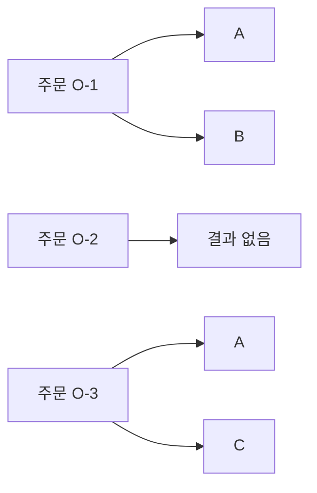

# 13장. FlatMap

`map`에서는 원소 하나가 결과 하나에 대응했다.
하지만 주문 하나에서 여러 품목이 나오거나, 고객 하나에서 주문이 없을 수도 있다.
이런 계산을 단순히 `map`하면 목록 안에 목록이 생긴다.
`flatMap`은 원소별 계산이 만든 한 층의 구조를 이어 붙여 다음 계산으로 연결한다.

이 장은 목록의 확장에서 출발하여 값의 부재를 다루는 `Option`까지 비교한다.
같은 이름의 연산이 모든 컨텍스트에서 문자열처럼 내용을 펼친다는 뜻은 아니다.
자료구조마다 무엇을 이어 주고 무엇을 보존하는지 살펴보는 것이 중요하다.

---

## 1. 개념과 기본 구분

### 목록에서의 정의

목록의 `flatMap`은 각 원소를 목록으로 변환한 뒤 결과 목록들을 순서대로 연결한다.
하나의 입력 원소는 결과를 0개, 1개, 여러 개 만들 수 있다.
따라서 출력 길이는 입력 길이와 같을 필요가 없다.

```text
List[A] + (A -> List[B]) -> List[B]

[a1, a2, a3]
  map(f)
[[b1, b2], [], [b3]]
  flatten
[b1, b2, b3]
```

여기서 평탄화는 정확히 한 층이다.
임의의 깊이에 있는 모든 목록을 재귀적으로 펼치는 연산이 아니다.
타입에 나타난 한 층의 `List`가 합쳐진다고 읽으면 혼동을 줄일 수 있다.

### 합쳐지는 것과 남는 것

입력 원소의 순서를 따라 각 결과 목록이 연결된다.
각 결과 목록 안의 순서도 유지된다.
중복 원소는 제거되지 않는다.
집합 합집합과 목록 연결은 다른 연산이다.

### `map`과의 차이

`map`의 함수는 `A -> B`다.
목록 `flatMap`의 함수는 `A -> List[B]`다.
함수의 결과에 이미 목록이라는 컨텍스트가 있다는 점이 핵심이다.

### 컨텍스트마다 다른 연결

`Option`의 `flatMap`은 값이 있을 때 다음 선택값 계산을 실행하고, 값이 없으면 부재를 유지한다.
실패 결과의 `flatMap`은 성공값으로 다음 계산을 이어 가고 실패를 전달할 수 있다.
목록에서는 여러 가능성을 연결하고 선택값에서는 부재 가능성을 연결한다.
일반적인 공통 구조는 Monad 장에서 다시 다룬다.

---

## 2. 명령형 스타일과 함수형 스타일

### 중첩 반복문

주문마다 품목 코드를 모으는 코드는 두 층의 반복문을 사용한다.
바깥 반복문은 주문을, 안쪽 반복문은 해당 주문의 품목을 처리한다.

```python
orders = [("A", "B"), (), ("C",)]
skus = []
for order in orders:
    for sku in order:
        skus.append(sku)
```

이 코드는 순서와 중복을 보존한다.
비어 있는 주문은 결과를 추가하지 않는다.
목록 `flatMap`도 같은 관계를 더 직접적으로 표현할 수 있다.

### `map`만 사용했을 때

```scala
final case class Order(id: String, skus: List[String])

val orders = List(
  Order("O-1", List("A", "B")),
  Order("O-2", Nil),
  Order("O-3", List("C"))
)

val grouped = orders.map(_.skus)
val flattened = orders.flatMap(_.skus)
```

`grouped`는 주문별 묶음을 보존한다.
`flattened`는 모든 품목을 한 목록으로 모은다.
어느 쪽이 맞는지는 필요한 결과가 주문별인지 품목별인지에 달려 있다.
평탄화는 구조를 단순하게 만드는 대신 묶음의 경계를 잃을 수 있다.

### 원래 소속을 유지한다

품목과 주문 번호를 함께 반환하면 평탄화 후에도 소속을 알 수 있다.
원소를 펼치는 과정에서 필요한 식별자를 버리지 않는 것이 중요하다.
이것은 `flatMap`의 문제가 아니라 출력 모델의 정보 보존 문제다.

---

## 3. 왜 이 개념을 사용하는가?

### 하나에서 여러 결과로

문서의 각 줄을 단어 목록으로 바꾸거나, 주문을 품목별 작업 목록으로 바꾸는 계산이 자연스럽게
표현된다.
빈 결과도 정상적인 경우로 다룰 수 있다.
특수한 추가·삭제 분기를 결과 수집 코드에 직접 작성하지 않아도 된다.

### 의존적인 다음 계산

고객의 식별자로 주문을 찾고 주문 번호로 배송을 찾는 계산은 앞 결과에 의존한다.
다음 계산이 이미 선택값이나 실패값을 반환한다면 일반 `map`으로는 중첩 컨텍스트가 생긴다.
`flatMap`은 그 연결을 위한 연산을 제공한다.

### 결과 수의 의미

목록 `flatMap`은 여러 가능한 결과를 열거하는 데도 사용할 수 있다.
각 선택에 대해 다음 선택들을 계산하면 조합의 목록을 만든다.
이 경우 출력 크기가 빠르게 커질 수 있다.
간결한 코드가 작은 실행 비용을 뜻하지는 않는다.

### 정보 손실의 명시

빈 목록으로 실패를 나타내면 실패 이유를 잃는다.
정상적인 “결과 없음”과 잘못된 입력을 구별해야 한다면 별도 오류 타입을 사용한다.
목록에 결과를 넣지 않는다고 모든 실패가 올바르게 처리된 것은 아니다.

### 추상화의 적절한 위치

단순한 두 층 반복문이 더 읽기 좋으면 그대로 사용할 수 있다.
중요한 것은 한 입력에서 여러 결과가 나온다는 구조와 순서를 명확히 하는 것이다.
함수형 스타일을 위해 복잡한 람다를 억지로 중첩할 필요는 없다.

---

## 4. Scala에서의 표현

### Scala의 목록과 선택값

다음 프로그램은 목록 평탄화, 조합 생성, 선택값 연결을 각각 검사한다.
세 사례의 타입을 비교하면 `flatMap`이 단순한 목록 유틸리티 이상의 연결 연산이라는 점이 보인다.
선택값의 실패 이유 보존은 뒤의 오류 처리 부에서 확장한다.

<!-- executable:scala -->
```scala
object Chapter13:
  final case class Order(id: String, skus: List[String])
  final case class Customer(id: Int, orderId: String)

  def expand(value: Int): List[Int] =
    if value > 0 then List(value, value * 10) else Nil

  def lookupCustomer(id: Int): Option[Customer] =
    if id == 1 then Some(Customer(1, "O-1")) else None

  def lookupOrder(id: String): Option[Order] =
    if id == "O-1" then Some(Order(id, List("A", "B"))) else None

  def check(): Unit =
    val orders = List(
      Order("O-1", List("A", "B")),
      Order("O-2", Nil),
      Order("O-3", List("A", "C"))
    )
    assert(orders.map(_.skus) == List(List("A", "B"), Nil, List("A", "C")))
    assert(orders.flatMap(_.skus) == List("A", "B", "A", "C"))
    val located = orders.flatMap { order =>
      order.skus.map(sku => (order.id, sku))
    }
    assert(located.head == ("O-1", "A"))
    assert(located.last == ("O-3", "C"))

    val combinations = List("red", "blue").flatMap { color =>
      List("S", "M").map(size => (color, size))
    }
    assert(combinations == List(
      ("red", "S"), ("red", "M"),
      ("blue", "S"), ("blue", "M")
    ))

    val order = lookupCustomer(1).flatMap(c => lookupOrder(c.orderId))
    assert(order.map(_.id).contains("O-1"))
    assert(lookupCustomer(9).flatMap(c => lookupOrder(c.orderId)).isEmpty)
    assert(List(1, 0, 2).flatMap(expand) == List(1, 10, 2, 20))

    val f: Int => List[Int] = x => List(x, x + 1)
    val g: Int => List[String] = x => List(s"a$x", s"b$x")
    for size <- 0 to 10 do
      val values = (0 until size).toList
      assert(values.flatMap(x => List(x)) == values)
      assert(values.flatMap(f).flatMap(g) == values.flatMap(x => f(x).flatMap(g)))
    assert(List(3).flatMap(f) == f(3))
```

### 조합과 위치별 대응을 구분한다

색상과 크기의 예제는 모든 조합을 만든다.
두 목록을 같은 위치끼리 짝짓는 `zip`과 다르다.
색상 2개와 크기 2개를 조합하면 결과는 4개이며 `zip` 결과는 보통 2개다.
원하는 대응 관계를 먼저 정해야 한다.

### 선택값에서의 중첩

`lookupCustomer(1).map(c => lookupOrder(c.orderId))`의 결과는 `Option[Option[Order]]`다.
고객 부재와 주문 부재를 두 층으로 구별해야 한다면 이 구조가 유용할 수도 있다.
한 층의 부재로 연결하고 싶을 때 `flatMap`을 사용한다.
무조건 평탄화하는 것이 올바른 설계는 아니다.

---

## 5. 상태 변경보다 값 변환

### 출력 크기

목록 `flatMap`의 결과 길이는 각 입력이 만든 목록 길이의 합이다.
입력 길이만으로 출력 크기를 알 수 없다.
여러 단계의 조합 생성에서는 각 단계의 선택 수가 곱해질 수 있다.



중복 품목 `A`는 두 번 나타난다.
주문별 발생을 보존하는 결과라면 이것이 올바르다.
유일한 상품 코드 목록이 필요하면 별도의 중복 제거 정책을 적용한다.

### 한 층만 제거한다

`List[List[List[A]]]`에 한 번 `flatten`을 적용하면 `List[List[A]]`가 된다.
깊이를 모두 제거하려면 다른 알고리즘이 필요하다.
재귀 평탄화는 문자열과 사전 같은 자료형을 어떻게 취급할지도 정해야 한다.

### 빈 결과의 책임

결과가 없는 입력을 추적해야 한다면 빈 목록만 반환하지 않는다.
입력 식별자와 상태를 함께 반환하거나 별도 보고서를 만든다.
값 변환의 간결함보다 필요한 정보의 보존을 우선한다.

---

## 6. 함수 합성과 데이터 흐름

### 단위 원소와 연결 법칙

값 하나를 한 원소 목록에 넣는 함수는 목록 연결의 시작점을 제공한다.
한 원소 목록을 `flatMap`하면 그 원소에 함수를 적용한 결과가 된다.
각 원소를 다시 한 원소 목록에 넣으면 원래 목록과 같은 값이 된다.

```text
[x].flatMap(f) = f(x)
xs.flatMap(x => [x]) = xs
```

### 연속 연결

순수한 목록 계산의 연속 연결은 괄호를 바꾸어 설명할 수 있다.
각 입력이 만든 결과를 다음 계산에 전달한다는 구조가 유지된다.
이 법칙은 Monad 장의 법칙과 연결된다.

```text
xs.flatMap(f).flatMap(g)
  = xs.flatMap(x => f(x).flatMap(g))
```

엄격한 목록에서 두 표현은 효과가 있는 콜백의 호출을 섞는 방식이 달라질 수 있다.
법칙을 값의 관계로 사용하려면 순수성과 정의역의 전제조건을 확인한다.
컨텍스트의 법칙을 외부 I/O 실행 순서의 허가로 확대하지 않는다.

### 일반 함수 합성과의 차이

`f: A -> List[B]`와 `g: B -> List[C]`는 일반 합성으로 직접 연결되지 않는다.
중간 결과가 `B`가 아니라 `List[B]`이기 때문이다.
`a => f(a).flatMap(g)`처럼 컨텍스트를 이어 주는 합성이 필요하다.
이를 일반화하는 용어는 뒤에서 소개한다.

---

## 7. 장점과 트레이드오프

### 장점과 비용

| 요구 | 적합한 관점 | 주의할 문제 |
| --- | --- | --- |
| 주문에서 품목 추출 | 한 입력에서 여러 결과 | 소속 정보 손실 |
| 모든 조합 열거 | 앞 선택에 의존한 다음 선택 | 조합 수 폭증 |
| 선택값 조회 연결 | 부재의 전파 | 실패 이유 손실 |
| 빈 결과 허용 | 0개 결과를 정상 표현 | 오류 은폐 |
| 지연 평탄화 | 필요한 결과만 소비 | 입력과 자원 수명 |

### 출력 중심의 복잡도

원소별 계산 비용과 출력 전체를 만드는 비용을 함께 고려한다.
입력이 작아도 각 원소가 큰 목록을 만들면 메모리 사용이 커진다.
지연 반복자를 사용하면 한꺼번에 보관하는 양을 줄일 수 있지만 전체 계산량이 자동 감소하지는
않는다.

### 중간 구조

`map` 뒤 `flatten`은 중간 목록들의 목록을 만들 수 있다.
`flatMap`은 구현에 따라 중간 구조를 줄일 수 있다.
그러나 모든 언어와 라이브러리에서 비용이 완전히 제거된다고 가정하지 않는다.

### 읽기 쉬운 중첩

두세 개의 의존적인 선택은 comprehension이나 `for` 표기가 더 읽기 좋을 수 있다.
오류 처리와 외부 효과가 복잡하면 단계에 이름을 붙이는 편이 낫다.
중첩 람다의 깊이를 함수형 숙련도의 지표로 삼지 않는다.

---

## 8. 상태와 부수효과의 경계

### 효과를 여러 번 실행할 가능성

각 입력에서 여러 결과가 나온다면 다음 단계도 그 결과 수만큼 실행될 수 있다.
앞 단계가 두 후보를 만들고 뒤 단계가 결제를 수행하면 결제도 두 번 실행될 수 있다.
목록의 비결정적 선택 모델을 실제 효과 실행과 무심코 결합하지 않는다.

### 지연된 소비

Python의 평탄화 반복자는 안쪽 반복자를 필요할 때 소비할 수 있다.
안쪽 계산이 파일이나 네트워크를 사용하면 소비 시점에 효과가 발생한다.
중간에 소비를 멈췄을 때 자원을 누가 닫는지 계약이 필요하다.

### 실패 이유의 보존

파싱 실패를 빈 목록으로 바꾸는 구현은 성공값만 모으기에는 간편하다.
하지만 실패 입력과 이유를 보고해야 하는 시스템에는 부족하다.
`Either`나 Validation처럼 오류를 명시적인 값으로 보관하는 설계를 검토한다.

### 병렬화와 순서

각 입력의 결과를 병렬로 계산하더라도 출력 순서를 어떻게 정할지 결정해야 한다.
완료 순서와 입력 순서는 다를 수 있다.
목록 `flatMap`의 순서 계약을 유지하려면 결과 수집 전략도 그 계약에 맞아야 한다.

---

## 9. Python에서 적용하기

### Python의 중첩 컴프리헨션과 `chain`

표준 Python에는 모든 컨텍스트에 공통인 `flatMap`이 없다.
목록에는 중첩 컴프리헨션이 자연스럽고, 반복자에는 `itertools.chain.from_iterable`을 사용할 수
있다.
아래 예제는 원소 확장, 순서, 지연 소비를 함께 검사한다.

<!-- executable:python -->
```python
from collections.abc import Callable, Iterable, Iterator
from dataclasses import dataclass
from itertools import chain
from typing import TypeVar

A = TypeVar("A")
B = TypeVar("B")


@dataclass(frozen=True)
class Order:
    order_id: str
    skus: tuple[str, ...]


def flat_map(values: Iterable[A], function: Callable[[A], Iterable[B]]) -> Iterator[B]:
    for value in values:
        yield from function(value)


def test_orders() -> None:
    orders = (
        Order("O-1", ("A", "B")),
        Order("O-2", ()),
        Order("O-3", ("A", "C")),
    )
    flattened = [sku for order in orders for sku in order.skus]
    assert flattened == ["A", "B", "A", "C"]
    assert list(chain.from_iterable(order.skus for order in orders)) == flattened
    located = [(order.order_id, sku) for order in orders for sku in order.skus]
    assert located[0] == ("O-1", "A")
    assert located[-1] == ("O-3", "C")


def test_combinations() -> None:
    combinations = [(color, size) for color in ("red", "blue") for size in ("S", "M")]
    assert len(combinations) == 4
    assert combinations == [("red", "S"), ("red", "M"), ("blue", "S"), ("blue", "M")]
    assert len(list(zip(("red", "blue"), ("S", "M")))) == 2


def test_laws() -> None:
    f = lambda value: [value, value + 1]
    g = lambda value: [f"a{value}", f"b{value}"]
    for size in range(11):
        values = list(range(size))
        assert list(flat_map(values, lambda x: [x])) == values
        left = list(flat_map(flat_map(values, f), g))
        right = list(flat_map(values, lambda x: flat_map(f(x), g)))
        assert left == right
    assert list(flat_map([3], f)) == f(3)


def test_laziness_and_one_layer() -> None:
    calls: list[int] = []

    def expand(value: int) -> list[int]:
        calls.append(value)
        return [value, value * 10]

    result = flat_map([1, 2], expand)
    assert calls == []
    assert next(result) == 1
    assert calls == [1]
    assert list(result) == [10, 2, 20]
    assert calls == [1, 2]
    assert list(result) == []
    assert list(chain.from_iterable([[[1]], [[2]]])) == [[1], [2]]


if __name__ == "__main__":
    test_orders()
    test_combinations()
    test_laws()
    test_laziness_and_one_layer()
```

### 반복 순서 읽기

중첩 컴프리헨션의 `for` 절은 일반 중첩 반복문의 바깥쪽부터 같은 순서로 읽는다.
가장 안쪽의 결과 표현식이 각 조합에서 평가된다.
헷갈리면 먼저 일반 반복문으로 풀어 쓰고 결과 순서를 확인한다.

---

## 10. Python의 표현 한계

### 임의 iterable의 의미

문자열도 iterable이므로 평탄화 함수에 문자열을 반환하면 문자 단위로 펼쳐질 수 있다.
딕셔너리는 기본 반복에서 키를 제공한다.
함수 타입을 넓게 만들수록 어떤 자료를 펼칠지 계약을 더 분명히 해야 한다.

### 선택값의 일반화

`T | None`을 대상으로 한 연결 함수를 직접 작성할 수 있다.
그러나 그것이 목록의 평탄화와 동일한 런타임 구현을 공유해야 한다는 뜻은 아니다.
공통 법칙과 구체적인 실행 표현을 구분한다.

### 정적 타입의 범위

표준 Python의 타입 변수만으로 임의의 `F[A]` 컨텍스트를 Scala의 `F[_]`처럼 추상화하기는 어렵다.
구체 타입을 위한 함수가 더 이해하기 쉽고 검사하기 쉬운 경우가 많다.
고차 타입 장에서 이 차이를 자세히 다룬다.

### 생성기의 수명

생성기를 반환하면 계산과 오류가 호출 시점이 아니라 소비 시점에 발생할 수 있다.
호출자가 소비하지 않거나 중간에 멈출 가능성을 고려해야 한다.
지연 실행과 자원 관리의 책임을 문서에 남긴다.

---

## 11. 핵심 정리

### 핵심 결론

목록 `flatMap`은 원소별 목록을 한 층 연결한다.
입력 하나가 결과를 여러 개 만들 수 있고 중복과 순서를 보존한다.
선택값과 실패값에서는 해당 컨텍스트의 연결 의미를 따른다.
평탄화는 묶음이나 실패 이유를 잃을 수 있으므로 출력 모델을 신중히 정한다.

### 연습 1: 한 층 평탄화

`[[[1, 2]], [[3]]]`를 한 번 평탄화한 결과를 적어라.

**해설.** `[[1, 2], [3]]`다.
모든 숫자가 한 목록으로 모이는 것은 아니다.
입력 타입의 바깥 두 목록 층이 하나로 합쳐진다고 읽는다.

### 연습 2: 조합 수

색상 3개, 크기 4개, 소재 2개를 중첩 `flatMap`으로 모두 조합한다.
결과 개수와 주의할 비용을 설명하라.

**해설.** 독립적인 모든 조합이면 24개다.
단계가 늘어날수록 결과 수가 곱해질 수 있다.
지연 계산은 한꺼번에 보관하는 양을 줄여도 전체 조합 수를 없애지는 않는다.

### 연습 3: 실패와 빈 목록

주문을 파싱하지 못하면 빈 목록을 반환하도록 했다.
실패 보고서가 필요한 경우 무엇이 부족한가?

**해설.** 실패한 입력과 이유가 결과에 남지 않는다.
정상적인 빈 주문과 파싱 실패를 구별할 수 없다.
실패를 별도 데이터로 표현하고 성공 결과와 함께 보관해야 한다.

### 연습 4: 주문 소속

모든 품목 코드를 평탄화한 뒤 어느 주문의 품목인지 알 수 없게 되었다.
어떤 출력 타입으로 바꿀 수 있는가?

**해설.** 주문 번호와 품목 코드를 함께 가진 레코드나 쌍을 반환한다.
평탄화 전에 필요한 문맥을 각 결과값에 포함한다.
연산보다 데이터 모델이 정보 보존을 결정한다.

### 다음 장과 참고 자료

다음 장은 변환·선택·확장·축약을 하나의 업무 파이프라인으로 구성한다.
단계의 타입과 오류 경계를 연결하면서 지금까지의 연산을 함께 사용한다.

[Scala 공식 문서: Collections Methods](https://docs.scala-lang.org/scala3/book/collections-methods.html)
[Python 공식 문서: itertools.chain](https://docs.python.org/3.14/library/itertools.html#itertools.chain)
[Scala 공식 문서: for Expressions](https://docs.scala-lang.org/scala3/book/control-structures.html)
