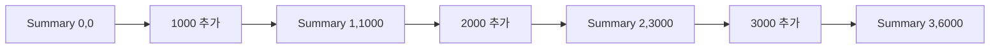

# 12장. Fold / Reduce

목록의 모든 원소를 하나의 결과로 모으는 작업은 합계뿐 아니라 보고서, 인덱스, 상태 전이에도
나타난다.
`fold`는 초기 누적값과 갱신 함수를 이용해 이런 계산을 표현한다.
이번 장에서는 평균 보고서를 만들면서 순회 방향, 초기값, 결합법칙을 구분한다.

가장 중요한 구분은 순차적인 왼쪽 fold에 결합법칙이 반드시 필요한 것은 아니라는 점이다.
계산을 병렬로 나누거나 괄호를 바꾸려 할 때 추가 법칙이 필요하다.
순차 실행의 계약과 대수적 재배치의 계약을 분리해서 읽는다.

---

## 1. 개념과 기본 구분

### 누적값과 원소

왼쪽 fold는 누적값과 다음 원소를 갱신 함수에 전달한다.
갱신 함수의 결과가 다음 단계의 누적값이 된다.
입력 원소 타입과 누적값 타입은 달라도 된다.

```text
foldLeft: List[A] × S × ((S, A) -> S) -> S

s0
  -> step(s0, a1) = s1
  -> step(s1, a2) = s2
  -> step(s2, a3) = s3
```

빈 목록의 결과는 초기값 `s0`이다.
초기값은 단순히 문법상 필요한 인자가 아니라 빈 입력의 의미를 정한다.
평균처럼 빈 입력에서 결과가 정의되지 않는 경우에는 요약값과 최종 해석을 분리할 수 있다.

### `reduce`와의 구분

초기값 없이 첫 원소를 누적값으로 사용하는 축약도 있다.
이 방식은 빈 입력에서 별도 처리가 필요하다.
언어와 라이브러리마다 `fold`, `reduce`의 정확한 시그니처가 다르므로 이름만으로 판단하지 않는다.

### 방향

왼쪽 fold는 왼쪽부터 누적한다.
오른쪽 fold는 오른쪽 구조에서 결과를 조합한다.
비결합적 연산이나 순서에 민감한 연산에서는 결과가 달라질 수 있다.

### 순차성과 결합법칙

왼쪽 fold는 정해진 순서대로 계산하므로 갱신 연산이 결합적이지 않아도 정의할 수 있다.
병렬 분할이나 재괄호화에는 결합법칙과 적절한 초기값의 성질을 검토해야 한다.
이 차이를 놓치면 모든 `reduce`가 병렬화 가능하다는 잘못된 결론에 이른다.

---

## 2. 명령형 스타일과 함수형 스타일

### 가변 누적 보고서

```python
amounts = [1000, 2000, 3000]
count = 0
amount_sum = 0
for amount in amounts:
    count += 1
    amount_sum += amount
```

이 코드는 개수와 합계라는 두 상태를 함께 갱신한다.
둘의 관계를 하나의 요약값으로 묶으면 불변식을 설명하기 쉬워진다.

### 요약값을 반환한다

```scala
final case class Summary(count: Long, total: Long)

val summary = List(1000L, 2000L, 3000L).foldLeft(Summary(0, 0)) {
  (acc, amount) => Summary(acc.count + 1, acc.total + amount)
}
```

각 단계는 이전 요약과 원소에서 새 요약을 만든다.
입력 목록을 수정하지 않는다.
평균은 요약이 완성된 뒤 `total / count`로 해석할 수 있다.

### 평균의 함정

부분 목록의 평균만 저장하면 전체 평균을 올바르게 합치기 어렵다.
부분 목록의 크기가 다를 수 있기 때문이다.
합계와 개수를 보관하면 두 요약을 정확히 합칠 수 있다.

```text
[10]의 평균 = 10
[20, 30, 40]의 평균 = 30
평균들의 평균 = 20
전체 평균 = 25
```

요약값에 어떤 정보를 남길지 결정하는 것이 fold 설계의 핵심이다.

---

## 3. 왜 이 개념을 사용하는가?

### 누적 불변식

각 단계의 `count`는 처리한 원소 수다.
`total`은 그 원소들의 합계다.
이 불변식을 유지하면 마지막 요약의 의미를 설명할 수 있다.

### 한 번의 순회

개수와 합계를 별도 순회로 계산하지 않고 한 번에 모을 수 있다.
입력이 한 번만 소비 가능한 스트림이면 특히 중요하다.
다만 요약값이 커지는 방식에 따라 메모리 비용은 달라진다.

### 복잡한 보고서

최솟값, 최댓값, 오류 개수, 통화별 합계를 함께 누적할 수 있다.
모든 것을 하나의 거대한 누적 객체에 넣기보다 필요한 보고서의 계약을 명확히 한다.
서로 독립적인 요약을 결합하는 설계는 Monoid 장으로 이어진다.

### 빈 입력의 정책

합계의 빈 입력은 0이 자연스럽다.
최댓값이나 평균은 부재를 반환하는 편이 더 명확할 수 있다.
임의의 숫자를 기본값으로 정하면 실제 데이터와 구분하지 못할 수 있다.

### 상태 전이와의 연결

명령 목록을 현재 상태에 차례로 적용하는 것도 왼쪽 fold로 표현할 수 있다.
이때 순서는 업무 의미의 일부다.
단순 합계와 같은 병렬 결합 법칙을 가정해서는 안 된다.

---

## 4. Scala에서의 표현

### Scala의 요약과 방향 비교

아래 예제는 합계에 `BigInt`를 사용하여 요약 결합의 산술 범위를 명확히 한다.
개수도 `BigInt`로 두어 예제의 대수 법칙을 고정 폭 오버플로와 분리한다.
실제 시스템에서는 요구 범위와 비용에 맞는 숫자 표현을 선택한다.

<!-- executable:scala -->
```scala
object Chapter12:
  final case class Summary(count: BigInt, total: BigInt):
    def add(amount: BigInt): Summary =
      Summary(count + 1, total + amount)

    def combine(other: Summary): Summary =
      Summary(count + other.count, total + other.total)

    def mean: Option[BigDecimal] =
      if count == 0 then None
      else Some(BigDecimal(total) / BigDecimal(count))

  val empty = Summary(0, 0)

  def summarize(values: List[BigInt]): Summary =
    values.foldLeft(empty)((acc, value) => acc.add(value))

  def check(): Unit =
    val values = List[BigInt](1000, 2000, 3000)
    val result = summarize(values)
    assert(result == Summary(3, 6000))
    assert(result.mean.contains(BigDecimal(2000)))
    assert(summarize(Nil) == empty)
    assert(empty.mean.isEmpty)

    val numbers = List(10, 3, 2)
    val left = numbers.foldLeft(0)(_ - _)
    val right = numbers.foldRight(0)(_ - _)
    assert(left == -15)
    assert(right == 9)

    val a = summarize(List[BigInt](10))
    val b = summarize(List[BigInt](20, 30, 40))
    assert(a.combine(b).mean.contains(BigDecimal(25)))
    assert(a.combine(empty) == a)
    assert(empty.combine(a) == a)

    for split <- 0 to values.length do
      val first = summarize(values.take(split))
      val second = summarize(values.drop(split))
      assert(first.combine(second) == result)

    val c = summarize(List[BigInt](50, 60))
    assert(a.combine(b).combine(c) == a.combine(b.combine(c)))
```

### 요약과 최종 표현을 분리한다

합계와 개수의 결합은 정확한 정수 연산이다.
평균을 소수로 표현하는 순간에는 정밀도와 반올림 정책을 고려해야 한다.
최종 표시를 요약 결합과 분리하면 중간 반올림 오류를 줄일 수 있다.

### 방향 예제의 풀이

왼쪽 결과는 `((0 - 10) - 3) - 2`다.
오른쪽 결과는 `10 - (3 - (2 - 0))`다.
같은 연산 기호와 같은 원소라도 괄호와 초기값 위치가 다르면 다른 계산이다.

### 결합 가능한 요약

`Summary.combine`은 두 요약의 개수와 합계를 각각 더한다.
이 연산은 적절한 정수 모델에서 결합적이며 빈 요약이 항등원이다.
그래서 입력을 나누어 요약한 뒤 다시 합칠 수 있다.

---

## 5. 상태 변경보다 값 변환

### 누적값의 상태 전이

fold의 각 단계는 상태 전이처럼 읽을 수 있다.
다만 상태가 외부 변수에 숨지 않고 입력과 출력으로 나타난다.
중간 요약을 기록하면 계산 과정을 재현할 수 있다.



최종 결과만 필요한 경우에는 중간 요약을 모두 보관할 필요가 없다.
중간 상태가 필요하면 `scan` 계열 연산을 검토한다.
최종 축약과 모든 중간값의 수집은 다른 결과 계약이다.

### 초기값의 정보

빈 요약은 원소를 하나도 처리하지 않았다는 상태다.
초기값에 임의의 금액을 넣으면 결과는 그 금액을 포함한 다른 계산이 된다.
초기값을 단순히 “오류를 피하기 위한 기본값”으로 생각하지 않는다.

### 데이터 손실

합계만 남기면 원소별 정보는 사라진다.
나중에 통화별 합계나 이상치 분석이 필요하면 기존 요약만으로 복원할 수 없을 수 있다.
요약 설계는 미래 질의와 보관 비용 사이의 선택이다.

---

## 6. 함수 합성과 데이터 흐름

### `map` 후 `fold`

품목을 금액으로 변환한 뒤 합계를 낼 수 있다.
변환과 축약을 분리하면 각 단계의 타입이 명확하다.
필요하면 갱신 함수 안에서 원소 변환을 수행하여 한 번의 순회로 표현할 수도 있다.

```text
items.map(amount).foldLeft(0)(+)

items.foldLeft(0)((sum, item) => sum + amount(item))
```

순수한 변환이라면 값의 의미를 비교하기 쉽다.
효과가 있는 변환은 실행 순서와 실패 시점을 함께 확인해야 한다.

### 요약의 결합

원소를 요약으로 바꾸고 요약들을 결합하는 구조는 `foldMap`으로 일반화할 수 있다.
이때 필요한 결합 연산과 항등원이 Monoid의 주제다.
구체적인 보고서에서 출발하면 추상화가 왜 필요한지 이해하기 쉽다.

### 순서에 민감한 누적

문자열 연결은 결합적이지만 일반적으로 교환적이지 않다.
부분 결과를 합칠 때 원래 순서를 유지해야 한다.
결합법칙이 있다는 사실만으로 순서를 마음대로 섞어도 되는 것은 아니다.

### 병렬화의 조건

부분 요약을 독립적으로 계산하고 합치려면 분할·결합이 원래 순차 의미를 보존해야 한다.
단순히 갱신 함수의 타입이 `(S, A) -> S`라는 사실만으로는 부족하다.
원소 추가와 요약 결합 사이의 관계를 법칙으로 확인해야 한다.

---

## 7. 장점과 트레이드오프

### 장점과 트레이드오프

| 설계 | 장점 | 주의점 |
| --- | --- | --- |
| 명시적 초기값 | 빈 입력 의미 | 잘못된 기본값 |
| 요약 레코드 | 불변식의 묶음 | 불필요한 필드 증가 |
| 한 번의 순회 | 반복자 지원 | 복잡한 갱신 함수 |
| 부분 요약 결합 | 분할 처리 | 결합 법칙과 순서 |
| 중간값 수집 | 추적과 시각화 | 보관 메모리 |

### 공간 비용

합계와 개수처럼 고정 크기의 요약은 입력 전체를 보관하지 않아도 된다.
반면 누적값에 모든 원소를 추가하면 결과 크기만큼 메모리가 필요하다.
fold라는 이름이 상수 공간을 보장하지 않는다.

### 반복 연결의 비용

불변 문자열이나 목록을 매 단계 끝에 덧붙이면 복사 비용이 누적될 수 있다.
빌더나 적절한 자료구조를 사용하여 외부의 값 계약과 내부 구현 비용을 분리할 수 있다.
이전 장의 지역 변경 허용 원칙이 다시 적용된다.

### 부동소수점

부동소수점 덧셈은 반올림 때문에 실수 덧셈의 결합법칙을 그대로 만족하지 않는다.
병렬 합산이나 순서 변경은 마지막 비트와 오차를 바꿀 수 있다.
정확도 요구와 허용 오차를 명시하고 필요한 수치 기법을 선택해야 한다.

---

## 8. 상태와 부수효과의 경계

### 이벤트를 적용하는 fold

주문 이벤트를 상태에 순서대로 적용하는 구조는 fold와 닮았다.
그러나 이벤트 처리 함수가 외부 저장을 수행하면 부분 효과가 남을 수 있다.
상태 계산과 실제 저장을 분리하는 편이 재현과 테스트에 유리하다.

### 실패하는 누적

어떤 원소에서 실패하면 뒤 원소를 처리하지 않을지, 오류를 모으며 계속할지 정해야 한다.
일반적인 예외 전파는 보통 즉시 중단한다.
오류 누적이 필요하면 누적값에 오류 구조를 포함하거나 Validation 같은 별도 조합을 사용한다.

### 스트림의 끝

무한 입력을 최종 fold로 모두 축약하려 하면 결과가 나오지 않을 수 있다.
유한 구간을 정하거나 중간 요약을 내보내는 스트리밍 설계를 사용해야 한다.
입력의 유한성도 계약이다.

### 자원 해제

파일 반복자를 fold하는 동안 예외가 발생하면 파일을 닫는 책임이 필요하다.
누적 연산이 자원 수명까지 자동 관리하는 것은 아니다.
컨텍스트 관리자나 자원 추상화를 경계에 사용한다.

---

## 9. Python에서 적용하기

### Python의 `reduce`와 명시적 루프

Python에서는 단순 합계에 `sum`이 더 읽기 좋을 수 있다.
복합 요약에는 명시적 루프가 자연스럽고, `reduce`는 그 갱신 구조를 함수로 표현할 수 있다.
아래 예제는 두 구현의 결과를 비교한다.

<!-- executable:python -->
```python
from dataclasses import dataclass
from fractions import Fraction
from functools import reduce


@dataclass(frozen=True)
class Summary:
    count: int = 0
    total: int = 0

    def add(self, amount: int) -> "Summary":
        return Summary(self.count + 1, self.total + amount)

    def combine(self, other: "Summary") -> "Summary":
        return Summary(self.count + other.count, self.total + other.total)

    def mean(self) -> Fraction | None:
        if self.count == 0:
            return None
        return Fraction(self.total, self.count)


def summarize(values: list[int]) -> Summary:
    return reduce(lambda acc, value: acc.add(value), values, Summary())


def summarize_loop(values: list[int]) -> Summary:
    summary = Summary()
    for value in values:
        summary = summary.add(value)
    return summary


def fold_right_subtract(values: list[int], initial: int) -> int:
    result = initial
    for value in reversed(values):
        result = value - result
    return result


def test_summary() -> None:
    values = [1000, 2000, 3000]
    result = summarize(values)
    assert result == Summary(3, 6000)
    assert result == summarize_loop(values)
    assert result.mean() == Fraction(2000)
    assert summarize([]) == Summary()
    assert summarize([]).mean() is None


def test_direction() -> None:
    values = [10, 3, 2]
    assert reduce(lambda acc, value: acc - value, values, 0) == -15
    assert fold_right_subtract(values, 0) == 9


def test_combination() -> None:
    values = [10, 20, 30, 40]
    whole = summarize(values)
    for split in range(len(values) + 1):
        left = summarize(values[:split])
        right = summarize(values[split:])
        assert left.combine(right) == whole
    assert whole.mean() == Fraction(25)
    a, b, c = summarize([1]), summarize([2, 3]), summarize([4])
    assert a.combine(b).combine(c) == a.combine(b.combine(c))
    assert a.combine(Summary()) == a
    assert Summary().combine(a) == a


def test_empty_reduce_without_initial() -> None:
    try:
        reduce(lambda a, b: a + b, [])
    except TypeError:
        pass
    else:
        raise AssertionError("empty reduce unexpectedly succeeded")


if __name__ == "__main__":
    test_summary()
    test_direction()
    test_combination()
    test_empty_reduce_without_initial()
```

### 정확한 평균 표현

예제는 `Fraction`으로 평균을 유리수로 보관한다.
표시할 때 소수로 바꾸는 정책과 요약의 정확성을 분리하기 위한 선택이다.
실무에서는 데이터 크기와 계산 비용도 함께 고려해야 한다.

---

## 10. Python의 표현 한계

### 표준 `reduce`의 방향

Python의 `functools.reduce`는 왼쪽 누적 방식이다.
오른쪽 fold가 필요하면 입력을 역순으로 처리하는 등 별도 구현을 해야 한다.
입력이 임의 반복자이면 역순 접근을 위해 물질화가 필요할 수 있다.

### 결합 법칙의 자동 검사 없음

타입 힌트는 연산의 결합법칙이나 항등원 법칙을 증명하지 않는다.
작은 입력의 법칙 테스트와 수학적 설명을 함께 사용한다.
테스트에 통과했다고 모든 입력에서 법칙이 성립한다고 단정하지 않는다.

### 고정 크기 요약의 의미

필드 수가 고정이어도 Python의 큰 정수는 값에 따라 메모리 크기가 늘 수 있다.
알고리즘의 요약 필드 수와 실제 비트 복잡도를 구분한다.
정확한 비용 분석에는 숫자 크기도 포함한다.

### 가독성

중첩 람다를 사용하는 `reduce`보다 명시적인 루프가 더 읽기 좋은 경우가 많다.
fold의 사고방식은 특정 함수 호출을 강제하지 않는다.
누적값과 불변식을 명확히 표현하는 구현을 선택한다.

---

## 11. 핵심 정리

### 핵심 결론

fold는 초기값과 갱신 함수로 여러 원소를 하나의 요약으로 모은다.
빈 입력과 순회 방향은 계산의 의미를 정한다.
순차 fold와 병렬 결합은 필요한 법칙이 다르다.
요약값에 남긴 정보가 이후에 가능한 질의를 결정한다.

### 연습 1: 평균들의 평균

`[10]`과 `[20, 30, 40]`의 평균을 단순 평균하면 왜 전체 평균과 다른가?

**해설.** 부분 집합의 크기가 다르기 때문이다.
각 부분의 합계와 개수를 합쳐야 전체 평균을 구할 수 있다.
평균값 하나는 결합에 필요한 가중치 정보를 잃는다.

### 연습 2: 초기값

합계를 구하면서 초기값 100을 사용했다.
빈 목록과 `[1, 2]`의 결과를 설명하라.

**해설.** 빈 목록은 100이고 `[1, 2]`는 103이다.
초기값도 계산의 입력이며 자동으로 무시되는 장식이 아니다.
원하는 항등값과 업무상의 시작 상태를 구분한다.

### 연습 3: 순차와 병렬

뺄셈으로 왼쪽 fold를 작성하는 것은 잘못인가?
그 계산을 임의로 병렬 분할하는 것은 왜 별도 문제인가?

**해설.** 왼쪽 fold는 정해진 괄호로 뺄셈을 수행하므로 잘 정의된다.
괄호를 바꾸면 결과가 달라질 수 있어 같은 방식으로 병렬 결합할 수 없다.
결합법칙은 재배치의 근거이지 모든 순차 누적의 전제조건이 아니다.

### 연습 4: 문자열 수집

매 단계에서 기존 문자열 끝에 새 조각을 붙이는 fold의 비용을 검토하라.

**해설.** 기존 내용을 반복 복사하는 구현에서는 전체 비용이 커질 수 있다.
조각을 모아 한 번 결합하거나 빌더를 사용하는 방법을 검토한다.
외부 인터페이스의 불변성과 내부 구현 전략을 분리한다.

### 다음 장과 참고 자료

다음 장은 원소마다 여러 결과를 만들거나 실패 가능한 계산을 이어 주는 `flatMap`을 다룬다.
단순한 축약과 컨텍스트를 이어 붙이는 연산의 차이를 비교하자.

[Python 공식 문서: functools.reduce](https://docs.python.org/3.14/library/functools.html#functools.reduce)
[Scala 공식 문서: Collections Methods](https://docs.scala-lang.org/scala3/book/collections-methods.html)
