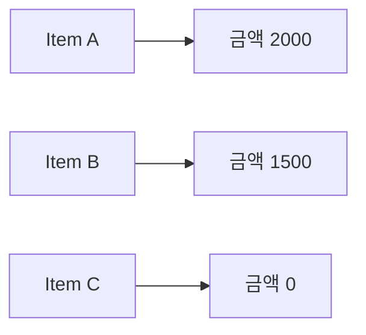

# 10장. Map


함수 합성이 값 하나의 변환을 연결한다면 `map`은 그 변환을 구조 안의 값들에 적용한다.
주문 품목마다 금액을 계산하거나 고객마다 표시 이름을 만드는 작업이 대표적이다.
이번 장은 목록의 길이와 순서를 유지하는 변환부터 시작하여 평가 시점과 합성 법칙까지 확장한다.

이름이 같아도 모든 자료구조의 `map`이 목록과 똑같은 의미를 갖는 것은 아니다.
이 장에서는 먼저 순서가 있는 유한 목록을 기준으로 계약을 정의한다.
Functor 장에서 다른 컨텍스트로 일반화한다.

---

## 1. 개념과 기본 구분

### 목록 `map`의 계약

목록 `map`은 각 원소에 함수를 적용하여 결과 목록을 만든다.
순서가 있는 목록에서는 입력 순서에 대응하는 출력 순서를 유지한다.
입력 길이가 `n`이면 결과 길이도 `n`이다.

```text
List[A] + (A -> B) -> List[B]

[a1, a2, a3]
      map(f)
[f(a1), f(a2), f(a3)]
```

원소 타입은 바뀔 수 있지만 목록의 위치 구조는 유지된다.
반면 `filter`는 원소를 선택하여 길이를 줄일 수 있다.
`flatMap`은 원소마다 여러 결과를 만들어 길이를 바꿀 수 있다.
세 연산을 결과의 관계로 구분하면 선택이 쉬워진다.

### 값 변환과 효과 순회

`map`의 주된 목적은 새 값을 만드는 것이다.
원소마다 출력만 하고 반환값을 버리면 의도가 흐려질 수 있다.
효과를 수행하는 순회와 값 변환을 구분해서 표현한다.

### 빈 목록

빈 목록을 변환하면 빈 목록이다.
변환 함수는 호출되지 않는다.
이 계약은 콜백이 비싸거나 효과가 있을 때 특히 중요하다.

### 구조 유지의 범위

집합의 `map`은 중복 결과가 합쳐질 수 있어 원소 수가 줄 수 있다.
따라서 목록의 길이 법칙을 모든 자료구조에 그대로 적용하면 안 된다.
어떤 구조의 어떤 연산을 말하는지 명시해야 한다.

---

## 2. 명령형 스타일과 함수형 스타일

### 반복문으로 변환하기

```python
amounts = [1000, 2000, 3000]
labels = []
for amount in amounts:
    labels.append(f"{amount} KRW")
```

이 코드는 원소별 변환과 결과 수집을 직접 작성한다.
간단한 반복문도 충분히 읽기 좋을 수 있다.
다만 “각 원소를 같은 규칙으로 바꾼다”는 의도를 명시하면 독자가 더 빨리 이해할 수 있다.

### 선언적인 변환

```scala
val amounts = List(1000, 2000, 3000)
val labels = amounts.map(amount => s"$amount KRW")
```

각 출력 원소가 어떤 입력 원소에서 왔는지 바로 보인다.
입력을 수정하는 작업과도 구분된다.
원본 목록을 다른 계산에 다시 사용할 수 있다.

### Python의 자연스러운 표현

```python
amounts = [1000, 2000, 3000]
labels = [f"{amount} KRW" for amount in amounts]
```

리스트 컴프리헨션은 엄격한 목록 변환을 읽기 쉽게 표현한다.
표준 `map`은 반복자를 반환하므로 이 코드와 평가 시점이 다르다.
문법을 번역하는 것보다 결과 형태와 실행 시점을 맞추는 것이 중요하다.

### 변환 안에서 입력을 수정하지 않는다

콜백이 원소 객체를 직접 변경하면 바깥 목록을 새로 만들어도 입력 데이터가 바뀔 수 있다.
새 컨테이너와 새 원소는 다른 개념이다.
불변성 장의 별칭 분석을 원소 변환에도 적용해야 한다.

---

## 3. 왜 이 개념을 사용하는가?

### 원소별 정책의 분리

품목 금액 계산을 작은 함수로 정의하면 목록 전체 처리와 분리해서 테스트할 수 있다.
수량 0, 가격 0, 큰 값 같은 경계는 원소 함수의 책임이다.
목록 길이와 순서 보존은 `map`의 계약이다.

### 자료 변환의 명확성

도메인 객체를 표시용 데이터로 바꿀 때 `map`은 자연스럽다.
다만 표시용 변환 과정에서 개인정보를 무조건 복사하지 않도록 주의한다.
새 값 생성은 데이터 노출 정책을 대신하지 않는다.

### 합성 가능한 단계

각 단계가 값을 반환하면 다음 `map`과 연결할 수 있다.
중간 타입이 명확하면 어떤 변환이 누락되었는지 찾기 쉽다.
불필요한 중간 목록은 성능 검토의 대상이지만 먼저 의미를 정확히 정의해야 한다.

### 잘못된 추상화의 신호

`map` 안에 조건문이 있고 일부 원소에서 아무것도 반환하지 않는다면 결과 구조를 다시 검토한다.
정말 원소를 제거하려는 것이라면 `filter`나 `flatMap`이 더 적절할 수 있다.
의도하지 않은 `None` 목록을 만드는 실수를 피해야 한다.

### 호출 횟수

엄격한 목록 `map`은 정상 종료 시 원소마다 콜백을 한 번 호출한다.
중간에 예외가 발생하면 뒤 원소는 처리되지 않을 수 있다.
전체 결과가 반환되지 않아도 앞선 효과가 이미 발생했을 수 있다.

---

## 4. Scala에서의 표현

### Scala의 목록 변환

다음 프로그램은 품목에서 금액, 금액에서 문자열로 이어지는 변환을 보여 준다.
법칙 테스트는 순수한 정수 함수를 사용한다.
효과가 있는 콜백의 순서 차이는 별도로 관측한다.

<!-- executable:scala -->
```scala
object Chapter10:
  final case class Item(sku: String, quantity: Int, unitPrice: Long)

  def amount(item: Item): Long =
    item.quantity * item.unitPrice

  def render(amount: Long): String = s"$amount KRW"

  def check(): Unit =
    val items = List(
      Item("A", 2, 1000),
      Item("B", 3, 500),
      Item("C", 0, 700)
    )
    val amounts = items.map(amount)
    val labels = amounts.map(render)
    assert(amounts == List(2000, 1500, 0))
    assert(labels == List("2000 KRW", "1500 KRW", "0 KRW"))
    assert(items.length == amounts.length)
    assert(items.head.quantity == 2)
    assert(List.empty[Int].map(_ + 1).isEmpty)

    val f: Int => Int = value => value + 1
    val g: Int => String = value => s"n=$value"
    for size <- 0 to 20 do
      val values = (0 until size).toList
      assert(values.map(identity) == values)
      assert(values.map(f).map(g) == values.map(f.andThen(g)))
      assert(values.map(f).length == values.length)

    var events = Vector.empty[String]
    val tracedF: Int => Int = value =>
      events = events :+ s"f$value"
      value + 1
    val tracedG: Int => Int = value =>
      events = events :+ s"g$value"
      value * 2

    val staged = List(1, 2).map(tracedF).map(tracedG)
    val stagedEvents = events
    events = Vector.empty
    val fused = List(1, 2).map(tracedF.andThen(tracedG))
    assert(staged == fused)
    assert(stagedEvents == Vector("f1", "f2", "g2", "g3"))
    assert(events == Vector("f1", "g2", "f2", "g3"))
```

### 항등 법칙

각 원소를 그대로 반환하면 원래 목록과 같은 값이 된다.
이 법칙은 구조를 바꾸지 않는 변환이라는 의미를 표현한다.
객체 주소까지 동일하다는 주장이 아니라 목록 값의 동등성에 관한 주장이다.

### 합성 법칙

순수한 `f`, `g`에 대해 두 번의 `map`은 합성 함수를 한 번 `map`한 결과와 같다.
이 법칙을 이용해 변환을 나누어 설명하거나 합쳐서 구현할 수 있다.
효과가 있는 경우에는 반환값이 같아도 실행 순서가 달라질 수 있음을 테스트가 보여 준다.

### 콜백의 정의역

입력 목록의 모든 원소가 콜백의 정의역에 속해야 정상 결과를 얻는다.
음수 수량 같은 잘못된 도메인 값은 별도 생성·검증 경계에서 다룬다.
`map`은 입력의 업무 유효성을 자동 검사하지 않는다.

---

## 5. 상태 변경보다 값 변환

### 위치별 대응

목록 `map`은 각 입력 위치와 출력 위치를 대응시킨다.
이 성질을 이용하면 어떤 입력이 어떤 결과를 만들었는지 추적하기 쉽다.
식별자를 함께 반환하면 표시 데이터와 원본 도메인 값을 연결할 수 있다.



값을 변환하는 동안 원본 품목을 변경할 필요는 없다.
반환값에 필요한 정보만 포함하면 계층 간 결합도 줄일 수 있다.
다만 식별자를 버리면 나중에 결과를 원본과 연결하기 어려울 수 있다.

### 중첩 구조

목록 안에 목록이 있으면 바깥 `map`은 안쪽 목록 하나를 원소로 취급한다.
안쪽 원소를 바꾸려면 안쪽에도 `map`을 적용해야 한다.
한 단계의 평탄화가 필요하면 `flatMap`을 사용한다.

```text
List[List[A]]
  바깥 map: List[A]를 변환
  안쪽 map: A를 변환
```

자료구조의 층을 타입으로 읽으면 잘못된 위치의 변환을 줄일 수 있다.

---

## 6. 함수 합성과 데이터 흐름

### 합성 법칙의 실제 사용

복잡한 변환을 두 작은 함수로 나누어 테스트한 뒤 하나의 `map`으로 합칠 수 있다.
반대로 디버깅을 위해 중간 목록을 드러낼 수도 있다.
순수성 및 정의역 가정이 맞으면 값의 의미를 유지할 수 있다.

```text
map(g, map(f, xs))
  = map(g ∘ f, xs)
```

### 다른 컨텍스트의 예고

`Option[A]`의 `map`은 값이 있을 때만 함수를 적용한다.
결과가 없으면 부재를 유지한다.
목록의 원소 수 보존과는 다른 구조지만 “컨텍스트를 유지하며 내부 값을 바꾼다”는 공통 관점이 있다.

Functor 장에서는 이런 공통 연산과 법칙을 추상화한다.
여기서는 목록의 구체적인 계약을 충분히 이해하는 것이 먼저다.
추상적인 이름이 평가 시점과 비용을 지워 주지는 않는다.

### 여러 입력의 결합과 구분

두 목록을 동시에 받아 쌍별로 계산하는 작업은 단일 목록 `map`만의 계약이 아니다.
길이가 다르면 어떻게 할지 정해야 한다.
`zip`이나 언어별 다중 iterable 기능의 종료 규칙을 확인한다.
이 장의 법칙은 하나의 순서 있는 목록에 대한 변환을 기준으로 한다.

---

## 7. 장점과 트레이드오프

### 비용 모델

길이 `n`의 목록에 상수 비용 함수를 적용하면 기본 변환 시간은 `O(n)`이다.
각 콜백의 비용이 다르면 전체 비용은 그 비용들의 합에 비례한다.
엄격한 결과 목록은 원소 참조와 결과값을 보관할 메모리가 필요하다.

| 방식 | 평가 시점 | 결과 보관 | 주의점 |
| --- | --- | --- | --- |
| Scala `List.map` | 호출 중 | 새 목록 | 중간 목록 비용 |
| Python 컴프리헨션 | 호출 중 | 새 리스트 | 전체 입력 소비 |
| Python `map` | 반복 시 | 반복자 상태 | 한 번만 소비 가능 |
| 생성기 표현식 | 반복 시 | 반복자 상태 | 캡처된 환경 수명 |
| 합성한 단일 변환 | 원소 처리 시 | 한 결과 구조 | 효과 순서 변화 가능 |

### 지연이 항상 더 좋은 것은 아니다

지연 변환은 사용하지 않는 원소의 계산을 피할 수 있다.
하지만 여러 번 사용할 결과라면 다시 계산하거나 물질화해야 할 수 있다.
오류가 발생하는 시점도 소비 지점으로 이동한다.

### 원소의 변경 가능성

새 목록을 만들어도 콜백이 같은 가변 객체를 반환하면 원소가 공유된다.
구조 복사와 깊은 복사는 다르다.
필요한 격리 수준을 도메인 계약에 맞춰 정해야 한다.

### 성능 주장

`map` 문법이 반복문보다 항상 빠르거나 느리다고 일반화하지 않는다.
언어 구현, 콜백 비용, 자료구조, 물질화 여부를 맞춰 측정해야 한다.
가독성과 비용은 각각의 근거로 판단한다.

---

## 8. 상태와 부수효과의 경계

### 저장 함수를 매핑하는 경우

품목마다 데이터베이스 저장을 수행하면 `map`은 효과를 반복 실행한다.
중간 실패 시 이미 저장된 품목이 남을 수 있다.
새 결과 목록을 만들지 못했다는 사실이 롤백을 의미하지 않는다.

### 지연 효과의 함정

Python에서 `map(save, items)`만 만들고 소비하지 않으면 저장이 실행되지 않을 수 있다.
반대로 나중에 소비하는 위치에서 예상치 못한 I/O가 발생할 수 있다.
효과를 수행하려는 코드에서는 실행 시점을 명시하는 편이 좋다.

### 외부 호출의 양

목록 길이만큼 네트워크 호출이 발생하는 코드는 부하와 제한을 고려해야 한다.
일반 `map`은 배치 처리, 재시도, 동시성 제한을 자동 제공하지 않는다.
그런 정책은 별도의 효과 추상화나 경계에서 설계한다.

### 민감정보 변환

도메인 객체에서 응답 객체를 만드는 `map`은 정보 공개 경계가 될 수 있다.
필드를 자동으로 모두 복사하기보다 필요한 값만 명시한다.
함수형 스타일이 보안 검토를 대신하지 않는다.

---

## 9. Python에서 적용하기

### Python의 엄격 변환과 지연 변환

아래 프로그램은 같은 계산의 두 평가 전략을 비교한다.
콜백 호출 기록을 통해 언제 계산이 시작되는지 확인한다.
실제 업무 계산은 순수하게 두고 관측용 효과는 테스트에만 사용한다.

<!-- executable:python -->
```python
from dataclasses import dataclass


@dataclass(frozen=True)
class Item:
    sku: str
    quantity: int
    unit_price: int


def amount(item: Item) -> int:
    return item.quantity * item.unit_price


def render(value: int) -> str:
    return f"{value} KRW"


def test_item_mapping() -> None:
    items = (
        Item("A", 2, 1000),
        Item("B", 3, 500),
        Item("C", 0, 700),
    )
    amounts = [amount(item) for item in items]
    labels = [render(value) for value in amounts]
    assert amounts == [2000, 1500, 0]
    assert labels == ["2000 KRW", "1500 KRW", "0 KRW"]
    assert len(amounts) == len(items)
    assert items[0].quantity == 2


def test_laws() -> None:
    f = lambda value: value + 1
    g = lambda value: f"n={value}"
    for size in range(21):
        values = list(range(size))
        assert [value for value in values] == values
        staged = [g(value) for value in [f(x) for x in values]]
        fused = [g(f(value)) for value in values]
        assert staged == fused
        assert len(fused) == len(values)


def test_lazy_consumption() -> None:
    calls: list[int] = []

    def traced(value: int) -> int:
        calls.append(value)
        return value * 2

    result = map(traced, [1, 2, 3])
    assert calls == []
    assert next(result) == 2
    assert calls == [1]
    assert list(result) == [4, 6]
    assert calls == [1, 2, 3]
    assert list(result) == []


def test_empty_and_order() -> None:
    calls: list[int] = []

    def traced(value: int) -> int:
        calls.append(value)
        return value + 10

    assert list(map(traced, [])) == []
    assert calls == []
    assert list(map(traced, [3, 1, 2])) == [13, 11, 12]
    assert calls == [3, 1, 2]


if __name__ == "__main__":
    test_item_mapping()
    test_laws()
    test_lazy_consumption()
    test_empty_and_order()
```

### 반복자의 소모

`list(result)`를 두 번 호출하면 두 번째 결과가 비어 있다.
이것은 데이터가 사라진 버그가 아니라 반복자가 이미 소비된 상태다.
결과를 여러 번 사용할 필요가 있으면 한 번 목록으로 모아 그 목록을 보관한다.

---

## 10. Python의 표현 한계

### 지연 평가의 표현 한계

Python의 `map`이 지연 반복자라는 사실만으로 전체 프로그램이 비엄격 언어가 되는 것은 아니다.
인자 계산과 주변 문장은 여전히 Python의 평가 규칙을 따른다.
반복자 수준의 지연과 언어 전체의 평가 전략을 구분한다.

### 타입 정보

타입 힌트는 원소 변환 관계를 설명할 수 있지만 모든 콜백의 순수성을 보장하지 않는다.
가변 원소를 반환하는 함수도 같은 타입 모양을 가질 수 있다.
입력 보존과 별칭 관계는 추가 계약이다.

### 자동 융합

연속된 컴프리헨션이나 `map`을 실행기가 항상 하나의 순회로 합친다고 가정하지 않는다.
직접 합치려면 효과 순서와 오류 시점을 확인해야 한다.
성능 최적화는 의미 보존의 전제조건 위에서 수행한다.

### 컨텍스트의 일반화

표준 Python 타입 시스템으로 Scala의 `F[_]`와 같은 일반적인 타입 생성자 추상화를 그대로
표현하기는 어렵다.
목록, 선택값 등 구체 타입별 함수를 작성하는 것이 더 명확할 수 있다.
고차 타입 장에서 가능한 표현과 한계를 분리해 설명한다.

---

## 11. 핵심 정리

### 핵심 결론

목록 `map`은 위치와 길이를 유지하면서 원소를 변환한다.
콜백의 효과와 원소의 변경 가능성은 그대로 남는다.
순수한 변환에는 항등과 합성 법칙을 적용할 수 있다.
엄격한 목록과 지연 반복자의 실행 시점은 구분해야 한다.

### 연습 1: 제거가 필요한 변환

유효하지 않은 품목에서 `None`을 반환하는 `map`을 작성했다.
결과 목록에서 그 품목이 제거되는가?

**해설.** 아니다. 해당 위치에 `None`이 들어간다.
제거가 목적이면 선택 연산을 사용하거나 성공값만 평탄화하는 설계를 검토한다.
실패 이유가 필요하면 단순 제거보다 오류 값을 보존해야 한다.

### 연습 2: 두 번 소비

`mapped = map(f, values)`를 만든 뒤 합계 계산과 출력에 각각 사용했다.
두 번째 사용에서 값이 없는 이유를 설명하라.

**해설.** 반복자가 첫 사용에서 소모되었을 수 있다.
여러 번 사용할 결과는 명시적으로 목록 등으로 모아 보관한다.
입력도 한 번만 순회 가능한지 확인해야 한다.

### 연습 3: 합성 법칙과 로그

두 번의 엄격 `map`을 하나로 합쳤더니 결과값은 같고 로그 순서가 달라졌다.
왜 가능한가?

**해설.** 단계별 전체 순회와 원소별 합성은 호출을 섞는 순서가 다르다.
값에 대한 법칙을 효과의 순서까지 포함한 동등성으로 과장하면 안 된다.
순수한 콜백이라는 전제조건을 확인한다.

### 연습 4: 집합

집합 `{1, 2}`에 모든 값을 0으로 바꾸는 변환을 적용했다.
결과 원소 수가 1인데 목록의 길이 법칙과 모순되는가?

**해설.** 아니다. 집합은 중복을 합치는 다른 구조다.
목록에 대한 위치·길이 계약을 집합에 그대로 적용할 수 없다.
구조마다 무엇이 보존되는지 따로 정의해야 한다.

### 다음 장과 참고 자료

다음 장의 `filter`는 값을 바꾸는 대신 남길 값을 고른다.
변환과 선택을 분리하면 파이프라인의 의도가 더 분명해진다.

[Scala 공식 문서: Collections Methods](https://docs.scala-lang.org/scala3/book/collections-methods.html)
[Python 공식 문서: map](https://docs.python.org/3.14/library/functions.html#map)
