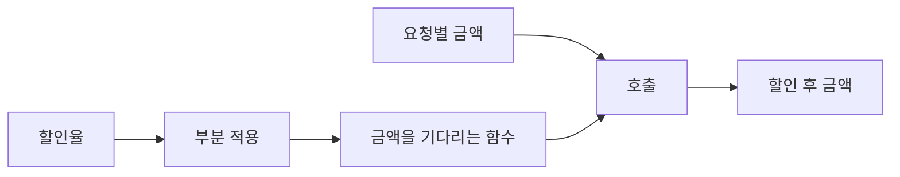

# 15장. Partial Application

보고서 파이프라인에 할인율이나 통화 같은 설정을 매번 전달하면 호출 코드가 반복될 수 있다.
부분 적용은 함수의 일부 인자를 먼저 공급하여 나머지 인자만 받는 새 함수를 만드는 방법이다.
설정을 결정하는 시점과 실제 데이터를 처리하는 시점을 분리한다.

이번 장은 할인율을 고정한 금액 계산과 접두사를 고정한 표시 함수를 사용한다.
클로저, 커링, Scala의 `PartialFunction`과 비슷해 보이지만 서로 다른 개념임을 명확히 한다.
Python에서는 표준 `functools.partial`과 명시적인 래퍼 함수를 비교한다.

---

## 1. 개념과 기본 구분

### 일부 인자를 먼저 공급한다

두 인자 함수 `f(a, b)`에서 `a`를 먼저 정하면 `b`만 받는 함수가 된다.
원래 함수의 계산 규칙을 바꾸지 않고 호출 인터페이스를 좁히는 작업이다.
먼저 공급한 인자는 새 함수의 환경에 보관될 수 있다.

```text
f: (A, B) -> C

partial(f, a): B -> C

partial(f, a)(b) = f(a, b)
```

부분 적용은 반드시 첫 번째 인자만 고정해야 하는 개념은 아니다.
어떤 인자를 먼저 정할 수 있는지는 언어와 도구의 기능에 따라 다르다.
필요하면 명시적인 람다나 이름 있는 래퍼로 원하는 위치를 고정할 수 있다.

### 완전 적용과의 차이

모든 인자를 공급하면 계산 결과가 나온다.
일부만 공급하면 남은 인자를 기다리는 함수가 나온다.
이 두 결과의 타입을 구분하면 실행 시점의 혼동을 줄일 수 있다.

### 클로저와의 관계

클로저는 코드와 환경을 함께 유지하는 개념이다.
부분 적용은 인자 공급 방식을 설명한다.
부분 적용을 클로저로 구현할 수 있지만 모든 클로저가 부분 적용의 결과는 아니다.

### 커링과의 관계

커링은 다중 인자 함수를 단일 인자 함수의 연쇄로 바꾸는 변환이다.
부분 적용은 그 인자들 중 일부를 실제로 공급하는 작업이다.
커링하지 않은 함수도 부분 적용할 수 있고, 커링된 함수를 아직 적용하지 않을 수도 있다.

---

## 2. 명령형 스타일과 함수형 스타일

### 반복되는 설정 전달

```scala
def discounted(rate: Int, amount: Long): Long =
  amount - amount * rate / 10000

val first = discounted(1000, 10000)
val second = discounted(1000, 20000)
val third = discounted(1000, 30000)
```

같은 할인율이 반복된다.
호출 위치마다 숫자를 직접 쓰면 정책을 잘못 전달할 가능성도 생긴다.
설정을 한 번 선택하고 그 정책 함수를 전달할 수 있다.

### 설정된 함수 만들기

```scala
val tenPercent: Long => Long =
  amount => discounted(1000, amount)

val results = List(10000L, 20000L, 30000L).map(tenPercent)
```

`map`은 할인율을 알 필요가 없다.
금액 하나를 받아 금액 하나를 반환하는 함수만 필요하다.
부분 적용은 도메인 함수의 인자 구조를 고차 함수가 요구하는 모양에 맞추는 역할도 한다.

### 인자 순서를 검토한다

자주 고정하는 설정을 앞에 두면 부분 적용이 자연스러워질 수 있다.
그러나 오직 부분 적용을 위해 기존 API의 의미를 흐려서는 안 된다.
키워드 인자나 이름 있는 어댑터로 의도를 드러내는 방법도 있다.

### 설정을 고정했다는 말의 범위

정수 할인율을 고정하는 것과 가변 설정 객체의 참조를 고정하는 것은 다르다.
후자는 객체 내부가 바뀌면 결과도 달라질 수 있다.
부분 적용이 자동으로 설정의 깊은 스냅샷을 만드는 것은 아니다.

---

## 3. 왜 이 개념을 사용하는가?

### 고차 함수와의 연결

여러 인자를 받는 업무 함수를 한 인자 콜백으로 바꿀 수 있다.
정렬, 변환, 이벤트 처리 같은 API에 전달하기 쉬워진다.
인자 순서와 이름을 유지하는 명시적 래퍼는 중요한 문서 역할을 한다.

### 의존성의 조립

조회 함수나 설정을 먼저 공급하여 서비스 함수를 만들 수 있다.
호출자는 이미 조립된 동작을 받아 실제 입력만 전달한다.
이 구조는 함수 기반 의존성 주입으로 확장된다.

### 테스트의 설정 단계

테스트에 필요한 정책을 먼저 만들고 여러 입력을 검사할 수 있다.
설정 생성 테스트와 실행 결과 테스트를 구분하면 실패 위치를 좁히기 쉽다.
잘못된 설정을 어느 시점에 거부할지도 명시해야 한다.

### 이름 있는 정책

`partial(discounted, 1000)`보다 `ten_percent_policy`라는 이름이 업무 의미를 더 잘 전달할 수
있다.
익명 값으로만 조립하면 정책을 추적하기 어려워질 수 있다.
필요하면 설정 데이터와 함수값을 함께 보관한다.

### 과한 고정의 위험

호출자마다 달라져야 하는 인자를 너무 일찍 고정하면 재사용성이 줄어든다.
기준 시각이나 사용자 권한처럼 요청별로 달라지는 값을 전역 정책에 넣지 않도록 주의한다.
설정의 수명과 요청 데이터의 수명을 구분해야 한다.

---

## 4. Scala에서의 표현

### Scala의 명시적 부분 적용

아래 프로그램은 임의의 두 인자 함수에서 첫 인자를 고정하는 헬퍼를 정의한다.
업무 코드에서는 명시적인 람다가 더 잘 읽히는 경우도 있다.
두 방식이 같은 호출 결과를 만드는지 검사한다.

<!-- executable:scala -->
```scala
object Chapter15:
  def bindFirst[A, B, C](f: (A, B) => C, first: A): B => C =
    second => f(first, second)

  def discounted(rate: Int, amount: Long): Long =
    require(rate >= 0 && rate <= 10000)
    require(amount >= 0 && amount <= 1000000000L)
    amount - amount * rate / 10000

  def configuredDiscount(rate: Int): Long => Long =
    require(rate >= 0 && rate <= 10000)
    amount => discounted(rate, amount)

  def label(prefix: String, amount: Long, currency: String): String =
    s"$prefix: $amount $currency"

  def check(): Unit =
    val explicit: Long => Long = amount => discounted(1000, amount)
    val generic = bindFirst[Int, Long, Long](discounted, 1000)
    val configured = configuredDiscount(1000)
    val amounts = List(0L, 10000L, 20000L, 30000L)
    assert(amounts.map(explicit) == List(0L, 9000L, 18000L, 27000L))
    assert(amounts.map(generic) == amounts.map(explicit))
    assert(amounts.map(configured) == amounts.map(explicit))

    val quoteLabel: Long => String =
      amount => label("견적", amount, "KRW")
    assert(quoteLabel(9000) == "견적: 9000 KRW")
    assert(explicit.andThen(quoteLabel)(10000) == "견적: 9000 KRW")

    var calls = 0
    val traced: (Int, Int) => Int = (a, b) =>
      calls += 1
      a + b
    val addTen = bindFirst(traced, 10)
    assert(calls == 0)
    assert(addTen(2) == 12)
    assert(calls == 1)

    val divide: PartialFunction[Int, Int] =
      case value if value != 0 => 100 / value
    assert(divide.isDefinedAt(2))
    assert(!divide.isDefinedAt(0))
    assert(divide.lift(0).isEmpty)
```

### 생성 시 검증과 호출 시 검증

`bindFirst(discounted, 잘못된할인율)`은 원래 함수를 아직 실행하지 않는다.
따라서 그 함수 안의 검증도 나중 호출까지 미뤄진다.
`configuredDiscount`는 설정을 만드는 시점에 할인율을 검사한다.
어느 시점의 실패가 API 사용자에게 더 적절한지 선택해야 한다.

### `PartialFunction`은 다른 개념이다

Scala의 `PartialFunction[A, B]`는 입력 영역의 일부에만 정의된 함수다.
일부 인자를 먼저 공급한다는 부분 적용과 다르다.
예제의 나눗셈은 0에서 정의되지 않는다는 의미를 표현한다.
비슷한 이름 때문에 두 개념을 섞지 않는다.

---

## 5. 상태 변경보다 값 변환

### 설정과 데이터의 수명

부분 적용으로 먼저 공급한 값은 만들어진 함수가 사용하는 동안 필요할 수 있다.
오래 살아 있는 함수에 요청별 큰 객체를 고정하면 그 객체도 오래 유지될 수 있다.
필요한 작은 설정만 추출하는 편이 의존성과 수명을 줄인다.



생성 단계와 호출 단계가 분리된다.
설정 오류를 생성 단계에서 검출하면 실제 요청 처리 전에 문제를 발견할 수 있다.
반대로 데이터 의존 검증은 남은 인자를 받은 뒤에만 가능할 수 있다.

### 값 고정과 참조 고정

불변 정수를 저장하면 그 값은 바뀌지 않는다.
가변 딕셔너리의 참조를 저장하면 나중 내부 변경을 볼 수 있다.
함수의 의미를 고정하고 싶다면 어떤 객체가 공유되는지 확인해야 한다.

### 선택된 정책의 재현

함수값만 보관하면 고정된 설정을 나중에 설명하기 어려울 수 있다.
감사와 재현이 필요하면 정책 이름, 버전, 설정값을 별도 데이터로 남긴다.
함수의 메모리 주소나 표현 문자열을 업무 식별자로 사용하지 않는다.

---

## 6. 함수 합성과 데이터 흐름

### 파이프라인에 맞는 함수 모양

앞 장의 파이프라인은 보통 한 단계의 결과를 다음 단계에 전달한다.
여러 인자를 요구하는 함수에서 설정을 먼저 공급하면 한 인자 단계로 사용할 수 있다.
이것이 부분 적용의 실용적인 쓰임이다.

```text
discounted(rate, amount)
  -> rate를 고정
amount -> discountedAmount
  -> render와 합성
amount -> label
```

### 여러 위치의 인자 고정

일반 헬퍼로 표현하기 어렵다면 람다에서 원하는 인자를 직접 배치한다.
인자 위치를 추측해야 하는 복잡한 도구보다 명시적 코드가 더 읽기 좋을 수 있다.
특히 같은 타입의 인자가 여러 개이면 이름을 드러내는 것이 중요하다.

### 중첩 부분 적용

이미 부분 적용된 함수에 다시 인자를 공급하여 더 좁은 함수를 만들 수 있다.
이때 원래 함수와 고정된 값들의 관계를 추적해야 한다.
설정 층이 많아져 무엇이 고정되었는지 알기 어렵다면 명시적 설정 레코드를 검토한다.

### 결과를 고정하는 것이 아니다

함수를 부분 적용해도 남은 입력마다 새 계산을 실행한다.
이전 결과를 저장하는 메모이제이션과 다르다.
부분 적용된 함수가 비싼 작업을 수행하면 호출할 때마다 그 비용이 발생할 수 있다.

---

## 7. 장점과 트레이드오프

### 장점과 트레이드오프

| 선택 | 장점 | 주의점 |
| --- | --- | --- |
| 설정 먼저 공급 | 호출 코드 단순화 | 설정 수명과 검증 시점 |
| 한 인자 콜백 생성 | 고차 함수 연결 | 인자 위치의 혼동 |
| 명시적 래퍼 | 이름과 계약 명확 | 짧은 반복 코드 |
| 범용 partial 헬퍼 | 간단한 조립 | 정적 시그니처 정보 |
| 가변 설정 캡처 | 실시간 설정 반영 | 재현성과 동시성 |

### 가독성

간단한 인자 고정은 부분 적용으로 읽기 쉽다.
복잡한 조건과 변환까지 들어가면 이름 있는 함수가 더 적절할 수 있다.
도구를 적게 쓰는 것이 아니라 독자가 실제 계약을 쉽게 읽는지가 기준이다.

### 호출 비용

부분 적용은 래퍼 함수나 호출 가능한 객체를 만들 수 있다.
실행기가 항상 그 비용을 제거한다고 가정하지 않는다.
대부분의 설계 판단에서는 의미와 유지보수를 먼저 보고 병목이 확인되면 측정한다.

### 설정의 변경

오래 살아 있는 함수에 설정을 고정하면 새 설정을 반영하려고 새 함수를 만들어야 할 수 있다.
실시간 설정 반영이 요구되면 명시적 조회 함수나 환경 입력을 사용하는 설계가 더 자연스러울 수
있다.
고정성과 유연성 사이의 선택을 요구사항에 맞춘다.

---

## 8. 상태와 부수효과의 경계

### 의존성을 고정한 함수

저장소 조회 함수를 먼저 공급하면 요청 처리 함수가 만들어질 수 있다.
하지만 조회 함수가 가진 네트워크 효과와 실패 가능성은 그대로 남는다.
부분 적용은 효과를 없애지 않고 의존성을 조립한다.

### 자원 수명

열린 파일이나 연결 객체를 고정하면 나중 호출 시에도 그 자원이 유효해야 한다.
함수가 자원을 참조한다는 사실만으로 외부에서 닫히지 않는다는 보장은 없다.
자원 범위 안에서 조립과 실행을 수행하거나 별도의 자원 관리 추상화를 사용한다.

### 권한의 범위

전체 서비스 객체 대신 필요한 동작 하나를 고정하면 전달되는 의존성을 좁힐 수 있다.
그러나 해당 동작이 수행할 수 있는 효과는 여전히 존재한다.
보안 경계가 필요하면 함수 설계 외의 권한과 격리도 검토해야 한다.

### 재시도와 호출 횟수

부분 적용된 함수가 결제를 수행한다면 두 번 호출하면 두 번 실행될 수 있다.
인자를 미리 공급했다는 사실이 멱등성을 만들지 않는다.
효과의 중복 방지와 재시도 정책은 별도로 정의한다.

---

## 9. Python에서 적용하기

### Python의 `functools.partial`

표준 `partial`은 지정한 위치 인자와 키워드 인자를 기억하는 호출 가능한 객체를 만든다.
원래 함수는 객체 생성만으로 실행되지 않는다.
호출 때 추가 인자가 결합되며, 미리 지정한 키워드 인자는 나중 키워드로 바뀔 수 있다는 점을
확인한다.

<!-- executable:python -->
```python
from collections.abc import Callable
from functools import partial


def discounted(rate: int, amount: int) -> int:
    if not 0 <= rate <= 10_000:
        raise ValueError("invalid rate")
    if amount < 0:
        raise ValueError("negative amount")
    return amount - amount * rate // 10_000


def configured_discount(rate: int) -> Callable[[int], int]:
    if not 0 <= rate <= 10_000:
        raise ValueError("invalid rate")

    def apply(amount: int) -> int:
        return discounted(rate, amount)

    return apply


def label(amount: int, *, prefix: str, currency: str) -> str:
    return f"{prefix}: {amount} {currency}"


def read_config(config: dict[str, int], amount: int) -> int:
    return discounted(config["rate"], amount)


def test_partial_results() -> None:
    ten_percent = partial(discounted, 1000)
    explicit = configured_discount(1000)
    values = [0, 10_000, 20_000, 30_000]
    assert list(map(ten_percent, values)) == [0, 9000, 18_000, 27_000]
    assert list(map(ten_percent, values)) == list(map(explicit, values))
    assert ten_percent.func is discounted
    assert ten_percent.args == (1000,)


def test_keyword_override() -> None:
    quote_label = partial(label, prefix="견적", currency="KRW")
    assert quote_label(9000) == "견적: 9000 KRW"
    assert quote_label(9000, currency="JPY") == "견적: 9000 JPY"


def test_creation_does_not_call() -> None:
    calls: list[tuple[int, int]] = []

    def add(a: int, b: int) -> int:
        calls.append((a, b))
        return a + b

    add_ten = partial(add, 10)
    assert calls == []
    assert add_ten(2) == 12
    assert calls == [(10, 2)]


def test_mutable_reference() -> None:
    config = {"rate": 1000}
    live = partial(read_config, config)
    fixed = configured_discount(config["rate"])
    config["rate"] = 2000
    assert live(10_000) == 8000
    assert fixed(10_000) == 9000


def test_validation_timing() -> None:
    delayed = partial(discounted, -1)
    try:
        delayed(1000)
    except ValueError:
        pass
    else:
        raise AssertionError("invalid rate accepted")
    try:
        configured_discount(-1)
    except ValueError:
        pass
    else:
        raise AssertionError("invalid configuration accepted")


if __name__ == "__main__":
    test_partial_results()
    test_keyword_override()
    test_creation_does_not_call()
    test_mutable_reference()
    test_validation_timing()
```

### 고정이 아니라 기본 지정인 키워드

예제의 `currency`는 나중 호출에서 덮어쓸 수 있다.
절대 바뀌면 안 되는 정책이라면 해당 인자를 노출하지 않는 명시적 래퍼를 사용한다.
편의 도구의 동작과 업무상의 불변 계약을 동일시하지 않는다.

---

## 10. Python의 표현 한계

### 인자 위치와 검사

잘못된 인자 개수나 중복 인자는 실제 호출에서 오류가 날 수 있다.
부분 적용 객체를 만들었다는 사실이 모든 호출 규약을 검증했다는 뜻은 아니다.
정적 검사 도구의 지원 범위도 사용하는 형태에 따라 다를 수 있다.

### 깊은 스냅샷의 부재

`partial`은 전달된 가변 객체를 자동으로 깊게 복사하지 않는다.
환경을 고정하고 싶다면 필요한 값을 불변 데이터로 추출해야 한다.
외부 자원이나 연결은 단순 복사로 수명 문제를 해결할 수 없다.

### 일반화된 타입 표현

임의 인자 목록의 일부만 제거한 새 호출 시그니처를 일반적으로 표현하는 것은 단순한 `Callable`보다
복잡하다.
중요한 공개 API에서는 명시적 래퍼 함수의 타입이 더 잘 읽힐 수 있다.
정적 정보를 포기하고 모든 것을 `Any`로 바꾸는 것이 유일한 해결책은 아니다.

### 보안과 직렬화

부분 적용 객체가 함수와 인자를 담는다고 모든 환경에서 안전하게 직렬화할 수 있는 것은 아니다.
장기 보관할 정책은 이름, 버전, 설정 데이터를 분리해 저장하는 편을 검토한다.
임의 코드 객체의 복원과 실행은 신뢰 경계에 관한 별도 문제다.

---

## 11. 핵심 정리

### 핵심 결론

부분 적용은 일부 인자를 먼저 공급해 나머지 인자를 받는 함수를 만든다.
클로저, 커링, 부분 함수는 서로 다른 개념이다.
설정의 검증 시점과 가변 객체의 공유를 명시해야 한다.
부분 적용은 캐시, 순수성, 멱등성, 자원 안전성을 자동 제공하지 않는다.

### 연습 1: 커링과 구분

`f(a, b)`에 `a=10`을 미리 공급한 작업은 커링인가, 부분 적용인가?

**해설.** 실제 인자 하나를 공급했으므로 부분 적용이다.
커링은 함수의 형태를 `a -> b -> result`로 바꾸는 변환이다.
형태 변환과 인자 공급을 구분한다.

### 연습 2: 검증 시점

잘못된 할인율을 `partial`로 지정했는데 객체 생성은 성공했다.
왜 가능한가?

**해설.** 원래 함수가 아직 호출되지 않았기 때문이다.
함수 본문의 검증은 남은 인자를 공급할 때 실행될 수 있다.
설정 시 검증이 필요하면 별도의 생성 함수를 작성한다.

### 연습 3: 키워드 변경

통화를 고정했다고 생각한 부분 적용 함수에 다른 통화를 키워드로 전달했다.
어떤 API 설계를 검토해야 하는가?

**해설.** 도구가 키워드 덮어쓰기를 허용하는지 확인한다.
정말 고정해야 한다면 통화 인자를 노출하지 않는 래퍼를 사용한다.
기본값 지정과 변경 불가능한 정책을 구분한다.

### 연습 4: 가변 환경

설정 딕셔너리를 부분 적용한 뒤 할인율 필드를 바꾸었다.
기존 함수의 결과가 바뀌는 이유를 설명하라.

**해설.** 함수가 같은 딕셔너리 객체의 참조를 보관하기 때문이다.
깊은 스냅샷을 만든 것이 아니다.
고정된 정책에는 필요한 불변 값만 추출해 전달한다.

### 다음 장과 참고 자료

다음 장은 다중 인자 함수를 단일 인자 함수의 연쇄로 바꾸는 커링을 다룬다.
부분 적용이 자연스러워지는 이유와 인자 목록의 설계가 연결된다.

[Python 공식 문서: functools.partial](https://docs.python.org/3.14/library/functools.html#functools.partial)
[Scala 공식 문서: Functions](https://docs.scala-lang.org/scala3/book/fun-intro.html)
[Scala API: PartialFunction](https://www.scala-lang.org/api/current/scala/PartialFunction.html)
