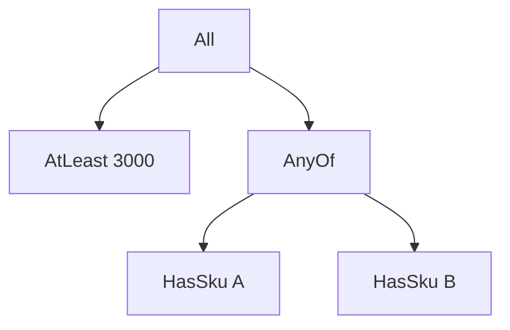

# 19장. Algebraic Data Types (ADT)


곱 타입과 합 타입을 함께 사용하면 도메인의 값 공간을 더 정확히 표현할 수 있다.
여기에 재귀를 더하면 주문 묶음, 조건식, 문법 트리처럼 자기와 같은 구조를 포함하는 데이터도 만들
수 있다.
이런 조합을 대수적 데이터 타입, 줄여서 ADT라고 부른다.

이번 장에서는 할인 적용 조건을 데이터로 표현한다.
조건을 함수 안에만 숨기지 않고 “최소 금액”, “상품 포함”, “그리고”, “또는” 같은 값으로 만든다.
그 값을 평가하거나 설명 문자열로 바꾸는 여러 함수를 작성하면서 데이터와 해석의 분리를 경험한다.

---

## 1. 개념과 기본 구분

### 합의 각 경우가 곱을 가진다

ADT는 여러 생성자 중 하나를 선택하고, 각 생성자가 필요한 필드를 함께 가진 구조로 이해할 수 있다.
예를 들어 최소 금액 조건은 금액 하나를 가지며 논리곱 조건은 두 하위 조건을 가진다.
경우 선택은 합이고 생성자 내부 필드의 묶음은 곱이다.

```text
Rule
  = Always
  + Never
  + AtLeast(Amount)
  + HasSku(Sku)
  + All(Rule, Rule)
  + AnyOf(Rule, Rule)
  + Not(Rule)
```

여기서 `+`는 경우 선택을, 괄호 안의 여러 필드는 함께 필요한 값을 나타낸다.
실제 소스 코드의 덧셈이나 객체 연결 연산이 아니다.
가능한 데이터 형태를 대수적으로 설명하는 표기다.

### 재귀적인 구조

`All`과 `AnyOf`는 다시 `Rule`을 포함한다.
따라서 작은 조건을 조합해 큰 조건 트리를 만들 수 있다.
유한한 트리라는 가정 아래 구조적 재귀로 처리할 수 있다.

### 추상 데이터 타입과의 약어

ADT라는 약어는 문맥에 따라 abstract data type을 뜻하기도 한다.
이 책의 이 장에서는 algebraic data type을 뜻한다.
정보 은닉을 중심으로 한 추상 데이터 타입과 데이터의 합·곱 구조는 관련될 수 있지만 같은 정의는
아니다.

### GADT와의 구분

일반적인 ADT보다 생성자별 결과 타입의 관계를 더 정밀하게 표현하는 GADT가 있다.
이 장에서는 모든 조건이 불리언 판단을 만든다는 단순한 모델을 사용한다.
더 강한 타입이 필요한 이유는 고급 모델링에서 다루되 기본 ADT의 범위를 과장하지 않는다.

---

## 2. 명령형 스타일과 함수형 스타일

### 함수에 숨은 조건

```scala
val eligible: (BigInt, Set[String]) => Boolean =
  (total, skus) => total >= 3000 && (skus.contains("A") || skus.contains("B"))
```

실행만 필요하다면 함수는 간단하고 적절하다.
하지만 조건을 화면에 설명하거나 저장하거나 구조를 분석하려면 함수 내부를 일반적으로 해석하기
어렵다.
함수 객체의 코드 문자열을 업무 데이터처럼 다루는 것은 안정적인 설계가 아니다.

### 조건을 데이터로 만든다

```text
All(
  AtLeast(3000),
  AnyOf(HasSku("A"), HasSku("B"))
)
```

이 값은 아직 조건을 실행한 결과가 아니다.
어떤 계산을 수행할지 설명하는 구조다.
평가 함수에 장바구니를 전달해야 참 또는 거짓이 나온다.

### 여러 해석

같은 조건 데이터를 불리언으로 평가할 수 있다.
사용자에게 보여 줄 설명 문자열로 변환할 수도 있다.
노드 수를 세어 복잡도 제한을 검사하는 함수도 만들 수 있다.

### 함수와 데이터의 선택

규칙의 구조를 관찰할 필요가 없고 실행만 필요하면 함수가 더 간단할 수 있다.
저장, 편집, 분석, 여러 해석이 필요하면 명시적 데이터가 유리할 수 있다.
ADT를 쓴다고 모든 동작을 데이터로 바꾸어야 하는 것은 아니다.

---

## 3. 왜 이 개념을 사용하는가?

### 도메인 언어의 시작

생성자들은 허용된 규칙의 어휘가 된다.
외부 사용자가 임의의 코드를 실행하지 않고 정해진 규칙만 조합하도록 제한할 수 있다.
다만 입력 크기와 평가 비용 같은 자원 제한은 별도로 필요하다.

### 해석기의 테스트

각 생성자의 의미를 독립적으로 검사할 수 있다.
복합 규칙은 작은 규칙의 결과를 어떻게 합치는지 테스트한다.
규칙 데이터와 평가 구현이 분리되어 같은 입력으로 여러 해석을 비교하기 쉽다.

### 구조 변환

항상 참과의 논리곱을 제거하는 등 의미를 보존하는 단순화를 구현할 수 있다.
이때 어떤 관측을 보존할지 명시해야 한다.
불리언 값만 보존하는 변환이 노드별 로그 횟수까지 보존하는 것은 아닐 수 있다.

### 제한된 표현력

허용한 생성자만으로 표현할 수 없는 규칙은 모델을 확장해야 한다.
이 제약은 안전한 편집기나 분석기에는 장점이 될 수 있다.
무제한 코드 실행과 제한된 도메인 언어는 서로 다른 목표다.

### 버전 관리

규칙을 저장하면 나중에도 같은 의미로 해석할 수 있어야 한다.
생성자 추가와 의미 변경을 구분하고 버전 호환성을 검토한다.
단순히 JSON으로 저장할 수 있다는 사실만으로 장기 재현성이 생기지는 않는다.

---

## 4. Scala에서의 표현

### Scala의 규칙 ADT

다음 프로그램은 조건의 평가, 구조 크기 계산, 제한적인 단순화를 구현한다.
모든 규칙을 최적 형태로 바꾸는 완전한 최적화기는 아니다.
몇 가지 명시적인 등식을 적용하는 예제다.

<!-- executable:scala -->
```scala
object Chapter19:
  final case class Basket(total: BigInt, skus: Set[String])

  enum Rule:
    case Always
    case Never
    case AtLeast(amount: BigInt)
    case HasSku(sku: String)
    case All(left: Rule, right: Rule)
    case AnyOf(left: Rule, right: Rule)
    case Not(inner: Rule)

  def evaluate(rule: Rule, basket: Basket): Boolean =
    rule match
      case Rule.Always => true
      case Rule.Never => false
      case Rule.AtLeast(amount) => basket.total >= amount
      case Rule.HasSku(sku) => basket.skus.contains(sku)
      case Rule.All(left, right) => evaluate(left, basket) && evaluate(right, basket)
      case Rule.AnyOf(left, right) => evaluate(left, basket) || evaluate(right, basket)
      case Rule.Not(inner) => !evaluate(inner, basket)

  def nodeCount(rule: Rule): Int =
    rule match
      case Rule.All(left, right) => 1 + nodeCount(left) + nodeCount(right)
      case Rule.AnyOf(left, right) => 1 + nodeCount(left) + nodeCount(right)
      case Rule.Not(inner) => 1 + nodeCount(inner)
      case _ => 1

  def simplify(rule: Rule): Rule =
    rule match
      case Rule.All(Rule.Always, right) => simplify(right)
      case Rule.All(left, Rule.Always) => simplify(left)
      case Rule.AnyOf(Rule.Never, right) => simplify(right)
      case Rule.AnyOf(left, Rule.Never) => simplify(left)
      case Rule.Not(Rule.Not(inner)) => simplify(inner)
      case Rule.All(left, right) => Rule.All(simplify(left), simplify(right))
      case Rule.AnyOf(left, right) => Rule.AnyOf(simplify(left), simplify(right))
      case Rule.Not(inner) => Rule.Not(simplify(inner))
      case leaf => leaf

  def check(): Unit =
    import Rule.*
    val rule = All(AtLeast(3000), AnyOf(HasSku("A"), HasSku("B")))
    assert(nodeCount(rule) == 5)
    assert(evaluate(rule, Basket(3000, Set("A"))))
    assert(evaluate(rule, Basket(5000, Set("B"))))
    assert(!evaluate(rule, Basket(2000, Set("A"))))
    assert(!evaluate(rule, Basket(5000, Set("C"))))
    val decorated = All(Always, Not(Not(rule)))
    assert(nodeCount(decorated) > nodeCount(simplify(decorated)))
    for total <- List[BigInt](0, 2000, 3000, 5000) do
      for skus <- List(Set.empty[String], Set("A"), Set("B"), Set("C")) do
        val basket = Basket(total, skus)
        assert(evaluate(decorated, basket) == evaluate(simplify(decorated), basket))
    assert(evaluate(Always, Basket(0, Set.empty)))
    assert(!evaluate(Never, Basket(0, Set.empty)))
```

### 두 종류의 해석

`evaluate`는 규칙의 업무 의미를 계산한다.
`nodeCount`는 규칙 구조 자체를 분석한다.
같은 ADT에서 서로 다른 결과 타입을 만드는 함수들을 정의할 수 있다.
이것이 프로그램 구조를 데이터로 드러내는 이점이다.

### 단순화의 한계

현재 구현은 자식을 단순화한 뒤 새로 생긴 모든 패턴을 다시 검사하지 않는다.
따라서 한 번의 실행이 완전한 정규형을 보장하지 않는다.
필요한 계약은 의미 보존이며, 더 강한 정규화가 필요하면 종료와 반복 전략을 따로 설계한다.

---

## 5. 상태 변경보다 값 변환

### 데이터와 실행 결과

규칙 트리는 계산을 설명하는 값이다.
장바구니에 적용한 불리언은 그 계산의 결과다.
둘을 구분하면 규칙을 저장·편집하는 작업과 실행하는 작업을 다른 경계에 둘 수 있다.



트리의 각 생성자는 정해진 의미를 가진다.
새 생성자를 추가하면 평가기와 분석기가 그 의미를 고려해야 한다.
기본 분기가 모든 새 경우를 덮어 버리지 않는지 검토한다.

### 구조와 공유

같은 하위 규칙 값을 여러 곳에서 공유할 수 있다.
불변 규칙이면 공유 때문에 의미가 바뀌지 않는다.
하지만 일반 재귀 평가는 같은 하위 규칙을 여러 번 계산할 수 있으므로 공유가 자동으로
메모이제이션을 뜻하지 않는다.

### 유한성

이 예제는 유한한 규칙 트리를 전제로 한다.
외부에서 순환 구조를 구성할 수 있거나 매우 깊은 입력이 들어오면 별도 검증과 실행 전략이
필요하다.
자료형 선언만으로 모든 자원 제한이 보장되는 것은 아니다.

---

## 6. 함수 합성과 데이터 흐름

### 생성자는 조합자다

`All`과 `AnyOf`는 작은 규칙을 더 큰 규칙으로 조합한다.
함수 합성이 계산을 연결했다면 여기서는 데이터 생성자가 계산의 구조를 연결한다.
후반부의 Combinators & DSL은 이런 조립 API를 더 체계적으로 다룬다.

```text
작은 규칙 + 작은 규칙
  -> 복합 규칙 데이터
  -> 해석기
  -> 결과
```

### 재귀 함수의 반복 구조

평가와 노드 수 계산은 모두 생성자를 분해하고 자식을 재귀적으로 처리한다.
다른 부분은 자식 결과를 결합하는 방식이다.
재귀 스킴은 이런 반복 구조를 추상화하는 방법이다.

### 함수형 설계 패턴과의 연결

Algebra & Interpreter는 허용된 연산과 실행 의미를 분리한다.
Free Monad와 Tagless Final은 프로그램을 표현하고 해석하는 서로 다른 구조를 제공한다.
현재의 단순 규칙 ADT는 그 주제를 이해하기 위한 구체적인 출발점이다.

### 법칙의 관측 범위

`All(Always, r)`과 `r`은 순수한 불리언 평가에서 같은 결과를 낸다.
노드 방문 로그나 실행 시간은 달라질 수 있다.
변환의 정확성을 말할 때 무엇을 보존하는지 명시해야 한다.

---

## 7. 장점과 트레이드오프

### 장점과 비용

| 선택 | 장점 | 비용 또는 제한 |
| --- | --- | --- |
| 규칙을 데이터화 | 분석과 저장 가능 | 생성자와 해석기 코드 |
| 닫힌 어휘 | 허용 연산 제한 | 새 규칙의 모델 확장 |
| 여러 해석기 | 평가·설명·검증 분리 | 의미 일관성 유지 |
| 구조 변환 | 단순화와 최적화 | 의미 보존 검토 |
| 재귀 표현 | 복합 규칙 자연스러움 | 깊이와 크기 제한 |

### 모든 동작의 데이터화

실행만 필요한 작은 콜백을 모두 AST로 바꾸면 과한 비용을 지불할 수 있다.
구조를 관찰하거나 저장하거나 다른 방식으로 해석해야 하는지 먼저 확인한다.
요구가 없다면 함수가 더 간단한 표현이다.

### 모델 확장

새 규칙 생성자를 추가하면 관련 해석기를 함께 갱신해야 한다.
이는 변경 지점을 드러내는 장점이면서 수정 비용이기도 하다.
반대로 열린 객체 인터페이스는 새 데이터 경우를 추가하기 쉽지만 새 연산 추가가 어려울 수 있다.
변화의 방향을 보고 선택한다.

### 실행 비용

규칙 데이터를 구성하고 해석하는 과정에는 객체와 분기 비용이 있을 수 있다.
직접 함수 실행보다 느리거나 빠르다고 일률적으로 주장하지 않는다.
규칙 재사용, 캐시, 최적화, 입력 크기에 따라 측정해야 한다.

---

## 8. 상태와 부수효과의 경계

### 저장 가능한 구조와 안전한 입력

ADT의 구조를 JSON으로 표현할 수는 있다.
하지만 외부 JSON을 읽을 때 태그, 필드 타입, 깊이, 노드 수를 검증해야 한다.
임의의 큰 규칙은 순수 계산이어도 자원을 과도하게 사용할 수 있다.

### 실행 의미의 버전

같은 `AtLeast` 태그의 의미를 바꾸면 과거 규칙의 결과도 달라질 수 있다.
규칙 버전과 해석기 버전의 호환성을 관리해야 한다.
데이터 형식이 같다는 사실과 의미가 같다는 사실은 다르다.

### 효과를 가진 규칙

재고 조회나 외부 신용 조회를 규칙으로 추가하면 평가가 더 이상 단순한 순수 함수가 아닐 수 있다.
필요한 데이터를 먼저 스냅샷으로 수집하거나 효과를 명시적으로 다루는 해석기를 설계한다.
논리곱의 단락 평가가 어떤 외부 호출을 생략하는지도 계약에 포함된다.

### 설명과 민감정보

규칙을 문자열로 설명할 때 내부 정책이나 보안 기준을 그대로 외부에 노출하지 않도록 주의한다.
운영자용 설명과 사용자용 안내는 다른 해석기로 만들 수 있다.
데이터화가 곧 공개 가능성을 의미하지 않는다.

---

## 9. Python에서 적용하기

### Python의 재귀적인 데이터 클래스 유니언

각 생성자를 데이터 클래스로 표현하고 유니언으로 묶는다.
재귀 필드는 아직 정의되지 않은 `Rule`을 문자열 주석으로 참조한다.
아래 코드는 평가와 구조 분석, 제한적 단순화의 의미 보존을 검사한다.

<!-- executable:python -->
```python
from dataclasses import dataclass
from typing import assert_never


@dataclass(frozen=True)
class Basket:
    total: int
    skus: frozenset[str]


@dataclass(frozen=True)
class Always:
    pass


@dataclass(frozen=True)
class Never:
    pass


@dataclass(frozen=True)
class AtLeast:
    amount: int


@dataclass(frozen=True)
class HasSku:
    sku: str


@dataclass(frozen=True)
class All:
    left: "Rule"
    right: "Rule"


@dataclass(frozen=True)
class AnyOf:
    left: "Rule"
    right: "Rule"


@dataclass(frozen=True)
class Not:
    inner: "Rule"


Rule = Always | Never | AtLeast | HasSku | All | AnyOf | Not


def evaluate(rule: Rule, basket: Basket) -> bool:
    match rule:
        case Always():
            return True
        case Never():
            return False
        case AtLeast(amount):
            return basket.total >= amount
        case HasSku(sku):
            return sku in basket.skus
        case All(left, right):
            return evaluate(left, basket) and evaluate(right, basket)
        case AnyOf(left, right):
            return evaluate(left, basket) or evaluate(right, basket)
        case Not(inner):
            return not evaluate(inner, basket)
    assert_never(rule)


def node_count(rule: Rule) -> int:
    match rule:
        case All(left, right) | AnyOf(left, right):
            return 1 + node_count(left) + node_count(right)
        case Not(inner):
            return 1 + node_count(inner)
        case _:
            return 1


def simplify(rule: Rule) -> Rule:
    match rule:
        case All(Always(), right):
            return simplify(right)
        case All(left, Always()):
            return simplify(left)
        case AnyOf(Never(), right):
            return simplify(right)
        case AnyOf(left, Never()):
            return simplify(left)
        case Not(Not(inner)):
            return simplify(inner)
        case All(left, right):
            return All(simplify(left), simplify(right))
        case AnyOf(left, right):
            return AnyOf(simplify(left), simplify(right))
        case Not(inner):
            return Not(simplify(inner))
        case _:
            return rule


def test_rules() -> None:
    rule = All(AtLeast(3000), AnyOf(HasSku("A"), HasSku("B")))
    assert node_count(rule) == 5
    assert evaluate(rule, Basket(3000, frozenset({"A"})))
    assert not evaluate(rule, Basket(2000, frozenset({"A"})))
    assert not evaluate(rule, Basket(5000, frozenset({"C"})))
    decorated = All(Always(), Not(Not(rule)))
    assert node_count(simplify(decorated)) < node_count(decorated)
    for total in (0, 2000, 3000, 5000):
        for skus in (frozenset(), frozenset({"A"}), frozenset({"B"}), frozenset({"C"})):
            basket = Basket(total, skus)
            assert evaluate(decorated, basket) == evaluate(simplify(decorated), basket)


if __name__ == "__main__":
    test_rules()
```

### 코드의 길이와 역할

Python에서는 생성자별 클래스 선언이 Scala의 enum보다 길어질 수 있다.
그 대신 각 경우의 필드와 타입이 명시적으로 드러난다.
코드 길이를 줄이려고 태그 없는 딕셔너리로 바꾸면 어떤 검사를 잃는지도 함께 평가한다.

---

## 10. Python의 표현 한계

### 재귀 깊이

Python의 직접 재귀 평가는 깊은 규칙에서 호출 스택 한계에 도달할 수 있다.
외부 규칙에는 깊이 제한을 두거나 명시적 스택 해석기를 사용한다.
ADT를 사용했다는 사실이 스택 안전성을 제공하지 않는다.

### 닫힌 생성자 집합

유니언 타입 주석은 런타임의 모든 객체 생성을 봉인하지 않는다.
외부 데이터가 올바른 생성자로 변환되었는지 확인해야 한다.
정적 검사 도구와 명시적인 파싱 경계를 함께 사용한다.

### 직렬화와 코드 실행

규칙 데이터를 직렬화하는 것과 Python 코드 객체를 직렬화하여 실행하는 것은 다르다.
허용된 태그와 필드만 읽는 파서를 설계하는 편이 검토 범위를 좁힌다.
일반적인 코드 실행 기능을 규칙 입력 처리에 무심코 연결하지 않는다.

### 타입별 결과의 정밀성

모든 규칙이 불리언 결과를 만든다는 모델은 비교적 단순하다.
정수식과 불리언식을 한 AST에 넣고 결과 타입까지 정적으로 연결하려면 더 복잡한 타입 설계가
필요하다.
일반 유니언만으로 GADT의 모든 추론 능력을 그대로 얻는다고 주장하지 않는다.

---

## 11. 핵심 정리

### 핵심 결론

ADT는 합, 곱, 재귀를 조합하여 도메인의 데이터 구조를 표현한다.
계산을 설명하는 데이터와 그 데이터를 실행하는 해석기를 분리할 수 있다.
구조를 분석하고 변환할 수 있지만 의미 보존과 자원 제한은 별도 검토가 필요하다.
함수와 데이터 가운데 무엇이 적절한지는 필요한 관찰과 확장 방향에 달려 있다.

### 연습 1: 합과 곱 찾기

`All(left, right)`와 `AtLeast(amount)`가 있는 규칙 타입에서 합과 곱의 위치를 설명하라.

**해설.** 어떤 생성자를 선택하는지가 합이다.
`All` 안에서 두 하위 규칙을 함께 가지는 것이 곱이다.
하위 규칙이 다시 같은 타입이라는 점이 재귀다.

### 연습 2: 단순화의 관측

`All(Always, rule)`을 `rule`로 바꾸면 노드 방문 로그도 항상 같은가?

**해설.** 불리언 결과는 같을 수 있지만 방문한 노드 수와 로그는 달라진다.
어떤 관측을 보존하는 최적화인지 명시해야 한다.
순수한 값 의미와 진단 효과를 구분한다.

### 연습 3: 새 생성자

`CustomerTierIs(tier)`를 추가하려면 어떤 부분을 검토해야 하는가?

**해설.** 입력 스냅샷, 평가기, 설명기, 직렬화 파서, 테스트, 버전 정책을 검토한다.
새 데이터 경우의 의미를 모든 관련 해석에 반영해야 한다.
기본 분기가 누락을 숨기지 않는지 확인한다.

### 연습 4: 외부 규칙 크기

규칙이 순수하므로 사용자 입력 크기를 제한하지 않아도 된다는 주장에 반론하라.

**해설.** 순수 계산도 깊이와 노드 수에 따라 시간과 메모리를 많이 사용할 수 있다.
스택 깊이, 전체 노드 수, 평가 예산 같은 제한이 필요할 수 있다.
순수성과 자원 안전성은 다른 성질이다.

### 다음 장과 참고 자료

다음 장은 ADT의 경우를 분해하는 패턴 매칭을 자세히 다룬다.
순서, 가드, 중첩 패턴, 완전성 검사를 이해하면 해석기의 누락과 모호함을 줄일 수 있다.

[Scala 공식 문서: Algebraic Data Types](https://docs.scala-lang.org/scala3/book/types-adts-gadts.html)
[Python 언어 참조: match](https://docs.python.org/3.14/reference/compound_stmts.html#the-match-statement)
