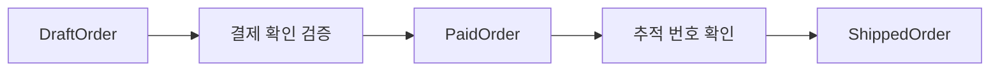

# 22장. Make Illegal States Unrepresentable


이제 곱 타입, 합 타입, 패턴 매칭, 스마트 생성자를 하나의 설계로 묶는다.
목표는 모든 곳에서 같은 검사를 반복하기보다 잘못된 상태가 정상적인 도메인 값으로 들어오기 어렵게
만드는 것이다.
“불가능한 상태를 표현할 수 없게 한다”는 문구는 이 방향을 압축한 표현이다.

그 문구를 절대적인 보증으로 읽어서는 안 된다.
어떤 잘못된 조합을 제거했는지, 어떤 외부 사실은 여전히 확인해야 하는지 구체적으로 설명해야 한다.
이번 장은 작성 중 주문, 결제된 주문, 발송된 주문을 서로 다른 값으로 모델링한다.

---

## 1. 개념과 기본 구분

### 상태 공간을 좁힌다

상태 플래그와 선택 필드를 독립적으로 조합하면 실제로 허용하지 않는 값도 표현할 수 있다.
타입을 나누면 각 상태에 필요한 정보와 허용된 연산을 더 정확히 나타낼 수 있다.
이는 모든 오류를 없애는 마법이 아니라 특정 오류 부류를 구조적으로 줄이는 설계다.

```text
DraftOrder
  주문 번호 + 비어 있지 않은 품목

PaidOrder
  DraftOrder + 확인된 결제 정보

ShippedOrder
  PaidOrder + 추적 번호
```

발송 함수가 `PaidOrder`를 요구하면 작성 중 주문을 잘못 전달하는 코드를 정적 검사에서 찾을 수
있다.
하지만 실제 결제 시스템이 성공했는지는 별도의 신뢰 경계다.
타입에 담긴 정보와 외부 사실을 혼동하지 않는다.

### 상태와 전이

상태 타입은 어떤 값이 존재할 수 있는지 설명한다.
전이 함수는 어떤 입력 상태에서 어떤 출력 상태를 만들 수 있는지 설명한다.
둘을 함께 설계해야 잘못된 전이를 줄일 수 있다.

### 지역 불변식과 전역 불변식

품목이 비어 있지 않다는 조건은 하나의 값 안에서 확인할 수 있다.
주문 번호가 전체 저장소에서 유일하다는 조건은 외부 상태와 동시성을 포함한다.
타입 하나로 모든 전역 사실을 영구 보장한다고 주장하지 않는다.

### 선형 사용과의 차이

상태를 다른 타입으로 바꾸어도 이전 값의 참조가 자동으로 사라지는 것은 아니다.
일반 Scala와 Python에서는 같은 결제된 값을 여러 번 사용할 수 있다.
한 번만 발송한다는 자원 사용 규칙에는 별도의 원자적 저장과 멱등성 정책이 필요하다.

---

## 2. 명령형 스타일과 함수형 스타일

### 플래그 모델

```text
Order
  paid: Boolean
  shipped: Boolean
  receipt: Optional[String]
  tracking: Optional[String]
```

발송됨인데 결제되지 않았거나, 결제됨인데 영수증이 없는 값이 만들어질 수 있다.
모든 함수가 플래그의 조합을 다시 검사해야 한다.
독립적인 불리언 필드는 실제로 독립적이지 않은 업무 상태를 과도하게 표현한다.

### 단계별 타입

```text
confirmPayment: DraftOrder × PaymentConfirmation -> PaidOrder 또는 오류
ship:           PaidOrder × Tracking -> ShippedOrder 또는 오류
```

함수의 입력 타입이 필요한 상태를 나타낸다.
발송에 필요한 결제 정보가 있는지 매번 선택값으로 검사할 필요가 줄어든다.
생성 경로가 해당 불변식을 유지해야 한다는 전제는 여전히 중요하다.

### 모든 상태를 보관하는 합 타입

목록이나 저장소에서 여러 상태를 함께 다루려면 상태별 타입의 합을 사용할 수 있다.
개별 연산은 좁은 타입을 받고 전체 조회는 넓은 합 타입을 반환할 수 있다.
모든 함수가 모든 상태를 받아야 하는 것은 아니다.

### 타입 이름만 바꾸는 실수

`PaidOrder`가 공개 생성자로 아무 영수증이나 받으면 이름만으로 결제 사실을 보장하지 못한다.
검증된 외부 결과를 내부 값으로 바꾸는 생성 경계를 정의해야 한다.
이 경계의 코드와 운영 프로토콜도 설계의 일부다.

---

## 3. 왜 이 개념을 사용하는가?

### 반복 검사 감소

발송 함수가 이미 결제 상태를 입력으로 받으면 결제 여부를 확인하는 분기를 줄일 수 있다.
그 함수는 추적 번호와 발송 결과의 계약에 집중한다.
입력 경계에서 확인한 사실을 타입으로 전달하는 효과다.

### 변경 시 영향 파악

새로운 상태나 필수 데이터가 추가되면 관련 생성과 전이 함수가 변경 지점을 드러낸다.
선택 필드가 많은 레코드에서는 누락이 기본값 뒤에 숨을 수 있다.
타입 오류는 수정해야 할 관계를 찾는 단서가 될 수 있다.

### 테스트 대상의 축소

구조적으로 만들 수 없는 조합에 대한 방어 분기를 줄일 수 있다.
그 대신 생성 경계와 전이 함수의 테스트를 집중한다.
런타임 외부 입력과 동시성 경계의 테스트는 여전히 필요하다.

### 요구사항의 모호함 발견

결제된 주문에 품목을 추가할 수 있는지, 발송 후 취소는 무엇인지 타입을 나누며 질문이 드러난다.
이런 질문은 코드 작성 이전에 업무 규칙을 명확히 하는 데 도움이 된다.
편리한 데이터 구조를 먼저 정하고 규칙을 억지로 맞추지 않는다.

### 보장의 명시

“안전한 주문”처럼 넓은 표현보다 “품목이 비어 있지 않고 결제 금액이 일치하는 주문”처럼 구체적으로
설명한다.
보장하지 않는 사실도 함께 적는다.
정확한 범위가 있어야 타입을 믿고 사용하는 코드가 올바르다.

---

## 4. Scala에서의 표현

### Scala의 단계별 주문

생성 경로를 제한한 클래스로 작성 중, 결제됨, 발송됨 상태를 나눈다.
결제 확인 데이터는 외부 어댑터가 검증해 전달한다는 가정을 둔다.
예제는 실제 결제나 배송 API를 호출하지 않는다.

<!-- executable:scala -->
```scala
object Chapter22:
  final case class Item(sku: String, quantity: Int, unitPrice: BigInt):
    require(sku.nonEmpty && quantity > 0 && unitPrice >= 0)

  enum OrderError:
    case InvalidDraft
    case InvalidReceipt
    case AmountMismatch
    case InvalidTracking

  final class DraftOrder private (
    val id: String,
    val items: Vector[Item]
  ):
    def total: BigInt = items.map(i => i.unitPrice * i.quantity).sum

  object DraftOrder:
    def create(id: String, items: Vector[Item]): Either[OrderError, DraftOrder] =
      if id.nonEmpty && items.nonEmpty then Right(new DraftOrder(id, items))
      else Left(OrderError.InvalidDraft)

  final case class PaymentConfirmation(receiptId: String, amount: BigInt)

  final class PaidOrder private (
    val draft: DraftOrder,
    val receiptId: String
  )

  object PaidOrder:
    def confirm(draft: DraftOrder, confirmation: PaymentConfirmation): Either[OrderError, PaidOrder] =
      if confirmation.receiptId.isEmpty then Left(OrderError.InvalidReceipt)
      else if confirmation.amount != draft.total then Left(OrderError.AmountMismatch)
      else Right(new PaidOrder(draft, confirmation.receiptId))

  final class ShippedOrder private (
    val paid: PaidOrder,
    val tracking: String
  )

  object ShippedOrder:
    def ship(paid: PaidOrder, tracking: String): Either[OrderError, ShippedOrder] =
      if tracking.nonEmpty then Right(new ShippedOrder(paid, tracking))
      else Left(OrderError.InvalidTracking)

  def check(): Unit =
    val draftResult = DraftOrder.create("O-1", Vector(Item("A", 2, 1000)))
    assert(draftResult.map(_.total) == Right(BigInt(2000)))
    val shipped = for
      draft <- draftResult
      paid <- PaidOrder.confirm(draft, PaymentConfirmation("REC-1", 2000))
      result <- ShippedOrder.ship(paid, "TRACK-1")
    yield result
    assert(shipped.map(_.paid.draft.id) == Right("O-1"))
    assert(shipped.map(_.tracking) == Right("TRACK-1"))
    assert(DraftOrder.create("O-2", Vector.empty) == Left(OrderError.InvalidDraft))
    val mismatch = draftResult.flatMap(d => PaidOrder.confirm(d, PaymentConfirmation("REC-2", 1999)))
    assert(mismatch == Left(OrderError.AmountMismatch))
    val missingReceipt = draftResult.flatMap(d => PaidOrder.confirm(d, PaymentConfirmation("", 2000)))
    assert(missingReceipt == Left(OrderError.InvalidReceipt))
    val missingTracking = draftResult.flatMap { draft =>
      PaidOrder.confirm(draft, PaymentConfirmation("REC-3", 2000)).flatMap { paid =>
        ShippedOrder.ship(paid, "")
      }
    }
    assert(missingTracking == Left(OrderError.InvalidTracking))
```

### 좁은 입력 타입

`ShippedOrder.ship`은 `PaidOrder`만 받는다.
`DraftOrder`를 직접 넘기는 것은 그 함수의 타입 계약에 맞지 않는다.
이런 구조가 제거하는 오류와 영수증의 진위 같은 외부 검증 문제를 구별한다.

### 생성 예외의 위치

품목 생성은 간단한 `require`를 사용한다.
사용자 입력을 직접 받는 경우에는 앞 장처럼 오류 값을 반환하는 스마트 생성자로 바꾸는 편이 적절할
수 있다.
예제의 목적은 상태 전이 타입이며 모든 입력 경계를 완성한 결제 시스템이 아니다.

---

## 5. 상태 변경보다 값 변환

### 값의 전이와 현실의 전이

함수는 이전 상태에서 새 상태 값을 계산한다.
실제 저장소의 현재 상태를 바꾸는 작업은 별도의 효과다.
두 작업을 구분하면 충돌과 실패를 더 정확히 다룰 수 있다.



이 그림의 화살표가 자동으로 데이터베이스 트랜잭션을 의미하지는 않는다.
저장 시 현재 버전과 기대 상태를 원자적으로 확인해야 할 수 있다.
동시 요청에서 같은 전이를 두 번 채택하지 않도록 별도 프로토콜이 필요하다.

### 이전 상태의 보존

새 값을 만들었다고 이전 `DraftOrder`나 `PaidOrder` 참조가 소비되는 것은 아니다.
이전 값은 감사나 재현에 유용할 수 있다.
하지만 오래된 상태를 다시 사용하여 중복 효과를 실행하지 않도록 경계가 관리해야 한다.

### 상태별 필드

발송 전에는 추적 번호가 없으므로 그 필드를 발송된 타입에만 둔다.
이렇게 하면 `None`이 많은 레코드보다 필요한 정보의 위치가 분명해진다.
모든 부재가 나쁜 것은 아니며 실제로 선택적인 정보는 선택값으로 유지한다.

---

## 6. 함수 합성과 데이터 흐름

### 타입이 이어지는 전이

각 전이의 출력 상태가 다음 전이의 입력 상태와 맞는다.
실패 가능성은 결과 컨텍스트에 남는다.
상태와 오류를 동시에 타입으로 읽으면 흐름이 더 명확해진다.

```text
DraftOrder
  -> Either[OrderError, PaidOrder]
  -> Either[OrderError, ShippedOrder]
```

### 독립적인 상태 축

결제 상태와 배송 상태가 정말 독립적이라면 곱으로 표현할 수 있다.
하지만 특정 조합을 금지하는 규칙이 있다면 단순 곱은 너무 넓은 상태 공간을 만든다.
업무의 독립성과 데이터 구조의 독립성을 일치시키는 것이 중요하다.

### 모든 상태를 한 함수에 받지 않는다

발송은 결제된 주문만 받으면 된다.
상태 표시 함수는 여러 상태의 합을 받아 경우를 나눌 수 있다.
함수의 목적에 맞게 가장 좁은 입력 타입을 선택한다.

### 타입 상태와 효과 시스템

상태별 타입은 값의 진행 단계를 표현하는 한 방법이다.
외부 효과의 종류와 실행 권한을 추적하는 효과 시스템과는 다른 축이다.
둘을 함께 사용할 수 있지만 하나가 다른 하나의 모든 보장을 제공하지 않는다.

---

## 7. 장점과 트레이드오프

### 장점과 트레이드오프

| 설계 | 장점 | 남는 책임 |
| --- | --- | --- |
| 상태별 타입 | 잘못된 연산 입력 감소 | 상태 전이 구현 |
| 제한된 생성 | 지역 불변식 유지 | 외부 사실 검증 |
| 필수 데이터 분리 | 선택값 조합 감소 | 실제 값의 유효성 |
| 좁은 함수 입력 | 전제조건 가시화 | 런타임 경계 검사 |
| 불변 상태 전이 | 재현과 비교 | 동시 저장과 중복 효과 |

### 타입 수의 증가

상태를 세분화하면 클래스와 변환이 늘어난다.
자주 발생하는 오류를 줄이는 이득과 코드 탐색 비용을 비교해야 한다.
사소한 상태까지 모두 다른 타입으로 나누는 것이 항상 최선은 아니다.

### 외부 모델과의 차이

데이터베이스는 하나의 테이블과 상태 컬럼을 사용할 수 있다.
내부 도메인 타입을 저장 스키마와 반드시 일대일로 맞출 필요는 없다.
어댑터가 스키마를 검증된 상태 타입으로 변환할 수 있다.

### 변경 정책

결제 후 품목 변경을 허용할지 여부에 따라 모델이 달라진다.
허용한다면 재승인이나 차액 처리 같은 새 전이가 필요할 수 있다.
타입을 복잡하게 만드는 원인이 실제 업무 복잡성인지 설계 과잉인지 구분한다.

---

## 8. 상태와 부수효과의 경계

### 결제 확인의 신뢰 경계

`PaymentConfirmation`은 검증된 외부 사실을 담는 입력이어야 한다.
아무 사용자 요청이 그 값을 직접 만들 수 있게 하면 내부 타입의 이름을 악용할 수 있다.
인증된 응답, 관련 주문, 금액 일치 등의 검증을 경계에 둔다.

### 중복 발송

같은 `PaidOrder`를 두 번 전달하면 예제 함수는 두 발송값을 만들 수 있다.
일반적인 타입 상태만으로 일회성 사용이 보장되지 않기 때문이다.
저장소의 조건부 전이, 멱등성 키, 외부 API 계약이 필요할 수 있다.

### 데이터 복원

저장된 상태를 읽을 때 필수 필드가 없으면 내부 상태 타입으로 복원할 수 없어야 한다.
손상된 데이터와 과거 스키마를 처리하는 정책을 마련한다.
복원 과정에서 임의 기본값으로 모순을 숨기지 않는다.

### 시간과 취소

결제 승인이 만료되거나 발송이 취소될 수 있다.
타입에 담긴 과거 확인 사실이 현재에도 유효한지 별도 판단이 필요하다.
시간에 따라 달라지는 권한과 사실을 영구적인 불변식으로 착각하지 않는다.

---

## 9. Python에서 적용하기

### Python의 상태별 값

Python에서도 서로 다른 데이터 클래스로 전이 단계를 표현할 수 있다.
정적 검사에 도움이 되도록 좁은 입력 타입을 적고, 공개 경계에서는 실행 시 검사도 수행한다.
이 예제는 정상 생성 시 지역 불변식을 확인하지만 악의적인 저수준 우회까지 격리하는 보안 장치는
아니다.

<!-- executable:python -->
```python
from dataclasses import dataclass


@dataclass(frozen=True)
class Item:
    sku: str
    quantity: int
    unit_price: int

    def __post_init__(self) -> None:
        if not self.sku or self.quantity <= 0 or self.unit_price < 0:
            raise ValueError("invalid item")


@dataclass(frozen=True)
class DraftOrder:
    order_id: str
    items: tuple[Item, ...]

    def __post_init__(self) -> None:
        if not self.order_id or not self.items:
            raise ValueError("invalid draft")

    def total(self) -> int:
        return sum(item.quantity * item.unit_price for item in self.items)


@dataclass(frozen=True)
class PaymentConfirmation:
    receipt_id: str
    amount: int


@dataclass(frozen=True)
class PaidOrder:
    draft: DraftOrder
    confirmation: PaymentConfirmation

    def __post_init__(self) -> None:
        if not self.confirmation.receipt_id:
            raise ValueError("invalid receipt")
        if self.confirmation.amount != self.draft.total():
            raise ValueError("amount mismatch")


@dataclass(frozen=True)
class ShippedOrder:
    paid: PaidOrder
    tracking: str

    def __post_init__(self) -> None:
        if not isinstance(self.paid, PaidOrder):
            raise TypeError("shipping requires a paid order")
        if not self.tracking:
            raise ValueError("invalid tracking")


def confirm_payment(draft: DraftOrder, confirmation: PaymentConfirmation) -> PaidOrder:
    return PaidOrder(draft, confirmation)


def ship(paid: PaidOrder, tracking: str) -> ShippedOrder:
    return ShippedOrder(paid, tracking)


def test_transitions() -> None:
    draft = DraftOrder("O-1", (Item("A", 2, 1000),))
    paid = confirm_payment(draft, PaymentConfirmation("REC-1", 2000))
    shipped = ship(paid, "TRACK-1")
    assert shipped.paid.draft.order_id == "O-1"
    assert shipped.tracking == "TRACK-1"
    assert draft.total() == 2000
    invalid = (
        lambda: DraftOrder("O-2", ()),
        lambda: confirm_payment(draft, PaymentConfirmation("REC-2", 1999)),
        lambda: confirm_payment(draft, PaymentConfirmation("", 2000)),
        lambda: ship(paid, ""),
    )
    for action in invalid:
        try:
            action()
        except ValueError:
            continue
        raise AssertionError("invalid transition accepted")
    try:
        ship(draft, "TRACK-2")  # 의도적인 런타임 경계 반례다.
    except TypeError:
        pass
    else:
        raise AssertionError("draft order was shipped")


if __name__ == "__main__":
    test_transitions()
```

### 예외를 사용하는 이유와 범위

이 Python 예제는 상태 생성 계약에 집중하기 위해 잘못된 전이를 예외로 드러낸다.
사용자에게 정상적으로 반환해야 하는 실패라면 다음 부의 결과 타입으로 바꿀 수 있다.
타입 상태 설계와 오류 전달 방식은 함께 선택하지만 동일한 개념은 아니다.

---

## 10. Python의 표현 한계

### 정적 주석의 한계

`ship(paid: PaidOrder, ...)`라고 적어도 Python 실행기가 자동으로 인자 타입을 검사하지 않는다.
예제는 해당 공개 경계에서 명시적인 검사를 추가했다.
모든 내부 필드의 임의 타입 오류까지 완전히 검증한 모델이라고 주장하지 않는다.

### 생성과 우회

데이터 클래스의 정상 생성 검사는 유용하지만 같은 프로세스의 임의 코드에 대한 보안 격리는 아니다.
신뢰하지 않는 입력은 데이터 형태로 받고 전용 파서로 변환한다.
객체를 이미 신뢰할 수 있다는 가정을 외부 경계에 그대로 적용하지 않는다.

### 일회성 소비

일반 Python 객체는 여러 곳에서 참조하고 재사용할 수 있다.
상태 타입을 나누는 것만으로 이전 상태가 소비되거나 무효화되지 않는다.
중복 효과를 막는 정책은 저장소와 외부 시스템의 원자적 계약으로 다뤄야 한다.

### 정책의 변화

생성 당시 유효한 값이 미래 정책에도 항상 유효하다는 뜻은 아니다.
정책 버전과 마이그레이션, 만료를 명시적으로 모델링해야 할 수 있다.
타입은 선택한 시점과 경계의 사실을 표현한다.

---

## 11. 핵심 정리

### 핵심 결론

상태별 타입과 제한된 생성 경로는 특정 잘못된 조합과 전이를 줄인다.
지역 불변식, 외부 사실, 전역 유일성, 일회성 사용은 서로 다른 보장이다.
타입이 제거한 오류와 여전히 런타임에서 처리해야 하는 오류를 구체적으로 설명해야 한다.
불가능한 상태를 줄이는 설계는 정확한 신뢰 경계와 함께 완성된다.

### 연습 1: 제거된 오류

발송 함수가 `PaidOrder`만 받도록 바뀌었다.
어떤 오류가 줄고 어떤 오류는 남는가?

**해설.** 작성 중 주문을 잘못 전달하는 타입 수준의 실수를 줄일 수 있다.
영수증 위조, 승인 만료, 중복 발송, 저장 충돌은 별도 문제다.
입력 타입의 보장 범위를 정확히 구분한다.

### 연습 2: 독립 상태 축

결제 상태와 배송 상태를 두 enum의 곱으로 표현했다.
모든 조합이 허용되는지 어떻게 검토할 수 있는가?

**해설.** 가능한 조합 표를 만들고 업무상 금지된 조합을 표시한다.
금지 조합이 많으면 합 타입이나 단계별 전이 모델을 검토한다.
자료구조의 독립성이 업무의 독립성과 맞아야 한다.

### 연습 3: 두 번 발송

같은 결제된 객체로 발송 함수를 두 번 호출했다.
왜 상태별 타입만으로 막지 못하는가?

**해설.** 일반 객체 참조는 일회성으로 소비되지 않는다.
조건부 저장과 멱등성 같은 외부 프로토콜이 필요하다.
타입 상태와 선형 자원 사용은 서로 다른 보장이다.

### 연습 4: 손상된 저장 데이터

저장소에는 발송됨으로 표시되었지만 추적 번호가 없다.
내부 값으로 복원할 때 어떻게 처리해야 하는가?

**해설.** 잘못된 상태를 조용히 정상 객체로 만들지 않는다.
오류로 보고하거나 명시적인 마이그레이션·복구 상태로 분리한다.
역직렬화도 도메인의 생성 경계다.

### 다음 부와 참고 자료

3부는 어떤 값과 상태를 허용할지 다뤘다.
4부는 허용된 값으로 만들지 못했을 때 그 실패를 어떻게 표현하고 연결할지 다룬다.

[Scala 공식 문서: Domain Modeling](https://docs.scala-lang.org/scala3/book/domain-modeling-tools.html)
[Python 공식 문서: dataclasses](https://docs.python.org/3.14/library/dataclasses.html)
[Python 공식 문서: typing](https://docs.python.org/3.14/library/typing.html)
