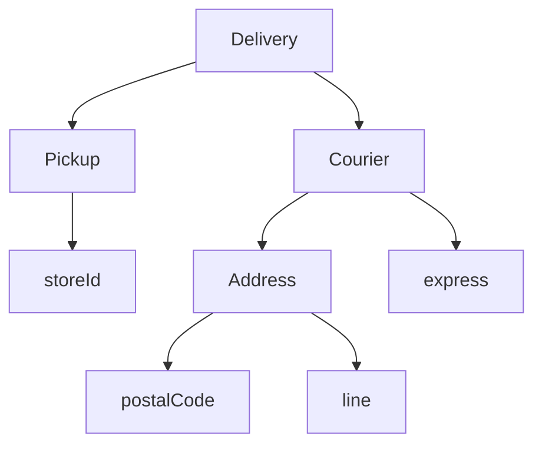

# 20장. Pattern Matching

합 타입과 ADT를 정의했다면 이제 그 구조를 안전하게 읽어야 한다.
패턴 매칭은 값의 형태를 확인하면서 필요한 부분에 이름을 붙여 계산하는 기능이다.
단순한 `switch`보다 구조 분해를 함께 제공한다는 점이 중요하다.

이번 장에서는 배송 요청을 방문 수령과 택배 배송으로 나누어 처리한다.
중첩 패턴과 가드, 기본 분기의 순서가 결과에 어떻게 영향을 주는지 살펴본다.
Scala의 표현식 형태와 Python의 문장 형태를 실제 코드로 비교한다.

---

## 1. 개념과 기본 구분

### 형태를 확인하고 분해한다

패턴은 값이 어떤 생성자와 구조를 가지는지 설명한다.
일치하면 그 구조의 일부를 변수에 바인딩하여 분기 본문에서 사용할 수 있다.
조건 검사와 필드 추출이 하나의 구문에 결합된다.

```text
값
  -> 형태 검사
  -> 필요한 부분에 이름 붙이기
  -> 해당 경우의 계산
```

단순한 상수 비교뿐 아니라 레코드, 합 타입, 목록, 중첩 구조를 다룰 수 있다.
언어마다 지원하는 패턴 종류와 세부 평가 규칙은 다르다.
같은 모양의 코드라고 완전히 같은 기능이라고 가정하지 않는다.

### 첫 번째 일치

일반적인 패턴 매칭은 위에서부터 검사하여 먼저 일치하는 분기를 선택한다.
넓은 패턴을 앞에 두면 뒤의 구체적인 패턴이 실행되지 않을 수 있다.
분기 순서는 의미의 일부다.

### 가드

패턴만으로 표현하기 어려운 조건은 가드로 추가할 수 있다.
가드는 형태가 일치하고 필요한 값이 바인딩된 뒤 검사된다.
가드가 거짓이면 다음 분기를 검토할 수 있다.

### 완전성

모든 가능한 입력 경우를 처리하는지의 문제를 완전성이라고 부른다.
닫힌 ADT에서는 언어와 검사 도구가 누락을 발견하는 데 도움을 줄 수 있다.
하지만 가드의 임의 논리나 외부 입력의 모든 유효성을 자동 증명하는 것은 아니다.

---

## 2. 명령형 스타일과 함수형 스타일

### 상태와 필드를 따로 검사한다

```text
if request.kind == "pickup":
    store = request.store_id
else if request.kind == "courier":
    address = request.address
    express = request.express
```

태그와 필드의 관계가 별도 관례라면 잘못된 필드 접근이 가능하다.
ADT와 패턴 매칭을 함께 사용하면 해당 경우의 데이터만 분해할 수 있다.

### 구조와 처리를 맞춘다

```scala
enum Delivery:
  case Pickup(storeId: String)
  case Courier(postalCode: String, express: Boolean)

def label(delivery: Delivery): String =
  delivery match
    case Delivery.Pickup(storeId) => s"매장 수령: $storeId"
    case Delivery.Courier(postalCode, true) => s"빠른 배송: $postalCode"
    case Delivery.Courier(postalCode, false) => s"일반 배송: $postalCode"
```

각 생성자가 가진 필드에만 접근한다.
같은 택배 생성자 안에서도 불리언 필드에 따라 경우를 나눌 수 있다.
필드의 실제 형식과 범위 검증은 별도의 입력 계약이다.

### 넓은 분기를 먼저 두는 실수

택배의 모든 경우를 받는 패턴을 빠른 배송 패턴보다 먼저 두면 구체적인 분기가 가려진다.
순서를 바꾸는 것이 단순한 스타일 변경이 아닐 수 있다.
가장 구체적인 경우와 기본 처리를 의도에 맞게 배치한다.

### 가독성의 한계

한 패턴에 너무 많은 중첩과 가드를 넣으면 이해하기 어려워진다.
의미 있는 하위 판단을 함수로 분리하는 편이 나을 수 있다.
패턴 매칭은 복잡한 조건을 무조건 한 줄에 넣는 도구가 아니다.

---

## 3. 왜 이 개념을 사용하는가?

### 안전한 필드 접근

경우를 확인한 뒤 해당 필드를 사용하므로 잘못된 상태의 필드를 읽는 코드를 줄일 수 있다.
반복적인 태그 검사와 형 변환을 줄이는 데 도움이 된다.
타입의 데이터 구조와 처리 구조가 함께 보인다.

### 변경 시 누락 발견

새 생성자가 추가되면 기존 매칭 함수가 모든 경우를 다루는지 검토할 수 있다.
기본 분기를 남발하면 새 경우가 조용히 기존 경로로 들어갈 수 있다.
기본 처리가 의도한 정책인지 확인해야 한다.

### 중첩 데이터의 읽기

주문 안의 배송 정보나 결과 안의 성공값을 한 번에 분해할 수 있다.
하지만 구조가 자주 바뀌면 깊은 패턴이 여러 곳에서 수정될 수 있다.
공개된 도메인 연산으로 접근하는 편이 더 안정적인 경계일 수도 있다.

### 테스트의 분할

각 패턴과 가드의 경계를 테스트로 나눌 수 있다.
가드가 참인 경우뿐 아니라 형태는 같고 가드가 거짓인 경우도 포함한다.
기본 분기에 도달해야 하는 입력과 도달하면 안 되는 입력을 구분한다.

### 결과값의 명시

Scala의 `match`는 표현식으로 사용할 수 있어 각 분기가 만드는 결과를 한 타입으로 모을 수 있다.
Python에서는 함수의 반환문을 사용하여 같은 입력·출력 계약을 구성한다.
문법의 차이가 설계 원리를 막는 것은 아니다.

---

## 4. Scala에서의 표현

### Scala의 순서, 가드, 중첩 패턴

다음 예제는 배송 비용을 결정하는 작은 정책이다.
특정 우편번호 접두사와 빠른 배송 여부를 예시 조건으로 사용한다.
실제 배송사의 가격이나 지역 정책을 나타내는 데이터는 아니다.

<!-- executable:scala -->
```scala
object Chapter20:
  final case class Address(postalCode: String, line: String)

  enum Delivery:
    case Pickup(storeId: String)
    case Courier(address: Address, express: Boolean)

  enum FeeError:
    case EmptyStore
    case InvalidPostalCode

  def fee(delivery: Delivery): Either[FeeError, Int] =
    delivery match
      case Delivery.Pickup(storeId) if storeId.isEmpty =>
        Left(FeeError.EmptyStore)
      case Delivery.Pickup(_) =>
        Right(0)
      case Delivery.Courier(Address(postal, _), _) if postal.length != 5 =>
        Left(FeeError.InvalidPostalCode)
      case Delivery.Courier(Address(postal, _), true) if postal.startsWith("9") =>
        Right(7000)
      case Delivery.Courier(_, true) =>
        Right(5000)
      case Delivery.Courier(_, false) =>
        Right(3000)

  def shape(values: List[Int]): String =
    values match
      case Nil => "empty"
      case value :: Nil => s"one:$value"
      case first :: second :: rest => s"many:$first,$second,rest=${rest.length}"

  def check(): Unit =
    import Delivery.*
    assert(fee(Pickup("S-1")) == Right(0))
    assert(fee(Pickup("")) == Left(FeeError.EmptyStore))
    assert(fee(Courier(Address("12345", "street"), false)) == Right(3000))
    assert(fee(Courier(Address("12345", "street"), true)) == Right(5000))
    assert(fee(Courier(Address("91234", "street"), true)) == Right(7000))
    assert(fee(Courier(Address("91234", "street"), false)) == Right(3000))
    assert(fee(Courier(Address("123", "street"), true)) == Left(FeeError.InvalidPostalCode))
    assert(shape(Nil) == "empty")
    assert(shape(List(7)) == "one:7")
    assert(shape(List(1, 2, 3, 4)) == "many:1,2,rest=2")
```

### 가드의 범위

우편번호 길이가 5라는 검사는 모든 문자가 숫자라는 검사가 아니다.
이 예제는 패턴과 가드의 순서를 설명하기 위해 제한적인 조건만 확인한다.
실제 형식 검증은 별도 파서나 스마트 생성자로 옮길 수 있다.

### 검증 순서

빠른 배송의 가격 분기보다 우편번호 길이 검사를 먼저 둔다.
순서가 바뀌면 잘못된 주소도 가격 계산에 들어갈 수 있다.
앞에 있는 넓은 분기가 뒤의 검증을 가리지 않는지 확인해야 한다.

### 목록의 구조

빈 목록, 한 원소 목록, 두 원소 이상 목록으로 분해했다.
이 경우 목록의 길이 조건이 구조 패턴에 드러난다.
인덱스로 직접 접근하기 전에 길이를 따로 검사하는 코드와 비교해 볼 수 있다.

---

## 5. 상태 변경보다 값 변환

### 분해는 변경이 아니다

패턴 매칭은 값을 읽고 필요한 부분을 바인딩하는 작업이다.
원본 데이터를 수정하는 동작이 자동으로 발생하지 않는다.
다만 추출 과정이 사용자 정의 코드나 효과를 실행할 수 있는 언어 기능과 연결되는 경우는 별도
검토가 필요하다.



패턴은 이 구조의 일부를 한 번에 읽는다.
필요 없는 필드는 와일드카드로 무시할 수 있다.
그러나 필드를 무시한다는 사실이 그 필드의 유효성이 중요하지 않다는 뜻은 아니다.

### 원래 값의 보존

패턴으로 추출한 값이 가변 객체의 참조이면 원본과 공유될 수 있다.
분해가 깊은 복사를 수행한다고 가정하지 않는다.
읽기와 갱신의 책임을 구분한다.

### 새 값 만들기

일치한 경우의 필드를 사용해 새 생성자의 값을 반환할 수 있다.
이것은 불변 상태 전이를 표현하는 자연스러운 방식이다.
전이의 허용 조건과 외부 효과는 별도 함수 계약으로 명시한다.

---

## 6. 함수 합성과 데이터 흐름

### 매칭 결과의 합성

Scala에서는 `match` 결과를 바로 다음 함수에 전달할 수 있다.
Python에서는 매칭을 수행하는 함수를 만들어 그 반환값을 연결할 수 있다.
문장과 표현식의 차이를 입력·출력 함수 경계로 보완한다.

```text
Delivery
  -> 패턴 매칭으로 비용 결과
  -> 성공 비용의 변환
  -> 표시 데이터
```

### 가드와 순수성

가드가 시간이나 외부 상태를 읽으면 같은 입력의 분기 결과가 달라질 수 있다.
패턴 매칭 문법 자체가 순수한 경우 분석을 보장하지는 않는다.
가능하면 필요한 환경값을 먼저 입력으로 전달한다.

### 추출기

Scala의 사용자 정의 추출기는 값에서 패턴에 필요한 정보를 꺼내는 로직을 제공할 수 있다.
편리하지만 임의의 계산이 숨을 수 있으므로 비용과 실패 계약을 확인한다.
단순한 case class 분해와 모든 추출기의 동작을 동일하게 가정하지 않는다.

### 함수 분리

복잡한 가드는 이름 있는 술어로 분리할 수 있다.
다만 그 술어의 결과가 타입을 자동으로 좁히거나 완전성을 증명한다고 가정하지 않는다.
가독성, 정적 검사, 실행 의미를 각각 검토한다.

---

## 7. 장점과 트레이드오프

### 장점과 트레이드오프

| 기능 | 장점 | 주의점 |
| --- | --- | --- |
| 생성자 패턴 | 상태와 필드 대응 | 내부 구조에 대한 결합 |
| 중첩 패턴 | 깊은 구조 분해 | 가독성과 변경 범위 |
| 가드 | 추가 조건 표현 | 순서와 효과 |
| 기본 분기 | 의도적 나머지 처리 | 새 경우 누락 은폐 |
| 목록 패턴 | 구조적 경계 표현 | 자료형별 지원 차이 |

### 완전성 경고의 사용

경고를 무시하지 않고 새 상태의 의미를 검토하는 습관이 중요하다.
그러나 경고가 없다고 모든 업무 입력이 유효하다는 뜻은 아니다.
숫자 범위와 외부 데이터의 신뢰는 별도 검증 대상이다.

### 표현식의 결과 타입

분기마다 너무 다른 종류의 값을 반환하면 공통 타입이 넓어질 수 있다.
명시적인 결과 ADT로 성공과 오류를 구분하는 편이 더 명확할 수 있다.
임의의 문자열과 숫자를 섞어 반환하면 호출자의 경우 분석 부담이 커진다.

### 큰 분기문의 분리

모든 업무 로직을 하나의 거대한 `match`에 넣으면 유지보수가 어려워질 수 있다.
경우 선택과 해당 경우의 상세 계산을 분리한다.
패턴 매칭은 구조를 드러내는 도구이지 함수 크기 제한을 없애는 도구가 아니다.

---

## 8. 상태와 부수효과의 경계

### 외부 객체의 분해

외부 라이브러리 객체의 속성 접근이 계산이나 I/O를 수행할 수 있다.
패턴 매칭이 그런 객체의 속성을 읽는 경우에도 같은 효과 문제가 생길 수 있다.
도메인 내부에서는 평범한 불변 값으로 변환한 뒤 분해하는 편이 경계를 명확히 한다.

### 실패한 매칭

처리하지 않은 입력이 들어오면 언어와 코드 형태에 따라 예외가 발생하거나 아무 분기도 실행되지
않을 수 있다.
그 동작을 무심코 기본 성공으로 해석해서는 안 된다.
외부 입력에서는 명시적인 오류 결과를 반환하는 경계를 둔다.

### 보안 정책의 순서

일반 처리 분기가 권한 검사를 포함한 특수 분기보다 앞에 있으면 우회 경로가 생길 수 있다.
보안 판단은 패턴의 편리함보다 적용 순서와 실패 기본값을 중심으로 검토한다.
작은 예제의 기본 분기를 실서비스 정책에 그대로 복사하지 않는다.

### 부분 효과

가드나 분기 본문이 효과를 수행하다 실패하면 이미 실행한 작업이 남을 수 있다.
다음 패턴을 시도하거나 예외가 전파된다고 효과가 자동으로 취소되는 것은 아니다.
가능하면 경우 판단과 외부 실행을 분리한다.

---

## 9. Python에서 적용하기

### Python의 구조적 패턴 매칭

Python의 `match`는 문장이므로 함수 안에서 결과를 반환하도록 작성한다.
클래스 패턴과 중첩 패턴, 가드를 사용해 Scala 예제와 같은 계약을 구현한다.
마지막 분기는 잘못된 런타임 객체를 조용히 통과시키지 않도록 한다.

<!-- executable:python -->
```python
from dataclasses import dataclass


@dataclass(frozen=True)
class Address:
    postal_code: str
    line: str


@dataclass(frozen=True)
class Pickup:
    store_id: str


@dataclass(frozen=True)
class Courier:
    address: Address
    express: bool


Delivery = Pickup | Courier


@dataclass(frozen=True)
class Fee:
    amount: int


@dataclass(frozen=True)
class FeeError:
    code: str


FeeResult = Fee | FeeError


def fee(delivery: Delivery) -> FeeResult:
    match delivery:
        case Pickup(store_id) if not store_id:
            return FeeError("empty_store")
        case Pickup():
            return Fee(0)
        case Courier(Address(postal, _), _) if len(postal) != 5:
            return FeeError("invalid_postal_code")
        case Courier(Address(postal, _), True) if postal.startswith("9"):
            return Fee(7000)
        case Courier(_, True):
            return Fee(5000)
        case Courier(_, False):
            return Fee(3000)
        case _:
            raise TypeError("unknown delivery value")


def shape(values: list[int]) -> str:
    match values:
        case []:
            return "empty"
        case [value]:
            return f"one:{value}"
        case [first, second, *rest]:
            return f"many:{first},{second},rest={len(rest)}"
    raise TypeError("expected a list")


def test_delivery() -> None:
    assert fee(Pickup("S-1")) == Fee(0)
    assert fee(Pickup("")) == FeeError("empty_store")
    assert fee(Courier(Address("12345", "street"), False)) == Fee(3000)
    assert fee(Courier(Address("12345", "street"), True)) == Fee(5000)
    assert fee(Courier(Address("91234", "street"), True)) == Fee(7000)
    assert fee(Courier(Address("91234", "street"), False)) == Fee(3000)
    assert fee(Courier(Address("123", "street"), True)) == FeeError("invalid_postal_code")


def test_sequence_patterns() -> None:
    assert shape([]) == "empty"
    assert shape([7]) == "one:7"
    assert shape([1, 2, 3, 4]) == "many:1,2,rest=2"


if __name__ == "__main__":
    test_delivery()
    test_sequence_patterns()
```

### 위치 패턴과 필드 이름

데이터 클래스의 위치 패턴은 해당 클래스가 제공하는 매칭 메타데이터에 따라 필드를 해석한다.
필드 순서가 바뀌면 위치 패턴의 의미도 영향을 받을 수 있다.
공개 모델에서는 키워드 패턴이 더 명시적인 선택일 수 있다.

---

## 10. Python의 표현 한계

### 단순 이름은 상수 비교가 아닐 수 있다

Python 패턴의 단순 이름은 값을 캡처하는 패턴으로 해석될 수 있다.
상수와 비교하려면 리터럴이나 적절한 한정 이름을 사용해야 한다.
일반 `if value == constant`의 직관을 모든 패턴 이름에 그대로 적용하지 않는다.

### 매핑과 시퀀스

매핑 패턴은 지정한 키를 검사하더라도 추가 키를 허용하는 형태가 있다.
시퀀스 패턴도 모든 iterable에 동일하게 적용되는 것은 아니다.
외부 스키마를 엄격히 검증하려면 패턴의 정확한 허용 범위를 확인해야 한다.

### 완전성의 강제

Python 실행기는 유니언의 모든 경우를 처리하도록 자동으로 강제하지 않는다.
정적 검사 도구와 `assert_never` 같은 장치를 활용할 수 있지만 설정과 지원 범위를 확인해야 한다.
실행 시 잘못된 값에 대한 처리는 별도다.

### 표현식이 아닌 문장

`result = match ...` 같은 가상의 Python 문법을 사용하지 않는다.
이름 있는 함수에서 분기별로 반환하면 같은 값 중심 설계를 적용할 수 있다.
문법 차이를 숨기지 않고 자연스러운 Python 표현으로 옮긴다.

---

## 11. 핵심 정리

### 핵심 결론

패턴 매칭은 값의 형태를 확인하면서 필드를 분해한다.
분기 순서와 가드는 실제 실행 의미를 가진다.
완전성 검사는 도움이 되지만 입력 유효성과 효과 안전성을 대신하지 않는다.
Scala와 Python의 표현식·문장 차이를 실제 함수 경계로 비교해야 한다.

### 연습 1: 넓은 분기

모든 택배를 처리하는 분기를 빠른 배송 분기보다 앞에 두었다.
무슨 일이 생길 수 있는가?

**해설.** 앞 분기가 먼저 일치하여 빠른 배송의 특별 처리가 실행되지 않을 수 있다.
구체적인 조건과 기본 처리를 의도에 맞는 순서로 배치해야 한다.
순서는 단순한 스타일이 아니다.

### 연습 2: 가드 실패

생성자 패턴은 일치했지만 가드가 거짓이면 어떻게 처리할지 설명하라.

**해설.** 해당 분기를 선택하지 않고 뒤의 적절한 패턴을 검토할 수 있다.
가드가 거짓인 입력도 테스트해야 한다.
가드의 효과가 있었다면 그 효과가 되돌려지는 것은 아니다.

### 연습 3: 상수 이름

Python에서 `case expected:`를 상수 비교라고 생각했다.
어떤 오해가 있는가?

**해설.** 단순 이름은 캡처 패턴이 될 수 있다.
리터럴이나 한정된 상수 이름, 또는 명시적인 가드를 사용해야 한다.
패턴 문법과 일반 표현식 문법의 의미를 구분한다.

### 연습 4: 외부 입력 검증

우편번호 길이가 5인 패턴을 통과했으니 유효한 주소라고 판단했다.
무엇이 부족한가?

**해설.** 문자 종류, 실제 주소 정책, 필수 필드 등의 조건을 검사하지 않았다.
패턴이 확인한 범위만 보장한다고 설명해야 한다.
유효한 도메인 값 생성은 별도의 파싱과 검증으로 구성한다.

### 다음 장과 참고 자료

다음 장은 검증된 값만 생성하도록 경계를 제한하는 스마트 생성자를 다룬다.
모든 소비자가 같은 검사를 반복하는 대신 생성 시점에 계약을 세우는 방법이다.

[Scala 공식 문서: Pattern Matching](https://docs.scala-lang.org/tour/pattern-matching.html)
[Python 언어 참조: match](https://docs.python.org/3.14/reference/compound_stmts.html#the-match-statement)
