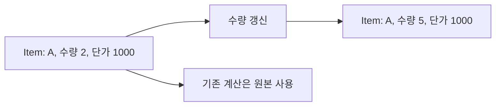

# 17장. Product Types


2부에서는 값이 함수 사이를 흐르는 방법을 배웠다.
3부에서는 그 값이 어떤 형태여야 하는지 설계한다.
곱 타입은 여러 정보를 동시에 갖는 값을 표현하는 기본 도구이며, 튜플과 레코드는 그 대표적인
구현이다.

주문 품목에는 상품 코드와 수량과 단가가 함께 필요하다.
이 관계를 하나의 값으로 묶으면 함수의 입력 계약을 더 잘 드러낼 수 있다.
다만 필드를 묶는 것만으로 필드 사이의 모든 업무 규칙이 보장되지는 않는다는 점을 함께 살펴본다.

---

## 1. 개념과 기본 구분

### 동시에 가진다는 의미

곱 타입 `A × B`의 값은 `A`의 값 하나와 `B`의 값 하나를 함께 가진다.
한쪽만 선택하는 것이 아니라 양쪽 정보가 모두 존재한다.
이것이 다음 장의 합 타입과 구분되는 핵심이다.

```text
A × B
  값: (a, b)
  a는 A의 값
  b는 B의 값
```

유한한 값 집합을 가정하면 가능한 쌍의 수는 두 집합 크기의 곱이다.
예를 들어 배송 방식이 2가지이고 우선순위가 3가지이면 조합은 6가지다.
이 계산은 실제 메모리 배치나 객체 크기를 말하는 것이 아니라 가능한 값의 수를 말한다.

### 튜플과 레코드

튜플은 위치로 필드를 구분한다.
레코드는 필드에 이름을 붙인다.
둘 다 여러 값을 함께 보관하지만 업무 의미가 중요할수록 이름 있는 필드가 읽기 쉬운 경우가 많다.

### 곱 타입과 교차 타입

곱 타입은 두 값을 한 구조 안에 함께 담는다.
교차 타입은 한 값이 여러 타입의 조건을 동시에 만족한다는 다른 개념이다.
기호가 곱처럼 보인다고 객체 두 개를 만드는 의미로 혼동하지 않는다.

### 독립 조합의 가정

단순한 곱은 필드의 모든 조합을 허용한다.
시작 시각과 종료 시각을 묶어도 시작이 종료보다 빠르다는 관계는 자동으로 생기지 않는다.
필드 간 제약은 별도의 검증이나 더 강한 타입 설계가 필요하다.

---

## 2. 명령형 스타일과 함수형 스타일

### 평행한 목록의 문제

상품 코드 목록과 수량 목록을 따로 보관하면 위치를 맞추는 규칙이 필요하다.
한쪽만 추가되거나 정렬되면 서로 다른 상품과 수량이 연결될 수 있다.
자료의 관계가 타입보다 인덱스 관례에 의존하게 된다.

```python
skus = ["A", "B"]
quantities = [2, 3]
prices = [1000, 500]
```

세 목록의 길이가 같고 같은 순서를 유지해야 한다.
이 불변식을 모든 갱신 경로에서 지키는 일은 번거롭다.
관련 값을 한 원소로 묶으면 그 관계를 구조에 넣을 수 있다.

### 품목 레코드

```scala
final case class Item(sku: String, quantity: Int, unitPrice: Long)

val items = List(
  Item("A", 2, 1000),
  Item("B", 3, 500)
)
```

이제 목록 하나의 각 원소가 완전한 품목 정보를 가진다.
정렬하거나 필터링해도 상품 코드와 수량이 함께 움직인다.
하지만 음수 수량을 만들 수 있는지 여부는 별도의 생성 계약이다.

### 위치 기반 튜플의 한계

`("A", 2, 1000)`은 짧지만 각 위치의 의미를 알아야 한다.
같은 정수 타입의 수량과 단가를 바꾸어도 타입이 같아 오류를 놓칠 수 있다.
이름 있는 필드와 도메인 래퍼 타입이 이런 혼동을 줄일 수 있다.

### 관련 없는 값을 묶지 않는다

모든 설정과 요청 데이터를 하나의 거대한 레코드에 넣으면 함수의 실제 의존성이 흐려진다.
함께 이동하고 같은 의미 단위를 이루는 값부터 묶는다.
곱 타입은 무조건 큰 객체를 만들라는 규칙이 아니다.

---

## 3. 왜 이 개념을 사용하는가?

### 함수 입력의 계약

품목을 받는 함수는 상품 코드, 수량, 단가가 함께 있다는 사실을 전제로 할 수 있다.
각 인자를 따로 전달하면서 순서를 맞추는 부담이 줄어든다.
필드 이름은 함수 본문의 읽기에도 도움이 된다.

### 불변식의 위치

관련 값을 묶으면 그 관계를 검사할 위치도 정하기 쉬워진다.
예를 들어 기간 레코드의 생성 경계에서 시작과 종료를 함께 검사할 수 있다.
스마트 생성자 장에서는 이런 경계를 제한하는 방법을 다룬다.

### 도메인 어휘

`OrderId`, `CustomerId`, `Money` 같은 타입 이름은 같은 원시 타입의 서로 다른 의미를 구분한다.
단순한 별칭이 실제로 새로운 타입을 만드는지 언어별로 확인해야 한다.
타입 이름만 다르게 적었다고 모든 잘못된 조합이 거부되는 것은 아니다.

### 변경의 지역성

품목에 새 필드가 추가되면 해당 레코드를 중심으로 영향을 확인할 수 있다.
반면 레코드가 여러 계층의 요구를 모두 떠안으면 변경 범위가 넓어진다.
전송 객체, 저장 모델, 도메인 값의 역할을 필요에 따라 구분한다.

### 값의 비교

레코드의 구조적 동등성은 테스트와 변경 감지에 유용할 수 있다.
하지만 업무상의 동일성은 식별자만으로 판단할 수도 있다.
전체 필드 값의 동일성과 같은 주문이라는 식별 관계를 구분해야 한다.

---

## 4. Scala에서의 표현

### Scala의 곱 타입 모델

다음 프로그램은 유한 조합의 수와 이름 있는 주문 품목을 함께 다룬다.
도메인 식별자를 별도 레코드로 감싸 서로 다른 의미를 타입에 나타낸다.
숫자 범위 검증은 뒤의 스마트 생성자에서 더 강하게 다룬다.

<!-- executable:scala -->
```scala
object Chapter17:
  enum Delivery:
    case Pickup, Courier

  enum Priority:
    case Low, Normal, High

  final case class ShippingOption(delivery: Delivery, priority: Priority)
  final case class OrderId(value: String)
  final case class CustomerId(value: String)
  final case class Item(sku: String, quantity: Int, unitPrice: BigInt)
  final case class Order(id: OrderId, customerId: CustomerId, items: Vector[Item])
  final case class Interval(start: Int, end: Int)

  def amount(item: Item): BigInt =
    item.unitPrice * item.quantity

  def total(order: Order): BigInt =
    order.items.map(amount).sum

  def replaceQuantity(item: Item, quantity: Int): Item =
    item.copy(quantity = quantity)

  def toTuple(item: Item): (String, Int, BigInt) =
    (item.sku, item.quantity, item.unitPrice)

  def fromTuple(value: (String, Int, BigInt)): Item =
    Item(value._1, value._2, value._3)

  def check(): Unit =
    val options = for
      delivery <- Delivery.values.toVector
      priority <- Priority.values.toVector
    yield ShippingOption(delivery, priority)
    assert(options.size == 2 * 3)
    assert(options.distinct.size == 6)

    val item = Item("A", 2, 1000)
    val order = Order(OrderId("O-1"), CustomerId("C-1"), Vector(item, Item("B", 3, 500)))
    assert(total(order) == 3500)
    assert(fromTuple(toTuple(item)) == item)
    val changed = replaceQuantity(item, 5)
    assert(changed == Item("A", 5, 1000))
    assert(item.quantity == 2)
    assert(order.id.value == "O-1")
    assert(order.customerId.value == "C-1")

    val invalidInterval = Interval(10, 3)
    assert(invalidInterval.start > invalidInterval.end)
    val emptyOrder = order.copy(items = Vector.empty)
    assert(total(emptyOrder) == 0)
```

### 곱이 보장하지 않는 관계

`Interval(10, 3)`은 두 정수 필드를 가진다는 타입 조건을 만족한다.
하지만 시작이 종료보다 작아야 한다는 업무 규칙은 만족하지 않는다.
이 반례는 레코드 생성만으로 모든 유효성이 보장되지 않는다는 점을 보여 준다.

### 튜플 왕복

필드를 같은 순서로 넣고 꺼내면 레코드와 튜플 사이를 왕복할 수 있다.
순서를 바꾸거나 필드를 누락하면 정보가 달라진다.
직렬화 어댑터도 같은 정보 보존 관점에서 검토할 수 있다.

### 타입 래퍼의 의미

`OrderId`와 `CustomerId`는 서로 다른 명목적 레코드다.
둘의 내부 값이 문자열이어도 함수가 요구하는 의미를 구분할 수 있다.
문자열 형식의 유효성까지 보장하는지는 생성 경계의 별도 책임이다.

---

## 5. 상태 변경보다 값 변환

### 레코드의 갱신

불변 곱 타입의 갱신은 일부 필드가 다른 새 값을 만드는 작업이다.
원래 값은 보존되며 바뀌지 않은 필드의 값은 재사용할 수 있다.
이 구조는 앞서 배운 불변성과 자연스럽게 연결된다.



필드들이 가변 객체를 참조하면 새 레코드도 내부 객체를 공유할 수 있다.
곱 타입이라는 구조와 깊은 불변성은 다른 성질이다.
객체 그래프의 각 층을 검토해야 한다.

### 투영

곱 타입에서 특정 필드만 꺼내는 연산을 투영이라고 부른다.
예를 들어 품목에서 수량을 읽는 함수는 `Item -> Int`다.
중첩 레코드의 투영과 갱신을 조합하는 문제는 Lens 장으로 이어진다.

### 필드의 그룹화

주소의 우편번호와 상세주소처럼 함께 쓰이는 값은 중첩 레코드로 묶을 수 있다.
그러나 지나친 중첩은 경로를 길게 만들 수 있다.
도메인의 의미 단위와 사용 패턴을 함께 고려한다.

---

## 6. 함수 합성과 데이터 흐름

### 곱 타입을 입력으로 받는 함수

여러 인자를 하나의 레코드로 묶으면 함수 합성의 중간 타입으로 사용하기 쉽다.
앞 단계가 완성한 레코드를 뒤 단계가 받아 계산한다.
필요한 필드가 준비되었는지를 구조적으로 드러낼 수 있다.

```text
파싱 -> Item -> 금액 계산 -> Money
```

아직 준비되지 않은 필드를 전부 선택값으로 두면 레코드가 허용하는 상태 수가 커진다.
단계별로 다른 타입을 사용하는 설계가 더 명확할 수 있다.
이 문제는 합 타입과 불가능한 상태 제거 장에서 확장한다.

### 곱의 재배열

`(A, B)`와 `(B, A)` 사이에는 순서를 바꾸는 변환을 만들 수 있다.
`((A, B), C)`와 `(A, (B, C))`도 필드 정보를 잃지 않고 서로 바꿀 수 있다.
이런 동형은 데이터의 정보량과 표현 형태를 구분하는 데 도움이 된다.

### 단위 타입

값이 하나뿐인 타입을 곱해도 새로운 선택 정보는 추가되지 않는다.
수학적으로 `A × 1`은 `A`와 같은 수의 값을 가진다.
그러나 실제 레코드의 필드 이름이나 메타데이터는 업무 설명에 의미가 있을 수 있다.
정보량 계산과 API 설계의 목적은 구분한다.

### 함수 타입과의 연결

유한한 순수 전체 함수 모델에서는 `A -> B`의 가능한 함수 수를 `|B|^|A|`로 셀 수 있다.
이 장의 곱셈과 함께 타입의 대수적 관점을 형성한다.
실제 언어의 예외, 비종료, 효과까지 그 단순한 모델에 무조건 포함하지 않는다.

---

## 7. 장점과 트레이드오프

### 장점과 트레이드오프

| 설계 선택 | 장점 | 주의점 |
| --- | --- | --- |
| 이름 있는 레코드 | 필드 의미 명확 | 타입 선언 증가 |
| 도메인 식별자 래퍼 | 원시 타입 혼동 감소 | 경계 변환 코드 |
| 중첩 레코드 | 관련 값의 묶음 | 깊은 접근 경로 |
| 불변 복사 | 이전 값 보존 | 할당과 내부 공유 |
| 튜플 | 짧은 지역 조합 | 위치 의미의 혼동 |

### 모든 조합이 유효한가?

곱 타입은 기본적으로 필드 조합의 공간을 만든다.
그중 실제 업무에서 허용하지 않는 조합이 많다면 데이터 모델을 다시 검토한다.
상태별로 필요한 필드를 나누는 합 타입이 더 적절할 수 있다.

### 원시 타입의 과잉 사용

여러 문자열과 정수만으로 모든 의미를 표현하면 인자 바꿈과 단위 혼동을 놓치기 쉽다.
중요한 경계에 도메인 타입을 사용하되 사소한 값까지 과도하게 감싸는 것은 피한다.
오류 위험과 코드 비용을 함께 평가한다.

### 자동 생성 기능

`case class`나 데이터 클래스는 비교, 생성, 표현 같은 반복 코드를 줄여 준다.
하지만 자동 생성된 동작이 업무상의 동일성이나 보안 정책에 맞는지는 확인해야 한다.
민감한 필드가 디버그 표현에 노출되는 문제도 검토한다.

---

## 8. 상태와 부수효과의 경계

### 외부 스키마와 내부 모델

데이터베이스 행이나 JSON 객체는 내부 곱 타입과 비슷해 보일 수 있다.
하지만 외부 데이터는 필드 누락, 잘못된 타입, 버전 차이가 있을 수 있다.
경계에서 파싱하고 검증한 뒤 도메인 값으로 옮긴다.

### 저장소 제약

도메인 레코드가 유효해도 저장소의 유일성이나 참조 무결성은 별도 문제다.
두 요청이 같은 식별자를 동시에 만들 수 있다.
타입 설계와 데이터베이스의 원자적 제약을 함께 사용해야 한다.

### 민감정보의 곱

필드를 함께 묶으면 해당 값을 전달하는 곳마다 정보가 함께 이동한다.
가격 계산에 고객의 전체 주소와 인증 정보가 필요하지 않을 수 있다.
함수에 필요한 최소한의 곱 타입을 전달하여 의존성과 노출 범위를 줄인다.

### 자원 객체의 포함

파일 핸들이나 연결을 레코드 필드에 넣으면 단순한 값 모델과 다른 수명 문제가 생긴다.
레코드가 불변이어도 자원 상태는 바뀔 수 있다.
도메인 데이터와 효과를 수행하는 자원을 구분하는 편이 이해하기 쉽다.

---

## 9. Python에서 적용하기

### Python의 데이터 클래스와 튜플

Python에서는 데이터 클래스로 이름 있는 곱 타입을 표현할 수 있다.
타입 주석과 frozen 옵션은 각각 다른 역할을 한다.
아래 예제는 유한 조합의 수, 불변 갱신, 튜플 왕복, 관계 제약의 빈틈을 검사한다.

<!-- executable:python -->
```python
from dataclasses import dataclass, replace
from enum import Enum
from itertools import product


class Delivery(Enum):
    PICKUP = "pickup"
    COURIER = "courier"


class Priority(Enum):
    LOW = "low"
    NORMAL = "normal"
    HIGH = "high"


@dataclass(frozen=True)
class ShippingOption:
    delivery: Delivery
    priority: Priority


@dataclass(frozen=True)
class OrderId:
    value: str


@dataclass(frozen=True)
class CustomerId:
    value: str


@dataclass(frozen=True)
class Item:
    sku: str
    quantity: int
    unit_price: int


@dataclass(frozen=True)
class Order:
    order_id: OrderId
    customer_id: CustomerId
    items: tuple[Item, ...]


@dataclass(frozen=True)
class Interval:
    start: int
    end: int


def total(order: Order) -> int:
    return sum(item.quantity * item.unit_price for item in order.items)


def to_tuple(item: Item) -> tuple[str, int, int]:
    return item.sku, item.quantity, item.unit_price


def from_tuple(value: tuple[str, int, int]) -> Item:
    sku, quantity, unit_price = value
    return Item(sku, quantity, unit_price)


def test_products() -> None:
    options = [ShippingOption(delivery, priority) for delivery, priority in product(Delivery, Priority)]
    assert len(options) == 6
    assert len(set(options)) == 6
    item = Item("A", 2, 1000)
    order = Order(OrderId("O-1"), CustomerId("C-1"), (item, Item("B", 3, 500)))
    assert total(order) == 3500
    assert from_tuple(to_tuple(item)) == item
    changed = replace(item, quantity=5)
    assert changed == Item("A", 5, 1000)
    assert item.quantity == 2
    assert total(replace(order, items=())) == 0


def test_relational_constraint_gap() -> None:
    invalid = Interval(10, 3)
    assert invalid.start > invalid.end


if __name__ == "__main__":
    test_products()
    test_relational_constraint_gap()
```

### 이름이 있는 입력

키워드 인자로 데이터 클래스를 생성하면 같은 타입의 필드 순서 혼동을 줄일 수 있다.
공개 API에서는 위치 인자보다 키워드 전용 구성을 검토할 수도 있다.
언어 기능을 선택할 때 호출자의 읽기 경험을 함께 고려한다.

---

## 10. Python의 표현 한계

### 타입 주석은 생성 검증이 아니다

데이터 클래스의 필드 주석이 런타임 값을 자동으로 검사하지는 않는다.
잘못된 타입의 값도 일반 생성 경로로 들어올 수 있다.
외부 입력은 명시적인 파싱과 검증이 필요하다.

### 별칭과 새로운 타입

`OrderId = str` 같은 별칭은 정적 의미에서 새로운 명목 타입을 만들지 않는다.
`NewType`은 정적 구분을 돕지만 런타임에는 별도 검증 객체를 만드는 것과 다르다.
데이터 클래스 래퍼도 내부 문자열의 형식을 자동 보장하지 않는다.

### 깊은 불변성

frozen 데이터 클래스의 필드가 리스트이면 그 리스트는 바뀔 수 있다.
튜플의 원소가 가변 객체여도 같은 문제가 있다.
곱 타입의 구조와 불변성의 깊이를 별도로 검토한다.

### 메모리 배치

논리적인 곱 타입이 C 구조체와 같은 고정된 메모리 배치를 뜻하지 않는다.
Python 객체의 구현 비용과 논리적인 값의 개수는 다른 층의 설명이다.
성능과 상호 운용이 중요하면 실제 표현을 따로 분석한다.

---

## 11. 핵심 정리

### 핵심 결론

곱 타입은 여러 정보를 동시에 가진 값을 표현한다.
이름 있는 필드는 도메인의 관계와 함수 입력을 명확하게 만든다.
모든 필드 조합을 허용하므로 관계 제약은 별도 설계가 필요하다.
곱 타입, 교차 타입, 깊은 불변성, 런타임 검증은 서로 다른 개념이다.

### 연습 1: 값의 수

배송 방식 2가지, 우선순위 3가지, 선물 포장 여부 2가지를 함께 가진 값은 몇 가지인가?

**해설.** 모든 조합을 허용하면 `2 × 3 × 2 = 12`가지다.
특정 배송 방식에서 포장을 금지한다면 단순한 곱보다 좁은 유효 영역을 가진다.
가능한 표현과 실제 허용 상태를 구분한다.

### 연습 2: 기간 레코드

`Interval(start, end)`가 시작 이후 종료라는 조건을 자동 보장하지 않는 이유를 설명하라.

**해설.** 각 필드가 정수라는 사실만 표현하기 때문이다.
두 값 사이의 순서 관계는 별도 검증이나 제한된 생성 경로로 보장해야 한다.
필드별 타입과 필드 간 불변식은 다른 수준이다.

### 연습 3: 평행 목록

상품 코드, 수량, 단가를 세 목록으로 보관하는 모델을 품목 목록으로 바꾸어라.
어떤 불변식이 구조에 포함되는가?

**해설.** 각 품목이 세 값을 함께 보관하여 같은 위치의 관계가 유지된다.
한 목록만 정렬하거나 길이가 달라지는 문제를 줄인다.
수량과 단가의 범위 유효성은 여전히 별도다.

### 연습 4: 정보 최소화

가격 계산 함수에 고객의 전체 프로필 레코드를 전달하는 설계를 검토하라.

**해설.** 계산에 필요한 등급이나 정책 입력만 별도 값으로 전달할 수 있다.
불필요한 의존성과 민감정보의 이동을 줄인다.
곱 타입은 관련 정보를 묶는 도구이지 모든 정보를 한곳에 모으는 목표가 아니다.

### 다음 장과 참고 자료

다음 장은 여러 경우 중 하나를 선택하는 합 타입을 다룬다.
“그리고”의 구조와 “또는”의 구조를 구분하면 상태 모델이 더 정확해진다.

[Scala 공식 문서: Algebraic Data Types](https://docs.scala-lang.org/scala3/book/types-adts-gadts.html)
[Python 공식 문서: dataclasses](https://docs.python.org/3.14/library/dataclasses.html)
[Python 공식 문서: typing.NewType](https://docs.python.org/3.14/library/typing.html#newtype)
