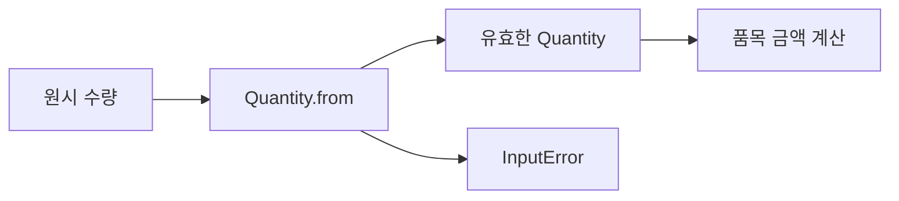

# 21장. Smart Constructors

앞 장의 패턴 매칭은 값의 형태를 안전하게 읽는 데 도움을 주었다.
하지만 음수 수량이나 빈 상품 코드가 도메인 값으로 들어오면 모든 소비자가 같은 검사를 반복해야
한다.
스마트 생성자는 유효한 값으로 들어오는 경계를 한곳에 모으는 설계다.

이번 장에서는 상품 코드, 수량, 단가를 검증한 뒤 품목 계산에 전달한다.
“검사하는 함수가 있다”는 사실과 “검사를 거치지 않고는 정상적인 공개 경로로 만들 수 없다”는
사실을 구분한다.
Scala의 생성 경계와 Python의 실행 시 검사를 비교하면서 보장과 우회 가능성을 과장하지 않는다.

---

## 1. 개념과 기본 구분

### 생성이 계약을 세운다

스마트 생성자는 입력을 검사하고 유효한 도메인 값 또는 실패 정보를 반환한다.
성공한 값은 특정 불변식을 만족한다는 약속을 가진다.
그 약속을 유지하려면 이후 변경과 다른 생성 경로도 검토해야 한다.

```text
원시 입력
  -> 검사와 해석
  -> 유효한 도메인 값
  또는
  -> 구체적인 생성 오류
```

정수 하나를 감싼다는 사실보다 어떤 조건을 확인하고 어떤 경로를 공개하는지가 중요하다.
생성자가 공개되어 아무 값이나 넣을 수 있다면 별도의 검증 함수가 있어도 우회할 수 있다.
정상적인 API 사용자에게 어떤 사용을 허용하는지 명확히 한다.

### 불변식

수량은 1 이상 1,000,000 이하라는 식으로 값의 조건을 정의할 수 있다.
상품 코드는 정해진 문자와 길이 규칙을 만족해야 할 수 있다.
이런 조건은 실제 서비스의 정책에 따라 달라지므로 예제의 범위를 명시한다.

### 형식과 존재

상품 코드의 형식이 유효하다는 사실은 실제 상품이 존재한다는 사실과 다르다.
수량이 양수라는 사실은 현재 재고가 충분하다는 사실과 다르다.
순수한 생성 검증과 외부 상태 조회를 구분해야 한다.

### 한 번 검사한다는 말의 범위

불변 값이 같은 프로세스 안에서 안전한 경로로 전달될 때 반복 검사를 줄일 수 있다.
외부 직렬화 형식을 다시 읽거나 다른 신뢰 경계를 통과하면 재검증이 필요할 수 있다.
타입 이름이 모든 경계에서 영구적인 신뢰를 보장하지는 않는다.

---

## 2. 명령형 스타일과 함수형 스타일

### 모든 함수에서 반복 검사

```text
calculate(item): 수량 검사, 단가 검사, 계산
render(item):    수량 검사, 단가 검사, 표시
save(item):      수량 검사, 단가 검사, 저장
```

검사 규칙이 바뀌면 여러 위치를 수정해야 한다.
어떤 함수가 검사를 빠뜨렸는지 찾기도 어렵다.
일부 함수가 서로 다른 범위를 허용하면 도메인의 의미가 일관되지 않는다.

### 유효한 값만 받는다

```text
parseQuantity(raw) -> Quantity 또는 오류
parsePrice(raw)    -> UnitPrice 또는 오류

calculate(Quantity, UnitPrice) -> Amount
```

계산 함수는 유효한 입력 타입을 받아 업무 계산에 집중할 수 있다.
생성 실패는 입력 경계에서 처리한다.
이 구조는 뒤의 Parse, Don't Validate 패턴과 연결된다.

### 검증 함수만 추가한 경우

`is_valid_quantity`가 있어도 호출자가 무시하고 일반 정수를 넘길 수 있으면 약속이 약하다.
검증 성공 후 다른 타입을 반환하면 검사를 통과했다는 사실을 다음 단계에 전달할 수 있다.
언어가 그 구분을 얼마나 강하게 검사하는지는 별도의 문제다.

### 실패를 숨기지 않는다

잘못된 수량을 자동으로 1로 바꾸는 것은 검증이 아니라 보정 정책이다.
그 정책이 의도한 것인지 명시해야 한다.
입력 오류를 조용히 수정하면 사용자 의도와 실제 처리 결과가 달라질 수 있다.

---

## 3. 왜 이 개념을 사용하는가?

### 검사의 지역화

형식과 범위 규칙을 한곳에 두면 수정과 테스트가 쉬워진다.
소비자는 유효한 값의 연산에 집중할 수 있다.
다만 경계에서 처리할 오류 정보가 충분히 구체적이어야 한다.

### 함수의 정의역 축소

원시 정수 전체 대신 `Quantity`를 받으면 허용된 입력 영역을 더 정확히 표현한다.
계산 함수가 처리하지 않아도 되는 경우를 타입 경계로 밀어낼 수 있다.
이것이 전체 함수에 가까운 도메인 계산을 만드는 한 방법이다.

### 정규화와 검증의 구분

공백 제거와 대문자 변환은 입력을 바꾸는 정규화다.
정해진 형식인지 확인하는 일은 검증이다.
대소문자가 의미 있는 식별자라면 무조건 정규화하면 안 된다.

### 오류 메시지

사용자에게 필요한 필드명과 오류 코드를 보존한다.
내부 예외 메시지를 그대로 공개하는 것보다 안정적인 도메인 오류가 나을 수 있다.
민감한 원본 입력을 오류 메시지에 무조건 포함하지 않도록 주의한다.

### 테스트의 집중

최솟값 바로 아래, 최솟값, 최댓값, 최댓값 바로 위를 검사한다.
문자 형식의 경계와 길이 제한도 별도로 검사한다.
성공 사례 하나만으로 생성 계약을 확인했다고 보지 않는다.

---

## 4. Scala에서의 표현

### Scala의 제한된 생성 경로

예제는 공개된 `copy`를 제공하지 않는 작은 final 클래스를 사용한다.
각 동반 객체의 `from`이 정상적인 생성 경로다.
성공값을 읽는 연산만 공개하고 필드의 변경은 허용하지 않는다.

<!-- executable:scala -->
```scala
object Chapter21:
  final case class InputError(field: String, code: String)

  final class Quantity private (val value: Int)
  object Quantity:
    def from(value: Int): Either[InputError, Quantity] =
      if value >= 1 && value <= 1000000 then Right(new Quantity(value))
      else Left(InputError("quantity", "out_of_range"))

  final class UnitPrice private (val value: BigInt)
  object UnitPrice:
    def from(value: BigInt): Either[InputError, UnitPrice] =
      if value >= 0 && value <= BigInt("1000000000000") then Right(new UnitPrice(value))
      else Left(InputError("unitPrice", "out_of_range"))

  final class Sku private (val value: String)
  object Sku:
    def from(value: String): Either[InputError, Sku] =
      if value.matches("[A-Z0-9][A-Z0-9-]{0,31}") then Right(new Sku(value))
      else Left(InputError("sku", "invalid_format"))

  final case class Item(sku: Sku, quantity: Quantity, unitPrice: UnitPrice)

  def item(sku: String, quantity: Int, price: BigInt): Either[InputError, Item] =
    for
      validSku <- Sku.from(sku)
      validQuantity <- Quantity.from(quantity)
      validPrice <- UnitPrice.from(price)
    yield Item(validSku, validQuantity, validPrice)

  def amount(item: Item): BigInt =
    item.unitPrice.value * item.quantity.value

  def check(): Unit =
    assert(Quantity.from(0).isLeft)
    assert(Quantity.from(1).map(_.value) == Right(1))
    assert(Quantity.from(1000000).isRight)
    assert(Quantity.from(1000001).isLeft)
    assert(UnitPrice.from(-1).isLeft)
    assert(UnitPrice.from(0).isRight)
    assert(UnitPrice.from(BigInt("1000000000001")).isLeft)
    assert(Sku.from("A-1").map(_.value) == Right("A-1"))
    assert(Sku.from("").isLeft)
    assert(Sku.from("a-1").isLeft)
    assert(Sku.from("A" * 32).isRight)
    assert(Sku.from("A" * 33).isLeft)
    assert(item("A-1", 3, 500).map(amount) == Right(BigInt(1500)))
    assert(item("bad", 0, -1) == Left(InputError("sku", "invalid_format")))
```

### 오류의 순서

`for` 구문은 앞 생성이 실패하면 다음 계산을 이어 가지 않는다.
예제에서는 상품 코드 오류가 먼저 반환된다.
모든 필드 오류를 한 번에 모으는 요구는 Validation과 오류 누적 장에서 따로 다룬다.

### 생성 경로의 검토

private 생성자만 보고 모든 우회가 막혔다고 결론 내리지 않는다.
공개 팩토리, 복사 메서드, 역직렬화, 리플렉션, 내부 모듈 코드를 함께 검토해야 한다.
이 예제의 보장은 정상적인 타입 검사와 공개 API 사용을 전제로 한다.
보안상 악의적인 같은 프로세스 코드까지 격리하는 장치는 아니다.

---

## 5. 상태 변경보다 값 변환

### 유효한 값으로의 전환

입력 경계를 통과하면 원시 값 대신 의미가 있는 도메인 값을 전달한다.
계산 함수는 이미 정해진 범위와 형식을 전제로 사용할 수 있다.
실패 정보를 성공값과 섞지 않는 것이 중요하다.



숫자를 감싼 래퍼는 새로운 수학적 정보를 추가하지 않을 수 있다.
하지만 프로그램의 어느 경계를 통과했는지 표현하는 역할을 한다.
그 의미를 유지하려면 내부에서 임의의 값을 만드는 편의 함수를 남발하지 않는다.

### 갱신도 생성이다

수량을 바꿀 때 새 `Quantity`를 생성 경로로 만든다.
유효한 객체의 내부 값을 직접 변경하면 불변식이 깨질 수 있다.
불변 설계는 생성 시 검증한 약속을 유지하는 데 도움이 된다.

### 필드 간 관계

개별 수량과 단가가 유효해도 주문 전체의 최대 금액 같은 관계 조건은 별도다.
상위 곱 타입의 스마트 생성자에서 함께 검사할 수 있다.
검증의 단위를 도메인의 불변식에 맞춘다.

---

## 6. 함수 합성과 데이터 흐름

### 생성 결과의 연결

여러 스마트 생성자는 성공 또는 오류를 반환한다.
성공값을 모아 품목을 만들려면 결과 컨텍스트를 연결해야 한다.
이것이 오류 처리 연산의 실용적인 동기다.

```text
Sku.from
  -> Quantity.from
  -> UnitPrice.from
  -> Item
```

이 순차 흐름은 첫 오류에서 중단한다.
서로 독립적인 필드의 모든 오류가 필요하면 다른 조합 정책을 선택해야 한다.
같은 생성자들을 사용하더라도 조합 방식에 따라 사용자 경험이 달라진다.

### 파싱과 검증

문자열을 정수로 읽는 파싱과 그 정수가 허용 범위인지 확인하는 검증을 연결할 수 있다.
두 실패의 원인을 구분하면 더 정확한 오류를 제공한다.
문자열이 숫자라는 사실과 양수 수량이라는 사실은 다르다.

### 도메인 연산의 닫힘

두 유효한 수량을 더한 결과가 항상 허용 범위 안에 있는 것은 아니다.
도메인 연산도 필요하면 다시 생성 검증을 거쳐야 한다.
타입이 유효하다고 모든 산술 연산이 그 타입 안에서 닫혀 있는 것은 아니다.

### 설정에 의존하는 규칙

범위가 정책 버전에 따라 달라지면 생성자에 정책을 명시적으로 전달하거나 버전별 타입 경계를
설계한다.
전역 설정을 몰래 읽으면 같은 입력의 생성 결과가 시점에 따라 달라질 수 있다.
재현이 필요한 값의 생성 규칙을 분명히 한다.

---

## 7. 장점과 트레이드오프

### 장점과 트레이드오프

| 선택 | 장점 | 주의점 |
| --- | --- | --- |
| 제한된 생성 경로 | 불변식의 집중 | 우회 API 검토 |
| 도메인 래퍼 | 정의역 명확 | 변환과 래핑 코드 |
| 구체적 오류 | 입력 수정 도움 | 오류 스키마 관리 |
| 불변 값 | 생성 계약 유지 | 새 값 생성 비용 |
| 상위 생성자 | 필드 관계 검사 | 검증 단계의 설계 |

### 지나친 타입 세분화

모든 문자열에 새 타입을 만들면 어댑터 코드가 많아질 수 있다.
오류 위험이 높고 여러 함수가 공유하는 의미부터 도입한다.
타입 선언의 수보다 반복 검사를 얼마나 줄이고 계약을 명확히 하는지가 중요하다.

### 공개 값 노출

내부 원시 값을 읽을 수 있게 하면 라이브러리와 연결하기 쉽다.
하지만 그 값을 다시 임의의 원시 타입으로 널리 전달하면 도메인 구분을 잃는다.
변환 경계를 명확하게 유지한다.

### 성능

래퍼 객체나 오류 값을 생성하는 비용이 있을 수 있다.
언어의 opaque 타입이나 값 표현 최적화가 도움이 되는 경우도 있지만 자동 비용 소거를 일반화하지
않는다.
실제 병목과 필요한 보장 수준에 맞춰 표현을 선택한다.

---

## 8. 상태와 부수효과의 경계

### 존재 확인은 외부 효과다

상품 코드가 형식에 맞는지 확인하는 일은 순수하게 수행할 수 있다.
그 상품이 현재 등록되어 있는지 확인하는 일은 저장소 상태에 의존할 수 있다.
두 결과를 같은 “유효한 상품”이라는 이름으로 뭉개지 않는다.

### 시간에 따라 달라지는 조건

재고, 계정 활성 상태, 만료 여부는 생성 이후에도 바뀔 수 있다.
한 번 확인한 사실이 언제까지 유효한지 계약이 필요하다.
불변 값은 당시 관측을 보존할 수 있지만 외부 세계를 고정하지 않는다.

### 역직렬화 경계

저장된 데이터나 API 응답을 읽을 때 내부 타입의 생성 규칙을 다시 적용할 수 있다.
과거 버전의 값이 현재 규칙을 만족하지 않으면 마이그레이션 정책이 필요하다.
무조건 실패시키는 것과 조용히 보정하는 것 사이의 선택을 명시한다.

### 실패의 공개 범위

오류에 원본 인증 토큰이나 전체 개인정보를 넣지 않는다.
안정적인 오류 코드와 필요한 최소 위치 정보를 사용한다.
검증을 잘 설계해도 진단 메시지가 정보 유출 경로가 될 수 있다.

---

## 9. Python에서 적용하기

### Python의 실행 시 불변식 검사

Python에서는 정상 생성자 호출에서도 검사를 실행하도록 `__post_init__`을 사용할 수 있다.
외부 원시 입력을 받는 팩토리는 예외를 도메인 오류 값으로 바꾼다.
불리언을 수량으로 받아들이지 않도록 엄격한 정수 타입 조건도 명시한다.

<!-- executable:python -->
```python
from dataclasses import dataclass
import re


@dataclass(frozen=True)
class InputError:
    field: str
    code: str


@dataclass(frozen=True)
class Quantity:
    value: int

    def __post_init__(self) -> None:
        if type(self.value) is not int or not 1 <= self.value <= 1_000_000:
            raise ValueError("quantity out of range")


@dataclass(frozen=True)
class UnitPrice:
    value: int

    def __post_init__(self) -> None:
        if type(self.value) is not int or not 0 <= self.value <= 1_000_000_000_000:
            raise ValueError("unit price out of range")


@dataclass(frozen=True)
class Sku:
    value: str

    def __post_init__(self) -> None:
        if not isinstance(self.value, str) or re.fullmatch(r"[A-Z0-9][A-Z0-9-]{0,31}", self.value) is None:
            raise ValueError("invalid sku")


@dataclass(frozen=True)
class Item:
    sku: Sku
    quantity: Quantity
    unit_price: UnitPrice


def parse_quantity(raw: object) -> Quantity | InputError:
    if type(raw) is not int:
        return InputError("quantity", "not_integer")
    try:
        return Quantity(raw)
    except ValueError:
        return InputError("quantity", "out_of_range")


def amount(item: Item) -> int:
    return item.quantity.value * item.unit_price.value


def test_boundaries() -> None:
    assert parse_quantity(0) == InputError("quantity", "out_of_range")
    assert parse_quantity(1) == Quantity(1)
    assert parse_quantity(1_000_000) == Quantity(1_000_000)
    assert parse_quantity(1_000_001) == InputError("quantity", "out_of_range")
    assert parse_quantity(True) == InputError("quantity", "not_integer")
    assert parse_quantity("3") == InputError("quantity", "not_integer")
    assert amount(Item(Sku("A-1"), Quantity(3), UnitPrice(500))) == 1500


def test_invalid_construction() -> None:
    constructors = (
        lambda: Quantity(0),
        lambda: Quantity(True),
        lambda: UnitPrice(-1),
        lambda: Sku(""),
        lambda: Sku("a-1"),
        lambda: Sku("A" * 33),
    )
    for construct in constructors:
        try:
            construct()
        except ValueError:
            continue
        raise AssertionError("invalid value was constructed")
    assert Sku("A" * 32).value == "A" * 32
    assert UnitPrice(0).value == 0


if __name__ == "__main__":
    test_boundaries()
    test_invalid_construction()
```

### 검사와 예외 변환의 범위

팩토리는 예상한 생성 실패만 오류 값으로 바꾼다.
프로그램 전체의 모든 예외를 무조건 사용자 입력 오류로 바꾸지 않는다.
버그와 외부 입력 실패를 구분하는 원칙은 다음 부에서 자세히 다룬다.

---

## 10. Python의 표현 한계

### 절대적인 생성 차단은 아니다

Python의 관례와 데이터 클래스 기능은 같은 프로세스의 악의적인 코드를 완전히 격리하지 않는다.
리플렉션과 저수준 객체 조작을 포함한 모든 우회를 막는 보안 장치로 설명하지 않는다.
정상적인 API 사용과 신뢰 경계에 대한 보장을 구분한다.

### 중첩 타입 검사

`Item`의 타입 주석만으로 필드가 실제 `Sku`, `Quantity`, `UnitPrice`인지 런타임에 강제되지는
않는다.
이 예제는 내부 호출자가 타입 계약을 따른다는 가정을 둔다.
외부 입력에서 `Item`을 직접 만들게 하지 않고 전용 파서를 사용하면 경계를 좁힐 수 있다.

### 정적 검증과 실행 검증

정적 검사 도구는 서로 다른 도메인 타입을 혼동하는 코드를 찾는 데 도움을 줄 수 있다.
실행 검증은 실제 입력값의 형식과 범위를 확인한다.
둘은 대체 관계가 아니라 서로 다른 오류를 다루는 보완 관계다.

### 직렬화의 우회

어떤 직렬화 라이브러리는 일반 생성 경로와 다른 방식으로 객체를 복원할 수 있다.
사용하는 도구가 `__post_init__`과 검증을 어떻게 다루는지 확인해야 한다.
검증된 값이라는 계약을 외부 라이브러리에 자동 위임하지 않는다.

---

## 11. 핵심 정리

### 핵심 결론

스마트 생성자는 원시 입력에서 유효한 도메인 값으로 들어가는 경계다.
검사 함수의 존재보다 정상적인 생성 경로와 이후 불변식 유지가 중요하다.
형식, 범위, 존재, 현재 상태의 유효성은 서로 다른 사실이다.
정적 타입과 실행 검증, 신뢰 경계를 함께 설계해야 한다.

### 연습 1: 공개 생성자

`is_valid_quantity`를 만들었지만 일반 `Quantity(value)`가 아무 값이나 받는다.
어떤 보장이 부족한가?

**해설.** 호출자가 검사를 건너뛰어 잘못된 값을 만들 수 있다.
생성자 자체를 제한하거나 정상 생성 경로에서 검사를 강제해야 한다.
검증의 권고와 검증된 값의 계약은 다르다.

### 연습 2: 상품 존재

형식 검사를 통과한 상품 코드가 데이터베이스에 없었다.
스마트 생성자가 잘못된 것인가?

**해설.** 형식만 보장하는 계약이라면 모순이 아니다.
현재 상품 존재는 외부 조회의 별도 결과다.
타입 이름과 문서가 보장 범위를 과장하지 않도록 해야 한다.

### 연습 3: 유효한 값의 연산

최댓값 수량 두 개를 더하면 다시 유효한 수량인가?

**해설.** 허용 범위를 넘을 수 있으므로 자동으로 그렇지 않다.
연산 결과를 다시 생성 검증하거나 더 넓은 결과 타입으로 반환해야 한다.
입력의 유효성이 모든 연산의 닫힘을 뜻하지 않는다.

### 연습 4: 불리언 입력

Python에서 `True`를 정수 수량 1로 받아들이면 안 되는 정책을 구현하라.

**해설.** `isinstance(raw, int)`만으로는 불리언을 구분하지 못한다.
정책에 맞게 정확한 타입이나 명시적인 불리언 제외 조건을 사용한다.
타입 계층의 성질과 외부 입력 정책을 구분한다.

### 다음 장과 참고 자료

다음 장은 이런 생성 경계와 합 타입을 조합해 잘못된 상태 자체를 표현하기 어렵게 만든다.
유효한 값뿐 아니라 허용된 상태 전이까지 타입에 반영하는 방향으로 확장한다.

[Scala 공식 문서: Opaque Types](https://docs.scala-lang.org/scala3/book/types-opaque-types.html)
[Python 공식 문서: dataclasses](https://docs.python.org/3.14/library/dataclasses.html)
[Python 공식 문서: Built-in Types](https://docs.python.org/3.14/library/stdtypes.html)
