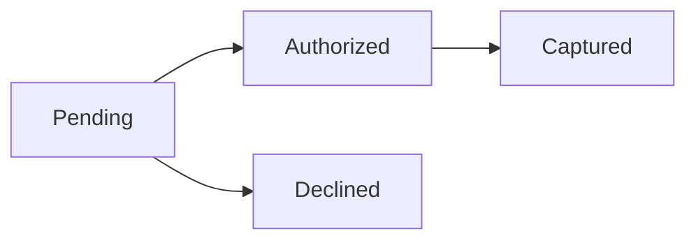

# 18장. Sum Types

곱 타입은 필요한 정보를 모두 함께 담았다.
하지만 결제는 승인 대기, 승인됨, 결제 완료, 거절됨 중 하나의 상태에 있다.
각 상태에서 필요한 데이터가 다르므로 모든 필드를 한 레코드에 선택값으로 넣으면 잘못된 조합이
늘어난다.

합 타입은 여러 경우 중 하나를 명시적으로 선택하는 구조다.
이번 장은 결제 상태를 예제로 사용하여 태그와 데이터의 결합, 경우 분석, 확장 시 변경 범위를
다룬다.
Python의 유니언 타입과 Scala의 태그가 있는 열거형을 비교한다.

---

## 1. 개념과 기본 구분

### 하나의 경우를 선택한다

합 타입 `A + B`의 값은 `A` 쪽 값이거나 `B` 쪽 값이다.
어느 쪽에서 온 값인지 구분할 수 있어야 한다.
이를 위해 명시적인 생성자나 태그를 사용할 수 있다.

```text
A + B
  Left(a)
  또는
  Right(b)
```

유한한 두 경우를 태그로 구별하면 가능한 값의 수는 두 집합 크기의 합이다.
양쪽의 내부 값이 같아도 태그가 다르면 다른 경우다.
예를 들어 성공 숫자 0과 오류 코드 0은 서로 다른 의미를 유지할 수 있다.

### 태그와 데이터

태그는 어떤 경우인지 나타낸다.
각 경우의 데이터는 그 상태에서 필요한 정보를 담는다.
결제 완료에는 영수증 번호가 필요하지만 대기 상태에는 아직 없을 수 있다.

### 합 타입과 일반 유니언

언어의 `A | B` 유니언이 항상 별도의 태그를 추가하는 것은 아니다.
두 타입의 값 영역이 겹치면 단순한 집합 합처럼 중복이 합쳐질 수 있다.
`A | A`는 두 개의 구별되는 `A` 경우를 만드는 것과 다르다.
명시적인 래퍼 생성자가 필요한 이유다.

### 곱 안의 선택값

여러 필드를 각각 선택값으로 만들면 각 필드의 있음·없음이 독립적으로 조합된다.
업무에서 허용하지 않는 조합도 표현할 수 있다.
합 타입은 상태별로 함께 필요한 필드를 묶어 그 조합을 줄일 수 있다.

---

## 2. 명령형 스타일과 함수형 스타일

### 선택 필드가 많은 결제

```text
PaymentRecord
  status: String
  requestId: Optional[String]
  authorizationId: Optional[String]
  receiptId: Optional[String]
  failureReason: Optional[String]
```

이 모델은 결제 완료인데 영수증이 없거나 대기 상태인데 실패 이유가 있는 값을 만들 수 있다.
각 함수가 상태 문자열과 필드 조합을 다시 검사해야 한다.
검사를 한 곳에서 빠뜨리면 오류가 뒤늦게 드러난다.

### 상태별 데이터 분리

```scala
enum Payment:
  case Pending(requestId: String)
  case Authorized(authorizationId: String, amount: BigInt)
  case Captured(receiptId: String, amount: BigInt)
  case Declined(reason: String)
```

`Captured`를 만들려면 영수증 번호와 금액을 함께 공급해야 한다.
`Pending`에는 영수증 필드가 없다.
존재하지 않는 정보에 접근하려면 먼저 어떤 경우인지 확인해야 한다.

### 데이터의 유효성과 구분

빈 문자열 영수증이나 음수 금액은 여전히 만들 수 있다.
합 타입은 상태별 데이터의 모양을 개선하지만 각 필드의 모든 유효성을 보장하지는 않는다.
스마트 생성자와 도메인 값 타입을 함께 사용하면 그 범위를 더 좁힐 수 있다.

### 전이 규칙은 별도다

상태를 표현할 수 있다고 모든 상태 전이가 허용되는 것은 아니다.
대기에서 결제 완료로 바로 이동해도 되는지 등의 규칙은 전이 함수가 정의한다.
상태의 종류와 상태 변화의 허용 관계를 구분한다.

---

## 3. 왜 이 개념을 사용하는가?

### 잘못된 조합 감소

상태에 필요한 데이터만 해당 생성자에 넣으면 무의미한 선택 필드 조합이 줄어든다.
호출자는 경우 분석 후 필요한 필드가 있다는 사실을 사용할 수 있다.
반복적인 `None` 검사와 상태 문자열 비교를 줄일 수 있다.

### 경우 분석의 명확성

각 상태의 처리 코드를 한 위치에서 나열하면 누락을 검토하기 쉽다.
닫힌 타입의 경우 언어와 검사 도구가 누락을 경고하는 데 도움을 줄 수 있다.
그러나 그 경고가 업무 규칙의 정확성까지 증명하는 것은 아니다.

### 오류도 데이터다

성공과 실패를 하나의 합 타입으로 표현할 수 있다.
실패가 반환 타입에 드러나므로 호출자가 그 경우를 고려하기 쉬워진다.
4부의 `Either`와 사용자 정의 결과 타입은 이 구조를 사용한다.

### 확장 시의 피드백

새 상태를 추가하면 그 상태를 처리해야 하는 위치를 찾을 수 있다.
모든 경우를 기본 분기로 덮어 두면 이런 피드백을 놓칠 수 있다.
의도적인 기본 처리와 실수로 누락된 처리를 구분해야 한다.

### 도메인 대화

상태 이름은 개발자와 업무 담당자가 규칙을 논의하는 공통 어휘가 된다.
서로 다른 의미의 상태를 같은 문자열이나 숫자로 뭉개지 않는 것이 중요하다.
타입 설계는 코드뿐 아니라 요구사항의 모호함을 드러내는 과정이다.

---

## 4. Scala에서의 표현

### Scala의 결제 합 타입

다음 프로그램은 상태별 표시, 영수증 추출, 승인 상태의 결제 완료 전이를 정의한다.
외부 결제 시스템에 실제 요청을 보내지는 않는다.
전이 함수는 주어진 상태와 확인된 영수증 데이터에서 새 상태를 계산하는 예제다.

<!-- executable:scala -->
```scala
object Chapter18:
  enum Payment:
    case Pending(requestId: String)
    case Authorized(authorizationId: String, amount: BigInt)
    case Captured(receiptId: String, amount: BigInt)
    case Declined(reason: String)

  enum CaptureError:
    case NotAuthorized
    case EmptyReceipt

  def label(payment: Payment): String =
    payment match
      case Payment.Pending(_) => "승인 대기"
      case Payment.Authorized(_, _) => "승인됨"
      case Payment.Captured(_, _) => "결제 완료"
      case Payment.Declined(reason) => s"거절: $reason"

  def receipt(payment: Payment): Option[String] =
    payment match
      case Payment.Captured(id, _) => Some(id)
      case _ => None

  def capture(payment: Payment, receiptId: String): Either[CaptureError, Payment] =
    if receiptId.isEmpty then Left(CaptureError.EmptyReceipt)
    else payment match
      case Payment.Authorized(_, amount) =>
        Right(Payment.Captured(receiptId, amount))
      case _ => Left(CaptureError.NotAuthorized)

  def check(): Unit =
    val states = List(
      Payment.Pending("REQ-1"),
      Payment.Authorized("AUTH-1", 10000),
      Payment.Captured("REC-1", 10000),
      Payment.Declined("한도 초과")
    )
    assert(states.map(label) == List("승인 대기", "승인됨", "결제 완료", "거절: 한도 초과"))
    assert(receipt(states.head).isEmpty)
    assert(receipt(states(2)).contains("REC-1"))
    val authorized = Payment.Authorized("AUTH-2", 5000)
    assert(capture(authorized, "REC-2") == Right(Payment.Captured("REC-2", 5000)))
    assert(capture(authorized, "") == Left(CaptureError.EmptyReceipt))
    assert(capture(Payment.Pending("REQ-2"), "REC-2") == Left(CaptureError.NotAuthorized))
    assert(label(authorized) == "승인됨")
```

### 의도적인 기본 분기

`receipt`는 결제 완료가 아닌 모든 경우에서 부재를 반환한다는 계약이다.
이 경우 기본 분기가 의도에 맞을 수 있다.
반면 상태별 안내 문구는 새 상태마다 별도 판단이 필요하므로 모든 경우를 명시했다.
같은 타입을 다루더라도 함수의 목적에 따라 기본 분기의 적절성이 다르다.

### 전이와 외부 사실

`capture`는 실제 결제가 성공했다는 외부 사실을 스스로 확인하지 않는다.
검증된 결과 데이터를 받은 뒤 내부 상태를 만드는 계산이다.
임의 영수증 문자열을 넘기는 것으로 실제 결제 성공을 증명할 수는 없다.
신뢰 경계의 의미를 타입 이름만으로 과장하지 않는다.

---

## 5. 상태 변경보다 값 변환

### 상태 변경 대신 새 경우 반환

불변 합 타입에서는 상태를 바꿀 때 새 생성자의 값을 만든다.
기존 승인 상태는 그대로 남고 새 결제 완료 상태가 반환된다.
어느 값을 현재 상태로 저장할지는 외부 계층의 책임이다.



이 그림은 예제의 상태 관계를 요약한다.
실제 시스템에는 승인 취소, 부분 취소, 환불, 만료 같은 추가 경우가 있을 수 있다.
현재 모델이 무엇을 포함하고 제외하는지 명시해야 한다.

### 공통 필드의 위치

모든 상태에 공통인 주문 번호는 합 타입 바깥의 레코드에 둘 수 있다.
상태별로 다른 데이터는 각 생성자 안에 둔다.
이는 곱과 합을 조합하는 ADT 설계의 기본 형태다.

### 분리된 시간의 값

과거 상태를 보관하면 전이 전후를 비교할 수 있다.
하지만 메모리에 이전 값이 있다는 사실만으로 감사 로그나 이벤트 저장이 구현되지는 않는다.
보관과 내구성은 별도의 효과다.

---

## 6. 함수 합성과 데이터 흐름

### 합 타입을 소비하는 함수

합 타입에서 하나의 결과를 만들려면 각 경우에 대한 계산을 제공해야 한다.
이를 경우 분석으로 읽을 수 있다.
패턴 매칭은 그 구조를 표현하는 언어 기능이다.

```text
Payment -> String
  Pending    -> 안내 문구
  Authorized -> 안내 문구
  Captured   -> 안내 문구
  Declined   -> 오류 문구
```

### 오류 결과의 연결

`capture`는 성공 상태 또는 오류를 반환한다.
뒤 단계가 성공 상태만 처리하려면 오류를 보존하면서 연결하는 연산이 필요하다.
앞서 배운 `flatMap`이 이런 결과 구조에 적용될 수 있다.

### 합의 분배

`A × (B + C)`는 `A`를 공통으로 가지며 `B` 또는 `C`를 선택하는 구조다.
이를 `(A × B) + (A × C)`로 바꾸면 공통 데이터가 각 경우에 들어간다.
두 표현은 정보 관점에서 대응할 수 있지만 코드 중복과 변경 범위는 다를 수 있다.

### 태그가 필요한 경우

두 상태가 모두 문자열 하나를 가진다고 `String | String`으로 표현하면 상태 구분이 사라진다.
`PendingId`와 `ReceiptId` 같은 래퍼나 별도 생성자가 필요하다.
원시 표현이 같아도 도메인 의미가 다르면 태그를 유지해야 한다.

---

## 7. 장점과 트레이드오프

### 장점과 트레이드오프

| 선택 | 장점 | 주의점 |
| --- | --- | --- |
| 상태별 생성자 | 필요한 필드 명확 | 타입과 경우 증가 |
| 닫힌 경우 집합 | 누락 검사 도움 | 외부 확장 방식 제한 |
| 명시적 태그 | 같은 내부 타입 구분 | 래핑과 직렬화 |
| 기본 분기 제거 | 새 경우 추가 피드백 | 모든 소비자의 수정 |
| 오류를 합 타입으로 | 예상 실패 가시화 | 연결 코드 필요 |

### 닫힘과 확장성

상태 종류가 통제되는 도메인에는 닫힌 합 타입이 적합할 수 있다.
외부 플러그인이 새로운 동작을 추가해야 하는 문제에는 열린 인터페이스가 더 자연스러울 수 있다.
데이터 경우의 확장과 연산의 확장 가운데 무엇이 자주 변하는지 살펴본다.

### 거대한 합 타입

수십 개의 무관한 경우를 한 타입에 모으면 모든 소비자가 넓은 범위를 알아야 한다.
하위 도메인이나 상태 단계별로 나눌 수 있는지 검토한다.
합 타입은 모든 이벤트를 한 파일에 모으는 규칙이 아니다.

### 직렬화 비용

태그와 상태별 필드를 외부 형식에 매핑해야 한다.
필드 이름과 태그 값의 버전 호환성을 고려한다.
내부 생성자 이름을 그대로 영구 저장 형식의 계약으로 삼을지는 신중히 결정한다.

---

## 8. 상태와 부수효과의 경계

### 외부 상태의 신뢰

외부 API가 `captured`라는 문자열을 반환해도 내부 모델로 바로 믿고 옮기면 안 될 수 있다.
응답 출처, 서명, 관련 주문과 금액의 일치 같은 검증이 필요할 수 있다.
타입 변환은 신뢰 검증의 위치를 드러낼 뿐 그 검증을 자동 수행하지 않는다.

### 동시 전이

두 요청이 같은 승인 상태를 읽고 각각 결제 완료를 계산할 수 있다.
불변 합 타입을 사용해도 저장 충돌이나 중복 효과는 별도로 처리해야 한다.
기대 버전 검사와 외부 멱등성 같은 경계 정책을 함께 설계한다.

### 스키마 진화

새 상태가 추가되면 이전 버전의 클라이언트가 그 태그를 모를 수 있다.
알 수 없는 상태를 거부할지 보존할지 정책이 필요하다.
내부에서 완전한 경우 분석을 한다는 사실과 외부 호환성은 다른 문제다.

### 비밀 데이터

각 상태에 꼭 필요한 데이터만 넣는다.
거절 이유에 내부 보안 정보를 그대로 담거나 영수증에 민감한 토큰을 노출하지 않도록 주의한다.
상태를 명확히 모델링하는 것과 외부 공개 범위를 결정하는 것은 별도 책임이다.

---

## 9. Python에서 적용하기

### Python의 데이터 클래스 유니언

서로 다른 데이터 클래스가 태그 역할을 한다.
`Payment`는 네 경우의 유니언으로 정의하고 패턴 매칭으로 처리한다.
실행 시 타입 주석이 임의의 잘못된 객체를 막아 주지는 않으므로 외부 입력 검증은 별도다.

<!-- executable:python -->
```python
from dataclasses import dataclass
from typing import assert_never


@dataclass(frozen=True)
class Pending:
    request_id: str


@dataclass(frozen=True)
class Authorized:
    authorization_id: str
    amount: int


@dataclass(frozen=True)
class Captured:
    receipt_id: str
    amount: int


@dataclass(frozen=True)
class Declined:
    reason: str


Payment = Pending | Authorized | Captured | Declined


@dataclass(frozen=True)
class CaptureError:
    code: str


CaptureResult = Captured | CaptureError


def label(payment: Payment) -> str:
    match payment:
        case Pending():
            return "승인 대기"
        case Authorized():
            return "승인됨"
        case Captured():
            return "결제 완료"
        case Declined(reason):
            return f"거절: {reason}"
    assert_never(payment)


def receipt(payment: Payment) -> str | None:
    match payment:
        case Captured(receipt_id, _):
            return receipt_id
        case _:
            return None


def capture(payment: Payment, receipt_id: str) -> CaptureResult:
    if not receipt_id:
        return CaptureError("empty_receipt")
    match payment:
        case Authorized(_, amount):
            return Captured(receipt_id, amount)
        case _:
            return CaptureError("not_authorized")


def test_states() -> None:
    states: tuple[Payment, ...] = (
        Pending("REQ-1"),
        Authorized("AUTH-1", 10_000),
        Captured("REC-1", 10_000),
        Declined("한도 초과"),
    )
    assert [label(state) for state in states] == ["승인 대기", "승인됨", "결제 완료", "거절: 한도 초과"]
    assert receipt(states[0]) is None
    assert receipt(states[2]) == "REC-1"
    authorized = Authorized("AUTH-2", 5000)
    assert capture(authorized, "REC-2") == Captured("REC-2", 5000)
    assert capture(authorized, "") == CaptureError("empty_receipt")
    assert capture(Pending("REQ-2"), "REC-2") == CaptureError("not_authorized")
    assert label(authorized) == "승인됨"


if __name__ == "__main__":
    test_states()
```

### `assert_never`의 역할

정적 검사 도구가 남은 경우를 발견하도록 돕는 위치를 만든다.
실행 시 예상하지 않은 값이 도달하면 실패하여 누락을 조용히 숨기지 않는다.
이 함수 하나만으로 전체 프로그램의 타입 안전성이 증명되는 것은 아니다.

---

## 10. Python의 표현 한계

### 런타임의 열린 세계

Python에서는 클래스와 객체를 동적으로 만들 수 있다.
유니언 주석이 런타임에 허용된 객체 집합을 완전히 봉인하지는 않는다.
정적 검사와 외부 입력 검증을 함께 사용해야 한다.

### 태그 없는 중복

`str | str`은 두 종류의 문자열 상태를 구분하지 못한다.
다른 데이터 클래스나 명시적 태그를 사용하여 의미를 보존한다.
정적 별칭만으로 충분한지 실제 런타임 구분이 필요한지 판단해야 한다.

### 완전성 검사

패턴 매칭을 썼다는 사실만으로 모든 경우가 자동으로 강제되는 것은 아니다.
정적 검사 도구의 설정과 지원을 확인하고 의도적인 마지막 분기를 둔다.
타입에 새 경우를 추가했을 때 테스트와 검사도 함께 갱신한다.

### 필드 제약

데이터 클래스 유니언은 음수 금액이나 빈 식별자를 자동 거부하지 않는다.
상태별 필드의 존재와 필드값의 유효성은 다른 조건이다.
뒤의 스마트 생성자가 이 간극을 줄인다.

---

## 11. 핵심 정리

### 핵심 결론

합 타입은 여러 경우 중 하나와 그 경우에 필요한 데이터를 함께 표현한다.
태그를 유지하면 같은 원시 값도 서로 다른 의미로 구별할 수 있다.
상태별 필드 조합을 줄이지만 모든 값의 유효성과 전이 규칙을 자동 보장하지 않는다.
닫힌 경우 분석과 외부 시스템의 호환성·신뢰는 별도 문제다.

### 연습 1: 문자열 두 종류

요청 번호와 영수증 번호를 `str | str`로 표현하면 어떤 정보가 사라지는가?

**해설.** 어느 종류의 번호인지 구분하는 태그가 없다.
별도 래퍼나 상태 생성자로 의미를 보존해야 한다.
동일한 저장 표현과 동일한 도메인 의미는 다르다.

### 연습 2: 선택 필드 조합

상태 문자열과 선택 영수증 필드를 가진 모델에서 만들 수 있는 잘못된 조합을 두 개 제시하라.

**해설.** 결제 완료인데 영수증이 없거나 대기 상태인데 영수증이 있는 경우다.
상태별 생성자에 필요한 필드를 묶으면 이런 구조적 오류를 줄일 수 있다.
빈 영수증 문자열 같은 값 오류는 추가 검증이 필요하다.

### 연습 3: 기본 분기

새 결제 상태를 추가할 때 `case _ => "기타"`가 어떤 문제를 숨길 수 있는가?

**해설.** 새 상태에 필요한 안내와 정책을 검토하지 않고 기본 처리로 흘릴 수 있다.
모든 경우를 의도적으로 구분해야 하는 함수에서는 명시적인 분기가 더 적절하다.
함수의 목적에 따라 기본 처리의 적절성을 판단한다.

### 연습 4: 상태와 효과

`Captured` 값을 만들었다는 사실이 실제 결제 성공을 증명하는가?

**해설.** 아니다. 그 값을 만드는 경계가 외부 사실을 어떻게 검증했는지에 달려 있다.
타입 이름만으로 외부 효과의 성공을 만들어 낼 수 없다.
검증된 응답과 내부 상태 전이를 연결하는 신뢰 경계를 정의해야 한다.

### 다음 장과 참고 자료

다음 장은 곱과 합을 조합하고 재귀를 추가하여 도메인 언어를 만드는 ADT를 다룬다.
상태뿐 아니라 규칙과 프로그램 구조도 데이터로 표현할 수 있다.

[Scala 공식 문서: Algebraic Data Types](https://docs.scala-lang.org/scala3/book/types-adts-gadts.html)
[Scala 공식 문서: Union Types](https://docs.scala-lang.org/scala3/book/types-union.html)
[Python 공식 문서: typing.assert_never](https://docs.python.org/3.14/library/typing.html#typing.assert_never)
