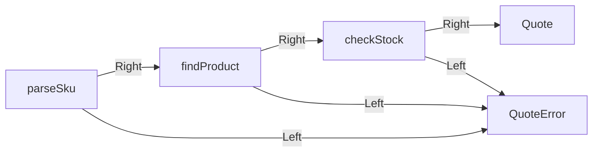

# 25장. Either


`Option`은 값이 없다는 사실을 표현하지만 이유를 담지 않았다.
고객이 없거나 재고가 부족하거나 입력 형식이 잘못되었다는 차이가 중요하면 오류 데이터를 보존해야
한다.
`Either[E, A]`는 오류 `E` 또는 성공값 `A`를 담는 두 경우의 합 타입으로 사용할 수 있다.

이번 장은 상품 코드 파싱, 상품 조회, 재고 검사, 견적 계산을 연결한다.
각 단계가 실패할 수 있지만 첫 실패 이후에는 그 결과에 의존하는 계산을 실행하지 않는다.
이 순차적인 실패 전파와 다음 장들의 오류 누적을 명확히 구분한다.

---

## 1. 개념과 기본 구분

### 왼쪽과 오른쪽

Scala의 `Either[E, A]`는 `Left(e)` 또는 `Right(a)`다.
오류 처리에서는 왼쪽을 실패, 오른쪽을 성공으로 사용하는 관례가 일반적이다.
하지만 자료형 자체는 두 종류의 값 중 하나를 담는 구조이며 오류에만 한정된 것은 아니다.

```text
Either[E, A]
  Left(error: E)
  Right(value: A)
```

Scala의 주요 변환 연산은 오른쪽 성공값을 대상으로 동작한다.
`map`은 성공값을 바꾸고 `flatMap`은 성공값에서 다음 `Either` 계산을 연결한다.
왼쪽 오류는 별도 변환을 하지 않는 한 보존된다.

### 오류 타입의 설계

오류를 문자열 하나로 표현할 수도 있다.
하지만 프로그램이 종류별로 처리해야 한다면 생성자와 필드를 가진 오류 ADT가 더 명확할 수 있다.
사용자 메시지와 내부 오류 분류를 분리할 수 있다.

### 첫 실패 중단

순차적인 `flatMap` 연결은 앞 단계가 실패하면 다음 성공 의존 계산을 실행하지 않는다.
이것은 오류를 하나만 표현해야 한다는 자료형 자체의 절대적 한계라기보다 해당 연결 연산의 의미다.
여러 오류를 모으는 조합은 다른 정책과 타입을 사용할 수 있다.

### 숨은 예외

`Either`의 `map`에 전달한 함수가 예외를 던지면 그 예외가 자동으로 `Left`가 되는 것은 아니다.
예상 실패를 명시적으로 반환하도록 구현해야 한다.
예외를 포착하는 `Try`와 중요한 차이다.

---

## 2. 명령형 스타일과 함수형 스타일

### 중첩된 성공 검사

```text
코드를 파싱한다
  성공이면 상품을 찾는다
    성공이면 재고를 검사한다
      성공이면 금액을 계산한다
```

직접 분기하면 같은 오류 전달 코드가 여러 번 나타난다.
중첩이 깊어지면 정상 흐름을 읽기 어려워진다.
성공값을 다음 계산에 전달하는 공통 구조를 연산으로 분리할 수 있다.

### 성공 경로 연결

```scala
for
  sku <- parseSku(rawSku)
  product <- findProduct(sku)
  available <- checkStock(product, quantity)
yield Quote(available.sku, quantity, available.unitPrice * quantity)
```

이 구문은 각 단계의 `flatMap`과 마지막 `map`으로 읽을 수 있다.
실패가 발생하면 해당 오류가 결과에 남는다.
예외를 포착하거나 데이터베이스를 자동 롤백하는 문법은 아니다.

### 오류의 보존

조회 실패를 단순한 빈 견적으로 바꾸면 상품이 없다는 사실을 잃는다.
`Left(UnknownProduct(sku))`를 유지하면 상위 계층이 적절한 응답을 선택할 수 있다.
오류를 너무 일찍 사용자 문자열로 바꾸지 않는 것이 좋을 수 있다.

### 모든 단계가 독립적이지 않다

상품을 찾지 못하면 해당 상품의 재고를 검사할 수 없다.
이런 데이터 의존성이 순차 연결의 이유다.
독립적인 여러 입력 필드의 검증은 다른 조합이 더 적절할 수 있다.

---

## 3. 왜 이 개념을 사용하는가?

### 명시적인 예상 실패

호출자는 어떤 오류가 발생할 수 있는지 타입과 생성자에서 볼 수 있다.
상태 코드나 문자열 관례보다 구조적인 정보를 제공한다.
오류의 필드에 필요한 진단 맥락을 담을 수 있다.

### 단계별 테스트

상품 코드 형식, 상품 부재, 재고 부족을 각각 테스트할 수 있다.
연결 테스트는 첫 실패 이후의 단계가 실행되지 않는지 확인한다.
정상 결과뿐 아니라 전파되는 오류의 정확성도 계약이다.

### 오류 번역

도메인 오류를 HTTP 응답이나 사용자 안내로 변환하는 경계를 둘 수 있다.
도메인 계산이 웹 프레임워크의 응답 객체를 직접 만들 필요가 줄어든다.
같은 계산을 배치 작업이나 테스트에서도 사용할 수 있다.

### 재사용 가능한 연결

성공 경로의 작은 함수를 조합할 수 있다.
실패를 처리하는 코드는 필요한 경계에 모을 수 있다.
다만 지나치게 넓은 공통 오류 타입은 각 함수의 실제 실패 범위를 흐릴 수 있다.

### 명시적인 복구

특정 오류만 다른 계산으로 복구하고 나머지는 전달할 수 있다.
복구 정책을 이름 있는 함수로 두면 기본값의 의미가 더 잘 드러난다.
실패를 전부 성공으로 바꾸는 것은 오류 처리의 완성이 아니다.

---

## 4. Scala에서의 표현

### Scala의 견적 결과

상품 목록은 불변 스냅샷으로 주어진다.
재고 검사는 이 스냅샷에 대한 판단이며 실제 예약을 수행하지 않는다.
이 구분은 타입이 표현하는 오류와 외부 동시성의 범위를 명확히 한다.

<!-- executable:scala -->
```scala
object Chapter25:
  enum QuoteError:
    case InvalidSku
    case InvalidQuantity
    case UnknownProduct(sku: String)
    case OutOfStock(sku: String, requested: Int, available: Int)

  final case class Product(sku: String, unitPrice: BigInt, stock: Int)
  final case class Quote(sku: String, quantity: Int, amount: BigInt)

  val products = Map(
    "A-1" -> Product("A-1", 1000, 5),
    "B-1" -> Product("B-1", 500, 0)
  )

  def parseSku(raw: String): Either[QuoteError, String] =
    if raw.matches("[A-Z0-9][A-Z0-9-]{0,31}") then Right(raw)
    else Left(QuoteError.InvalidSku)

  def findProduct(sku: String): Either[QuoteError, Product] =
    products.get(sku).toRight(QuoteError.UnknownProduct(sku))

  def checkStock(product: Product, quantity: Int): Either[QuoteError, Product] =
    if quantity <= 0 then Left(QuoteError.InvalidQuantity)
    else if product.stock < quantity then
      Left(QuoteError.OutOfStock(product.sku, quantity, product.stock))
    else Right(product)

  def quote(rawSku: String, quantity: Int): Either[QuoteError, Quote] =
    for
      sku <- parseSku(rawSku)
      product <- findProduct(sku)
      available <- checkStock(product, quantity)
    yield Quote(available.sku, quantity, available.unitPrice * quantity)

  def describe(error: QuoteError): String =
    error match
      case QuoteError.InvalidSku => "상품 코드 형식 오류"
      case QuoteError.InvalidQuantity => "수량 오류"
      case QuoteError.UnknownProduct(_) => "상품 없음"
      case QuoteError.OutOfStock(_, _, _) => "재고 부족"

  def check(): Unit =
    assert(quote("A-1", 2) == Right(Quote("A-1", 2, 2000)))
    assert(quote("a", 2) == Left(QuoteError.InvalidSku))
    assert(quote("MISSING", 2) == Left(QuoteError.UnknownProduct("MISSING")))
    assert(quote("A-1", 0) == Left(QuoteError.InvalidQuantity))
    assert(quote("A-1", 6) == Left(QuoteError.OutOfStock("A-1", 6, 5)))
    assert(quote("B-1", 1).left.map(describe) == Left("재고 부족"))

    var calls = 0
    val failed: Either[QuoteError, Int] = Left(QuoteError.InvalidQuantity)
    val chained = failed.flatMap { value =>
      calls += 1
      Right(value + 1)
    }
    assert(chained == failed)
    assert(calls == 0)
    assert(quote("A-1", 2).fold(describe, q => s"${q.amount} KRW") == "2000 KRW")
```

### 입력 오류의 우선순위

상품 조회를 먼저 하고 수량을 나중에 검사하므로 두 문제가 동시에 있으면 상품 오류가 먼저 나올 수
있다.
이는 코드의 순서가 정한 계약이다.
독립 필드 오류를 모두 보여 주려면 파싱·검증 단계를 따로 구성해야 한다.

### 도메인 오류와 메시지

`describe`는 구조적인 오류를 간단한 안내로 바꾼다.
외부 응답에는 더 적은 정보를 보여 주고 내부 진단에는 원래 필드를 유지할 수 있다.
오류 타입과 사용자 문구를 분리하면 번역과 정책 변경에 유리하다.

---

## 5. 상태 변경보다 값 변환

### 두 경로의 값 흐름

성공값은 다음 계산으로 이동한다.
오류값은 성공 계산을 건너뛰고 결과 경계까지 전달된다.
이 구조를 그림으로 읽으면 중첩 분기를 줄이는 이유가 명확해진다.



오류 경로가 하나로 그려져도 오류 데이터는 구체적인 종류를 유지한다.
그 정보가 복구와 응답에 사용된다.
한 문자열이나 `None`으로 바꾸면 다시 복원할 수 없는 정보가 있을 수 있다.

### 성공값의 불변성

`Right`에 가변 객체가 들어가면 내부 객체는 바뀔 수 있다.
오류 값도 마찬가지다.
결과 컨테이너의 구조와 내부 값의 불변성은 별도로 설계한다.

### 오류 변환

오류만 변환하여 계층의 추상화 수준을 맞출 수 있다.
단, 원인을 모두 버리면 운영 진단이 어려워질 수 있다.
공개 계약과 내부 원인 보존의 균형을 정한다.

---

## 6. 함수 합성과 데이터 흐름

### `map`과 `flatMap`

성공값을 일반 값으로 변환하면 `map`을 사용한다.
다음 함수가 다시 실패할 수 있어 `Either`를 반환하면 `flatMap`으로 연결한다.
이 구분은 앞서 목록과 선택값에서 배운 컨텍스트 연결의 원리와 같다.

```text
map:     (A -> B) -> Either[E, B]
flatMap: (A -> Either[E, B]) -> Either[E, B]
```

### 오류 타입의 통일

여러 단계의 오류 타입이 다르면 공통 도메인 오류로 올리거나 합 타입으로 묶어야 할 수 있다.
무조건 `Throwable`이나 문자열로 넓히면 정밀한 실패 정보가 사라질 수 있다.
실제 호출자가 처리할 구분을 기준으로 오류 모델을 정한다.

### 첫 오류와 모든 오류

현재 연결은 성공 결과에 의존하는 다음 계산을 이어 간다.
앞 결과가 없으면 다음 계산의 입력도 없을 수 있다.
모든 오류를 누적하려면 어떤 검사가 독립적으로 실행 가능한지 먼저 구분해야 한다.

### 예외 어댑터

예외를 던지는 라이브러리는 좁은 경계에서 포착하여 `Left`로 바꿀 수 있다.
그 변환이 없으면 `Either` 파이프라인 안에서도 예외가 바깥으로 전파될 수 있다.
반환 타입이 모든 실패를 자동 수집하는 장치라고 생각하지 않는다.

---

## 7. 장점과 트레이드오프

### 장점과 트레이드오프

| 설계 | 이점 | 주의점 |
| --- | --- | --- |
| 구체적 오류 ADT | 분류와 처리 명확 | 오류 모델 확장 |
| 순차 `flatMap` | 의존 흐름 표현 | 첫 오류만 반환 |
| 오류 번역 | 계층 분리 | 원인 정보 손실 |
| 명시적 복구 | 정책 가시화 | 잘못된 성공 대체 |
| 좁은 실패 타입 | 계약 정밀화 | 여러 오류의 결합 코드 |

### 과도하게 넓은 오류 타입

모든 시스템 오류를 한 거대한 enum에 넣으면 작은 함수도 전체 실패 목록을 알아야 한다.
하위 도메인별 오류와 경계 변환을 고려한다.
공통화는 실제 처리 정책이 같은 경우에 유용하다.

### 도구의 지원

Scala의 표준 `Either` 연산을 사용하면 반복 분기를 줄일 수 있다.
Python에서는 명시적인 결과 클래스와 함수가 더 자연스러울 수 있다.
언어의 관용구와 정적 검사 지원을 함께 고려한다.

### 성능

결과 래핑과 패턴 매칭의 비용이 있을 수 있다.
오류를 예외로 던지는 방식과의 비용 비교는 실패 빈도와 런타임에 따라 달라진다.
의미와 진단 정보를 유지한 뒤 실제 병목을 측정한다.

---

## 8. 상태와 부수효과의 경계

### 외부 실패의 종류

상품이 없다는 도메인 실패와 저장소가 응답하지 않는 기술 실패는 다르다.
둘을 같은 오류로 외부에 보여 줄 수 있어도 내부 처리는 달라야 할 수 있다.
재시도, 경보, 사용자 안내의 요구를 기준으로 분류한다.

### 부분 효과

앞 단계가 저장을 수행하고 뒤 단계가 실패하면 첫 저장이 남을 수 있다.
`Left`가 반환되었다고 전체 흐름이 자동 롤백되는 것은 아니다.
트랜잭션과 보상은 효과 계층의 별도 계약이다.

### 오류와 취소

취소를 일반 `Left`로 바꿔 계속 처리하면 호출자의 중단 의도를 무시할 수 있다.
비동기 실행기의 취소 계약과 도메인 실패를 구분한다.
자원 정리와 오류 전파는 함께 설계해야 한다.

### 재고 검사의 시점

이 예제의 재고 판단은 불변 스냅샷에 대한 계산이다.
다른 요청이 재고를 바꾸면 실제 예약 시 다시 원자적인 확인이 필요하다.
`Right(Quote)`는 예약 완료나 결제 성공을 의미하지 않는다.

---

## 9. Python에서 적용하기

### Python의 결과 타입과 연결 함수

성공과 실패를 서로 다른 데이터 클래스로 표현한다.
제네릭 매개변수는 성공값과 오류값의 타입 관계를 설명한다.
전체 제네릭 설계는 5부에서 다루며 여기서는 결과 연결에 필요한 범위만 사용한다.

<!-- executable:python -->
```python
from collections.abc import Callable
from dataclasses import dataclass
from typing import Generic, TypeVar

A = TypeVar("A")
B = TypeVar("B")
E = TypeVar("E")


@dataclass(frozen=True)
class Success(Generic[A]):
    value: A


@dataclass(frozen=True)
class Failure(Generic[E]):
    error: E


@dataclass(frozen=True)
class QuoteError:
    code: str
    sku: str = ""
    requested: int = 0
    available: int = 0


@dataclass(frozen=True)
class Product:
    sku: str
    unit_price: int
    stock: int


@dataclass(frozen=True)
class Quote:
    sku: str
    quantity: int
    amount: int


def bind(result: Success[A] | Failure[E], function: Callable[[A], Success[B] | Failure[E]]) -> Success[B] | Failure[E]:
    if isinstance(result, Failure):
        return result
    return function(result.value)


PRODUCTS = {"A-1": Product("A-1", 1000, 5), "B-1": Product("B-1", 500, 0)}


def find_product(sku: str) -> Success[Product] | Failure[QuoteError]:
    product = PRODUCTS.get(sku)
    if product is None:
        return Failure(QuoteError("unknown_product", sku))
    return Success(product)


def quote_product(product: Product, quantity: int) -> Success[Quote] | Failure[QuoteError]:
    if quantity <= 0:
        return Failure(QuoteError("invalid_quantity"))
    if product.stock < quantity:
        return Failure(QuoteError("out_of_stock", product.sku, quantity, product.stock))
    return Success(Quote(product.sku, quantity, product.unit_price * quantity))


def quote(sku: str, quantity: int) -> Success[Quote] | Failure[QuoteError]:
    return bind(find_product(sku), lambda product: quote_product(product, quantity))


def test_results() -> None:
    assert quote("A-1", 2) == Success(Quote("A-1", 2, 2000))
    assert quote("MISSING", 2) == Failure(QuoteError("unknown_product", "MISSING"))
    assert quote("A-1", 0) == Failure(QuoteError("invalid_quantity"))
    assert quote("A-1", 6) == Failure(QuoteError("out_of_stock", "A-1", 6, 5))


def test_short_circuit() -> None:
    calls: list[int] = []

    def next_step(value: int) -> Success[int] | Failure[str]:
        calls.append(value)
        return Success(value + 1)

    failed: Success[int] | Failure[str] = Failure("stop")
    assert bind(failed, next_step) == Failure("stop")
    assert calls == []
    assert bind(Success(3), next_step) == Success(4)
    assert calls == [3]


if __name__ == "__main__":
    test_results()
    test_short_circuit()
```

### Python 예제의 경계

Python 프로그램은 이미 정규화된 상품 코드를 받는 조회·재고 연결에 집중한다.
원시 코드 문자열의 형식 검사는 앞 장의 스마트 생성자와 같은 경계에 추가할 수 있다.
예제 간 구현 범위를 같다고 과장하지 않고 연결 연산의 계약을 비교한다.

---

## 10. Python의 표현 한계

### 표준 `Either`의 부재

Python 표준 라이브러리에 Scala와 같은 이름과 메서드의 `Either`가 기본 제공되는 것은 아니다.
작은 결과 타입을 직접 만들거나 프로젝트의 일관된 라이브러리를 선택할 수 있다.
기능 이름보다 오류 전파와 타입 계약을 확인한다.

### 오류 레코드의 약점

예제의 `QuoteError`는 단순화를 위해 코드와 기본 필드를 함께 사용했다.
잘못된 필드 조합을 더 줄이려면 오류 종류별 데이터 클래스로 나눌 수 있다.
오류 자체도 3부의 데이터 모델링 원칙을 적용해야 한다.

### 예외 포착의 부재

`bind`는 콜백의 예외를 자동으로 실패 값으로 바꾸지 않는다.
이것은 Scala의 `Either.flatMap`과 비교할 중요한 계약이다.
기존 예외 API는 명시적인 어댑터에서 처리한다.

### 정적 검사와 런타임

제네릭 주석은 실제 반환 객체가 올바른 결과 타입인지 자동 검사하지 않는다.
동적 플러그인이나 외부 입력에서는 추가 검증이 필요하다.
공개 API에서 어떤 오류 타입을 허용하는지 문서화한다.

---

## 11. 핵심 정리

### 핵심 결론

`Either`는 성공값과 구체적인 오류값을 함께 표현한다.
`map`은 성공값을 바꾸고 `flatMap`은 실패 가능한 다음 계산을 연결한다.
순차 연결은 첫 실패 이후의 성공 의존 계산을 생략한다.
숨은 예외, 부분 효과, 취소는 별도 경계에서 처리해야 한다.

### 연습 1: `map`의 중첩

성공값에서 다시 `Either`를 반환하는 함수를 `map`하면 어떤 구조가 생기는가?

**해설.** 성공 안에 또 다른 `Either`가 들어갈 수 있다.
한 층의 실패 흐름으로 연결하려면 `flatMap`을 사용한다.
중첩을 보존해야 하는 특별한 의미가 있는지도 먼저 확인한다.

### 연습 2: 오류 우선순위

상품 코드도 잘못되고 수량도 잘못되었다.
첫 오류 중단 방식에서 어떤 오류가 나오는지 무엇이 결정하는가?

**해설.** 검사 순서가 결정한다.
모든 독립 오류가 필요하면 순차 연결과 다른 검증 조합을 사용한다.
오류의 순서도 사용자에게 보이는 계약이다.

### 연습 3: 예외 콜백

`Right(3).map(f)`에서 `f`가 예외를 던지면 자동으로 `Left`가 되는가?

**해설.** 일반적인 `Either` 변환은 예외를 자동 포착하지 않는다.
예상 실패를 결과값으로 반환하거나 좁은 예외 어댑터를 사용해야 한다.
다음 장의 `Try`와 역할을 구분한다.

### 연습 4: 예약 완료

재고 검사를 통과한 `Right(Quote)`를 예약 완료로 표시했다.
무엇이 잘못되었는가?

**해설.** 스냅샷에 대한 계산과 실제 재고 예약은 다르다.
동시성 제어와 저장 성공을 확인하는 외부 경계가 필요하다.
성공값의 이름과 실제 보장을 일치시켜야 한다.

### 다음 장과 참고 자료

다음 장은 예외를 발생시키는 계산을 성공·실패 값으로 포착하는 `Try`를 다룬다.
`Either`와 비슷한 연결 모양 뒤에 있는 다른 실행 계약을 확인한다.

[Scala 공식 문서: Functional Error Handling](https://docs.scala-lang.org/scala3/book/fp-functional-error-handling.html)
[Scala API: Either](https://www.scala-lang.org/api/current/scala/util/Either.html)
[Python 공식 문서: typing](https://docs.python.org/3.14/library/typing.html)
