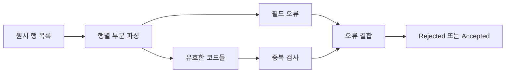

# 28장. Error Accumulation


앞 장은 한 품목의 독립 필드 오류를 모았다.
실제 입력은 여러 품목과 중첩된 객체를 포함하며, 행 사이의 중복 같은 관계 규칙도 가진다.
오류 누적은 단순히 문자열 목록을 이어 붙이는 것보다 넓은 설계 문제다.

이번 장에서는 주문 품목 일괄 입력을 검증한다.
오류 위치를 안정적으로 표시하고, 유효한 일부 필드에만 의존하는 관계 검사를 수행하며, 보고서
길이를 제한한다.
일부 행이 유효하더라도 전체 실패를 정상적인 부분 성공으로 오해하지 않도록 결과 타입을 구분한다.

---

## 1. 개념과 기본 구분

### 오류의 위치

중첩 입력에서는 “수량 오류”만으로 어느 값을 고쳐야 하는지 알기 어렵다.
행 번호와 필드 경로를 함께 보존해야 한다.
기계가 처리할 경로와 사용자에게 보여 줄 문구를 분리할 수 있다.

```text
items[0].sku
items[0].quantity
items[2].quantity
items[2].sku
```

배열 인덱스는 현재 입력의 위치를 나타낸다.
사용자가 행을 재정렬하면 안정적인 식별자와는 다를 수 있다.
편집 화면에서는 임시 행 ID를 함께 사용하는 설계도 검토할 수 있다.

### 검증 의존성 그래프

상품 코드 형식 검사는 수량 검사와 독립적이다.
중복 상품 검사에는 유효한 상품 코드가 필요하지만 유효한 수량까지 필요하지는 않을 수 있다.
각 관계 검사가 정확히 어떤 선행 정보에 의존하는지 구분해야 한다.

### 전체 성공과 부분 진단

검증 중 일부 유효한 필드를 보관하는 것은 진단을 위한 내부 상태일 수 있다.
그것을 정상적인 도메인 입력으로 외부에 넘겨서는 안 될 수 있다.
전체 입력이 유효할 때만 `Accepted`를 만드는 계약을 정한다.

### 보고서 제한

대량 입력의 모든 오류를 그대로 응답하면 메모리와 응답 크기가 커질 수 있다.
표시할 오류 수와 실제 발견한 오류 수를 구분할 수 있다.
일부만 보여 준다면 잘렸다는 사실을 명시해야 한다.

---

## 2. 명령형 스타일과 함수형 스타일

### 각 행에서 즉시 반환

```text
첫 번째 잘못된 행을 발견하면 중단
  -> 뒤의 행 오류를 알 수 없음

각 행의 오류만 모음
  -> 행 사이의 중복을 놓칠 수 있음
```

두 방식 모두 특정 요구에는 적절할 수 있다.
하지만 전체 입력의 수정 보고서가 필요하면 필드 검사와 관계 검사를 함께 설계해야 한다.
검사 범위가 어디까지인지 명확히 한다.

### 검증 단계 분리

```text
입력 크기 검사
  -> 각 행의 필드 검사
  -> 유효한 코드에 대한 중복 검사
  -> 오류 보고서 또는 완전한 품목 목록
```

크기 제한을 먼저 검사하면 무제한 입력에 대한 비용을 줄일 수 있다.
필드 검사 결과는 관계 검사가 필요한 부분만 사용할 수 있다.
모든 필드가 유효해야만 모든 관계 검사를 실행하는 것은 지나치게 보수적일 수 있다.

### 무의미한 추가 오류 피하기

상품 코드 형식이 잘못되었다면 그 문자열을 정상 코드처럼 중복 검사에 넣지 않는다.
반면 코드가 유효하고 수량만 잘못되었다면 코드 중복은 여전히 판단할 수 있다.
오류 누적은 검사의 실제 의존성을 반영해야 한다.

### 부분 입력의 처리 정책

전체 실패 시 유효한 행만 저장할지 아무것도 저장하지 않을지 별도 정책을 정한다.
이 장은 아무 오류도 없을 때만 전체 입력을 승인한다.
부분 저장은 다른 결과 모델과 트랜잭션 정책이 필요한 별도 기능이다.

---

## 3. 왜 이 개념을 사용하는가?

### 수정 가능한 보고서

오류 경로와 코드가 있으면 화면의 정확한 위치에 안내를 붙일 수 있다.
중복 오류는 어떤 행이 기준인지 설명할 수 있다.
예제는 같은 코드의 첫 번째 행을 기준으로 뒤의 중복 행에 오류를 표시한다.

### 안정적인 순서

먼저 행 순서의 필드 오류를 모으고 그다음 관계 오류를 추가한다.
이 순서를 계약으로 정하면 테스트와 사용자 경험이 안정적이다.
병렬 검증을 도입해도 완료 순서 때문에 오류 순서가 흔들리지 않도록 할 수 있다.

### 제한의 투명성

최대 표시 개수를 넘으면 실제 오류 개수와 잘림 여부를 함께 반환한다.
사용자는 보이는 오류가 전부가 아니라는 사실을 알 수 있다.
조용히 나머지를 버리면 반복 수정의 이유를 이해하기 어렵다.

### 검증과 저장의 분리

검증 함수는 값을 반환하고 저장을 수행하지 않는다.
전체 성공을 확인한 경계가 저장을 결정한다.
이 구조는 검증 중 부분 저장이 발생하는 실수를 줄인다.

### 테스트의 확장

단일 필드 경계뿐 아니라 여러 행의 오류 순서와 중복, 보고서 제한을 검사한다.
같은 입력이 같은 보고서를 만드는지도 확인한다.
유효한 행이 섞인 실패 입력에서 부분 성공을 노출하지 않는지 검토한다.

---

## 4. Scala에서의 표현

### Scala의 배치 검증

입력은 최대 100행이며 오류 보고서는 최대 3개를 표시하도록 예제 정책을 정했다.
내부적으로는 제한된 입력의 전체 오류 수를 계산한다.
부분적으로 읽은 행은 진단용이며 오류가 하나라도 있으면 승인된 품목 목록을 반환하지 않는다.

<!-- executable:scala -->
```scala
object Chapter28:
  final case class RawItem(sku: String, quantity: Int, unitPrice: BigInt)
  final case class Item(sku: String, quantity: Int, unitPrice: BigInt)
  final case class Issue(path: String, code: String)
  final case class ParsedRow(
    index: Int,
    sku: Option[String],
    quantity: Option[Int],
    unitPrice: Option[BigInt],
    issues: Vector[Issue]
  )
  final case class ErrorReport(shown: Vector[Issue], total: Int):
    require(shown.nonEmpty && total >= shown.size)
    def truncated: Boolean = total > shown.size

  enum BatchResult:
    case Accepted(items: Vector[Item])
    case Rejected(report: ErrorReport)

  def parseRow(raw: RawItem, index: Int): ParsedRow =
    val sku = Option.when(raw.sku.matches("[A-Z0-9][A-Z0-9-]{0,31}"))(raw.sku)
    val quantity = Option.when(raw.quantity > 0)(raw.quantity)
    val price = Option.when(raw.unitPrice >= 0)(raw.unitPrice)
    val errors = Vector(
      Option.when(sku.isEmpty)(Issue(s"items[$index].sku", "invalid_format")),
      Option.when(quantity.isEmpty)(Issue(s"items[$index].quantity", "not_positive")),
      Option.when(price.isEmpty)(Issue(s"items[$index].unitPrice", "negative"))
    ).flatten
    ParsedRow(index, sku, quantity, price, errors)

  def validate(rows: Vector[RawItem], maxShown: Int = 3): BatchResult =
    require(maxShown > 0)
    if rows.isEmpty || rows.size > 100 then
      BatchResult.Rejected(ErrorReport(Vector(Issue("items", "invalid_count")), 1))
    else
      val parsed = rows.zipWithIndex.map((row, index) => parseRow(row, index))
      var seen = Set.empty[String]
      val duplicates = Vector.newBuilder[Issue]
      for row <- parsed do
        row.sku.foreach { sku =>
          if seen.contains(sku) then duplicates += Issue(s"items[${row.index}].sku", "duplicate")
          else seen = seen + sku
        }
      val errors = parsed.flatMap(_.issues) ++ duplicates.result()
      if errors.nonEmpty then
        BatchResult.Rejected(ErrorReport(errors.take(maxShown), errors.size))
      else
        val items = parsed.flatMap { row =>
          for
            sku <- row.sku
            quantity <- row.quantity
            price <- row.unitPrice
          yield Item(sku, quantity, price)
        }
        assert(items.size == rows.size)
        BatchResult.Accepted(items)

  def check(): Unit =
    val valid = Vector(RawItem("A", 2, 1000), RawItem("B", 1, 500))
    assert(validate(valid) == BatchResult.Accepted(Vector(Item("A", 2, 1000), Item("B", 1, 500))))
    val bad = Vector(RawItem("bad", 0, -1), RawItem("A", 2, 1), RawItem("A", 0, 1))
    validate(bad) match
      case BatchResult.Rejected(report) =>
        assert(report.total == 5)
        assert(report.shown.size == 3)
        assert(report.truncated)
        assert(report.shown.map(_.path) == Vector("items[0].sku", "items[0].quantity", "items[0].unitPrice"))
      case _ => assert(false, "invalid batch accepted")
    validate(bad, 10) match
      case BatchResult.Rejected(report) =>
        assert(report.shown.last == Issue("items[2].sku", "duplicate"))
        assert(!report.truncated)
      case _ => assert(false, "invalid batch accepted")
    assert(validate(Vector.empty).isInstanceOf[BatchResult.Rejected])
    assert(validate(Vector.fill(101)(RawItem("A", 1, 1))).isInstanceOf[BatchResult.Rejected])
```

### 중복 검사의 선행 정보

세 번째 행은 수량이 잘못되어도 상품 코드 `A`는 유효하다.
따라서 중복 코드 오류를 함께 보고할 수 있다.
이것은 가짜 수량으로 총액을 계산하는 것과 다르다.
관계 검사가 실제로 필요한 필드만 요구하도록 설계했다.

### 내부 단언의 역할

오류가 없을 때 모든 필드가 존재한다는 내부 불변식을 단언했다.
외부 입력 검증을 `assert`에만 맡긴 것은 아니다.
검증 구현의 모순을 빠르게 발견하기 위한 장치와 사용자 입력 오류 처리를 구분한다.

---

## 5. 상태 변경보다 값 변환

### 진단용 부분 상태

`ParsedRow`는 완성된 도메인 품목이 아니다.
유효한 일부 필드와 오류를 함께 보관하는 내부 진단 구조다.
이 구조가 저장이나 결제 계산에 직접 전달되지 않도록 경계를 유지한다.



부분 상태를 쓰는 것 자체가 잘못된 모델링은 아니다.
그 상태가 어느 단계에서 허용되는지 타입과 모듈 경계로 구분하는 것이 중요하다.
정상 도메인 값과 입력 처리 중간값의 요구사항은 다르다.

### 정보의 보존과 제한

보고서에 일부 오류만 넣더라도 총개수와 잘림 여부를 남긴다.
원본 전체 입력을 보관할지는 별도의 개인정보·운영 정책이다.
진단의 편리함 때문에 모든 데이터를 무기한 저장하지 않는다.

### 승인 조건

오류가 하나도 없을 때만 전체 품목 목록을 승인한다.
유효한 일부 행이 있었다는 사실은 이 정책에서 부분 성공을 의미하지 않는다.
결과 타입이 승인과 거절을 명확히 구분한다.

---

## 6. 함수 합성과 데이터 흐름

### 수집과 순회

각 행의 검증 결과를 모으는 구조는 `traverse`나 `sequence`로 일반화할 수 있다.
컬렉션 안의 검증 결과를 검증 컨텍스트 안의 컬렉션으로 바꾸는 관점이다.
Applicative 장에서 이 타입 변환을 자세히 다룬다.

```text
List[Check[A]] -> Check[List[A]]
```

### 관계 검사는 별도 단계

행별 검증만으로는 중복과 전체 합계 같은 관계를 알 수 없다.
필요한 검증된 필드를 모아 관계 검사를 수행한다.
모든 규칙을 한 개의 `map` 안에 넣는 것보다 의존성이 선명해진다.

### 오류 결합의 안정성

필드 오류와 관계 오류를 정해진 순서로 연결한다.
병렬 처리 결과를 완료 순서대로 붙이면 보고서가 실행마다 달라질 수 있다.
원래 인덱스나 안정적인 규칙 순서를 기준으로 재정렬할 수 있다.

### 오류 제한의 위치

처음부터 일정 개수에서 검사를 중단하면 실제 전체 오류 수를 알 수 없다.
모두 검사한 뒤 표시만 제한하면 전체 수를 알 수 있지만 계산 비용은 지불한다.
예제는 입력 크기를 먼저 제한하고 두 번째 정책을 사용한다.

---

## 7. 장점과 트레이드오프

### 장점과 트레이드오프

| 정책 | 장점 | 비용 또는 위험 |
| --- | --- | --- |
| 경로 있는 오류 | 수정 위치 명확 | 경로 스키마 관리 |
| 관계 검사 분리 | 의존성 정확 | 중간 진단 구조 |
| 안정적인 순서 | 예측 가능한 보고서 | 정렬·수집 정책 |
| 표시 개수 제한 | 응답 크기 제어 | 잘림 정보 필요 |
| 전체 승인 방식 | 부분 저장 혼동 감소 | 일부 유효 행의 재제출 |

### 입력 크기의 제한

오류 개수만 제한해도 입력 자체가 무제한이면 계산 비용이 커질 수 있다.
행 수, 문자열 길이, 중첩 깊이, 숫자 크기 같은 제한을 함께 검토한다.
예제의 100행 제한은 하나의 작은 정책이며 모든 자원 제한을 완성한 것은 아니다.

### 자료구조의 비용

지역 빌더로 오류를 모은 뒤 불변 결과로 바꾸면 반복 복사를 줄일 수 있다.
집합을 이용한 중복 검사는 해시 연산의 비용과 입력 크기에 영향을 받는다.
복잡도 설명은 사용하는 자료구조의 가정을 포함해야 한다.

### 과도한 진단

동일한 원인에 대해 비슷한 오류를 여러 개 보여 주면 수정이 어려워질 수 있다.
원인과 파생 오류를 구분하고 필요한 우선순위를 정한다.
많은 오류를 모으는 것보다 정확하고 행동 가능한 보고서가 중요하다.

---

## 8. 상태와 부수효과의 경계

### 검증 중 저장하지 않는다

오류를 모으는 동안 일부 행을 저장하면 뒤에서 전체 실패를 반환해도 부분 데이터가 남을 수 있다.
이 장의 검증 함수는 외부 효과 없이 결과만 계산한다.
저장은 전체 승인 이후 별도의 경계에서 수행한다.

### 외부 유일성

입력 목록 안의 중복 검사는 저장소 전체의 유일성을 보장하지 않는다.
다른 요청과의 경쟁은 데이터베이스 제약이나 원자적 연산으로 처리해야 한다.
지역 입력 검증과 전역 무결성을 구분한다.

### 개인정보와 오류 경로

오류 경로만으로 충분한 경우 원본 값을 응답에 넣지 않는다.
민감한 필드의 내용이 로그와 모니터링에 확산되지 않도록 주의한다.
진단 데이터도 정보 공개 정책의 대상이다.

### 취소와 제한

큰 배치 검증은 취소나 실행 시간 제한이 필요할 수 있다.
중간에 중단했으면 모든 오류를 검사했다고 표시해서는 안 된다.
완료 여부, 표시 제한, 검사를 중단한 제한을 서로 구분한다.

---

## 9. Python에서 적용하기

### Python의 경로와 제한 있는 보고서

아래 구현은 오류를 지역 리스트에 모은 뒤 불변 튜플로 반환한다.
코드가 유효하면 수량 오류와 독립적으로 중복을 검사한다.
전체 실패에서는 승인된 품목 목록을 반환하지 않는다.

<!-- executable:python -->
```python
from dataclasses import dataclass
import re


@dataclass(frozen=True)
class RawItem:
    sku: str
    quantity: int
    unit_price: int


@dataclass(frozen=True)
class Item:
    sku: str
    quantity: int
    unit_price: int


@dataclass(frozen=True)
class Issue:
    path: str
    code: str


@dataclass(frozen=True)
class Accepted:
    items: tuple[Item, ...]


@dataclass(frozen=True)
class Rejected:
    shown: tuple[Issue, ...]
    total: int

    def __post_init__(self) -> None:
        if not self.shown or self.total < len(self.shown):
            raise ValueError("invalid error report")

    @property
    def truncated(self) -> bool:
        return self.total > len(self.shown)


def validate(rows: tuple[RawItem, ...], max_shown: int = 3) -> Accepted | Rejected:
    if max_shown <= 0:
        raise ValueError("max_shown must be positive")
    if not 1 <= len(rows) <= 100:
        return Rejected((Issue("items", "invalid_count"),), 1)
    errors: list[Issue] = []
    duplicates: list[Issue] = []
    items: list[Item] = []
    seen: set[str] = set()
    for index, row in enumerate(rows):
        sku_ok = re.fullmatch(r"[A-Z0-9][A-Z0-9-]{0,31}", row.sku) is not None
        quantity_ok = type(row.quantity) is int and row.quantity > 0
        price_ok = type(row.unit_price) is int and row.unit_price >= 0
        if not sku_ok:
            errors.append(Issue(f"items[{index}].sku", "invalid_format"))
        if not quantity_ok:
            errors.append(Issue(f"items[{index}].quantity", "not_positive"))
        if not price_ok:
            errors.append(Issue(f"items[{index}].unit_price", "negative_or_not_integer"))
        if sku_ok:
            if row.sku in seen:
                duplicates.append(Issue(f"items[{index}].sku", "duplicate"))
            else:
                seen.add(row.sku)
        if sku_ok and quantity_ok and price_ok:
            items.append(Item(row.sku, row.quantity, row.unit_price))
    errors.extend(duplicates)
    if errors:
        return Rejected(tuple(errors[:max_shown]), len(errors))
    assert len(items) == len(rows)
    return Accepted(tuple(items))


def test_batch() -> None:
    valid = (RawItem("A", 2, 1000), RawItem("B", 1, 500))
    assert validate(valid) == Accepted((Item("A", 2, 1000), Item("B", 1, 500)))
    bad = (RawItem("bad", 0, -1), RawItem("A", 2, 1), RawItem("A", 0, 1))
    report = validate(bad)
    assert isinstance(report, Rejected)
    assert report.total == 5
    assert len(report.shown) == 3
    assert report.truncated
    assert [issue.path for issue in report.shown] == ["items[0].sku", "items[0].quantity", "items[0].unit_price"]
    full = validate(bad, 10)
    assert isinstance(full, Rejected)
    assert full.shown[-1] == Issue("items[2].sku", "duplicate")
    assert not full.truncated
    assert isinstance(validate(()), Rejected)
    assert isinstance(validate((RawItem("A", 1, 1),) * 101), Rejected)
    assert validate(bad) == validate(bad)


if __name__ == "__main__":
    test_batch()
```

### 외부 JSON을 읽는 경계

이 예제는 이미 필드가 있는 `RawItem`을 입력으로 받는다.
JSON의 필드 누락과 잘못된 객체 구조를 처리하는 파서는 별도로 필요하다.
행 내용의 검증과 외부 형식의 파싱을 같은 완료 범위로 주장하지 않는다.

---

## 10. Python의 표현 한계

### 경로의 형식

문자열 경로는 간단하지만 필드 이름에 특수문자가 있으면 모호해질 수 있다.
필드·인덱스 세그먼트의 튜플로 내부 경로를 보관한 뒤 표시할 때 문자열로 바꿀 수 있다.
외부 표준 경로 형식을 사용한다면 실제 이스케이프 규칙을 확인해야 한다.

### 부분값의 정적 구분

진단용 부분값과 승인된 도메인 값의 타입을 나누는 것이 도움이 된다.
Python의 실행기는 그 사용 경계를 자동으로 완전히 강제하지 않는다.
모듈 인터페이스와 테스트, 정적 검사로 잘못된 전달을 줄인다.

### 실행 제한

오류 목록을 잘랐다고 전체 검증 비용이 제한된 것은 아니다.
입력 크기와 각 검사의 비용도 함께 제한해야 한다.
외부 조회가 들어오면 시간 제한과 동시성 정책이 추가로 필요하다.

### 안정적인 순서

집합이나 병렬 완료 순서를 그대로 보고서 순서로 사용하면 재현성이 떨어질 수 있다.
입력 위치와 규칙 순서를 명시적으로 보존한다.
테스트는 오류의 집합뿐 아니라 필요한 경우 순서도 확인한다.

---

## 11. 핵심 정리

### 핵심 결론

대량 오류 누적은 위치, 의존성, 순서, 제한, 전체 승인 정책을 함께 설계하는 문제다.
유효한 일부 필드는 진단에 사용할 수 있지만 정상 도메인 값과 구분해야 한다.
보고서를 제한하면 잘림과 실제 검사 범위를 투명하게 표시한다.
지역 검증과 저장소의 전역 무결성은 별도 책임이다.

### 연습 1: 부분 의존성

상품 코드는 유효하고 수량은 잘못된 행에서 중복 코드 검사를 해도 되는가?

**해설.** 중복 검사가 유효한 코드만 필요로 한다면 가능하다.
총액 계산처럼 수량의 성공값이 필요한 검사와 다르다.
각 검사의 정확한 선행 정보를 구분해야 한다.

### 연습 2: 표시 제한

오류 20개 중 5개만 보여 주면서 총개수나 잘림 여부를 표시하지 않았다.
어떤 문제가 생기는가?

**해설.** 사용자는 보이는 오류가 전부라고 생각할 수 있다.
수정 후 새 오류가 나타나는 이유를 이해하기 어렵다.
실제 오류 수와 표시 제한을 명시적으로 전달한다.

### 연습 3: 부분 저장

검증 중 유효한 행을 바로 저장한 뒤 전체 실패를 반환했다.
어떤 계약이 모호해졌는가?

**해설.** 실패했지만 일부 데이터가 저장된 상태가 된다.
전체 승인 방식과 부분 성공 방식을 구분하고 저장 정책을 별도로 설계해야 한다.
오류 누적 자료형이 트랜잭션을 제공하지는 않는다.

### 연습 4: 지역 중복

입력 목록에 중복이 없으니 데이터베이스 유일성 검사도 필요 없다는 주장에 반론하라.

**해설.** 다른 입력과 동시 요청이 같은 키를 사용할 수 있다.
전역 유일성은 저장소의 원자적 제약으로 보장해야 한다.
지역 입력 검사와 전역 상태의 무결성은 다른 범위다.

### 다음 부와 참고 자료

4부에서 컨텍스트 안의 값을 연결하고 오류를 결합하는 여러 구조를 만났다.
5부는 그 반복되는 구조를 제네릭 함수, 타입 클래스, Functor, Applicative, Monad로 정리한다.

[Cats 공식 문서: Validated](https://typelevel.org/cats/datatypes/validated.html)
[Cats 공식 문서: Traverse](https://typelevel.org/cats/typeclasses/traverse.html)
[Python 공식 문서: dataclasses](https://docs.python.org/3.14/library/dataclasses.html)
