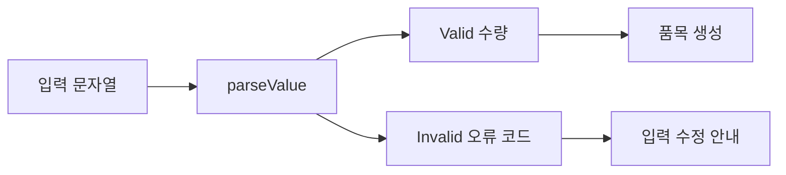

# 23장. Exceptions vs Values

3부에서는 유효한 값과 상태를 만드는 경계를 설계했다.
그 경계에서 실패하면 무엇을 반환하고 어떻게 다음 계산을 중단해야 할까?
4부는 실패를 정상적인 설계 대상으로 다루며, 먼저 예외와 오류 값의 역할을 비교한다.

이 장의 목표는 예외를 전부 없애는 것이 아니다.
예상 가능한 입력 실패, 외부 작업 실패, 프로그램의 버그, 취소를 같은 종류의 오류로 취급하지 않는
것이 중요하다.
수량 문자열을 읽는 작은 파서로 실패 전달 방식의 차이를 살펴본다.

---

## 1. 개념과 기본 구분

### 두 가지 반환 경로

예외를 던지는 함수는 정상 반환과 예외 전파라는 서로 다른 제어 흐름을 가진다.
오류 값을 반환하는 함수는 성공과 실패를 하나의 결과 타입 안에 표현한다.
두 방식 모두 오류를 알릴 수 있지만 호출자가 읽고 조합하는 방식이 다르다.

```text
예외 방식
  입력 -> 정상값
       -> 예외 전파

값 방식
  입력 -> 성공값 또는 오류값
```

오류를 값으로 표현했다고 모든 예외 가능성이 없어지는 것은 아니다.
구현 버그, 자원 고갈, 잘못된 라이브러리 사용은 여전히 예외를 일으킬 수 있다.
반환 타입이 표현하는 예상 실패의 범위를 명시해야 한다.

### 예상 실패와 버그

사용자가 수량에 문자를 입력하는 것은 예상 가능한 실패다.
내부 코드가 존재하지 않는 필드를 읽는 것은 버그일 수 있다.
둘을 모두 “잘못된 입력”으로 바꾸면 운영 진단이 어려워진다.

### 실패와 취소

취소는 작업을 더 이상 진행하지 말라는 제어 신호다.
일반적인 입력 오류처럼 삼키면 종료와 자원 정리 계약이 깨질 수 있다.
비동기 장에서 구체적으로 다루되 여기서부터 같은 오류 바구니에 무조건 넣지 않는다.

### 전체성과의 관계

예상 실패를 결과 타입에 포함하면 정의역을 더 넓게 명시할 수 있다.
하지만 모든 입력에서 종료하고 자원을 충분히 사용할 수 있다는 증명이 자동으로 생기지는 않는다.
실패 표현과 전체성은 관련되지만 동일한 성질이 아니다.

---

## 2. 명령형 스타일과 함수형 스타일

### 넓은 예외 포착

```python
def unsafe_boundary(raw: str) -> int:
    try:
        value = int(raw)
        return value + undefined_adjustment
    except Exception:
        return 0
```

이 조각은 의도적인 반례다.
숫자 파싱 실패뿐 아니라 내부 변수 오류까지 0으로 바꾼다.
0이 정상적인 값이라면 실패 사실도 사라진다.

### 좁은 예외 경계

```python
def parse_integer(raw: str) -> int | None:
    try:
        return int(raw)
    except ValueError:
        return None
```

이 함수는 특정 파싱 실패만 부재로 바꾼다.
그러나 왜 실패했는지 구분할 수 없다는 한계가 있다.
입력 오류의 종류가 중요하면 더 구체적인 오류 값을 반환한다.

### 명시적인 결과

```text
QuantityResult
  Valid(quantity)
  Invalid(errorCode)
```

호출자는 성공과 실패를 명시적으로 분기한다.
오류를 무시하려면 그 선택도 코드에 드러나게 만들 수 있다.
하지만 호출자가 결과를 버릴 가능성까지 일반적인 타입만으로 모두 차단하는 것은 아니다.

---

## 3. 왜 이 개념을 사용하는가?

### 호출 계약의 가시성

반환 타입에 오류가 있으면 호출자가 예상 실패를 발견하기 쉽다.
예외 목록이 문서에만 있는 API보다 조합할 때 정보가 더 잘 보일 수 있다.
다만 언어와 라이브러리의 관용구도 고려해야 한다.

### 제어 흐름의 지역화

오류 값은 일반적인 `match`, `map`, `flatMap`으로 전달할 수 있다.
중간 함수를 건너뛰는 예외 전파와 달리 반환 경로를 명시적으로 읽을 수 있다.
긴 오류 처리 코드가 생기면 전용 조합 연산을 사용하는 이유가 된다.

### 오류의 구조

안정적인 오류 코드, 필드 위치, 재시도 가능성 같은 정보를 데이터로 표현할 수 있다.
사용자 메시지와 내부 진단을 분리하기도 쉽다.
모든 정보를 문자열 한 줄에 넣으면 이후 처리가 어려워질 수 있다.

### 예외가 적절한 경우

프로그래밍 계약 위반이나 예상하지 못한 내부 실패는 예외로 빠르게 드러내는 편이 나을 수 있다.
기존 라이브러리의 예외 API를 경계에서 적절히 변환할 수도 있다.
예외를 쓰지 않는다는 원칙 때문에 버그를 정상 오류로 숨기지 않는다.

### 일관성

같은 종류의 실패를 어떤 함수는 `None`, 어떤 함수는 0, 다른 함수는 예외로 전달하면 사용하기
어렵다.
도메인 경계별로 실패 표현의 원칙을 정한다.
모든 계층에 하나의 방식만 강요하기보다 변환 위치를 명확히 한다.

---

## 4. Scala에서의 표현

### Scala의 두 파서

예제 입력은 길이 1~7의 ASCII 숫자 문자열이며 수량 범위는 1~1,000,000이다.
이 제한은 큰 문자열의 무제한 숫자 변환을 피하고 계약을 명확히 하기 위한 것이다.
앞의 공백이나 부호는 허용하지 않는 정책이다.

<!-- executable:scala -->
```scala
object Chapter23:
  enum ParseError:
    case Empty
    case TooLong
    case InvalidCharacters
    case OutOfRange

  enum QuantityResult:
    case Valid(value: Int)
    case Invalid(error: ParseError)

  final class QuantityException(val error: ParseError)
    extends IllegalArgumentException(error.toString)

  def parseValue(raw: String): QuantityResult =
    if raw.isEmpty then QuantityResult.Invalid(ParseError.Empty)
    else if raw.length > 7 then QuantityResult.Invalid(ParseError.TooLong)
    else if !raw.forall(c => c >= '0' && c <= '9') then
      QuantityResult.Invalid(ParseError.InvalidCharacters)
    else
      val value = raw.toInt
      if value >= 1 && value <= 1000000 then QuantityResult.Valid(value)
      else QuantityResult.Invalid(ParseError.OutOfRange)

  def parseThrowing(raw: String): Int =
    parseValue(raw) match
      case QuantityResult.Valid(value) => value
      case QuantityResult.Invalid(error) => throw new QuantityException(error)

  def describe(result: QuantityResult): String =
    result match
      case QuantityResult.Valid(value) => s"수량: $value"
      case QuantityResult.Invalid(error) => s"입력 오류: $error"

  def check(): Unit =
    assert(parseValue("3") == QuantityResult.Valid(3))
    assert(parseValue("0000001") == QuantityResult.Valid(1))
    assert(parseValue("") == QuantityResult.Invalid(ParseError.Empty))
    assert(parseValue("12345678") == QuantityResult.Invalid(ParseError.TooLong))
    assert(parseValue("-1") == QuantityResult.Invalid(ParseError.InvalidCharacters))
    assert(parseValue(" 1") == QuantityResult.Invalid(ParseError.InvalidCharacters))
    assert(parseValue("0") == QuantityResult.Invalid(ParseError.OutOfRange))
    assert(parseValue("1000001") == QuantityResult.Invalid(ParseError.OutOfRange))
    assert(parseThrowing("3") == 3)
    var caught = false
    try parseThrowing("x")
    catch
      case error: QuantityException =>
        caught = error.error == ParseError.InvalidCharacters
    assert(caught)
    assert(describe(parseValue("3")) == "수량: 3")
```

### 변환의 한 방향

이 예제는 오류 값을 예외로 바꾸는 어댑터를 만들었다.
반대로 기존 예외 API를 좁게 포착하여 오류 값으로 바꿀 수도 있다.
어느 계층이 어떤 실패 표현을 요구하는지에 따라 경계를 선택한다.

### 버그의 전파

`parseValue` 내부의 예상하지 못한 버그까지 `QuantityResult.Invalid`로 자동 변환하지 않는다.
명시적으로 모델링한 입력 실패만 결과 타입에 포함한다.
이 구분이 있어야 운영자가 사용자 오류와 코드 오류를 다르게 대응할 수 있다.

### 입력의 신뢰 범위

Scala 예제는 `String` 타입의 정상 입력을 전제로 한다.
널이나 외부 바이트 디코딩 실패를 포함한 모든 경계를 처리한 것은 아니다.
외부 입력 어댑터의 책임을 별도로 문서화해야 한다.

---

## 5. 상태 변경보다 값 변환

### 실패도 다음 단계의 입력이다

오류 값을 반환하면 실패를 로그, 응답, 재시도 판단 같은 다음 단계로 전달할 수 있다.
성공값과 같은 타입의 가짜 기본값으로 바꾸지 않아 정보가 유지된다.
오류 데이터 자체도 불변 값으로 다룰 수 있다.



성공과 실패 경로가 분명하지만 모든 분기를 같은 계층에서 처리할 필요는 없다.
상위 경계까지 오류를 전달한 뒤 사용자 메시지로 바꿀 수 있다.
중간 계층은 원래 오류의 정보를 보존하는 역할만 할 수도 있다.

### 오류의 누적과 상태

여러 입력의 실패를 목록으로 모을 수 있다.
하지만 첫 실패 이후에 다음 계산을 해도 안전한지는 데이터 의존성에 달려 있다.
오류를 값으로 만들었다는 사실만으로 모든 실패를 독립적으로 누적할 수 있는 것은 아니다.

### 기본값의 명시

정말 기본값으로 복구하려면 그 정책을 별도 함수나 호출 위치에 드러낸다.
파서 내부에서 조용히 기본값을 넣으면 원본 실패를 추적하기 어렵다.
복구는 오류 은폐가 아니라 명시적인 업무 선택이어야 한다.

---

## 6. 함수 합성과 데이터 흐름

### 오류 값을 연결하는 이유

매 단계마다 성공과 실패를 직접 분기하면 반복 코드가 생긴다.
성공일 때만 다음 함수를 실행하고 실패는 그대로 전달하는 연산을 정의할 수 있다.
다음 장들의 `Option`, `Either`, `Try`가 각각 다른 실패 모델을 제공한다.

```text
파싱
  -> 범위가 있는 수량
  -> 품목 생성
  -> 견적 계산
```

### 예외 경계의 배치

기존 라이브러리가 예외를 던지면 그 호출을 감싸는 작은 어댑터를 만든다.
예상한 예외 종류만 도메인 오류로 변환한다.
호출 전후의 다른 코드까지 큰 `try`에 넣으면 관련 없는 버그를 함께 잡을 수 있다.

### 오류 번역

하위 계층의 연결 실패를 상위 계층의 “가격 조회 불가”로 바꿀 수 있다.
원인 정보를 내부 진단용으로 보존하되 사용자에게 공개할 정보는 분리한다.
모든 계층이 같은 기술 오류 타입을 직접 알아야 하는 것은 아니다.

### 복구 함수

오류 종류에 따라 기본값, 재시도, 중단을 선택할 수 있다.
재시도 가능한 오류라는 분류도 실제 외부 작업의 멱등성과 상태를 함께 고려해야 한다.
오류 타입의 이름만으로 안전한 재시도가 보장되지는 않는다.

---

## 7. 장점과 트레이드오프

### 장점과 트레이드오프

| 방식 | 장점 | 주의점 |
| --- | --- | --- |
| 예외 전파 | 정상 경로가 간결 | 숨은 제어 흐름 |
| 명시적 오류 값 | 계약과 조합이 보임 | 반환 구조의 복잡성 |
| 구체적 오류 타입 | 분류와 복구 가능 | 오류 모델 유지 비용 |
| 기본값 복구 | 일부 서비스 지속 | 실패 사실 손실 가능 |
| 경계 어댑터 | 기존 API와 연결 | 포착 범위의 정확성 |

### 값 방식의 비용

성공과 실패를 감싸는 객체나 분기 코드가 생길 수 있다.
언어 구현과 사용 패턴에 따라 비용이 달라진다.
성능만을 이유로 오류 정보를 없애기보다 실제 병목을 측정한다.

### 예외 방식의 비용

예외는 스택 정보와 전파 비용을 가질 수 있다.
빈번한 정상 분기를 예외로 표현하는 것이 적절한지는 환경과 요구에 따라 판단한다.
모든 예외가 느리다거나 모든 오류 값이 빠르다는 일반화는 피한다.

### 읽기 쉬운 정책

어떤 실패를 값으로 표현하고 어떤 실패를 전파하는지 팀의 경계 원칙을 정한다.
호출자가 예상해야 하는 실패가 무엇인지 문서에 명시한다.
방식의 순수함보다 일관된 계약이 중요하다.

---

## 8. 상태와 부수효과의 경계

### 외부 효과의 부분 성공

파일 저장이나 결제 호출은 예외가 났다고 아무 일도 일어나지 않았다는 뜻이 아닐 수 있다.
원격 시스템은 작업을 완료했지만 응답이 유실되었을 수 있다.
오류 표현 방식과 실제 외부 상태를 구분해야 한다.

### 취소와 종료 신호

모든 예외를 포착하여 오류 값으로 바꾸면 취소나 종료 신호를 삼킬 수 있다.
언어와 라이브러리의 예외 계층을 확인하고 필요한 신호는 전파한다.
자원 정리는 실패와 취소 모두에서 실행되도록 별도 경계를 둔다.

### 자원 정리

오류 값을 반환해도 열린 파일이나 잠금이 자동으로 정리되는 것은 아니다.
컨텍스트 관리자, `finally`, 자원 추상화 등으로 수명을 관리한다.
오류 모델과 자원 모델을 함께 설계해야 한다.

### 운영 관측

사용자 입력 실패는 빈번할 수 있으므로 모두 심각한 장애 로그로 남기는 것이 적절하지 않을 수 있다.
버그와 외부 장애는 다른 관측 수준이 필요하다.
오류 분류는 응답뿐 아니라 운영 대응에도 영향을 준다.

---

## 9. Python에서 적용하기

### Python의 오류 값과 예외 어댑터

다음 코드는 Scala 예제와 같은 문자열 계약을 구현한다.
예외 어댑터는 명시적인 도메인 예외만 사용한다.
정상 파서는 예상한 입력 실패를 불변 데이터로 반환한다.

<!-- executable:python -->
```python
from dataclasses import dataclass
from enum import Enum


class ParseError(Enum):
    EMPTY = "empty"
    TOO_LONG = "too_long"
    INVALID_CHARACTERS = "invalid_characters"
    OUT_OF_RANGE = "out_of_range"


@dataclass(frozen=True)
class Valid:
    value: int


@dataclass(frozen=True)
class Invalid:
    error: ParseError


QuantityResult = Valid | Invalid


class QuantityException(ValueError):
    def __init__(self, error: ParseError) -> None:
        self.error = error
        super().__init__(error.value)


def parse_value(raw: str) -> QuantityResult:
    if not raw:
        return Invalid(ParseError.EMPTY)
    if len(raw) > 7:
        return Invalid(ParseError.TOO_LONG)
    if not all("0" <= char <= "9" for char in raw):
        return Invalid(ParseError.INVALID_CHARACTERS)
    value = int(raw)
    if not 1 <= value <= 1_000_000:
        return Invalid(ParseError.OUT_OF_RANGE)
    return Valid(value)


def parse_throwing(raw: str) -> int:
    result = parse_value(raw)
    match result:
        case Valid(value):
            return value
        case Invalid(error):
            raise QuantityException(error)
    raise AssertionError("unknown parser result")


def test_parsing() -> None:
    assert parse_value("3") == Valid(3)
    assert parse_value("0000001") == Valid(1)
    assert parse_value("") == Invalid(ParseError.EMPTY)
    assert parse_value("12345678") == Invalid(ParseError.TOO_LONG)
    assert parse_value("-1") == Invalid(ParseError.INVALID_CHARACTERS)
    assert parse_value(" 1") == Invalid(ParseError.INVALID_CHARACTERS)
    assert parse_value("１２") == Invalid(ParseError.INVALID_CHARACTERS)
    assert parse_value("0") == Invalid(ParseError.OUT_OF_RANGE)
    assert parse_value("1000001") == Invalid(ParseError.OUT_OF_RANGE)
    assert parse_throwing("3") == 3


def test_exception_adapter() -> None:
    try:
        parse_throwing("x")
    except QuantityException as error:
        assert error.error is ParseError.INVALID_CHARACTERS
    else:
        raise AssertionError("expected domain exception")


def test_expected_failures_are_values() -> None:
    results = [parse_value(raw) for raw in ("1", "x", "0", "2")]
    successes = [result.value for result in results if isinstance(result, Valid)]
    failures = [result.error for result in results if isinstance(result, Invalid)]
    assert successes == [1, 2]
    assert failures == [ParseError.INVALID_CHARACTERS, ParseError.OUT_OF_RANGE]


if __name__ == "__main__":
    test_parsing()
    test_exception_adapter()
    test_expected_failures_are_values()
```

### 문자 정책의 일치

`str.isdigit()`은 ASCII 숫자 외의 문자도 참으로 판단할 수 있다.
예제는 명시적으로 ASCII 범위를 검사하여 언어 간 계약을 맞췄다.
허용 문자 정책은 입력 형식의 일부이며 편의 함수 이름만으로 결정하지 않는다.

---

## 10. Python의 표현 한계

### 검사된 예외 목록의 부재

일반적인 Python 타입 주석은 함수가 던질 수 있는 모든 예외를 선언하고 강제하지 않는다.
예상 실패를 반환 타입에 포함하면 일부 계약을 더 명시적으로 표현할 수 있다.
그렇다고 숨은 예외가 자동으로 사라지는 것은 아니다.

### `Exception`과 `BaseException`

종료와 취소에 관련된 일부 신호는 일반적인 사용자 오류와 다른 예외 계층에 있다.
무조건 `BaseException`을 잡는 코드는 특별한 이유와 전파 정책이 필요하다.
실제 라이브러리의 취소 계약을 확인해야 한다.

### 런타임 유니언 검사

결과 타입 주석만으로 호출자가 모든 경우를 처리하도록 실행기가 강제하지는 않는다.
패턴 매칭과 정적 검사, 테스트를 함께 사용한다.
실패 결과를 정상값처럼 접근하는 오류를 줄이는 구조가 필요하다.

### 오류 메시지의 안정성

내장 예외의 문자열을 파싱하여 업무 분기를 정하는 설계는 취약할 수 있다.
예외 종류나 명시적인 오류 코드를 사용한다.
사용자용 메시지와 기계가 처리할 분류를 분리하는 편이 안정적이다.

---

## 11. 핵심 정리

### 핵심 결론

예외와 오류 값은 실패를 전달하는 서로 다른 제어 구조다.
예상 입력 실패, 외부 장애, 버그, 취소를 구분해야 한다.
오류를 값으로 만든다고 자원 정리와 외부 부분 성공이 자동 해결되지는 않는다.
경계별로 포착 범위와 오류 번역 정책을 명확히 한다.

### 연습 1: 기본값 0

모든 예외를 포착하여 수량 0을 반환하는 파서의 문제를 설명하라.

**해설.** 입력 오류와 내부 버그를 구분하지 못하고 실패 사실을 잃는다.
0이 정상값이면 호출자는 성공과 실패를 구별할 수 없다.
구체적인 오류 값이나 좁은 예외 경계를 사용한다.

### 연습 2: 포착 범위

외부 파싱 호출과 그 뒤의 복잡한 계산을 하나의 큰 `try`로 감쌌다.
어떤 위험이 있는가?

**해설.** 뒤 계산의 버그까지 파싱 실패로 오인할 수 있다.
예상한 예외가 발생하는 작은 호출 경계만 감싸는 편이 낫다.
오류의 원인과 변환 위치를 가깝게 둔다.

### 연습 3: 원격 작업 실패

결제 호출이 시간 초과로 실패했다.
아무 결제도 발생하지 않았다고 가정할 수 있는가?

**해설.** 원격 작업은 성공했지만 응답만 유실되었을 수 있다.
외부 상태 확인과 멱등성 정책을 검토해야 한다.
예외 발생과 외부 효과의 부재는 같은 사실이 아니다.

### 연습 4: 취소

취소 신호를 일반 오류 값으로 바꿔 계속 실행하면 어떤 계약이 깨질 수 있는가?

**해설.** 호출자가 요청한 중단과 자원 정리가 지연되거나 무시될 수 있다.
취소를 전파하거나 명시적으로 처리하는 정책이 필요하다.
모든 실패를 같은 복구 경로로 보내지 않는다.

### 다음 장과 참고 자료

다음 장은 실패 이유가 필요하지 않은 값의 부재를 `Option`으로 표현한다.
오류 정보가 필요한 상황과 단순한 부재를 구분하는 것이 출발점이다.

[Scala 공식 문서: Functional Error Handling](https://docs.scala-lang.org/scala3/book/fp-functional-error-handling.html)
[Python 공식 문서: Built-in Exceptions](https://docs.python.org/3.14/library/exceptions.html)
