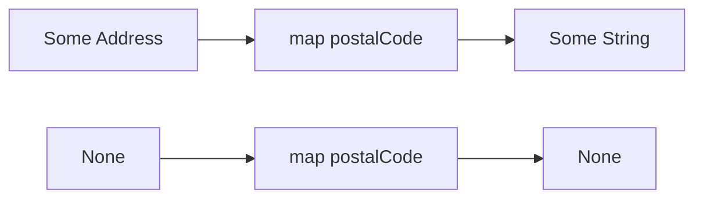

# 24장. Option

모든 실패에 복잡한 오류 모델이 필요한 것은 아니다.
조회한 값이 없을 수 있고, 빈 목록에는 첫 원소가 없을 수 있다.
`Option`은 값이 있음과 없음을 명시적으로 구분하는 합 타입이다.

이 장에서는 고객의 기본 배송지와 배송비 면제 한도를 조회한다.
0이나 빈 문자열 같은 정상값을 부재와 혼동하지 않는 것이 중요하다.
Scala의 `Some`과 `None`, Python의 `T | None`을 비교하면서 중첩된 부재와 정보 손실도 살펴본다.

---

## 1. 개념과 기본 구분

### 있음 또는 없음

`Option[A]`는 `Some(a)` 또는 `None`이다.
값이 있는 경우에는 `A`를 포함하고 없는 경우에는 추가 값이 없다.
곱과 합의 관점에서는 대략 `1 + A`로 읽을 수 있다.

```text
Option[A]
  Some(value: A)
  None
```

`None`은 숫자 0이나 빈 문자열이 아니다.
그 값들이 도메인에서 유효하다면 `Some(0)`, `Some("")`로 보존할 수 있다.
부재를 기존 값 하나로 대신하면 충돌이 생길 수 있다.

### 부재의 이유

`Option`은 왜 값이 없는지 기본적으로 설명하지 않는다.
고객이 없거나 주소가 없거나 권한이 없다는 차이를 모두 `None`으로 만들면 구별할 수 없다.
그 구분이 필요하면 `Either`나 별도의 합 타입을 사용한다.

### 선택적인 정보

선택 필드가 있다는 사실이 항상 나쁜 모델링은 아니다.
실제로 없어도 되는 정보는 선택값으로 표현하는 것이 자연스럽다.
상태에 따라 반드시 필요한 필드를 무조건 선택값으로 만드는 문제와 구분한다.

### 중첩 선택값

`Option[Option[A]]`는 바깥 부재와 안쪽 부재를 구분할 수 있다.
평탄화하면 둘이 하나의 `None`으로 합쳐진다.
이 정보 손실이 의도한 것인지 확인해야 한다.

---

## 2. 명령형 스타일과 함수형 스타일

### 특수값으로 부재 표시

```python
def find_limit(customer_id: str) -> int:
    limits = {"C-1": 0, "C-2": 50_000}
    return limits.get(customer_id, -1)
```

-1이 부재라는 규칙을 모든 호출자가 알아야 한다.
반환 타입에는 그 의미가 드러나지 않는다.
나중에 도메인이 바뀌어 -1이 유효해지면 충돌할 수 있다.

### 명시적인 부재

```scala
val limits = Map("C-1" -> 0, "C-2" -> 50000)
val zeroLimit: Option[Int] = limits.get("C-1")
val missing: Option[Int] = limits.get("C-9")
```

`Some(0)`과 `None`이 구분된다.
호출자는 값이 있을 때만 변환하거나 기본값을 명시적으로 선택할 수 있다.
부재 처리가 계산의 일부로 드러난다.

### 위험한 직접 추출

값이 반드시 있다고 가정하고 `.get`을 호출하면 부재에서 예외가 발생할 수 있다.
`Option`으로 감쌌다는 사실만으로 안전한 사용이 완성되지는 않는다.
패턴 매칭이나 `map`, `flatMap`, `getOrElse` 같은 연산을 목적에 맞게 사용한다.

### 부재를 조용히 숨기지 않는다

기본값이 실제 업무 정책이라면 명시한다.
오류를 감추기 위해 아무 값이나 넣으면 계산이 성공한 것처럼 보일 수 있다.
부재를 발견한 경계와 복구 정책을 정하는 경계를 구분할 수 있다.

---

## 3. 왜 이 개념을 사용하는가?

### 타입에 가능성 표시

호출자는 반환값이 없을 수 있다는 사실을 시그니처에서 볼 수 있다.
항상 존재한다고 가정한 필드 접근을 줄일 수 있다.
도메인의 실제 선택성을 명확히 표현한다.

### 작은 변환의 연결

값이 있을 때만 문자열을 정리하거나 주소를 표시할 수 있다.
매 단계마다 직접 `if`를 반복하는 대신 선택값의 연산을 사용할 수 있다.
그러나 복잡한 분기는 명시적인 패턴 매칭이 더 읽기 좋을 수 있다.

### 부재의 일관성

같은 API에서 0, 빈 문자열, -1, `None`을 섞어 부재로 사용하지 않는다.
명시적인 하나의 표현을 선택하면 호출자의 조건이 단순해진다.
외부 라이브러리의 특수값은 어댑터에서 선택값으로 바꿀 수 있다.

### 모델링의 경고

선택값이 여러 겹 나타나면 서로 다른 부재 이유가 숨어 있는지 살펴본다.
그 이유가 업무에 중요하면 이름 있는 합 타입이 더 적절할 수 있다.
단순히 `.flatten`으로 모양만 줄이는 것이 항상 좋은 설계는 아니다.

### 기본값의 비용

기본값 계산이 비싸거나 효과가 있다면 언제 실행되는지 확인해야 한다.
값이 있는데도 기본값을 미리 계산하는 코드는 불필요한 효과를 만들 수 있다.
언어별 평가 규칙이 중요한 지점이다.

---

## 4. Scala에서의 표현

### Scala의 선택값 연산

다음 프로그램은 기본 배송지 조회와 숫자 0의 보존을 다룬다.
`map`은 내부 값을 바꾸고 `flatMap`은 선택값을 반환하는 다음 계산을 연결한다.
기본값의 지연 평가도 호출 횟수로 확인한다.

<!-- executable:scala -->
```scala
object Chapter24:
  final case class Address(postalCode: String, line: String)
  final case class Customer(id: String, defaultAddress: Option[Address])

  val customers = Map(
    "C-1" -> Customer("C-1", Some(Address("12345", "서울"))),
    "C-2" -> Customer("C-2", None)
  )
  val limits = Map("C-1" -> 0, "C-2" -> 50000)

  def findCustomer(id: String): Option[Customer] = customers.get(id)

  def addressFor(id: String): Option[Address] =
    findCustomer(id).flatMap(_.defaultAddress)

  def postalFor(id: String): Option[String] =
    addressFor(id).map(_.postalCode)

  def check(): Unit =
    assert(postalFor("C-1").contains("12345"))
    assert(postalFor("C-2").isEmpty)
    assert(postalFor("missing").isEmpty)
    assert(limits.get("C-1") == Some(0))
    assert(limits.get("missing") == None)
    assert(limits.get("C-1").getOrElse(30000) == 0)
    assert(limits.get("missing").getOrElse(30000) == 30000)

    val nestedPresent: Option[Option[Int]] = Some(None)
    val outerMissing: Option[Option[Int]] = None
    assert(nestedPresent != outerMissing)
    assert(nestedPresent.flatten == outerMissing.flatten)
    assert(Some(3).map(_ + 1) == Some(4))
    assert(Option.empty[Int].map(_ + 1).isEmpty)
    assert(Some(3).filter(_ > 5).isEmpty)
    assert(Option.empty[Int].forall(_ > 0))
    assert(!Option.empty[Int].exists(_ > 0))

    var defaults = 0
    def fallback(): Int =
      defaults += 1
      30000
    assert(Some(0).getOrElse(fallback()) == 0)
    assert(defaults == 0)
    assert(Option.empty[Int].getOrElse(fallback()) == 30000)
    assert(defaults == 1)
```

### `map`과 `flatMap`

고객의 기본 주소는 이미 `Option[Address]`다.
`map`으로 꺼내면 고객 부재와 주소 부재가 두 층으로 남는다.
`flatMap`은 둘을 하나의 부재 경로로 연결한다.
이 예제에서는 그 구분이 필요 없다는 정책을 선택했다.

### `forall`과 `exists`

부재에서 `forall`은 위반하는 값이 없다는 의미로 참이다.
`exists`는 조건을 만족하는 값이 없으므로 거짓이다.
필수 입력 검증에 `forall`만 사용하면 부재를 놓칠 수 있으므로 업무 의미를 확인해야 한다.

---

## 5. 상태 변경보다 값 변환

### 부재를 유지하는 변환

선택값의 `map`은 값이 있을 때만 함수를 실행한다.
부재는 그대로 남는다.
이 구조 덕분에 존재 여부 확인과 값 변환을 일관되게 연결할 수 있다.



값이 없는 상태에서 임의의 주소를 만들어 내지 않는다.
기본 주소를 쓰려면 별도의 복구 정책으로 명시한다.
부재 보존과 기본값 선택은 다른 연산이다.

### 선택값과 불변성

`Some`에 담긴 객체가 가변이면 그 객체의 내부는 바뀔 수 있다.
선택값으로 감쌌다는 사실이 깊은 불변성을 보장하지 않는다.
도메인 값의 공유와 변경 가능성은 앞 장들의 원칙을 그대로 따른다.

### 외부 널의 변환

널을 반환하는 외부 API는 내부 경계에서 선택값으로 변환할 수 있다.
이때 널이 정말 부재를 뜻하는지, 손상된 데이터인지 판단해야 한다.
모든 널을 정상적인 `None`으로 바꾸면 오류를 숨길 수 있다.

---

## 6. 함수 합성과 데이터 흐름

### 선택값의 연결

값이 있을 때만 다음 선택값 계산을 실행하는 구조는 작은 조회 흐름에 유용하다.
중간 단계가 부재면 뒤 계산을 생략한다.
호출 순서와 생략되는 효과를 명확히 해야 한다.

```text
고객 조회
  -> 기본 주소 조회
  -> 우편번호 추출
```

### 기본값은 마지막 경계에서

중간 단계마다 기본값을 넣으면 원래 부재를 더 이상 구분하기 어렵다.
가능하면 필요한 경계까지 선택값을 유지하고 최종 사용자 경험에 맞게 복구한다.
물론 도메인 정책상 일찍 기본값을 정해야 하는 경우는 명시적으로 설계한다.

### 오류 타입으로 바꾸기

필수 값이 없으면 구체적인 오류로 바꿀 수 있다.
예를 들어 배송지 부재를 `MissingShippingAddress`로 변환한다.
부재의 단순한 구조와 업무 실패의 구체적인 의미를 연결하는 경계다.

### 여러 선택값의 결합

두 값이 모두 있어야 결과를 만들 수 있다면 둘을 함께 확인해야 한다.
하나의 값에 다음 계산이 의존하는지, 두 값이 독립적으로 준비되는지도 구분한다.
Applicative와 Monad 장에서 그 차이를 일반화한다.

---

## 7. 장점과 트레이드오프

### 장점과 트레이드오프

| 선택 | 장점 | 주의점 |
| --- | --- | --- |
| 명시적 부재 | 특수값 충돌 방지 | 래핑과 분기 |
| `map` | 값이 있을 때만 변환 | 콜백 효과는 남음 |
| `flatMap` | 중첩 부재 연결 | 부재 이유의 합쳐짐 |
| 기본값 | 명시적인 복구 | 오류 은폐 가능 |
| 구체적 오류로 변환 | 업무 의미 부여 | 오류 모델 설계 |

### 너무 많은 선택 필드

상태마다 필수인 정보를 선택값으로 두면 잘못된 조합이 늘어난다.
실제 선택성인지 상태 구분을 피하기 위한 편의인지 검토한다.
합 타입과 스마트 생성자를 함께 사용할 수 있다.

### 부재와 권한

조회 결과가 없다는 사실과 접근 권한이 없다는 사실을 구분할지 정책이 필요하다.
보안상 외부에는 같은 응답을 주더라도 내부 진단에서는 구분할 수 있다.
`Option` 하나가 그 정책을 자동 결정하지 않는다.

### 비용

선택값 래퍼와 조합 함수의 비용은 언어 구현에 따라 달라진다.
가독성과 안전한 계약의 이득을 먼저 평가하고 실제 병목을 측정한다.
특수값을 사용한다고 항상 더 효율적이거나 안전한 것은 아니다.

---

## 8. 상태와 부수효과의 경계

### 조회 실패와 부재

데이터베이스 연결이 끊긴 것과 조회한 고객이 없는 것은 다르다.
둘을 모두 `None`으로 반환하면 장애를 정상적인 부재로 오인할 수 있다.
외부 실패와 도메인 부재를 별도의 층이나 오류 타입으로 표현한다.

### 스냅샷의 존재

고객을 조회했을 때 주소가 있었다고 이후에도 같은 주소가 유지되는 것은 아니다.
선택값은 당시 결과를 표현한다.
실제 발송 시점의 일관성 요구는 저장·조회 정책으로 다룬다.

### 기본값의 효과

기본값을 만들기 위해 네트워크 조회를 수행할 수 있다.
그 계산이 언제 실행되는지 확인하고 실패 가능성을 명시한다.
단순한 숫자 기본값과 외부 효과를 가진 복구는 같은 비용 모델이 아니다.

### 안전한 외부 응답

부재를 사용자 메시지로 바꿀 때 내부 식별자나 권한 정보를 과도하게 노출하지 않는다.
운영자 진단과 사용자 안내를 분리한다.
간단한 선택값에도 보안과 개인정보의 경계가 있다.

---

## 9. Python에서 적용하기

### Python의 `None`과 명시적인 검사

Python에서는 `T | None`으로 선택적인 값을 표현할 수 있다.
`if value`는 0이나 빈 문자열도 거짓으로 판단하므로 부재 확인에는 적절하지 않을 수 있다.
아래 예제는 `is None`을 사용하고 기본값을 필요할 때만 계산한다.

<!-- executable:python -->
```python
from collections.abc import Callable
from dataclasses import dataclass
from typing import TypeVar

A = TypeVar("A")
B = TypeVar("B")


@dataclass(frozen=True)
class Address:
    postal_code: str
    line: str


@dataclass(frozen=True)
class Customer:
    customer_id: str
    default_address: Address | None


CUSTOMERS = {
    "C-1": Customer("C-1", Address("12345", "서울")),
    "C-2": Customer("C-2", None),
}
LIMITS = {"C-1": 0, "C-2": 50_000}


def map_optional(value: A | None, function: Callable[[A], B]) -> B | None:
    return None if value is None else function(value)


def bind_optional(value: A | None, function: Callable[[A], B | None]) -> B | None:
    return None if value is None else function(value)


def get_or_else(value: A | None, fallback: Callable[[], A]) -> A:
    return fallback() if value is None else value


def address_for(customer_id: str) -> Address | None:
    return bind_optional(CUSTOMERS.get(customer_id), lambda customer: customer.default_address)


def postal_for(customer_id: str) -> str | None:
    return map_optional(address_for(customer_id), lambda address: address.postal_code)


def test_optional_values() -> None:
    assert postal_for("C-1") == "12345"
    assert postal_for("C-2") is None
    assert postal_for("missing") is None
    assert LIMITS.get("C-1") == 0
    assert LIMITS.get("missing") is None
    assert get_or_else(LIMITS.get("C-1"), lambda: 30_000) == 0
    assert get_or_else(LIMITS.get("missing"), lambda: 30_000) == 30_000
    assert map_optional(0, lambda value: value + 1) == 1
    assert map_optional(None, lambda value: value + 1) is None


def test_lazy_default() -> None:
    calls: list[str] = []

    def fallback() -> int:
        calls.append("fallback")
        return 30_000

    assert get_or_else(0, fallback) == 0
    assert calls == []
    assert get_or_else(None, fallback) == 30_000
    assert calls == ["fallback"]


def test_missing_key_and_null_value() -> None:
    values: dict[str, int | None] = {"present": None}
    assert values.get("present") is None
    assert values.get("missing") is None
    assert "present" in values
    assert "missing" not in values


if __name__ == "__main__":
    test_optional_values()
    test_lazy_default()
    test_missing_key_and_null_value()
```

### 필요한 경우에만 헬퍼를 쓴다

단순한 한 번의 검사에는 명시적인 `if value is None`이 더 읽기 좋을 수 있다.
Scala의 메서드 연결을 Python에서 억지로 모방할 필요는 없다.
입력과 부재의 의미를 보존하는 자연스러운 코드를 선택한다.

---

## 10. Python의 표현 한계

### 중첩 선택값의 구분

`T | None | None`은 서로 다른 두 부재 태그를 만들지 않는다.
고객 부재와 주소 부재를 구분해야 한다면 별도의 데이터 클래스를 사용한다.
Scala의 `Some(None)`과 `None`을 단순 유니언 하나로 그대로 표현할 수는 없다.

### 정상값이 `None`인 경우

`None` 자체가 정상 데이터일 수 있다면 부재와 구분할 별도 태그나 sentinel이 필요하다.
딕셔너리의 키 부재와 값 `None`도 같은 문제다.
`get`만으로 둘을 구분할 수 있는지 계약을 확인한다.

### 기본값의 평가

일반 함수의 인자는 호출 전에 평가될 수 있다.
`mapping.get(key, expensive())`는 키가 있어도 기본값 계산을 먼저 실행할 수 있다.
지연 복구가 필요하면 조건문이나 함수를 받는 별도 헬퍼를 사용한다.

### 타입 좁히기

`is None` 검사는 정적 검사 도구가 남은 값의 타입을 좁히는 데 도움을 줄 수 있다.
하지만 모든 사용자 정의 헬퍼의 반환 관계를 동일하게 추론한다고 가정하지 않는다.
중요한 경계에서는 명시적인 코드가 더 잘 검사될 수 있다.

---

## 11. 핵심 정리

### 핵심 결론

`Option`은 값의 있음과 없음을 명시적으로 표현한다.
0과 빈 문자열 같은 정상값을 부재와 혼동하지 않는다.
부재 이유가 필요하면 더 풍부한 오류 타입을 사용한다.
중첩 선택값의 평탄화와 기본값 복구는 정보 손실과 평가 시점을 검토해야 한다.

### 연습 1: 0의 의미

배송비 면제 한도 0을 `value or default`로 처리하면 어떤 문제가 생기는가?

**해설.** 정상적인 0이 거짓으로 판정되어 기본값으로 바뀐다.
부재만 확인하려면 `is None`을 사용한다.
진리값과 선택값의 존재 여부는 다른 개념이다.

### 연습 2: 두 종류의 부재

고객이 없는 경우와 고객은 있지만 주소가 없는 경우를 모두 `None`으로 연결했다.
어떤 정보가 사라졌는가?

**해설.** 어느 단계에서 부재가 발생했는지 구분할 수 없다.
그 차이가 필요하면 구체적인 오류나 상태 합 타입을 사용한다.
평탄화의 편의와 필요한 진단 정보를 비교한다.

### 연습 3: 조회 장애

데이터베이스 시간 초과를 `None`으로 바꾸면 왜 위험할 수 있는가?

**해설.** 서비스 장애를 정상적인 데이터 부재로 오인할 수 있다.
재시도와 운영 경보, 사용자 응답이 잘못될 수 있다.
외부 실패와 도메인 부재를 분리해야 한다.

### 연습 4: 기본값 호출

키가 존재하는데도 `mapping.get(key, expensive())`의 함수가 실행되었다.
어떻게 설명하고 수정할 수 있는가?

**해설.** 일반 인자는 함수 호출 전에 평가되기 때문이다.
키 존재를 먼저 검사하거나 지연 계산 함수를 받는 복구 구조를 사용한다.
기본값 선택과 기본값 계산 시점을 구분한다.

### 다음 장과 참고 자료

다음 장은 부재 대신 구체적인 실패 정보를 보존하는 `Either`를 다룬다.
성공값의 연결과 오류 번역을 명시적인 타입으로 구성한다.

[Scala 공식 문서: Functional Error Handling](https://docs.scala-lang.org/scala3/book/fp-functional-error-handling.html)
[Python 공식 문서: typing.Optional](https://docs.python.org/3.14/library/typing.html#typing.Optional)
[Python 공식 문서: Mapping Types](https://docs.python.org/3.14/library/stdtypes.html#mapping-types-dict)
