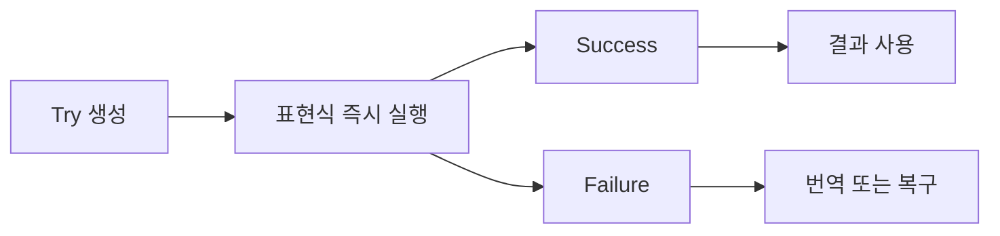

# 26장. Try


기존 라이브러리는 실패를 예외로 알리는 경우가 많다.
그 API를 값 중심 코드와 연결하려면 실행 결과를 성공과 실패로 포착하는 경계가 필요하다.
Scala의 `Try`는 성공값 또는 포착한 예외를 담는 표준 구조다.

이번 장은 `Either`와 비슷한 메서드 모양이 같은 의미를 뜻하지 않는다는 점에 집중한다.
`Try`는 계산을 즉시 실행하며, 특정 예외를 포착하고, 변환 함수에서 발생한 예외도 실패로 만들 수
있다.
자원 정리, 취소, 도메인 오류 번역은 여전히 별도의 책임이다.

---

## 1. 개념과 기본 구분

### 성공 또는 포착한 예외

`Try[A]`는 `Success(a)` 또는 `Failure(error)`다.
성공값의 타입은 `A`이고 실패에는 예외 객체가 들어간다.
구체적인 업무 오류 타입을 왼쪽 매개변수로 가진 `Either[E, A]`와 다르다.

```text
Try[A]
  Success(value: A)
  Failure(exception)
```

Scala의 `Try`는 모든 `Throwable`을 무차별적으로 포착하지 않는다.
표준 `NonFatal` 분류에 해당하는 실패를 포착한다.
인터럽트 같은 일부 신호는 일반 실패값으로 삼키지 않는다는 점이 중요하다.

### 즉시 실행

`Try(expression)`을 만들면 그 표현식을 그 시점에 평가한다.
나중에 실행할 설명을 보관하는 IO와 다르다.
이미 만들어진 `Try`를 다시 읽어도 원래 계산이 자동으로 재실행되지 않는다.

### 변환 중 예외

`map`에 전달한 함수가 포착 대상 예외를 던지면 실패가 될 수 있다.
`Either.map`처럼 단순히 성공값을 변환하는 구조와 구별해야 한다.
같은 메서드 이름이 예외 처리까지 동일하게 보장하는 것은 아니다.

### 예상 실패와 기술 예외

예외 객체에는 기술적인 정보가 들어 있다.
사용자에게 보여 줄 안정적인 도메인 오류로 바꾸는 단계가 필요할 수 있다.
`Failure`를 그대로 외부 응답에 직렬화하는 것은 적절하지 않을 수 있다.

---

## 2. 명령형 스타일과 함수형 스타일

### 예외 기반 숫자 변환

```scala
val quantity = raw.toInt
val doubled = quantity * 2
```

입력 형식이 잘못되면 예외가 발생할 수 있다.
호출자는 그 예외 경로를 별도로 처리해야 한다.
기존 API를 바꾸기 어렵다면 호출 경계에서 결과를 포착할 수 있다.

### 결과로 포착한다

```scala
import scala.util.Try

val result = Try(raw.toInt).map(_ * 2)
```

정상값은 변환되고 포착한 실패는 결과에 남는다.
하지만 이 코드는 잘못된 수량 범위 같은 모든 업무 규칙을 검사하지 않는다.
문자열을 정수로 읽는 기술적 성공과 유효한 도메인 값은 다른 단계다.

### 너무 넓은 포착

큰 업무 함수 전체를 `Try`로 감싸면 내부 버그도 기술 실패로 들어갈 수 있다.
상위 계층이 이를 정상적인 사용자 오류처럼 처리하면 문제를 숨길 수 있다.
가능하면 예외를 던지는 외부 호출의 경계를 작게 유지한다.

### 복구의 의미

실패 시 0을 반환하는 `recover`는 0을 선택한 정책이다.
원래 실패가 사라졌다는 사실을 호출자가 알아야 한다.
단순히 코드가 계속 실행된다는 이유로 올바른 복구라고 판단하지 않는다.

---

## 3. 왜 이 개념을 사용하는가?

### 기존 API와의 연결

예외를 사용하는 파서, 파일 API, 외부 라이브러리를 값 중심 흐름에 연결할 수 있다.
성공과 실패를 같은 구조로 전달하기 쉬워진다.
단, 포착 범위와 도메인 오류 번역을 명시해야 한다.

### 성공 경로의 조합

여러 기술 계산을 `map`과 `flatMap`으로 연결할 수 있다.
앞 단계가 실패하면 뒤의 성공 의존 계산은 실행하지 않는다.
콜백의 예외도 포착할 수 있다는 점이 `Either`와 다른 계약이다.

### 실패 원인의 보존

예외 객체를 보관하면 원인 종류와 스택 정보를 진단에 사용할 수 있다.
그러나 이를 장기간 보관하거나 외부에 전송하는 것이 항상 적절한 것은 아니다.
민감정보와 메모리 참조의 수명도 고려한다.

### 한 번 실행한 결과

즉시 실행한 결과를 변수에 보관하면 다시 읽을 때 같은 결과를 사용할 수 있다.
이것은 지연된 작업을 매번 실행하는 함수와 다르다.
재시도하려면 실제로 새 실행을 시작해야 한다.

### 도메인 경계

기술적 `Try` 결과를 구체적인 `Either` 오류로 바꾸면 상위 도메인이 라이브러리 예외에 덜 의존한다.
예외의 세부 구현보다 업무상 의미 있는 오류를 노출할 수 있다.
어떤 원인을 내부 진단으로 남길지도 함께 정한다.

---

## 4. Scala에서의 표현

### Scala의 실행과 복구

다음 프로그램은 즉시 실행, 변환 중 실패, 특정 복구, 인터럽트 전파를 검사한다.
실제 스레드를 중단하지 않고 예외를 직접 던져 포착 계약을 확인한다.
자원 정리는 별도의 `Using` 범위로 보여 준다.

<!-- executable:scala -->
```scala
object Chapter26:
  import scala.util.{Try, Success, Failure, Using}

  def parse(raw: String): Try[Int] = Try(raw.toInt)

  def positive(value: Int): Try[Int] =
    Try {
      require(value > 0, "quantity must be positive")
      value
    }

  final class Resource extends AutoCloseable:
    var closed = false
    def close(): Unit = closed = true

  def check(): Unit =
    assert(parse("3") == Success(3))
    assert(parse("x").isFailure)
    assert(parse("3").flatMap(positive).map(_ * 2) == Success(6))
    assert(parse("0").flatMap(positive).isFailure)
    assert(Success(3).map(_ => throw new IllegalStateException("bug")).isFailure)

    val recovered = parse("x").recover {
      case _: NumberFormatException => 0
    }
    assert(recovered == Success(0))
    val replaced = parse("x").recoverWith {
      case _: NumberFormatException => parse("5")
    }
    assert(replaced == Success(5))

    var runs = 0
    val completed = Try {
      runs += 1
      7
    }
    assert(runs == 1)
    assert(completed.getOrElse(0) == 7)
    assert(completed.getOrElse(0) == 7)
    assert(runs == 1)
    val repeatable = () => Try { runs += 1; 7 }
    repeatable()
    repeatable()
    assert(runs == 3)

    var interruptPropagated = false
    try Try(throw new InterruptedException("stop"))
    catch case _: InterruptedException => interruptPropagated = true
    assert(interruptPropagated)

    val resource = new Resource
    val used = Using(resource) { _ =>
      throw new IllegalArgumentException("failed inside resource scope")
    }
    assert(used.isFailure)
    assert(resource.closed)
```

### 버그도 실패로 들어갈 수 있다

`map` 안의 `IllegalStateException`은 `Failure`로 포착된다.
이것이 항상 바람직한 업무 오류 변환이라는 뜻은 아니다.
상위 계층이 모든 `Failure`를 “입력을 수정하세요”로 바꾸면 내부 버그를 숨길 수 있다.

### `Using`의 역할

자원을 닫는 일은 `Try`가 아니라 명시적인 자원 범위가 담당한다.
예제는 실패 중에도 닫힘을 검사한다.
획득 실패, 여러 자원의 해제 순서, 해제 중 실패까지 필요한 경우에는 해당 자원 API의 계약을
확인해야 한다.

---

## 5. 상태 변경보다 값 변환

### 실행 결과를 값으로 보관한다

`Try`는 이미 실행된 계산의 결과다.
성공이든 실패든 그 결과를 다음 함수에 전달할 수 있다.
실행할 작업 자체를 보관하는 값과 구별한다.



같은 결과를 여러 번 읽는 것은 원래 효과를 여러 번 실행하는 것과 다르다.
반대로 `() => Try[A]`를 호출하면 새 실행을 시작할 수 있다.
이 차이는 재시도와 테스트에서 중요하다.

### 예외 객체의 수명

예외는 스택이나 관련 객체에 대한 정보를 유지할 수 있다.
실패 결과를 오래 보관하면 예상보다 많은 진단 데이터가 남을 수 있다.
장기 저장에는 필요한 오류 코드와 요약만 추출하는 정책을 검토한다.

### 불변 결과와 외부 상태

성공 결과가 고정되어도 그 안의 가변 객체나 외부 자원이 계속 유효하다는 뜻은 아니다.
닫힌 파일 핸들을 `Success`에 넣어 보관할 수도 있다.
결과 컨테이너와 자원 수명은 다른 문제다.

---

## 6. 함수 합성과 데이터 흐름

### `map`, `flatMap`, `recover`

성공값의 일반 변환에는 `map`을 사용한다.
다음 계산이 `Try`를 반환하면 `flatMap`으로 연결한다.
실패를 일반 값으로 복구하면 `recover`, 다른 `Try` 계산으로 복구하면 `recoverWith`를 사용할 수
있다.

```text
성공 경로: map / flatMap
실패 경로: recover / recoverWith
```

### `Either`로 번역

기술 예외를 업무 오류로 바꾸려면 예외 종류를 분류하고 필요한 정보만 추출한다.
포착하지 말아야 할 신호나 예상하지 못한 버그를 어떻게 다룰지도 정한다.
모든 예외를 같은 도메인 코드로 바꾸면 진단 정밀도가 떨어진다.

### 재시도 함수

재시도는 이미 실패한 `Try`를 다시 읽는 것이 아니다.
새 계산을 호출해야 한다.
그 계산이 외부 효과를 반복해도 안전한지는 멱등성과 부분 성공 상태를 확인해야 한다.

### 평가 시점의 이동

`Try`를 만드는 위치를 함수 밖으로 옮기면 실행 시점도 바뀔 수 있다.
설정 당시 한 번 실행할지 요청마다 실행할지 명확히 한다.
값으로 결과를 보관하는 리팩터링이 효과의 횟수를 바꿀 수 있다.

---

## 7. 장점과 트레이드오프

### 장점과 트레이드오프

| 선택 | 장점 | 주의점 |
| --- | --- | --- |
| 예외 결과 포착 | 기존 API 연결 | 버그의 정상화 위험 |
| 즉시 실행 결과 | 재사용과 전달 | 지연 작업과 혼동 |
| 성공·실패 조합 | 분기 반복 감소 | 메서드별 포착 계약 |
| 예외 원인 보존 | 진단 정보 | 민감정보와 보관 비용 |
| 특정 복구 | 실패별 정책 | 잘못된 기본값 |

### 오류 타입의 정밀성

`Try[A]`의 실패는 일반적인 예외 객체다.
도메인의 제한된 오류 집합을 타입으로 표현하려면 `Either`가 더 적절할 수 있다.
두 구조를 경쟁 관계로만 보지 말고 경계별 역할로 구분한다.

### 포착 범위

너무 넓은 `Try`는 관련 없는 코드의 실패를 한데 묶는다.
너무 좁게 나누면 반복 코드가 많아질 수 있다.
실패를 번역할 책임이 있는 외부 호출 경계를 기준으로 나누는 것이 도움이 된다.

### 비용

예외 생성과 스택 수집, 결과 래핑은 비용을 가질 수 있다.
빈번한 정상 분기를 예외로 표현할지 여부는 실제 실패 빈도와 런타임을 고려한다.
성능 주장은 측정 가능한 구체적인 상황으로 한정한다.

---

## 8. 상태와 부수효과의 경계

### 자원 정리의 별도 책임

`Try(readFile())`만으로 파일이 항상 닫히는 것은 아니다.
파일을 연 함수가 자원 범위를 올바르게 관리해야 한다.
성공·실패의 값 표현과 획득·사용·해제의 구조를 함께 설계한다.

### 인터럽트와 취소

작업 중단 신호를 일반 실패로 삼키면 호출자의 제어 계약이 깨질 수 있다.
Scala의 `NonFatal`과 Python의 예외 계층은 정확히 같은 집합이 아니다.
언어별 취소 규칙을 확인하고 단순 번역을 피한다.

### 부분 외부 성공

원격 저장이 성공한 뒤 응답 처리에서 예외가 발생할 수 있다.
`Failure`는 외부 상태가 변경되지 않았다는 증명이 아니다.
재시도 전에 상태 확인과 중복 방지 정책을 검토한다.

### 사용자 메시지

예외 메시지에는 경로, 쿼리, 내부 식별자 같은 정보가 들어갈 수 있다.
외부에는 안정적인 도메인 오류와 적절한 안내만 제공한다.
진단용 원인은 접근이 통제된 경계에서 보관한다.

---

## 9. Python에서 적용하기

### Python의 명시적인 포착 구조

Python 표준 라이브러리에는 Scala와 동일한 `Try` 자료형이 없다.
아래 예제는 구조 비교를 위해 `Exception`을 포착하는 작은 결과 타입을 만든다.
이 포착 집합이 Scala의 `NonFatal`과 정확히 같다고 주장하지 않는다.

<!-- executable:python -->
```python
from collections.abc import Callable
from dataclasses import dataclass
from typing import Generic, TypeVar

A = TypeVar("A")
B = TypeVar("B")


@dataclass(frozen=True)
class Success(Generic[A]):
    value: A


@dataclass(frozen=True)
class Failure:
    error: Exception


def attempt(function: Callable[[], A]) -> Success[A] | Failure:
    try:
        return Success(function())
    except Exception as error:
        return Failure(error)


def map_attempt(result: Success[A] | Failure, function: Callable[[A], B]) -> Success[B] | Failure:
    if isinstance(result, Failure):
        return result
    return attempt(lambda: function(result.value))


def parse(raw: str) -> Success[int] | Failure:
    return attempt(lambda: int(raw))


def test_success_and_failure() -> None:
    assert parse("3") == Success(3)
    failed = parse("x")
    assert isinstance(failed, Failure)
    assert isinstance(failed.error, ValueError)
    assert map_attempt(parse("3"), lambda value: value * 2) == Success(6)
    mapped_failure = map_attempt(Success(3), lambda value: 10 // (value - 3))
    assert isinstance(mapped_failure, Failure)
    assert isinstance(mapped_failure.error, ZeroDivisionError)


def test_eager_execution() -> None:
    calls: list[str] = []

    def action() -> int:
        calls.append("run")
        return 7

    completed = attempt(action)
    assert calls == ["run"]
    assert completed == Success(7)
    assert completed == Success(7)
    assert calls == ["run"]
    attempt(action)
    attempt(action)
    assert calls == ["run", "run", "run"]


def test_control_signal_propagates() -> None:
    def stop() -> int:
        raise KeyboardInterrupt("test signal")

    try:
        attempt(stop)
    except KeyboardInterrupt:
        pass
    else:
        raise AssertionError("control signal was swallowed")


def test_resource_scope() -> None:
    from io import StringIO

    resource = StringIO("value")

    def read_then_fail() -> str:
        with resource:
            resource.read()
            raise ValueError("failure in resource scope")

    result = attempt(read_then_fail)
    assert isinstance(result, Failure)
    assert resource.closed


if __name__ == "__main__":
    test_success_and_failure()
    test_eager_execution()
    test_control_signal_propagates()
    test_resource_scope()
```

### 학습용 포착과 제품 경계

예제의 `attempt`는 `Exception` 전체를 포착하여 동작을 비교한다.
실제 도메인 어댑터에서는 예상한 예외만 좁게 포착하는 것이 더 적절할 수 있다.
포착한 모든 예외를 정상 입력 오류로 취급해서는 안 된다.

---

## 10. Python의 표현 한계

### 예외 계층의 차이

Scala의 `NonFatal`과 Python의 `Exception`은 이름만 바꾸면 같은 분류가 되는 것이 아니다.
취소, 인터럽트, 종료 신호의 계층과 라이브러리 계약을 각각 확인해야 한다.
기계적인 언어 번역으로 오류 정책을 결정하지 않는다.

### 스택과 원인 보존

예외를 새 예외로 바꿀 때 원인 연결을 유지할지 정책이 필요하다.
Python의 예외 체이닝을 사용할 수 있지만 외부 공개 정보는 별도로 제한한다.
오류를 값에 넣는 것만으로 진단 정책이 자동 완성되지는 않는다.

### 비동기 계산

코루틴 객체를 만드는 함수에 `attempt`를 적용해도 코루틴 내부 실행의 예외를 포착한 것은 아닐 수
있다.
실제로 `await`하는 경계에서 실패와 취소를 처리해야 한다.
객체 생성과 비동기 실행을 구분한다.

### 재사용과 재실행

성공·실패 결과를 보관하는 것과 실행 함수를 보관하는 것은 다르다.
재시도 API는 새로운 실행을 시작할 수 있는 함수를 받아야 할 수 있다.
이미 실패한 결과를 반복해서 검사하는 것은 재시도가 아니다.

---

## 11. 핵심 정리

### 핵심 결론

`Try`는 계산을 즉시 실행하여 성공 또는 포착한 예외로 표현한다.
`Either`와 달리 변환 중 특정 예외를 실패로 만들 수 있다.
이미 실행된 결과와 나중에 실행할 작업 설명을 구분해야 한다.
자원 정리, 취소 전파, 도메인 오류 번역은 별도의 계약이다.

### 연습 1: 재시도

실패한 `Try` 변수의 값을 세 번 읽었다.
원래 작업을 세 번 재시도한 것인가?

**해설.** 아니다. 이미 실행된 실패 결과를 다시 읽었을 뿐이다.
새 작업 실행을 시작하려면 계산을 담은 함수를 다시 호출해야 한다.
그 효과를 반복해도 안전한지도 별도로 확인한다.

### 연습 2: `Either`와 차이

변환 함수가 예외를 던질 때 `Either.map`과 `Try.map`의 차이를 설명하라.

**해설.** 일반적인 `Either.map`은 예외를 자동으로 `Left`로 바꾸지 않는다.
`Try.map`은 포착 대상 예외를 `Failure`로 만들 수 있다.
메서드 이름이 같아도 실행 계약은 다르다.

### 연습 3: 자원 닫기

파일 읽기를 `Try`로 감쌌으니 파일이 반드시 닫힌다는 주장에 반론하라.

**해설.** 결과 포착과 자원 해제는 다른 책임이다.
자원 범위나 `finally` 같은 구조를 명시해야 한다.
실패와 취소 모두에서 정리가 수행되는지 확인한다.

### 연습 4: 비동기 객체

코루틴을 생성하는 호출만 예외 포착 함수로 감쌌다.
실제 비동기 실행의 오류까지 포착했는가?

**해설.** 코루틴 생성과 실행은 다를 수 있다.
실제로 `await`하는 경계에서 실패와 취소가 발생할 수 있다.
실행 시점과 포착 범위를 일치시켜야 한다.

### 다음 장과 참고 자료

다음 장은 독립적인 입력 검증에서 여러 오류를 한 번에 보존하는 Validation을 다룬다.
첫 오류 중단과 오류 누적이 서로 다른 사용자 경험과 조합 법칙을 만든다.

[Scala API: Try](https://www.scala-lang.org/api/current/scala/util/Try.html)
[Scala API: NonFatal](https://www.scala-lang.org/api/current/scala/util/control/NonFatal$.html)
[Scala API: Using](https://www.scala-lang.org/api/current/scala/util/Using$.html)
[Python 공식 문서: Built-in Exceptions](https://docs.python.org/3.14/library/exceptions.html)
