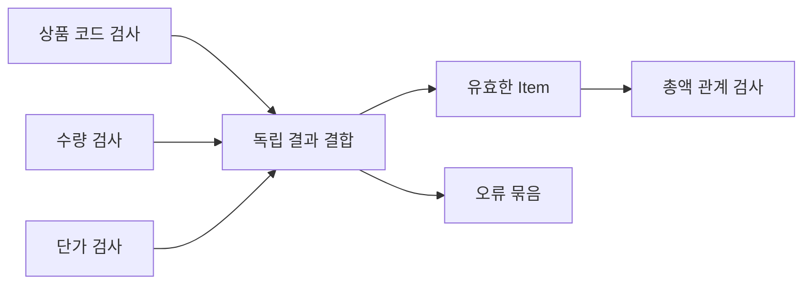

# 27장. Validation

상품 등록 화면에서 상품 코드와 수량과 단가가 모두 잘못되었다고 하자.
첫 오류만 반환하면 사용자는 한 필드를 고치고 다시 제출하는 과정을 반복할 수 있다.
서로 독립적인 입력 검사를 함께 수행하여 여러 오류를 보존하는 방식이 필요하다.

Validation은 이런 오류 누적의 요구를 표현하는 관점이다.
이 장에서는 작은 검증 자료형을 직접 만들어 독립 조합과 의존 조합을 구분한다.
실제 라이브러리의 모든 기능을 재현하는 것이 아니라 누적의 의미와 필요한 법칙을 드러내는 예제다.

---

## 1. 개념과 기본 구분

### 성공 또는 비어 있지 않은 오류

검증 결과는 유효한 값 또는 하나 이상의 오류를 가진다.
실패인데 오류가 하나도 없는 상태는 진단하기 어렵다.
비어 있지 않은 오류 구조를 사용하면 그 모순을 줄일 수 있다.

```text
Check[A]
  Valid(value: A)
  Invalid(errors: NonEmpty[FieldError])
```

오류에는 필드 위치와 안정적인 코드가 들어갈 수 있다.
사용자 메시지는 나중에 언어와 화면에 맞게 생성한다.
검증 함수가 HTML이나 HTTP 응답을 직접 만들 필요는 없다.

### 독립적인 검사

상품 코드의 형식은 수량의 성공값 없이도 검사할 수 있다.
수량의 범위도 단가의 성공값 없이 검사할 수 있다.
이런 검사들을 함께 실행하고 오류를 합칠 수 있다.

### 의존적인 검사

총액 상한을 검사하려면 수량과 단가가 먼저 유효한 숫자여야 한다.
앞 단계가 실패하면 총액 계산의 입력이 없을 수 있다.
이때는 무리하게 오류를 만들어 내기보다 선행 검증 뒤에 조건부로 실행한다.

### 누적과 병렬성

독립 검사를 결합한다는 사실이 자동으로 병렬 실행을 뜻하지 않는다.
순차적으로 모두 실행하면서 오류만 누적할 수 있다.
병렬화는 효과, 자원, 실행 순서에 대한 별도의 결정이다.

---

## 2. 명령형 스타일과 함수형 스타일

### 첫 오류에서 반환

```python
def validate_fields(sku: str, quantity: int, price: int):
    if not sku:
        return "상품 코드 오류"
    if quantity <= 0:
        return "수량 오류"
    if price < 0:
        return "단가 오류"
    return (sku, quantity, price)
```

이 코드는 가장 먼저 발견한 오류만 보여 준다.
모든 필드가 독립적이라면 나머지 오류를 함께 알려 줄 수 있다.
하지만 정상값과 오류 문자열을 섞어 반환하는 타입도 개선할 여지가 있다.

### 오류 목록 수집

```text
skuCheck      -> Valid 또는 Invalid
quantityCheck -> Valid 또는 Invalid
priceCheck    -> Valid 또는 Invalid

세 결과를 결합
  모두 성공 -> Item
  실패 있음 -> 모든 오류
```

각 검증을 독립적인 함수로 만들면 재사용과 테스트가 쉬워진다.
오류를 합치는 규칙은 공통 조합 함수가 담당한다.
필드별 규칙과 전체 결과의 정책을 분리한다.

### 가짜 정상값을 만들지 않는다

수량 파싱에 실패했다고 0을 넣고 총액 검사를 계속하면 오해를 부르는 추가 오류가 생길 수 있다.
유효한 중간값이 없는 검사는 실행하지 않는 편이 낫다.
모든 오류를 모은다는 목표가 무의미한 진단을 생성하는 이유가 되어서는 안 된다.

---

## 3. 왜 이 개념을 사용하는가?

### 사용자 수정의 효율

독립 오류를 한 번에 보여 주면 입력을 수정하는 반복을 줄일 수 있다.
필드 경로와 오류 코드가 있으면 화면의 해당 위치에 안내를 붙일 수 있다.
오류의 순서와 표현 방식도 사용자 경험의 일부다.

### 검증 규칙의 분리

각 필드의 생성 규칙을 작은 함수로 두고 여러 화면에서 조합할 수 있다.
다만 화면마다 허용 범위가 다르면 공통 규칙과 화면 정책을 구분한다.
재사용을 위해 실제 차이를 숨기지 않는다.

### 불변 결과

검증 결과를 값으로 반환하면 검사와 표시를 분리할 수 있다.
테스트는 화면 렌더링 없이 오류 코드와 성공값을 직접 비교한다.
오류 로그의 출력도 별도 경계에서 수행할 수 있다.

### 검증 단계의 설계

원시 형식 검사, 도메인 범위 검사, 필드 간 관계 검사, 외부 상태 확인을 나눌 수 있다.
각 단계가 어떤 선행 정보에 의존하는지 명시한다.
이 구조가 있어야 오류 누적이 정확한 진단으로 이어진다.

### 정책의 명시

모든 오류를 보여 줄지, 중요한 오류만 보여 줄지, 일정 개수로 제한할지 정한다.
오류 누적이라는 자료형이 그 정책을 자동 결정하지 않는다.
다음 장에서 큰 입력의 보고서 정책을 더 자세히 다룬다.

---

## 4. Scala에서의 표현

### Scala의 누적 조합

오류는 첫 원소와 나머지 벡터로 표현하여 빈 실패를 만들지 않는다.
`map2`는 두 검증 결과를 독립적으로 결합한다.
`andThen`은 성공값이 있어야 실행할 수 있는 다음 검사를 연결한다.

<!-- executable:scala -->
```scala
object Chapter27:
  final case class FieldError(field: String, code: String)
  final case class Errors(head: FieldError, tail: Vector[FieldError] = Vector.empty):
    def all: Vector[FieldError] = head +: tail
    def combine(other: Errors): Errors = Errors(head, tail ++ other.all)

  enum Check[+A]:
    case Valid(value: A)
    case Invalid(errors: Errors)

  final case class Item(sku: String, quantity: Int, unitPrice: BigInt)

  def invalid[A](field: String, code: String): Check[A] =
    Check.Invalid(Errors(FieldError(field, code)))

  def map2[A, B, C](left: Check[A], right: Check[B])(f: (A, B) => C): Check[C] =
    (left, right) match
      case (Check.Valid(a), Check.Valid(b)) => Check.Valid(f(a, b))
      case (Check.Invalid(a), Check.Invalid(b)) => Check.Invalid(a.combine(b))
      case (Check.Invalid(errors), _) => Check.Invalid(errors)
      case (_, Check.Invalid(errors)) => Check.Invalid(errors)

  def andThen[A, B](value: Check[A])(f: A => Check[B]): Check[B] =
    value match
      case Check.Valid(a) => f(a)
      case Check.Invalid(errors) => Check.Invalid(errors)

  def sku(value: String): Check[String] =
    if value.matches("[A-Z0-9][A-Z0-9-]{0,31}") then Check.Valid(value)
    else invalid("sku", "invalid_format")

  def quantity(value: Int): Check[Int] =
    if value >= 1 && value <= 1000000 then Check.Valid(value)
    else invalid("quantity", "out_of_range")

  def price(value: BigInt): Check[BigInt] =
    if value >= 0 then Check.Valid(value)
    else invalid("unitPrice", "negative")

  def validate(rawSku: String, rawQuantity: Int, rawPrice: BigInt): Check[Item] =
    val first = map2(sku(rawSku), quantity(rawQuantity))((s, q) => (s, q))
    val fields = map2(first, price(rawPrice)) { (pair, p) => Item(pair._1, pair._2, p) }
    andThen(fields) { item =>
      if item.unitPrice * item.quantity <= 1000000 then Check.Valid(item)
      else invalid("item", "total_too_large")
    }

  def check(): Unit =
    assert(validate("A-1", 2, 1000) == Check.Valid(Item("A-1", 2, 1000)))
    val allBad = validate("bad", 0, -1)
    allBad match
      case Check.Invalid(errors) =>
        assert(errors.all.map(_.field) == Vector("sku", "quantity", "unitPrice"))
      case _ => assert(false, "invalid fields accepted")
    assert(validate("A-1", 2, 600000) == invalid("item", "total_too_large"))
    var dependentCalls = 0
    val stopped = andThen(invalid[Int]("quantity", "bad")) { value =>
      dependentCalls += 1
      Check.Valid(value + 1)
    }
    assert(dependentCalls == 0)
    val a = Errors(FieldError("a", "bad"))
    val b = Errors(FieldError("b", "bad"))
    val c = Errors(FieldError("c", "bad"))
    assert(a.combine(b).combine(c) == a.combine(b.combine(c)))
```

### 독립 결과의 평가 시점

`map2`에 전달할 인자들은 호출 전에 계산된다.
따라서 왼쪽이 실패해도 오른쪽 검증은 수행된다.
이 예제에서는 두 검사가 순수하고 독립적이므로 의도한 동작이다.
자동 병렬 실행을 구현한 것은 아니다.

### 관계 검증의 선행 조건

총액 상한 검사는 유효한 상품 코드, 수량, 단가가 모인 뒤 실행한다.
필드 오류가 있으면 가짜 값으로 총액을 계산하지 않는다.
오류 누적과 의존적 중단을 단계별로 함께 사용할 수 있다.

---

## 5. 상태 변경보다 값 변환

### 성공값을 만들 수 있는 조건

모든 필드 검증이 성공해야 완전한 품목값을 만든다.
오류가 있는 동안에는 불완전한 품목을 정상 도메인 값으로 전달하지 않는다.
진단용 부분 정보가 필요하면 성공값과 별도의 구조로 보관한다.



그림의 합류는 독립적인 필드 결과를 모은다는 의미다.
실제 실행은 순차적일 수도 병렬일 수도 있다.
실행 전략을 바꾸려면 효과와 비용의 계약을 따로 확인한다.

### 오류의 순서

예제는 상품 코드, 수량, 단가 순서로 오류를 연결한다.
이 순서를 테스트하여 화면과 보고서가 안정적으로 동작하게 할 수 있다.
오류 목록을 집합으로 바꾸면 순서와 중복 의미가 달라진다.

### 오류도 도메인 데이터다

오류 코드가 빈 문자열이거나 필드 경로가 잘못될 수 있는지 검토한다.
성공값만 정교하게 모델링하고 오류값은 임의 문자열로 방치하지 않는다.
필요한 보장 수준에 따라 오류 ADT를 강화할 수 있다.

---

## 6. 함수 합성과 데이터 흐름

### 결합 연산의 법칙

오류를 순서대로 연결하는 연산은 결합법칙을 만족할 수 있다.
괄호를 바꾸어도 오류의 상대적 순서가 유지된다.
하지만 순서를 바꾸면 목록이 달라지므로 교환법칙까지 자동으로 성립하는 것은 아니다.

```text
(errorsA ++ errorsB) ++ errorsC
  = errorsA ++ (errorsB ++ errorsC)
```

### Applicative와의 연결

독립적인 컨텍스트 안의 값들을 결합하는 구조는 Applicative의 관점으로 일반화할 수 있다.
오류 누적에는 오류 결합 연산이 필요하다.
5부에서는 구체적인 검증 예제에서 출발하여 해당 법칙을 정리한다.

### Monad와의 차이

성공값에 의존하는 다음 계산을 연결하는 `flatMap`은 앞 실패에서 다음 입력을 얻을 수 없다.
이 때문에 누적하는 적용 연산과 같은 의미의 일반적인 Monad 구조를 무조건 제공할 수 있는 것은
아니다.
`andThen` 같은 명시적 의존 연결을 별도로 두는 이유다.

### 법칙을 혼합하지 않는다

누적 `map2`와 첫 오류 중단 `flatMap`을 함께 제공하면 둘의 관계가 기대한 법칙과 맞는지 검토해야
한다.
메서드 이름만 모아 구현했다고 일관된 추상화가 되는 것은 아니다.
실제 조합 의미를 먼저 정의한다.

---

## 7. 장점과 트레이드오프

### 장점과 트레이드오프

| 정책 | 장점 | 주의점 |
| --- | --- | --- |
| 독립 오류 누적 | 한 번에 수정 가능 | 더 많은 검사 비용 |
| 첫 오류 중단 | 의존 흐름 간결 | 반복 제출 가능 |
| 비어 있지 않은 오류 | 실패 진단 보장 | 자료형 추가 |
| 안정적인 오류 순서 | 화면과 테스트 예측 가능 | 결합 순서 관리 |
| 단계별 관계 검사 | 잘못된 추가 진단 방지 | 검증 그래프 설계 |

### 검사 비용

첫 오류에서 중단하는 방식보다 더 많은 검사를 실행할 수 있다.
순수하고 저렴한 필드 검사에는 이 비용이 합리적일 수 있다.
외부 API 호출이나 비싼 계산을 무조건 모두 실행하는 것은 별도 검토가 필요하다.

### 과도한 오류

하나의 원인에서 많은 파생 오류를 만들면 사용자가 혼란스러울 수 있다.
형식 실패 이후의 의미 검사는 생략하는 등 의존 관계를 반영한다.
오류 개수보다 수정에 도움이 되는 정보가 중요하다.

### 라이브러리의 범위

학습용 구현은 기본 결합만 제공한다.
실제 라이브러리는 더 많은 타입 클래스, 변환, 비어 있지 않은 컬렉션을 제공할 수 있다.
필요한 기능과 법칙을 확인하고 단순 예제를 제품용 검증 엔진으로 과장하지 않는다.

---

## 8. 상태와 부수효과의 경계

### 외부 조회 검증

상품 존재, 쿠폰 사용 여부, 재고 상태 같은 검사는 외부 상태에 의존할 수 있다.
독립적으로 보이는 검사도 같은 자원을 경쟁하거나 호출 제한을 공유할 수 있다.
병렬 실행 여부와 동시성 한도, 취소 정책을 별도로 정한다.

### 시점 일관성

여러 외부 검사가 서로 다른 시점의 상태를 읽으면 전체 판단이 일관되지 않을 수 있다.
가능하면 필요한 스냅샷이나 트랜잭션 경계를 정의한다.
오류를 누적하는 자료형이 스냅샷 일관성을 제공하지는 않는다.

### 오류 공개

검증 결과에 내부 상품 상태나 보안 정책을 과도하게 노출하지 않는다.
외부에는 필요한 수정 안내만 제공하고 내부 원인은 별도로 보관할 수 있다.
모든 오류를 모은다는 목표와 모든 정보를 공개한다는 정책은 다르다.

### 취소와 예외

검증 함수의 예상 오류와 실행 중 취소·버그를 구분한다.
모든 예외를 필드 오류로 바꾸면 장애를 잘못된 입력으로 오인할 수 있다.
순수 검증과 효과 실행의 경계를 유지한다.

---

## 9. Python에서 적용하기

### Python의 누적 검증

오류 묶음의 첫 원소를 필수로 두어 빈 실패를 피한다.
`map2`는 두 성공값을 결합하거나 오류를 순서대로 모은다.
`and_then`은 앞의 성공값에 의존하는 검사에 사용한다.

<!-- executable:python -->
```python
from collections.abc import Callable
from dataclasses import dataclass
from typing import Generic, TypeVar

A = TypeVar("A")
B = TypeVar("B")
C = TypeVar("C")


@dataclass(frozen=True)
class FieldError:
    field: str
    code: str


@dataclass(frozen=True)
class Errors:
    head: FieldError
    tail: tuple[FieldError, ...] = ()

    def all(self) -> tuple[FieldError, ...]:
        return (self.head,) + self.tail

    def combine(self, other: "Errors") -> "Errors":
        return Errors(self.head, self.tail + other.all())


@dataclass(frozen=True)
class Valid(Generic[A]):
    value: A


@dataclass(frozen=True)
class Invalid:
    errors: Errors


@dataclass(frozen=True)
class Item:
    sku: str
    quantity: int
    unit_price: int


def invalid(field: str, code: str) -> Invalid:
    return Invalid(Errors(FieldError(field, code)))


def map2(left: Valid[A] | Invalid, right: Valid[B] | Invalid, function: Callable[[A, B], C]) -> Valid[C] | Invalid:
    if isinstance(left, Invalid) and isinstance(right, Invalid):
        return Invalid(left.errors.combine(right.errors))
    if isinstance(left, Invalid):
        return left
    if isinstance(right, Invalid):
        return right
    return Valid(function(left.value, right.value))


def and_then(value: Valid[A] | Invalid, function: Callable[[A], Valid[B] | Invalid]) -> Valid[B] | Invalid:
    if isinstance(value, Invalid):
        return value
    return function(value.value)


def validate(sku: str, quantity: int, price: int) -> Valid[Item] | Invalid:
    import re
    s = Valid(sku) if re.fullmatch(r"[A-Z0-9][A-Z0-9-]{0,31}", sku) else invalid("sku", "invalid_format")
    q = Valid(quantity) if type(quantity) is int and 1 <= quantity <= 1_000_000 else invalid("quantity", "out_of_range")
    p = Valid(price) if type(price) is int and price >= 0 else invalid("unit_price", "negative_or_not_integer")
    first = map2(s, q, lambda a, b: (a, b))
    fields = map2(first, p, lambda pair, value: Item(pair[0], pair[1], value))
    return and_then(fields, lambda item: Valid(item) if item.quantity * item.unit_price <= 1_000_000 else invalid("item", "total_too_large"))


def test_validation() -> None:
    assert validate("A-1", 2, 1000) == Valid(Item("A-1", 2, 1000))
    result = validate("bad", 0, -1)
    assert isinstance(result, Invalid)
    assert [error.field for error in result.errors.all()] == ["sku", "quantity", "unit_price"]
    assert validate("A-1", 2, 600_000) == invalid("item", "total_too_large")
    assert isinstance(validate("A-1", True, 100), Invalid)


def test_error_law() -> None:
    a = Errors(FieldError("a", "bad"))
    b = Errors(FieldError("b", "bad"))
    c = Errors(FieldError("c", "bad"))
    assert a.combine(b).combine(c) == a.combine(b.combine(c))
    calls: list[int] = []
    result = and_then(invalid("quantity", "bad"), lambda value: calls.append(value) or Valid(value))
    assert isinstance(result, Invalid)
    assert calls == []


if __name__ == "__main__":
    test_validation()
    test_error_law()
```

### 코드의 단순화 범위

Python 예제는 필드별 검사 함수를 짧게 묶어 보여 준다.
실제 코드에서 규칙이 커지면 이름 있는 함수로 분리하는 편이 읽기 좋다.
조합 구조를 보여 주기 위한 긴 조건식을 일반적인 스타일 규칙으로 받아들이지 않는다.

---

## 10. Python의 표현 한계

### 자동 독립성 검사

Python 타입 주석은 두 검사가 서로 독립적이거나 순수한지 자동 증명하지 않는다.
검사 함수의 입력과 외부 의존성을 검토해야 한다.
독립 조합을 사용했다는 사실이 병렬 실행의 안전성을 보장하지 않는다.

### 유효한 값의 신뢰

`Valid` 생성자를 직접 호출할 수 있으므로 그 안의 값이 실제 검증을 거쳤는지는 모듈 계약에 달려
있다.
중요한 도메인 불변식은 스마트 생성자와 제한된 경계로 강화한다.
검증 결과 자료형과 도메인 값의 생성 보장은 다른 층이다.

### 성능과 오류 수집

튜플을 반복 연결하면 큰 오류 목록에서 복사 비용이 늘 수 있다.
실제 대량 검증에서는 지역 빌더를 사용하고 마지막에 불변 결과로 바꿀 수 있다.
외부의 값 계약과 내부 구현 전략을 분리한다.

### 라이브러리의 의미 확인

이름이 Validation인 도구라도 첫 오류 중단, 오류 누적, 자동 형 변환 정책이 다를 수 있다.
실제 호출 규칙과 오류 구조를 확인해야 한다.
이 책의 작은 구현과 특정 외부 라이브러리를 동일한 제품으로 취급하지 않는다.

---

## 11. 핵심 정리

### 핵심 결론

Validation은 독립적인 검사의 오류를 함께 보존하는 구조를 제공한다.
유효한 선행 값이 필요한 검사는 의존 단계로 분리해야 한다.
오류 결합의 순서와 법칙을 명시하고 빈 실패를 피한다.
오류 누적은 자동 병렬 실행이나 모든 예외의 포착을 뜻하지 않는다.

### 연습 1: 의존 검사

수량 파싱이 실패했는데 총액 상한 오류도 함께 반환했다.
왜 진단이 부정확할 수 있는가?

**해설.** 유효한 수량이 없으므로 총액 계산의 전제조건이 충족되지 않았다.
가짜 기본값으로 만든 파생 오류는 사용자를 혼란스럽게 할 수 있다.
형식·범위 검사 이후에 관계 검사를 실행한다.

### 연습 2: 병렬성

독립 검증을 `map2`로 결합했으니 두 검사가 병렬 실행된다는 주장은 맞는가?

**해설.** 아니다. 결합 의미와 실행 전략은 별개다.
예제는 두 결과를 순차적으로 계산한 뒤 오류를 모은다.
병렬화에는 효과와 자원, 취소 정책의 추가 검토가 필요하다.

### 연습 3: 오류 순서

오류 목록 연결이 결합적이면 순서를 바꿔도 같은가?

**해설.** 괄호 변경과 순서 교체는 다르다.
목록 연결은 순서를 보존하므로 일반적으로 교환적이지 않다.
화면의 안정적인 오류 순서를 계약으로 정할 수 있다.

### 연습 4: 빈 실패

`Invalid([])`를 허용하면 어떤 문제가 생길 수 있는가?

**해설.** 실패했지만 사용자와 운영자에게 설명할 오류가 없다.
비어 있지 않은 오류 구조로 이런 상태를 줄일 수 있다.
오류 데이터에도 도메인 모델링 원칙을 적용한다.

### 다음 장과 참고 자료

다음 장은 중첩된 여러 입력의 오류 경로, 중복 검사, 보고서 제한을 다룬다.
작은 필드 검증을 실제 배치 입력의 오류 누적으로 확장한다.

[Cats 공식 문서: Validated](https://typelevel.org/cats/datatypes/validated.html)
[Cats 공식 문서: Applicative](https://typelevel.org/cats/typeclasses/applicative.html)
[Python 공식 문서: dataclasses](https://docs.python.org/3.14/library/dataclasses.html)
