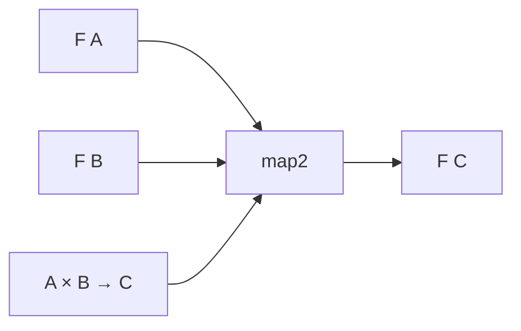

# 33장. Applicative


Functor는 이미 있는 컨텍스트 안의 값을 변환했다.
하지만 일반 값을 컨텍스트에 넣거나 여러 컨텍스트의 값을 함께 사용하려면 추가 연산이 필요하다.
Applicative는 값 주입과 컨텍스트 안의 함수 적용을 통해 이런 결합을 표현한다.

이 장은 앞서 만든 입력 검증을 다시 사용한다.
상품 코드와 수량을 각각 검사한 뒤 두 성공값으로 품목을 만들거나 오류를 함께 모은다.
독립적인 결합, 실행 순서, 병렬 실행이 서로 다른 개념이라는 점을 분명히 한다.

---

## 1. 개념과 기본 구분

### 값 주입과 함수 적용

Applicative는 Functor의 변환에 더해 `pure`와 `ap`으로 설명할 수 있다.
`pure`는 일반 값을 컨텍스트에 넣는다.
`ap`는 컨텍스트 안의 함수를 컨텍스트 안의 인자에 적용한다.

```text
pure: A -> F[A]
ap: F[A -> B] × F[A] -> F[B]
```

`pure`라는 이름이 전달한 인자 표현식의 효과를 되돌리거나 숨긴다는 뜻은 아니다.
엄격한 언어에서는 인자를 만들기 위한 계산이 이미 실행될 수 있다.
값 주입과 효과 지연을 구분해야 한다.

### 두 값의 결합

`map2`는 두 컨텍스트의 값을 일반적인 두 인자 함수로 결합한다.
`map`과 `ap`를 이용해 정의할 수 있다.
필드별 검증 결과에서 품목을 만드는 계산이 대표적인 예다.

```text
map2: F[A] × F[B] × ((A, B) -> C) -> F[C]
```

### 독립성의 의미

두 번째 계산을 선택하는 데 첫 번째 성공값을 먼저 꺼낼 필요가 없다는 뜻이다.
첫 결과에 따라 다음 조회 대상이나 다음 작업 자체를 결정하는 구조와 구분된다.
두 계산이 실제로 동시에 실행되어야 한다는 뜻은 아니다.

### 컨텍스트별 결합 의미

선택값은 둘 다 있어야 결과를 만들 수 있다.
검증은 여러 오류를 합칠 수 있다.
목록은 함수와 인자의 모든 조합을 만들 수 있다.
같은 타입 모양 뒤에 있는 각 인스턴스의 의미를 확인해야 한다.

---

## 2. 명령형 스타일과 함수형 스타일

### 성공값을 직접 꺼내려는 코드

```text
상품 코드 검증 결과에서 값을 꺼낸다
수량 검증 결과에서 값을 꺼낸다
두 값으로 품목을 만든다
```

실패가 있을 수 있으므로 단순하게 꺼낼 수는 없다.
각 경우를 직접 분기하면 반복적인 오류 결합 코드가 생긴다.
독립적인 성공값을 결합하는 구조를 연산으로 분리한다.

### 함수가 컨텍스트 안에 들어간다

두 인자 품목 생성 함수를 커링하면 첫 값을 받은 뒤 두 번째 값을 기다리는 함수가 된다.
첫 검증 결과를 `map`하면 그 함수가 검증 컨텍스트 안에 들어간다.
`ap`는 두 번째 검증 결과를 그 함수에 적용한다.

```text
F[A]
  map(a => b => make(a, b))
F[B -> C]
  ap(F[B])
F[C]
```

앞에서 배운 커링과 고차 함수가 실제 조합 문제에 연결된다.
함수값도 다른 값처럼 컨텍스트 안에 들어갈 수 있다.

### 첫 오류 중단과 비교

첫 오류에서 중단하면 다른 독립 필드의 문제를 놓칠 수 있다.
누적 Applicative는 둘 다 검사한 결과의 오류를 합친다.
어느 정책이 맞는지는 입력의 의존성과 사용자 경험에 달려 있다.

### 이름만으로 병렬화하지 않는다

두 검사가 외부 자원을 공유할 수 있다.
독립적으로 표현된다는 사실만으로 무제한 동시 실행이 안전해지는 것은 아니다.
실행 전략과 오류 결합 의미를 분리한다.

---

## 3. 왜 이 개념을 사용하는가?

### 고정된 결합 구조

필드 검증처럼 필요한 계산의 모양을 미리 알 수 있는 문제에 적합하다.
성공값을 꺼내 다음 계산을 선택하는 중첩 없이 전체 조합을 설명할 수 있다.
데이터 의존성이 제한되어 있다는 사실이 구조를 더 명확히 한다.

### 오류 누적의 일반화

여러 검증 결과를 같은 결합 연산으로 모을 수 있다.
오류를 합치는 연산이 일관되면 괄호를 바꾸어도 의미를 유지할 수 있다.
오류의 순서와 결합법칙을 앞 장에서 검토한 이유다.

### 컬렉션 순회

각 원소를 검증한 결과들을 하나의 검증된 목록으로 바꿀 수 있다.
`sequence`와 `traverse`는 이 구조를 반복 입력에 적용한다.
대량 입력의 보고서와 도메인 값 생성을 연결하는 기반이다.

### 작은 능력의 요구

독립적인 결합만 필요한 함수에 성공 의존적인 `flatMap`까지 요구할 필요가 없을 수 있다.
필요한 최소 계약을 사용하면 가능한 구현과 해석이 넓어진다.
추상화의 계층을 기능 목록이 아니라 의존성의 표현력으로 읽는다.

### 실행 의미의 명시

목록의 모든 조합, 선택값의 부재, 검증의 오류 누적은 서로 다른 결합 정책이다.
각 인스턴스가 무엇을 보존하고 무엇을 합치는지 문서화한다.
같은 이름의 `map2`가 모든 자료형에서 같은 결과 수를 만드는 것은 아니다.

---

## 4. Scala에서의 표현

### Scala의 두 Applicative

선택값과 오류 누적 검증에 같은 인터페이스를 제공한다.
`map`과 `map2`는 `pure`와 `ap`에서 유도한다.
법칙 테스트는 함수 객체 자체를 비교하지 않고 적용된 결과를 비교한다.

<!-- executable:scala -->
```scala
object Chapter33:
  trait Applicative[F[_]]:
    def pure[A](value: A): F[A]
    def ap[A, B](function: F[A => B])(value: F[A]): F[B]
    def map[A, B](value: F[A])(f: A => B): F[B] = ap(pure(f))(value)
    def map2[A, B, C](left: F[A], right: F[B])(f: (A, B) => C): F[C] =
      ap(map(left)(a => (b: B) => f(a, b)))(right)

  given optionApplicative: Applicative[Option] with
    def pure[A](value: A): Option[A] = Some(value)
    def ap[A, B](function: Option[A => B])(value: Option[A]): Option[B] =
      function.flatMap(f => value.map(f))

  final case class Errors(head: String, tail: Vector[String] = Vector.empty):
    def all: Vector[String] = head +: tail
    def combine(other: Errors): Errors = Errors(head, tail ++ other.all)

  enum Check[+A]:
    case Valid(value: A)
    case Invalid(errors: Errors)

  given validationApplicative: Applicative[Check] with
    def pure[A](value: A): Check[A] = Check.Valid(value)
    def ap[A, B](function: Check[A => B])(value: Check[A]): Check[B] =
      (function, value) match
        case (Check.Valid(f), Check.Valid(a)) => Check.Valid(f(a))
        case (Check.Invalid(a), Check.Invalid(b)) => Check.Invalid(a.combine(b))
        case (Check.Invalid(errors), _) => Check.Invalid(errors)
        case (_, Check.Invalid(errors)) => Check.Invalid(errors)

  def sequence[F[_], A](values: List[F[A]])(using F: Applicative[F]): F[List[A]] =
    values.foldRight(F.pure(List.empty[A])) { (value, accumulated) =>
      F.map2(value, accumulated)(_ :: _)
    }

  def check(): Unit =
    val O = optionApplicative
    val f: Int => Int = _ + 1
    val g: Int => Int = _ * 2
    val id: Int => Int = value => value
    assert(O.ap(O.pure(id))(Some(3)) == Some(3))
    assert(O.ap(O.pure(id))(None).isEmpty)
    assert(O.ap(O.pure(f))(O.pure(3)) == O.pure(f(3)))
    val u: Option[Int => Int] = Some(f)
    assert(O.ap(u)(O.pure(3)) == O.ap(O.pure((h: Int => Int) => h(3)))(u))
    val compose: (Int => Int) => (Int => Int) => Int => Int = a => b => x => a(b(x))
    val v: Option[Int => Int] = Some(g)
    val w: Option[Int] = Some(3)
    assert(O.ap(O.ap(O.ap(O.pure(compose))(u))(v))(w) == O.ap(u)(O.ap(v)(w)))
    assert(O.map2(Some("A"), Some(2))((sku, quantity) => s"$sku:$quantity") == Some("A:2"))
    assert(O.map2(Some("A"), Option.empty[Int])((s, q) => s"$s:$q").isEmpty)

    val V = validationApplicative
    val badSku: Check[String] = Check.Invalid(Errors("sku"))
    val badQuantity: Check[Int] = Check.Invalid(Errors("quantity"))
    assert(V.map2(badSku, badQuantity)((s, q) => (s, q)) == Check.Invalid(Errors("sku", Vector("quantity"))))
    assert(sequence[Check, Int](List(Check.Valid(1), Check.Valid(2))) == Check.Valid(List(1, 2)))
    assert(sequence[Check, Int](Nil) == Check.Valid(Nil))
    val failures: List[Check[Int]] = List(Check.Invalid(Errors("a")), Check.Valid(2), Check.Invalid(Errors("c")))
    assert(sequence(failures) == Check.Invalid(Errors("a", Vector("c"))))
    val functions = List(f, g)
    val values = List(1, 2)
    assert(functions.flatMap(h => values.map(h)) == List(2, 3, 2, 4))
    assert(functions.zip(values).map((h, a) => h(a)) == List(2, 4))
```

### 법칙의 구성

항등 법칙은 컨텍스트 안의 값에 항등 함수를 적용해도 같다는 뜻이다.
준동형 법칙은 일반 함수 적용을 컨텍스트로 옮겨도 결과가 일치한다는 뜻이다.
교환과 합성 법칙은 함수·인자의 주입과 연속 적용이 일관되게 연결되는지 확인한다.

### 테스트와 증명의 차이

예제는 법칙의 구체적인 적용을 검사한다.
모든 가능한 값과 함수에 대한 일반적인 증명을 완료한 것은 아니다.
인스턴스 구현의 경우 분석과 오류 결합의 결합법칙이 일반적인 설명의 근거가 된다.

---

## 5. 상태 변경보다 값 변환

### 독립 결과의 합류

두 검증은 각각 성공 또는 오류를 만든다.
둘 다 성공하면 도메인 값을 만들고, 실패가 있으면 정해진 규칙으로 오류를 결합한다.
성공값을 가짜 기본값으로 대체하여 계산을 강행하지 않는다.



이 그림은 데이터 의존성의 합류를 나타낸다.
실행 스레드나 작업 스케줄을 표현한 것은 아니다.
병렬 실행을 원한다면 구체적인 효과 인스턴스와 실행기를 검토해야 한다.

### 목록의 두 결합

모든 조합을 만드는 목록 적용과 같은 위치끼리 묶는 zip 적용은 다르다.
전자는 결과 수가 곱해질 수 있고 후자는 위치 대응을 사용한다.
서로 다른 의미를 같은 인스턴스로 혼합하지 않는다.

### zip의 항등 주입

단순한 유한 목록에서 `pure(a) = [a]`로 두고 zip 적용을 하면 항등 법칙이 맞지 않을 수 있다.
한 원소 함수 목록이 긴 값 목록을 잘라 버리기 때문이다.
zip 기반 구조는 반복 값 표현 등 별도의 설계가 필요하므로 평범한 목록 적용과 구분한다.

---

## 6. 함수 합성과 데이터 흐름

### 네 가지 법칙의 직관

항등 함수의 적용은 값을 바꾸지 않는다.
일반 함수와 일반 값을 각각 주입한 뒤 적용하면 결과를 바로 주입한 것과 같다.
일반 값을 주입하는 위치를 바꾸어도 같은 적용 결과를 얻어야 한다.
함수 합성을 컨텍스트 안에서 표현해도 연속 적용과 일치해야 한다.

```text
ap(pure(identity), v) = v
ap(pure(f), pure(x)) = pure(f(x))
ap(u, pure(y)) = ap(pure(f => f(y)), u)
```

합성 법칙은 코드 예제의 커링된 `compose` 적용으로 확인했다.
기호를 암기하기보다 함수와 인자 각각이 어느 컨텍스트에 있는지 타입을 따라 읽는다.

### `sequence`와 `traverse`

`sequence`는 `List[F[A]]`를 `F[List[A]]`로 바꾼다.
`traverse`는 각 입력에 `A -> F[B]`를 적용하면서 결과를 같은 방식으로 모은다.
컬렉션의 순서와 컨텍스트의 결합 의미를 함께 보존해야 한다.

### 성공 의존적 선택의 한계

앞 성공값에 따라 다음 조회 주소나 다음 계산의 종류가 달라지면 일반적인 `flatMap`이 필요할 수
있다.
Applicative 결합만으로 그 값을 꺼내 임의의 다음 컨텍스트를 선택할 수는 없다.
더 약한 계약이 충분한 곳과 더 강한 의존성이 필요한 곳을 구분한다.

---

## 7. 장점과 트레이드오프

### 장점과 트레이드오프

| 요구 | 적합한 관점 | 주의할 문제 |
| --- | --- | --- |
| 독립 필드 결합 | `map2` | 실제 효과의 공유 |
| 오류 누적 | 오류 결합 연산 | 순서와 정보량 |
| 목록 전체 검증 | `traverse` | 입력 크기와 비용 |
| 모든 조합 | 목록 적용 | 결과 수 폭증 |
| 위치별 결합 | zip 기반 구조 | 별도의 주입과 법칙 |

### 조합 구조의 가시성

필요한 계산을 미리 나열하면 검토와 실행 계획에 도움이 될 수 있다.
하지만 일반적인 Applicative 인터페이스가 자동으로 최적화 엔진을 제공하는 것은 아니다.
구조를 활용하는 해석기와 실행기는 별도로 구현해야 한다.

### 오류 누적 비용

여러 검사를 수행하고 오류를 보관하는 비용이 생긴다.
싼 순수 검증과 비싼 외부 요청을 같은 정책으로 다루지 않는다.
보고서 제한과 입력 크기 제한을 함께 설계한다.

### 추상화의 선택

간단한 두 값 결합에는 명시적인 패턴 매칭이 더 읽기 좋을 수 있다.
반복되는 구조가 많아질 때 공통 연산의 이득이 커진다.
기능 이름을 사용하기 위해 코드를 복잡하게 만들지 않는다.

---

## 8. 상태와 부수효과의 경계

### 독립성과 효과 순서

계산의 데이터 의존성이 없더라도 외부 효과의 순서는 중요할 수 있다.
파일 쓰기 두 개나 재고 조회 두 개가 같은 자원을 공유할 수 있다.
Applicative라는 이유로 순서를 바꾸거나 병렬화해도 된다고 단정하지 않는다.

### 이미 시작된 계산

`Future`처럼 생성 시 작업이 시작되는 값은 `map2`에 전달하기 전에 실행이 시작될 수 있다.
지연된 IO와 같은 모양으로 보아서는 안 된다.
컨텍스트의 생성 시점과 결합 시점을 구분한다.

### 취소와 자원

두 효과를 함께 실행하다 하나가 실패하면 다른 작업을 취소할지 계속 기다릴지 정책이 필요하다.
오류 결합 법칙만으로 그 정책이 결정되지 않는다.
구체적인 비동기 실행기의 계약을 확인해야 한다.

### 원자성

두 성공 결과를 결합했다고 두 외부 작업이 하나의 트랜잭션이 되는 것은 아니다.
한 작업의 성공과 다른 작업의 실패가 함께 존재할 수 있다.
원자성과 보상은 효과 경계의 별도 책임이다.

---

## 9. Python에서 적용하기

### Python의 구체적인 검증 Applicative

Python에서는 검증 결과 타입에 대한 `pure`, `map`, `ap`, `map2`를 직접 정의한다.
고차 타입 전체를 추상화하지 않아도 결합 의미와 법칙을 학습할 수 있다.
오류는 비어 있지 않은 첫 원소와 나머지로 보관한다.

<!-- executable:python -->
```python
from collections.abc import Callable
from dataclasses import dataclass
from typing import Generic, TypeVar

A = TypeVar("A")
B = TypeVar("B")
C = TypeVar("C")


@dataclass(frozen=True)
class Errors:
    head: str
    tail: tuple[str, ...] = ()

    def all(self) -> tuple[str, ...]:
        return (self.head,) + self.tail

    def combine(self, other: "Errors") -> "Errors":
        return Errors(self.head, self.tail + other.all())


@dataclass(frozen=True)
class Valid(Generic[A]):
    value: A


@dataclass(frozen=True)
class Invalid:
    errors: Errors


def pure(value: A) -> Valid[A]:
    return Valid(value)


def ap(function: Valid[Callable[[A], B]] | Invalid, value: Valid[A] | Invalid) -> Valid[B] | Invalid:
    if isinstance(function, Invalid) and isinstance(value, Invalid):
        return Invalid(function.errors.combine(value.errors))
    if isinstance(function, Invalid):
        return function
    if isinstance(value, Invalid):
        return value
    return Valid(function.value(value.value))


def map_valid(value: Valid[A] | Invalid, function: Callable[[A], B]) -> Valid[B] | Invalid:
    return ap(pure(function), value)


def map2(left: Valid[A] | Invalid, right: Valid[B] | Invalid, function: Callable[[A, B], C]) -> Valid[C] | Invalid:
    return ap(map_valid(left, lambda a: lambda b: function(a, b)), right)


def sequence(values: list[Valid[A] | Invalid]) -> Valid[tuple[A, ...]] | Invalid:
    result: Valid[tuple[A, ...]] | Invalid = Valid(())
    for value in reversed(values):
        result = map2(value, result, lambda head, tail: (head,) + tail)
    return result


def test_laws() -> None:
    f = lambda value: value + 1
    g = lambda value: value * 2
    identity = lambda value: value
    assert ap(pure(identity), Valid(3)) == Valid(3)
    assert ap(pure(identity), Invalid(Errors("bad"))) == Invalid(Errors("bad"))
    assert ap(pure(f), pure(3)) == pure(f(3))
    u = pure(f)
    assert ap(u, pure(3)) == ap(pure(lambda h: h(3)), u)
    compose = lambda a: lambda b: lambda x: a(b(x))
    v, w = pure(g), pure(3)
    assert ap(ap(ap(pure(compose), u), v), w) == ap(u, ap(v, w))


def test_accumulation() -> None:
    assert map2(Valid("A"), Valid(2), lambda s, q: (s, q)) == Valid(("A", 2))
    assert map2(Invalid(Errors("sku")), Invalid(Errors("quantity")), lambda s, q: (s, q)) == Invalid(Errors("sku", ("quantity",)))
    assert sequence([Valid(1), Valid(2)]) == Valid((1, 2))
    assert sequence([]) == Valid(())
    assert sequence([Invalid(Errors("a")), Valid(2), Invalid(Errors("c"))]) == Invalid(Errors("a", ("c",)))
    functions = (lambda x: x + 1, lambda x: x * 2)
    values = (1, 2)
    assert [function(value) for function in functions for value in values] == [2, 3, 2, 4]
    assert [function(value) for function, value in zip(functions, values)] == [2, 4]


if __name__ == "__main__":
    test_laws()
    test_accumulation()
```

### 순회 구현의 비용

예제는 튜플 앞에 값을 붙이므로 큰 성공 입력에서 반복 복사 비용이 생길 수 있다.
실제 대량 처리에서는 지역 빌더나 적절한 불변 자료구조를 사용할 수 있다.
교육용 법칙 구현과 고성능 제품 구현의 범위를 구분한다.

---

## 10. Python의 표현 한계

### 표준 추상화의 부재

Python 표준 라이브러리가 모든 컨텍스트에 대한 Applicative 인터페이스를 제공하는 것은 아니다.
구체적인 결과 타입을 위한 함수를 작성하는 방식이 더 직접적일 수 있다.
필요한 경우 외부 라이브러리의 실제 의미와 검사 지원을 확인한다.

### 오류 결합의 강제

타입 주석은 `combine`의 결합법칙을 증명하지 않는다.
오류 순서와 빈 실패의 금지 같은 조건을 별도로 검토한다.
법칙 테스트는 구현 변경의 회귀를 발견하는 도구다.

### 병렬 실행의 별도 구현

위 Python 코드는 동기적으로 결과를 결합한다.
스레드나 코루틴을 만들지 않는다.
동시성 도구를 추가하려면 실패·취소·자원 정책을 새로 정의해야 한다.

### 콜백의 예외

일반 함수가 예외를 던지면 이 검증 구현은 자동으로 `Invalid`로 바꾸지 않는다.
예상한 검증 실패와 버그를 구분하는 앞 부의 원칙을 유지한다.
모든 예외를 필드 오류로 취급하지 않는다.

---

## 11. 핵심 정리

### 핵심 결론

Applicative는 값을 주입하고 컨텍스트 안의 함수를 적용한다.
독립적인 여러 성공값을 결합하거나 오류를 누적하는 구조를 표현할 수 있다.
독립성은 자동 병렬 실행이나 효과 순서의 무관함을 뜻하지 않는다.
각 인스턴스의 결합 의미와 법칙을 함께 확인해야 한다.

### 연습 1: `map2`의 유도

두 검증 결과와 두 인자 생성 함수에서 `map`과 `ap`로 결과를 만드는 과정을 설명하라.

**해설.** 첫 결과를 변환하여 두 번째 인자를 기다리는 함수를 컨텍스트에 넣는다.
그 함수 컨텍스트에 두 번째 결과를 적용한다.
커링과 함수값이 독립 결과 결합에 사용된다.

### 연습 2: zip의 항등

`pure(f) = [f]`와 zip 적용을 사용하여 여러 원소 목록에 항등 함수를 적용했다.
왜 법칙이 깨질 수 있는가?

**해설.** 한 원소 함수 목록 때문에 결과가 한 원소로 잘릴 수 있다.
모든 조합의 목록 적용과 zip 적용은 다른 구조다.
zip 기반 주입에는 별도의 표현과 법칙 검토가 필요하다.

### 연습 3: 다음 조회 선택

첫 조회 결과의 고객 등급에 따라 전혀 다른 두 번째 조회를 선택한다.
왜 단순한 독립 결합과 다른가?

**해설.** 다음 계산 자체가 앞 성공값에 의존한다.
그 값을 받아 새 컨텍스트를 만드는 `flatMap` 구조가 필요할 수 있다.
다음 장의 Monad가 이 의존성을 표현한다.

### 연습 4: 병렬 결제

두 계산을 `map2`로 결합했으니 결제 요청 두 개를 병렬 실행해도 안전하다는 주장에 반론하라.

**해설.** 데이터 의존성의 표현과 외부 효과의 안전성은 다르다.
중복 결제, 자원 공유, 실패와 취소, 부분 성공 정책을 별도로 검토해야 한다.
추상화 이름이 업무 원자성을 제공하지 않는다.

### 다음 장과 참고 자료

다음 장은 성공값에 따라 다음 계산을 결정하는 Monad를 다룬다.
독립 결합보다 강한 의존성을 표현할 때 무엇이 달라지는지 확인한다.

[Cats 공식 문서: Applicative](https://typelevel.org/cats/typeclasses/applicative.html)
[Cats 공식 문서: Apply](https://typelevel.org/cats/typeclasses/apply.html)
[Cats 공식 문서: Traverse](https://typelevel.org/cats/typeclasses/traverse.html)
[Cats 공식 문서: Validated](https://typelevel.org/cats/datatypes/validated.html)
