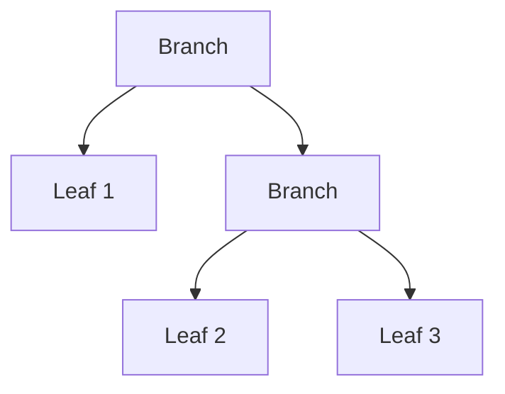

# 32장. Functor

앞 장의 `Mapper`는 컨텍스트 안의 값을 변환하는 시그니처를 제공했다.
그러나 같은 시그니처로 원소를 버리거나 임의의 구조를 바꾸는 구현도 만들 수 있었다.
Functor는 `map` 연산에 항등과 합성 법칙을 더하여 변환을 안정적으로 추론하도록 한다.

이번 장에서는 목록, 선택값, 이진 트리의 변환을 비교한다.
“상자 안의 값을 바꾼다”는 비유에서 출발하되 함수 같은 컨텍스트에도 적용할 수 있는 더 정확한
정의로 나아간다.
법칙을 만족하지 않는 구현의 반례도 실행해 보며 타입과 의미의 차이를 확인한다.

---

## 1. 개념과 기본 구분

### 연산의 타입

Functor는 특정 타입 생성자 `F`에 대해 `map`을 제공한다.
이미 존재하는 `F[A]`와 함수 `A -> B`에서 `F[B]`를 만든다.
`F`의 종류는 유지되고 변환되는 값의 타입이 바뀐다.

```text
map: F[A] × (A -> B) -> F[B]
```

이 시그니처만으로는 충분하지 않다.
항등 함수를 적용했을 때 원래 의미가 유지되고 연속 변환과 합성 변환이 일치해야 한다.
무엇을 같은 값으로 비교하는지는 해당 컨텍스트의 동등성에 맞춰 정의한다.

### 항등 법칙

```text
map(fa, identity) = fa
```

내부 값을 바꾸지 않으면 컨텍스트의 의미도 바뀌지 않아야 한다.
목록에서는 원소와 순서가 그대로이고 트리에서는 가지 구조가 그대로일 수 있다.
객체 주소가 반드시 같아야 한다는 법칙은 아니다.

### 합성 법칙

```text
map(map(fa, f), g) = map(fa, g ∘ f)
```

작은 변환을 나누어 적용하거나 합성하여 적용해도 같은 결과를 얻는다.
이 법칙은 순수한 변환과 해당 동등성의 전제 아래 사용한다.
외부 로그 순서나 실행 비용까지 같다는 주장은 별도다.

### 컨텍스트 보존의 의미

모든 Functor가 목록의 길이를 보존한다는 뜻은 아니다.
각 자료형에서 법칙이 말하는 의미를 확인해야 한다.
컨텍스트를 상자 하나로만 상상하면 함수나 오류 구조의 변환을 이해하기 어려워질 수 있다.

---

## 2. 명령형 스타일과 함수형 스타일

### 트리의 반복적인 변환

상품 분류 트리의 각 말단 값을 코드에서 표시 이름으로 바꾸려 한다.
트리 모양은 유지하고 말단 값만 바꾸면 된다.
정수에서 문자열로 바꾸는 경우에도 같은 재귀 구조가 반복된다.

```text
Branch(Leaf(a), Branch(Leaf(b), Leaf(c)))
  -> 값 변환
Branch(Leaf(f(a)), Branch(Leaf(f(b)), Leaf(f(c))))
```

재귀 순회와 원소별 변환을 분리할 수 있다.
트리 Functor는 이 구조를 공통적인 `map` 계약으로 표현한다.

### 시그니처만 맞는 잘못된 구현

목록의 첫 원소를 버린 뒤 나머지에 함수를 적용해도 `List[A] -> List[B]` 타입은 만들 수 있다.
하지만 항등 함수를 적용했을 때 원래 목록과 같지 않다.
따라서 기대한 Functor 법칙을 만족하지 않는다.

### 법칙으로 오류를 발견한다

일반적인 예제 몇 개는 원소 손실을 놓칠 수 있다.
항등 법칙을 빈 목록, 한 원소, 여러 원소에 적용하면 구조 변화가 드러난다.
법칙 기반 테스트는 개별 예상값 테스트와 다른 관점의 검사를 제공한다.

### 임의의 기본값을 넣지 않는다

`Option`의 `map`에서 부재를 임의의 값으로 바꾸려면 `B`를 만들 추가 정보가 필요하다.
또한 그 동작은 일반적인 부재 보존 의미와 다르다.
값을 넣거나 기본값으로 복구하는 연산을 `map`에 숨기지 않는다.

---

## 3. 왜 이 개념을 사용하는가?

### 변환의 재배치 근거

순수한 변환을 나누어 테스트하고 합쳐 실행할 수 있다.
항등 변환을 제거하는 리팩터링도 값의 의미를 설명할 수 있다.
법칙은 코드의 모양을 바꿀 때 필요한 근거를 제공한다.

### 자료구조와 계산의 분리

트리의 가지 순회는 Functor 구현이 담당한다.
호출자는 말단 값을 어떻게 바꿀지만 제공한다.
같은 순회 구조에서 여러 도메인 변환을 재사용할 수 있다.

### 최소한의 능력

Functor만 필요한 알고리즘은 값을 새 컨텍스트에 넣거나 외부로 꺼낼 권한을 요구하지 않는다.
작은 계약을 사용하면 필요한 능력을 더 정확히 표현할 수 있다.
불필요하게 Monad 전체를 요구하는 인터페이스를 줄일 수 있다.

### 법칙의 문서화

인스턴스마다 기대하는 동등성과 정의역을 명시한다.
효과가 있는 콜백이나 특별한 동등성에서는 법칙의 해석이 달라질 수 있다.
단순한 메서드 이름보다 검토 가능한 의미가 중요하다.

### 추상화의 한계

Functor는 실패를 복구하거나 두 독립 계산을 결합하는 모든 기능을 제공하지 않는다.
필요한 연산이 무엇인지 구분하면 다음 추상화를 선택하기 쉬워진다.
기능 이름을 외우기보다 시그니처의 입력과 출력을 읽는다.

---

## 4. Scala에서의 표현

### Scala의 트리 Functor

다음 구현은 목록, 선택값, 트리를 같은 변환 계약으로 다룬다.
트리의 `map`은 구조적 재귀를 사용하며 매우 깊은 트리에 대한 스택 안전성을 제공하지 않는다.
그 제한과 법칙의 의미를 분리해서 읽는다.

<!-- executable:scala -->
```scala
object Chapter32:
  trait Functor[F[_]]:
    def map[A, B](value: F[A])(f: A => B): F[B]

  enum Tree[+A]:
    case Leaf(value: A)
    case Branch(left: Tree[A], right: Tree[A])

  given listFunctor: Functor[List] with
    def map[A, B](value: List[A])(f: A => B): List[B] = value.map(f)

  given optionFunctor: Functor[Option] with
    def map[A, B](value: Option[A])(f: A => B): Option[B] = value.map(f)

  given treeFunctor: Functor[Tree] with
    def map[A, B](value: Tree[A])(f: A => B): Tree[B] =
      value match
        case Tree.Leaf(a) => Tree.Leaf(f(a))
        case Tree.Branch(left, right) => Tree.Branch(map(left)(f), map(right)(f))

  def leafCount[A](tree: Tree[A]): Int =
    tree match
      case Tree.Leaf(_) => 1
      case Tree.Branch(left, right) => leafCount(left) + leafCount(right)

  def replace[F[_], A, B](value: F[A], replacement: B)(using F: Functor[F]): F[B] =
    F.map(value)(_ => replacement)

  val unlawful: Functor[List] = new Functor[List]:
    def map[A, B](value: List[A])(f: A => B): List[B] = value.drop(1).map(f)

  def check(): Unit =
    import Tree.*
    val tree: Tree[Int] = Branch(Leaf(1), Branch(Leaf(2), Leaf(3)))
    val F = summon[Functor[Tree]]
    val f: Int => Int = _ + 1
    val g: Int => String = value => s"n=$value"
    assert(F.map(tree)(identity) == tree)
    assert(F.map(F.map(tree)(f))(g) == F.map(tree)(f.andThen(g)))
    assert(F.map(tree)(g) == Branch(Leaf("n=1"), Branch(Leaf("n=2"), Leaf("n=3"))))
    assert(leafCount(F.map(tree)(g)) == leafCount(tree))
    assert(replace[Tree, Int, String](tree, "x") == Branch(Leaf("x"), Branch(Leaf("x"), Leaf("x"))))
    assert(replace[Option, Int, String](None, "x").isEmpty)
    assert(replace[Option, Int, String](Some(1), "x") == Some("x"))
    for size <- 0 to 10 do
      val values = (0 until size).toList
      assert(listFunctor.map(values)(identity) == values)
      assert(listFunctor.map(listFunctor.map(values)(f))(g) == listFunctor.map(values)(f.andThen(g)))
    assert(unlawful.map(List(1, 2, 3))(identity) != List(1, 2, 3))
    val nested = List(Some(1), None, Some(3))
    val mapped = listFunctor.map(nested)(value => optionFunctor.map(value)(_ * 2))
    assert(mapped == List(Some(2), None, Some(6)))
```

### 잘못된 인스턴스도 타입 검사는 통과한다

`unlawful`은 필요한 메서드와 타입을 제공한다.
그러나 항등 법칙 테스트가 원소 손실을 발견한다.
타입 클래스 인스턴스의 존재와 올바른 대수적 의미를 구분해야 한다.

### 중첩 Functor

목록 안의 선택값을 변환할 때 바깥 `map`과 안쪽 `map`을 함께 사용한다.
목록의 위치와 선택값의 부재가 각각 유지된다.
두 컨텍스트를 하나로 평탄화하는 `flatMap`과 다른 작업이다.

---

## 5. 상태 변경보다 값 변환

### 트리 구조의 보존

말단 값이 바뀌어도 가지의 연결 관계는 유지된다.
이 예제의 구조 보존은 구체적인 트리 구현의 의미다.
다른 Functor에서도 반드시 같은 모양의 나무를 상상할 필요는 없다.



변환 후 숫자 대신 문자열이 들어가도 연결은 같다.
원래 트리는 수정하지 않는다.
내부 값이 가변 객체이면 그 객체의 별칭 문제는 여전히 따로 검토한다.

### 함수도 컨텍스트가 될 수 있다

환경 `R`을 받아 `A`를 만드는 함수는 `R -> A`라는 컨텍스트로 볼 수 있다.
그 결과를 `A -> B`로 변환하면 `R -> B`가 된다.
이는 함수 합성으로 구현할 수 있으며 Reader 장과 연결된다.

### 꺼내기 연산의 부재

Functor만으로 모든 `F[A]`에서 `A`를 꺼낼 수는 없다.
`None`에는 꺼낼 값이 없고 환경 함수에는 아직 환경이 없을 수 있다.
변환 능력과 실행·추출 능력은 다른 계약이다.

---

## 6. 함수 합성과 데이터 흐름

### 합성 법칙의 전개

트리의 각 말단 `a`에 대해 두 번 변환하면 `g(f(a))`가 된다.
합성한 함수를 한 번 적용해도 같은 값이 된다.
재귀적으로 모든 말단에 같은 관계가 적용되므로 트리 전체의 의미가 일치한다.

```text
Leaf(a)
  map f -> Leaf(f(a))
  map g -> Leaf(g(f(a)))
```

### 값 동등성과 관측 동등성

두 번의 엄격한 목록 변환은 모든 `f` 호출 뒤에 모든 `g` 호출을 할 수 있다.
합성한 변환은 원소마다 `f`, `g`를 이어 실행할 수 있다.
로그 같은 효과를 관측하면 순서가 다를 수 있으므로 법칙의 전제조건을 확인한다.

### 일반적인 lifting

`map`을 이용해 `A -> B`를 `F[A] -> F[B]`로 들어 올릴 수 있다.
같은 변환을 여러 컨텍스트에서 재사용하는 기반이다.
새 컨텍스트를 만드는 `pure`는 아직 제공하지 않는다.

### 다음 연산이 컨텍스트를 반환한다면

`A -> F[B]` 함수를 `map`하면 `F[F[B]]`가 생길 수 있다.
이 중첩을 연결하는 연산이 필요한지 검토한다.
Functor만으로 임의의 중첩을 평탄화할 수 있다는 보장은 없다.

---

## 7. 장점과 트레이드오프

### 장점과 트레이드오프

| 기능 | 이점 | 제한 또는 비용 |
| --- | --- | --- |
| 법칙 있는 `map` | 변환 리팩터링의 근거 | 전제조건 확인 |
| 컨텍스트 공통 계약 | 알고리즘 재사용 | 구체적 실행 의미 학습 |
| 트리 변환 분리 | 재귀 코드 중복 감소 | 깊은 트리의 스택 |
| 중첩 변환 | 여러 층의 의미 보존 | 긴 타입과 호출 |
| 최소 능력 요구 | 인터페이스 정밀화 | 추가 연산은 별도 필요 |

### 함수의 효과

Functor 인스턴스가 올바르더라도 전달한 함수의 효과 때문에 기대한 관측 법칙이 달라질 수 있다.
순수한 변환을 사용하거나 관측 범위를 명시해야 한다.
법칙을 최적화 허가로 사용할 때 특히 주의한다.

### 비교 가능한 결과

함수나 지연 계산의 동등성은 단순한 객체 비교로 확인할 수 없을 수 있다.
대표 환경에서 실행 결과를 비교하는 테스트와 일반적인 의미 설명을 함께 사용한다.
유한 테스트가 모든 입력의 동등성을 증명하는 것은 아니다.

### 성능

두 번의 `map`과 합성한 한 번의 `map`은 같은 값이어도 할당과 순회 비용이 다를 수 있다.
컴파일러나 라이브러리가 자동으로 융합한다고 가정하지 않는다.
법칙은 값의 의미를 설명하고 비용은 별도로 측정한다.

---

## 8. 상태와 부수효과의 경계

### 변환 안의 외부 호출

`map`에서 데이터베이스를 읽으면 원소 수만큼 외부 호출이 발생할 수 있다.
평가 순서와 실패 정책을 확인해야 한다.
Functor라는 이름이 배치 처리나 동시성 제한을 제공하지는 않는다.

### 오류 컨텍스트

오류 결과의 Functor는 성공값만 변환하고 오류를 유지할 수 있다.
그 변환 함수의 예외를 포착하는지는 컨텍스트의 별도 계약이다.
`Either`와 `Try`의 차이를 앞 부에서 배운 대로 유지한다.

### 지연 컨텍스트

지연 계산의 `map`은 변환을 실행하지 않고 나중 작업에 추가할 수 있다.
엄격한 목록과 같은 시점에 콜백이 실행된다고 가정하지 않는다.
공통 법칙과 구체적인 평가 시점을 구분한다.

### 자원 수명

컨텍스트 안에 열린 자원을 담아 변환할 때 자원이 언제 닫히는지 확인해야 한다.
`map`의 존재가 획득·해제 범위를 제공하지는 않는다.
효과와 자원 장에서 필요한 추가 구조를 다룬다.

---

## 9. Python에서 적용하기

### Python의 구체적인 트리 변환

Python에서는 트리의 원소 타입 관계를 직접 제네릭 함수로 표현한다.
임의의 `F[_]`에 대한 표준 고차 타입 사전을 가정하지 않는다.
구체적인 자료구조에서도 같은 법칙을 설명하고 테스트할 수 있다.

<!-- executable:python -->
```python
from collections.abc import Callable
from dataclasses import dataclass
from typing import Generic, TypeVar

A = TypeVar("A")
B = TypeVar("B")


@dataclass(frozen=True)
class Leaf(Generic[A]):
    value: A


@dataclass(frozen=True)
class Branch(Generic[A]):
    left: "Leaf[A] | Branch[A]"
    right: "Leaf[A] | Branch[A]"


def map_tree(tree: Leaf[A] | Branch[A], function: Callable[[A], B]) -> Leaf[B] | Branch[B]:
    match tree:
        case Leaf(value):
            return Leaf(function(value))
        case Branch(left, right):
            return Branch(map_tree(left, function), map_tree(right, function))
    raise TypeError("unknown tree node")


def leaf_count(tree: Leaf[A] | Branch[A]) -> int:
    match tree:
        case Leaf():
            return 1
        case Branch(left, right):
            return leaf_count(left) + leaf_count(right)
    raise TypeError("unknown tree node")


def unlawful_map(values: list[A], function: Callable[[A], B]) -> list[B]:
    return [function(value) for value in values[1:]]


def test_tree_laws() -> None:
    tree = Branch(Leaf(1), Branch(Leaf(2), Leaf(3)))
    f = lambda value: value + 1
    g = lambda value: f"n={value}"
    assert map_tree(tree, lambda value: value) == tree
    assert map_tree(map_tree(tree, f), g) == map_tree(tree, lambda value: g(f(value)))
    assert map_tree(tree, g) == Branch(Leaf("n=1"), Branch(Leaf("n=2"), Leaf("n=3")))
    assert leaf_count(map_tree(tree, g)) == leaf_count(tree)
    assert map_tree(tree, lambda _: "x") == Branch(Leaf("x"), Branch(Leaf("x"), Leaf("x")))
    assert tree == Branch(Leaf(1), Branch(Leaf(2), Leaf(3)))


def test_list_laws_and_counterexample() -> None:
    for size in range(11):
        values = list(range(size))
        f = lambda value: value + 1
        g = lambda value: str(value)
        assert [value for value in values] == values
        assert [g(value) for value in [f(x) for x in values]] == [g(f(value)) for value in values]
    assert unlawful_map([1, 2, 3], lambda value: value) != [1, 2, 3]


def test_nested_context() -> None:
    nested: list[int | None] = [1, None, 3]
    mapped = [None if value is None else value * 2 for value in nested]
    assert mapped == [2, None, 6]
    assert nested == [1, None, 3]


if __name__ == "__main__":
    test_tree_laws()
    test_list_laws_and_counterexample()
    test_nested_context()
```

### 구조적 재귀의 비용

트리의 모든 말단과 가지를 방문하므로 노드 수에 비례하는 작업이 필요하다.
깊은 한쪽 가지 트리에서는 호출 스택이 문제가 될 수 있다.
스택 안전한 반복 구현이 필요하면 명시적 작업 스택을 사용하되 법칙과 구조를 보존한다.

---

## 10. Python의 표현 한계

### 일반적인 Functor 인터페이스

구체적인 트리의 `map`은 표현할 수 있지만 임의 타입 생성자의 같은 관계를 표준 타입 변수만으로
직접 일반화하기는 어렵다.
구체 함수와 명시적인 연산 전달이 실용적인 선택일 수 있다.
고차 타입 장의 표현력 차이를 그대로 유지한다.

### 동적 객체의 분해

패턴 매칭에서 예상하지 못한 객체가 들어올 수 있다.
예제는 오류를 발생시켜 조용히 잘못된 결과를 만들지 않는다.
외부 트리 데이터는 크기와 형태를 검증하는 파서가 필요하다.

### 법칙의 자동 검사 없음

Python의 제네릭 주석이나 프로토콜이 항등·합성 법칙을 자동으로 증명하지 않는다.
대표 입력 테스트와 구조적 설명을 함께 사용한다.
효과가 있는 함수의 관측 의미도 별도로 확인한다.

### 동일성과 동등성

데이터 클래스의 값 비교는 예제의 트리 결과를 비교하는 데 적합하다.
메모리 객체가 같은지 확인하는 `is`는 다른 질문이다.
법칙에서 사용하는 동등성의 기준을 혼동하지 않는다.

---

## 11. 핵심 정리

### 핵심 결론

Functor는 `map`의 타입뿐 아니라 항등과 합성 법칙을 요구한다.
법칙은 값을 보존하는 리팩터링의 근거가 되지만 효과와 비용의 동일성을 자동 보장하지 않는다.
각 컨텍스트의 구체적인 의미와 필요한 동등성을 정의해야 한다.
변환, 값 주입, 결합, 추출은 서로 다른 능력이다.

### 연습 1: 잘못된 인스턴스

목록의 첫 원소를 버리는 `map`이 어떤 법칙을 어기는지 설명하라.

**해설.** 항등 함수를 적용해도 원래 목록과 달라지므로 항등 법칙을 어긴다.
시그니처가 같다고 올바른 Functor인 것은 아니다.
한 원소 목록이 간단한 반례가 된다.

### 연습 2: 객체 주소

트리 `map(identity)`가 새 객체를 만들면 항등 법칙 위반인가?

**해설.** 법칙이 값의 구조적 동등성을 기준으로 한다면 반드시 위반은 아니다.
메모리 동일성과 값의 동등성은 다르다.
어떤 관측을 비교하는지 먼저 정해야 한다.

### 연습 3: 꺼내기

Functor만 있으면 `Option[A]`에서 항상 `A`를 얻을 수 있다는 주장에 반론하라.

**해설.** `None`에는 꺼낼 값이 없다.
Functor는 내부 변환을 제공할 뿐 임의의 기본값이나 실행 환경을 제공하지 않는다.
추가 연산과 입력이 필요한지 시그니처로 확인한다.

### 연습 4: 로그 순서

두 번의 목록 `map`을 합성한 한 번의 `map`으로 바꾸자 로그 순서가 바뀌었다.
무엇을 검토해야 하는가?

**해설.** 변환 함수의 효과와 법칙이 비교하는 관측 범위를 확인해야 한다.
순수한 반환값 관계를 전체 외부 효과의 동등성으로 확대하지 않는다.
최적화 전제조건을 명시한다.

### 다음 장과 참고 자료

다음 장은 컨텍스트에 값을 넣고 독립적인 여러 값을 결합하는 Applicative를 다룬다.
Functor가 제공하지 않았던 새로운 연산이 왜 필요한지 살펴본다.

[Cats 공식 문서: Functor](https://typelevel.org/cats/typeclasses/functor.html)
[Scala 공식 문서: Type Classes](https://docs.scala-lang.org/scala3/book/ca-type-classes.html)
[Python 공식 문서: dataclasses](https://docs.python.org/3.14/library/dataclasses.html)
