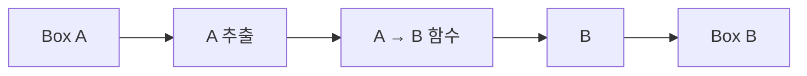

# 29장. Generic Functions

앞 부의 목록 변환과 검증 결과에는 원소 타입만 다르고 구조는 같은 코드가 반복되었다.
정수 목록의 첫 원소를 찾는 일과 상품 목록의 첫 원소를 찾는 일은 같은 구조를 가진다.
제네릭 함수는 이런 공통 구조를 타입 정보를 버리지 않고 표현하는 방법이다.

이 장에서는 항등 함수, 첫 원소 조회, 상자 변환, 길이가 같은 두 목록의 결합을 구현한다.
무조건 모든 것을 일반화하는 것이 아니라 어떤 정보가 알고리즘에 필요하고 어떤 정보는 필요하지
않은지 구분한다.
`Any`로 타입을 지우는 것과 타입 매개변수로 입출력 관계를 보존하는 것이 다르다는 점이 핵심이다.

---

## 1. 개념과 기본 구분

### 타입을 매개변수로 받는다

제네릭 함수는 특정 타입 이름 대신 타입 매개변수를 사용한다.
그 매개변수는 호출에서 선택되는 타입을 나타낸다.
입력과 출력에 같은 매개변수가 나타나면 두 위치의 관계를 설명할 수 있다.

```text
identity[A]: A -> A
firstOption[A]: List[A] -> Option[A]
mapBox[A, B]: Box[A] × (A -> B) -> Box[B]
```

항등 함수는 입력으로 받은 타입의 값을 그대로 반환한다.
첫 원소 조회는 목록 원소와 같은 타입의 선택값을 반환한다.
이 관계를 `Any -> Any`로 바꾸면 호출자가 결과의 정확한 타입을 다시 알아내야 할 수 있다.

### 매개변수적 다형성

같은 알고리즘이 여러 타입에 공통으로 적용되는 성질을 매개변수적 다형성이라고 부른다.
원소의 구체적인 의미를 몰라도 목록의 첫 위치를 선택할 수 있다.
반면 원소를 정렬하려면 어떤 순서로 비교할지 추가 정보가 필요하다.

### 타입별 동작과 구분

정수는 숫자로 출력하고 상품은 상품명으로 출력하는 일은 타입별 동작을 요구한다.
제네릭 함수의 구조와 타입별 연산을 분리하면 다음 장의 타입 클래스가 필요해진다.
일반화할 수 없는 차이를 무조건 타입 검사 분기로 숨기지 않는다.

### 전체성의 보장은 아니다

제네릭 타입을 사용해도 예외를 던지거나 종료하지 않는 함수를 만들 수 있다.
런타임 형 검사나 강제 변환으로 타입별 분기를 만들 수도 있다.
매개변수성에 대한 이론적 법칙을 실제 언어의 모든 함수에 무조건 적용하지 않는다.

---

## 2. 명령형 스타일과 함수형 스타일

### 타입마다 복사한 함수

```scala
def firstInt(values: List[Int]): Option[Int] = values.headOption
def firstString(values: List[String]): Option[String] = values.headOption
```

두 함수는 원소의 타입만 다르다.
첫 위치를 읽는 알고리즘은 원소가 정수인지 문자열인지 알 필요가 없다.
이 차이를 타입 매개변수로 옮길 수 있다.

### 공통 구조와 타입 관계

```scala
def first[A](values: List[A]): Option[A] = values.headOption
```

이제 함수 하나가 여러 원소 타입에 적용된다.
반환값은 여전히 입력 원소와 같은 타입이라는 정보를 가진다.
반복 코드를 줄이면서 정적 정보를 유지한다.

### `Any`로 바꾸는 우회

```text
List[Any] -> Option[Any]
```

이 형태도 여러 값을 받을 수 있다.
하지만 문자열 목록을 넣었을 때 문자열 선택값이 나온다는 관계가 약해진다.
호출자가 형 변환과 런타임 검사를 반복할 수 있다.

### 다른 입력을 억지로 같은 타입으로 묶지 않는다

두 입력이 서로 다른 의미를 가지면 `A`, `B`처럼 다른 매개변수를 사용한다.
같은 매개변수를 사용했다고 런타임 클래스가 반드시 완전히 같아지는 것은 아니다.
컴파일러가 공통 상위 타입이나 유니언을 선택할 수 있는 경우도 있다.
의도한 관계를 정확한 시그니처로 표현해야 한다.

---

## 3. 왜 이 개념을 사용하는가?

### 중복 감소와 계약 보존

같은 구조의 코드를 한곳에서 수정할 수 있다.
빈 입력 처리와 순서 보존 같은 규칙도 일관되게 유지한다.
타입을 지우지 않으므로 호출자가 결과를 더 정확하게 사용할 수 있다.

### 의존성의 드러남

제네릭 함수가 원소에서 무엇을 하려는지 살펴보면 필요한 연산이 보인다.
첫 원소를 선택하는 데는 원소 비교가 필요 없다.
중복 제거에는 동등성, 정렬에는 순서, 표시에는 렌더링 규칙이 필요하다.

### 테스트의 분리

구조의 법칙을 여러 대표 타입에서 검사할 수 있다.
하지만 정수와 문자열 테스트에 통과했다고 모든 타입의 모든 효과가 증명된 것은 아니다.
구조에 대한 설명과 실행 가능한 회귀 테스트를 함께 사용한다.

### 명시적인 빈 입력

제네릭 함수는 임의의 `A` 기본값을 만들어 낼 수 없을 수 있다.
첫 원소가 없으면 선택값을 반환하거나 호출자가 기본값을 제공하도록 한다.
0이나 빈 문자열을 모든 타입의 기본값처럼 사용하는 것은 올바른 일반화가 아니다.

### 일반화의 기준

두 함수가 우연히 비슷하다는 이유만으로 공통화하지 않는다.
입력·출력 관계, 오류 정책, 순서, 비용까지 같은 구조인지 확인한다.
공통 타입을 만들려고 실제 도메인 차이를 숨기면 유지보수가 더 어려워질 수 있다.

---

## 4. Scala에서의 표현

### Scala의 타입 매개변수

다음 프로그램은 원소의 구체적인 의미에 의존하지 않는 계산들을 구현한다.
두 목록의 길이가 다르면 명시적인 오류를 반환한다.
표준 `zip`의 짧은 쪽에 맞춘 종료를 조용히 받아들이지 않고 필요한 계약을 선택했다.

<!-- executable:scala -->
```scala
object Chapter29:
  final case class Box[A](value: A)
  final case class Product(sku: String, price: BigInt)
  final case class LengthMismatch(left: Int, right: Int)

  def identity[A](value: A): A = value

  def firstOption[A](values: List[A]): Option[A] =
    values match
      case Nil => None
      case head :: _ => Some(head)

  def mapBox[A, B](box: Box[A])(f: A => B): Box[B] =
    Box(f(box.value))

  def swap[A, B](pair: (A, B)): (B, A) =
    (pair._2, pair._1)

  def zipExact[A, B](left: List[A], right: List[B]): Either[LengthMismatch, List[(A, B)]] =
    if left.length == right.length then Right(left.zip(right))
    else Left(LengthMismatch(left.length, right.length))

  def choose[A](condition: Boolean, left: A, right: A): A =
    if condition then left else right

  def check(): Unit =
    assert(identity(3) == 3)
    assert(identity("order") == "order")
    assert(firstOption(List(1, 2, 3)) == Some(1))
    assert(firstOption(List("A", "B")) == Some("A"))
    assert(firstOption(List.empty[Product]).isEmpty)
    val product = Product("A", 1000)
    assert(firstOption(List(product)).contains(product))
    assert(mapBox(Box(3))(_ * 2) == Box(6))
    assert(mapBox(Box(product))(_.sku) == Box("A"))
    assert(mapBox(Box(7))(identity) == Box(7))
    assert(swap(swap(("A", 2))) == ("A", 2))
    assert(zipExact(List("A", "B"), List(2, 3)) == Right(List(("A", 2), ("B", 3))))
    assert(zipExact(List("A"), List(2, 3)) == Left(LengthMismatch(1, 2)))
    assert(zipExact(List.empty[String], List.empty[Int]) == Right(Nil))

    var calls = Vector.empty[String]
    def evaluated(label: String, value: Int): Int =
      calls = calls :+ label
      value
    val selected = choose(true, evaluated("left", 1), evaluated("right", 2))
    assert(selected == 1)
    assert(calls == Vector("left", "right"))
```

### 제네릭 선택은 조건문과 다를 수 있다

`choose`의 두 값 인자는 일반적인 값 전달 방식으로 먼저 평가된다.
따라서 선택하지 않은 오른쪽 계산도 실행되었다.
함수로 조건문을 추상화할 때 타입뿐 아니라 평가 전략을 보존해야 한다.
지연 인자나 함수 입력을 받는 설계는 별도의 계약이다.

### 구조의 비용

예제의 `zipExact`는 연결 목록의 길이를 계산한 뒤 다시 결합한다.
여러 번 순회하더라도 점근적으로 선형이지만 상수 비용과 순회 횟수는 늘어난다.
단일 순회 구현이 필요하면 같은 길이 오류와 순서 계약을 유지하며 개선할 수 있다.

---

## 5. 상태 변경보다 값 변환

### 타입 관계도 데이터 흐름이다

값이 이동하는 경로와 함께 타입 매개변수의 이동을 읽는다.
상자 변환에서는 `A`를 꺼내 `A -> B` 함수에 전달하고 `B`를 다시 상자에 넣는다.
타입이 어느 위치에서 바뀌는지 명확히 보인다.



원래 상자를 수정할 필요는 없다.
새 상자는 다른 원소 타입을 가질 수 있다.
이 구조는 Functor의 `map`으로 일반화된다.

### 원소의 소유와 공유

제네릭 컨테이너는 원소의 변경 가능성을 자동으로 제한하지 않는다.
같은 가변 객체를 여러 상자에 넣을 수 있다.
제네릭 타입 매개변수는 별칭이나 소유권에 대한 일반적인 보장이 아니다.

### 도메인 의미의 보존

타입 매개변수만으로 수량과 금액의 단위를 구분하지 못할 수 있다.
같은 정수를 사용하는 도메인 값에는 별도의 명목 타입을 사용할 수 있다.
구조의 일반화와 의미의 세분화는 함께 적용할 수 있다.

---

## 6. 함수 합성과 데이터 흐름

### 함수의 타입을 연결한다

`A -> B`와 `B -> C`를 연결하면 `A -> C`가 된다.
제네릭 합성 함수는 구체 타입마다 같은 코드를 작성하지 않게 한다.
중간 타입 `B`가 연결 조건을 표현한다.

```text
compose[A, B, C]
  (B -> C) × (A -> B) -> (A -> C)
```

### 연산을 인자로 받는다

제네릭 정렬에 비교 함수를, 제네릭 집계에 결합 함수를 전달할 수 있다.
원소에 필요한 동작을 명시적인 함수 입력으로 표현한다.
같은 타입에 반복해서 필요한 연산은 타입 클래스로 묶을 수 있다.

### 매개변수성의 직관

구체적인 `A`를 생성하거나 분석할 연산이 없다면 함수가 할 수 있는 일이 제한된다.
입력값을 선택하고 보관하고 전달하는 구조가 중심이 된다.
이 제한은 프로그램을 추론하는 데 유용하다.

### 이론의 전제조건

실제 Scala와 Python에서는 예외, 런타임 검사, 강제 변환, 객체 메서드 호출 같은 기능이 있다.
따라서 타입 시그니처만 보고 모든 함수의 의미를 하나로 단정하지 않는다.
순수한 전체 함수와 제한된 연산이라는 가정이 있을 때 더 강한 법칙을 논의할 수 있다.

---

## 7. 장점과 트레이드오프

### 장점과 트레이드오프

| 선택 | 장점 | 주의점 |
| --- | --- | --- |
| 타입 매개변수 | 입출력 관계 보존 | 추론이 넓어지는 경우 |
| 명시적 연산 인자 | 필요한 동작 가시화 | 반복 전달 |
| 공통 구조 추출 | 중복과 오류 감소 | 다른 정책의 과도한 통합 |
| 구체적 도메인 타입 | 의미 구분 | 어댑터 코드 |
| 범용 컨테이너 | 여러 원소 재사용 | 내부 변경 가능성 |

### 너무 많은 타입 매개변수

함수 시그니처가 긴 타입 기호로 가득하면 실제 관계를 읽기 어려워질 수 있다.
중간 결과에 이름 있는 타입을 붙이거나 책임을 나누는 편이 낫다.
일반성 자체보다 사용자가 이해할 수 있는 계약이 중요하다.

### 제네릭과 성능

언어에 따라 타입 소거, 특수화, 박싱, 인라인 전략이 다르다.
제네릭이라는 이유로 항상 비용이 없거나 항상 느리다고 말하지 않는다.
논리적 타입 관계와 런타임 표현을 분리해서 분석한다.

### 테스트의 범위

대표 타입을 몇 개 사용해도 모든 타입 조합을 검사한 것은 아니다.
구조 법칙과 경계값, 가변 원소, 예외 콜백 같은 위험을 나누어 검토한다.
테스트가 뒷받침하는 보장 범위를 명확히 기록한다.

---

## 8. 상태와 부수효과의 경계

### 외부 입력의 타입

JSON에서 읽은 값에 제네릭 주석을 붙였다고 실제 구조가 확인되는 것은 아니다.
파싱 경계에서 필드와 원소를 검증해야 한다.
`List[Item]`이라는 내부 계약은 외부 문자열에 자동 적용되지 않는다.

### 효과 있는 연산 인자

제네릭 함수에 전달한 변환이나 비교 함수가 외부 효과를 수행할 수 있다.
호출 횟수와 순서가 API 계약의 일부가 된다.
타입 일반화가 순수성을 자동으로 제공하지 않는다.

### 자원과 반복자

임의 iterable을 받는 함수는 파일을 읽는 반복자도 받을 수 있다.
여러 번 순회할 수 있는지, 중간에 멈추면 누가 닫는지 확인해야 한다.
구체적인 목록을 일반 반복자로 바꾸는 것은 단순한 타입 이름 변경이 아니다.

### 신뢰할 수 없는 콜백

함수 인자를 받으면 호출자가 제공한 코드를 실행하는 경계가 생긴다.
그 코드의 예외, 시간, 권한을 어떻게 다룰지 정해야 할 수 있다.
제네릭 API의 재사용성과 보안 격리는 서로 다른 문제다.

---

## 9. Python에서 적용하기

### Python의 `TypeVar`와 `Generic`

아래 구현은 타입 변수가 입력과 출력에 연결되는 모습을 보여 준다.
구체적인 타입을 모르는 알고리즘도 타입 주석을 유지할 수 있다.
실행 시 타입 검사를 자동 수행하지는 않는다는 점은 별도로 다룬다.

<!-- executable:python -->
```python
from collections.abc import Callable, Sequence
from dataclasses import dataclass
from typing import Generic, TypeVar

A = TypeVar("A")
B = TypeVar("B")


@dataclass(frozen=True)
class Box(Generic[A]):
    value: A


@dataclass(frozen=True)
class Product:
    sku: str
    price: int


@dataclass(frozen=True)
class LengthMismatch:
    left: int
    right: int


def identity(value: A) -> A:
    return value


def first_optional(values: Sequence[A]) -> A | None:
    return values[0] if values else None


def map_box(box: Box[A], function: Callable[[A], B]) -> Box[B]:
    return Box(function(box.value))


def swap(pair: tuple[A, B]) -> tuple[B, A]:
    return pair[1], pair[0]


def zip_exact(left: Sequence[A], right: Sequence[B]) -> tuple[tuple[A, B], ...] | LengthMismatch:
    if len(left) != len(right):
        return LengthMismatch(len(left), len(right))
    return tuple(zip(left, right))


def choose(condition: bool, left: A, right: A) -> A:
    return left if condition else right


def test_generic_relations() -> None:
    assert identity(3) == 3
    assert identity("order") == "order"
    assert first_optional([1, 2, 3]) == 1
    assert first_optional(["A", "B"]) == "A"
    assert first_optional([]) is None
    product = Product("A", 1000)
    assert first_optional([product]) == product
    assert map_box(Box(3), lambda value: value * 2) == Box(6)
    assert map_box(Box(product), lambda value: value.sku) == Box("A")
    assert map_box(Box(7), identity) == Box(7)
    assert swap(swap(("A", 2))) == ("A", 2)
    assert zip_exact(["A", "B"], [2, 3]) == (("A", 2), ("B", 3))
    assert zip_exact(["A"], [2, 3]) == LengthMismatch(1, 2)
    assert zip_exact([], []) == ()


def test_evaluation_order() -> None:
    calls: list[str] = []

    def evaluated(label: str, value: int) -> int:
        calls.append(label)
        return value

    assert choose(True, evaluated("left", 1), evaluated("right", 2)) == 1
    assert calls == ["left", "right"]


if __name__ == "__main__":
    test_generic_relations()
    test_evaluation_order()
```

### `None`인 원소의 구분

`first_optional`은 원소 자체가 `None`인 경우와 빈 입력을 구분하지 못할 수 있다.
이 구분이 필요한 제네릭 API에는 명시적인 `Some` 래퍼나 성공·부재 합 타입을 사용한다.
앞 장의 선택값 한계를 일반화된 함수에서도 그대로 확인해야 한다.

---

## 10. Python의 표현 한계

### 타입 주석의 실행 의미

`TypeVar`는 일반적으로 정적 검사 도구가 타입 관계를 이해하도록 돕는다.
함수 호출 시 모든 인자의 타입을 자동으로 비교하고 검증하지 않는다.
외부 입력 검증은 별도의 코드가 필요하다.

### `Any`와 `object`

`Any`는 정적 검사에서 많은 연산을 허용하는 탈출구가 될 수 있다.
`object`는 임의 객체를 받을 수 있지만 알려진 연산의 범위가 제한된다.
입출력 관계를 표현하는 타입 변수와 두 타입의 역할을 구분한다.

### 경계가 있는 타입 변수

특정 프로토콜이나 상위 타입을 요구하여 필요한 연산을 제한할 수 있다.
그 제약은 모든 `A`에 대해 가능한 알고리즘인지 특정 능력이 필요한 알고리즘인지 드러낸다.
타입 클래스와 구조적 프로토콜의 차이는 다음 장에서 비교한다.

### 매개변수성의 보장 범위

Python 함수는 런타임에 타입을 검사하거나 객체의 속성을 자유롭게 관찰할 수 있다.
제네릭 주석만으로 이론적인 매개변수성 정리가 자동 성립한다고 주장하지 않는다.
구현과 효과의 가정을 함께 검토한다.

---

## 11. 핵심 정리

### 핵심 결론

제네릭 함수는 타입 정보를 지우지 않고 반복되는 구조를 일반화한다.
타입 매개변수는 입력과 출력 사이의 관계를 표현한다.
필요한 연산은 함수 인자나 별도 능력 제약으로 명시해야 한다.
평가 전략, 부재, 효과, 런타임 검증은 타입 일반화와 별도로 확인한다.

### 연습 1: `Any`와의 차이

`identity[A](value: A): A`를 `Any -> Any`로 바꾸면 어떤 정보가 약해지는가?

**해설.** 입력과 출력이 같은 구체적인 타입이라는 관계가 약해진다.
호출자가 결과를 사용할 때 다시 형 변환이나 검사를 해야 할 수 있다.
여러 타입을 받는 것과 타입 관계를 보존하는 것은 다르다.

### 연습 2: 빈 입력의 기본값

임의의 `A` 목록에서 첫 원소가 없으면 0을 반환하려 한다.
어떤 문제가 있는가?

**해설.** `A`가 문자열이나 상품일 수 있으므로 0은 일반적인 기본값이 아니다.
선택값을 반환하거나 호출자에게 기본값을 받는다.
제네릭 알고리즘이 실제로 생성할 수 있는 값을 구분해야 한다.

### 연습 3: 정렬의 추가 정보

첫 원소 조회와 달리 제네릭 정렬에 필요한 추가 계약은 무엇인가?

**해설.** 원소의 순서를 판단하는 비교 규칙이 필요하다.
비교 함수나 순서 타입 클래스 등으로 전달할 수 있다.
제네릭 구조와 타입별 동작을 분리한다.

### 연습 4: 조건문 추상화

`choose(True, read_a(), read_b())`가 `if` 표현식과 다른 효과를 낼 수 있는 이유를 설명하라.

**해설.** 일반 함수 인자는 호출 전에 평가되어 두 읽기가 모두 실행될 수 있다.
조건문은 선택된 분기만 평가하는 계약을 가질 수 있다.
추상화에서 타입뿐 아니라 평가 전략도 보존해야 한다.

### 다음 장과 참고 자료

다음 장은 제네릭 알고리즘이 필요로 하는 타입별 연산을 타입 클래스로 분리한다.
공통 구조와 구체적인 동작을 조립하는 방법을 배운다.

[Scala 공식 문서: Generic Classes](https://docs.scala-lang.org/tour/generic-classes.html)
[Python 공식 문서: typing](https://docs.python.org/3.14/library/typing.html)
[Python 공식 문서: Generics](https://typing.python.org/en/latest/spec/generics.html)
