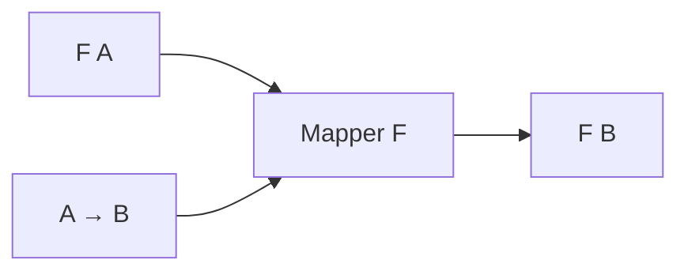

# 31장. Higher-Kinded Types


제네릭 함수는 `Int`나 `String` 같은 값의 타입을 매개변수로 받았다.
하지만 `List[A]`, `Option[A]`, `Either[E, A]`의 변환에도 비슷한 구조가 반복된다.
원소 타입뿐 아니라 그 원소를 둘러싼 타입 생성자까지 매개변수로 받으면 이런 공통 구조를 표현할 수
있다.

이번 장은 `F[_]`를 읽는 방법과 타입 람다의 역할을 다룬다.
고차 타입은 고차 함수와 이름이 비슷하지만 다른 층의 개념이다.
Scala에서 실제로 구현 가능한 추상화와 표준 Python 타입 체계에서 직접 표현하기 어려운 부분을
분리한다.

---

## 1. 개념과 기본 구분

### 값의 타입과 타입 생성자

`Int`는 정수값의 타입이다.
`List[Int]`는 정수 목록값의 타입이다.
`List`는 원소 타입을 받아 목록 타입을 만드는 타입 생성자로 볼 수 있다.

```text
Int                  값의 타입
List[Int]            값의 타입
List                 타입 -> 타입
Either               타입 × 타입 -> 타입
```

타입 생성자에 필요한 타입 인자를 공급하면 값을 분류하는 완성된 타입이 된다.
이 관계를 값 수준의 함수 적용과 비슷한 방식으로 읽을 수 있다.
그러나 타입을 계산하는 구조와 런타임 값을 계산하는 함수는 구분해야 한다.

### 카인드의 직관

타입의 형태를 분류하는 개념을 카인드라고 부른다.
전통적인 설명에서는 값의 타입을 `*`, 한 타입을 받아 타입을 만드는 생성자를 `* -> *`처럼
표시한다.
이 표기는 개념 설명이며 모든 언어에서 그대로 사용하는 소스 문법은 아니다.

### `F[_]`

Scala의 `F[_]`는 한 타입 인자를 받는 타입 생성자를 매개변수로 받는다는 뜻이다.
`F[Int]`는 그 생성자에 `Int`를 적용한 타입이다.
`F`가 `List`이면 `List[Int]`, `Option`이면 `Option[Int]`가 된다.

### 고차 함수와의 차이

고차 함수는 함수값을 받거나 반환한다.
고차 타입 추상화는 타입 생성자를 매개변수로 다룬다.
둘을 함께 사용할 수 있지만 하나를 사용했다고 다른 하나가 자동으로 필요한 것은 아니다.

---

## 2. 명령형 스타일과 함수형 스타일

### 컨텍스트마다 반복되는 변환

```scala
def mapList[A, B](values: List[A])(f: A => B): List[B] = values.map(f)
def mapOption[A, B](value: Option[A])(f: A => B): Option[B] = value.map(f)
```

두 함수는 서로 다른 컨텍스트 안의 값을 변환한다.
반환 타입은 입력과 같은 컨텍스트를 유지한다.
이 공통 관계를 표현하려면 원소 타입 `A`, `B`뿐 아니라 컨텍스트 `F`도 추상화해야 한다.

### 타입 생성자 매개변수

```scala
trait Mapper[F[_]]:
  def map[A, B](value: F[A])(f: A => B): F[B]
```

이 계약은 어떤 `F`에 대해 내부 값의 타입을 바꾸는 연산을 요구한다.
`List`와 `Option`은 각각 자신에게 맞는 구현을 제공한다.
자료구조마다 평가 시점과 원소 수의 의미가 같아지는 것은 아니다.

### 두 인자를 받는 생성자

`Either[E, A]`는 두 타입 인자를 받는다.
한 인자 형태가 필요한 자리에 사용하려면 오류 타입 `E`를 먼저 고정할 수 있다.
이것은 값의 부분 적용이 아니라 타입 생성자의 일부 인자를 정하는 작업이다.

```text
Either[String, A]
  A만 바뀌는 타입 생성자
```

### 타입 정보를 지우는 대안

모든 컨테이너를 `Any`로 받으면 겉으로는 범용 함수를 만들 수 있다.
하지만 입력과 출력이 같은 컨텍스트라는 관계를 잃는다.
고차 타입은 이런 관계를 정적으로 표현하는 도구다.

---

## 3. 왜 이 개념을 사용하는가?

### 공통 알고리즘의 표현

컨텍스트 안의 값을 두 번 변환하거나 변환 함수를 들어 올리는 알고리즘을 공통으로 작성할 수 있다.
각 자료구조의 실제 변환은 인스턴스에 맡긴다.
알고리즘과 컨텍스트의 구체적인 구현이 분리된다.

### 라이브러리 설계

Functor, Applicative, Monad 같은 계약은 `F[A]` 형태의 공통 연산을 설명한다.
고차 타입은 그런 계약을 한 번 정의하는 데 사용된다.
이 장은 문법과 타입 관계를 다루며 구체적인 법칙은 다음 장에서 다룬다.

### 효과의 추상화

계산이 `Option`, `Either`, IO 같은 서로 다른 컨텍스트에서 결과를 만들 수 있다.
고차 타입 매개변수는 그 컨텍스트를 추상화할 수 있게 한다.
하지만 각 컨텍스트의 실패, 실행, 취소 의미가 사라지는 것은 아니다.

### 타입 오류의 위치

한 타입 인자를 기대하는 자리에 두 인자 생성자를 그대로 전달하면 형태가 맞지 않는다.
이런 오류는 값의 잘못된 타입과 다른 층의 연결 오류다.
어떤 타입 인자를 고정하고 어떤 인자를 바꿀지 명확히 적으면 이해하기 쉽다.

### 필요한 곳에만 일반화

실제 코드가 목록만 사용하고 다른 컨텍스트가 필요하지 않으면 `List` 전용 함수가 더 단순할 수
있다.
고차 타입 추상화는 재사용할 구조가 있을 때 가치가 있다.
추상화의 일반성보다 사용자가 읽을 수 있는 계약을 우선한다.

---

## 4. Scala에서의 표현

### Scala의 생성자 추상화와 타입 람다

다음 프로그램은 `List`, `Option`, 오류 타입을 고정한 `Either`를 같은 계약으로 변환한다.
두 번 변환하는 알고리즘은 각 컨텍스트의 세부 구현을 알지 못한다.
아직 법칙을 요구하지 않는 `Mapper`이므로 이름만으로 Functor의 모든 성질을 보장하지는 않는다.

<!-- executable:scala -->
```scala
object Chapter31:
  trait Mapper[F[_]]:
    def map[A, B](value: F[A])(f: A => B): F[B]

  given listMapper: Mapper[List] with
    def map[A, B](value: List[A])(f: A => B): List[B] = value.map(f)

  given optionMapper: Mapper[Option] with
    def map[A, B](value: Option[A])(f: A => B): Option[B] = value.map(f)

  type ErrorOr[A] = Either[String, A]

  given errorMapper: Mapper[ErrorOr] with
    def map[A, B](value: ErrorOr[A])(f: A => B): ErrorOr[B] = value.map(f)

  def twice[F[_], A](value: F[A])(f: A => A)(using mapper: Mapper[F]): F[A] =
    mapper.map(mapper.map(value)(f))(f)

  def lift[F[_], A, B](f: A => B)(using mapper: Mapper[F]): F[A] => F[B] =
    value => mapper.map(value)(f)

  def check(): Unit =
    assert(twice[List, Int](List(1, 2, 3))(_ + 1) == List(3, 4, 5))
    assert(twice[Option, Int](Some(3))(_ * 2) == Some(12))
    assert(twice[Option, Int](None)(_ * 2).isEmpty)
    assert(twice[ErrorOr, Int](Right(3))(_ + 1) == Right(5))
    assert(twice[ErrorOr, Int](Left("missing"))(_ + 1) == Left("missing"))

    val renderList = lift[List, Int, String](value => s"n=$value")
    val renderOption = lift[Option, Int, String](value => s"n=$value")
    assert(renderList(List(1, 2)) == List("n=1", "n=2"))
    assert(renderOption(Some(3)) == Some("n=3"))
    assert(renderOption(None).isEmpty)

    val fixedError: Mapper[[A] =>> Either[String, A]] = summon[Mapper[ErrorOr]]
    assert(fixedError.map(Right(4))(_ * 2) == Right(8))
    assert(fixedError.map[Int, Int](Left("bad"))(_ * 2) == Left("bad"))

    var calls = 0
    val increment: Int => Int = value =>
      calls += 1
      value + 1
    assert(twice[Option, Int](None)(increment).isEmpty)
    assert(calls == 0)
    assert(twice[Option, Int](Some(1))(increment) == Some(3))
    assert(calls == 2)
```

### 타입 람다 읽기

`[A] =>> Either[String, A]`는 타입 `A`를 받아 `Either[String, A]`를 만드는 타입 수준의 함수다.
런타임 람다 `a => ...`와 다른 문법이다.
이름 있는 `ErrorOr[A]` 별칭과 같은 생성자 형태를 표현한다.

### `lift`의 의미

일반 함수 `A -> B`를 컨텍스트 안에서 동작하는 `F[A] -> F[B]`로 바꾼다.
새로운 외부 효과를 자동으로 만들거나 실행하는 연산은 아니다.
정확히 어떤 컨텍스트로 들어 올리는지 타입을 읽어야 한다.

### 호출 횟수의 차이

`None`에서는 변환 함수가 호출되지 않는다.
`Some`에서는 두 번의 변환이 수행된다.
고차 타입으로 알고리즘을 일반화해도 컨텍스트의 실행 의미는 그대로 중요하다.

---

## 5. 상태 변경보다 값 변환

### 두 층의 흐름

값 수준에서는 입력값이 변환 함수를 거쳐 새 값이 된다.
타입 수준에서는 `F[A]`가 `F[B]`로 바뀐다.
컨텍스트 생성자 `F`는 유지되고 원소 타입만 바뀌는 관계를 표현한다.



그림은 `F`의 내부가 반드시 상자 하나라는 뜻은 아니다.
목록은 여러 값, 선택값은 0개 또는 1개, 함수는 환경을 기다리는 계산일 수 있다.
공통 타입 관계와 구체적인 표현을 구분한다.

### 생성자의 인자 위치

`Either[E, A]`에서 오른쪽을 바꾸는 생성자와 왼쪽을 바꾸는 생성자는 다른 선택이다.
어떤 인자를 고정했는지 타입 람다에 드러난다.
같은 원래 타입 생성자를 사용해도 서로 다른 변환 계약을 만들 수 있다.

### 중첩 컨텍스트

`List[Option[A]]`처럼 컨텍스트를 중첩할 수 있다.
바깥 목록과 안쪽 선택값의 연산을 각각 이해해야 한다.
고차 타입은 중첩의 의미를 지우지 않으며 변환 위치를 더 정확히 적는 도구다.

---

## 6. 함수 합성과 데이터 흐름

### 타입 생성자의 합성

`F[G[A]]`는 두 생성자를 중첩한 형태다.
각각의 변환 연산이 있으면 두 층을 유지하면서 내부 값을 바꾸는 방법을 만들 수 있다.
Functor 장에서는 이런 합성을 법칙과 함께 다룬다.

```text
A -> B
  G 내부에서 변환
G[A] -> G[B]
  F 내부에서 변환
F[G[A]] -> F[G[B]]
```

### 값 함수의 합성과 비교

값 함수 합성은 실행할 계산의 연결이다.
타입 생성자 합성은 값들이 어떤 형태의 타입으로 분류되는지 설명한다.
둘이 비슷한 기호를 사용해도 같은 수준의 연산은 아니다.

### 추상화가 요구하는 최소 연산

`Mapper`만 있으면 내부 값을 변환할 수 있다.
빈 컨텍스트를 만들거나 값을 넣거나 두 컨텍스트를 결합하는 연산은 아직 없다.
추가 기능에는 별도의 계약이 필요하다.
이 차이가 Functor, Applicative, Monad의 구분으로 이어진다.

### 법칙을 추가하는 이유

동일한 시그니처를 가진 구현이 원소를 버리거나 결과를 중복할 수 있다.
정확한 추론을 하려면 타입 모양 외에 행동의 법칙을 요구해야 한다.
고차 타입은 법칙을 적을 수 있는 구조이지 그 법칙의 자동 증명이 아니다.

---

## 7. 장점과 트레이드오프

### 장점과 트레이드오프

| 선택 | 장점 | 주의점 |
| --- | --- | --- |
| `F[_]` 추상화 | 컨텍스트 공통 구조 | 타입 문법의 학습 비용 |
| 타입 람다 | 일부 타입 인자 고정 | 고정 위치의 혼동 |
| 생성자 합성 | 중첩 구조 설명 | 실행 의미는 여전히 다름 |
| 공통 연산 사전 | 알고리즘 재사용 | 법칙과 인스턴스 검토 |
| 구체 타입 유지 | 단순하고 직접적 | 반복 구현 가능 |

### 복잡한 오류 메시지

타입 생성자와 타입 람다가 중첩되면 컴파일 오류가 길어질 수 있다.
이름 있는 별칭과 중간 타입 주석으로 관계를 드러낸다.
한 줄의 매우 일반적인 표현보다 독자가 추적할 수 있는 단계가 낫다.

### 라이브러리 경계

애플리케이션의 모든 함수가 `F[_]`를 받아야 하는 것은 아니다.
컨텍스트를 바꿔 재사용할 실제 요구가 있는 경계에 적용한다.
구체적인 구현과 일반적인 인터페이스를 적절히 나눌 수 있다.

### 런타임 비용

고차 타입은 타입 수준의 표현이지만 그 구현에 사전 객체와 함수 호출이 사용될 수 있다.
타입 추상화가 소거되는 것과 모든 런타임 래퍼가 제거되는 것은 다르다.
실제 비용은 언어 구현과 프로그램 형태를 확인해야 한다.

---

## 8. 상태와 부수효과의 경계

### 효과 컨텍스트의 의미

`F`를 바꿀 수 있다는 사실만으로 `Option`, `Either`, IO의 실행 정책을 무시할 수는 없다.
값이 없을 수 있는 계산과 나중에 실행할 효과는 다른 의미를 가진다.
공통 연산만 사용하는 알고리즘과 외부 실행 경계를 분리한다.

### 숨은 전역 의존성

인스턴스가 전역 상태를 읽으면 같은 타입의 연산도 실행마다 다른 결과를 낼 수 있다.
법칙을 기대하는 인스턴스에는 필요한 순수성과 입력 계약을 명시한다.
고차 타입은 효과를 자동으로 차단하는 장치가 아니다.

### 오류와 취소

컨텍스트를 추상화한 API가 취소나 자원 정리를 요구한다면 `Mapper`만으로는 부족하다.
필요한 능력을 더 정확한 계약으로 표현해야 한다.
함수 시그니처를 일반화하면서 중요한 실행 보장을 잃지 않는다.

### 테스트 대체

실제 효과 대신 테스트 컨텍스트를 넣는 설계가 가능하다.
그러나 테스트 인스턴스가 실제 실행의 실패와 동시성 의미를 얼마나 반영하는지 확인해야 한다.
타입이 맞는 대체가 모든 행동을 같은 수준으로 검증하는 것은 아니다.

---

## 9. Python에서 적용하기

### Python에서 가능한 명시적 대안

표준 Python 타입 매개변수는 Scala의 `F[_]`를 직접 대체하지 않는다.
구체적인 목록·선택값 변환을 유지하거나 완성된 값 타입에 대한 연산 함수를 전달할 수 있다.
아래 예제는 두 방식을 보여 주며 일반적인 고차 타입 사전을 구현했다고 주장하지 않는다.

<!-- executable:python -->
```python
from collections.abc import Callable
from dataclasses import dataclass
from typing import Generic, TypeVar

A = TypeVar("A")
B = TypeVar("B")
C = TypeVar("C")


@dataclass(frozen=True)
class Box(Generic[A]):
    value: A


class ListMapper:
    def map(self, values: list[A], function: Callable[[A], B]) -> list[B]:
        return [function(value) for value in values]


class OptionalMapper:
    def map(self, value: A | None, function: Callable[[A], B]) -> B | None:
        return None if value is None else function(value)


def map_box(value: Box[A], function: Callable[[A], B]) -> Box[B]:
    return Box(function(value.value))


def apply_twice(value: C, operation: Callable[[C], C]) -> C:
    return operation(operation(value))


def lift_list(function: Callable[[A], B]) -> Callable[[list[A]], list[B]]:
    return lambda values: [function(value) for value in values]


def lift_optional(function: Callable[[A], B]) -> Callable[[A | None], B | None]:
    return lambda value: None if value is None else function(value)


def test_concrete_families() -> None:
    lists = ListMapper()
    options = OptionalMapper()
    assert lists.map([1, 2, 3], lambda value: value + 1) == [2, 3, 4]
    assert options.map(3, lambda value: value * 2) == 6
    assert options.map(None, lambda value: value * 2) is None
    assert map_box(Box(3), lambda value: str(value)) == Box("3")
    increment_list = lift_list(lambda value: value + 1)
    increment_optional = lift_optional(lambda value: value + 1)
    assert apply_twice([1, 2], increment_list) == [3, 4]
    assert apply_twice(3, increment_optional) == 5
    assert apply_twice(None, increment_optional) is None
    assert lift_list(str)([1, 2]) == ["1", "2"]
    assert lift_optional(str)(3) == "3"
    assert lift_optional(str)(None) is None


def test_context_semantics() -> None:
    calls: list[int] = []

    def increment(value: int) -> int:
        calls.append(value)
        return value + 1

    operation = lift_optional(increment)
    assert apply_twice(None, operation) is None
    assert calls == []
    assert apply_twice(1, operation) == 3
    assert calls == [1, 2]


if __name__ == "__main__":
    test_concrete_families()
    test_context_semantics()
```

### 대안이 보존하는 것과 잃는 것

`apply_twice`는 완성된 값 타입 `C`를 유지하는 연산을 두 번 적용한다.
`C`가 어떤 생성자 `F`와 원소 `A`로 나뉜다는 관계는 표현하지 않는다.
타입을 지우지 않는 실용적인 대안이지만 Scala 예제와 같은 일반성은 아니다.

---

## 10. Python의 표현 한계

### 타입 변수의 적용

일반적인 `TypeVar`를 타입 생성자처럼 받아 임의로 `F[A]`를 쓰는 방식은 표준적인 직접 대응이
아니다.
문법이 파싱된다는 사실과 정적 타입 관계가 올바르게 지원된다는 사실도 다르다.
가상의 Python 고차 타입 문법을 실행 가능한 코드로 제시하지 않는다.

### 고급 인코딩

특정 라이브러리와 검사 도구 확장을 통해 고차 타입과 유사한 인코딩을 만들 수 있다.
그 경우 전용 래퍼, 규칙, 플러그인에 대한 의존성이 생길 수 있다.
이 책의 표준 라이브러리 예제는 그런 기능을 전제로 하지 않는다.

### 프로토콜의 범위

프로토콜에 제네릭 메서드를 선언할 수 있어도 임의 생성자 `F`의 모든 적용 관계가 자동 표현되는
것은 아니다.
구체적인 자료형의 메서드 계약과 생성자 수준의 추상화를 구분한다.
필요한 정밀도를 유지하는 가장 단순한 인터페이스를 선택한다.

### 실행 의미

동적 디스패치로 비슷한 호출 모양을 만들 수는 있다.
하지만 타입 관계와 법칙이 검사되는 정도는 별도다.
실행 가능성, 정적 표현력, 대수적 정확성을 각각 평가한다.

---

## 11. 핵심 정리

### 핵심 결론

고차 타입은 값의 타입뿐 아니라 타입 생성자를 매개변수로 다룬다.
`F[_]`는 컨텍스트를 유지하며 원소 타입을 바꾸는 관계를 표현하는 데 사용된다.
타입 람다는 다중 인자 생성자의 일부를 고정하는 방법을 제공한다.
Python의 실용적인 대안과 Scala의 직접적인 표현력을 구분해야 한다.

### 연습 1: 타입 층 구분

`List`, `List[Int]`, `Int`를 각각 어떻게 읽어야 하는가?

**해설.** `List`는 원소 타입을 받아 타입을 만드는 생성자다.
나머지 두 표현은 값을 분류하는 완성된 타입이다.
타입 생성과 런타임 값 계산을 구분한다.

### 연습 2: 오류 타입 고정

`Either`를 한 타입 인자를 받는 자리에서 사용하려면 무엇을 정해야 하는가?

**해설.** 두 타입 인자 중 어느 것을 고정할지 선택해야 한다.
오류를 문자열로 고정하면 `[A] =>> Either[String, A]`가 된다.
고정된 인자와 변하는 인자의 위치를 명확히 적는다.

### 연습 3: 필요한 능력

`Mapper[F]`만으로 임의의 `A`를 `F[A]`에 넣는 함수를 구현할 수 있는가?

**해설.** 제공된 연산은 이미 있는 `F[A]`의 변환뿐이다.
새 컨텍스트를 만드는 연산은 별도로 필요하다.
이 차이가 Functor와 Applicative 같은 계약을 구분한다.

### 연습 4: Python 대안의 범위

`apply_twice(value: C, operation: C -> C)`가 `F[_]` 추상화와 다른 점을 설명하라.

**해설.** 완성된 타입 `C`를 유지하지만 컨텍스트와 원소 타입의 관계를 분해하지 않는다.
실용적인 재사용은 가능하되 같은 수준의 타입 생성자 일반성은 아니다.
대안의 이득과 한계를 함께 설명해야 한다.

### 다음 장과 참고 자료

다음 장은 이 장의 변환 계약에 항등과 합성 법칙을 더한 Functor를 다룬다.
타입 모양을 넘어 어떤 행동을 기대할 수 있는지 정리한다.

[Scala 공식 문서: Type Lambdas](https://docs.scala-lang.org/scala3/reference/new-types/type-lambdas.html)
[Cats 공식 문서: Functor](https://typelevel.org/cats/typeclasses/functor.html)
[Python 타입 명세: Generics](https://typing.python.org/en/latest/spec/generics.html)
