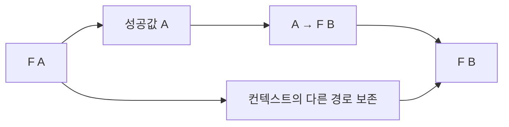

# 34장. Monad


Applicative는 미리 준비된 독립 계산들을 결합했다.
하지만 고객을 조회한 뒤 그 고객의 주문 번호로 다음 조회를 해야 하는 경우에는 앞 성공값이
필요하다.
Monad는 컨텍스트 안의 값에 의존하는 다음 계산을 연결하는 구조다.

이 장은 `pure`와 `flatMap`, 그리고 세 가지 법칙을 구체적인 조회와 목록 계산으로 설명한다.
Monad를 “상자”, “부수효과”, “순차 실행”이라는 한 단어로만 정의하지 않는다.
각 컨텍스트의 의미를 유지하면서 성공 의존적인 계산을 어떻게 조립하는지 살펴본다.

---

## 1. 개념과 기본 구분

### 다음 계산을 만드는 함수

Monad의 핵심 연결 연산은 `flatMap`이다.
컨텍스트 안의 `A`를 사용할 수 있을 때 `A -> F[B]` 함수를 실행하여 다음 컨텍스트를 얻는다.
그 결과를 한 층의 `F[B]`로 연결한다.

```text
pure: A -> F[A]
flatMap: F[A] × (A -> F[B]) -> F[B]
```

일반 `map`의 함수는 `A -> B`였다.
`flatMap`의 함수는 이미 같은 컨텍스트 안의 결과를 반환한다.
이 차이가 중첩을 만드는 변환과 다음 계산을 연결하는 변환을 구분한다.

### 컨텍스트마다 다른 연결

선택값은 부재를 전파한다.
오류 결과는 실패를 전파할 수 있다.
목록은 각 가능성에서 나온 다음 가능성들을 연결한다.
상태 계산은 앞 계산이 만든 상태를 다음 계산에 전달할 수 있다.

### 세 가지 법칙

값을 주입한 뒤 연결하면 그 값에 함수를 바로 적용한 것과 같다.
각 값을 다시 주입하는 연결은 원래 계산과 같다.
연속 연결의 괄호를 바꾸어도 같은 의미를 가져야 한다.
이 법칙은 연결의 일관성을 설명한다.

### 모든 Monad가 외부 효과는 아니다

목록이나 선택값의 순수한 계산도 Monad 구조를 가질 수 있다.
외부 I/O가 Monad의 정의에 필수인 것은 아니다.
IO는 여러 Monad 사례 중 하나이며 실행 안전성에는 추가 기능이 필요하다.

---

## 2. 명령형 스타일과 함수형 스타일

### 의존적인 조회의 중첩

```text
고객 조회
  성공한 고객의 주문 번호를 읽는다
  해당 주문 조회
    성공한 주문의 배송 정보를 읽는다
```

두 번째 조회의 입력은 첫 조회의 성공값에서 나온다.
앞 결과가 없으면 같은 방식으로 다음 조회를 수행할 수 없다.
이 의존성을 `flatMap`이 표현한다.

### `map`만 사용한 경우

`Option[Customer]`에서 주문 조회 함수를 `map`하면 `Option[Option[Order]]`가 된다.
두 층의 부재를 구분하려는 요구가 없다면 한 층으로 연결하고 싶을 수 있다.
`flatMap`은 그 컨텍스트의 연결 규칙을 사용한다.

### 명시적인 연결

```scala
findCustomer(id).flatMap(customer => findOrder(customer.orderId))
```

성공값을 다음 함수의 입력으로 전달한다.
부재에서는 그 함수가 실행되지 않는다.
코드가 짧아졌지만 어떤 조회가 생략되는지는 여전히 의미의 일부다.

### 평탄화라는 말의 한계

목록에서는 결과 목록들을 이어 붙이는 동작으로 이해하기 쉽다.
Reader나 State에서는 실제 중첩 배열을 펼치는 동작이 아니다.
`flatMap`이라는 공통 이름을 자료구조마다 다른 연결 의미로 읽어야 한다.

---

## 3. 왜 이 개념을 사용하는가?

### 데이터 의존성의 표현

앞 결과에 따라 다른 다음 계산을 선택할 수 있다.
조건부 조회, 상태 전이, 실패 가능한 파싱 흐름에 자연스럽게 사용된다.
Applicative와의 차이는 단순한 문법 길이가 아니라 다음 계산의 의존성이다.

### 반복 분기 감소

성공과 실패의 전달 구조를 공통 연산에 맡길 수 있다.
업무 함수는 성공값에서 다음 결과를 만드는 계산에 집중한다.
오류 처리 정책이 다른 컨텍스트를 무심코 섞지 않도록 주의한다.

### 조합 법칙

작은 계산을 묶거나 분리할 때 같은 의미를 기대할 수 있다.
중간 함수에 이름을 붙여 테스트하고 다시 연결하기 쉬워진다.
법칙이 성립하는 입력과 관측 범위를 명시해야 한다.

### 필요한 능력의 선택

독립적인 필드 검증에 Monad를 사용하면 첫 오류 이후의 정보를 잃을 수 있다.
모든 조합 문제를 `flatMap`으로 해결하려 하지 않는다.
데이터 의존성에 맞는 최소 구조를 선택하는 것이 중요하다.

### 제어 흐름의 모델링

`flatMap`은 앞 결과를 보고 다음 계산을 구성할 수 있게 한다.
하지만 자동 병렬 실행, 재시도, 트랜잭션, 취소를 제공하지는 않는다.
그 기능은 구체적인 컨텍스트와 실행기의 별도 계약이다.

---

## 4. Scala에서의 표현

### Scala의 작은 Monad 계약

이 예제는 세 가지 기본 연산 관계를 설명하는 학습용 인터페이스다.
실제 라이브러리의 스택 안전한 반복이나 효과 관리 기능 전체를 구현한 것은 아니다.
목록과 선택값, 오류 결과의 구체적인 연결을 비교한다.

<!-- executable:scala -->
```scala
object Chapter34:
  trait Monad[F[_]]:
    def pure[A](value: A): F[A]
    def flatMap[A, B](value: F[A])(f: A => F[B]): F[B]
    def map[A, B](value: F[A])(f: A => B): F[B] =
      flatMap(value)(a => pure(f(a)))

  given optionMonad: Monad[Option] with
    def pure[A](value: A): Option[A] = Some(value)
    def flatMap[A, B](value: Option[A])(f: A => Option[B]): Option[B] = value.flatMap(f)

  given listMonad: Monad[List] with
    def pure[A](value: A): List[A] = List(value)
    def flatMap[A, B](value: List[A])(f: A => List[B]): List[B] = value.flatMap(f)

  type ErrorOr[A] = Either[String, A]
  given errorMonad: Monad[ErrorOr] with
    def pure[A](value: A): ErrorOr[A] = Right(value)
    def flatMap[A, B](value: ErrorOr[A])(f: A => ErrorOr[B]): ErrorOr[B] = value.flatMap(f)

  def kleisliCompose[F[_], A, B, C](first: A => F[B], second: B => F[C])(using M: Monad[F]): A => F[C] =
    a => M.flatMap(first(a))(second)

  def flatten[F[_], A](nested: F[F[A]])(using M: Monad[F]): F[A] =
    M.flatMap(nested)(identity)

  final case class Customer(id: Int, orderId: Int)
  val customers = Map(1 -> Customer(1, 10), 2 -> Customer(2, 99))
  val orders = Map(10 -> "O-10")

  def findCustomer(id: Int): Option[Customer] = customers.get(id)
  def findOrder(customer: Customer): Option[String] = orders.get(customer.orderId)

  def check(): Unit =
    val lookup = kleisliCompose[Option, Int, Customer, String](findCustomer, findOrder)
    assert(lookup(1) == Some("O-10"))
    assert(lookup(2).isEmpty)
    assert(lookup(9).isEmpty)
    assert(flatten[List, Int](List(List(1, 2), Nil, List(3))) == List(1, 2, 3))
    assert(flatten[Option, Int](Some(Some(3))) == Some(3))

    val M = listMonad
    val f: Int => List[Int] = x => if x >= 0 then List(x, x + 1) else Nil
    val g: Int => List[String] = x => List(s"n=$x", s"[$x]")
    for x <- -2 to 5 do
      assert(M.flatMap(M.pure(x))(f) == f(x))
    for values <- List(Nil, List(1), List(-1, 0, 2)) do
      assert(M.flatMap(values)(x => M.pure(x)) == values)
      assert(M.flatMap(M.flatMap(values)(f))(g) == M.flatMap(values)(x => M.flatMap(f(x))(g)))

    var calls = 0
    val stopped: ErrorOr[Int] = Left("stop")
    val after = errorMonad.flatMap(stopped) { value =>
      calls += 1
      Right(value + 1)
    }
    assert(after == Left("stop"))
    assert(calls == 0)
    assert(errorMonad.map(Right(3))(_ * 2) == Right(6))
    assert(errorMonad.flatMap(Right(3))(x => if x > 2 then Right("large") else Left("small")) == Right("large"))
```

### 목록의 법칙

한 원소 목록에서 시작하면 해당 값의 다음 목록을 그대로 얻는다.
각 원소를 한 원소 목록으로 바꾸어 연결하면 원래 순서와 값이 유지된다.
연속 확장의 괄호를 바꾸어도 같은 순서의 결과를 얻는다.
외부 효과가 있는 콜백의 호출 순서는 별도로 검토해야 한다.

### 학습용 인터페이스의 범위

이 인터페이스는 실제 Cats `Monad` API 전체를 복제하지 않는다.
스택 안전한 반복을 위한 계약과 구현은 라이브러리에서 추가로 다룬다.
몇 개의 연산을 구현했다고 대규모 재귀 연결이나 취소가 자동 안전해지는 것은 아니다.

---

## 5. 상태 변경보다 값 변환

### 다음 계산의 입력

첫 계산의 성공값이 다음 함수를 선택하거나 그 인자를 결정한다.
연결된 결과는 다시 같은 컨텍스트 안에 있다.
호출자는 필요한 경계까지 컨텍스트를 유지할 수 있다.



다른 경로는 선택값의 부재나 오류 결과의 실패일 수 있다.
목록에서는 여러 가능성이 각각 다음 계산으로 이어진다.
그림을 모든 Monad가 하나의 성공·실패 구조라는 뜻으로 읽지 않는다.

### 외부 변경 없이 상태를 전달한다

State Monad는 `S -> (A, S)` 형태의 계산을 연결할 수 있다.
앞에서 만든 새 상태가 다음 계산의 입력이 된다.
공유 가변 전역 상태를 반드시 사용해야 하는 구조가 아니다.

### 함수의 반환값도 계산이다

Kleisli 합성은 `A -> F[B]`와 `B -> F[C]`를 연결하여 `A -> F[C]`를 만든다.
일반 함수 합성과 달리 중간 컨텍스트를 이어 주는 `flatMap`이 필요하다.
2부의 합성 개념이 오류와 선택의 문맥으로 확장된다.

---

## 6. 함수 합성과 데이터 흐름

### 왼쪽 항등

```text
pure(a).flatMap(f) = f(a)
```

이미 가진 값을 컨텍스트에 넣었다가 바로 연결하는 중간 단계는 의미를 추가하지 않는다.
주입과 연결의 관계가 일관되어야 한다.

### 오른쪽 항등

```text
fa.flatMap(a => pure(a)) = fa
```

얻은 값을 그대로 같은 컨텍스트에 다시 넣는 연결은 원래 의미를 유지한다.
임의의 로그나 원소 손실을 끼워 넣으면 법칙을 어길 수 있다.

### 결합법칙

```text
fa.flatMap(f).flatMap(g)
  = fa.flatMap(a => f(a).flatMap(g))
```

작은 계산을 먼저 묶거나 나중에 묶어도 같은 의미를 가진다.
이 법칙은 연산의 순서를 바꾸는 교환법칙이 아니다.
특히 상태와 외부 효과의 순서는 일반적으로 중요하다.

### Applicative와의 일관성

Monad의 연결로 독립적인 두 값을 순서대로 결합하는 연산을 유도할 수 있다.
같은 구조에 별도로 제공한 Applicative가 그 유도 결과와 일치하는지 검토해야 한다.
누적 검증의 `ap`와 첫 오류 중단 `flatMap`을 무심코 섞으면 기대한 일관성이 깨질 수 있다.

---

## 7. 장점과 트레이드오프

### 장점과 트레이드오프

| 요구 | Monad의 역할 | 별도로 필요한 것 |
| --- | --- | --- |
| 의존적 조회 | 앞 결과로 다음 계산 선택 | 외부 조회 실패 정책 |
| 오류 전파 | 성공 경로 연결 | 오류 누적과 복구 정책 |
| 상태 전달 | 새 상태를 다음 입력으로 사용 | 저장과 동시성 |
| 목록 확장 | 여러 가능성 연결 | 결과 수 제한 |
| 효과 조합 | 실행 설명 연결 | 실행기·취소·자원 관리 |

### 과도한 순차 의존성

실제로 독립적인 계산을 `flatMap`으로 중첩하면 의존적인 것처럼 보일 수 있다.
병렬화나 오류 누적의 기회를 표현에서 숨길 수 있다.
필요한 의존성만 드러내는 것이 좋은 설계다.

### 깊은 연결

단순한 함수 중첩으로 구현한 `flatMap`은 깊은 계산에서 스택 문제를 가질 수 있다.
법칙의 성립과 실행기의 스택 안전성은 다른 문제다.
실제 라이브러리의 반복 연산과 실행 모델을 확인한다.

### 이해의 순서

Monad를 추상적인 비유 하나로 외우기보다 구체적인 인스턴스의 연결을 먼저 이해한다.
그 후 공통 시그니처와 법칙을 읽으면 의미가 분명해진다.
모든 인스턴스의 세부 동작을 하나의 비유에 억지로 맞추지 않는다.

---

## 8. 상태와 부수효과의 경계

### 효과의 표현과 실행

IO 같은 컨텍스트에서는 `flatMap`이 나중에 실행할 작업의 구조를 만들 수 있다.
이미 시작된 비동기 작업에서는 다른 실행 시점을 가질 수 있다.
Monad 인터페이스만으로 그 차이가 사라지지 않는다.

### 숨은 예외

오류 결과 Monad의 콜백이 예외를 던지면 예상한 오류값 바깥으로 전파될 수 있다.
예외 포착은 해당 컨텍스트의 명시적인 계약이어야 한다.
`flatMap`이라는 이름이 모든 실패를 수집하는 것은 아니다.

### 중복 효과

목록 Monad에서 여러 가능성을 만들면 뒤 계산이 여러 번 실행될 수 있다.
그 계산이 결제나 저장이면 중복 효과가 발생할 수 있다.
순수한 가능성 열거와 실제 실행을 분리하는 경계가 필요하다.

### 트랜잭션과 취소

여러 작업을 Monad로 연결했다고 자동으로 하나의 원자적 작업이 되는 것은 아니다.
중간 실패와 취소에서 이미 수행된 효과가 남을 수 있다.
자원 정리와 보상, 멱등성은 별도로 설계한다.

---

## 9. Python에서 적용하기

### Python의 구체적인 결과 Monad

Python 예제는 성공과 오류 결과에 한정된 연결 연산을 정의한다.
임의의 타입 생성자 전체를 추상화하지 않는다.
법칙과 성공 의존적인 조회는 같은 구체적인 결과 타입 안에서 확인할 수 있다.

<!-- executable:python -->
```python
from collections.abc import Callable
from dataclasses import dataclass
from typing import Generic, TypeVar

A = TypeVar("A")
B = TypeVar("B")
C = TypeVar("C")
E = TypeVar("E")


@dataclass(frozen=True)
class Success(Generic[A]):
    value: A


@dataclass(frozen=True)
class Failure(Generic[E]):
    error: E


def pure(value: A) -> Success[A]:
    return Success(value)


def bind(value: Success[A] | Failure[E], function: Callable[[A], Success[B] | Failure[E]]) -> Success[B] | Failure[E]:
    if isinstance(value, Failure):
        return value
    return function(value.value)


def map_result(value: Success[A] | Failure[E], function: Callable[[A], B]) -> Success[B] | Failure[E]:
    return bind(value, lambda a: pure(function(a)))


def kleisli_compose(first: Callable[[A], Success[B] | Failure[E]], second: Callable[[B], Success[C] | Failure[E]]) -> Callable[[A], Success[C] | Failure[E]]:
    return lambda value: bind(first(value), second)


@dataclass(frozen=True)
class Customer:
    customer_id: int
    order_id: int


CUSTOMERS = {1: Customer(1, 10), 2: Customer(2, 99)}
ORDERS = {10: "O-10"}


def find_customer(customer_id: int) -> Success[Customer] | Failure[str]:
    value = CUSTOMERS.get(customer_id)
    return Failure("missing_customer") if value is None else Success(value)


def find_order(customer: Customer) -> Success[str] | Failure[str]:
    value = ORDERS.get(customer.order_id)
    return Failure("missing_order") if value is None else Success(value)


def test_dependent_lookup() -> None:
    lookup = kleisli_compose(find_customer, find_order)
    assert lookup(1) == Success("O-10")
    assert lookup(2) == Failure("missing_order")
    assert lookup(9) == Failure("missing_customer")


def test_laws() -> None:
    def f(value: int) -> Success[int] | Failure[str]:
        return Success(value + 1) if value >= 0 else Failure("negative")

    def g(value: int) -> Success[str] | Failure[str]:
        return Success(f"n={value}")

    for value in range(-2, 6):
        assert bind(pure(value), f) == f(value)
    cases: list[Success[int] | Failure[str]] = [Success(-1), Success(0), Success(3), Failure("stop")]
    for result in cases:
        assert bind(result, pure) == result
        assert bind(bind(result, f), g) == bind(result, lambda value: bind(f(value), g))
    assert map_result(Success(3), lambda value: value * 2) == Success(6)


def test_short_circuit() -> None:
    calls: list[int] = []

    def next_step(value: int) -> Success[int]:
        calls.append(value)
        return Success(value + 1)

    assert bind(Failure("stop"), next_step) == Failure("stop")
    assert calls == []
    assert bind(Success(1), next_step) == Success(2)
    assert calls == [1]


if __name__ == "__main__":
    test_dependent_lookup()
    test_laws()
    test_short_circuit()
```

### 함수 객체의 동등성

Kleisli 합성의 결과는 함수이므로 객체 주소를 비교하는 것으로 법칙을 확인하지 않는다.
주어진 입력에서 반환한 결과를 비교한다.
유한 입력 테스트와 모든 입력에 대한 일반적인 의미 설명을 구분한다.

---

## 10. Python의 표현 한계

### 전용 문법의 부재

Python에는 Scala의 `for` 표현식과 같은 일반적인 결과 컨텍스트 연결 문법이 기본 제공되지 않는다.
명시적인 `bind`, 작은 함수, 또는 일반적인 분기문으로 구현할 수 있다.
가독성을 위해 무리한 연산자 오버로딩을 도입할 필요는 없다.

### `async`와 Monad

Python의 `async`와 `await`는 구체적인 비동기 프로토콜이다.
문법이 비슷한 순차 흐름을 제공해도 임의의 목록·검증 결과에 같은 방식으로 적용되는 것은 아니다.
일반적인 타입 클래스 추상화와 언어의 특정 실행 기능을 구분한다.

### 스택 안전성

중첩된 람다와 재귀적 연결은 Python의 호출 스택을 사용할 수 있다.
작은 `bind` 구현만으로 긴 프로그램의 스택 안전성을 보장하지 않는다.
명시적 반복 해석기나 트램펄린이 필요한 경우는 뒤에서 다룬다.

### 효과의 법칙

콜백이 숨은 전역 상태를 변경하면 결과값 비교만으로 모든 관측을 설명할 수 없다.
효과를 컨텍스트의 명시적 데이터로 모델링하거나 관측 범위를 분명히 해야 한다.
타입 주석만으로 Monad 법칙이 자동 검증되지는 않는다.

---

## 11. 핵심 정리

### 핵심 결론

Monad는 컨텍스트 안의 값에 의존하는 다음 계산을 연결한다.
`pure`와 `flatMap`은 두 항등 법칙과 결합법칙을 만족해야 한다.
Monad는 외부 효과, 병렬 실행, 트랜잭션, 자원 안전성의 동의어가 아니다.
독립 결합과 의존 결합을 구분하여 필요한 계약을 선택한다.

### 연습 1: `map`과의 차이

`A -> F[B]` 함수를 `map`과 `flatMap`에 각각 사용하면 어떤 타입 관계가 생기는가?

**해설.** `map`은 `F[F[B]]` 같은 중첩을 만들 수 있다.
`flatMap`은 컨텍스트의 연결 규칙에 따라 `F[B]`로 이어 준다.
중첩을 보존해야 하는 의미가 있는지도 확인한다.

### 연습 2: 결합과 교환

Monad의 결합법칙이 있으니 두 저장 작업의 순서를 바꾸어도 되는가?

**해설.** 아니다. 괄호를 바꾸는 것과 실행 순서를 교환하는 것은 다르다.
상태와 외부 효과의 순서는 일반적으로 중요하다.
법칙이 허용하는 변환을 정확히 읽어야 한다.

### 연습 3: 오류 누적

독립적인 필드 검증을 첫 오류 중단 결과 Monad로 연결했다.
모든 오류를 보여 주려면 무엇을 바꿔야 하는가?

**해설.** 독립 결과를 누적하는 결합 정책을 사용해야 한다.
필요한 경우 Validation Applicative와 의존적인 후속 검사를 단계별로 나눈다.
모든 계산을 같은 `flatMap` 구조에 넣지 않는다.

### 연습 4: 대량 연결

학습용 Monad 인터페이스를 구현했으니 수십만 단계의 연결도 스택 안전하다는 주장에 반론하라.

**해설.** 대수 법칙과 실행기의 스택 사용은 다른 문제다.
구현 방식과 반복 연산의 계약을 확인해야 한다.
필요한 경우 트램펄린이나 스택 안전한 라이브러리를 사용한다.

### 다음 장과 참고 자료

다음 장은 오류 목록과 집계에서 반복해서 사용한 결합 연산 자체를 Semigroup으로 정리한다.
값의 결합법칙이 어떤 리팩터링과 분할 계산을 가능하게 하는지 살펴본다.

[Cats 공식 문서: Monad](https://typelevel.org/cats/typeclasses/monad.html)
[Cats 공식 문서: FlatMap](https://typelevel.org/cats/typeclasses/flatmap.html)
[Cats 공식 문서: Tail Recursion](https://typelevel.org/cats/api/cats/FlatMap.html)
[Python 공식 문서: typing](https://docs.python.org/3.14/library/typing.html)
