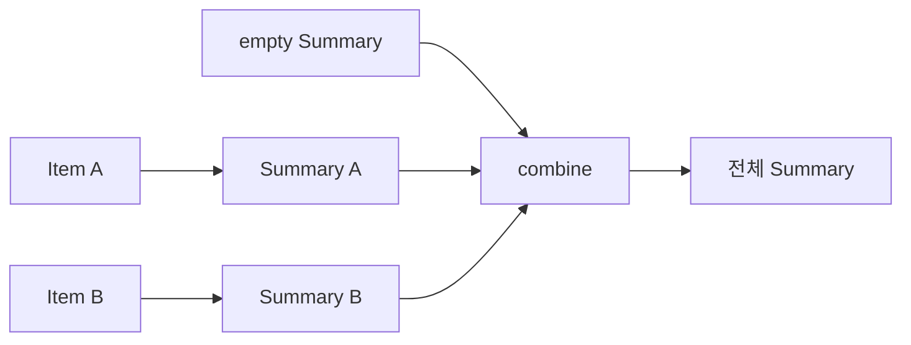

# 36장. Monoid

Semigroup은 비어 있지 않은 값들을 결합하는 구조를 제공했다.
하지만 빈 주문 목록이나 빈 처리 청크에서도 집계 결과가 필요하다.
Monoid는 결합법칙에 항등원을 더하여 빈 입력과 여러 조각의 결합을 같은 방식으로 다룬다.

이번 장은 주문 품목의 행 수, 수량, 금액, 상품 코드 집합을 하나의 요약으로 만든다.
각 품목을 요약값으로 바꾸고 그 값들을 결합하는 `foldMap`이 중심이다.
5부에서 배운 제네릭 함수와 타입 클래스, 법칙을 실제 보고서 계산으로 다시 묶는다.

---

## 1. 개념과 기본 구분

### 항등원이 있는 결합

Monoid는 결합적인 `combine`과 항등원 `empty`를 가진다.
항등원을 왼쪽이나 오른쪽에 결합해도 값이 바뀌지 않아야 한다.
Semigroup의 결합법칙도 그대로 필요하다.

```text
combine: A × A -> A
empty: A

combine(empty, a) = a
combine(a, empty) = a
```

정수 덧셈의 항등원은 0이다.
정수 곱셈의 항등원은 1이다.
같은 원시 타입이어도 선택한 연산에 따라 다른 Monoid가 된다.

### 빈 입력의 의미

아무 원소도 집계하지 않은 결과를 항등원으로 정할 수 있다.
빈 청크를 합쳐도 전체 결과가 바뀌지 않는다.
이 덕분에 분할 계산에서 빈 조각을 특별 취급하는 코드를 줄일 수 있다.

### 모든 결합에 항등원이 있는 것은 아니다

비어 있지 않은 오류 묶음 안에는 빈 묶음이 없다.
양수 개수만 허용하는 통계 안에도 개수 0의 값이 없다.
값 영역을 바꾸거나 바깥 선택값을 사용해야 Monoid를 만들 수 있는 경우가 있다.

### 항등원과 기본값

아무 편리한 기본값이 항등원인 것은 아니다.
결합했을 때 양쪽에서 값을 보존한다는 법칙을 만족해야 한다.
업무상의 기본 배송비와 집계의 항등원 0은 서로 다른 의미일 수 있다.

---

## 2. 명령형 스타일과 함수형 스타일

### 빈 입력을 따로 처리한다

```text
입력이 비었으면 별도 결과를 만든다
그렇지 않으면 첫 원소로 시작해 나머지를 합친다
```

이 방식은 Semigroup만 있을 때 자연스럽다.
하지만 항등원이 존재하면 빈 입력도 같은 fold로 처리할 수 있다.
첫 원소를 따로 꺼내는 분기가 필요 없어진다.

### 품목을 요약으로 바꾼다

```text
Item(sku, quantity, unitPrice)
  -> Summary(lines=1, units=quantity, amount=quantity*unitPrice, skus={sku})
```

각 품목을 같은 종류의 작은 통계로 변환한다.
그다음 통계끼리 필드별로 결합한다.
원본 전체 목록을 계속 들고 있을 필요가 없는 질문에 적합하다.

### `foldMap`

```text
List[A]
  각 A를 M으로 변환
  M의 empty에서 시작해 combine
M
```

변환과 집계를 분리하여 재사용할 수 있다.
최종 요약 타입의 Monoid가 전체 결합 정책을 제공한다.

### 잘못된 구분자 연결

문자열을 항상 쉼표 하나로 이어 붙이는 연산은 빈 문자열을 항등원으로 쓰기 어렵다.
빈 문자열과 `A`를 결합해도 `,A`가 되기 때문이다.
문자열 조각 목록을 먼저 모으고 마지막에 구분자로 표시하는 설계를 검토할 수 있다.

---

## 3. 왜 이 개념을 사용하는가?

### 빈 입력의 일관성

주문이 없으면 행 수와 수량, 금액은 0이고 상품 코드 집합은 비어 있다.
이 요약을 다른 요약과 합쳐도 결과가 바뀌지 않는다.
빈 입력의 의미가 연산의 법칙 안에 들어간다.

### 청크 처리

입력을 여러 청크로 나누어 각각 요약하고 요약들을 다시 합칠 수 있다.
빈 청크가 섞여도 항등원이 결과를 유지한다.
실제 분산 실행의 중복·누락과 시점 일관성은 별도로 관리해야 한다.

### 여러 통계의 결합

각 필드가 적절한 결합 구조를 가지면 레코드 전체의 결합을 구성할 수 있다.
행 수와 금액은 합, 상품 코드는 집합 합집합을 사용한다.
모든 필드가 같은 연산을 사용할 필요는 없다.

### 정책의 명시

같은 숫자라도 합계와 곱을 다른 래퍼나 인스턴스로 구분할 수 있다.
어느 연산이 선택되었는지 타입과 이름에 드러난다.
전역 기본 연산 하나로 서로 다른 의미를 숨기지 않는다.

### 테스트의 구조

항등원 양쪽과 세 값의 결합법칙을 검사한다.
전체 집계와 청크별 집계가 같은지도 확인한다.
빈 입력, 빈 청크, 중복 상품 같은 경계 사례를 포함한다.

---

## 4. Scala에서의 표현

### Scala의 주문 요약 Monoid

금액과 개수에는 임의 정밀도 정수를 사용하여 예제의 결합에서 고정 폭 오버플로를 피한다.
이 요약은 주문 행 수와 수량, 총액, 서로 다른 상품 코드를 계산한다.
세금과 할인 정책을 포함한 실제 회계 모델은 아니다.

<!-- executable:scala -->
```scala
object Chapter36:
  trait Monoid[A]:
    def empty: A
    def combine(left: A, right: A): A

  final case class Sum(value: BigInt)
  final case class Product(value: BigInt)
  final case class Item(sku: String, quantity: BigInt, unitPrice: BigInt)
  final case class Summary(lines: BigInt, units: BigInt, amount: BigInt, skus: Set[String])

  given sumMonoid: Monoid[Sum] with
    def empty: Sum = Sum(0)
    def combine(left: Sum, right: Sum): Sum = Sum(left.value + right.value)

  given productMonoid: Monoid[Product] with
    def empty: Product = Product(1)
    def combine(left: Product, right: Product): Product = Product(left.value * right.value)

  given summaryMonoid: Monoid[Summary] with
    def empty: Summary = Summary(0, 0, 0, Set.empty)
    def combine(left: Summary, right: Summary): Summary =
      Summary(left.lines + right.lines, left.units + right.units,
        left.amount + right.amount, left.skus ++ right.skus)

  def foldMap[A, M](values: List[A])(f: A => M)(using M: Monoid[M]): M =
    values.foldLeft(M.empty)((accumulated, value) => M.combine(accumulated, f(value)))

  def summarize(item: Item): Summary =
    Summary(1, item.quantity, item.quantity * item.unitPrice, Set(item.sku))

  def check(): Unit =
    val items = List(Item("A", 2, 1000), Item("B", 3, 500), Item("A", 1, 1000))
    val expected = Summary(3, 6, 4500, Set("A", "B"))
    assert(foldMap(items)(summarize) == expected)
    assert(foldMap(List.empty[Item])(summarize) == summaryMonoid.empty)
    assert(foldMap(List[BigInt](2, 3, 4))(Sum.apply) == Sum(9))
    assert(foldMap(List[BigInt](2, 3, 4))(Product.apply) == Product(24))
    assert(foldMap(List.empty[BigInt])(Product.apply) == Product(1))

    val samples = summaryMonoid.empty :: items.map(summarize)
    for a <- samples do
      assert(summaryMonoid.combine(summaryMonoid.empty, a) == a)
      assert(summaryMonoid.combine(a, summaryMonoid.empty) == a)
      for b <- samples; c <- samples do
        assert(summaryMonoid.combine(summaryMonoid.combine(a, b), c) ==
          summaryMonoid.combine(a, summaryMonoid.combine(b, c)))

    val chunks = List(items.take(1), Nil, items.drop(1))
    val partial = chunks.map(chunk => foldMap(chunk)(summarize))
    val recombined = foldMap(partial)(identity)
    assert(recombined == expected)
    val amounts = items.map(item => item.quantity * item.unitPrice)
    assert(foldMap(amounts)(Sum.apply) == foldMap(items)(item => Sum(item.quantity * item.unitPrice)))

    def badJoin(left: String, right: String): String = s"$left,$right"
    assert(badJoin("", "A") != "A")
    assert(badJoin("A", "") != "A")
```

### 곱 구조의 Monoid

`Summary`는 여러 통계를 함께 가진 곱 타입이다.
각 필드의 항등원과 결합을 조합하여 전체 레코드의 항등원과 결합을 만든다.
필드 간 관계가 추가되면 그 관계가 결합 후에도 유지되는지 별도로 확인해야 한다.

### 요약의 정보 손실

상품 코드 집합은 중복을 제거한다.
행 수와 전체 수량은 따로 보존하지만 각 상품별 수량은 보존하지 않는다.
필요한 질문이 달라지면 요약 타입도 달라져야 한다.

---

## 5. 상태 변경보다 값 변환

### 값에서 요약으로

각 품목은 하나의 요약값으로 변환된다.
요약값들은 같은 타입의 결합 연산으로 누적된다.
마지막 결과를 표시하거나 저장하는 일은 다른 단계다.



계산 단계에서 보고서 문자열을 바로 만들지 않으면 다른 출력에도 재사용할 수 있다.
숫자와 집합의 의미를 마지막까지 유지한다.
표시 형식은 최종 경계에서 선택한다.

### 빈값과 부재

빈 요약은 계산할 품목이 없었다는 정상 결과다.
조회 자체가 실패하여 데이터를 얻지 못한 경우와 다르다.
외부 실패를 빈 요약으로 바꾸면 장애를 숨길 수 있다.

### 입력 보존

예제는 입력 품목을 바꾸지 않고 새 요약을 만든다.
결합 인스턴스가 가변 구조를 사용할 때는 원본과의 공유를 주의해야 한다.
대수 법칙과 객체 수명·별칭은 별도의 검토 대상이다.

---

## 6. 함수 합성과 데이터 흐름

### `foldMap`의 항등

빈 목록은 Monoid의 `empty`로 집계된다.
한 원소 목록은 그 원소를 변환한 결과와 같다.
두 목록을 이어 붙인 집계는 각 목록의 집계를 결합한 결과와 일치한다.

```text
foldMap([]) = empty
foldMap(xs ++ ys) = combine(foldMap(xs), foldMap(ys))
```

이 관계는 분할 집계의 핵심이다.
변환과 결합이 순수하고 같은 입력 의미를 사용한다는 전제를 확인한다.

### 순서와 교환성

일반적인 Monoid는 교환법칙을 요구하지 않는다.
문자열과 로그 목록은 순서를 유지해야 한다.
예제 요약의 일부 연산이 교환적이라고 모든 Monoid의 순서를 바꿔도 된다고 일반화하지 않는다.

### 선택적인 최대값

빈 입력에 최대값이 없으면 `Option[A]`를 사용해 부재를 항등원으로 삼는 결합을 설계할 수 있다.
임의의 0을 최대값의 항등원으로 쓰면 음수 데이터에서 잘못될 수 있다.
값 영역과 빈 입력 의미를 먼저 정한다.

### 구조의 재사용

오류 누적, 텍스트 조각, 통계, 설정 병합에도 Monoid 관점을 적용할 수 있다.
설정 병합에서는 충돌 우선순위가 법칙에 영향을 줄 수 있다.
이름이 병합이라고 모두 같은 대수 구조는 아니다.

---

## 7. 장점과 트레이드오프

### 장점과 트레이드오프

| 선택 | 이점 | 검토할 점 |
| --- | --- | --- |
| 항등원 | 빈 입력 처리 통일 | 진짜 항등원인지 |
| `foldMap` | 변환과 집계의 분리 | 변환의 효과 |
| 청크 요약 | 분할 계산 가능 | 중복·누락과 순서 |
| 레코드 결합 | 여러 통계 동시 계산 | 필드 관계의 보존 |
| 집합 필드 | 중복 제거 | 순서와 빈도 손실 |

### 항등원의 생성 비용

빈 자료구조를 만드는 비용이 작을 수 있지만 모든 항등원이 단순한 리터럴은 아니다.
가변 객체를 하나의 전역 항등원으로 공유하면 변경으로 법칙이 깨질 수 있다.
필요하면 새 빈값을 생성하거나 불변 값을 사용한다.

### 집계의 크기

합계와 개수는 작은 요약이지만 상품 코드 집합은 서로 다른 코드 수만큼 커질 수 있다.
Monoid를 사용했다고 모든 요약이 상수 크기가 되는 것은 아니다.
정보 요구와 메모리 비용을 함께 확인한다.

### 수치 표현

임의 정밀도 정수는 크기에 따른 연산 비용이 있다.
부동소수점으로 바꾸면 재결합 시 정확한 동등성이 달라질 수 있다.
값의 범위와 정밀도, 재현성 요구에 맞춰 선택한다.

---

## 8. 상태와 부수효과의 경계

### 재시도와 중복 집계

같은 청크를 두 번 합치면 합계와 개수가 두 번 증가한다.
Monoid 법칙은 중복 처리를 자동으로 제거하지 않는다.
멱등성은 별도의 성질이며 저장·전송 프로토콜과 함께 검토해야 한다.

### 분산 결과의 누락

어떤 청크가 실패했는데 항등원으로 대체하면 전체가 성공한 것처럼 보일 수 있다.
빈 청크와 실패한 청크를 구분한다.
효과 결과를 먼저 확인한 뒤 유효한 요약을 결합해야 한다.

### 시점과 출처

요약이 서로 다른 데이터 버전에서 만들어졌다면 의미 있는 전체 결과가 아닐 수 있다.
필요한 경우 스냅샷 버전과 기준 시간을 함께 관리한다.
결합법칙은 데이터의 출처 일관성을 보장하지 않는다.

### 저장의 원자성

계산된 요약을 저장하는 과정은 외부 효과다.
동시 갱신과 실패에서 덮어쓰기나 중복 누적이 일어나지 않도록 별도 정책을 둔다.
순수한 집계와 저장 프로토콜을 분리한다.

---

## 9. Python에서 적용하기

### Python의 `fold_map`

Python에서는 Monoid 객체를 명시적으로 전달하여 결합 정책을 선택한다.
같은 정수 타입의 합과 곱도 서로 다른 인스턴스로 사용한다.
반환되는 요약은 불변 데이터 클래스와 `frozenset`으로 표현한다.

<!-- executable:python -->
```python
from collections.abc import Callable, Iterable
from dataclasses import dataclass
from typing import Protocol, TypeVar

A = TypeVar("A")
M = TypeVar("M")


class Monoid(Protocol[M]):
    def empty(self) -> M:
        ...

    def combine(self, left: M, right: M) -> M:
        ...


class SumMonoid:
    def empty(self) -> int:
        return 0

    def combine(self, left: int, right: int) -> int:
        return left + right


class ProductMonoid:
    def empty(self) -> int:
        return 1

    def combine(self, left: int, right: int) -> int:
        return left * right


@dataclass(frozen=True)
class Item:
    sku: str
    quantity: int
    unit_price: int


@dataclass(frozen=True)
class Summary:
    lines: int
    units: int
    amount: int
    skus: frozenset[str]


class SummaryMonoid:
    def empty(self) -> Summary:
        return Summary(0, 0, 0, frozenset())

    def combine(self, left: Summary, right: Summary) -> Summary:
        return Summary(left.lines + right.lines, left.units + right.units,
                       left.amount + right.amount, left.skus | right.skus)


def fold_map(values: Iterable[A], transform: Callable[[A], M], instance: Monoid[M]) -> M:
    result = instance.empty()
    for value in values:
        result = instance.combine(result, transform(value))
    return result


def summarize(item: Item) -> Summary:
    return Summary(1, item.quantity, item.quantity * item.unit_price, frozenset({item.sku}))


def test_summary() -> None:
    items = [Item("A", 2, 1000), Item("B", 3, 500), Item("A", 1, 1000)]
    instance = SummaryMonoid()
    expected = Summary(3, 6, 4500, frozenset({"A", "B"}))
    assert fold_map(items, summarize, instance) == expected
    assert fold_map([], summarize, instance) == instance.empty()
    assert fold_map([2, 3, 4], lambda value: value, SumMonoid()) == 9
    assert fold_map([2, 3, 4], lambda value: value, ProductMonoid()) == 24
    assert fold_map([], lambda value: value, ProductMonoid()) == 1
    samples = [instance.empty()] + [summarize(item) for item in items]
    for a in samples:
        assert instance.combine(instance.empty(), a) == a
        assert instance.combine(a, instance.empty()) == a
        for b in samples:
            for c in samples:
                assert instance.combine(instance.combine(a, b), c) == instance.combine(a, instance.combine(b, c))
    chunks = [items[:1], [], items[1:]]
    partial = [fold_map(chunk, summarize, instance) for chunk in chunks]
    assert fold_map(partial, lambda value: value, instance) == expected
    assert f"{''},{'A'}" != "A"
    assert f"{'A'},{''}" != "A"


if __name__ == "__main__":
    test_summary()
```

### 입력 반복자의 수명

`fold_map`은 입력 iterable을 한 번 소비한다.
파일이나 네트워크를 읽는 반복자라면 그 효과와 자원 수명은 호출자가 관리해야 한다.
목록을 받는 순수 계산과 외부 스트림을 읽는 실행을 같은 계약으로 과장하지 않는다.

---

## 10. Python의 표현 한계

### 명시적인 인스턴스 선택

Python 예제는 합과 곱을 함수 인자로 구분한다.
자동 문맥 탐색이 없으므로 호출 위치에 정책이 보인다.
반복 전달이 많아지면 부분 적용으로 이미 조립된 집계 함수를 만들 수 있다.

### 가변 항등원

같은 빈 리스트 객체를 여러 집계에서 공유하고 변경하면 서로 간섭할 수 있다.
항등원 메서드가 새 값을 만들거나 불변 값을 반환하도록 설계한다.
타입 주석은 이런 별칭 문제를 자동으로 막지 않는다.

### 법칙의 검사

프로토콜은 항등원과 결합 메서드의 존재를 설명한다.
양쪽 항등과 결합법칙은 별도로 확인해야 한다.
특수값과 경계값을 포함한 테스트가 유용하다.

### 제품용 집계의 범위

예제는 메모리 안의 값 결합을 구현한다.
분산 실행, 정확히 한 번 처리, 장애 복구, 데이터베이스 트랜잭션은 구현하지 않는다.
그 기능은 동일한 법칙을 활용할 수 있지만 추가 프로토콜이 필요하다.

---

## 11. 핵심 정리

### 핵심 결론

Monoid는 결합적인 연산과 양쪽 항등원을 가진다.
빈 입력과 청크 집계를 일관되게 다룰 수 있다.
`foldMap`은 각 원소를 결합 가능한 요약으로 변환하여 모으는 구조다.
중복 처리, 외부 실패, 시점 일관성은 대수 법칙과 별도로 관리해야 한다.

### 연습 1: 합과 곱

같은 정수 타입에서 합과 곱의 항등원이 다른 이유를 설명하라.

**해설.** 항등원은 타입만이 아니라 선택한 연산에 의해 정해진다.
덧셈에는 0, 곱셈에는 1이 양쪽에서 값을 보존한다.
서로 다른 의미를 인스턴스나 래퍼 타입으로 구분한다.

### 연습 2: 실패한 청크

청크 처리 실패를 빈 요약으로 바꾸어 전체를 집계했다.
어떤 정보가 사라졌는가?

**해설.** 정상적으로 비어 있었는지 데이터를 얻지 못했는지 구분할 수 없다.
실패를 먼저 처리하고 성공한 요약만 결합해야 한다.
항등원을 오류 은폐용 기본값으로 사용하지 않는다.

### 연습 3: 중복 처리

같은 요약을 두 번 합쳐도 Monoid이므로 한 번과 같다는 주장은 맞는가?

**해설.** 아니다. Monoid는 멱등성을 요구하지 않는다.
합계와 개수는 두 번 증가한다.
중복 제거와 정확한 처리 횟수는 별도의 계약이다.

### 연습 4: 정보의 충분성

전체 금액과 상품 코드 집합만으로 상품별 수량을 복원할 수 있는가?

**해설.** 일반적으로 필요한 정보가 없다.
상품별 집계를 원하면 코드별 수량 맵 같은 다른 요약을 설계해야 한다.
결합 가능한 요약도 모든 질문에 답하는 것은 아니다.

### 다음 부와 참고 자료

5부는 값과 컨텍스트를 변환하고 결합하는 공통 법칙을 정리했다.
6부는 이 구조를 환경, 상태, 로그, I/O, 비동기 실행에 적용하면서 효과의 경계를 설계한다.

[Cats 공식 문서: Monoid](https://typelevel.org/cats/typeclasses/monoid.html)
[Cats 공식 문서: Foldable](https://typelevel.org/cats/typeclasses/foldable.html)
[Python 공식 문서: Built-in Types](https://docs.python.org/3.14/library/stdtypes.html)
