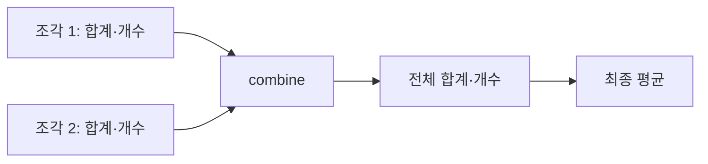

# 35장. Semigroup

앞 부에서 오류 목록을 이어 붙이고 주문의 요약값을 합쳤다.
이런 연산은 같은 종류의 두 값을 받아 다시 같은 종류의 값을 만든다.
괄호를 바꾸어도 결과가 같다는 결합법칙이 있으면 Semigroup이라는 공통 구조로 설명할 수 있다.

이번 장은 비어 있지 않은 오류 묶음과 평균 계산용 통계를 사용한다.
결합법칙과 교환법칙, 항등원의 존재를 구분하는 것이 중요하다.
부동소수점 덧셈과 평균의 평균이 왜 주의가 필요한지도 실행 가능한 반례로 확인한다.

---

## 1. 개념과 기본 구분

### 닫힌 결합 연산

Semigroup은 같은 타입의 두 값을 같은 타입의 값으로 결합하는 연산을 가진다.
그 연산은 결합법칙을 만족해야 한다.
여기서 닫혀 있다는 말은 결과가 같은 값 영역 안에 남는다는 뜻이다.

```text
combine: A × A -> A

combine(combine(a, b), c)
  = combine(a, combine(b, c))
```

합법적인 입력을 결합했는데 범위를 벗어나 실패할 수 있다면 그 실패를 어떻게 모델링하는지 확인해야
한다.
아무 정수 연산이나 시그니처만 맞춘다고 자동으로 Semigroup이 되는 것은 아니다.
값 영역과 연산의 실제 정의를 함께 정한다.

### 결합과 교환

결합법칙은 괄호의 위치를 바꾸는 법칙이다.
교환법칙은 두 값의 순서를 바꾸는 법칙이다.
문자열 연결은 결합적이지만 일반적으로 교환적이지 않다.

### 항등원은 필수가 아니다

Semigroup은 아무것도 결합하지 않은 결과를 요구하지 않는다.
비어 있지 않은 오류 묶음에는 자연스러운 빈 오류값이 그 타입 안에 없을 수 있다.
빈 입력을 다루는 추가 구조는 다음 장의 Monoid에서 다룬다.

### 구현과 법칙

타입 클래스는 결합 연산의 시그니처를 표현한다.
컴파일러가 임의의 구현에 대해 결합법칙을 자동 증명하지는 않는다.
정의에 대한 설명과 법칙 테스트를 함께 제공해야 한다.

---

## 2. 명령형 스타일과 함수형 스타일

### 임의의 순차 집계

```text
현재 결과와 다음 값을 차례로 결합한다
```

순차적인 `foldLeft`는 결합법칙이 없는 연산도 사용할 수 있다.
하지만 입력을 나누어 각 조각을 집계한 뒤 합치려면 괄호가 바뀔 수 있다.
이때 원래 결과와 같다는 근거가 필요하다.

### 문자열의 결합

```text
("A" + "B") + "C" = "A" + ("B" + "C")
"A" + "B" != "B" + "A"
```

조각을 묶는 순서는 바꿀 수 있어도 원소의 상대적 순서를 마음대로 바꾸면 안 된다.
분산 로그나 보고서의 순서가 중요한 이유다.

### 평균을 바로 합치는 실수

평균 100인 한 개의 값과 평균 0인 아홉 개의 값을 합치면 전체 평균은 10이다.
두 평균만 평균내면 50이 된다.
각 조각의 크기 정보가 사라졌기 때문이다.

### 결합 가능한 충분한 정보

합계와 개수를 함께 보관하면 두 통계를 더해 전체 통계를 만들 수 있다.
평균은 마지막에 계산한다.
이렇게 중간 표현을 바꾸면 올바른 결합 연산을 얻을 수 있다.

```text
(sum1, count1) + (sum2, count2)
  = (sum1 + sum2, count1 + count2)
```

---

## 3. 왜 이 개념을 사용하는가?

### 분할 계산의 근거

입력을 여러 묶음으로 나누어도 같은 결합 의미를 유지할 수 있다.
큰 입력의 청크 처리와 재사용 가능한 요약에 도움이 된다.
실제 병렬 실행의 안전성은 효과와 자료구조에 대한 별도 검토가 필요하다.

### 오류 누적의 일관성

비어 있지 않은 오류 묶음을 결합하여 다시 비어 있지 않은 묶음을 만들 수 있다.
괄호를 바꾸어도 오류 순서가 유지된다.
Validation의 조합이 일정한 결과를 만드는 기반이다.

### 도메인 요약의 설계

최종 결과만 보관하면 결합에 필요한 정보를 잃을 수 있다.
평균처럼 합계와 개수를 함께 유지하는 요약을 설계한다.
어떤 정보가 다른 요약과 결합하는 데 필요한지 살펴보는 것이 중요하다.

### 법칙 기반 검토

대표 값 세 개를 여러 조합으로 시험하여 결합법칙 위반을 찾을 수 있다.
경계값과 특수값을 포함하면 수치나 문자열 정책의 문제를 발견하기 쉽다.
유한 테스트와 수학적 설명의 역할을 구분한다.

### 최소 계약

비어 있지 않은 입력만 처리하는 알고리즘에는 항등원이 필요하지 않을 수 있다.
Semigroup만 요구하면 빈값이 없는 도메인도 자연스럽게 사용할 수 있다.
불필요하게 가짜 빈값을 만들지 않는다.

---

## 4. Scala에서의 표현

### Scala의 비어 있지 않은 집계

`NonEmpty`는 첫 원소를 필수로 가지므로 빈 입력을 표현하지 않는다.
`Stats`는 개수가 양수인 통계만 표현한다.
두 통계를 합치면 다시 양수 개수를 가지므로 결합 결과가 같은 영역에 남는다.

<!-- executable:scala -->
```scala
object Chapter35:
  trait Semigroup[A]:
    def combine(left: A, right: A): A

  final case class NonEmpty[A](head: A, tail: Vector[A] = Vector.empty):
    def all: Vector[A] = head +: tail

  object NonEmpty:
    def fromVector[A](values: Vector[A]): Option[NonEmpty[A]] =
      values.headOption.map(head => NonEmpty(head, values.tail))

  final case class Stats(sum: BigInt, count: BigInt):
    require(count > 0)
    def average: BigDecimal = BigDecimal(sum) / BigDecimal(count)

  given textSemigroup: Semigroup[String] with
    def combine(left: String, right: String): String = left + right

  given nonEmptySemigroup[A]: Semigroup[NonEmpty[A]] with
    def combine(left: NonEmpty[A], right: NonEmpty[A]): NonEmpty[A] =
      NonEmpty(left.head, left.tail ++ right.all)

  given statsSemigroup: Semigroup[Stats] with
    def combine(left: Stats, right: Stats): Stats =
      Stats(left.sum + right.sum, left.count + right.count)

  def reduceNonEmpty[A](values: NonEmpty[A])(using S: Semigroup[A]): A =
    values.tail.foldLeft(values.head)(S.combine)

  def check(): Unit =
    assert(reduceNonEmpty(NonEmpty("A", Vector("B", "C"))) == "ABC")
    assert(NonEmpty.fromVector(Vector.empty[Int]).isEmpty)
    assert(NonEmpty.fromVector(Vector(1, 2)).contains(NonEmpty(1, Vector(2))))
    val errors = summon[Semigroup[NonEmpty[String]]]
    val a = NonEmpty("sku")
    val b = NonEmpty("quantity")
    val c = NonEmpty("price")
    assert(errors.combine(errors.combine(a, b), c) == errors.combine(a, errors.combine(b, c)))
    assert(errors.combine(a, b).all == Vector("sku", "quantity"))
    assert(errors.combine(a, b) != errors.combine(b, a))

    val one = Stats(100, 1)
    val nine = Stats(0, 9)
    val total = reduceNonEmpty(NonEmpty(one, Vector(nine)))
    assert(total == Stats(100, 10))
    assert(total.average == BigDecimal(10))
    assert((one.average + nine.average) / 2 == BigDecimal(50))
    val samples = List(Stats(0, 1), Stats(3, 2), Stats(10, 3))
    for x <- samples; y <- samples; z <- samples do
      assert(statsSemigroup.combine(statsSemigroup.combine(x, y), z) ==
        statsSemigroup.combine(x, statsSemigroup.combine(y, z)))

    def subtract(left: Int, right: Int): Int = left - right
    assert(subtract(subtract(10, 3), 2) != subtract(10, subtract(3, 2)))
    val x = 1e16
    val y = -1e16
    val z = 1.0
    assert((x + y) + z != x + (y + z))
```

### 평균의 표현

결합 자체는 임의 정밀도 정수의 합계와 개수로 수행한다.
예제의 `BigDecimal` 평균은 표시를 위한 값이며 일반적인 무한 소수의 정확한 유리수 표현은 아니다.
정확한 비율이 필요하면 합계와 개수 또는 별도 유리수 타입을 유지한다.

### 실제 숫자 연산의 법칙

수학적인 실수 덧셈과 유한 정밀도 부동소수점 덧셈은 다르다.
예제의 세 값은 괄호에 따라 결과가 달라진다.
병렬 집계의 재현성을 논의할 때 실제 숫자 표현을 확인해야 한다.

---

## 5. 상태 변경보다 값 변환

### 결합 가능한 요약

중간 통계는 원본 전체 목록보다 작을 수 있다.
합계와 개수가 있으면 다른 통계와 결합할 수 있다.
하지만 원래 값의 순서나 분포 전체를 복원할 수 있는 것은 아니다.



요약은 필요한 질문에 답할 정보를 보존한다.
나중에 중앙값이나 분위수를 계산해야 한다면 합계와 개수만으로 충분하지 않을 수 있다.
결합 가능성과 정보의 충분성을 함께 검토한다.

### 비어 있지 않은 값

오류 묶음의 첫 원소가 필수이면 실패를 설명할 최소 정보가 존재한다.
결합할 때도 그 조건이 유지된다.
빈 입력의 처리 정책은 바깥에서 선택값이나 별도 분기로 다룰 수 있다.

### 가변 빌더와 결과

내부적으로 효율적인 빌더를 사용해 결합할 수 있다.
외부에 반환하는 값의 의미와 입력 보존 계약을 유지해야 한다.
Semigroup 법칙이 구현을 반드시 완전한 불변 자료구조로 제한하는 것은 아니다.

---

## 6. 함수 합성과 데이터 흐름

### 세 조각의 괄호

왼쪽 두 조각을 먼저 합치거나 오른쪽 두 조각을 먼저 합쳐도 같아야 한다.
이 관계를 반복하면 여러 조각의 괄호를 바꿀 수 있다.
원소 순서는 그대로 유지한다.

```text
((a <> b) <> c) <> d
  = a <> (b <> (c <> d))
```

### 청크 집계

각 비어 있지 않은 청크를 집계한 뒤 요약들을 다시 집계할 수 있다.
빈 청크가 생기면 어떻게 표현할지 별도 정책이 필요하다.
바로 이 지점에서 Monoid의 항등원이 유용해진다.

### 동형인 표현

같은 도메인 정보를 다른 자료형으로 표현해도 결합을 옮길 수 있는 경우가 있다.
예를 들어 오류 목록과 비어 있지 않은 오류 구조 사이의 변환을 검토할 수 있다.
변환이 정보를 잃거나 빈값을 허용하면 법칙의 범위가 달라진다.

### 중복 제거와 순서

집합 합집합은 결합적이며 순서와 중복을 보존하지 않는다.
목록 연결은 순서를 보존하고 중복을 유지한다.
둘 다 결합 연산이 될 수 있지만 오류 보고서에 주는 의미는 다르다.

---

## 7. 장점과 트레이드오프

### 장점과 트레이드오프

| 연산 | 결합법칙 | 순서의 의미 |
| --- | --- | --- |
| 문자열 연결 | 성립 | 중요 |
| 오류 목록 연결 | 성립 | 중요 |
| 정수 합계·개수 결합 | 성립 | 해당 요약에서는 무관 |
| 일반적인 뺄셈 | 불성립 | 괄호와 순서 모두 중요 |
| 부동소수점 덧셈 | 정확한 등식은 일반적으로 불성립 | 재결합에 주의 |

### 법칙의 기준

근사적인 동등성을 사용할 경우 허용 오차와 누적 오차 정책을 명시해야 한다.
임의의 허용 오차 비교가 항상 추이적인 동등성 관계가 되는 것도 아니다.
수치 알고리즘의 정확성과 일반적인 대수 법칙을 구분한다.

### 비용 모델

문자열이나 벡터를 반복 연결하면 데이터 복사 비용이 커질 수 있다.
결합법칙이 성립한다고 모든 괄호의 실행 비용이 같은 것은 아니다.
적절한 빌더, 트리 구조, 청크 크기를 실제 입력에 맞게 선택한다.

### 잘못된 공통화

같은 타입의 두 값을 받는다고 모두 같은 Semigroup 의미로 묶지 않는다.
문자열 연결과 가장 긴 문자열 선택은 서로 다른 연산이다.
인스턴스 이름이나 래퍼 타입으로 선택한 의미를 드러낸다.

---

## 8. 상태와 부수효과의 경계

### 병렬 실행의 추가 조건

결합법칙은 값을 재결합할 수 있는 근거다.
결합 함수가 공유 상태를 변경하거나 외부 자원을 사용하면 병렬 실행의 안전성은 별도다.
순수한 결합과 스레드 안전한 실행 환경을 함께 확인해야 한다.

### 순서가 있는 로그

오류와 로그를 목록으로 결합하면 원래 순서를 유지할 수 있다.
작업 완료 순서대로 결과를 붙이면 입력 순서와 달라질 수 있다.
분산 실행에서는 어떤 순서가 계약인지 명시해야 한다.

### 실패 가능한 결합

두 값을 합치다 네트워크 호출이나 범위 오류로 실패한다면 단순한 전체 결합 연산과 다르다.
결과 타입이나 효과 컨텍스트를 추가하여 실패를 드러낼 수 있다.
실패를 숨기고 법칙이 항상 성립한다고 주장하지 않는다.

### 외부 상태의 요약

서로 다른 시점의 데이터를 요약한 값들을 합치면 원하는 일관된 스냅샷이 아닐 수 있다.
결합법칙은 외부 데이터의 시점 일치를 보장하지 않는다.
요약의 출처와 기준 시각을 필요한 경우 함께 보관한다.

---

## 9. Python에서 적용하기

### Python의 명시적인 결합 사전

Python에서는 결합 연산 객체를 직접 전달한다.
비어 있지 않은 입력은 첫 원소와 나머지 튜플로 표현한다.
평균은 `Fraction`으로 계산하여 예제의 정확한 비율을 확인한다.

<!-- executable:python -->
```python
from collections.abc import Sequence
from dataclasses import dataclass
from fractions import Fraction
from typing import Generic, Protocol, TypeVar

A = TypeVar("A")


class Semigroup(Protocol[A]):
    def combine(self, left: A, right: A) -> A:
        ...


@dataclass(frozen=True)
class NonEmpty(Generic[A]):
    head: A
    tail: tuple[A, ...] = ()

    def all(self) -> tuple[A, ...]:
        return (self.head,) + self.tail


def from_sequence(values: Sequence[A]) -> NonEmpty[A] | None:
    return None if not values else NonEmpty(values[0], tuple(values[1:]))


def combine_nonempty(left: NonEmpty[A], right: NonEmpty[A]) -> NonEmpty[A]:
    return NonEmpty(left.head, left.tail + right.all())


@dataclass(frozen=True)
class Stats:
    total: int
    count: int

    def __post_init__(self) -> None:
        if self.count <= 0:
            raise ValueError("count must be positive")

    def average(self) -> Fraction:
        return Fraction(self.total, self.count)


class TextSemigroup:
    def combine(self, left: str, right: str) -> str:
        return left + right


class StatsSemigroup:
    def combine(self, left: Stats, right: Stats) -> Stats:
        return Stats(left.total + right.total, left.count + right.count)


def reduce_nonempty(values: NonEmpty[A], instance: Semigroup[A]) -> A:
    result = values.head
    for value in values.tail:
        result = instance.combine(result, value)
    return result


def test_nonempty_and_order() -> None:
    assert from_sequence([]) is None
    assert from_sequence([1, 2]) == NonEmpty(1, (2,))
    assert reduce_nonempty(NonEmpty("A", ("B", "C")), TextSemigroup()) == "ABC"
    a, b, c = NonEmpty("sku"), NonEmpty("quantity"), NonEmpty("price")
    assert combine_nonempty(combine_nonempty(a, b), c) == combine_nonempty(a, combine_nonempty(b, c))
    assert combine_nonempty(a, b) != combine_nonempty(b, a)


def test_weighted_summary() -> None:
    instance = StatsSemigroup()
    one, nine = Stats(100, 1), Stats(0, 9)
    total = reduce_nonempty(NonEmpty(one, (nine,)), instance)
    assert total == Stats(100, 10)
    assert total.average() == Fraction(10)
    assert (one.average() + nine.average()) / 2 == Fraction(50)
    samples = (Stats(0, 1), Stats(3, 2), Stats(10, 3))
    for a in samples:
        for b in samples:
            for c in samples:
                assert instance.combine(instance.combine(a, b), c) == instance.combine(a, instance.combine(b, c))


def test_counterexamples() -> None:
    assert (10 - 3) - 2 != 10 - (3 - 2)
    a, b, c = 1e16, -1e16, 1.0
    assert (a + b) + c != a + (b + c)


if __name__ == "__main__":
    test_nonempty_and_order()
    test_weighted_summary()
    test_counterexamples()
```

### 지역 상태의 사용

`reduce_nonempty`는 지역 변수 `result`를 갱신한다.
입력값이나 외부 상태를 변경하지 않는 결합 인스턴스라면 외부 계약은 값 계산으로 유지할 수 있다.
함수형 설계와 모든 지역 대입의 금지를 혼동하지 않는다.

---

## 10. Python의 표현 한계

### 프로토콜과 법칙

프로토콜은 `combine`의 호출 형태를 설명한다.
결합법칙이나 입력 보존을 실행 시 자동 검증하지 않는다.
연산 구현의 의미와 테스트를 별도로 제공한다.

### 임의 정밀도 정수

Python 정수는 고정된 기계 정수와 다른 범위 특성을 가진다.
그러나 숫자의 크기가 커지면 시간과 메모리 비용이 증가한다.
산술 오버플로가 없다는 설명을 무제한 자원 사용이 안전하다는 주장으로 바꾸지 않는다.

### 동적 타입의 경계

`Stats` 주석만으로 모든 필드가 실제 정수인지 강제되는 것은 아니다.
예제는 내부의 올바른 타입 호출을 전제로 한다.
외부 입력은 스마트 생성자나 파서에서 정확한 타입과 범위를 확인해야 한다.

### 기본 연산자의 의미

Python의 `+`는 타입마다 다른 동작을 할 수 있다.
사용자 정의 객체의 `__add__`가 결합적이거나 순수하다는 보장은 없다.
연산자 모양이 아니라 선택한 값 영역과 구현을 검토한다.

---

## 11. 핵심 정리

### 핵심 결론

Semigroup은 같은 타입 안의 결합 연산과 결합법칙을 제공한다.
결합법칙은 교환법칙이나 항등원의 존재를 뜻하지 않는다.
올바른 중간 요약은 분할 계산에 필요한 정보를 보존해야 한다.
실제 숫자 표현과 효과, 비용은 법칙과 함께 검토해야 한다.

### 연습 1: 평균의 평균

평균 100인 한 값과 평균 0인 아홉 값의 전체 평균을 구하라.
왜 평균 두 개만 평균내면 안 되는가?

**해설.** 합계 100과 개수 10이므로 전체 평균은 10이다.
평균만 보관하면 각 묶음의 크기를 잃는다.
합계와 개수를 함께 결합해야 한다.

### 연습 2: 로그 순서

로그 목록 연결이 결합적이므로 작업 결과의 순서를 바꾸어도 되는가?

**해설.** 아니다. 결합법칙은 괄호의 변경만 허용한다.
목록 연결은 일반적으로 교환적이지 않다.
원래 순서와 완료 순서를 구분해야 한다.

### 연습 3: 빈 오류

비어 있지 않은 오류 묶음의 Semigroup에 빈 오류값이 반드시 필요한가?

**해설.** Semigroup에는 항등원 요구가 없다.
빈 입력은 선택값이나 다른 결과로 처리할 수 있다.
항등원을 추가하는 구조는 다음 장의 Monoid다.

### 연습 4: 부동소수점

실수 덧셈의 결합법칙을 그대로 부동소수점 집계에 적용하면 무엇을 놓치는가?

**해설.** 유한 정밀도 반올림 때문에 괄호에 따라 결과가 달라질 수 있다.
수치 표현과 재현성 정책을 확인해야 한다.
수학적 연산과 실제 기계 연산을 구분한다.

### 다음 장과 참고 자료

다음 장은 결합 연산에 항등원을 추가하여 빈 입력까지 일관되게 집계하는 Monoid를 다룬다.
주문 요약과 `foldMap`을 통해 실제 보고서에 적용한다.

[Cats 공식 문서: Semigroup](https://typelevel.org/cats/typeclasses/semigroup.html)
[Python 공식 문서: Floating Point Arithmetic](https://docs.python.org/3.14/tutorial/floatingpoint.html)
[Python 공식 문서: fractions](https://docs.python.org/3.14/library/fractions.html)
