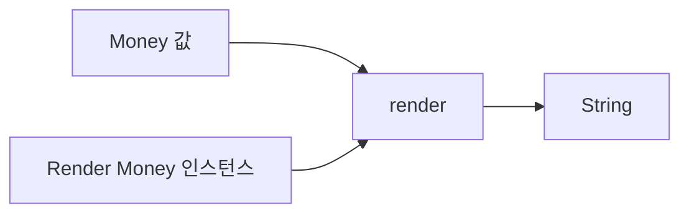

# 30장. Type Classes


제네릭 함수는 원소의 구체적인 타입을 몰라도 공통 구조를 처리할 수 있었다.
하지만 값을 표시하거나 비교하거나 결합하려면 타입별 규칙이 필요하다.
타입 클래스는 그런 연산의 계약과 각 타입에 대한 구현을 분리하는 방식이다.

이 장에서는 보고서의 값 표시와 주문 식별자의 동등성을 예제로 사용한다.
원래 데이터 클래스에 모든 동작을 넣지 않고 외부에서 필요한 구현을 제공한다.
Scala의 `given`과 `using`을 명시적인 사전 전달로 풀어 보고, Python에서는 프로토콜 객체를 직접
전달한다.

---

## 1. 개념과 기본 구분

### 연산의 계약과 인스턴스

타입 클래스는 어떤 타입 `A`에 대해 필요한 연산을 정의한다.
인스턴스는 특정 `A`에서 그 연산을 어떻게 수행하는지 제공한다.
제네릭 알고리즘은 데이터와 인스턴스를 함께 사용한다.

```text
Render[A]
  render: A -> String

Render[Int]      정수 표시 규칙
Render[Money]    금액 표시 규칙
```

여기서 인스턴스는 데이터값 하나가 아니라 연산 구현을 담은 값이다.
객체 지향의 클래스 인스턴스라는 일반 용어와 겹치므로 문맥을 구분한다.
타입 클래스 인스턴스는 보통 여러 데이터값에 적용된다.

### 명시적인 사전 전달

타입 클래스 사용을 가장 직접적으로 풀면 연산 객체를 함수 인자로 전달하는 형태다.
컴파일러의 문맥 인자 탐색은 그 전달을 편리하게 해 줄 수 있다.
이 관점으로 읽으면 타입 클래스가 런타임의 신비한 전역 마법이 아니라는 점을 이해할 수 있다.

### 상속과의 차이

데이터 타입 자체가 특정 인터페이스를 상속하지 않아도 외부에서 구현을 제공할 수 있다.
수정할 수 없는 외부 타입에도 필요한 연산을 정의할 수 있다.
하지만 같은 타입에 여러 구현이 있을 때 어느 것을 선택할지 명확히 해야 한다.

### 법칙과 구현

연산의 시그니처만으로 대수 법칙이 자동 보장되는 것은 아니다.
동등성이라면 반사성·대칭성·추이성 같은 성질을 기대할 수 있다.
표시 함수에는 프로젝트가 정한 별도의 계약이 필요하며 모든 타입 클래스에 같은 법칙이 있는 것은
아니다.

---

## 2. 명령형 스타일과 함수형 스타일

### 데이터에 모든 표시 정책을 넣는다

```text
Money.toString()
Money.toCsv()
Money.toAdminLabel()
Money.toCustomerLabel()
```

표시 대상이 늘면 데이터 타입이 여러 출력 정책을 알게 될 수 있다.
단순한 프로그램에서는 메서드가 충분히 적절하다.
하지만 여러 독립적인 표현이 필요하거나 외부 타입을 다룰 때 동작을 분리하는 편이 유리할 수 있다.

### 외부의 표시 계약

```scala
trait Render[A]:
  def render(value: A): String

def renderAll[A](values: List[A])(using renderer: Render[A]): List[String] =
  values.map(renderer.render)
```

목록 순회는 모든 타입에서 같다.
각 원소의 표시 방식만 인스턴스가 담당한다.
제네릭 구조와 타입별 동작이 분리된다.

### 분기문으로 타입 검사

모든 가능한 타입을 런타임 `match`로 나열하는 범용 표시 함수도 만들 수 있다.
하지만 새 타입이 추가될 때 중앙 함수를 계속 수정해야 할 수 있다.
타입 클래스는 필요한 구현을 별도로 제공하는 다른 확장 지점을 만든다.

### 무조건 더 좋은 방식은 아니다

데이터와 동작이 강하게 결합된 작은 도메인에서는 평범한 메서드가 더 읽기 쉽다.
타입 클래스 탐색과 인스턴스 배치가 복잡해지면 사용자가 실제 구현을 찾기 어려울 수 있다.
확장 방향과 팀의 이해 비용을 기준으로 선택한다.

---

## 3. 왜 이 개념을 사용하는가?

### 원래 타입을 수정하지 않는다

외부 라이브러리의 타입에 비교나 표시 규칙을 추가할 수 있다.
원래 클래스의 상속 구조를 바꿀 필요가 줄어든다.
어댑터와 확장 지점을 명확하게 관리할 수 있다.

### 제네릭 알고리즘의 재사용

목록 전체를 표시하는 알고리즘은 원소별 `Render`만 요구한다.
동등성을 이용해 두 값을 비교하는 알고리즘은 `Eq`만 요구한다.
함수가 실제로 필요한 능력을 시그니처에 드러낼 수 있다.

### 정책의 교체

같은 금액을 간단한 문구와 상세한 문구로 표시할 수 있다.
중요한 호출에서는 인스턴스를 명시적으로 전달하여 정책을 고정할 수 있다.
암묵적인 선택이 업무 정책을 숨기지 않도록 주의한다.

### 법칙의 검토

동등성, 결합, 변환 같은 연산에 필요한 법칙을 별도 테스트로 둘 수 있다.
구현이 시그니처를 만족해도 법칙을 어길 수 있다는 사실을 드러낸다.
타입 검사와 법칙 검증의 역할을 구분한다.

### 경계의 축소

함수에 전체 서비스 객체 대신 필요한 연산 계약만 전달할 수 있다.
이는 의존성을 줄이는 데 도움이 된다.
다만 그 연산이 외부 효과를 수행할 수 있다면 효과 계약은 여전히 별도로 필요하다.

---

## 4. Scala에서의 표현

### Scala의 `given`과 `using`

아래 예제는 표시 인스턴스를 자동 선택하는 호출과 명시적으로 선택하는 호출을 함께 보여 준다.
금액은 예제에서 정수 최소 단위로 보관하며 표시에도 그 단위를 명시한다.
통화별 소수점 형식이나 실제 결제 규칙을 구현한 것은 아니다.

<!-- executable:scala -->
```scala
object Chapter30:
  trait Render[A]:
    def render(value: A): String

  trait Eq[A]:
    def equal(left: A, right: A): Boolean

  final case class Money(minorUnits: BigInt, currency: String)
  final case class OrderId(value: String)

  given integerRender: Render[Int] with
    def render(value: Int): String = value.toString

  given moneyRender: Render[Money] with
    def render(value: Money): String =
      s"${value.minorUnits} minor units (${value.currency})"

  given orderIdEq: Eq[OrderId] with
    def equal(left: OrderId, right: OrderId): Boolean =
      left.value == right.value

  val compactMoney: Render[Money] = new Render[Money]:
    def render(value: Money): String = s"${value.currency}:${value.minorUnits}"

  def render[A](value: A)(using instance: Render[A]): String =
    instance.render(value)

  def renderAll[A](values: List[A])(using instance: Render[A]): List[String] =
    values.map(instance.render)

  def same[A](left: A, right: A)(using instance: Eq[A]): Boolean =
    instance.equal(left, right)

  def renderExplicit[A](value: A, instance: Render[A]): String =
    instance.render(value)

  def check(): Unit =
    val amount = Money(1500, "KRW")
    assert(render(3) == "3")
    assert(render(amount) == "1500 minor units (KRW)")
    assert(render(amount)(using compactMoney) == "KRW:1500")
    assert(renderExplicit(amount, compactMoney) == "KRW:1500")
    assert(renderAll(List(1, 2, 3)) == List("1", "2", "3"))
    assert(renderAll(List.empty[Int]).isEmpty)
    val a = OrderId("O-1")
    val b = OrderId("O-1")
    val c = OrderId("O-2")
    assert(same(a, b))
    assert(!same(a, c))
    val instance = summon[Eq[OrderId]]
    val values = List(a, b, c)
    for x <- values do
      assert(instance.equal(x, x))
      for y <- values do
        assert(instance.equal(x, y) == instance.equal(y, x))
        for z <- values do
          if instance.equal(x, y) && instance.equal(y, z) then
            assert(instance.equal(x, z))
```

### 구현 선택의 가시성

`render(amount)`는 문맥에서 찾은 인스턴스를 사용한다.
`render(amount)(using compactMoney)`는 특정 정책을 명시적으로 선택한다.
같은 타입의 여러 의미가 중요한 코드에서는 두 번째 형태가 더 명확할 수 있다.

### 자동 탐색은 전역 유일성 증명이 아니다

가져오기와 문맥에 따라 사용 가능한 인스턴스가 달라질 수 있다.
모든 프로그램에서 한 타입에 단 하나의 의미만 존재한다고 자동 보장되는 것은 아니다.
인스턴스의 소유 위치와 공개 범위를 팀 규칙으로 정하는 것이 도움이 된다.

---

## 5. 상태 변경보다 값 변환

### 데이터와 연산 객체

금액값과 금액 표시 규칙은 서로 다른 입력이다.
같은 데이터에 다른 규칙을 적용하여 다른 결과를 만들 수 있다.
이 구조를 명시적으로 보면 문맥 인자가 숨기는 의존성도 드러난다.



인스턴스가 불변 설정만 사용하면 표시 계산을 순수하게 유지하기 쉽다.
전역 언어 설정이나 현재 환율을 읽으면 결과가 달라질 수 있다.
타입 클래스 구조 자체가 순수성을 보장하지는 않는다.

### 같은 타입의 여러 의미

문자열의 대소문자를 구분하는 동등성과 구분하지 않는 동등성은 다른 정책이다.
둘을 아무 이름 없이 같은 전역 인스턴스로 번갈아 사용하면 혼란이 생길 수 있다.
래퍼 타입이나 명시적인 인스턴스 이름으로 의미를 구분한다.

### 도메인 값의 변경

인스턴스는 데이터값을 반드시 수정해야 하는 구조가 아니다.
값을 받아 결과를 반환하는 연산으로 설계할 수 있다.
입력 보존과 결과의 불변성은 각각의 구현 계약으로 확인한다.

---

## 6. 함수 합성과 데이터 흐름

### 연산 사전의 재사용

제네릭 함수는 필요한 사전을 받아 여러 값을 처리한다.
사전 안의 연산들이 다른 타입 클래스에 의존할 수도 있다.
예를 들어 목록의 표시 규칙은 원소의 표시 규칙을 사용하여 구성할 수 있다.

```text
Render[A]
  -> Render[List[A]] 구성
  -> 목록 표시 함수
```

### 유도와 직접 구현

일부 언어 기능이나 라이브러리는 레코드의 필드 구조를 따라 인스턴스를 유도할 수 있다.
자동 생성된 표시가 개인정보나 도메인 의미에 맞는지는 별도 검토해야 한다.
유도 가능성과 적절한 공개 정책은 다르다.

### 타입 클래스의 상속 관계

Monoid가 Semigroup의 결합 연산에 항등원을 추가하는 식으로 계약을 확장할 수 있다.
새 연산뿐 아니라 새 법칙이 추가된다.
뒤 장에서는 이 관계를 실제 집계 예제로 다룬다.

### 법칙의 문서화

`Eq`의 시그니처만 보고 모든 구현이 동등성 관계라고 믿으면 안 된다.
허용된 값 영역과 비교의 의미를 문서에 남긴다.
부동소수점의 특수값이나 근사 비교처럼 일반적인 법칙에 주의가 필요한 사례도 있다.

---

## 7. 장점과 트레이드오프

### 장점과 트레이드오프

| 선택 | 장점 | 주의점 |
| --- | --- | --- |
| 외부 인스턴스 | 원래 타입 수정 불필요 | 인스턴스 위치 탐색 |
| 문맥 인자 | 반복 전달 감소 | 숨은 정책 선택 |
| 명시적 사전 전달 | 의존성 명확 | 호출 코드 증가 |
| 법칙 있는 계약 | 추론과 조합의 근거 | 별도 검증 필요 |
| 자동 유도 | 반복 구현 감소 | 의도하지 않은 동작 |

### 인스턴스 충돌

같은 타입과 계약에 여러 후보가 보이면 모호성이 생길 수 있다.
가져오기 범위를 줄이거나 명시적으로 선택하거나 래퍼 타입을 사용한다.
실제로 다른 의미를 하나의 이름으로 합치지 않는 것이 중요하다.

### 학습 비용

타입 클래스, 문맥 인자, 유도, 확장 메서드를 한꺼번에 쓰면 단순한 호출도 따라가기 어려울 수 있다.
처음에는 명시적인 사전 전달로 의미를 확인한 뒤 편의 문법을 도입한다.
짧은 표기보다 구현 선택을 이해하는 것이 먼저다.

### 실행 비용

사전 객체와 메서드 호출이 존재할 수 있다.
컴파일러가 제거하거나 특수화하는 경우가 있어도 항상 무비용이라고 일반화하지 않는다.
성능이 중요한 경계에서는 실제 생성 코드나 측정 결과를 확인한다.

---

## 8. 상태와 부수효과의 경계

### 표시와 외부 환경

표시 인스턴스가 현재 언어, 시간대, 환율을 읽으면 외부 환경에 의존한다.
재현 가능한 보고서에는 그 환경을 명시적인 설정으로 제공할 수 있다.
문맥 인자를 통해 전달한다고 의존성이 없어지는 것은 아니다.

### 권한의 전달

저장이나 네트워크 호출을 하는 타입 클래스 인스턴스는 실행 능력을 전달한다.
작은 인터페이스로 권한을 좁힐 수 있지만 보안 격리 자체를 제공하지는 않는다.
필요한 작업만 노출하고 실제 권한 경계를 따로 관리한다.

### 오류와 자원

인스턴스 메서드가 실패하거나 자원을 사용할 수 있다면 반환 타입과 수명 계약을 명시한다.
단순한 `A -> String` 타입으로 모든 외부 실패를 숨기지 않는다.
효과를 다루는 인스턴스는 후반부의 설계와 연결된다.

### 민감정보의 렌더링

자동으로 모든 필드를 출력하는 인스턴스는 비밀번호나 토큰을 노출할 수 있다.
운영자용과 사용자용 표시 규칙을 분리하고 필요한 필드만 포함한다.
타입 클래스의 재사용성이 안전한 공개 정책을 대신하지 않는다.

---

## 9. Python에서 적용하기

### Python의 명시적인 프로토콜 사전

Python에서는 연산 객체를 직접 전달하여 타입 클래스와 유사한 사전 전달 구조를 만들 수 있다.
아래 코드는 자동 인스턴스 탐색을 구현하지 않는다.
프로토콜은 필요한 메서드 형태를 설명하고 실제 구현 객체가 동작을 제공한다.

<!-- executable:python -->
```python
from collections.abc import Sequence
from dataclasses import dataclass
from typing import Protocol, TypeVar

A = TypeVar("A")
A_contra = TypeVar("A_contra", contravariant=True)


class Render(Protocol[A_contra]):
    def render(self, value: A_contra) -> str:
        ...


class Eq(Protocol[A_contra]):
    def equal(self, left: A_contra, right: A_contra) -> bool:
        ...


@dataclass(frozen=True)
class Money:
    minor_units: int
    currency: str


@dataclass(frozen=True)
class OrderId:
    value: str


class IntegerRender:
    def render(self, value: int) -> str:
        return str(value)


class MoneyRender:
    def render(self, value: Money) -> str:
        return f"{value.minor_units} minor units ({value.currency})"


class CompactMoneyRender:
    def render(self, value: Money) -> str:
        return f"{value.currency}:{value.minor_units}"


class OrderIdEq:
    def equal(self, left: OrderId, right: OrderId) -> bool:
        return left.value == right.value


def render_all(values: Sequence[A], instance: Render[A]) -> list[str]:
    return [instance.render(value) for value in values]


def same(left: A, right: A, instance: Eq[A]) -> bool:
    return instance.equal(left, right)


def test_explicit_instances() -> None:
    amount = Money(1500, "KRW")
    assert render_all([1, 2, 3], IntegerRender()) == ["1", "2", "3"]
    assert render_all([amount], MoneyRender()) == ["1500 minor units (KRW)"]
    assert render_all([amount], CompactMoneyRender()) == ["KRW:1500"]
    assert render_all([], IntegerRender()) == []
    a, b, c = OrderId("O-1"), OrderId("O-1"), OrderId("O-2")
    instance = OrderIdEq()
    assert same(a, b, instance)
    assert not same(a, c, instance)
    values = (a, b, c)
    for x in values:
        assert instance.equal(x, x)
        for y in values:
            assert instance.equal(x, y) == instance.equal(y, x)
            for z in values:
                if instance.equal(x, y) and instance.equal(y, z):
                    assert instance.equal(x, z)


if __name__ == "__main__":
    test_explicit_instances()
```

### 생략된 메서드 본문의 의미

프로토콜 안의 `...`는 구현을 나중에 채우라는 미완성 제품 코드가 아니다.
구조적 타입 계약의 메서드 시그니처를 선언하는 Python 문법이다.
실제 실행은 구체적인 인스턴스 클래스의 메서드를 사용한다.

---

## 10. Python의 표현 한계

### 자동 인스턴스 탐색의 차이

표준 Python의 프로토콜은 Scala의 `given` 탐색을 그대로 제공하지 않는다.
연산 객체를 직접 전달하거나 별도의 등록 구조를 만들 수 있다.
등록 구조를 도입하면 범위, 충돌, 초기화 순서라는 추가 계약이 생긴다.

### `singledispatch`와의 차이

`functools.singledispatch`는 첫 인자의 런타임 타입을 기준으로 구현을 선택한다.
여러 타입 매개변수의 관계나 문맥 사전 선택을 일반적으로 표현하는 것과 다르다.
비슷한 사용 사례가 있어도 동일한 타입 클래스 시스템이라고 설명하지 않는다.

### 프로토콜의 실행 검사

타입 주석은 런타임에 모든 메서드 시그니처와 법칙을 검증하지 않는다.
실행 가능한 프로토콜 검사도 속성 존재와 실제 의미 검증을 구분해야 한다.
중요한 계약은 명시적인 테스트와 경계 검사로 보강한다.

### 법칙과 부작용

연산 객체의 메서드는 내부 상태를 변경하거나 외부 서비스를 호출할 수 있다.
프로토콜 선언만으로 순수성이나 동등성 법칙이 보장되지 않는다.
사전 전달 구조와 대수적 의미를 별도로 검토한다.

---

## 11. 핵심 정리

### 핵심 결론

타입 클래스는 제네릭 구조가 필요로 하는 타입별 연산을 분리한다.
문맥 인자 탐색은 명시적인 사전 전달로 풀어 이해할 수 있다.
같은 타입의 여러 인스턴스는 의미와 선택 범위를 분명히 해야 한다.
시그니처, 법칙, 효과, 보안 정책은 각각의 계약이다.

### 연습 1: 사전 전달

`render(value)(using instance)`를 일반 함수 인자로 풀어 설명하라.

**해설.** 데이터값과 표시 연산 객체를 함께 전달하여 그 메서드를 호출한다.
자동 탐색은 이 전달을 편리하게 만드는 기능이다.
실제 동작을 결정하는 인스턴스가 존재한다는 사실은 사라지지 않는다.

### 연습 2: 두 동등성

문자열의 대소문자를 구분하는 비교와 구분하지 않는 비교를 함께 제공하려 한다.
어떻게 혼동을 줄일 수 있는가?

**해설.** 이름 있는 인스턴스를 명시적으로 전달하거나 서로 다른 래퍼 타입을 사용한다.
같은 타입의 의미가 문맥에 따라 조용히 바뀌지 않도록 한다.
인스턴스 선택도 업무 정책이다.

### 연습 3: 법칙 위반

`Eq` 구현이 항상 거짓을 반환하면 타입 검사만으로 잘못을 찾을 수 있는가?

**해설.** 시그니처는 맞지만 반사성 법칙을 어긴다.
법칙 설명과 별도의 검증이 필요하다.
타입 클래스의 선언과 올바른 인스턴스는 같은 사실이 아니다.

### 연습 4: Python의 대응

프로토콜을 선언했으니 적절한 인스턴스가 자동으로 선택된다고 생각했다.
무엇을 수정해야 하는가?

**해설.** 표준 프로토콜은 그런 문맥 탐색을 제공하지 않는다.
구현 객체를 직접 전달하거나 명시적인 선택 구조를 설계해야 한다.
구조적 타입 계약과 인스턴스 해석 방식을 구분한다.

### 다음 장과 참고 자료

다음 장은 원소 타입뿐 아니라 `List`, `Option` 같은 타입 생성자도 매개변수로 받는 고차 타입을
다룬다.
컨테이너별 반복되는 연산을 한 계약으로 설명할 준비를 한다.

[Scala 공식 문서: Type Classes](https://docs.scala-lang.org/scala3/book/ca-type-classes.html)
[Cats 공식 문서: Type Classes](https://typelevel.org/cats/typeclasses.html)
[Python 공식 문서: Protocol](https://docs.python.org/3.14/library/typing.html#typing.Protocol)
[Python 공식 문서: singledispatch](https://docs.python.org/3.14/library/functools.html#functools.singledispatch)
