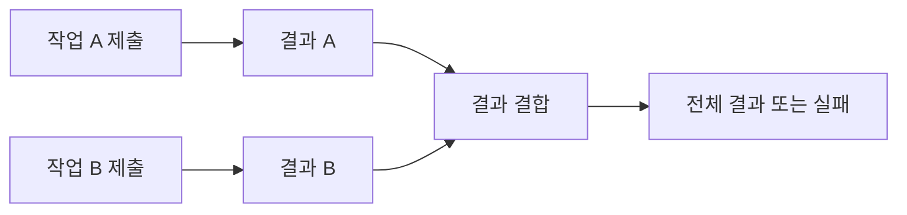

# 43장. Asynchronous Effects


외부 조회가 오래 걸릴 때 한 작업의 완료를 기다리는 동안 다른 작업을 진행할 수 있다.
비동기 프로그래밍은 이런 대기와 실행의 구조를 다룬다.
하지만 `Future`, 코루틴, 지연된 IO는 모두 같은 시점에 시작하고 같은 방식으로 취소되는 것이
아니다.

이번 장은 Scala 표준 Future와 Python의 asyncio를 비교한다.
시작 시점, 결과 순서, 오류 전달, 시간 초과, 취소와 자원 정리를 각각 확인한다.
짧은 대기 시간의 성능 수치 대신 동기화 장치와 관측 가능한 상태로 계약을 테스트한다.

---

## 1. 개념과 기본 구분

### 비동기와 병렬성

비동기는 작업 완료를 기다리는 동안 실행 제어를 다른 작업에 넘길 수 있는 구조다.
병렬성은 여러 계산이 실제로 동시에 실행되는 성질이다.
비동기 API를 사용했다고 CPU 계산이 자동으로 여러 코어에서 빨라지는 것은 아니다.

```text
동기 대기:    호출자가 완료까지 기다림
비동기 연결:  완료 후 다음 계산을 연결
병렬 실행:   여러 실행 자원이 동시에 작업
```

어떤 실행기와 스레드, 외부 I/O를 사용하는지에 따라 실제 동작이 달라진다.
함수 이름의 `async`나 컨텍스트 타입만으로 성능을 판단하지 않는다.

### 시작 시점

Scala의 표준 `Future { ... }`는 생성 과정에서 주어진 실행 컨텍스트에 작업을 제출한다.
Python의 일반적인 코루틴 함수 호출은 코루틴 객체를 만들며 실행은 await나 스케줄링과 연결된다.
명시적인 eager task 설정 같은 기능은 실제 사용한 실행 정책을 확인해야 한다.

### 결과 순서와 완료 순서

입력 순서대로 결과를 모으는 API와 완료된 순서대로 결과를 받는 API는 다르다.
빠른 작업이 먼저 끝나더라도 결과 목록은 입력 순서를 유지할 수 있다.
업무상 필요한 순서를 명확히 정한다.

### 실패와 취소

실패는 작업이 원하는 결과를 만들지 못한 상황이다.
취소는 더 이상 진행하지 말라는 제어 요청이다.
둘은 자원 정리와 전파 정책에서 연결되지만 같은 개념은 아니다.

---

## 2. 명령형 스타일과 함수형 스타일

### 의존적인 비동기 연결

```text
고객을 조회한다
고객 결과의 주문 번호로 주문을 조회한다
```

두 번째 조회는 첫 결과에 의존한다.
`flatMap`이나 `await`로 이 순서를 표현할 수 있다.
단순히 동시에 시작하면 필요한 입력이 아직 없을 수 있다.

### 독립적인 두 조회

```text
상품 가격 조회를 시작한다
배송 정책 조회를 시작한다
두 결과를 결합한다
```

두 작업의 입력이 독립적이라면 먼저 둘 다 시작하고 나중에 결과를 모을 수 있다.
작업을 만드는 위치가 시작 시점에 영향을 주는 API에서는 이 차이가 중요하다.
독립성만으로 외부 자원과 호출 제한까지 무시할 수 있는 것은 아니다.

### 잘못된 순차화

첫 작업을 await한 뒤 두 번째 작업을 처음 생성하면 겹쳐 실행할 기회가 줄어들 수 있다.
반대로 이미 시작된 Future 두 개를 순서대로 연결했다고 첫 번째가 끝나야 두 번째가 시작하는 것은
아니다.
생성과 결합, 대기의 시점을 나누어 읽는다.

### 실패한 묶음의 나머지 작업

결과 묶음 하나가 실패해도 이미 시작한 다른 작업이 계속 실행될 수 있다.
자동 취소가 있는 실행 구조인지 확인해야 한다.
실패 결과를 받았다는 사실만으로 모든 효과가 중단되었다고 가정하지 않는다.

---

## 3. 왜 이 개념을 사용하는가?

### 대기 시간의 활용

서로 독립적인 외부 I/O 대기를 겹칠 수 있다.
하지만 연결 수와 서버의 처리량, 호출 제한이 전체 성능을 결정한다.
무제한 작업 생성이 항상 빠른 것은 아니다.

### 구조적인 작업 수명

관련된 작업들을 범위 안에 묶으면 완료와 실패, 취소를 추적하기 쉽다.
부모 작업이 끝났는데 자식 작업이 계속 남는 상황을 줄일 수 있다.
구체적인 작업 그룹의 예외 전파와 취소 규칙을 확인해야 한다.

### 실행 정책의 가시성

동시 작업 수, 시간 제한, 재시도, 결과 순서를 명시적으로 정한다.
업무 계산의 결과 타입과 실행기의 정책을 분리한다.
테스트에서 시간 자체보다 시작·종료·정리 상태를 관측한다.

### 자원 사용의 제한

세마포어는 동시에 사용하는 자원 수를 제한하는 데 도움이 된다.
하지만 모든 입력에 대해 작업 객체를 미리 만들면 메모리 사용은 여전히 커질 수 있다.
입력 큐와 소비 속도를 조절하는 구조도 함께 검토한다.

### 오류의 정확한 의미

시간 초과는 호출자가 정한 시간 안에 결과를 얻지 못했다는 뜻이다.
외부 작업이 아무 효과도 내지 않았다는 증명은 아니다.
재시도와 중복 방지 정책에 중요한 차이다.

---

## 4. Scala에서의 표현

### Scala Future의 시작과 시간 초과

다음 예제는 전용 두 스레드 실행기를 사용한다.
두 작업이 시작되었는지 래치로 확인한 뒤 완료를 허용한다.
이 동기화는 테스트를 위한 것이며 일반적인 비동기 I/O를 차단 래치로 구현하라는 뜻은 아니다.

<!-- executable:scala -->
```scala
object Chapter43:
  import scala.concurrent.{Await, ExecutionContext, Future, Promise}
  import scala.concurrent.duration.*
  import scala.util.Try
  import java.util.concurrent.{CountDownLatch, Executors, TimeUnit, TimeoutException}

  def check(): Unit =
    val executor = Executors.newFixedThreadPool(2)
    given ExecutionContext = ExecutionContext.fromExecutorService(executor)
    val started = new CountDownLatch(2)
    val release = new CountDownLatch(1)
    try
      def work(value: Int): Future[Int] = Future {
        started.countDown()
        if !release.await(5, TimeUnit.SECONDS) then
          throw new IllegalStateException("test gate was not released")
        value
      }
      val first = work(1)
      val second = work(2)
      assert(started.await(5, TimeUnit.SECONDS))
      assert(!first.isCompleted && !second.isCompleted)
      val combined = first.zip(second).map((a, b) => a + b)
      release.countDown()
      assert(Await.result(combined, 5.seconds) == 3)
      assert(Await.result(Future.sequence(List(second, first)), 5.seconds) == List(2, 1))

      val pending = Promise[Int]()
      var timedOut = false
      try Await.result(pending.future, Duration.Zero)
      catch case _: TimeoutException => timedOut = true
      assert(timedOut)
      assert(!pending.isCompleted)
      pending.success(9)
      assert(Await.result(pending.future, 5.seconds) == 9)

      val remaining = Promise[Int]()
      val failed = Future.failed[Int](new IllegalArgumentException("failed branch"))
      val group = Future.sequence(List(failed, remaining.future))
      assert(Try(Await.result(group, 5.seconds)).isFailure)
      assert(!remaining.isCompleted)
      remaining.success(7)
      assert(Await.result(remaining.future, 5.seconds) == 7)

      val dependent = Future.successful(3).flatMap { value =>
        Future.successful(value * 2)
      }
      assert(Await.result(dependent, 5.seconds) == 6)
    finally
      release.countDown()
      executor.shutdown()
      if !executor.awaitTermination(5, TimeUnit.SECONDS) then
        executor.shutdownNow()
        assert(executor.awaitTermination(5, TimeUnit.SECONDS))
```

### 대기 시간 초과는 작업 취소가 아니다

`Await.result`의 시간 초과 후에도 Promise는 완료되지 않은 상태로 남는다.
나중에 값을 넣으면 해당 Future의 결과를 얻을 수 있다.
Scala 표준 Future 자체에 일반적인 작업 취소 연산이 제공된다고 가정하지 않는다.

### 묶음 실패와 남은 작업

이미 실패한 Future 때문에 결과 묶음이 실패해도 다른 Promise는 그대로 남는다.
그 작업을 누가 관리하고 중단할지 별도의 프로토콜이 필요할 수 있다.
실패 전파와 실행 취소를 구분해야 한다.

### 차단 대기의 범위

예제의 `Await`는 검증 프로그램의 경계에서 결과를 확인하기 위한 것이다.
서버의 비동기 처리 내부에서 무분별하게 사용하면 실행 스레드가 막힐 수 있다.
실제 코드는 실행기의 자원과 차단 작업 정책을 확인해야 한다.

---

## 5. 상태 변경보다 값 변환

### 작업과 결과를 분리해서 본다

작업이 제출되는 시점과 결과가 완성되는 시점은 다르다.
완료되지 않은 결과값을 연결해 새 결과값을 만들 수 있다.
그 연결이 원래 작업을 새로 시작하거나 자동 취소하는지는 별도 계약이다.



이 그림은 두 작업이 반드시 같은 순간에 CPU에서 실행된다는 뜻은 아니다.
실행 컨텍스트와 외부 대기에 따라 실제 실행이 정해진다.
데이터 흐름 그림과 스케줄 타임라인을 구분한다.

### 불변 결과의 장점

여러 작업이 불변 결과값을 반환하면 공유 변경을 줄일 수 있다.
결과를 모은 뒤 순수한 함수로 계산할 수 있다.
하지만 작업 내부의 외부 상태 경쟁은 여전히 별도로 관리해야 한다.

### 결과의 보관과 재사용

완료된 Future의 결과를 여러 번 기다리는 것은 원래 작업을 다시 수행하는 것과 다르다.
재시도하려면 새로운 작업을 시작해야 할 수 있다.
지연된 IO와 이미 시작한 Future를 같은 재실행 계약으로 다루지 않는다.

---

## 6. 함수 합성과 데이터 흐름

### 독립 결합과 의존 연결

두 작업이 이미 준비되어 있으면 결과를 함께 결합할 수 있다.
다음 작업의 입력이 앞 결과에 달려 있으면 순서 있는 연결이 필요하다.
이 차이는 Applicative와 Monad에서 배운 데이터 의존성의 구분과 연결된다.

```text
독립: F[A], F[B] -> F[C]
의존: F[A], A -> F[B] -> F[B]
```

### 작업 그룹의 구조

Python의 TaskGroup은 관련 작업의 수명을 범위 안에서 관리한다.
일반적인 자식 작업 오류에서 남은 작업을 취소하고 완료를 기다리는 정책을 제공한다.
여러 오류는 예외 그룹으로 전달될 수 있으며 종료 신호의 특별 취급도 확인해야 한다.

### 취소 전파

취소 요청을 받은 작업은 정리 코드를 실행하고 필요한 신호를 다시 전파해야 한다.
취소를 정상값으로 바꾸어 계속 실행하면 상위 범위의 종료 계약을 해칠 수 있다.
일부러 취소를 처리하는 코드는 그 이유와 결과를 명확히 해야 한다.

### 결과 순서 선택

모든 결과를 입력 순서로 모을지 완료 순서로 처리할지 선택한다.
사용자 화면과 배치 보고서에는 안정적인 입력 순서가 중요할 수 있다.
빠르게 끝난 작업을 즉시 처리하는 요구에는 다른 소비 구조가 적합할 수 있다.

---

## 7. 장점과 트레이드오프

### 장점과 트레이드오프

| 정책 | 이점 | 주의점 |
| --- | --- | --- |
| 독립 작업의 동시 진행 | I/O 대기 겹침 | 외부 자원 제한 |
| 구조적인 작업 그룹 | 수명과 실패 관리 | 취소 전파의 이해 |
| 입력 순서 결과 | 안정적인 보고서 | 느린 작업을 기다림 |
| 완료 순서 소비 | 빠른 결과 활용 | 순서 재구성 |
| 동시성 제한 | 연결과 부하 제어 | 작업 객체 수는 별도 |

### 너무 많은 작업

세마포어로 실행 수를 제한해도 수백만 작업 객체를 먼저 만들면 메모리를 많이 사용할 수 있다.
입력을 제한된 큐로 공급하고 일정 수의 작업자가 소비하는 구조를 검토한다.
동시 실행 제한과 입력 생산 속도 제한은 다른 층이다.

### CPU 작업

이벤트 루프 안의 긴 CPU 계산은 다른 코루틴의 진행을 막을 수 있다.
스레드·프로세스·네이티브 연산을 사용할지 실행 환경에 맞게 선택해야 한다.
비동기 문법만으로 CPU 병렬성을 보장하지 않는다.

### 성능 측정

짧은 `sleep` 몇 개의 실행 시간만으로 실제 서비스 처리량을 판단하지 않는다.
연결 풀, 서버 제한, 요청 크기, 실패율을 포함한 부하 조건이 필요하다.
이 장의 예제는 실행 계약을 검사하며 벤치마크가 아니다.

---

## 8. 상태와 부수효과의 경계

### 시간 초과 후 외부 상태

결제 요청의 응답을 기다리다 시간이 초과되어도 원격 결제가 완료되었을 수 있다.
취소 요청이 원격 시스템까지 전달되고 적용되었다는 보장이 있는지 확인한다.
재시도에는 멱등성 키와 상태 조회 같은 추가 정책이 필요할 수 있다.

### 정리 코드

열린 파일과 연결, 잠금은 정상 완료뿐 아니라 취소에서도 정리되어야 한다.
`finally`나 자원 범위를 사용하고 정리 중 다시 실패할 때의 정책도 검토한다.
태스크가 취소되었다는 사실만으로 모든 외부 자원이 자동 해제되는 것은 아니다.

### 차단 작업의 취소

스레드에서 실행하는 차단 함수를 기다리는 코루틴이 취소되더라도 해당 스레드 함수가 즉시 멈추지
않을 수 있다.
실행 중인 작업의 자체 취소 프로토콜이 필요할 수 있다.
대기 취소와 실제 실행 중단을 구분한다.

### 공유 상태

동시에 실행하는 두 작업이 같은 재고나 계좌를 바꾸면 경쟁이 발생할 수 있다.
불변 결과를 반환해도 외부 저장소의 원자성이 자동 보장되지는 않는다.
트랜잭션과 조건부 갱신을 실제 효과 경계에서 설계한다.

---

## 9. Python에서 적용하기

### Python의 TaskGroup과 취소 검사

다음 프로그램은 코루틴 생성, 제한된 동시 실행, 자식 실패 시 정리, 시간 초과를 각각 검사한다.
작업의 순서를 고정하기 위해 이벤트를 사용한다.
타이밍 수치로 성능을 주장하지 않고 완료와 정리 상태를 확인한다.

<!-- executable:python -->
```python
import asyncio


async def test_start_and_result() -> None:
    calls: list[str] = []

    async def work() -> int:
        calls.append("started")
        return 7

    coroutine = work()
    assert calls == []
    task = asyncio.create_task(coroutine)
    assert await task == 7
    assert calls == ["started"]
    assert task.result() == 7
    assert calls == ["started"]


async def test_bounded_work() -> None:
    semaphore = asyncio.Semaphore(2)
    active = 0
    peak = 0

    async def work(value: int) -> int:
        nonlocal active, peak
        async with semaphore:
            active += 1
            peak = max(peak, active)
            try:
                await asyncio.sleep(0)
                return value * 2
            finally:
                active -= 1

    async with asyncio.TaskGroup() as group:
        tasks = [group.create_task(work(value)) for value in range(6)]
    assert [task.result() for task in tasks] == [0, 2, 4, 6, 8, 10]
    assert 1 <= peak <= 2
    assert active == 0


async def test_group_failure_cleans_sibling() -> None:
    started = asyncio.Event()
    cleaned = asyncio.Event()
    never = asyncio.Event()
    caught: list[BaseException] = []

    async def sibling() -> None:
        try:
            started.set()
            await never.wait()
        finally:
            cleaned.set()

    async def fail() -> None:
        await started.wait()
        raise ValueError("failed branch")

    try:
        async with asyncio.TaskGroup() as group:
            group.create_task(sibling())
            group.create_task(fail())
    except* ValueError as errors:
        caught.extend(errors.exceptions)
    assert len(caught) == 1
    assert isinstance(caught[0], ValueError)
    assert cleaned.is_set()


async def test_timeout_cleanup() -> None:
    cleaned = asyncio.Event()

    async def wait_forever() -> None:
        try:
            await asyncio.Event().wait()
        finally:
            cleaned.set()

    try:
        async with asyncio.timeout(0.01):
            await wait_forever()
    except TimeoutError:
        pass
    else:
        raise AssertionError("timeout did not occur")
    assert cleaned.is_set()


async def main() -> None:
    await test_start_and_result()
    await test_bounded_work()
    await test_group_failure_cleans_sibling()
    await test_timeout_cleanup()


if __name__ == "__main__":
    asyncio.run(main())
```

### 세마포어의 범위

예제는 여섯 작업을 모두 만들고 실제 작업 구간만 두 개로 제한한다.
입력 개수가 무제한인 생산자·소비자 시스템을 구현한 것은 아니다.
작업 객체 수와 대기열 크기를 제한하려면 추가 구조가 필요하다.

### 시간 초과의 변환

예제의 타임아웃 범위는 기다리던 작업의 취소와 정리를 거쳐 바깥에 시간 초과를 알린다.
구체적인 코루틴이 취소를 무시하거나 차단 작업을 실행하면 다른 결과가 생길 수 있다.
이 테스트의 협력적인 대기 동작을 모든 외부 작업으로 일반화하지 않는다.

---

## 10. Python의 표현 한계

### Future와 코루틴의 차이

Scala Future와 Python 코루틴 객체는 같은 시작·재사용 계약을 가지지 않는다.
완료된 결과를 재사용하는 것과 같은 코루틴 객체를 다시 await하려는 것은 구분해야 한다.
여러 번 실행할 작업은 새 코루틴을 만드는 함수로 표현할 수 있다.

### 취소 신호

asyncio의 취소는 일반적인 입력 오류와 다른 제어 흐름이다.
정리 후 필요한 취소를 전파해야 작업 그룹과 시간 제한의 의미가 유지된다.
광범위한 예외 포착으로 취소를 삼키지 않도록 실제 예외 계층을 확인한다.

### 실행 환경의 차이

이벤트 루프, 태스크 팩토리, eager 실행 설정은 시작 시점에 영향을 줄 수 있다.
테스트는 실제 사용한 설정과 Python 버전을 기준으로 작성한다.
오래된 기본 동작을 모든 환경의 절대 규칙으로 설명하지 않는다.

### CPU와 스레드

스레드로 옮긴 함수의 병렬성은 인터프리터 구성과 확장 모듈의 동작에 영향을 받는다.
`to_thread`를 호출했다고 모든 순수 Python CPU 계산이 자동으로 빨라진다고 가정하지 않는다.
작업 성격과 실제 실행 환경을 측정해야 한다.

---

## 11. 핵심 정리

### 핵심 결론

비동기 계산은 시작, 결합, 대기, 실패, 취소를 따로 이해해야 한다.
Scala Future와 Python 코루틴은 같은 실행 시점과 취소 계약을 가지지 않는다.
동시성 제한과 작업 수 제한, 시간 초과와 실제 외부 중단을 구분한다.
자원 정리와 부분 외부 성공은 비동기 문법 밖에서도 반드시 설계해야 한다.

### 연습 1: Future의 생성

이미 두 Future를 만든 뒤 첫 결과와 두 번째 결과를 순서대로 연결했다.
두 번째 작업이 첫 번째 완료 후에만 시작한다고 단정할 수 있는가?

**해설.** 생성 시 이미 실행 컨텍스트에 제출되었을 수 있다.
작업 생성과 결과 연결의 시점을 구분해야 한다.
코드의 들여쓰기만으로 시작 순서를 추정하지 않는다.

### 연습 2: 시간 초과

결제 응답이 시간 초과되었으니 결제는 발생하지 않았다고 판단했다.
어떤 가능성을 놓쳤는가?

**해설.** 원격 작업은 성공했지만 응답을 받지 못했을 수 있다.
대기 중단과 외부 효과 취소는 다르다.
상태 확인과 멱등성 정책이 필요하다.

### 연습 3: 작업 수

세마포어를 10으로 설정하고 백만 개의 태스크를 미리 만들었다.
모든 자원 사용이 10개로 제한되는가?

**해설.** 실행 구간은 제한해도 작업 객체와 대기 상태는 많이 생성될 수 있다.
입력 큐와 작업 생산 속도를 함께 제한해야 한다.
동시 실행 수와 전체 대기 작업 수는 다르다.

### 연습 4: 취소를 무시하는 코드

작업 그룹의 자식이 취소를 잡아 무한히 계속 실행한다.
어떤 계약을 해칠 수 있는가?

**해설.** 상위 범위의 종료와 자원 정리가 지연되거나 끝나지 않을 수 있다.
필요한 정리 후 취소를 전파하는 정책을 지켜야 한다.
특별히 취소를 억제하려면 수명과 완료 조건을 명시해야 한다.

### 다음 부와 참고 자료

6부는 환경, 상태, 로그, I/O, 의존성과 비동기 실행의 차이를 정리했다.
7부는 이 개념들을 실제 프로그램의 구조를 정하는 설계 패턴으로 묶는다.

[Scala 공식 문서: Futures and Promises](https://docs.scala-lang.org/overviews/core/futures.html)
[Python 공식 문서: Coroutines and Tasks](https://docs.python.org/3.14/library/asyncio-task.html)
[Python 공식 문서: Synchronization Primitives](https://docs.python.org/3.14/library/asyncio-sync.html)
[Python 공식 문서: concurrent.futures](https://docs.python.org/3.14/library/concurrent.futures.html)
