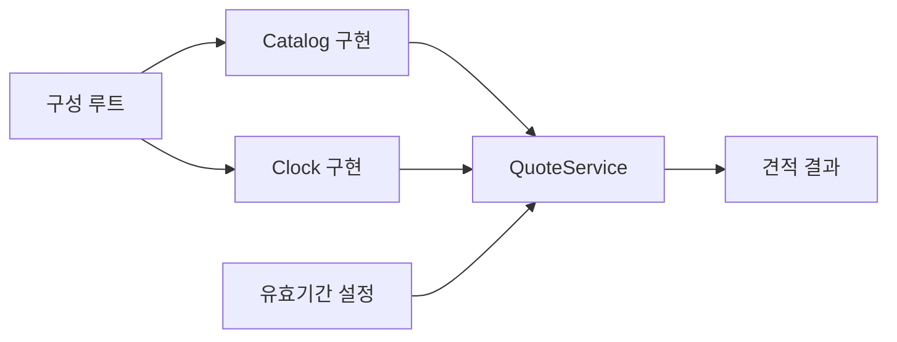

# 42장. Dependency Injection with Functions

견적 서비스는 상품 가격을 읽고 현재 시간을 알아야 할 수 있다.
서비스가 내부에서 데이터베이스 연결과 시계를 직접 만들면 테스트와 실행 정책이 강하게 결합된다.
의존성 주입은 필요한 기능이나 값을 바깥에서 전달하여 그 결합을 명시적으로 조립하는 방법이다.

이 장은 작은 상품 조회 포트와 시계 포트를 사용한다.
프레임워크나 전역 컨테이너 없이 생성자와 함수 인자로 의존성을 전달한다.
가짜 구현이 검증하는 범위와 실제 외부 어댑터의 책임도 구분한다.

---

## 1. 개념과 기본 구분

### 필요한 것을 바깥에서 받는다

의존성은 함수나 객체가 작업을 수행하기 위해 필요로 하는 값과 연산이다.
주입은 그 의존성을 내부에서 임의로 찾거나 생성하는 대신 호출자에게 받는 방식이다.
일반적인 함수 인자 전달도 이 원칙의 한 형태다.

```text
QuoteService(Catalog, Clock, Policy)
```

서비스는 필요한 계약을 사용한다.
구체적인 데이터베이스나 테스트용 맵을 선택하는 일은 조립 경계가 담당한다.
이 경계를 흔히 구성 루트라고 부른다.

### 값과 능력

이미 조회한 가격값을 받는 것과 가격을 조회할 수 있는 객체를 받는 것은 다르다.
후자는 실행 시 외부 효과를 수행할 능력을 전달한다.
어느 단계에 어떤 형태가 필요한지 구분해야 한다.

### 좁은 인터페이스

상품 조회만 필요한 서비스에 관리자 데이터베이스의 모든 기능을 전달할 필요는 없다.
필요한 메서드만 가진 포트로 의존성을 좁힐 수 있다.
인터페이스의 작음과 실제 보안 격리는 별도의 보장이다.

### 수명과 소유권

주입받은 자원을 누가 닫는지 명시해야 한다.
여러 서비스가 공유하는 연결 풀을 한 서비스가 임의로 닫으면 문제가 된다.
객체 생성과 사용, 해제를 조립 경계에서 함께 설계한다.

---

## 2. 명령형 스타일과 함수형 스타일

### 내부에서 의존성을 만든다

```text
견적 함수 내부
  데이터베이스 연결 생성
  상품 조회
  시스템 시계 읽기
  견적 생성
```

테스트하려면 실제 데이터베이스와 시계의 동작을 통제해야 할 수 있다.
연결 설정과 업무 규칙이 한 함수에 섞인다.
연결 생성 실패와 상품 부재의 의미도 구분하기 어려워질 수 있다.

### 필요한 포트를 전달한다

```text
Catalog.lookup(sku) -> Product 또는 조회 오류
Clock.nowSeconds() -> 기준 시각
```

서비스는 이 두 연산을 사용하여 견적을 만든다.
테스트에서는 맵 기반 상품 조회와 고정 시계를 전달한다.
실제 실행에서는 데이터베이스 어댑터와 시스템 시계를 전달할 수 있다.

### 서비스 로케이터와의 차이

전역 컨테이너에서 문자열 키로 원하는 서비스를 꺼내면 의존성이 시그니처에 드러나지 않을 수 있다.
컨테이너를 인자로 받았다고 필요한 기능이 자동으로 좁아지는 것도 아니다.
실제 필요한 포트와 설정을 명시적으로 받는 편이 검토하기 쉽다.

### 클래스만 가능한 것은 아니다

조회 함수와 시계 함수를 직접 인자로 전달할 수도 있다.
상태와 여러 관련 연산이 필요하면 객체가 편리할 수 있다.
의존성 주입을 특정 객체 지향 프레임워크와 동일시하지 않는다.

---

## 3. 왜 이 개념을 사용하는가?

### 테스트의 통제

상품 부재와 조회 장애, 고정 시각을 쉽게 재현할 수 있다.
시간이 흐르는 것을 기다리지 않고 만료 시각 계산을 검사한다.
테스트가 실제 외부 시스템의 모든 동작을 모사한다는 뜻은 아니다.

### 조립 정책의 분리

개발·테스트·운영 환경에서 다른 어댑터를 선택할 수 있다.
업무 계산이 연결 문자열이나 자격증명을 직접 다루는 범위를 줄인다.
설정의 검증과 자원 생성 실패는 구성 루트의 책임으로 둘 수 있다.

### 인터페이스의 명확성

서비스가 실제로 사용하는 능력이 타입과 생성자에 드러난다.
필요한 연산이 늘어날 때 의존성의 증가를 확인할 수 있다.
거대한 범용 서비스 객체는 이런 신호를 숨길 수 있다.

### 변경의 지역화

상품 저장소가 바뀌어도 포트 계약이 유지되면 서비스의 업무 흐름을 유지할 수 있다.
하지만 조회 지연과 일관성, 오류 의미가 달라지면 계약도 재검토해야 한다.
인터페이스 모양만 같다고 모든 구현이 완전히 대체 가능한 것은 아니다.

### 명시적인 호출 순서

입력 실패에서는 외부 조회를 하지 않도록 할 수 있다.
상품 조회가 실패하면 시계를 읽지 않는 정책도 테스트할 수 있다.
호출 횟수와 순서가 중요한 효과 계약을 검토한다.

---

## 4. Scala에서의 표현

### Scala의 좁은 포트와 서비스

예제의 시간 단위는 정수 초이며 실제 시간대 변환을 구현하지 않는다.
견적 유효기간은 주입한 양수 초 설정으로 계산한다.
상품 조회 실패와 상품 부재를 다른 오류로 보존한다.

<!-- executable:scala -->
```scala
object Chapter42:
  enum ServiceError:
    case InvalidQuantity
    case MissingProduct
    case CatalogUnavailable

  final case class Product(sku: String, unitPrice: BigInt):
    require(unitPrice >= 0)
  final case class Quote(sku: String, quantity: Int, amount: BigInt, issuedAt: Long, expiresAt: Long)

  trait Catalog:
    def lookup(sku: String): Either[ServiceError, Product]

  trait Clock:
    def nowSeconds(): Long

  final class QuoteService(catalog: Catalog, clock: Clock, ttlSeconds: Int):
    require(ttlSeconds > 0)
    def quote(sku: String, quantity: Int): Either[ServiceError, Quote] =
      if quantity <= 0 then Left(ServiceError.InvalidQuantity)
      else catalog.lookup(sku).map { product =>
        val now = clock.nowSeconds()
        Quote(product.sku, quantity, product.unitPrice * quantity, now, Math.addExact(now, ttlSeconds.toLong))
      }

  final class FakeCatalog(products: Map[String, Product]) extends Catalog:
    var calls = Vector.empty[String]
    def lookup(sku: String): Either[ServiceError, Product] =
      calls = calls :+ sku
      products.get(sku).toRight(ServiceError.MissingProduct)

  final class FixedClock(value: Long) extends Clock:
    var calls = 0
    def nowSeconds(): Long =
      calls += 1
      value

  final class UnavailableCatalog extends Catalog:
    def lookup(sku: String): Either[ServiceError, Product] = Left(ServiceError.CatalogUnavailable)

  def check(): Unit =
    val catalog = new FakeCatalog(Map("A" -> Product("A", 1000)))
    val clock = new FixedClock(1000L)
    val service = new QuoteService(catalog, clock, 60)
    assert(service.quote("A", 0) == Left(ServiceError.InvalidQuantity))
    assert(catalog.calls.isEmpty && clock.calls == 0)
    assert(service.quote("A", 2) == Right(Quote("A", 2, 2000, 1000, 1060)))
    assert(catalog.calls == Vector("A") && clock.calls == 1)
    assert(service.quote("missing", 2) == Left(ServiceError.MissingProduct))
    assert(catalog.calls == Vector("A", "missing") && clock.calls == 1)
    assert(service.quote("A", 2) == Right(Quote("A", 2, 2000, 1000, 1060)))
    assert(clock.calls == 2)
    val unavailable = new QuoteService(new UnavailableCatalog, clock, 60)
    assert(unavailable.quote("A", 2) == Left(ServiceError.CatalogUnavailable))
    assert(clock.calls == 2)
    val later = new QuoteService(catalog, new FixedClock(2000), 120)
    assert(later.quote("A", 1) == Right(Quote("A", 1, 1000, 2000, 2120)))
```

### 예상 오류와 계약 위반

정상적인 상품 부재와 저장소 장애는 결과 타입에 포함했다.
시간 덧셈의 범위 초과는 예제에서 `Math.addExact`의 예외로 드러난다.
실제 시스템은 지원하는 시각 범위를 검증하거나 구체적인 오류로 번역해야 한다.
반환 타입이 모든 가능한 예외를 자동 포괄한다고 주장하지 않는다.

### 가짜 구현의 역할

테스트용 카탈로그는 호출을 기록하고 고정된 값을 반환한다.
연결 풀, 네트워크 지연, 데이터베이스 트랜잭션을 구현한 것은 아니다.
서비스의 흐름 검증과 실제 어댑터의 통합 검증을 분리한다.

---

## 5. 상태 변경보다 값 변환

### 구성 루트에서 조립한다

구체적인 구현을 만드는 곳과 사용하는 곳을 나눈다.
환경에 맞는 설정과 자원 수명을 함께 정한다.
서비스는 자신에게 전달된 좁은 계약만 사용한다.



설정이 바뀌었다고 이미 생성된 모든 객체가 자동으로 새 설정을 읽는 것은 아니다.
스냅샷 설정과 동적 설정의 정책을 명시해야 한다.
테스트와 운영이 같은 정책을 의도하는지 확인한다.

### 데이터 전달과 능력 전달

서비스에 Product값을 주면 이미 정해진 가격으로 계산한다.
Catalog를 주면 실행 시 어떤 상품을 조회할지 선택할 수 있다.
후자의 유연성에는 외부 실패와 호출 비용이 따른다.
의존성을 값으로 밀어내는 설계는 뒤의 Dependency Rejection 장에서 더 다룬다.

### 불변 값의 경계

포트가 가변 저장소 내부 객체를 그대로 반환하면 서비스와 저장소가 별칭을 공유할 수 있다.
가능하면 명확한 도메인 스냅샷으로 변환한다.
인터페이스만 분리했다고 데이터 공유 문제가 사라지는 것은 아니다.

---

## 6. 함수 합성과 데이터 흐름

### 주입 방식의 선택

한 호출에만 필요한 의존성은 함수 인자로 전달할 수 있다.
여러 메서드에서 공유하는 의존성은 생성자 인자가 편리할 수 있다.
같은 환경을 여러 계산에 전달하는 조합에는 Reader를 사용할 수 있다.

```text
함수 인자:       quote(request, catalog, clock)
생성자 인자:     QuoteService(catalog, clock).quote(request)
환경 함수:       Reader[Environment, QuoteResult]
```

이 방식들은 서로 배타적인 종교적 선택이 아니다.
필요한 수명과 호출 구조에 맞게 조합할 수 있다.
어느 방식이든 숨은 전역 의존성을 줄이는 목적을 유지한다.

### 포트 계약의 내용

메서드 시그니처 외에 부재, 실패, 일관성, 호출 비용을 문서화한다.
조회가 캐시인지 실시간 조회인지에 따라 업무 결과의 의미가 달라질 수 있다.
구현 교체 시 이런 비기능적 계약도 확인한다.

### 테스트 대체의 한계

가짜 구현이 항상 빠르고 성공한다면 실제 실패 흐름을 놓칠 수 있다.
부재와 장애, 시간의 경계, 호출 생략을 각각 테스트한다.
실제 어댑터에는 별도의 계약 테스트를 적용할 수 있다.

---

## 7. 장점과 트레이드오프

### 장점과 트레이드오프

| 선택 | 이점 | 주의점 |
| --- | --- | --- |
| 좁은 포트 | 필요한 능력 명확 | 계약의 의미 문서화 |
| 생성자 주입 | 공유 의존성 명시 | 객체 수명과 생성 순서 |
| 함수 주입 | 간단한 조합 | 반복 인자 전달 |
| 가짜 구현 | 빠른 흐름 테스트 | 현실의 실패 모드 차이 |
| 구성 루트 | 환경별 조립 | 설정·자원 관리 책임 |

### 지나친 인터페이스

한 구현만 있고 외부 경계도 아닌 단순 계산에 인터페이스를 계속 추가하면 탐색 비용이 커질 수 있다.
실제 교체와 테스트, 권한 경계가 필요한 곳부터 도입한다.
추상 클래스나 프로토콜의 개수 자체가 설계 품질을 뜻하지 않는다.

### 전역 컨테이너

어디서나 모든 서비스를 꺼내 쓰는 컨테이너는 의존성을 숨길 수 있다.
명시적인 조립을 도와주는 도구와 런타임 서비스 검색을 구분한다.
프레임워크를 사용하더라도 생성자 계약이 읽히도록 유지한다.

### 수명 비용

요청마다 비싼 연결을 생성할지 공유 풀을 사용할지 결정해야 한다.
주입은 그 결정을 분리하지만 자동으로 최적화하지 않는다.
연결 제한과 동시성, 종료 시 해제 정책을 실제 실행 환경에 맞춘다.

---

## 8. 상태와 부수효과의 경계

### 자원 소유권

서비스가 자신이 만들지 않은 공유 자원을 닫으면 다른 사용자가 실패할 수 있다.
누가 획득하고 누가 해제하는지 포트와 조립 코드에 명시한다.
자원 수명이 필요한 경우 단순 객체 주입보다 범위가 있는 사용 구조가 적절할 수 있다.

### 권한의 최소화

읽기 포트를 전달한다고 실제 연결의 쓰기 권한이 자동 제거되는 것은 아니다.
코드 수준의 능력 제한과 저장소 권한 정책을 함께 적용할 수 있다.
인터페이스는 좋은 경계지만 그 자체가 완전한 보안 격리는 아니다.

### 시간과 순서

여러 번 시계를 읽으면 한 처리 안에서도 다른 시각을 얻을 수 있다.
견적 발행 기준 시각이 하나여야 한다면 한 번 읽어 값으로 전달한다.
현재 시간의 숨은 반복 읽기를 줄이면 재현성이 좋아진다.

### 장애의 번역

어댑터는 특정 기술 예외를 도메인이 처리할 오류로 바꿀 수 있다.
상품 부재와 연결 실패를 모두 `None`으로 바꾸지 않는다.
재시도와 관측 정책에 필요한 원인 정보를 보존한다.

---

## 9. Python에서 적용하기

### Python의 프로토콜과 명시적 조립

Python에서는 구조적 프로토콜로 필요한 메서드를 설명할 수 있다.
서비스는 전달받은 객체를 사용하고 구현 객체를 직접 생성하지 않는다.
실제 실행 시 모든 프로토콜 계약이 자동 검증되는 것은 아니다.

<!-- executable:python -->
```python
from dataclasses import dataclass
from enum import Enum
from typing import Protocol


class ServiceError(Enum):
    INVALID_QUANTITY = "invalid_quantity"
    MISSING_PRODUCT = "missing_product"
    CATALOG_UNAVAILABLE = "catalog_unavailable"


@dataclass(frozen=True)
class Product:
    sku: str
    unit_price: int


@dataclass(frozen=True)
class Quote:
    sku: str
    quantity: int
    amount: int
    issued_at: int
    expires_at: int


class Catalog(Protocol):
    def lookup(self, sku: str) -> Product | ServiceError:
        ...


class Clock(Protocol):
    def now_seconds(self) -> int:
        ...


class QuoteService:
    def __init__(self, catalog: Catalog, clock: Clock, ttl_seconds: int) -> None:
        if type(ttl_seconds) is not int or ttl_seconds <= 0:
            raise ValueError("ttl must be positive")
        self._catalog = catalog
        self._clock = clock
        self._ttl = ttl_seconds

    def quote(self, sku: str, quantity: int) -> Quote | ServiceError:
        if type(quantity) is not int or quantity <= 0:
            return ServiceError.INVALID_QUANTITY
        product = self._catalog.lookup(sku)
        if isinstance(product, ServiceError):
            return product
        now = self._clock.now_seconds()
        return Quote(product.sku, quantity, product.unit_price * quantity, now, now + self._ttl)


class FakeCatalog:
    def __init__(self, products: dict[str, Product]) -> None:
        self._products = dict(products)
        self.calls: list[str] = []

    def lookup(self, sku: str) -> Product | ServiceError:
        self.calls.append(sku)
        return self._products.get(sku, ServiceError.MISSING_PRODUCT)


class FixedClock:
    def __init__(self, value: int) -> None:
        self._value = value
        self.calls = 0

    def now_seconds(self) -> int:
        self.calls += 1
        return self._value


class UnavailableCatalog:
    def lookup(self, sku: str) -> Product | ServiceError:
        return ServiceError.CATALOG_UNAVAILABLE


def test_injected_dependencies() -> None:
    catalog = FakeCatalog({"A": Product("A", 1000)})
    clock = FixedClock(1000)
    service = QuoteService(catalog, clock, 60)
    assert service.quote("A", 0) is ServiceError.INVALID_QUANTITY
    assert catalog.calls == [] and clock.calls == 0
    assert service.quote("A", 2) == Quote("A", 2, 2000, 1000, 1060)
    assert catalog.calls == ["A"] and clock.calls == 1
    assert service.quote("missing", 2) is ServiceError.MISSING_PRODUCT
    assert catalog.calls == ["A", "missing"] and clock.calls == 1
    unavailable = QuoteService(UnavailableCatalog(), clock, 60)
    assert unavailable.quote("A", 2) is ServiceError.CATALOG_UNAVAILABLE
    assert clock.calls == 1
    later = QuoteService(catalog, FixedClock(2000), 120)
    assert later.quote("A", 1) == Quote("A", 1, 1000, 2000, 2120)


if __name__ == "__main__":
    test_injected_dependencies()
```

### 함수 인자를 쓰는 형태

시계처럼 메서드 하나만 필요한 의존성은 `Callable[[], int]`로 전달해도 된다.
프로토콜 객체는 관련된 여러 연산과 설정을 묶을 때 유용할 수 있다.
프레임워크 없이도 의존성의 선택과 전달을 명확히 할 수 있다.

---

## 10. Python의 표현 한계

### 프로토콜과 런타임

타입 주석은 메서드의 실제 결과와 실패 의미를 실행 시 자동 보장하지 않는다.
잘못된 어댑터가 임의의 값을 반환할 수 있다.
정적 검사와 계약 테스트, 외부 입력 검증을 함께 사용한다.

### 몽키패치와 주입

테스트에서 전역 함수를 바꾸는 몽키패치도 가능하지만 의존성의 범위를 숨길 수 있다.
명시적인 인자 전달은 무엇을 바꾸는지 호출 구조에 드러낸다.
기존 코드의 점진적인 개선에서는 두 방법을 적절히 구분하여 사용할 수 있다.

### 동시 사용

가짜 구현의 호출 기록 리스트는 테스트를 위한 단순 모형이다.
여러 스레드나 프로세스에서의 기록 안전성과 순서를 보장한 것은 아니다.
실제 어댑터의 동시성 계약은 별도로 확인한다.

### 내부 데이터의 신뢰

예제 서비스는 포트가 유효한 Product를 반환한다는 계약을 사용한다.
외부 API 응답을 그대로 객체에 넣는 어댑터라면 범위와 구조를 검증해야 한다.
주입받았다는 사실만으로 데이터가 신뢰할 수 있게 되는 것은 아니다.

---

## 11. 핵심 정리

### 핵심 결론

의존성 주입은 필요한 값과 능력을 바깥에서 명시적으로 전달하는 설계다.
함수 인자와 생성자, Reader는 서로 다른 조립 형태로 사용할 수 있다.
포트의 시그니처뿐 아니라 실패·시간·일관성·수명을 계약으로 정해야 한다.
가짜 구현의 흐름 테스트와 실제 어댑터의 통합 검증은 서로 보완한다.

### 연습 1: 전역 컨테이너

모든 서비스를 가진 컨테이너 하나를 주입했으니 의존성이 충분히 좁아졌다는 주장을 평가하라.

**해설.** 실제로 필요한 서비스가 시그니처에서 여전히 숨을 수 있다.
필요한 포트와 설정을 직접 전달하는 편이 명확할 수 있다.
컨테이너 주입과 좁은 의존성 설계는 같은 사실이 아니다.

### 연습 2: 자원 해제

주입받은 공유 연결 풀을 견적 메서드가 끝날 때 닫았다.
어떤 문제가 생길 수 있는가?

**해설.** 다른 서비스와 요청이 같은 풀을 사용할 수 있다.
자원 소유자와 해제 시점을 명시해야 한다.
구성 루트나 범위 관리자가 수명을 담당하도록 설계할 수 있다.

### 연습 3: 고정 시계

시간을 기다리지 않고 견적 만료 시각을 테스트하려면 무엇을 주입하면 되는가?

**해설.** 고정된 기준 시각을 반환하는 시계 또는 함수다.
발행 시각을 한 번 읽어 만료 시각을 계산하면 재현이 쉽다.
실제 시간대와 시계 오차 문제는 별도로 다룬다.

### 연습 4: 가짜 구현의 한계

맵 기반 카탈로그 테스트가 통과했으니 데이터베이스 연결 실패도 검증되었다고 할 수 있는가?

**해설.** 실제 연결과 트랜잭션, 지연은 모형에 없을 수 있다.
실패 결과를 반환하는 가짜로 서비스의 대응을 검사하고 실제 어댑터에는 통합 테스트를 적용한다.
각 테스트가 확인하는 경계를 구분한다.

### 다음 장과 참고 자료

다음 장은 여러 외부 작업이 비동기로 실행될 때 시작 시점, 실패, 취소와 자원 수명을 다룬다.
주입한 능력을 언제 얼마나 실행할지까지 설계 범위를 확장한다.

[Martin Fowler: Inversion of Control Containers and Dependency Injection](https://martinfowler.com/articles/injection.html)
[Cats 공식 문서: Kleisli](https://typelevel.org/cats/datatypes/kleisli.html)
[Python 공식 문서: Protocol](https://docs.python.org/3.14/library/typing.html#typing.Protocol)
