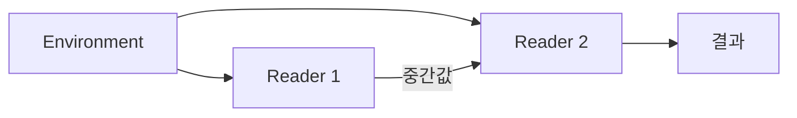

# 38장. Reader


여러 가격 계산 함수가 같은 할인율과 배송 정책, 상품 가격을 필요로 한다.
모든 함수에 환경 인자를 반복해서 전달하면 구조가 눈에 잘 띄지 않을 수 있다.
Reader는 같은 환경을 여러 계산에 전달하는 함수의 조합을 이름 있는 값으로 표현한다.

Reader의 핵심은 `R -> A`다.
파일을 읽는 전용 도구도 아니고 전역 설정을 숨기는 서비스 로케이터도 아니다.
이번 장에서는 불변 가격 환경을 사용해 견적을 계산하고 일부 하위 계산에서만 환경을 바꾸는
`local`을 다룬다.

---

## 1. 개념과 기본 구분

### 환경을 기다리는 계산

`Reader[R, A]`는 환경 `R`을 받으면 결과 `A`를 만드는 계산이다.
아직 환경을 받지 않았다면 결과 계산을 실행하지 않은 함수값으로 볼 수 있다.
환경을 명시적으로 전달하는 일반 함수와 같은 기본 구조다.

```text
Reader[R, A] ≈ R -> A
```

이 표기는 Reader가 반드시 외부 자원을 읽는다는 뜻이 아니다.
환경이 불변 설정값이고 계산이 순수하면 전체도 순수한 함수로 다룰 수 있다.
환경에 데이터베이스 연결이 들어가면 실제 효과는 별도로 존재한다.

### `map`

환경으로 얻은 결과 `A`에 일반 함수 `A -> B`를 적용한다.
같은 환경을 받는 `Reader[R, B]`를 만든다.
함수 합성의 형태로 이해할 수 있다.

### `flatMap`

첫 결과 `A`에서 다음 Reader를 선택한다.
선택된 Reader에도 같은 환경 `R`을 전달한다.
이 점이 새 상태를 다음 단계로 전달하는 State와 다르다.

### `ask`와 `local`

`ask`는 현재 환경을 결과로 얻는 계산이다.
`local`은 특정 계산에 전달할 환경을 변환한다.
원래 환경 객체를 변경하는 전역 설정 갱신과 구분해야 한다.

---

## 2. 명령형 스타일과 함수형 스타일

### 환경 인자의 반복

```text
findPrice(sku, environment)
calculateDiscount(amount, environment)
calculateShipping(netAmount, environment)
```

명시적인 인자 전달은 단순하고 좋은 출발점이다.
하지만 여러 단계에서 같은 환경을 반복 전달하면 업무 연결보다 환경 배관이 두드러질 수 있다.
Reader는 그 반복 구조를 조합 연산으로 묶는다.

### 함수값으로 환경을 남겨 둔다

```text
findPrice(sku): Reader[Environment, Option[Price]]
quote(sku, quantity): Reader[Environment, Option[Quote]]
```

호출자는 견적 계산을 먼저 조립하고 나중에 환경을 공급할 수 있다.
테스트에서는 다른 환경을 같은 계산에 넣어 결과를 비교한다.
환경의 선택이 명시적인 실행 경계에 모인다.

### 전역 변수와의 차이

전역 설정을 읽는 함수는 호출자가 실제 의존성을 보기 어려울 수 있다.
Reader는 환경 타입을 시그니처에 드러낸다.
다만 환경이 너무 커지면 필요한 세부 의존성이 다시 흐려질 수 있다.

### 필요하지 않은 추상화

한두 함수가 작은 설정값을 받는 정도라면 일반 함수 인자가 더 간단할 수 있다.
Reader를 사용해야 함수형 설계가 되는 것은 아니다.
반복되는 조합과 환경 범위가 실제로 존재하는지 확인한다.

---

## 3. 왜 이 개념을 사용하는가?

### 환경 교체의 용이성

같은 계산을 일반 정책과 특별 정책 환경에서 실행할 수 있다.
테스트 설정과 실제 설정을 분리하기 쉽다.
환경에 담긴 외부 자원의 차이까지 자동으로 같은 의미가 되는 것은 아니다.

### 의존성의 타입화

계산이 어떤 환경을 요구하는지 타입에 나타난다.
아무 전역 변수나 임의 서비스 컨테이너를 조회하는 구조보다 검토하기 쉽다.
가능하면 실제로 필요한 작은 환경 타입을 사용한다.

### 부분적인 환경 변경

`local`로 한 계산에만 할인 정책을 바꿔 적용할 수 있다.
원래 환경과 다른 계산은 그대로 유지된다.
불변 값 변환과 범위 제한이 결합되는 사례다.

### 조합의 재사용

환경을 넘기는 반복 코드를 `map`과 `flatMap`에 맡길 수 있다.
작은 계산을 합쳐 더 큰 Reader를 만든다.
일반 함수와의 대응을 이해하면 추상화가 복잡하게 느껴질 때 쉽게 풀어 읽을 수 있다.

### 효과의 가시성

Reader 자체는 환경 전달만 설명한다.
환경을 통해 실행하는 외부 작업의 오류와 수명은 별도로 표현해야 한다.
환경 전달과 I/O 실행을 한 개념으로 합치지 않는다.

---

## 4. Scala에서의 표현

### Scala의 가격 환경 Reader

가격과 할인, 배송 조건은 예제용 정책이다.
할인 적용 후 최소 단위 미만을 버리고 그 순금액으로 배송비 면제 여부를 판단한다.
이 반올림과 계산 순서는 예제의 명시적인 계약이다.

<!-- executable:scala -->
```scala
object Chapter38:
  final case class Reader[R, A](run: R => A):
    def map[B](f: A => B): Reader[R, B] = Reader(r => f(run(r)))
    def flatMap[B](f: A => Reader[R, B]): Reader[R, B] =
      Reader(r => f(run(r)).run(r))
    def local[R2](f: R2 => R): Reader[R2, A] = Reader(r2 => run(f(r2)))

  object Reader:
    def pure[R, A](value: A): Reader[R, A] = Reader(_ => value)
    def ask[R]: Reader[R, R] = Reader(identity)

  final case class Environment(
    prices: Map[String, BigInt],
    discountBps: Int,
    freeShippingAt: BigInt,
    shippingFee: BigInt
  ):
    require(discountBps >= 0 && discountBps <= 10000)
    require(freeShippingAt >= 0 && shippingFee >= 0)

  final case class Quote(net: BigInt, shipping: BigInt):
    def total: BigInt = net + shipping

  def price(sku: String): Reader[Environment, Option[BigInt]] =
    Reader(environment => environment.prices.get(sku))

  def quote(sku: String, quantity: Int): Reader[Environment, Option[Quote]] =
    require(quantity > 0)
    for
      unitPrice <- price(sku)
      environment <- Reader.ask[Environment]
    yield unitPrice.map { p =>
      val gross = p * quantity
      val net = gross * (10000 - environment.discountBps) / 10000
      val shipping = if net >= environment.freeShippingAt then BigInt(0) else environment.shippingFee
      Quote(net, shipping)
    }

  def check(): Unit =
    val environment = Environment(Map("A" -> BigInt(10000)), 1000, 20000, 3000)
    val computation = quote("A", 2)
    assert(computation.run(environment) == Some(Quote(18000, 3000)))
    assert(computation.map(_.map(_.total)).run(environment) == Some(BigInt(21000)))
    assert(quote("missing", 2).run(environment).isEmpty)
    val special = computation.local[Environment](env => env.copy(discountBps = 2000))
    assert(special.run(environment) == Some(Quote(16000, 3000)))
    assert(environment.discountBps == 1000)
    assert(computation.run(environment) == Some(Quote(18000, 3000)))
    assert(Reader.ask[Environment].run(environment) == environment)
    assert(Reader.pure[Environment, Int](3).run(environment) == 3)

    val first = Reader[Environment, Int](_.discountBps)
    val second = first.flatMap(value => Reader[Environment, Int](env => value + env.discountBps))
    assert(second.run(environment) == 2000)
    val f: Int => Reader[Environment, Int] = x => Reader(env => x + env.discountBps)
    val g: Int => Reader[Environment, String] = x => Reader(env => s"$x:${env.shippingFee}")
    assert(first.flatMap(f).flatMap(g).run(environment) ==
      first.flatMap(x => f(x).flatMap(g)).run(environment))
```

### 선택값은 별도의 층이다

견적 계산의 결과는 `Option[Quote]`다.
Reader는 환경을 전달하고 Option은 상품 부재를 표현한다.
두 컨텍스트를 중첩했다고 부재나 외부 오류가 자동으로 모두 같은 방식으로 처리되는 것은 아니다.

### 생성 시점의 검사

수량의 양수 조건은 Reader를 만드는 시점에 검사한다.
환경을 받아 실행할 때 발생하는 실패와 구분해야 한다.
사용자 입력이라면 스마트 생성자나 오류 결과를 사용해 그 경계를 더 명확하게 만들 수 있다.

---

## 5. 상태 변경보다 값 변환

### 같은 환경의 공유

첫 계산과 다음 계산에 같은 환경값을 전달한다.
첫 계산이 새 환경을 반환하여 다음 단계가 그 환경을 사용하는 구조는 아니다.
상태 변화가 필요한 경우에는 State와 비교해야 한다.



환경이 불변이면 여러 계산에서 공유하기 쉽다.
환경 안에 가변 객체가 있으면 같은 참조를 공유하는 문제가 남는다.
Reader는 깊은 불변성을 자동으로 제공하지 않는다.

### `local`의 범위

환경을 복사하거나 변환하여 특정 계산에만 공급한다.
그 변환이 원래 객체를 직접 변경하면 의도한 범위 제한이 깨질 수 있다.
`local`에 전달하는 함수도 입력 보존 계약을 지켜야 한다.

### 큰 환경의 분해

가격 계산에는 가격 정책만, 표시에는 언어 설정만 필요할 수 있다.
전체 애플리케이션 환경에서 필요한 부분으로 투영하는 `local`을 사용할 수 있다.
작은 의존성 타입으로 필요한 정보를 드러낸다.

---

## 6. 함수 합성과 데이터 흐름

### 일반 함수로 풀어 읽기

`Reader(r => f(run(r)))`는 환경을 받아 기존 계산의 결과를 변환한다.
`flatMap`은 같은 환경으로 첫 결과를 얻고 그 결과가 선택한 다음 계산에도 환경을 전달한다.
문맥 인자나 라이브러리 문법을 제거해도 기본 구조는 함수 조합이다.

```text
flatMap(reader, next).run(r)
  = next(reader.run(r)).run(r)
```

### Reader의 법칙

값 주입은 환경을 사용하지 않고 해당 값을 반환한다.
항등적인 연결은 원래 환경 함수와 같은 결과를 낸다.
연결의 괄호를 바꾸어도 같은 환경과 중간값이 전달된다.
일반적인 법칙은 관측 가능한 실행 의미를 기준으로 설명한다.

### ReaderT의 방향

`R -> F[A]`처럼 환경 함수의 결과가 다른 컨텍스트에 들어 있을 수 있다.
이 구조는 ReaderT나 Kleisli 관점으로 일반화할 수 있다.
환경 전달과 실패·I/O의 연결 규칙을 함께 다루되 서로의 역할을 구분해야 한다.

### 의존성 주입과의 관계

Reader는 의존성을 함수 입력으로 전달하는 한 가지 표현이다.
생성자 인자나 일반 함수 인자도 같은 목적을 달성할 수 있다.
Reader를 사용하는 것 자체가 좋은 의존성 설계를 보장하지 않는다.

---

## 7. 장점과 트레이드오프

### 장점과 트레이드오프

| 선택 | 장점 | 주의점 |
| --- | --- | --- |
| 명시적인 환경 타입 | 의존성 가시화 | 너무 큰 환경 |
| Reader 조합 | 반복 전달 감소 | 추상화 학습 비용 |
| `local` | 부분 환경 변환 | 원본 변경의 위험 |
| 계산과 실행 분리 | 환경별 테스트 | 실행 시점의 이해 |
| 다른 컨텍스트 중첩 | 환경과 오류 분리 | 중첩 타입 복잡성 |

### 숨은 서비스 컨테이너

환경에 모든 서비스를 넣고 문자열 키로 아무거나 꺼내면 의존성이 다시 숨는다.
Reader라는 이름을 사용해도 서비스 로케이터의 문제를 그대로 가질 수 있다.
필요한 연산과 데이터만 공개한다.

### 지나친 래핑

단순한 함수 몇 개를 Reader로 감싸면 코드가 더 길어질 수 있다.
환경 전달이 반복되고 조합을 재사용하는 실제 요구가 있는지 확인한다.
일반 함수로 풀었을 때 더 명확하면 그 형태를 유지해도 된다.

### 실행 비용

Reader 조합은 함수 객체와 호출을 추가할 수 있다.
컴파일러가 일부를 최적화할 수 있어도 무조건 무비용이라고 가정하지 않는다.
깊은 연결의 스택 사용과 실제 병목을 따로 확인한다.

---

## 8. 상태와 부수효과의 경계

### 환경의 자원 수명

환경에 데이터베이스 연결이나 파일 핸들이 들어가면 실행 시 그 자원이 열려 있어야 한다.
Reader를 만든 위치보다 실제 `run` 위치의 수명이 중요하다.
환경을 보관하는 것과 자원을 안전하게 획득·해제하는 것은 다른 책임이다.

### 외부 상태 읽기

환경에 저장된 함수가 현재 가격을 조회할 수 있다.
그 경우 같은 Reader와 같은 환경 객체를 사용해도 외부 상태에 따라 결과가 달라질 수 있다.
환경이 같다는 사실만으로 순수성을 주장하지 않는다.

### 권한과 최소 의존성

계산에 가격 읽기만 필요하면 전체 관리자 데이터베이스 연결을 전달하지 않는 편이 낫다.
작은 포트나 스냅샷으로 필요한 권한을 제한할 수 있다.
실제 보안 강제는 실행 환경과 접근 정책의 별도 문제다.

### 설정 버전

가격과 할인 정책의 버전이 결과에 중요하면 환경에 명시적으로 포함할 수 있다.
현재 전역 설정을 몰래 읽는 것보다 재현에 유리하다.
정책 변경과 과거 결과의 해석을 함께 고려한다.

---

## 9. Python에서 적용하기

### Python의 환경 함수 래퍼

Python에서도 제네릭 Reader 클래스로 환경 전달을 표현할 수 있다.
가격 목록은 불변 품목 튜플로 보관하여 예제의 공유 의도를 명확히 한다.
실제 대규모 조회에는 다른 자료구조와 비용 모델이 필요할 수 있다.

<!-- executable:python -->
```python
from collections.abc import Callable
from dataclasses import dataclass, replace
from typing import Generic, TypeVar

R = TypeVar("R")
R2 = TypeVar("R2")
A = TypeVar("A")
B = TypeVar("B")


@dataclass(frozen=True)
class Reader(Generic[R, A]):
    run: Callable[[R], A]

    def map(self, function: Callable[[A], B]) -> "Reader[R, B]":
        return Reader(lambda environment: function(self.run(environment)))

    def flat_map(self, function: Callable[[A], "Reader[R, B]"]) -> "Reader[R, B]":
        return Reader(lambda environment: function(self.run(environment)).run(environment))

    def local(self, function: Callable[[R2], R]) -> "Reader[R2, A]":
        return Reader(lambda environment: self.run(function(environment)))


@dataclass(frozen=True)
class Price:
    sku: str
    amount: int


@dataclass(frozen=True)
class Environment:
    prices: tuple[Price, ...]
    discount_bps: int
    free_shipping_at: int
    shipping_fee: int

    def __post_init__(self) -> None:
        if not 0 <= self.discount_bps <= 10_000 or self.free_shipping_at < 0 or self.shipping_fee < 0:
            raise ValueError("invalid pricing environment")


@dataclass(frozen=True)
class Quote:
    net: int
    shipping: int

    def total(self) -> int:
        return self.net + self.shipping


def price(sku: str) -> Reader[Environment, int | None]:
    return Reader(lambda environment: next((entry.amount for entry in environment.prices if entry.sku == sku), None))


def quote(sku: str, quantity: int) -> Reader[Environment, Quote | None]:
    if type(quantity) is not int or quantity <= 0:
        raise ValueError("quantity must be positive")

    def calculate(unit_price: int | None) -> Reader[Environment, Quote | None]:
        def run(environment: Environment) -> Quote | None:
            if unit_price is None:
                return None
            gross = unit_price * quantity
            net = gross * (10_000 - environment.discount_bps) // 10_000
            shipping = 0 if net >= environment.free_shipping_at else environment.shipping_fee
            return Quote(net, shipping)
        return Reader(run)

    return price(sku).flat_map(calculate)


def test_reader() -> None:
    environment = Environment((Price("A", 10_000),), 1000, 20_000, 3000)
    computation = quote("A", 2)
    assert computation.run(environment) == Quote(18_000, 3000)
    assert computation.map(lambda result: None if result is None else result.total()).run(environment) == 21_000
    assert quote("missing", 2).run(environment) is None
    special = computation.local(lambda env: replace(env, discount_bps=2000))
    assert special.run(environment) == Quote(16_000, 3000)
    assert environment.discount_bps == 1000
    assert computation.run(environment) == Quote(18_000, 3000)
    ask: Reader[Environment, Environment] = Reader(lambda env: env)
    assert ask.run(environment) == environment
    first: Reader[Environment, int] = Reader(lambda env: env.discount_bps)
    f = lambda value: Reader(lambda env: value + env.discount_bps)
    g = lambda value: Reader(lambda env: f"{value}:{env.shipping_fee}")
    assert first.flat_map(f).flat_map(g).run(environment) == first.flat_map(lambda value: f(value).flat_map(g)).run(environment)


if __name__ == "__main__":
    test_reader()
```

### 튜플 조회의 계약

예제는 같은 상품 코드가 한 번만 나온다는 내부 환경 계약을 전제로 한다.
외부 설정을 읽을 때 중복과 가격 범위를 검증해야 한다.
불변 튜플이라는 사실이 모든 도메인 불변식을 자동 보장하지 않는다.

---

## 10. Python의 표현 한계

### 일반 함수라는 대안

Python에서는 `Callable[[Environment], A]`를 그대로 사용해도 된다.
Reader 클래스는 조합 메서드에 이름을 주는 편의 구조다.
새 클래스를 도입하는 이득이 실제로 있는지 판단한다.

### 실행 시 타입 검사

제네릭 주석은 전달된 환경의 모든 필드를 실행 시 검사하지 않는다.
외부 설정 파싱과 내부 환경 계약을 분리한다.
동적으로 만든 객체를 그대로 신뢰하지 않는다.

### 클로저와 수명

Reader의 함수는 외부 객체를 캡처할 수 있다.
환경 인자 외에 숨은 참조를 캡처하면 의존성이 다시 보이지 않을 수 있다.
클로저의 실제 캡처와 자원 수명을 확인한다.

### 깊은 조합

단순한 람다 중첩 구현은 매우 깊은 연결에서 호출 스택을 사용할 수 있다.
이 예제는 범용 스택 안전 실행기가 아니다.
일반 함수로 풀거나 적절한 라이브러리·반복 구조를 사용하는 대안을 검토한다.

---

## 11. 핵심 정리

### 핵심 결론

Reader는 `R -> A` 형태의 환경 의존 계산을 조합한다.
`flatMap`은 같은 환경을 다음 계산에도 전달한다.
`local`은 특정 계산의 환경을 변환하며 원본 변경과 구분해야 한다.
환경 전달, 외부 I/O, 자원 수명, 보안 권한은 서로 다른 계약이다.

### 연습 1: State와의 차이

Reader의 첫 계산이 다음 계산에 전달하는 환경은 새 상태인가?

**해설.** 일반적인 Reader 연결은 같은 환경을 전달한다.
새 상태를 입력·출력으로 이어 주는 State와 다르다.
환경 객체 내부를 변경하는 구현은 별도의 가변 효과다.

### 연습 2: `local`의 안전성

`local` 함수가 원래 환경의 가변 딕셔너리를 직접 수정했다.
어떤 의도가 깨졌는가?

**해설.** 특정 계산에만 적용하려던 환경 변경이 다른 계산에도 보일 수 있다.
새 값으로 변환하거나 적절한 복사·불변 구조를 사용해야 한다.
범위 제한과 깊은 불변성의 관계를 확인한다.

### 연습 3: 연결 객체

Reader 환경에 데이터베이스 연결을 넣었으니 계산이 순수해졌다는 주장은 맞는가?

**해설.** 환경 전달 방식이 바뀌었을 뿐 외부 조회의 효과는 남는다.
오류와 자원 수명, 실행 시점을 별도로 다뤄야 한다.
의존성의 명시와 효과의 제거를 구분한다.

### 연습 4: 작은 환경

가격 계산 함수에 애플리케이션 전체 환경을 전달하는 설계를 개선하라.

**해설.** 필요한 가격과 정책만 가진 작은 환경으로 투영할 수 있다.
일반 인자나 `local`을 사용해 경계를 좁힌다.
Reader라는 이름보다 실제 의존성의 크기가 중요하다.

### 다음 장과 참고 자료

다음 장은 같은 환경을 읽는 대신 변화하는 상태값을 순서대로 전달하는 State를 다룬다.
순수한 상태 전이와 실제 저장소 갱신의 차이를 계속 확인한다.

[Cats 공식 문서: Kleisli](https://typelevel.org/cats/datatypes/kleisli.html)
[Scala 공식 문서: Function Types](https://docs.scala-lang.org/scala3/book/fun-function-variables.html)
[Python 공식 문서: typing.Callable](https://docs.python.org/3.14/library/typing.html#typing.Callable)
