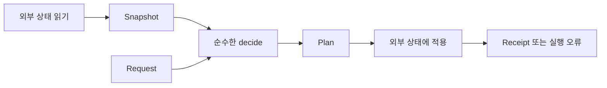

# 37장. Side Effects


함수형 프로그래밍은 실제 프로그램에서 파일, 데이터베이스, 네트워크를 없애는 기법이 아니다.
업무 판단을 값 계산으로 정리하고 외부 세계와 상호작용하는 위치를 명확히 하는 설계다.
6부에서는 환경, 상태, 로그, I/O, 의존성, 비동기 실행을 서로 다른 관점으로 다룬다.

이번 장은 효과의 종류와 관측 범위를 먼저 정리한다.
재고 스냅샷으로 예약 계획을 계산하는 일과 실제 재고를 바꾸는 일을 분리한다.
계획이 성공했다는 사실을 외부 실행이 성공했다는 사실로 오해하지 않는 것이 중요하다.

---

## 1. 개념과 기본 구분

### 반환값 밖에서 관측되는 변화

함수가 반환값 외의 상태를 바꾸거나 외부 환경을 읽으면 그 환경과 실행 이력이 결과에 영향을 줄 수
있다.
파일 쓰기, 데이터베이스 변경, 네트워크 요청, 로그 출력이 대표적인 예다.
시간과 난수, 변경 가능한 설정의 읽기도 계산의 외부 의존성을 만든다.

```text
값 계산
  명시적인 입력 -> 명시적인 출력

효과 실행
  입력 + 외부 세계 -> 출력 + 바뀐 외부 세계
```

모든 효과가 쓰기인 것은 아니다.
읽기 전용 조회도 시점과 환경에 따라 다른 값을 반환하거나 실패할 수 있다.
읽기와 순수성을 같은 의미로 사용하지 않는다.

### 지역 변경과 외부 변경

함수 내부에서 임시 변수를 갱신하는 일은 외부에서 관측되지 않을 수 있다.
외부 객체를 바꾸거나 가변 참조를 반환하면 관측 범위가 달라진다.
대입 문법 하나만으로 순수성을 판단하지 않는다.

### 결정성과 순수성

항상 같은 로그를 출력하는 함수도 외부에 영향을 준다.
결과가 결정적이라는 사실이 부수효과가 없다는 뜻은 아니다.
순수성, 결정성, 멱등성, 전체성은 서로 다른 성질이다.

### 실행 설명과 실행

예약할 품목 목록을 값으로 만드는 것은 실제 예약과 다르다.
명령 데이터나 IO 값은 실행할 작업을 설명할 수 있다.
그 설명을 해석하여 외부 상태를 바꾸는 경계가 별도로 필요하다.

---

## 2. 명령형 스타일과 함수형 스타일

### 계산과 저장이 섞인 함수

```text
현재 재고 조회
수량 검사
가격 계산
재고 감소
로그 출력
응답 생성
```

이 흐름을 하나의 함수에 넣으면 테스트마다 저장소와 로그를 준비해야 할 수 있다.
중간 실패가 어디까지 효과를 남겼는지도 파악하기 어렵다.
값 판단과 외부 실행을 나누면 책임이 더 선명해진다.

### 스냅샷으로 계획을 만든다

```text
Request × Snapshot -> Plan 또는 오류
```

계획 계산은 주어진 스냅샷에서 가능한지 판단한다.
입력값이 같으면 같은 계획을 만들 수 있다.
실제 현재 재고가 여전히 같은지는 실행 경계에서 확인해야 한다.

### 실행 경계

```text
Plan -> 저장소에 조건부 적용 -> Receipt 또는 오류
```

계획에 기대 버전을 포함하면 오래된 판단을 감지하는 데 사용할 수 있다.
하지만 실제 저장소가 비교와 변경을 원자적으로 수행해야 한다.
값 모델만으로 동시성 제어가 완성되는 것은 아니다.

### 가짜 성공을 만들지 않는다

계획 계산이 성공했을 때 “예약 완료”라고 응답하면 실제 실행 실패를 놓칠 수 있다.
예정, 승인 가능한 판단, 실행 완료를 다른 상태로 구분한다.
함수 이름과 결과 타입이 보장하는 사실을 정확히 표현해야 한다.

---

## 3. 왜 이 개념을 사용하는가?

### 빠른 계산 테스트

재고와 가격의 작은 스냅샷만으로 업무 판단을 테스트할 수 있다.
네트워크나 데이터베이스 없이 경계값을 다양하게 확인한다.
외부 어댑터의 테스트는 별도로 집중할 수 있다.

### 실패 범위의 구분

수량이 잘못된 입력 실패와 저장 충돌 같은 실행 실패를 구분한다.
외부 작업의 부분 성공 여부도 별도 정책으로 다룬다.
모든 실패를 한 문자열로 합치지 않는다.

### 재현 가능한 판단

판단에 사용한 가격과 재고 버전을 보관하면 당시 결정을 다시 계산할 수 있다.
현재 외부 상태를 다시 읽는 것과 과거 스냅샷을 재현하는 것은 다르다.
필요한 입력을 명시적으로 수집하는 것이 중요하다.

### 권한의 축소

순수한 판단 함수는 데이터베이스 연결이나 파일 쓰기 권한을 받을 필요가 없다.
필요한 값만 전달하면 실수로 외부 작업을 수행할 경로가 줄어든다.
언어와 실행 환경이 강제하는 보안 격리와는 구분해야 한다.

### 운영 정책의 분리

재시도, 시간 제한, 로그, 트랜잭션은 효과 경계에서 결정할 수 있다.
업무 계산에 이런 정책을 섞지 않으면 변경을 더 국소화할 수 있다.
단, 정책에 필요한 도메인 정보를 경계에 충분히 전달해야 한다.

---

## 4. Scala에서의 표현

### Scala의 계획과 실행 모형

아래 저장소는 단일 스레드 테스트를 위한 메모리 모형이다.
실제 데이터베이스의 원자적 비교·갱신이나 분산 멱등성을 구현한 것이 아니다.
계획을 계산하는 단계와 적용하는 단계의 관측 차이를 확인한다.

<!-- executable:scala -->
```scala
object Chapter37:
  final case class Request(quantity: Int)
  final case class Snapshot(unitPrice: BigInt, available: Int, version: Long)
  final case class Plan(quantity: Int, amount: BigInt, expectedVersion: Long)
  final case class Receipt(quantity: Int, newVersion: Long)

  enum Error:
    case InvalidQuantity
    case OutOfStock
    case Conflict

  def decide(request: Request, snapshot: Snapshot): Either[Error, Plan] =
    if request.quantity <= 0 then Left(Error.InvalidQuantity)
    else if request.quantity > snapshot.available then Left(Error.OutOfStock)
    else Right(Plan(request.quantity, snapshot.unitPrice * request.quantity, snapshot.version))

  final class FakeStore(unitPrice: BigInt, initialStock: Int):
    require(unitPrice >= 0 && initialStock >= 0)
    private var available = initialStock
    private var version = 0L
    private var applied = Vector.empty[Receipt]

    def snapshot: Snapshot = Snapshot(unitPrice, available, version)
    def receipts: Vector[Receipt] = applied

    def execute(plan: Plan): Either[Error, Receipt] =
      if plan.quantity <= 0 then Left(Error.InvalidQuantity)
      else if plan.expectedVersion != version then Left(Error.Conflict)
      else if plan.quantity > available then Left(Error.OutOfStock)
      else
        available -= plan.quantity
        version += 1
        val receipt = Receipt(plan.quantity, version)
        applied = applied :+ receipt
        Right(receipt)

  def check(): Unit =
    val store = new FakeStore(1000, 5)
    val before = store.snapshot
    val request = Request(2)
    val first = decide(request, before)
    val second = decide(request, before)
    assert(first == second)
    assert(first == Right(Plan(2, 2000, 0)))
    assert(store.snapshot == before)
    assert(store.receipts.isEmpty)
    assert(decide(Request(0), before) == Left(Error.InvalidQuantity))
    assert(decide(Request(6), before) == Left(Error.OutOfStock))

    val result = first.flatMap(store.execute)
    assert(result == Right(Receipt(2, 1)))
    assert(store.snapshot == Snapshot(1000, 3, 1))
    assert(store.receipts == Vector(Receipt(2, 1)))
    assert(second.flatMap(store.execute) == Left(Error.Conflict))
    assert(store.snapshot.available == 3)
    val refreshed = decide(Request(2), store.snapshot).flatMap(store.execute)
    assert(refreshed == Right(Receipt(2, 2)))
    assert(store.snapshot.available == 1)
```

### 모형의 보장 범위

같은 스냅샷으로 계획을 두 번 계산해도 저장소는 바뀌지 않는다.
계획을 적용하면 재고와 버전, 영수증 목록이 바뀐다.
오래된 계획을 다시 적용하면 이 모형에서는 충돌을 반환한다.
이 테스트가 실제 동시 요청의 원자성을 증명하는 것은 아니다.

### 계획의 신뢰

공개된 `Plan` 생성자가 있다는 사실만으로 외부 입력을 그대로 신뢰해도 되는 것은 아니다.
금액과 권한, 대상 상품은 신뢰할 수 있는 경계에서 검증해야 한다.
예제의 저장소는 재고 적용만 모형화하며 실제 결제 처리를 수행하지 않는다.

---

## 5. 상태 변경보다 값 변환

### 관측 가능한 세계를 나눈다

순수한 판단에서는 입력 스냅샷과 결과 계획을 비교한다.
효과 실행에서는 저장소의 이전 상태와 이후 상태도 함께 관측한다.
같은 반환값이 나왔다는 사실만으로 두 실행이 같다고 판단하지 않는다.



읽기와 쓰기 사이에 외부 상태가 바뀔 수 있다.
계획이 어떤 시점의 입력을 사용했는지 명시하는 이유다.
실제 경계에서는 트랜잭션과 조건부 갱신 같은 수단을 검토한다.

### 효과를 데이터로 표현한다

로그 문구를 바로 출력하지 않고 이벤트값을 반환할 수 있다.
예약 요청을 즉시 보내지 않고 명령값을 만들 수 있다.
이렇게 표현한 데이터가 언제 실행되고 얼마나 보관되는지는 별도의 정책이다.

### 지연과 순수성

효과를 함수에 감싸 나중에 실행하도록 만들 수 있다.
그 함수의 호출 자체는 여전히 효과를 수행한다.
실행을 미뤘다는 사실과 계산 전체가 순수하다는 주장을 구분한다.

---

## 6. 함수 합성과 데이터 흐름

### 효과 분리의 세 단계

필요한 외부 정보를 읽어 값으로 만든다.
그 값으로 판단과 계획을 계산한다.
계획을 실제 외부 시스템에 적용하고 결과를 해석한다.
이 구조는 이후 Functional Core, Imperative Shell 패턴으로 확장된다.

```text
read -> compute -> execute
```

### Reader, State, Writer의 위치

Reader는 환경값을 여러 계산에 전달하는 구조다.
State는 상태값을 입력과 출력으로 이어 주는 구조다.
Writer는 결과와 함께 로그 데이터를 결합하는 구조다.
각 구조가 실제 외부 읽기·쓰기와 같은 의미인지 구현을 확인해야 한다.

### IO의 위치

IO는 외부 효과를 수행할 계산을 값으로 표현하고 조합하는 데 사용할 수 있다.
실행 시점과 자원, 취소를 관리하는 실행기가 중요하다.
함수 하나를 감싼 학습용 모형과 제품용 실행기의 보장 범위는 다르다.

### 효과를 줄이기보다 정렬한다

프로그램에 필요한 외부 작업은 여전히 수행해야 한다.
핵심은 불필요한 혼합을 줄이고 실행 경계를 명확히 하는 것이다.
순수 함수의 비율만으로 설계의 품질을 판단하지 않는다.

---

## 7. 장점과 트레이드오프

### 장점과 트레이드오프

| 분리 대상 | 이점 | 남는 책임 |
| --- | --- | --- |
| 스냅샷과 판단 | 재현 가능한 테스트 | 읽은 시점의 일관성 |
| 계획과 실행 | 효과 위치 명확 | 실제 실행 실패 |
| 로그 데이터와 출력 | 표시 정책 분리 | 내구성과 공개 범위 |
| 지역 상태와 외부 상태 | 관측 범위 축소 | 별칭과 자원 수명 |
| 오류 종류 | 복구 정책 명확 | 부분 성공 판단 |

### 중간 데이터의 비용

스냅샷과 계획을 만들면 추가 객체와 변환 코드가 생길 수 있다.
하지만 테스트와 감사, 재현의 이득도 얻을 수 있다.
모든 계층을 복제하는 과도한 DTO 설계와 필요한 경계값을 구분한다.

### 큰 스냅샷

판단에 필요 없는 전체 데이터베이스 상태를 복사할 필요는 없다.
함수가 필요한 최소 데이터를 수집한다.
값 중심 설계가 전체 외부 세계를 메모리에 복제하라는 뜻은 아니다.

### 단순한 작업

작은 파일 변환 프로그램에서는 명시적인 자원 범위와 몇 개의 함수만으로 충분할 수 있다.
복잡한 효과 프레임워크를 도입하기 전에 실제 실패·재사용 요구를 확인한다.
경계를 드러내는 가장 단순한 구조를 선택한다.

---

## 8. 상태와 부수효과의 경계

### 멱등성과 재시도

같은 효과를 다시 실행해도 결과가 누적되지 않도록 하는 정책은 별도다.
버전 검사와 멱등성 키는 서로 다른 문제를 다룰 수 있다.
시간 초과 후 외부 작업이 성공했는지 모르는 상황을 명시적으로 처리해야 한다.

### 원자적인 적용

메모리 모형의 비교와 변경은 실제 여러 스레드나 프로세스에서 원자적이라고 가정할 수 없다.
저장소가 제공하는 조건부 갱신과 트랜잭션을 사용해야 할 수 있다.
도메인 계획과 저장 프로토콜을 함께 검증한다.

### 취소와 자원 정리

효과 실행 중 취소되면 열린 자원과 부분 작업을 처리해야 한다.
순수한 계획은 취소될 외부 자원이 없을 수 있지만 실제 실행은 다르다.
실행기의 취소 계약과 자원 범위를 확인한다.

### 감사와 개인정보

계획과 스냅샷을 보관하면 재현에 도움이 된다.
동시에 개인정보와 내부 정책이 오래 남을 수 있다.
필요한 최소 정보, 보관 기간, 접근 범위를 정한다.

---

## 9. Python에서 적용하기

### Python의 판단 함수와 실행 객체

Python에서도 순수한 계산과 변경 가능한 어댑터를 명시적으로 나눌 수 있다.
아래 모형은 실제 데이터베이스가 아니라 단일 스레드의 동작을 확인하는 테스트용 객체다.
계획 계산과 실행의 차이를 상태 비교로 확인한다.

<!-- executable:python -->
```python
from dataclasses import dataclass
from enum import Enum


class Error(Enum):
    INVALID_QUANTITY = "invalid_quantity"
    OUT_OF_STOCK = "out_of_stock"
    CONFLICT = "conflict"


@dataclass(frozen=True)
class Request:
    quantity: int


@dataclass(frozen=True)
class Snapshot:
    unit_price: int
    available: int
    version: int


@dataclass(frozen=True)
class Plan:
    quantity: int
    amount: int
    expected_version: int


@dataclass(frozen=True)
class Receipt:
    quantity: int
    new_version: int


def decide(request: Request, snapshot: Snapshot) -> Plan | Error:
    if type(request.quantity) is not int or request.quantity <= 0:
        return Error.INVALID_QUANTITY
    if request.quantity > snapshot.available:
        return Error.OUT_OF_STOCK
    return Plan(request.quantity, request.quantity * snapshot.unit_price, snapshot.version)


class FakeStore:
    def __init__(self, unit_price: int, stock: int) -> None:
        if unit_price < 0 or stock < 0:
            raise ValueError("invalid store state")
        self._unit_price = unit_price
        self._stock = stock
        self._version = 0
        self._receipts: list[Receipt] = []

    def snapshot(self) -> Snapshot:
        return Snapshot(self._unit_price, self._stock, self._version)

    def receipts(self) -> tuple[Receipt, ...]:
        return tuple(self._receipts)

    def execute(self, plan: Plan) -> Receipt | Error:
        if type(plan.quantity) is not int or plan.quantity <= 0:
            return Error.INVALID_QUANTITY
        if plan.expected_version != self._version:
            return Error.CONFLICT
        if plan.quantity > self._stock:
            return Error.OUT_OF_STOCK
        self._stock -= plan.quantity
        self._version += 1
        receipt = Receipt(plan.quantity, self._version)
        self._receipts.append(receipt)
        return receipt


def test_plan_and_effect() -> None:
    store = FakeStore(1000, 5)
    before = store.snapshot()
    plan = decide(Request(2), before)
    assert plan == decide(Request(2), before)
    assert plan == Plan(2, 2000, 0)
    assert store.snapshot() == before
    assert store.receipts() == ()
    assert decide(Request(0), before) is Error.INVALID_QUANTITY
    assert decide(Request(6), before) is Error.OUT_OF_STOCK
    assert isinstance(plan, Plan)
    assert store.execute(plan) == Receipt(2, 1)
    assert store.snapshot() == Snapshot(1000, 3, 1)
    assert store.receipts() == (Receipt(2, 1),)
    assert store.execute(plan) is Error.CONFLICT
    assert store.snapshot().available == 3
    refreshed = decide(Request(2), store.snapshot())
    assert isinstance(refreshed, Plan)
    assert store.execute(refreshed) == Receipt(2, 2)
    assert store.snapshot().available == 1


if __name__ == "__main__":
    test_plan_and_effect()
```

### 실서비스 어댑터의 추가 요구

실제 저장소에서는 경쟁 요청과 연결 실패, 응답 유실이 존재한다.
메모리 모형을 통과했다고 그런 문제까지 해결되었다고 볼 수 없다.
같은 포트 계약에 대한 통합 테스트와 원자적 저장 정책이 필요하다.

---

## 10. Python의 표현 한계

### 순수성의 자동 강제

Python의 함수와 타입 주석은 외부 상태 접근을 자동으로 금지하지 않는다.
모듈 경계, 명시적인 입력, 리뷰와 테스트로 의존성을 관리한다.
강제 수준이 필요한 환경에서는 별도의 도구나 실행 격리를 검토해야 한다.

### 깊은 불변성

frozen 데이터 클래스가 외부 객체 전체를 깊게 고정하는 것은 아니다.
필드에 가변 컬렉션이나 자원 핸들을 넣으면 상태가 바뀔 수 있다.
스냅샷의 실제 객체 그래프를 확인해야 한다.

### 효과의 암묵적 발생

속성 접근, 반복, 문자열 변환에서도 사용자 정의 코드가 실행될 수 있다.
평범한 값처럼 보이는 객체가 외부 효과를 수행하는지 확인한다.
경계에서 단순한 도메인 값으로 변환하면 검토 범위를 줄일 수 있다.

### 테스트 모형과 현실

가짜 저장소는 규칙을 빠르게 검증하는 도구다.
실제 연결 관리와 트랜잭션, 장애 모드는 별도로 확인해야 한다.
모형의 단순함을 제품의 보장으로 확대하지 않는다.

---

## 11. 핵심 정리

### 핵심 결론

함수형 설계는 필요한 효과를 제거하기보다 계산과 실행의 경계를 명확히 한다.
읽기 효과, 외부 변경, 지역 변경, 실행 설명을 구분해야 한다.
계획 성공은 외부 실행 성공이 아니다.
멱등성, 원자성, 취소, 자원 정리는 효과 경계의 별도 계약이다.

### 연습 1: 읽기 전용 조회

데이터베이스를 읽기만 하는 함수는 항상 순수한가?

**해설.** 외부 상태와 시점에 따라 결과가 달라지거나 실패할 수 있다.
읽기 전용과 순수성은 다르다.
조회한 값을 명시적 입력으로 전달하면 그 뒤 계산을 분리할 수 있다.

### 연습 2: 계획과 영수증

예약 계획을 만들자마자 예약 완료 응답을 반환했다.
어떤 경계를 놓쳤는가?

**해설.** 실제 저장소 적용과 그 성공 확인을 수행하지 않았다.
계획과 실행 완료를 다른 결과로 표현해야 한다.
오래된 스냅샷과 실행 실패를 고려한다.

### 연습 3: 지역 변수

집계 함수가 지역 누산 변수를 갱신하므로 반드시 부수효과가 있다는 주장은 맞는가?

**해설.** 외부에서 관측되는 변경인지 확인해야 한다.
입력과 외부 상태를 바꾸지 않고 결과만 반환하면 값 계산으로 추론할 수 있다.
대입 문법과 외부 효과를 구분한다.

### 연습 4: 버전 검사

메모리 예제의 버전 비교가 있으니 실제 동시 요청에도 안전하다고 판단했다.
무엇이 더 필요한가?

**해설.** 비교와 변경이 실제 저장소에서 원자적으로 수행되어야 한다.
스레드·프로세스 경쟁과 실패 모드를 검증해야 한다.
값 모델의 의도와 실행 프로토콜의 보장을 구분한다.

### 다음 장과 참고 자료

다음 장은 여러 계산이 공유하는 환경값을 Reader로 전달한다.
환경을 읽는 구조와 실제 외부 I/O의 차이를 계속 구분한다.

[Scala 공식 문서: Pure Functions](https://docs.scala-lang.org/scala3/book/fp-pure-functions.html)
[Cats Effect 공식 문서: Getting Started](https://typelevel.org/cats-effect/docs/getting-started)
[Python 공식 문서: Data Model](https://docs.python.org/3.14/reference/datamodel.html)
