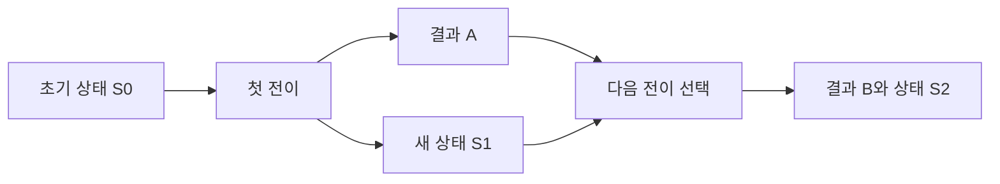

# 39장. State

Reader는 여러 계산에 같은 환경을 전달했다.
그러나 장바구니의 수량이나 재고 모형처럼 앞 계산이 만든 새 상태를 다음 계산에 전달해야 하는
경우도 있다.
State는 이런 상태 전달을 입력과 출력이 명시적인 함수로 표현한다.

이번 장은 메모리 안의 재고값에서 예약 결과와 새 재고값을 계산한다.
실제 데이터베이스를 갱신하지 않으며, 이전 상태를 값으로 보존할 수 있다.
실패 시 어떤 상태가 남는지와 그 상태를 되돌리는 정책이 무엇인지 명확히 구분한다.

---

## 1. 개념과 기본 구분

### 상태를 받아 결과와 상태를 돌려준다

State의 기본 구조는 상태 `S`를 받아 결과 `A`와 새 상태 `S`를 반환하는 함수다.
이 책의 예제는 결과를 먼저, 상태를 나중에 두는 튜플 순서를 사용한다.
라이브러리마다 순서가 다를 수 있으므로 실제 API의 계약을 확인해야 한다.

```text
State[S, A] ≈ S -> (A, S)
```

함수 밖의 공유 변수를 반드시 변경해야 하는 구조가 아니다.
불변 상태값을 입력받아 새 상태값을 만들 수 있다.
상태 변화라는 도메인 개념과 가변 메모리 갱신이라는 구현 기법을 구분한다.

### `map`

기존 계산을 한 번 실행하여 결과와 새 상태를 얻는다.
결과값만 변환하고 새 상태는 그대로 전달한다.
상태를 두 번 실행하거나 원래 상태로 되돌리면 다른 의미가 된다.

### `flatMap`

첫 계산이 만든 결과로 다음 State 계산을 선택한다.
그 계산에는 첫 계산이 반환한 새 상태를 전달한다.
같은 환경을 계속 전달하는 Reader와의 중요한 차이다.

### 상태 기본 연산

`get`은 현재 상태를 결과로 읽고 상태 자체는 유지한다.
`set`은 새 상태를 지정하며 `modify`는 상태 변환 함수를 적용한다.
이 연산들은 실제 외부 저장소의 읽기와 쓰기가 아니라 상태 함수의 조립일 수 있다.

---

## 2. 명령형 스타일과 함수형 스타일

### 공유 재고 변수의 갱신

```text
전역 재고에서 A를 감소시킨다
전역 재고에서 B를 감소시킨다
중간에 실패하면 현재 전역 재고가 무엇인지 확인한다
```

실행 순서와 이전 호출이 다음 결과에 영향을 준다.
테스트마다 전역 상태를 초기화해야 할 수 있다.
상태를 명시적인 입력·출력으로 바꾸면 변화의 경로가 드러난다.

### 순수한 상태 전이

```text
reserveA: Inventory -> (ResultA, Inventory)
reserveB: Inventory -> (ResultB, Inventory)
```

첫 번째 전이가 만든 재고를 두 번째 전이에 전달한다.
원래 재고값은 그대로 보존할 수 있다.
State는 이 반복적인 상태 전달을 조합 연산으로 묶는다.

### 잘못된 연결

두 번째 계산에 원래 상태를 다시 전달하면 첫 변경이 사라질 수 있다.
두 결과가 각각 성공했더라도 전체 새 상태가 잘못될 수 있다.
`flatMap`의 핵심은 중간 결과뿐 아니라 중간 상태도 정확히 전달하는 것이다.

### 실패가 자동 롤백은 아니다

State의 결과를 `Either`로 만들면 실패와 상태를 함께 반환할 수 있다.
앞 단계의 상태 변경 후 뒤 단계가 실패하면 변경된 상태가 남는 정책도 가능하다.
실패 시 원래 상태로 되돌릴지는 명시적인 조합 규칙으로 정해야 한다.

---

## 3. 왜 이 개념을 사용하는가?

### 재현 가능한 상태 계산

같은 초기 상태와 같은 입력으로 같은 결과와 상태를 계산할 수 있다.
복잡한 상태 전이를 저장소 없이 테스트한다.
현재 전역 상태를 다시 읽는 테스트보다 초기 조건이 명확해진다.

### 전이의 조합

작은 상태 전이를 순서대로 연결할 수 있다.
각 전이는 자신이 필요한 결과와 새 상태만 반환한다.
중간 상태를 수동으로 전달하는 반복 코드가 줄어든다.

### 이전 상태의 보존

불변 상태값을 사용하면 이전 상태를 비교와 디버깅에 활용할 수 있다.
시뮬레이션에서 여러 입력을 같은 시작점에 적용하기도 쉽다.
모든 과거 상태를 보관하면 메모리 비용이 생긴다는 점은 별도다.

### 실패 정책의 가시성

부분 변경을 유지할지 원래 상태로 되돌릴지 함수로 표현할 수 있다.
정책을 테스트하여 중간 실패의 결과를 확인한다.
실제 외부 효과가 섞이면 같은 방식으로 모두 되돌릴 수 있는 것은 아니다.

### 모델과 실행의 분리

게임 상태, 편집기 상태, 예약 모형 같은 계산을 순수한 전이로 구성할 수 있다.
계산된 새 상태를 외부 저장소에 채택하는 일은 다른 경계다.
충돌 검사와 저장 실패를 상태 함수의 성공과 구분한다.

---

## 4. Scala에서의 표현

### Scala의 재고 상태 전이

예제의 재고는 불변 맵을 가진 값이다.
예약은 그 값을 바꾸어 반환할 뿐 실제 창고나 데이터베이스에 요청하지 않는다.
실패에서 상태를 보존하거나 되돌리는 두 정책을 같은 입력으로 비교한다.

<!-- executable:scala -->
```scala
object Chapter39:
  final case class State[S, A](run: S => (A, S)):
    def map[B](f: A => B): State[S, B] = State { initial =>
      val (value, next) = run(initial)
      (f(value), next)
    }
    def flatMap[B](f: A => State[S, B]): State[S, B] = State { initial =>
      val (value, next) = run(initial)
      f(value).run(next)
    }

  object State:
    def pure[S, A](value: A): State[S, A] = State(s => (value, s))
    def get[S]: State[S, S] = State(s => (s, s))
    def set[S](next: S): State[S, Unit] = State(_ => ((), next))
    def modify[S](f: S => S): State[S, Unit] = State(s => ((), f(s)))

  final case class Inventory(available: Map[String, Int]):
    require(available.values.forall(_ >= 0))
  final case class Reservation(sku: String, quantity: Int)
  enum ReserveError:
    case InvalidQuantity
    case UnknownSku
    case OutOfStock

  def reserve(sku: String, quantity: Int): State[Inventory, Either[ReserveError, Reservation]] =
    State { inventory =>
      if quantity <= 0 then (Left(ReserveError.InvalidQuantity), inventory)
      else inventory.available.get(sku) match
        case None => (Left(ReserveError.UnknownSku), inventory)
        case Some(stock) if stock < quantity => (Left(ReserveError.OutOfStock), inventory)
        case Some(stock) =>
          val next = Inventory(inventory.available.updated(sku, stock - quantity))
          (Right(Reservation(sku, quantity)), next)
    }

  def reservePair(a: Int, b: Int): State[Inventory, Either[ReserveError, (Reservation, Reservation)]] =
    reserve("A", a).flatMap {
      case Left(error) => State.pure[Inventory, Either[ReserveError, (Reservation, Reservation)]](Left(error))
      case Right(first) => reserve("B", b).map(_.map(second => (first, second)))
    }

  def rollbackOnLeft[S, E, A](program: State[S, Either[E, A]]): State[S, Either[E, A]] =
    State { initial =>
      val (result, next) = program.run(initial)
      result match
        case Left(_) => (result, initial)
        case Right(_) => (result, next)
    }

  def check(): Unit =
    val initial = Inventory(Map("A" -> 3, "B" -> 1))
    val failed = reservePair(2, 2).run(initial)
    assert(failed._1 == Left(ReserveError.OutOfStock))
    assert(failed._2 == Inventory(Map("A" -> 1, "B" -> 1)))
    assert(initial == Inventory(Map("A" -> 3, "B" -> 1)))
    assert(rollbackOnLeft(reservePair(2, 2)).run(initial) == (Left(ReserveError.OutOfStock), initial))
    val succeeded = reservePair(1, 1).run(initial)
    assert(succeeded._1 == Right((Reservation("A", 1), Reservation("B", 1))))
    assert(succeeded._2 == Inventory(Map("A" -> 2, "B" -> 0)))
    assert(rollbackOnLeft(reservePair(1, 1)).run(initial) == succeeded)
    assert(reserve("missing", 1).run(initial) == (Left(ReserveError.UnknownSku), initial))
    assert(reserve("A", 0).run(initial) == (Left(ReserveError.InvalidQuantity), initial))
    assert(State.get[Int].run(3) == (3, 3))
    assert(State.set[Int](7).run(3) == ((), 7))
    assert(State.modify[Int](_ + 1).flatMap(_ => State.get[Int]).run(3) == (4, 4))
    val first = State[Int, Int](s => (s * 2, s + 1))
    val f: Int => State[Int, Int] = x => State(s => (x + s, s + 2))
    val g: Int => State[Int, String] = x => State(s => (s"$x:$s", s + 3))
    for initial <- 0 to 5 do
      assert(first.flatMap(f).flatMap(g).run(initial) == first.flatMap(x => f(x).flatMap(g)).run(initial))
```

### 어떤 상태가 남는가

A 두 개를 예약한 뒤 B 두 개를 예약하면 두 번째 단계에서 실패한다.
기본 연결에서는 A의 감소가 새 상태값에 남는다.
`rollbackOnLeft`는 실패 결과와 원래 상태값을 반환하도록 정책을 바꾼다.

### 실제 롤백이 아닌 이유

이 예제는 외부 저장소를 바꾸지 않았다.
원래 불변 상태값을 선택해서 반환하는 것만으로 모형의 상태를 되돌릴 수 있다.
이미 보낸 이메일이나 실제 결제까지 취소하는 기능은 아니다.

---

## 5. 상태 변경보다 값 변환

### 상태의 연결 경로

각 단계의 상태 출력이 다음 단계의 상태 입력이 된다.
결과값과 상태값은 서로 다른 역할을 가진다.
결과를 바꾸는 `map`이 상태를 임의로 바꾸면 계약이 달라진다.



이 구조를 따라가면 전역 변수 없이도 순서가 있는 상태 계산을 표현할 수 있다.
동시에 실행할 수 있는 전이인지 여부는 상태 의존성을 보고 판단해야 한다.
같은 상태를 변경하는 두 전이를 무조건 병렬화하지 않는다.

### 불변 상태의 실제 범위

상태 레코드 안에 가변 객체가 있으면 원래 상태도 함께 바뀔 수 있다.
그 경우 이전 상태를 반환하는 것만으로 변경을 되돌릴 수 없다.
상태값의 객체 그래프와 복사·공유 정책을 확인해야 한다.

### 상태의 크기

큰 상태 전체를 매번 깊게 복사할 필요는 없을 수 있다.
영속 자료구조의 구조 공유를 이용하거나 변경되는 작은 상태 부분을 분리할 수 있다.
새 상태라는 논리적 값과 전체 메모리 복사를 동일시하지 않는다.

---

## 6. 함수 합성과 데이터 흐름

### Reader와의 비교

Reader는 같은 환경을 두 계산에 전달한다.
State는 첫 계산이 만든 새 상태를 두 번째 계산에 전달한다.
둘 다 함수값으로 표현할 수 있지만 연결 규칙은 다르다.

```text
Reader: next(first.run(r)).run(r)
State:  (a, s1) = first.run(s0); next(a).run(s1)
```

### 오류와 상태의 순서

`S -> (Either[E, A], S)`는 실패 결과와 상태를 함께 보존할 수 있다.
`S -> Either[E, (A, S)]`는 실패 경로에 새 상태가 없을 수 있다.
겉보기 타입 순서가 실제 실패 정보와 상태의 관측 범위에 영향을 준다.

### 변환자의 관점

StateT와 다른 오류 컨텍스트를 조합할 때도 같은 문제를 확인해야 한다.
라이브러리 이름만으로 자동 롤백 정책을 추정하지 않는다.
실패에서 어떤 값이 남는지 타입과 실행 예제로 확인한다.

### 상태 전이의 법칙

값을 주입하면 상태가 변하지 않는다.
항등적인 연결은 결과와 상태를 그대로 유지한다.
연속 연결의 괄호를 바꾸어도 같은 중간 상태들이 같은 순서로 전달되어야 한다.

---

## 7. 장점과 트레이드오프

### 장점과 트레이드오프

| 설계 | 이점 | 남는 문제 |
| --- | --- | --- |
| 명시적 상태 입출력 | 재현과 테스트 | 외부 저장과 충돌 |
| 불변 상태값 | 이전 상태 비교 | 메모리 보관 비용 |
| 전이 조합 | 상태 전달 반복 감소 | 실행 순서의 이해 |
| 실패 정책 분리 | 부분 변경의 의미 명확 | 외부 효과의 복구 |
| 작은 상태 분리 | 의존성 축소 | 여러 상태의 일관성 |

### 추상화의 비용

State 래퍼와 함수 중첩이 단순한 튜플 함수보다 복잡할 수 있다.
전이가 몇 개뿐이면 일반 함수로 명시적으로 연결하는 편이 낫기도 하다.
반복 구조와 재사용 요구가 충분한지 확인한다.

### 긴 전이 체인

학습용 구현은 함수 호출을 중첩한다.
매우 긴 연결에서는 스택 사용이 문제가 될 수 있다.
실제 라이브러리의 스택 안전한 실행이나 명시적인 반복 해석기를 검토한다.

### 도메인 불변식

State라는 타입은 모든 전이가 유효한 상태를 만든다고 보장하지 않는다.
생성자와 전이 함수가 불변식을 유지하는지 확인해야 한다.
상태 계산의 조합과 상태값의 유효성은 서로 다른 계약이다.

---

## 8. 상태와 부수효과의 경계

### 외부 저장 경계

계산한 새 상태를 저장하려면 현재 저장소의 상태와 기대 버전을 비교해야 할 수 있다.
다른 요청이 먼저 상태를 바꾸었으면 다시 판단해야 할 수 있다.
State 계산의 성공이 저장 성공을 의미하지 않는다.

### 효과가 섞인 전이

전이 함수 안에서 로그를 출력하거나 외부 API를 호출하면 원래 상태값을 반환해도 효과는 남는다.
순수한 상태 계산과 실제 실행을 분리하는 이유다.
실패 정책을 “모든 것이 되돌아간다”라고 과장하지 않는다.

### 동시성

State는 상태 의존적인 순서를 표현하지만 스레드 잠금이나 원자적 갱신을 제공하지 않는다.
여러 실행이 같은 저장소를 갱신하면 별도 동시성 제어가 필요하다.
값 모형과 실행 시스템의 보장을 구분한다.

### 감사와 이력

이전 상태를 보관하면 전이 재현과 비교에 도움이 된다.
하지만 개인정보와 큰 데이터가 오래 남을 수 있다.
이력 보관의 목적과 기간, 접근 범위를 정한다.

---

## 9. Python에서 적용하기

### Python의 불변 재고 모형

Python 예제는 작은 재고 튜플을 사용한다.
예약할 때 대상 항목만 다른 값으로 바꾼 새 튜플을 만든다.
State의 결과와 오류를 구분하고 실패 정책을 명시적으로 조합한다.

<!-- executable:python -->
```python
from collections.abc import Callable
from dataclasses import dataclass, replace
from enum import Enum
from typing import Generic, TypeVar

S = TypeVar("S")
A = TypeVar("A")
B = TypeVar("B")


@dataclass(frozen=True)
class State(Generic[S, A]):
    run: Callable[[S], tuple[A, S]]

    def map(self, function: Callable[[A], B]) -> "State[S, B]":
        def run(initial: S) -> tuple[B, S]:
            value, next_state = self.run(initial)
            return function(value), next_state
        return State(run)

    def flat_map(self, function: Callable[[A], "State[S, B]"]) -> "State[S, B]":
        def run(initial: S) -> tuple[B, S]:
            value, next_state = self.run(initial)
            return function(value).run(next_state)
        return State(run)


@dataclass(frozen=True)
class Stock:
    sku: str
    available: int


@dataclass(frozen=True)
class Reservation:
    sku: str
    quantity: int


class ReserveError(Enum):
    INVALID_QUANTITY = "invalid_quantity"
    UNKNOWN_SKU = "unknown_sku"
    OUT_OF_STOCK = "out_of_stock"


Inventory = tuple[Stock, ...]
PairResult = tuple[Reservation, Reservation] | ReserveError


def reserve(sku: str, quantity: int) -> State[Inventory, Reservation | ReserveError]:
    def run(inventory: Inventory) -> tuple[Reservation | ReserveError, Inventory]:
        if type(quantity) is not int or quantity <= 0:
            return ReserveError.INVALID_QUANTITY, inventory
        index = next((i for i, stock in enumerate(inventory) if stock.sku == sku), None)
        if index is None:
            return ReserveError.UNKNOWN_SKU, inventory
        stock = inventory[index]
        if stock.available < quantity:
            return ReserveError.OUT_OF_STOCK, inventory
        changed = replace(stock, available=stock.available - quantity)
        next_state = inventory[:index] + (changed,) + inventory[index + 1:]
        return Reservation(sku, quantity), next_state
    return State(run)


def reserve_pair(a: int, b: int) -> State[Inventory, PairResult]:
    def next_step(first: Reservation | ReserveError) -> State[Inventory, PairResult]:
        if isinstance(first, ReserveError):
            return State(lambda inventory: (first, inventory))
        return reserve("B", b).map(lambda second: second if isinstance(second, ReserveError) else (first, second))
    return reserve("A", a).flat_map(next_step)


def rollback_on_error(program: State[Inventory, PairResult]) -> State[Inventory, PairResult]:
    def run(initial: Inventory) -> tuple[PairResult, Inventory]:
        result, next_state = program.run(initial)
        return result, initial if isinstance(result, ReserveError) else next_state
    return State(run)


def test_state_and_failure() -> None:
    initial = (Stock("A", 3), Stock("B", 1))
    failed, changed = reserve_pair(2, 2).run(initial)
    assert failed is ReserveError.OUT_OF_STOCK
    assert changed == (Stock("A", 1), Stock("B", 1))
    assert initial == (Stock("A", 3), Stock("B", 1))
    assert rollback_on_error(reserve_pair(2, 2)).run(initial) == (ReserveError.OUT_OF_STOCK, initial)
    expected = ((Reservation("A", 1), Reservation("B", 1)), (Stock("A", 2), Stock("B", 0)))
    assert reserve_pair(1, 1).run(initial) == expected
    assert rollback_on_error(reserve_pair(1, 1)).run(initial) == expected
    assert reserve("missing", 1).run(initial) == (ReserveError.UNKNOWN_SKU, initial)
    assert reserve("A", 0).run(initial) == (ReserveError.INVALID_QUANTITY, initial)


def test_associativity() -> None:
    first: State[int, int] = State(lambda state: (state * 2, state + 1))
    f = lambda value: State(lambda state: (value + state, state + 2))
    g = lambda value: State(lambda state: (f"{value}:{state}", state + 3))
    for initial in range(6):
        assert first.flat_map(f).flat_map(g).run(initial) == first.flat_map(lambda value: f(value).flat_map(g)).run(initial)


if __name__ == "__main__":
    test_state_and_failure()
    test_associativity()
```

### 입력 재고의 계약

예제는 상품 코드가 중복되지 않고 수량이 음수가 아닌 내부 재고값을 전제로 한다.
외부 데이터를 읽는 파서는 그 조건을 별도로 확인해야 한다.
튜플이라는 사실만으로 도메인 불변식 전체가 보장되지는 않는다.

---

## 10. Python의 표현 한계

### 타입 주석과 변경 가능성

`State[S, A]` 주석은 전이 함수가 외부 변수를 변경하지 못하게 막지 않는다.
가변 상태를 입력받아 직접 수정할 수도 있다.
순수한 전이라는 계약은 실제 구현과 객체 공유를 함께 검토해야 한다.

### 간단한 함수의 대안

상태 전이가 짧으면 `state -> (result, state)` 함수를 직접 사용하는 편이 명확할 수 있다.
State 클래스는 반복되는 연결을 다루기 위한 편의다.
추상화 이름의 사용 여부보다 상태 흐름의 명시성이 중요하다.

### 스택 안전성

예제의 함수 중첩은 무제한 깊이의 실행을 지원하는 전용 런타임이 아니다.
긴 전이 목록은 반복문이나 트램펄린으로 해석할 수 있다.
대수 법칙과 스택 사용을 구분한다.

### 복구 범위

불변 상태값을 선택해서 반환하는 복구는 실제 외부 세계를 되돌리지 않는다.
파일과 데이터베이스, 외부 요청을 전이 내부에 넣으면 별도 자원·트랜잭션 정책이 필요하다.
Python의 객체 참조를 과거 상태라고 부르는 것만으로 스냅샷이 완성되는 것은 아니다.

---

## 11. 핵심 정리

### 핵심 결론

State는 상태를 받아 결과와 새 상태를 반환하는 계산을 조합한다.
`flatMap`은 첫 결과뿐 아니라 새 상태도 다음 계산에 전달한다.
실패 시 부분 상태를 유지할지 되돌릴지는 명시적인 정책이다.
순수한 상태 모형과 실제 저장소의 동시성·롤백은 다른 문제다.

### 연습 1: 잘못된 상태 전달

첫 전이 후 두 번째 전이에 원래 상태를 전달하면 어떤 문제가 생기는가?

**해설.** 첫 전이의 변경이 다음 계산에 반영되지 않을 수 있다.
결과값을 연결하는 것만으로 State 연결이 완성되지 않는다.
첫 계산이 반환한 새 상태를 전달해야 한다.

### 연습 2: 실패 후 상태

A 예약은 성공하고 B 예약은 실패했다.
State의 결과가 실패라는 이유만으로 A의 변경도 없어지는가?

**해설.** 연결의 실패 정책에 달려 있다.
결과와 상태를 함께 반환하는 구조에서는 부분 변경이 남을 수 있다.
원래 상태를 선택하는 복구를 명시적으로 적용할 수 있다.

### 연습 3: 외부 이메일

State 전이 안에서 이메일을 보낸 뒤 실패하여 원래 상태를 반환했다.
이메일도 취소되었는가?

**해설.** 아니다. 외부 효과는 상태값 선택으로 되돌아가지 않는다.
계획과 실행을 분리하거나 별도의 보상 정책을 설계해야 한다.
상태 모형의 복구와 외부 작업의 취소를 구분한다.

### 연습 4: 가변 상태

이전 상태와 새 상태가 같은 가변 딕셔너리를 가리킨다.
과거 상태를 보관했다고 할 수 있는가?

**해설.** 같은 객체가 바뀌면 이전 참조에서도 변경이 보일 수 있다.
복사와 구조 공유의 실제 동작을 확인해야 한다.
불변 스냅샷의 계약을 객체 그래프 전체에 대해 검토한다.

### 다음 장과 참고 자료

다음 장은 상태를 전달하는 대신 결과와 함께 로그 데이터를 누적하는 Writer를 다룬다.
로그의 순서와 실패 시 보존 정책, 실제 출력의 경계를 살펴본다.

[Cats 공식 문서: State](https://typelevel.org/cats/datatypes/state.html)
[Cats 공식 문서: StateT](https://typelevel.org/cats/api/cats/data/StateT.html)
[Python 공식 문서: dataclasses](https://docs.python.org/3.14/library/dataclasses.html)
