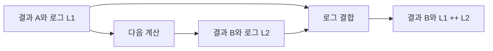

# 40장. Writer

가격을 계산하면서 어떤 할인이 적용되었는지 설명을 함께 만들고 싶다.
계산 함수가 매번 콘솔에 출력하면 테스트와 재사용이 어려워질 수 있다.
Writer는 결과값과 함께 부가적인 로그 데이터를 반환하고 결합하는 구조다.

이번 장에서는 견적 결과와 계산 단계 이벤트를 함께 만든다.
로그 데이터는 출력, 저장, 감사 기록과 같은 것이 아니며 나중에 별도 경계에서 처리한다.
로그의 순서와 실패 시 보존 여부, 민감정보의 수명까지 구분하여 살펴본다.

---

## 1. 개념과 기본 구분

### 결과와 로그의 곱

Writer의 기본 형태는 결과 `A`와 로그 `L`을 함께 가진 값이다.
이 장의 예제는 결과를 먼저, 로그를 나중에 두는 필드를 사용한다.
로그를 결합하기 위해 `L`에 Monoid 구조를 요구할 수 있다.

```text
Writer[L, A] ≈ (A, L)
```

Writer는 이름 때문에 반드시 파일에 무언가를 쓰는 도구처럼 보일 수 있다.
하지만 순수한 데이터 묶음일 수도 있다.
로그 데이터를 실제로 내보내는 작업은 별도의 효과다.

### `map`

결과값을 변환하고 기존 로그는 유지한다.
단순한 결과 표시 변환 때문에 로그가 사라지거나 중복되어서는 안 된다.
로그 자체의 변환은 다른 이름의 연산으로 분리할 수 있다.

### `flatMap`

첫 결과로 다음 Writer 계산을 선택한다.
두 번째 결과를 최종 결과로 사용하고 첫 로그와 다음 로그를 순서대로 결합한다.
연결의 일관성은 로그 결합의 결합법칙에 의존한다.

### 기본 로그 연산

`pure`는 결과와 빈 로그를 만든다.
`tell`은 의미 있는 결과 없이 로그를 추가하는 계산이다.
`listen`은 로그를 결과에서도 읽게 하고, `censor`는 반환할 로그를 변환하는 방식으로 이해할 수
있다.

---

## 2. 명령형 스타일과 함수형 스타일

### 계산 중 즉시 출력

```text
총액 계산
"총액 계산됨" 출력
할인 적용
"할인 적용됨" 출력
배송비 계산
"배송비 계산됨" 출력
```

계산을 호출할 때마다 외부 출력이 발생한다.
테스트에서 출력 스트림을 가로채거나 로그 서비스를 준비해야 할 수 있다.
로그를 값으로 반환하면 계산과 출력의 역할을 나눌 수 있다.

### 결과와 설명을 함께 반환

```text
Quote와 Vector[PricingEvent]
```

호출자는 결과만 사용하거나 이벤트를 화면의 계산 설명으로 바꿀 수 있다.
운영 로그에 남길 항목만 선택할 수도 있다.
계산 단계의 정보가 특정 출력 방식에 묶이지 않는다.

### 문자열보다 구조적인 이벤트

이벤트 코드와 금액, 적용 정책을 별도 필드로 보관하면 처리하기 쉽다.
사용자 메시지와 기계용 분석을 분리할 수 있다.
모든 정보를 한 문자열에 넣으면 나중에 문자열을 다시 파싱해야 할 수 있다.

### 오류와 로그를 섞지 않는다

할인 금액이 0이라는 사실은 반드시 오류가 아니다.
설명 이벤트와 실패 결과는 다른 역할이다.
실패를 정상 로그로만 남기고 성공값을 반환하면 호출자가 오류를 놓칠 수 있다.

---

## 3. 왜 이 개념을 사용하는가?

### 계산 테스트의 단순화

결과와 이벤트 목록을 직접 비교할 수 있다.
콘솔이나 외부 로그 저장소가 없어도 순서와 내용을 확인한다.
실제 출력 어댑터는 별도의 테스트로 다룬다.

### 설명 가능한 결과

가격이 어떤 단계로 만들어졌는지 구조적인 설명을 남길 수 있다.
정책 변화 전후의 계산을 비교하기도 쉽다.
감사에 필요한 진위와 보관 내구성은 별도의 보장이다.

### 출력 정책의 분리

사용자 화면, 운영 진단, 테스트는 서로 다른 로그 표현을 요구할 수 있다.
원래 이벤트 데이터에서 적절한 표현을 만든다.
계산 함수가 모든 소비자의 출력 형식을 알 필요가 줄어든다.

### 순서의 명시

먼저 실행된 계산의 로그를 앞에 두는 정책을 정할 수 있다.
로그 연결이 결합적이어도 순서를 바꾸어도 된다는 뜻은 아니다.
실행 설명에 시간적 순서가 중요한 경우 이를 계약으로 유지한다.

### 실패 정보의 보존

결과가 오류여도 그 전의 진단 로그를 함께 보존할 수 있다.
어떤 타입 중첩을 선택했는지에 따라 보존 범위가 달라진다.
실패했다고 모든 로그가 자동으로 사라지거나 반드시 남는다고 가정하지 않는다.

---

## 4. Scala에서의 표현

### Scala의 견적과 이벤트

Writer는 로그 타입에 대한 Monoid를 명시적으로 받아 결합한다.
계산은 총액, 할인액, 배송비를 이벤트로 남긴다.
숫자와 임계값은 개념 설명을 위한 예제 정책이다.

<!-- executable:scala -->
```scala
object Chapter40:
  trait Monoid[L]:
    def empty: L
    def combine(left: L, right: L): L

  final case class Writer[L, A](value: A, log: L):
    def map[B](f: A => B): Writer[L, B] = Writer(f(value), log)
    def flatMap[B](f: A => Writer[L, B])(using L: Monoid[L]): Writer[L, B] =
      val next = f(value)
      Writer(next.value, L.combine(log, next.log))
    def listen: Writer[L, (A, L)] = Writer((value, log), log)
    def censor(f: L => L): Writer[L, A] = Writer(value, f(log))

  object Writer:
    def pure[L, A](value: A)(using L: Monoid[L]): Writer[L, A] = Writer(value, L.empty)
    def tell[L](log: L): Writer[L, Unit] = Writer((), log)

  final case class PricingEvent(code: String, amount: BigInt)
  type Log = Vector[PricingEvent]
  given logMonoid: Monoid[Log] with
    def empty: Log = Vector.empty
    def combine(left: Log, right: Log): Log = left ++ right

  final case class Quote(net: BigInt, shipping: BigInt):
    def total: BigInt = net + shipping

  def gross(unitPrice: BigInt, quantity: Int): Writer[Log, BigInt] =
    require(unitPrice >= 0 && quantity > 0)
    val amount = unitPrice * quantity
    Writer(amount, Vector(PricingEvent("gross", amount)))

  def discount(amount: BigInt, bps: Int): Writer[Log, BigInt] =
    require(bps >= 0 && bps <= 10000)
    val reduction = amount * bps / 10000
    Writer(amount - reduction, Vector(PricingEvent("discount", reduction)))

  def shipping(net: BigInt): Writer[Log, Quote] =
    val fee = if net >= 20000 then BigInt(0) else BigInt(3000)
    Writer(Quote(net, fee), Vector(PricingEvent("shipping", fee)))

  def quote(unitPrice: BigInt, quantity: Int, bps: Int): Writer[Log, Quote] =
    gross(unitPrice, quantity).flatMap(amount => discount(amount, bps)).flatMap(shipping)

  def check(): Unit =
    val result = quote(10000, 2, 1000)
    assert(result.value == Quote(18000, 3000))
    assert(result.value.total == 21000)
    assert(result.log == Vector(PricingEvent("gross", 20000), PricingEvent("discount", 2000), PricingEvent("shipping", 3000)))
    assert(result.map(_.total) == Writer(BigInt(21000), result.log))
    assert(result.listen.value == (result.value, result.log))
    assert(result.listen.log == result.log)
    val public = result.censor(_.filterNot(_.code == "discount"))
    assert(public.value == result.value)
    assert(public.log.map(_.code) == Vector("gross", "shipping"))
    assert(result.log.size == 3)

    val f: BigInt => Writer[Log, BigInt] = amount => discount(amount, 1000)
    val g: BigInt => Writer[Log, Quote] = shipping
    val start = gross(10000, 2)
    assert(start.flatMap(f).flatMap(g) == start.flatMap(a => f(a).flatMap(g)))
    assert(Writer.pure[Log, BigInt](20000).flatMap(f) == f(20000))
    assert(start.flatMap(a => Writer.pure[Log, BigInt](a)) == start)
    assert(Writer.tell[Log](Vector(PricingEvent("begin", 0))).value == ())
    val failed: Writer[Log, Either[String, Int]] =
      Writer(Left("rejected"), Vector(PricingEvent("attempted", 0)))
    assert(failed.value == Left("rejected"))
    assert(failed.log.nonEmpty)
```

### 반올림 정책

이 예제는 할인액을 정수 최소 단위로 버림한 뒤 총액에서 뺀다.
Reader 장처럼 할인 후 금액을 직접 버림하는 방식과 경계값에서 다를 수 있다.
둘을 같은 정책이라고 가정하지 말고 계산 순서와 반올림 대상을 명시해야 한다.

### `censor`의 보존 범위

공개용 로그를 만든 뒤에도 원래 결과의 로그는 남아 있다.
이미 기록된 외부 로그를 삭제하거나 메모리의 민감정보를 안전하게 지우는 기능이 아니다.
공개 범위를 정하는 변환과 보안 삭제를 구분한다.

---

## 5. 상태 변경보다 값 변환

### 값과 부가 정보의 흐름

다음 계산은 앞의 결과값을 사용한다.
로그는 별도의 결합 경로로 누적된다.
업무 결과를 계산하는 일과 설명 데이터를 모으는 일이 함께 표현된다.



로그가 커져도 다음 계산의 입력을 반드시 바꾸는 것은 아니다.
상태를 다음 단계에 전달하는 State와 구별되는 지점이다.
로그를 읽어 다음 판단에 사용하려면 `listen` 같은 명시적인 구조를 사용할 수 있다.

### 불변 로그

벡터나 튜플의 이벤트 목록은 원본을 유지한 채 새 결과를 만들 수 있다.
이벤트 내부에 가변 객체가 있으면 로그의 실제 내용은 바뀔 수 있다.
구조적인 불변성과 내부 필드의 불변성을 따로 확인한다.

### 로그의 의미

이벤트가 “가격 계산 시도”인지 “결제 성공”인지 명확히 정한다.
실제 외부 성공을 확인하지 않고 성공 이벤트를 만들면 기록이 거짓이 될 수 있다.
Writer가 이벤트의 진위를 자동 보장하는 것은 아니다.

---

## 6. 함수 합성과 데이터 흐름

### Monoid가 필요한 이유

`pure`에는 빈 로그가 필요하다.
두 Writer를 연결하려면 로그 두 개를 같은 타입으로 결합해야 한다.
결합법칙은 연결의 괄호를 바꾸어도 로그가 같은 순서로 남게 하는 근거다.

```text
(value, empty).flatMap(f) = f(value)
(a, l1) 다음 (b, l2) = (b, combine(l1, l2))
```

### 로그의 다른 형태

로그는 반드시 문자열 목록일 필요가 없다.
호출 횟수, 사용한 상품 코드 집합, 비용 합계 같은 부가 정보를 결합할 수 있다.
선택한 Monoid가 어떤 정보를 보존하고 잃는지 확인한다.

### 오류와의 중첩

`Writer[Log, Either[E, A]]`는 오류 결과와 로그를 함께 가진다.
`Either[E, Writer[Log, A]]`의 왼쪽 오류에는 Writer가 없을 수 있다.
실패에서 진단을 얼마나 보존할지에 따라 구조를 선택한다.

### 실제 실행과의 연결

계산된 이벤트를 나중에 파일이나 로그 서비스로 보낼 수 있다.
그 전송이 실패하면 어떻게 처리할지도 별도 정책이다.
계산 결과와 로그 전달의 성공이 항상 동시에 일어나는 것은 아니다.

---

## 7. 장점과 트레이드오프

### 장점과 트레이드오프

| 선택 | 이점 | 주의점 |
| --- | --- | --- |
| 로그를 값으로 반환 | 테스트와 재사용 | 메모리에 로그 보관 |
| 구조적인 이벤트 | 분석과 표시 분리 | 이벤트 스키마 관리 |
| 순서 있는 결합 | 재현 가능한 설명 | 순서 교환 금지 |
| 로그 변환 | 공개 정책 분리 | 원본은 남을 수 있음 |
| 오류와 함께 보존 | 실패 진단 | 민감정보와 크기 |

### 누적 비용

매 단계에서 긴 리스트나 튜플을 복사하면 전체 비용이 커질 수 있다.
대량 로그에는 빌더, 적절한 영속 구조, 차이 리스트 같은 다른 표현을 검토할 수 있다.
법칙이 같아도 실제 할당과 복사 비용은 다르다.

### 스트리밍과의 차이

모든 로그를 결과 안에 모으는 Writer는 무한하거나 매우 긴 실행에 적절하지 않을 수 있다.
스트림으로 내보내면 메모리를 줄일 수 있지만 외부 효과와 부분 전송의 문제가 생긴다.
두 설계의 보장 범위를 구분한다.

### 로그가 필요 없는 계산

간단한 결과만 필요한 함수에 Writer를 강제하면 타입과 코드가 복잡해질 수 있다.
실제 설명·분석 요구가 있는 부분에 적용한다.
모든 함수에 로그 컨텍스트를 씌우는 것이 목표는 아니다.

---

## 8. 상태와 부수효과의 경계

### 내구성 있는 감사 기록

Writer의 로그는 메모리의 값일 수 있으므로 프로세스가 종료되면 사라질 수 있다.
영구 저장, 무결성, 접근 통제, 보관 정책은 별도의 감사 시스템 책임이다.
이벤트 목록을 만들었다는 사실만으로 법적·운영적 감사 요구를 충족했다고 주장하지 않는다.

### 외부 효과의 실제 결과

결제 요청을 만들기 전에 “결제 성공” 이벤트를 기록하면 사실과 다른 설명이 된다.
계획, 시도, 응답 확인을 구분한 이벤트를 사용한다.
외부 시스템의 부분 성공과 응답 유실도 고려해야 한다.

### 민감정보

로그에 비밀번호, 토큰, 전체 개인정보를 무심코 넣지 않는다.
나중에 `censor`로 숨기더라도 원본이 다른 경로에 남을 수 있다.
가능하면 생성 시점부터 필요한 최소 정보만 보관한다.

### 실패와 취소

계산이 예외로 중단되면 아직 반환되지 않은 로그값을 얻지 못할 수 있다.
실패를 결과 타입에 넣는 구조와 예외 전파를 구분한다.
취소 중에도 반드시 남겨야 하는 운영 기록은 별도의 실행 경계와 정책이 필요하다.

---

## 9. Python에서 적용하기

### Python의 결과와 이벤트 묶음

Python 예제는 로그 타입을 이벤트 튜플로 고정한다.
임의의 로그 Monoid를 추상화하지 않아도 결과 변환과 순서 있는 결합을 구현할 수 있다.
이 제한을 명시하고 실제로 필요한 범위의 코드를 작성한다.

<!-- executable:python -->
```python
from collections.abc import Callable
from dataclasses import dataclass
from typing import Generic, TypeVar

A = TypeVar("A")
B = TypeVar("B")


@dataclass(frozen=True)
class PricingEvent:
    code: str
    amount: int


Log = tuple[PricingEvent, ...]


@dataclass(frozen=True)
class Writer(Generic[A]):
    value: A
    log: Log = ()

    def map(self, function: Callable[[A], B]) -> "Writer[B]":
        return Writer(function(self.value), self.log)

    def flat_map(self, function: Callable[[A], "Writer[B]"]) -> "Writer[B]":
        next_value = function(self.value)
        return Writer(next_value.value, self.log + next_value.log)

    def listen(self) -> "Writer[tuple[A, Log]]":
        return Writer((self.value, self.log), self.log)

    def censor(self, function: Callable[[Log], Log]) -> "Writer[A]":
        return Writer(self.value, function(self.log))


@dataclass(frozen=True)
class Quote:
    net: int
    shipping: int

    def total(self) -> int:
        return self.net + self.shipping


def gross(unit_price: int, quantity: int) -> Writer[int]:
    if unit_price < 0 or quantity <= 0:
        raise ValueError("invalid item")
    amount = unit_price * quantity
    return Writer(amount, (PricingEvent("gross", amount),))


def discount(amount: int, bps: int) -> Writer[int]:
    if not 0 <= bps <= 10_000:
        raise ValueError("invalid discount")
    reduction = amount * bps // 10_000
    return Writer(amount - reduction, (PricingEvent("discount", reduction),))


def shipping(net: int) -> Writer[Quote]:
    fee = 0 if net >= 20_000 else 3000
    return Writer(Quote(net, fee), (PricingEvent("shipping", fee),))


def quote(unit_price: int, quantity: int, bps: int) -> Writer[Quote]:
    return gross(unit_price, quantity).flat_map(lambda amount: discount(amount, bps)).flat_map(shipping)


def test_writer() -> None:
    result = quote(10_000, 2, 1000)
    expected_log = (PricingEvent("gross", 20_000), PricingEvent("discount", 2000), PricingEvent("shipping", 3000))
    assert result.value == Quote(18_000, 3000)
    assert result.value.total() == 21_000
    assert result.log == expected_log
    assert result.map(lambda value: value.total()) == Writer(21_000, expected_log)
    assert result.listen().value == (result.value, expected_log)
    assert result.listen().log == expected_log
    public = result.censor(lambda log: tuple(event for event in log if event.code != "discount"))
    assert public.value == result.value
    assert [event.code for event in public.log] == ["gross", "shipping"]
    assert len(result.log) == 3
    start = gross(10_000, 2)
    f = lambda amount: discount(amount, 1000)
    assert start.flat_map(f).flat_map(shipping) == start.flat_map(lambda amount: f(amount).flat_map(shipping))
    assert Writer(20_000).flat_map(f) == f(20_000)
    assert start.flat_map(lambda amount: Writer(amount)) == start


def test_log_is_not_output() -> None:
    result = quote(10_000, 2, 0)
    output: list[str] = []
    assert output == []
    output.extend(f"{event.code}:{event.amount}" for event in result.log)
    assert output == ["gross:20000", "discount:0", "shipping:0"]
    assert result.log[0] == PricingEvent("gross", 20_000)


if __name__ == "__main__":
    test_writer()
    test_log_is_not_output()
```

### 데이터 생성과 출력

테스트는 Writer를 만들기만 해서는 출력 대상 리스트가 바뀌지 않는다는 점을 확인한다.
나중에 명시적으로 이벤트를 문자열로 변환해 출력 모형에 추가한다.
실제 파일이나 네트워크 로그 전송은 별도의 어댑터로 다뤄야 한다.

---

## 10. Python의 표현 한계

### 일반 로그 타입의 대안

필요하면 로그 결합 사전을 받아 제네릭 Writer를 구현할 수 있다.
하지만 작은 프로그램에서는 구체적인 이벤트 튜플이 더 읽기 쉬울 수 있다.
타입의 일반성과 실제 요구 사이의 균형을 선택한다.

### 튜플 결합 비용

튜플은 불변이지만 연결할 때 새 튜플을 만들 수 있다.
긴 로그를 반복 누적하면 복사 비용이 커질 수 있다.
불변이라는 성질과 효율적인 구조 공유를 같은 의미로 보지 않는다.

### 콜백의 효과

`map`과 `flat_map`에 전달한 함수가 외부 상태를 바꿀 수 있다.
Writer 클래스가 순수한 계산만 허용하도록 실행기가 강제하지는 않는다.
함수의 입력과 출력, 숨은 의존성을 실제로 검토한다.

### 보관과 삭제

로그를 필터링한 새 Writer를 만들어도 원래 객체의 정보는 남는다.
민감정보의 안전한 삭제나 외부 로그의 회수 기능이 아니다.
정보를 처음부터 최소화하고 보관 경계를 명확히 한다.

---

## 11. 핵심 정리

### 핵심 결론

Writer는 결과와 부가 로그 데이터를 함께 반환하고 결합한다.
연결의 일관성은 로그의 항등원과 결합법칙에 의존한다.
로그 데이터의 생성은 실제 출력이나 내구성 있는 감사 기록과 다르다.
실패 시 보존 범위, 메모리 비용, 민감정보 정책을 함께 설계해야 한다.

### 연습 1: 실제 출력

Writer값을 만들었으니 로그 파일에도 기록되었다고 볼 수 있는가?

**해설.** 아니다. Writer는 메모리의 데이터 묶음일 수 있다.
파일이나 로그 서비스에 보내는 실행 경계가 필요하다.
그 전송의 실패와 내구성도 별도 계약이다.

### 연습 2: 로그 순서

로그 결합이 결합적이므로 할인 이벤트와 총액 이벤트의 순서를 바꾸어도 되는가?

**해설.** 결합법칙은 괄호의 변경만 허용한다.
목록 로그의 순서는 설명의 의미를 가질 수 있다.
교환법칙을 추가로 가정하지 않는다.

### 연습 3: 실패 로그

오류가 났을 때도 그 전의 이벤트를 반환하려 한다.
어떤 타입 구조의 차이를 검토해야 하는가?

**해설.** Writer 안의 오류 결과는 로그와 실패를 함께 보존할 수 있다.
오류 결과 바깥에서 Writer를 감싸면 실패 경로에 로그가 없을 수 있다.
관측하려는 정보에 맞게 중첩 구조를 선택한다.

### 연습 4: 로그 숨김

`censor`로 토큰 필드를 숨겼으니 원래 토큰도 안전하게 삭제되었다고 주장했다.
왜 잘못된가?

**해설.** 새 로그를 만들었을 뿐 원본이나 이미 전송된 데이터는 남을 수 있다.
공개용 변환과 보안 삭제는 다르다.
민감정보를 생성 단계에서부터 최소화해야 한다.

### 다음 장과 참고 자료

다음 장은 나중에 실행할 외부 효과를 IO 값으로 표현하는 방법을 다룬다.
Reader와 State, Writer의 값 모형에서 실제 실행의 수명과 실패로 범위를 넓힌다.

[Cats 공식 문서: Writer](https://typelevel.org/cats/datatypes/writer.html)
[Cats 공식 문서: Monoid](https://typelevel.org/cats/typeclasses/monoid.html)
[Python 공식 문서: dataclasses](https://docs.python.org/3.14/library/dataclasses.html)
