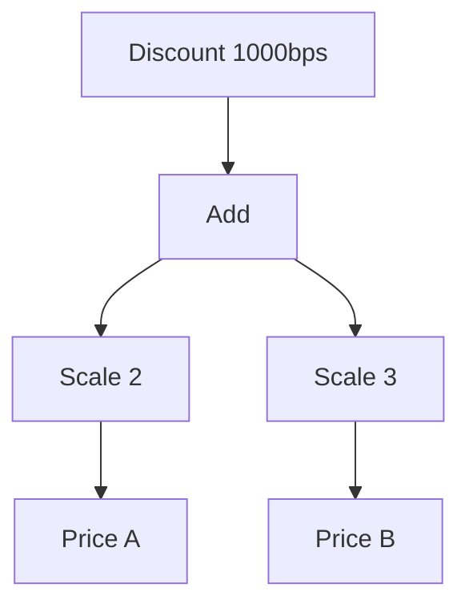

# 49장. Algebra & Interpreter


정책을 함수로 표현하면 실행과 조합이 간단하다.
그러나 어떤 상품 가격을 사용하는지 미리 분석하거나 계산식을 표시하고 저장하려면 함수 내부를 직접
들여다보기 어렵다.
대수와 해석기 패턴은 사용할 연산을 명시적인 언어로 표현하고 그 의미를 별도의 해석기에 맡긴다.

이번 장에서는 상품 가격, 상수, 덧셈, 수량 배수, 할인의 작은 계산 언어를 만든다.
같은 프로그램에서 금액 평가, 표시, 필요한 상품 코드 수집을 수행한다.
연산의 추가와 해석기의 추가가 각각 어떤 변경을 요구하는지도 살펴본다.

---

## 1. 개념과 기본 구분

### 연산의 언어

프로그램이 사용할 수 있는 연산을 정한다.
그 연산들을 조합한 구조가 프로그램 데이터가 된다.
여기서 대수라는 말은 연산과 해석 구조를 가리키며 앞 장의 Monoid 하나로 한정되지 않는다.

```text
Expr = Literal
     | Price
     | Add(Expr, Expr)
     | Scale(Expr, Quantity)
     | Discount(Expr, Rate)
```

각 생성자는 계산 언어의 한 문법 요소다.
아직 실제 금액을 계산하지 않고 어떤 계산을 할지 표현한다.
3부의 ADT가 프로그램 표현 자체에 사용된다.

### 해석기

해석기는 프로그램 데이터에 의미를 부여한다.
평가기는 가격 환경을 사용해 금액이나 오류를 만들 수 있다.
표시기는 문자열을, 의존성 분석기는 상품 코드 집합을 만들 수 있다.

### 문법과 의미의 분리

같은 문법 구조를 여러 방식으로 해석할 수 있다.
새 표시 형식을 추가한다고 원래 프로그램 구조를 바꿀 필요가 없을 수 있다.
반대로 새 연산을 추가하면 여러 해석기를 함께 수정해야 할 수 있다.

### 외부 효과의 위치

가격 조회를 문법으로 표현했다고 외부 효과가 자동으로 안전해지는 것은 아니다.
해석기가 불변 가격 맵을 읽으면 순수한 계산이고 네트워크를 호출하면 효과 실행이 된다.
프로그램 표현과 해석기의 실행 계약을 분리한다.

---

## 2. 명령형 스타일과 함수형 스타일

### 직접 실행하는 함수

```text
priceA * 2 + priceB * 3
그 결과에 할인 적용
```

이미 가격값이 있으면 간단하고 효율적인 표현이다.
하지만 어떤 상품이 필요한지 실행 전에 분석하거나 계산식 자체를 전달하려면 다른 표현이 필요할 수
있다.
모든 계산에 AST를 만드는 것은 과도하지만 실제 요구가 있는 경우 유용하다.

### 명시적인 계산식

```text
Discount(
  Add(Scale(Price("A"), 2), Scale(Price("B"), 3)),
  1000
)
```

상품 코드와 수량, 할인율이 데이터로 남는다.
계산식의 구조를 순회하여 실행 외의 정보를 얻을 수 있다.
함수값과 달리 각 연산을 패턴 매칭으로 구분할 수 있다.

### 여러 해석

평가기는 금액을 계산한다.
표시기는 사람이 읽는 수식을 만든다.
의존성 분석기는 필요한 가격 키를 모은다.
각 해석기는 자신이 제공하는 의미와 한계를 명시해야 한다.

### 무조건적인 최적화

`unknownPrice * 0`을 0으로 바꾸면 원래 발생하던 상품 부재 오류가 사라질 수 있다.
일반적인 수학 등식을 오류와 효과가 있는 언어에 그대로 적용하지 않는다.
어떤 관측을 보존해야 하는지 먼저 정한다.

---

## 3. 왜 이 개념을 사용하는가?

### 프로그램의 분석

필요한 상품 코드를 미리 수집하여 한 번의 배치 조회를 계획할 수 있다.
다만 조건부 연산이 추가되면 모든 코드가 실제 실행되는 것은 아닐 수 있다.
정적 분석의 결과가 실제 호출 집합인지 가능한 호출 집합인지 구분한다.

### 표시와 실행의 일관성

같은 프로그램 데이터에서 실행과 설명을 만들 수 있다.
수식 표시가 실제 정책과 따로 관리되며 어긋나는 문제를 줄인다.
해석기 구현 사이의 일치도 별도 테스트로 확인해야 한다.

### 테스트 해석기

실제 외부 시스템 대신 고정된 환경으로 프로그램을 평가할 수 있다.
필요한 연산 목록만 기록하는 해석기도 만들 수 있다.
테스트 해석기가 실제 실패·취소 의미를 얼마나 반영하는지 확인한다.

### 저장과 전송의 기반

명시적인 문법 데이터는 적절한 직렬화 형식으로 저장할 수 있다.
버전과 입력 크기, 허용 연산을 검증하는 파서가 필요하다.
메모리 AST를 만들었다고 안전한 원격 코드 실행 체계가 완성되는 것은 아니다.

### 설계 선택의 가시성

새 연산과 새 해석기를 어느 쪽으로 자주 추가하는지에 따라 표현의 장단점이 달라진다.
다음 장의 Tagless Final은 다른 확장 방식을 보여 준다.
한 표현이 모든 변경 방향에서 항상 가장 간단한 것은 아니다.

---

## 4. Scala에서의 표현

### Scala의 계산 언어와 세 해석기

평가기는 불변 가격 맵을 입력받는다.
수량 배수와 할인율이 잘못된 경우 명시적인 오류를 반환한다.
상품 가격은 이미 유효한 비음수 값으로 파싱되었다는 입력 계약을 사용한다.

<!-- executable:scala -->
```scala
object Chapter49:
  enum Expr:
    case Literal(amount: BigInt)
    case Price(sku: String)
    case Add(left: Expr, right: Expr)
    case Scale(value: Expr, quantity: Int)
    case Discount(value: Expr, bps: Int)

  enum EvalError:
    case MissingPrice(sku: String)
    case InvalidQuantity
    case InvalidRate

  def evaluate(expression: Expr, prices: Map[String, BigInt]): Either[EvalError, BigInt] =
    import Expr.*
    expression match
      case Literal(amount) => Right(amount)
      case Price(sku) => prices.get(sku).toRight(EvalError.MissingPrice(sku))
      case Add(left, right) =>
        for a <- evaluate(left, prices); b <- evaluate(right, prices) yield a + b
      case Scale(value, quantity) =>
        if quantity < 0 then Left(EvalError.InvalidQuantity)
        else evaluate(value, prices).map(_ * quantity)
      case Discount(value, bps) =>
        if bps < 0 || bps > 10000 then Left(EvalError.InvalidRate)
        else evaluate(value, prices).map(amount => amount - amount * bps / 10000)

  def render(expression: Expr): String =
    import Expr.*
    expression match
      case Literal(amount) => amount.toString
      case Price(sku) => s"price($sku)"
      case Add(left, right) => s"(${render(left)} + ${render(right)})"
      case Scale(value, quantity) => s"(${render(value)} * $quantity)"
      case Discount(value, bps) => s"discount(${render(value)}, ${bps}bps)"

  def dependencies(expression: Expr): Set[String] =
    import Expr.*
    expression match
      case Literal(_) => Set.empty
      case Price(sku) => Set(sku)
      case Add(left, right) => dependencies(left) ++ dependencies(right)
      case Scale(value, _) => dependencies(value)
      case Discount(value, _) => dependencies(value)

  def check(): Unit =
    import Expr.*
    val program = Discount(Add(Scale(Price("A"), 2), Scale(Price("B"), 3)), 1000)
    val prices = Map("A" -> BigInt(1000), "B" -> BigInt(500))
    assert(evaluate(program, prices) == Right(BigInt(3150)))
    assert(dependencies(program) == Set("A", "B"))
    assert(render(program) == "discount(((price(A) * 2) + (price(B) * 3)), 1000bps)")
    assert(evaluate(program, prices.updated("A", BigInt(2000))) == Right(BigInt(4950)))
    assert(evaluate(program, Map("A" -> BigInt(1000))) == Left(EvalError.MissingPrice("B")))
    assert(evaluate(Scale(Literal(1), -1), prices) == Left(EvalError.InvalidQuantity))
    assert(evaluate(Discount(Literal(1), 10001), prices) == Left(EvalError.InvalidRate))
    assert(evaluate(Add(Literal(1), Literal(2)), prices) == Right(BigInt(3)))
    assert(dependencies(Add(Price("A"), Price("A"))) == Set("A"))
    val zeroTimesMissing = Scale(Price("missing"), 0)
    assert(evaluate(zeroTimesMissing, prices) == Left(EvalError.MissingPrice("missing")))
    assert(evaluate(Literal(0), prices) == Right(BigInt(0)))
    assert(evaluate(zeroTimesMissing, prices) != evaluate(Literal(0), prices))
```

### 같은 문법, 다른 결과 타입

평가는 오류 가능 금액을 만든다.
표시는 문자열을 만들고 의존성 분석은 집합을 만든다.
프로그램의 문법과 해석 결과의 타입을 분리하면 여러 도구를 같은 구조 위에 만들 수 있다.

### 입력 언어의 계약

이 언어는 음수 상수도 수학적 값으로 표현할 수 있다.
최종 주문 금액이 비음수여야 한다는 업무 조건은 별도의 검증으로 둘 수 있다.
문법의 표현력과 특정 도메인에서 허용할 프로그램 범위를 구분한다.

---

## 5. 상태 변경보다 값 변환

### 프로그램이 데이터가 된다

함수 호출을 즉시 수행하는 대신 연산 노드를 연결한다.
각 노드는 다음 해석에 필요한 입력을 보관한다.
트리의 형태를 분석하거나 표시할 수 있다.



이 구조는 명시적인 메모리 객체를 사용한다.
함수 하나로 계산하는 것보다 할당과 순회 비용이 추가될 수 있다.
분석과 재해석이라는 이득이 그 비용에 맞는지 판단한다.

### 구조 공유

같은 하위 계산식을 여러 곳에서 참조할 수 있다.
단순한 트리 해석기는 그 하위 식을 여러 번 평가할 수 있다.
공유된 객체라는 사실만으로 결과 메모이제이션이 자동 적용되지는 않는다.

### 직렬화 경계

외부에서 받은 노드는 깊이와 개수, 연산 인자를 검사해야 한다.
재귀 구조를 무제한 허용하면 자원 고갈이 발생할 수 있다.
프로그램 데이터의 파싱도 다른 외부 입력처럼 신뢰 경계를 가진다.

---

## 6. 함수 합성과 데이터 흐름

### 해석기의 구조적 재귀

각 노드의 의미는 하위 노드의 의미에서 계산된다.
이 반복되는 재귀 패턴은 뒤의 재귀 스킴 장에서 일반화할 수 있다.
현재는 명시적인 패턴 매칭으로 구조를 충분히 이해하는 것이 먼저다.

```text
Add의 의미 = 왼쪽 의미와 오른쪽 의미의 결합
Scale의 의미 = 하위 의미와 수량의 곱
```

### 대수 법칙과 언어 의미

순수한 전체 산술에서는 적용할 수 있는 등식이 많다.
오류 순서와 평가 전략이 포함되면 같은 등식이 관측을 바꿀 수 있다.
최적화 해석기는 원래 언어의 의미를 보존하는지 따로 검증해야 한다.

### 표현 문제의 관점

ADT에 새 연산을 추가하면 여러 패턴 매칭 해석기를 수정해야 할 수 있다.
새 해석기를 추가하는 것은 기존 문법을 바꾸지 않고 가능할 수 있다.
확장 방향에 따른 이 차이를 이해하면 다음 표현 방식을 비교하기 쉽다.

### 외부 실행 해석기

Price 노드마다 원격 호출을 하는 해석기를 만들 수도 있다.
하지만 같은 코드의 반복 조회와 실패 순서, 캐시 정책이 생긴다.
의존성을 먼저 수집해 스냅샷을 읽는 해석과 의미가 같은지 확인해야 한다.

---

## 7. 장점과 트레이드오프

### 장점과 트레이드오프

| 표현 | 이점 | 비용 또는 제한 |
| --- | --- | --- |
| 명시적 AST | 분석·표시·저장 | 노드 할당과 순회 |
| 여러 해석기 | 의미의 분리 | 해석기 간 일관성 |
| ADT 문법 | 연산 종류 명확 | 새 연산 시 여러 수정 |
| 정적 의존성 수집 | 배치 조회 계획 | 조건부 실행과 구분 |
| 최적화 변환 | 실행 비용 개선 가능 | 오류·효과 보존 검증 |

### 언어의 과도한 성장

처음에는 작은 계산식이었는데 반복과 조건, 외부 명령이 계속 추가될 수 있다.
문법과 의미, 검증, 버전 정책을 함께 관리해야 한다.
작은 DSL이 완전한 범용 언어처럼 커지는 비용을 고려한다.

### 재귀 깊이

예제 해석기는 재귀 호출을 사용한다.
매우 깊은 식에서 스택 안전성을 보장하지 않는다.
외부 입력 제한이나 명시적 스택 해석기가 필요할 수 있다.

### 함수 전략과의 선택

실행만 필요하고 분석·저장 요구가 없으면 함수 전략이 더 단순할 수 있다.
프로그램 구조를 다뤄야 할 때 AST의 이득이 커진다.
분석 가능성을 위해 모든 계산을 무조건 데이터로 바꾸지 않는다.

---

## 8. 상태와 부수효과의 경계

### 실행 권한

허용한 연산만 문법에 포함하면 프로그램이 요청할 수 있는 능력을 제한하는 데 도움이 된다.
하지만 해석기가 임의의 외부 코드를 실행하면 그 경계가 깨질 수 있다.
문법 제한과 실행기의 실제 권한을 함께 검토한다.

### 오류와 진단

어느 노드에서 오류가 발생했는지 경로나 소스 위치를 보관할 수 있다.
이 정보는 사용자 정의 계산식의 수정에 도움이 된다.
오류에 민감한 입력값을 과도하게 포함하지 않도록 한다.

### 버전 관리

저장된 프로그램의 연산 의미가 바뀌면 과거 결과를 재현하기 어려울 수 있다.
문법 버전과 정책 버전, 마이그레이션을 설계한다.
같은 노드 이름이 영원히 같은 업무 의미를 보장하는 것은 아니다.

### 외부 요청의 최적화

여러 Price 노드를 한 번의 배치 조회로 바꾸면 성능이 좋아질 수 있다.
그러나 조회 시점과 오류 우선순위가 달라질 수 있다.
원래 언어가 어떤 관측을 계약으로 삼는지 확인한다.

---

## 9. Python에서 적용하기

### Python의 데이터 언어와 해석기

Python에서도 데이터 클래스의 합 타입으로 작은 언어를 만들 수 있다.
같은 노드를 평가, 표시, 분석하는 함수를 각각 작성한다.
예상하지 못한 노드가 들어오면 조용히 기본값을 반환하지 않는다.

<!-- executable:python -->
```python
from __future__ import annotations
from dataclasses import dataclass


@dataclass(frozen=True)
class Literal:
    amount: int


@dataclass(frozen=True)
class Price:
    sku: str


@dataclass(frozen=True)
class Add:
    left: Expr
    right: Expr


@dataclass(frozen=True)
class Scale:
    value: Expr
    quantity: int


@dataclass(frozen=True)
class Discount:
    value: Expr
    bps: int


Expr = Literal | Price | Add | Scale | Discount


@dataclass(frozen=True)
class EvalError:
    code: str
    sku: str = ""


def evaluate(expression: Expr, prices: dict[str, int]) -> int | EvalError:
    match expression:
        case Literal(amount):
            return amount
        case Price(sku):
            return prices.get(sku, EvalError("missing_price", sku))
        case Add(left, right):
            a = evaluate(left, prices)
            if isinstance(a, EvalError):
                return a
            b = evaluate(right, prices)
            return b if isinstance(b, EvalError) else a + b
        case Scale(value, quantity):
            if quantity < 0:
                return EvalError("invalid_quantity")
            result = evaluate(value, prices)
            return result if isinstance(result, EvalError) else result * quantity
        case Discount(value, bps):
            if not 0 <= bps <= 10_000:
                return EvalError("invalid_rate")
            result = evaluate(value, prices)
            return result if isinstance(result, EvalError) else result - result * bps // 10_000
    raise TypeError("unknown expression")


def render(expression: Expr) -> str:
    match expression:
        case Literal(amount):
            return str(amount)
        case Price(sku):
            return f"price({sku})"
        case Add(left, right):
            return f"({render(left)} + {render(right)})"
        case Scale(value, quantity):
            return f"({render(value)} * {quantity})"
        case Discount(value, bps):
            return f"discount({render(value)}, {bps}bps)"
    raise TypeError("unknown expression")


def dependencies(expression: Expr) -> frozenset[str]:
    match expression:
        case Literal():
            return frozenset()
        case Price(sku):
            return frozenset({sku})
        case Add(left, right):
            return dependencies(left) | dependencies(right)
        case Scale(value, _) | Discount(value, _):
            return dependencies(value)
    raise TypeError("unknown expression")


def test_interpreters() -> None:
    program = Discount(Add(Scale(Price("A"), 2), Scale(Price("B"), 3)), 1000)
    prices = {"A": 1000, "B": 500}
    assert evaluate(program, prices) == 3150
    assert dependencies(program) == frozenset({"A", "B"})
    assert render(program) == "discount(((price(A) * 2) + (price(B) * 3)), 1000bps)"
    assert evaluate(program, {"A": 2000, "B": 500}) == 4950
    assert evaluate(program, {"A": 1000}) == EvalError("missing_price", "B")
    assert evaluate(Scale(Literal(1), -1), prices) == EvalError("invalid_quantity")
    assert evaluate(Discount(Literal(1), 10_001), prices) == EvalError("invalid_rate")
    assert dependencies(Add(Price("A"), Price("A"))) == frozenset({"A"})
    assert evaluate(Scale(Price("missing"), 0), prices) == EvalError("missing_price", "missing")
    assert evaluate(Literal(0), prices) == 0


if __name__ == "__main__":
    test_interpreters()
```

### 파서와 해석기의 분리

이 코드는 이미 구성된 내부 AST를 해석한다.
외부 문자열을 받아 안전한 AST로 만드는 파서는 구현하지 않는다.
노드 수와 깊이, 숫자 범위를 검증하는 입력 경계가 별도로 필요하다.

---

## 10. Python의 표현 한계

### 합 타입의 검사

Python 타입 주석은 모든 외부 객체가 Expr의 한 경우인지 실행 시 자동 확인하지 않는다.
예제는 예상하지 못한 노드에서 명시적으로 실패한다.
정적 검사와 외부 파싱을 함께 사용하면 누락과 잘못된 구조를 줄일 수 있다.

### 재귀와 성능

재귀 해석기는 깊은 입력에서 호출 스택을 사용한다.
단순한 데이터 클래스라고 무제한 크기를 안전하게 처리할 수 있는 것은 아니다.
필요한 입력 제한과 반복 해석 구조를 검토한다.

### 동적 확장

새 노드 클래스를 추가해도 기존 해석기가 자동으로 의미를 알지는 못한다.
등록 기반 디스패치를 사용하더라도 누락과 충돌을 관리해야 한다.
확장 방식의 편의와 전체 의미의 일관성을 구분한다.

### 코드 실행과 데이터

AST를 안전한 데이터로 해석하는 것과 문자열을 `eval`하는 것은 다르다.
허용한 연산만 명시적으로 처리하는 경계를 유지한다.
사용자 정의 식을 임의 Python 코드로 실행하는 우회는 별도의 보안 위험을 만든다.

---

## 11. 핵심 정리

### 핵심 결론

대수와 해석기 패턴은 연산의 언어와 그 의미를 분리한다.
같은 프로그램 데이터에서 실행·표시·분석을 만들 수 있다.
새 연산과 새 해석기의 추가는 서로 다른 변경 비용을 가진다.
최적화, 직렬화, 외부 실행에는 오류·효과·자원과 버전의 계약이 필요하다.

### 연습 1: 함수와 AST

실행만 필요한 간단한 할인에 AST를 만들면 어떤 비용이 추가되는가?

**해설.** 노드 타입과 생성, 해석 순회, 유지보수 비용이 생긴다.
분석과 저장, 여러 해석의 요구가 있을 때 이득이 커진다.
필요한 기능에 맞는 가장 단순한 표현을 선택한다.

### 연습 2: 0배 최적화

가격이 없는 상품의 식에 0을 곱한 것을 상수 0으로 바꾸었다.
왜 의미가 바뀔 수 있는가?

**해설.** 원래 평가에서 발생하던 상품 부재 오류가 사라질 수 있다.
반환 금액뿐 아니라 오류와 효과도 관측에 포함된다.
수학적 등식을 언어 최적화에 적용할 때 전제조건을 확인한다.

### 연습 3: 새 연산

계산 언어에 세금 연산을 추가했다.
어떤 코드를 함께 검토해야 하는가?

**해설.** 평가와 표시, 의존성 분석 등 각 해석기의 처리가 필요하다.
기본값으로 누락을 숨기지 않는다.
새 연산의 오류와 반올림 의미도 명시한다.

### 연습 4: 외부 AST

사용자에게 AST JSON을 받아 바로 재귀 평가한다.
어떤 경계를 추가해야 하는가?

**해설.** 허용 노드, 필드 타입, 숫자 범위, 노드 수와 깊이를 검사해야 한다.
프로그램 데이터도 신뢰할 수 없는 입력이다.
해석기의 권한과 실행 비용도 제한해야 한다.

### 다음 장과 참고 자료

다음 장은 명시적인 AST 대신 연산 인터페이스에 대해 프로그램을 작성하는 Tagless Final을 다룬다.
같은 언어와 여러 해석을 다른 표현 방식으로 비교한다.

[Scala 공식 문서: Algebraic Data Types](https://docs.scala-lang.org/scala3/reference/enums/adts.html)
[Oleg Kiselyov: Tagless-Final Style](https://okmij.org/ftp/tagless-final/)
[Cats 공식 문서: Free](https://typelevel.org/cats/datatypes/free.html)
