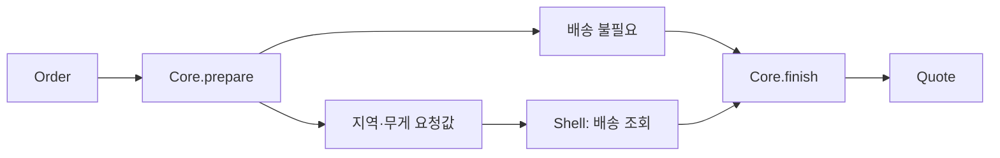

# 47장. Dependency Rejection


의존성 주입은 외부 기능을 명시적으로 전달하게 해 주었다.
하지만 핵심 계산이 그 외부 기능을 꼭 직접 호출해야 하는지는 다른 질문이다.
Dependency Rejection은 가능한 의존성을 핵심에서 밀어내고 필요한 데이터를 값으로 전달하는 방향을
설명한다.

이번 장은 디지털 상품에는 배송 조회가 필요 없고 실물 상품에는 필요한 주문을 다룬다.
모든 외부 정보를 무조건 먼저 읽는 대신 순수한 판단으로 필요한 조회를 정한다.
핵심의 데이터 계산과 바깥 계층의 실행을 여러 단계로 나누어 조립한다.

---

## 1. 개념과 기본 구분

### 주입과 제거의 차이

카탈로그 인터페이스를 받는 함수는 구체적인 데이터베이스에서는 분리된다.
하지만 여전히 실행 시 상품을 조회할 능력과 그 실패에 의존한다.
이미 확보한 상품값을 받는 함수는 그 조회 의존성을 가지지 않을 수 있다.

```text
주입: quote(request, catalog)
제거: quote(request, productSnapshot)
```

두 설계는 서로 적대적인 선택이 아니다.
바깥 계층에는 의존성 주입을 사용하면서 핵심에는 값만 전달할 수 있다.
어느 계층에서 외부 실행을 담당할지 정하는 문제다.

### 필요한 데이터를 반환한다

핵심이 다음 외부 조회에 필요한 요청값을 만들 수 있다.
바깥 계층은 그 요청을 실행하고 결과를 다시 핵심에 전달한다.
모든 흐름을 한 번의 입력과 출력에 억지로 넣지 않아도 된다.

### 조건부 의존성

디지털 상품만 있는 주문에는 배송 요금 조회가 필요 없다.
실물 상품이 있으면 무게와 지역을 계산한 뒤 조회할 수 있다.
핵심의 판단을 이용하면 불필요한 외부 호출을 피할 수 있다.

### 비용과 일관성

필요한 데이터를 먼저 읽는 방식은 과도한 조회와 오래된 스냅샷 문제를 가질 수 있다.
의존성을 제거한다는 목표만으로 실제 외부 비용을 무시하지 않는다.
단계별 판단과 필요한 최소 데이터를 함께 설계한다.

---

## 2. 명령형 스타일과 함수형 스타일

### 핵심에서 직접 외부 호출

```text
견적 계산 함수
  상품 종류를 판단한다
  필요하면 배송 서비스에 요청한다
  응답을 받아 총액을 계산한다
```

인터페이스를 주입해도 계산 함수 안에 외부 실행과 실패가 남는다.
테스트하려면 배송 서비스 대역을 준비해야 한다.
순수한 판단을 분리하면 더 작은 값 테스트로 다룰 수 있다.

### 필요한 배송 정보를 값으로 만든다

```text
prepare(order) -> Prepared(subtotal, ShippingNeed)
ShippingNeed = NoShipping | NeedShipping(zone, grams)
```

핵심은 배송 서비스 객체를 받지 않는다.
배송이 필요한지와 어떤 요청이 필요한지를 값으로 반환한다.
바깥 계층이 그 값에 따라 외부 실행을 선택한다.

### 조회 결과를 다시 전달

```text
바깥 계층: 필요할 때만 배송 요금 조회
핵심: Prepared와 배송 요금으로 최종 Quote 계산
```

이 구조는 순수한 핵심을 두 단계로 나눈다.
외부 응답이 필요한 지점에서 명시적으로 제어를 바깥에 돌려준다.
동적인 조회가 있다는 이유로 핵심 전체를 외부 효과와 섞을 필요는 없다.

### 무조건적인 선행 조회

디지털 주문에서도 배송 요금을 미리 조회하면 불필요한 비용과 실패 경로가 생긴다.
의존성 제거를 모든 데이터의 사전 로딩으로 단순화하지 않는다.
먼저 순수하게 알 수 있는 판단을 활용한다.

---

## 3. 왜 이 개념을 사용하는가?

### 핵심 테스트의 축소

배송 서비스의 호출 모형 없이 주문 분류와 무게 계산을 검사할 수 있다.
외부 응답을 값으로 주어 최종 견적을 테스트한다.
바깥 계층의 테스트는 필요한 경우에만 호출되는지 확인한다.

### 실행 능력의 분리

핵심이 외부 서비스 객체를 받지 않으면 실수로 호출할 경로가 줄어든다.
필요한 값과 판단만 다루는 경계를 만들 수 있다.
언어가 외부 접근을 금지하는 효과 체계와는 다른 설계 수준의 보장이다.

### 불필요한 호출 감소

조건부 의존성을 명시적인 합 타입으로 표현한다.
조회가 필요 없는 경우 바깥 계층도 그 사실을 분명히 알 수 있다.
호출 생략을 반환값뿐 아니라 대역의 호출 이력으로 검증한다.

### 데이터 흐름의 설명

어떤 입력이 다음 외부 요청을 결정했는지 값으로 남는다.
진단과 테스트에서 요청 생성 단계를 따로 확인할 수 있다.
요청 데이터의 민감정보와 보관 정책은 별도로 검토한다.

### 단계별 확장

외부 응답 뒤에 추가 판단이 필요하면 또 하나의 순수한 단계를 둘 수 있다.
다만 너무 많은 작은 왕복이 가독성을 해치지 않는지 확인한다.
복잡도가 커지면 명시적인 워크플로 또는 대수와 해석기 패턴을 검토할 수 있다.

---

## 4. Scala에서의 표현

### Scala의 조건부 배송 조회

상품은 디지털과 실물의 합 타입으로 표현한다.
핵심의 `prepare`와 `finish`는 배송 포트에 접근하지 않는다.
바깥 `quote` 함수만 포트를 받아 필요한 경우에 실행한다.

<!-- executable:scala -->
```scala
object Chapter47:
  enum Item:
    case Digital(amount: BigInt)
    case Physical(amount: BigInt, grams: Int)

  final case class Order(items: Vector[Item], zone: String)
  enum ShippingNeed:
    case NoShipping
    case Required(zone: String, grams: BigInt)
  final case class Prepared(subtotal: BigInt, shipping: ShippingNeed)
  final case class Quote(subtotal: BigInt, shippingFee: BigInt):
    def total: BigInt = subtotal + shippingFee
  enum Error:
    case EmptyOrder, InvalidItem, InvalidZone, InvalidFee, UnexpectedFee, ProviderUnavailable

  object Core:
    def prepare(order: Order): Either[Error, Prepared] =
      if order.items.isEmpty then Left(Error.EmptyOrder)
      else
        val invalid = order.items.exists {
          case Item.Digital(amount) => amount < 0
          case Item.Physical(amount, grams) => amount < 0 || grams <= 0
        }
        if invalid then Left(Error.InvalidItem)
        else
          val (subtotal, grams) = order.items.foldLeft((BigInt(0), BigInt(0))) {
            case ((amount, weight), Item.Digital(price)) => (amount + price, weight)
            case ((amount, weight), Item.Physical(price, mass)) => (amount + price, weight + mass)
          }
          if grams == 0 then Right(Prepared(subtotal, ShippingNeed.NoShipping))
          else if order.zone.isEmpty then Left(Error.InvalidZone)
          else Right(Prepared(subtotal, ShippingNeed.Required(order.zone, grams)))

    def finish(prepared: Prepared, fee: BigInt): Either[Error, Quote] =
      if fee < 0 then Left(Error.InvalidFee)
      else if prepared.shipping == ShippingNeed.NoShipping && fee != 0 then Left(Error.UnexpectedFee)
      else Right(Quote(prepared.subtotal, fee))

  trait ShippingProvider:
    def quote(zone: String, grams: BigInt): Either[Error, BigInt]

  def quote(order: Order, provider: ShippingProvider): Either[Error, Quote] =
    Core.prepare(order).flatMap { prepared =>
      prepared.shipping match
        case ShippingNeed.NoShipping => Core.finish(prepared, 0)
        case ShippingNeed.Required(zone, grams) =>
          provider.quote(zone, grams).flatMap(fee => Core.finish(prepared, fee))
    }

  final class FakeProvider(answer: Either[Error, BigInt]) extends ShippingProvider:
    var calls = Vector.empty[(String, BigInt)]
    def quote(zone: String, grams: BigInt): Either[Error, BigInt] =
      calls = calls :+ (zone, grams)
      answer

  def check(): Unit =
    val digital = Order(Vector(Item.Digital(1000)), "")
    assert(Core.prepare(digital) == Right(Prepared(1000, ShippingNeed.NoShipping)))
    val provider = new FakeProvider(Right(BigInt(3000)))
    assert(quote(digital, provider) == Right(Quote(1000, 0)))
    assert(provider.calls.isEmpty)
    val physical = Order(Vector(Item.Digital(1000), Item.Physical(2000, 200), Item.Physical(5000, 300)), "ZONE-A")
    assert(Core.prepare(physical) == Right(Prepared(8000, ShippingNeed.Required("ZONE-A", 500))))
    assert(quote(physical, provider) == Right(Quote(8000, 3000)))
    assert(provider.calls == Vector(("ZONE-A", BigInt(500))))
    assert(quote(Order(Vector(Item.Physical(1, 0)), "ZONE-A"), provider) == Left(Error.InvalidItem))
    assert(provider.calls.size == 1)
    assert(Core.finish(Prepared(1000, ShippingNeed.NoShipping), 100) == Left(Error.UnexpectedFee))
    assert(quote(physical, new FakeProvider(Right(BigInt(-1)))) == Left(Error.InvalidFee))
    assert(quote(physical, new FakeProvider(Left(Error.ProviderUnavailable))) == Left(Error.ProviderUnavailable))
```

### 핵심의 입력에 없는 능력

Core의 함수는 Order와 Prepared, 금액만 받는다.
배송 포트나 시계, 저장소를 인자로 받지 않는다.
이 설계가 실제 코드에서도 유지되려면 숨은 전역 호출과 import 의존성을 검토해야 한다.

### 결과 검증의 필요

외부 배송 서비스가 음수 요금을 반환하면 핵심에서 거부한다.
주입한 구현이 항상 올바른 값만 반환한다고 가정하지 않는다.
외부 응답을 도메인 값으로 바꾸는 경계는 여전히 필요하다.

---

## 5. 상태 변경보다 값 변환

### 요청을 값으로 반환한다

`ShippingNeed`는 현재 주문의 배송 요구를 설명하는 데이터다.
실제 배송 요금 조회를 수행하는 객체가 아니다.
바깥 계층은 이 데이터를 해석하여 한 번의 필요한 호출을 수행한다.



조회가 필요 없는 경로는 외부 서비스의 장애에도 영향을 받지 않을 수 있다.
의존성을 없애는 것은 단지 테스트 대역을 줄이는 것 이상의 의미를 가진다.
불필요한 실패 경로 자체를 줄일 수 있다.

### 데이터의 충분성

Prepared에 필요한 중간 계산을 보관하면 외부 응답 뒤에 전체 입력을 다시 해석하지 않아도 된다.
하지만 정책과 가격의 기준 시각이 중요하면 관련 버전도 포함해야 한다.
중간 데이터는 다음 판단에 필요한 정보를 충분히 보존해야 한다.

### 합 타입의 역할

배송 없음과 배송 요청을 Boolean과 여러 선택 필드로 표현하면 모순된 조합이 생길 수 있다.
합 타입은 각 경우에 필요한 데이터만 포함한다.
3부의 데이터 모델링이 외부 의존성 분리에 직접 사용된다.

---

## 6. 함수 합성과 데이터 흐름

### 의존성 주입과 함께 사용한다

바깥 계층은 ShippingProvider를 주입받는다.
핵심은 그 포트 대신 이미 계산하거나 읽은 값을 받는다.
주입과 제거는 서로 다른 계층에서 함께 쓰이는 도구다.

```text
외부 구현 -> Shell의 포트
읽은 값   -> Core의 입력
```

### 여러 번의 순수 판단

첫 판단이 외부 요청을 결정하고 응답 뒤 두 번째 판단이 최종 결과를 만든다.
이런 구조는 복잡한 워크플로에서도 반복될 수 있다.
모든 외부 작업을 처음에 몰아서 실행하는 것만이 순수 핵심의 형태는 아니다.

### 대수와 해석기로의 연결

실행할 작업 종류와 조합이 많아지면 요청 데이터들을 명시적인 언어로 만들 수 있다.
그 언어의 해석기가 실제 실행을 담당한다.
뒤의 대수와 해석기, Free Monad 장에서 이 방향을 더 일반화한다.

### 복잡도의 균형

작은 외부 호출 하나를 위해 너무 많은 중간 타입을 만드는 것은 부담일 수 있다.
조건부 의존성과 테스트, 재현 요구가 실제로 있는지 확인한다.
핵심의 단순함과 전체 구조의 단순함을 함께 평가한다.

---

## 7. 장점과 트레이드오프

### 장점과 트레이드오프

| 선택 | 이점 | 주의점 |
| --- | --- | --- |
| 값만 받는 핵심 | 순수 계산과 작은 테스트 | 데이터 수집 책임 |
| 요청 데이터 반환 | 실행 필요성 가시화 | 중간 타입 증가 |
| 조건부 외부 조회 | 불필요한 호출 감소 | 단계별 조립 |
| 작은 스냅샷 | 의존성 축소 | 시점 일관성 |
| 바깥 포트 주입 | 실행 구현 교체 | 자원·실패 계약 |

### 과도한 사전 조회

핵심에 값만 주려고 가능한 모든 데이터를 읽으면 비용이 커질 수 있다.
먼저 값으로 알 수 있는 조건을 판단하고 필요한 조회만 수행한다.
의존성 제거는 외부 I/O 최적화를 무시하는 원칙이 아니다.

### 스냅샷의 오래됨

외부 데이터를 읽은 뒤 실제 실행까지 시간이 지나면 값이 오래될 수 있다.
기준 시각과 버전, 재조회 조건을 정의한다.
순수한 계산의 재현 가능성과 최신 외부 사실의 정확성은 다른 성질이다.

### 도메인 경계의 과분할

서로 강하게 연결된 규칙을 지나치게 작은 단계로 나누면 전체 의미가 흐려질 수 있다.
외부 응답을 기다려야 하는 실제 경계를 기준으로 나눈다.
함수 개수보다 데이터 의존성이 드러나는지가 중요하다.

---

## 8. 상태와 부수효과의 경계

### 외부 응답의 신뢰

포트가 반환한 숫자도 유효 범위와 통화, 단위를 확인해야 한다.
예제의 배송비는 내부 최소 단위의 비음수 정수라는 계약이다.
실제 외부 응답에는 스키마와 단위 변환이 추가로 필요할 수 있다.

### 권한과 요청 공개

배송 요청에 주소나 고객 정보가 포함될 수 있다.
필요한 최소 데이터만 외부 서비스에 전달한다.
요청을 값으로 만들었다고 외부 공개 정책이 자동 적용되는 것은 아니다.

### 재시도와 취소

같은 배송 조회를 다시 시도할 때 비용 청구나 원격 상태 변경이 있는지 확인한다.
읽기처럼 보이는 API도 실행 계약에 따라 효과가 있을 수 있다.
취소가 원격 요청을 실제 중단하는지도 별도다.

### 저장과 최종 승인

견적 계산은 외부 배송 요금과 가격에 대한 판단일 수 있다.
실제 주문 확정이나 결제, 재고 예약은 다른 작업이다.
핵심의 최종값이 어떤 사실을 보장하는지 명확히 적는다.

---

## 9. Python에서 적용하기

### Python의 값 기반 핵심

디지털과 실물 상품, 배송 필요 여부를 각각 합 타입으로 표현한다.
핵심 함수는 포트를 받지 않고 바깥 함수가 필요한 호출을 수행한다.
포트의 대역은 호출 이력을 기록하여 생략 경로를 검증한다.

<!-- executable:python -->
```python
from dataclasses import dataclass
from enum import Enum
from typing import Protocol


@dataclass(frozen=True)
class Digital:
    amount: int


@dataclass(frozen=True)
class Physical:
    amount: int
    grams: int


@dataclass(frozen=True)
class NoShipping:
    pass


@dataclass(frozen=True)
class NeedShipping:
    zone: str
    grams: int


@dataclass(frozen=True)
class Prepared:
    subtotal: int
    shipping: NoShipping | NeedShipping


@dataclass(frozen=True)
class Quote:
    subtotal: int
    shipping_fee: int

    def total(self) -> int:
        return self.subtotal + self.shipping_fee


class Error(Enum):
    EMPTY_ORDER = "empty_order"
    INVALID_ITEM = "invalid_item"
    INVALID_ZONE = "invalid_zone"
    INVALID_FEE = "invalid_fee"
    UNEXPECTED_FEE = "unexpected_fee"
    PROVIDER_UNAVAILABLE = "provider_unavailable"


def prepare(items: tuple[Digital | Physical, ...], zone: str) -> Prepared | Error:
    if not items:
        return Error.EMPTY_ORDER
    subtotal = 0
    grams = 0
    for item in items:
        if type(item.amount) is not int or item.amount < 0:
            return Error.INVALID_ITEM
        subtotal += item.amount
        if isinstance(item, Physical):
            if type(item.grams) is not int or item.grams <= 0:
                return Error.INVALID_ITEM
            grams += item.grams
    if grams == 0:
        return Prepared(subtotal, NoShipping())
    if not zone:
        return Error.INVALID_ZONE
    return Prepared(subtotal, NeedShipping(zone, grams))


def finish(prepared: Prepared, fee: int) -> Quote | Error:
    if type(fee) is not int or fee < 0:
        return Error.INVALID_FEE
    if isinstance(prepared.shipping, NoShipping) and fee != 0:
        return Error.UNEXPECTED_FEE
    return Quote(prepared.subtotal, fee)


class ShippingProvider(Protocol):
    def quote(self, zone: str, grams: int) -> int | Error:
        ...


def quote(items: tuple[Digital | Physical, ...], zone: str, provider: ShippingProvider) -> Quote | Error:
    prepared = prepare(items, zone)
    if isinstance(prepared, Error):
        return prepared
    if isinstance(prepared.shipping, NoShipping):
        return finish(prepared, 0)
    fee = provider.quote(prepared.shipping.zone, prepared.shipping.grams)
    return fee if isinstance(fee, Error) else finish(prepared, fee)


class FakeProvider:
    def __init__(self, answer: int | Error) -> None:
        self.answer = answer
        self.calls: list[tuple[str, int]] = []

    def quote(self, zone: str, grams: int) -> int | Error:
        self.calls.append((zone, grams))
        return self.answer


def test_rejected_dependency() -> None:
    digital = (Digital(1000),)
    provider = FakeProvider(3000)
    assert prepare(digital, "") == Prepared(1000, NoShipping())
    assert quote(digital, "", provider) == Quote(1000, 0)
    assert provider.calls == []
    physical = (Digital(1000), Physical(2000, 200), Physical(5000, 300))
    assert prepare(physical, "ZONE-A") == Prepared(8000, NeedShipping("ZONE-A", 500))
    assert quote(physical, "ZONE-A", provider) == Quote(8000, 3000)
    assert provider.calls == [("ZONE-A", 500)]
    assert quote((Physical(1, 0),), "ZONE-A", provider) is Error.INVALID_ITEM
    assert len(provider.calls) == 1
    assert finish(Prepared(1000, NoShipping()), 100) is Error.UNEXPECTED_FEE
    assert quote(physical, "ZONE-A", FakeProvider(-1)) is Error.INVALID_FEE
    assert quote(physical, "ZONE-A", FakeProvider(Error.PROVIDER_UNAVAILABLE)) is Error.PROVIDER_UNAVAILABLE


if __name__ == "__main__":
    test_rejected_dependency()
```

### 구조적 타입의 범위

예제는 내부에서 Digital 또는 Physical 값이 전달된다는 계약을 사용한다.
외부 객체가 임의의 속성을 가진다고 그대로 신뢰해서는 안 된다.
실제 요청 파서는 타입과 필드, 개수와 크기를 먼저 확인해야 한다.

---

## 10. Python의 표현 한계

### 외부 접근의 금지

Python 타입 주석은 `prepare`가 전역 네트워크 함수를 호출하지 못하게 막지 않는다.
모듈 구조와 리뷰, 테스트로 순수 핵심의 경계를 유지한다.
설계상의 의존성 제거와 컴파일러가 검증하는 효과 제한은 다르다.

### 함수로 충분한 경우

핵심의 단계는 단순한 함수로 구현할 수 있다.
포트와 중간 타입도 실제 필요한 만큼만 도입한다.
프레임워크 사용 여부보다 외부 호출이 어디에 있는지 중요하다.

### 가변 스냅샷

외부 객체를 캡처한 클로저를 값처럼 전달하면 숨은 의존성이 남을 수 있다.
정말로 읽은 데이터인지 나중에 실행할 능력인지 확인한다.
함수값도 외부 상태를 읽을 수 있다는 앞 장의 원칙을 유지한다.

### 테스트 대역의 의미

가짜 배송 서비스가 일정 요금을 반환하는 것은 실행 경로 검사용이다.
실제 배송 서비스의 요금·일관성·오류 계약은 별도로 검증해야 한다.
대역을 제거한 핵심과 대역이 필요한 셸의 테스트를 나누어 읽는다.

---

## 11. 핵심 정리

### 핵심 결론

Dependency Rejection은 가능한 외부 의존성을 핵심에서 밀어내고 값을 전달하는 설계다.
의존성 주입은 바깥 계층에서 여전히 유용하게 사용할 수 있다.
순수한 판단으로 필요한 조회를 결정하고 응답 뒤 다시 순수 계산을 수행할 수 있다.
과도한 사전 조회와 오래된 스냅샷, 외부 응답 검증을 함께 고려해야 한다.

### 연습 1: 주입과 제거

배송 서비스 인터페이스를 인자로 받으면 배송 의존성이 제거된 것인가?

**해설.** 구체 구현과는 분리되지만 실행 능력과 실패에 대한 의존성은 남는다.
이미 읽은 요금값을 받는 계산과 구분해야 한다.
두 설계는 서로 다른 계층에서 함께 사용할 수 있다.

### 연습 2: 불필요한 조회

디지털 주문에도 모든 배송 정보를 먼저 조회한 뒤 핵심을 호출한다.
어떤 개선이 가능한가?

**해설.** 순수한 첫 판단에서 배송 필요 여부를 반환할 수 있다.
필요한 경우에만 바깥 계층이 외부 조회를 수행한다.
의존성 제거를 무조건적인 선행 로딩으로 이해하지 않는다.

### 연습 3: 함수값의 의존성

가격 조회 함수를 클로저로 감싸 핵심에 전달했으니 데이터만 전달한 것이라고 주장했다.
왜 다를 수 있는가?

**해설.** 그 함수가 실행 시 외부 상태를 읽으면 여전히 능력과 효과를 전달한 것이다.
이미 읽은 가격값과 나중에 읽을 함수를 구분해야 한다.
표현의 래핑만으로 의존성이 사라지지 않는다.

### 연습 4: 오래된 응답

배송 요금을 읽은 뒤 오래 보관한 Prepared로 주문을 확정했다.
어떤 계약을 확인해야 하는가?

**해설.** 가격과 요금의 유효기간, 정책 버전과 실행 시점을 확인해야 한다.
순수한 계산은 주어진 값에 대해서만 재현 가능한 판단을 제공한다.
최신 외부 사실의 유효성은 별도의 실행 정책이다.

### 다음 장과 참고 자료

다음 장은 정책을 함수값으로 전달하여 전략을 교체하는 패턴을 다룬다.
외부 의존성과 순수한 정책 함수의 역할을 구분하며 조합을 확장한다.

[Mark Seemann: Dependency Rejection](https://blog.ploeh.dk/2017/02/02/dependency-rejection/)
[Gary Bernhardt: Boundaries](https://www.destroyallsoftware.com/talks/boundaries)
[Martin Fowler: Dependency Injection](https://martinfowler.com/articles/injection.html)
