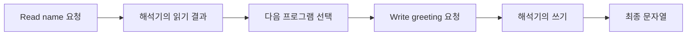

# 51장. Free Monad

앞 장의 Tagless Final은 연산 인터페이스에 대해 프로그램을 작성했다.
이번에는 연산을 요청하는 단계와 그 결과에 따라 이어질 계산을 프로그램 구조로 보관한다.
Free Monad는 이런 프로그램을 조립하고 나중에 해석하는 대표적인 방법이다.

이 장은 키와 문자열 값을 읽고 쓰는 작은 언어를 사용한다.
교육용 구현의 범위는 이 언어에 한정하며 Cats의 범용 Free API 전체를 복제하지 않는다.
깊은 연결을 실행할 때 호출 스택을 계속 쌓지 않도록 트램펄린을 함께 사용하고, 그 보장이 취소나
자원 안전성까지 뜻하지는 않는다는 점을 확인한다.

---

## 1. 개념과 기본 구분

### 연산과 연결을 보관하는 구조

Free의 관점에서는 개별 연산을 기술하는 언어와 계산을 이어 주는 구조를 분리한다.
순수한 값의 반환, 한 연산의 요청, 앞 결과에 의존하는 다음 계산의 연결을 표현한다.
실제 파일이나 데이터베이스 호출은 나중 해석기의 책임이다.

```text
Pure(value)              이미 가진 결과
Suspend(instruction)     한 연산의 요청
Bind(program, next)      앞 결과로 다음 프로그램 선택
```

이 모양은 Monad의 `pure`와 `flatMap`을 프로그램 데이터로 보관하는 한 가지 표현이다.
특정 라이브러리가 내부적으로 반드시 이 세 클래스를 그대로 사용하는 것은 아니다.
개념적인 구성과 구체적인 구현 세부사항을 구분한다.

### 결과 타입이 다른 연산

키 읽기는 선택적인 문자열을 반환한다.
키 쓰기는 의미 있는 반환값 없이 완료를 나타낼 수 있다.
연산마다 결과 타입을 보존하면 다음 계산이 그 결과를 정확한 타입으로 받을 수 있다.

### 해석기

해석기는 읽기와 쓰기가 실제로 무엇을 뜻하는지 정한다.
메모리 맵을 사용하거나 외부 저장소에 요청할 수 있다.
같은 프로그램 구조라도 해석기의 실패와 자원 계약에 따라 실행의 관측은 달라진다.

### Free가 공짜라는 뜻은 아니다

이름의 Free를 실행 비용이 없다는 뜻으로 해석하지 않는다.
프로그램 노드와 다음 계산 함수, 해석 루프에 비용이 생길 수 있다.
연산과 조합을 분리하는 구조적 이득이 필요한 곳에 사용한다.

---

## 2. 명령형 스타일과 함수형 스타일

### 직접 읽고 쓰는 코드

```text
name = store.read("name")
greeting = name을 이용한 인사말
store.write("greeting", greeting)
return greeting
```

함수를 실행하면 저장소가 바로 사용된다.
테스트용 저장소를 주입할 수 있지만 실행할 프로그램의 구조가 별도 값으로 남는 것은 아니다.
프로그램 조립과 실행을 구분하려면 표현을 한 단계 더 나눌 수 있다.

### 요청을 조립한다

```text
read("name").flatMap(name =>
  write("greeting", render(name)).map(_ => render(name))
)
```

여기서 `read`와 `write`는 실제 저장소 호출 대신 프로그램 노드를 만든다.
`flatMap`도 지금 읽기 결과를 얻는 것이 아니라 나중 연결을 보관한다.
해석 전에는 저장소의 읽기와 쓰기가 발생하지 않는 계약이다.

### 함수가 포함된 프로그램 데이터

`Bind`의 다음 계산은 함수다.
앞의 읽기 결과에 따라 서로 다른 프로그램을 만들 수 있다.
따라서 모든 미래 연산을 실행 전에 완전히 열거하거나 임의의 프로그램을 바로 JSON으로 저장할 수
있다고 주장해서는 안 된다.

### 단순 재귀 해석의 문제

깊게 중첩된 연결을 일반적인 재귀 호출로 실행하면 호출 스택이 커질 수 있다.
Free라는 이름만으로 스택 안전성이 생기는 것은 아니다.
연결 구조와 해석기의 실행 방식을 함께 설계해야 한다.

---

## 3. 왜 이 개념을 사용하는가?

### 조립과 실행의 분리

프로그램을 먼저 만들고 어떤 저장소에서 실행할지 나중에 결정할 수 있다.
같은 프로그램에 서로 다른 초기 데이터를 주어 동작을 비교한다.
실행하기 전에는 외부 작업이 없다는 계약을 테스트할 수 있다.

### 연산의 명시적인 범위

프로그램 언어가 읽기와 쓰기만 제공하면 그 요청 종류가 드러난다.
새로운 작업은 새 연산과 해석 규칙으로 추가한다.
프로그램 내부에서 임의의 외부 효과를 직접 실행하면 이 경계가 깨진다.

### 해석기의 교체

테스트 해석기는 메모리에 값을 저장하고 호출 이력을 기록할 수 있다.
실제 해석기는 데이터베이스를 사용할 수 있다.
인터페이스가 같더라도 원자성·지연·실패 의미까지 같은 것은 아니므로 대체 가능한 범위를 명시한다.

### 긴 연결의 제어

명시적인 해석 루프를 사용하면 다음 단계를 호출 스택이 아니라 값으로 넘길 수 있다.
이 장의 트램펄린은 한 실행 단계를 끝낸 뒤 다음 단계 함수를 루프에 돌려준다.
깊은 연결을 처리하는 것과 전체 메모리 사용을 상수로 만드는 것은 다른 문제다.

### 변경의 검토

언어에 어떤 연산이 있고 해석기가 무엇을 수행하는지 따로 검토할 수 있다.
감사나 테스트에 유용한 지점이 생긴다.
그러나 함수형 연결 안의 임의 코드까지 자동으로 분석되는 것은 아니다.

---

## 4. Scala에서의 표현

### Scala의 타입 있는 프로그램과 트램펄린

다음 구현은 키·값 언어에 특화된 Free 형태의 프로그램이다.
각 연산의 결과 타입을 유지하며 `Any`로 지운 뒤 강제 변환하는 방식을 사용하지 않는다.
`More`는 다음 호출을 값으로 돌려주므로 깊은 연결이 한 번에 호출 스택을 쌓지 않는다.

<!-- executable:scala -->
```scala
object Chapter51:
  import scala.annotation.tailrec

  enum Bounce[+A]:
    case Done(value: A)
    case More(next: () => Bounce[A])

  @tailrec
  def runBounce[A](current: Bounce[A]): A = current match
    case Bounce.Done(value) => value
    case Bounce.More(next) => runBounce(next())

  trait Handler:
    def read(key: String): Option[String]
    def write(key: String, value: String): Unit

  sealed trait Instruction[A]:
    def interpret(handler: Handler): A

  final case class Read(key: String) extends Instruction[Option[String]]:
    def interpret(handler: Handler): Option[String] = handler.read(key)

  final case class Write(key: String, value: String) extends Instruction[Unit]:
    def interpret(handler: Handler): Unit = handler.write(key, value)

  sealed trait Program[A]:
    def step[R](handler: Handler, next: A => Bounce[R]): Bounce[R]
    final def flatMap[B](f: A => Program[B]): Program[B] = Bind(this, f)
    final def map[B](f: A => B): Program[B] = flatMap(a => Pure(f(a)))

  final case class Pure[A](value: A) extends Program[A]:
    def step[R](handler: Handler, next: A => Bounce[R]): Bounce[R] =
      Bounce.More(() => next(value))

  final case class Suspend[A](instruction: Instruction[A]) extends Program[A]:
    def step[R](handler: Handler, next: A => Bounce[R]): Bounce[R] =
      Bounce.More(() => next(instruction.interpret(handler)))

  final case class Bind[X, A](source: Program[X], continue: X => Program[A]) extends Program[A]:
    def step[R](handler: Handler, next: A => Bounce[R]): Bounce[R] =
      Bounce.More(() => source.step(handler, (value: X) =>
        Bounce.More(() => continue(value).step(handler, next))))

  def read(key: String): Program[Option[String]] = Suspend(Read(key))
  def write(key: String, value: String): Program[Unit] = Suspend(Write(key, value))
  def run[A](program: Program[A], handler: Handler): A =
    runBounce(program.step(handler, (value: A) => Bounce.Done(value)))

  val greeting: Program[String] = read("name").flatMap { name =>
    val text = s"Hello, ${name.getOrElse("guest")}"
    write("greeting", text).map(_ => text)
  }

  final class MemoryHandler(initial: Map[String, String]) extends Handler:
    private var values = initial
    var trace = Vector.empty[String]
    def snapshot: Map[String, String] = values
    def read(key: String): Option[String] =
      trace = trace :+ s"read:$key"
      values.get(key)
    def write(key: String, value: String): Unit =
      trace = trace :+ s"write:$key"
      values = values.updated(key, value)

  def check(): Unit =
    val handler = new MemoryHandler(Map("name" -> "Ada"))
    assert(handler.trace.isEmpty)
    assert(run(greeting, handler) == "Hello, Ada")
    assert(handler.trace == Vector("read:name", "write:greeting"))
    assert(handler.snapshot("greeting") == "Hello, Ada")
    assert(run(greeting, new MemoryHandler(Map("name" -> "Grace"))) == "Hello, Grace")
    assert(run(greeting, new MemoryHandler(Map.empty)) == "Hello, guest")
    val deep = (0 until 20000).foldLeft[Program[Int]](Pure(0)) { (program, _) =>
      program.flatMap(value => Pure(value + 1))
    }
    assert(run(deep, new MemoryHandler(Map.empty)) == 20000)
    val f: Int => Program[Int] = value => write("x", value.toString).map(_ => value + 1)
    val g: Int => Program[Int] = value => Pure(value * 2)
    val left = new MemoryHandler(Map.empty)
    val right = new MemoryHandler(Map.empty)
    assert(run(Pure(3).flatMap(f).flatMap(g), left) == run(Pure(3).flatMap(x => f(x).flatMap(g)), right))
    assert(left.snapshot == right.snapshot && left.trace == right.trace)
```

### 실행 결과뿐 아니라 이력도 비교한다

연결의 괄호를 바꾼 두 프로그램을 서로 다른 새 저장소에서 실행한다.
최종 결과, 저장된 값, 읽기·쓰기 순서를 함께 비교한다.
함수 객체의 주소를 비교하는 것으로 프로그램의 의미가 같은지 판단하지 않는다.

### 스택 안전성의 범위

해석기는 각 단계의 다음 호출을 `More`로 반환한다.
하지만 사용자가 제공한 콜백이나 해석기 메서드 자체가 깊게 재귀하면 그 내부까지 자동으로
안전해지지 않는다.
프로그램 연결의 실행과 연산 구현 내부의 스택 사용을 구분한다.

---

## 5. 상태 변경보다 값 변환

### 조립된 프로그램의 의미

첫 노드는 이름을 읽으라는 요청이다.
해석기가 값을 주면 다음 계산이 그 이름을 포함한 쓰기 요청을 만든다.
앞 결과에 따라 다음 프로그램을 선택하는 Monad의 의존성이 보존된다.



모든 쓰기 요청이 프로그램 생성 시 이미 정해져 있어야 하는 것은 아니다.
미래 연산이 앞 결과에 의존할 수 있기 때문이다.
Free 프로그램의 분석 가능성과 완전한 사전 실행 계획을 동일시하지 않는다.

### 반복 실행

같은 프로그램을 다시 해석하면 읽기와 쓰기가 다시 발생한다.
이전에 얻은 결과를 재사용하는 것과 다르다.
한 번 실행한 결과를 공유하려면 별도의 저장과 수명 정책이 필요하다.

### 저장소 모형

메모리 해석기의 맵은 테스트용 상태다.
스레드 경쟁이나 연결 실패를 모사하지 않는다.
실제 해석기는 자신의 동시성·오류·자원 계약을 가져야 한다.

---

## 6. 함수 합성과 데이터 흐름

### 범용 Free와의 관계

라이브러리의 Free는 보통 연산의 타입 생성자 `F`와 최종 결과 타입 `A`를 매개변수로 받는다.
연산을 다른 컨텍스트 `G`로 해석하는 변환과 `G`의 연결 연산을 사용해 전체 프로그램을 실행할 수
있다.
이 장의 구현은 그 아이디어를 한 언어와 동기 해석기로 좁혔다.

```text
연산 언어 F
  -> 각 연산을 G에서 해석
  -> 전체 Free 프로그램의 결과 G[A]
```

### Tagless Final과의 차이

Tagless Final은 연산 인터페이스에 대해 프로그램을 작성한다.
이 장의 Free 형태는 순수 값과 연산 요청, 연결을 명시적인 구조로 보관한다.
두 방식 모두 여러 해석을 제공할 수 있지만 분석과 조립, 실행 비용의 형태가 다르다.

### 트램펄린의 연결

다음 호출을 즉시 수행하지 않고 값으로 반환하는 기법은 CPS와 관련된다.
뒤의 CPS 장에서 제어 흐름을 더 직접적으로 다룬다.
이 장에서는 프로그램 연결의 실행 스택을 제한하는 데 사용했다.

### 법칙과 실행 구현

Monad의 항등과 결합법칙은 프로그램 연결의 의미를 설명한다.
트램펄린은 그 프로그램을 어떤 스택 사용으로 실행할지 정한다.
대수적 정확성과 실행 자원의 안전성을 서로 다른 근거로 검토한다.

---

## 7. 장점과 트레이드오프

### 장점과 트레이드오프

| 선택 | 이점 | 주의점 |
| --- | --- | --- |
| 연산 요청의 분리 | 실행 경계 명확 | 프로그램 노드 비용 |
| 결과 타입 보존 | 잘못된 연결 감소 | 구현의 타입 복잡성 |
| 해석기 교체 | 테스트와 실행 분리 | 행동 계약의 차이 |
| 트램펄린 | 연결의 스택 사용 제한 | 전체 메모리 비용 |
| 함수형 연속 계산 | 동적인 다음 작업 | 완전한 직렬화의 어려움 |

### 메모리와 구조

큰 프로그램은 많은 노드와 클로저를 보관할 수 있다.
호출 스택을 줄였다고 모든 메모리 사용이 상수가 되는 것은 아니다.
실행 중 더 이상 필요한 참조가 남지 않도록 구조와 수명을 검토한다.

### 분석의 한계

연속 계산 함수는 실제 입력을 받기 전에는 어떤 작업을 만들지 알 수 없을 수 있다.
보안 분석이나 저장 가능한 워크플로가 필요하면 함수 대신 명시적인 제어 노드를 추가하는 설계를
검토한다.
그 선택에는 새로운 언어와 해석 규칙의 비용이 따른다.

### 단순한 프로그램의 대안

외부 호출이 몇 개뿐이고 별도 해석이나 프로그램 보관이 필요하지 않으면 일반 함수와 주입 포트가 더
간단할 수 있다.
Free를 쓰는 것 자체가 설계의 우월성을 의미하지 않는다.
실제 조립과 실행 분리의 요구를 기준으로 선택한다.

---

## 8. 상태와 부수효과의 경계

### 오류 처리

해석기의 읽기와 쓰기가 예외를 던지면 이 동기 실행기는 예외를 자동으로 도메인 오류로 바꾸지
않는다.
오류 결과를 반환하는 연산이나 효과 컨텍스트로 해석하는 구조가 필요할 수 있다.
어떤 실패를 보존하고 어떤 실패를 전파할지 명시한다.

### 자원과 취소

이 예제에는 파일 획득·해제나 비동기 취소 연산이 없다.
트램펄린 루프가 있다고 작업이 공정하게 스케줄링되거나 취소 가능한 것은 아니다.
실제 효과 실행기의 자원과 취소 정책은 별도로 필요하다.

### 원자성과 멱등성

여러 쓰기를 한 프로그램으로 묶어도 자동으로 하나의 트랜잭션이 되지 않는다.
중간 오류 전에 수행한 쓰기는 남을 수 있다.
반복 해석에서 중복 효과를 막는 정책도 별도로 설계해야 한다.

### 실행 권한

허용 연산이 적으면 요청 가능한 기능을 검토하기 쉽다.
그러나 다음 계산의 일반 함수나 해석기 내부에 임의 코드가 들어갈 수 있다.
언어 인터페이스와 실제 실행 권한, 신뢰하지 않는 코드의 격리를 구분한다.

---

## 9. Python에서 적용하기

### Python의 타입 있는 동기 프로그램 모형

Python에서도 프로그램 노드와 다음 단계 함수를 분리할 수 있다.
아래 추상 클래스의 메서드는 구현해야 할 계약이며 미완성된 실행 경로가 아니다.
구체적인 모든 노드는 계약을 구현하고 반복 해석 루프가 다음 단계를 실행한다.

<!-- executable:python -->
```python
from __future__ import annotations
from abc import ABC, abstractmethod
from collections.abc import Callable
from dataclasses import dataclass
from typing import Generic, Protocol, TypeVar

A = TypeVar("A")
B = TypeVar("B")
X = TypeVar("X")
R = TypeVar("R")


@dataclass(frozen=True)
class Done(Generic[A]):
    value: A


@dataclass(frozen=True)
class More(Generic[A]):
    next_step: Callable[[], Done[A] | More[A]]


def run_bounce(current: Done[A] | More[A]) -> A:
    while isinstance(current, More):
        current = current.next_step()
    return current.value


class Handler(Protocol):
    def read(self, key: str) -> str | None:
        ...

    def write(self, key: str, value: str) -> None:
        ...


class Instruction(ABC, Generic[A]):
    @abstractmethod
    def interpret(self, handler: Handler) -> A:
        ...


@dataclass(frozen=True)
class Read(Instruction[str | None]):
    key: str

    def interpret(self, handler: Handler) -> str | None:
        return handler.read(self.key)


@dataclass(frozen=True)
class Write(Instruction[None]):
    key: str
    value: str

    def interpret(self, handler: Handler) -> None:
        return handler.write(self.key, self.value)


class Program(ABC, Generic[A]):
    @abstractmethod
    def step(self, handler: Handler, next_step: Callable[[A], Done[R] | More[R]]) -> Done[R] | More[R]:
        ...

    def flat_map(self, function: Callable[[A], Program[B]]) -> Program[B]:
        return Bind(self, function)

    def map(self, function: Callable[[A], B]) -> Program[B]:
        return self.flat_map(lambda value: Pure(function(value)))


@dataclass(frozen=True)
class Pure(Program[A]):
    value: A

    def step(self, handler: Handler, next_step: Callable[[A], Done[R] | More[R]]) -> Done[R] | More[R]:
        return More(lambda: next_step(self.value))


@dataclass(frozen=True)
class Suspend(Program[A]):
    instruction: Instruction[A]

    def step(self, handler: Handler, next_step: Callable[[A], Done[R] | More[R]]) -> Done[R] | More[R]:
        return More(lambda: next_step(self.instruction.interpret(handler)))


@dataclass(frozen=True)
class Bind(Program[A], Generic[X, A]):
    source: Program[X]
    continue_with: Callable[[X], Program[A]]

    def step(self, handler: Handler, next_step: Callable[[A], Done[R] | More[R]]) -> Done[R] | More[R]:
        return More(lambda: self.source.step(handler, lambda value: More(lambda: self.continue_with(value).step(handler, next_step))))


def run(program: Program[A], handler: Handler) -> A:
    return run_bounce(program.step(handler, lambda value: Done(value)))


def greeting() -> Program[str]:
    def continue_with(name: str | None) -> Program[str]:
        text = f"Hello, {'guest' if name is None else name}"
        return Suspend(Write("greeting", text)).map(lambda _: text)
    return Suspend(Read("name")).flat_map(continue_with)


class MemoryHandler:
    def __init__(self, initial: dict[str, str]) -> None:
        self.values = dict(initial)
        self.trace: list[str] = []

    def read(self, key: str) -> str | None:
        self.trace.append(f"read:{key}")
        return self.values.get(key)

    def write(self, key: str, value: str) -> None:
        self.trace.append(f"write:{key}")
        self.values[key] = value


def test_program_and_interpreter() -> None:
    program = greeting()
    handler = MemoryHandler({"name": "Ada"})
    assert handler.trace == []
    assert run(program, handler) == "Hello, Ada"
    assert handler.trace == ["read:name", "write:greeting"]
    assert handler.values["greeting"] == "Hello, Ada"
    assert run(program, MemoryHandler({"name": "Grace"})) == "Hello, Grace"
    assert run(program, MemoryHandler({})) == "Hello, guest"
    deep: Program[int] = Pure(0)
    for _ in range(20_000):
        deep = deep.flat_map(lambda value: Pure(value + 1))
    assert run(deep, MemoryHandler({})) == 20_000
    f = lambda value: Suspend(Write("x", str(value))).map(lambda _: value + 1)
    g = lambda value: Pure(value * 2)
    left, right = MemoryHandler({}), MemoryHandler({})
    assert run(Pure(3).flat_map(f).flat_map(g), left) == run(Pure(3).flat_map(lambda value: f(value).flat_map(g)), right)
    assert left.values == right.values and left.trace == right.trace


if __name__ == "__main__":
    test_program_and_interpreter()
```

### 실행 검사의 범위

깊은 연결 테스트는 2만 단계의 이 프로그램 해석을 확인한다.
임의의 콜백과 외부 서비스 내부까지 스택 안전성을 증명한 것은 아니다.
정적 타입 검사 전체의 성공과 런타임 예제의 실행 성공도 구분한다.

---

## 10. Python의 표현 한계

### 고차 타입과 범용성

Python 예제는 하나의 연산 언어와 동기 Handler에 한정한다.
임의의 타입 생성자 `F`와 `G`를 Scala 라이브러리처럼 직접 일반화한 구현이 아니다.
구체적인 학습 모형의 장점과 표현력의 범위를 분리해서 설명한다.

### 런타임 계약

제네릭 주석은 해석기가 올바른 타입의 값을 반환하는지 자동으로 검사하지 않는다.
외부 응답을 파싱하는 경계와 포트 계약 테스트가 필요하다.
잘못된 객체가 연결에 들어오면 다른 위치에서 오류가 발생할 수 있다.

### 클로저와 직렬화

다음 계산 함수에는 외부 객체와 설정이 캡처될 수 있다.
이 구조를 안전하게 저장하거나 다른 프로세스에서 복원하는 일은 별도의 설계다.
임의의 함수를 직렬화할 수 있다는 가정을 사용하지 않는다.

### 실행 루프의 한계

루프는 동기적으로 끝까지 진행한다.
이벤트 루프에 제어를 양보하거나 다른 작업과 공정하게 실행하는 기능은 없다.
비동기 실행이 필요하면 해당 실행기의 프로토콜과 연결해야 한다.

---

## 11. 핵심 정리

### 핵심 결론

Free Monad는 연산 요청과 계산 연결을 프로그램 구조로 보관하는 방법이다.
프로그램 조립과 해석을 나누고 여러 실행 의미를 제공할 수 있다.
트램펄린은 연결의 호출 스택을 제어하지만 취소·자원·원자성을 자동 보장하지 않는다.
연속 계산에 함수가 포함되므로 모든 미래 작업의 사전 분석과 직렬화가 자동으로 가능하지는 않다.

### 연습 1: 실행 시점

읽기 프로그램을 만들었는데 저장소의 호출 기록이 비어 있다.
이것은 무엇을 확인하는가?

**해설.** 프로그램 조립이 실제 읽기를 수행하지 않는다는 계약을 확인한다.
해석기에 프로그램을 전달할 때 외부 작업이 발생한다.
명시적인 프로그램 값과 즉시 실행한 결과를 구분한다.

### 연습 2: 모든 연산의 열거

첫 읽기 결과에 따라 다음 키가 달라지는 프로그램의 모든 미래 요청을 항상 미리 알 수 있는가?

**해설.** 일반적인 연속 계산 함수에서는 그 결과를 받기 전까지 알 수 없을 수 있다.
분석과 저장이 필요하면 제어 구조를 더 명시적으로 표현하는 설계를 검토한다.
Free라는 이름만으로 완전한 정적 계획이 생기지는 않는다.

### 연습 3: 스택과 메모리

트램펄린이 있으니 프로그램의 메모리 사용도 상수라는 주장을 평가하라.

**해설.** 노드와 클로저, 보관한 값은 프로그램 크기에 따라 늘어날 수 있다.
호출 스택 제한과 전체 메모리 제한은 다른 문제다.
참조의 수명과 실행 중 보관하는 구조를 확인한다.

### 연습 4: 두 쓰기의 실패

첫 쓰기가 성공하고 두 번째 쓰기에서 예외가 났다.
Free 프로그램이므로 첫 쓰기도 자동으로 되돌아가는가?

**해설.** 아니다. 해석기의 트랜잭션이나 보상 정책이 필요하다.
프로그램 연결의 구조와 외부 저장소의 원자성을 구분한다.
오류와 재실행 정책을 함께 설계해야 한다.

### 다음 장과 참고 자료

다음 장은 작은 연산을 조합하여 입력 언어를 만드는 파서 조합기와 DSL을 다룬다.
연산의 의미뿐 아니라 입력을 소비하는 규칙과 실패 위치도 명시적으로 설계한다.

[Cats 공식 문서: Free](https://typelevel.org/cats/datatypes/free.html)
[Scala API: TailCalls](https://www.scala-lang.org/api/current/scala/util/control/TailCalls$.html)
[Oleg Kiselyov: Tagless-Final Style](https://okmij.org/ftp/tagless-final/)
