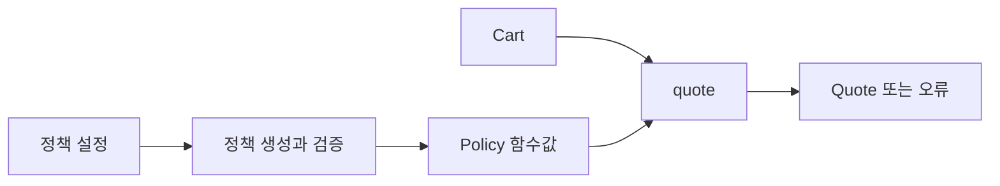

# 48장. Functions as Strategies

주문 금액에 적용할 할인 정책은 고객 등급이나 이벤트 설정에 따라 달라질 수 있다.
정책마다 클래스 하나와 실행 메서드 하나만 만드는 구조는 간단한 계산에 비해 복잡할 수 있다.
Functions as Strategies는 정책을 함수값으로 표현하여 선택하고 전달하고 조합하는 패턴이다.

이번 장은 정액 할인, 비율 할인, 여러 정책 중 가장 유리한 할인 선택을 구현한다.
정책 선택과 정책 실행을 분리하고 동점 처리와 오류 경계를 명시한다.
함수가 간단하다는 이유로 모든 상태 있는 전략 객체를 없애야 한다는 뜻은 아니다.

---

## 1. 개념과 기본 구분

### 전략의 최소 계약

전략은 같은 입력과 출력 계약을 가지면서 서로 다른 동작을 제공하는 값이다.
동작이 메서드 하나로 충분하다면 함수 타입이 그 계약을 표현할 수 있다.
일급 함수와 고차 함수가 실제 설계에 사용되는 사례다.

```text
DiscountPolicy: Cart -> Discount
```

호출자는 어떤 정책인지 세부 구현을 알 필요가 없다.
정해진 입력을 전달하고 결과를 사용한다.
하지만 유효한 할인 범위와 실행 효과는 타입 모양 외의 계약으로 확인해야 한다.

### 선택과 실행

설정 이름으로 정책을 선택하는 일과 장바구니에 정책을 적용하는 일은 다르다.
설정 오류는 조립 경계에서 발견할 수 있다.
모든 주문 처리마다 같은 문자열 분기를 반복할 필요는 없을 수 있다.

### 매개변수가 있는 전략

비율 할인은 할인율을 캡처한 함수를 만들 수 있다.
정액 할인은 고정 금액을 캡처한다.
클로저가 외부의 가변 설정을 읽는지 안정적인 값을 보관하는지 구분한다.

### 함수와 객체

여러 관련 연산과 자원 수명, 내부 상태를 관리해야 하면 객체가 더 적합할 수 있다.
함수 전략은 단일 계산의 계약을 간단히 표현하는 선택이다.
객체 지향 전략 패턴과 목적을 공유하지만 모든 구현 요구가 같은 것은 아니다.

---

## 2. 명령형 스타일과 함수형 스타일

### 조건문이 반복되는 계산

```text
if policyName == "fixed": 정액 할인
else if policyName == "percentage": 비율 할인
else if policyName == "best": 여러 할인 비교
```

정책 선택 분기가 여러 계산 함수에 흩어지면 새 정책을 추가하기 어렵다.
선택을 한 경계에 모으고 이미 선택한 함수를 전달할 수 있다.
분기가 완전히 없어지는 것이 아니라 책임이 적절한 위치로 이동한다.

### 정책 함수의 전달

```text
quote(cart, selectedPolicy)
```

견적 함수는 정책 이름을 해석하지 않는다.
할인을 적용한 결과가 유효한지 확인하고 순금액을 만든다.
정책 구성과 업무 계산을 분리한다.

### 작은 함수의 조합

여러 정책을 평가한 뒤 가장 큰 할인액을 선택하는 고차 함수를 만들 수 있다.
정책 자체를 다시 입력으로 받는다는 점에서 고차 함수다.
조합의 의미와 비용, 동점 처리까지 계약으로 정한다.

### 잘못된 기본 정책

설정 이름을 찾지 못했을 때 조용히 할인 없음으로 바꾸면 운영 설정 오류가 숨는다.
명시적인 오류를 반환하거나 의도한 기본 정책임을 분명히 해야 한다.
안전한 기본값이라는 표현만으로 업무 손실을 정당화하지 않는다.

---

## 3. 왜 이 개념을 사용하는가?

### 적은 형식 코드

단순한 계산 정책을 함수 하나로 표현할 수 있다.
클래스 계층과 메서드 전달 코드가 줄어든다.
정책이 복잡해지면 더 구조적인 표현으로 바꾸는 것도 가능하다.

### 조합의 재사용

최대 할인 선택, 조건부 적용, 상한 제한 같은 조합을 고차 함수로 만들 수 있다.
각 정책을 따로 테스트하고 조합의 법칙도 확인한다.
조합 순서가 결과에 영향을 주는지 명확히 한다.

### 설정 검증의 분리

잘못된 할인율은 정책 함수를 만드는 시점에 거부할 수 있다.
정상적인 정책은 유효한 설정을 캡처한 함수로 사용한다.
다만 실행 입력의 유효성과 외부 정책 버전은 별도로 확인해야 한다.

### 테스트의 단순화

작은 장바구니 값과 예상 할인값만으로 정책을 검사한다.
견적 함수에는 일부러 잘못된 결과를 반환하는 정책을 넣어 경계를 검증할 수 있다.
함수 주입이 테스트 대역을 만드는 간단한 방법이 된다.

### 의미 있는 이름

등록된 정책의 이름과 결과의 이유 코드를 남기면 실행 결과를 설명하기 쉽다.
익명 함수만 무작정 나열하면 실제 정책을 찾기 어려울 수 있다.
간결함과 진단 가능성을 함께 고려한다.

---

## 4. Scala에서의 표현

### Scala의 할인 전략

예제는 할인액이 장바구니 소계보다 클 수 없다는 계약을 사용한다.
정액 할인은 소계에서 상한을 적용하고 비율 할인은 정수 최소 단위로 버림한다.
여러 정책 중 최대 할인액이 같으면 앞에 있는 정책을 선택한다.

<!-- executable:scala -->
```scala
object Chapter48:
  final case class Cart(subtotal: BigInt, itemCount: Int)
  final case class Discount(amount: BigInt, reason: String)
  final case class Quote(subtotal: BigInt, discount: Discount):
    def net: BigInt = subtotal - discount.amount
  type Policy = Cart => Discount

  enum Error:
    case InvalidRate, InvalidFixedAmount, UnknownPolicy, InvalidCart, InvalidDiscount

  val noDiscount: Policy = _ => Discount(0, "none")

  def fixed(amount: BigInt, reason: String): Either[Error, Policy] =
    if amount < 0 then Left(Error.InvalidFixedAmount)
    else Right(cart => Discount(amount.min(cart.subtotal), reason))

  def percentage(bps: Int, reason: String): Either[Error, Policy] =
    if bps < 0 || bps > 10000 then Left(Error.InvalidRate)
    else Right(cart => Discount(cart.subtotal * bps / 10000, reason))

  def bestOf(policies: Vector[Policy]): Policy = cart =>
    policies.headOption match
      case None => noDiscount(cart)
      case Some(first) =>
        policies.tail.foldLeft(first(cart)) { (best, policy) =>
          val next = policy(cart)
          if next.amount > best.amount then next else best
        }

  def choose(name: String, registry: Map[String, Policy]): Either[Error, Policy] =
    registry.get(name).toRight(Error.UnknownPolicy)

  def quote(cart: Cart, policy: Policy): Either[Error, Quote] =
    if cart.subtotal < 0 || cart.itemCount < 0 then Left(Error.InvalidCart)
    else
      val discount = policy(cart)
      if discount.amount < 0 || discount.amount > cart.subtotal then Left(Error.InvalidDiscount)
      else Right(Quote(cart.subtotal, discount))

  def check(): Unit =
    val cart = Cart(10000, 3)
    val fixedPolicy = fixed(500, "fixed-500").toOption.get
    val percentPolicy = percentage(1000, "ten-percent").toOption.get
    assert(quote(cart, fixedPolicy).map(_.net) == Right(BigInt(9500)))
    assert(quote(cart, percentPolicy).map(_.net) == Right(BigInt(9000)))
    assert(quote(Cart(200, 1), fixedPolicy).map(_.net) == Right(BigInt(0)))
    val combined = bestOf(Vector(fixedPolicy, percentPolicy))
    assert(combined(cart) == Discount(1000, "ten-percent"))
    assert(bestOf(Vector.empty)(cart) == Discount(0, "none"))
    val equalFirst: Policy = _ => Discount(1000, "first")
    val equalSecond: Policy = _ => Discount(1000, "second")
    assert(bestOf(Vector(equalFirst, equalSecond))(cart).reason == "first")
    assert(percentage(10001, "bad") == Left(Error.InvalidRate))
    assert(fixed(-1, "bad") == Left(Error.InvalidFixedAmount))
    assert(choose("missing", Map("regular" -> fixedPolicy)) == Left(Error.UnknownPolicy))
    assert(choose("regular", Map("regular" -> fixedPolicy)).flatMap(policy => quote(cart, policy)).map(_.net) == Right(BigInt(9500)))
    assert(quote(cart, _ => Discount(20000, "bug")) == Left(Error.InvalidDiscount))
    assert(quote(Cart(-1, 0), fixedPolicy) == Left(Error.InvalidCart))
    var calls = Vector.empty[String]
    val a: Policy = _ => { calls = calls :+ "a"; Discount(1, "a") }
    val b: Policy = _ => { calls = calls :+ "b"; Discount(2, "b") }
    assert(bestOf(Vector(a, b))(cart).amount == 2)
    assert(calls == Vector("a", "b"))
```

### 성공값 추출의 범위

테스트는 고정된 유효 설정으로 만든 정책을 추출한다.
사용자 설정을 처리하는 제품 코드에서는 결과를 연결하거나 명시적으로 오류를 처리해야 한다.
일반적인 정책 선택 경계에서 무조건적인 `.get`을 사용하라는 예제가 아니다.

### 모든 정책을 실행한다

`bestOf`는 최댓값을 비교하기 위해 각 정책을 한 번씩 평가한다.
정책이 외부 호출을 숨기고 있으면 호출 수와 실패 비용이 커질 수 있다.
순수한 정책 함수와 효과를 수행하는 전략을 구분한다.

---

## 5. 상태 변경보다 값 변환

### 정책도 값으로 이동한다

정책 생성 함수는 검증된 설정을 캡처한 함수값을 반환한다.
선택 경계는 그 함수값을 견적 계산에 전달한다.
견적 계산은 이름이 아니라 연산 계약을 사용한다.



함수값이 데이터처럼 전달된다는 일급 함수의 의미가 드러난다.
다만 일반적인 함수값은 직렬화하거나 내용을 분석하기 어려울 수 있다.
그런 요구가 있으면 다음 장의 명시적인 프로그램 데이터가 적합할 수 있다.

### 불변 설정 캡처

숫자 설정을 값으로 캡처하면 정책의 기준이 안정적일 수 있다.
가변 설정 객체를 캡처하면 실행 중 정책이 바뀔 수 있다.
스냅샷 정책과 동적 정책을 의도적으로 선택한다.

### 정책의 식별

결과의 이유 코드는 어떤 정책이 선택되었는지 설명할 수 있다.
하지만 함수의 코드와 설정 버전 전체를 증명하는 것은 아니다.
재현이 필요한 시스템은 정책 버전과 구성값을 별도로 관리한다.

---

## 6. 함수 합성과 데이터 흐름

### 전략 조합의 의미

최대 할인 선택과 할인 누적은 다른 조합이다.
할인을 차례로 적용하면 두 번째 정책의 기준 금액이 달라질 수 있다.
조합 이름에 실제 정책을 드러내야 한다.

```text
최대 선택: max(discountA(cart), discountB(cart))
차례 적용: discountB(afterA(cart))
```

### 동점 처리

최대 금액이 같아도 이유 코드와 적용 정책이 다를 수 있다.
첫 정책 우선, 특정 우선순위, 안정적인 정렬 같은 규칙을 정한다.
금액만 비교한 테스트로는 설명의 안정성을 확인하지 못할 수 있다.

### 조건부 전략

고객 등급이나 최소 금액 조건을 만족할 때만 정책을 적용하는 고차 함수를 만들 수 있다.
조건 판단이 외부 상태를 읽는지 명시적인 입력만 사용하는지 확인한다.
정책의 순수성과 재현성을 유지하려면 필요한 사실을 값으로 전달한다.

### 객체 전략으로의 확장

정책이 초기화·종료·여러 관련 연산을 요구하면 객체가 더 명확할 수 있다.
하나의 메서드를 함수로 감싸서 전달하는 어댑터도 가능하다.
함수와 객체 중 하나만 고집하기보다 실제 계약에 맞춘다.

---

## 7. 장점과 트레이드오프

### 장점과 트레이드오프

| 선택 | 이점 | 주의점 |
| --- | --- | --- |
| 함수 전략 | 단순한 계산 표현 | 진단 이름과 설정 관리 |
| 클로저 생성 | 정책 매개변수 고정 | 가변 캡처 |
| 고차 조합 | 정책 재사용 | 호출 횟수와 순서 |
| 선택 경계 분리 | 설정 오류 조기 발견 | 동적 변경 정책 |
| 객체 전략 | 상태와 수명 관리 | 단순 계산에는 형식 증가 |

### 직렬화와 분석

함수값을 데이터베이스에 저장하거나 다른 프로세스로 전송하는 것은 단순하지 않을 수 있다.
어떤 연산이 들어 있는지 정적으로 분석하기도 어렵다.
정책을 데이터로 표현하고 해석하는 방식은 다른 장단점을 가진다.

### 잘못된 함수의 주입

같은 시그니처를 가진 함수가 음수 할인이나 과도한 할인을 반환할 수 있다.
시그니처와 업무 불변식은 다르다.
신뢰 경계에 맞는 결과 검증과 테스트를 유지한다.

### 익명 함수의 과밀

길고 복잡한 람다를 중첩하면 정책의 의미를 읽기 어려워진다.
의미 있는 이름의 함수로 분리하고 구성 단계를 드러낸다.
짧은 문법이 항상 짧은 이해 시간을 뜻하지는 않는다.

---

## 8. 상태와 부수효과의 경계

### 외부 효과를 가진 전략

정책 함수가 원격 가격이나 현재 시간을 읽으면 같은 Cart에서도 결과가 달라질 수 있다.
그 효과를 입력값이나 명시적인 컨텍스트로 드러낼 수 있다.
함수 타입이라는 이유만으로 순수한 전략이라고 가정하지 않는다.

### 설정 변경의 수명

실행 도중 정책 레지스트리가 바뀌면 주문마다 다른 정책을 사용할 수 있다.
한 요청에서 어떤 정책 버전을 사용했는지 고정할 필요가 있는지 확인한다.
동적 교체와 재현 가능성의 균형을 설계한다.

### 권한과 확장 코드

외부 플러그인이 제공한 함수는 임의의 코드를 실행할 수 있다.
타입이 맞는다는 사실은 실행 권한이나 시간 제한을 보장하지 않는다.
신뢰하지 않는 정책 코드에는 별도의 격리와 검증이 필요하다.

### 실패 처리

정책 함수의 예외를 무조건 할인 없음으로 바꾸면 계산 오류가 숨을 수 있다.
실패를 결과로 표현하거나 적절한 운영 경계로 전파한다.
업무 기본 정책과 장애 복구 정책을 구분한다.

---

## 9. Python에서 적용하기

### Python의 호출 가능한 정책

Python에서는 `Callable`로 같은 입력·출력 계약을 표현한다.
설정 생성 함수는 정책 또는 오류를 반환한다.
선택된 함수는 일반적인 값처럼 레지스트리에 넣고 다른 함수에 전달할 수 있다.

<!-- executable:python -->
```python
from collections.abc import Callable
from dataclasses import dataclass
from enum import Enum


@dataclass(frozen=True)
class Cart:
    subtotal: int
    item_count: int


@dataclass(frozen=True)
class Discount:
    amount: int
    reason: str


@dataclass(frozen=True)
class Quote:
    subtotal: int
    discount: Discount

    def net(self) -> int:
        return self.subtotal - self.discount.amount


Policy = Callable[[Cart], Discount]


class Error(Enum):
    INVALID_RATE = "invalid_rate"
    INVALID_FIXED_AMOUNT = "invalid_fixed_amount"
    UNKNOWN_POLICY = "unknown_policy"
    INVALID_CART = "invalid_cart"
    INVALID_DISCOUNT = "invalid_discount"


def no_discount(cart: Cart) -> Discount:
    return Discount(0, "none")


def fixed(amount: int, reason: str) -> Policy | Error:
    if type(amount) is not int or amount < 0:
        return Error.INVALID_FIXED_AMOUNT
    return lambda cart: Discount(min(amount, cart.subtotal), reason)


def percentage(bps: int, reason: str) -> Policy | Error:
    if type(bps) is not int or not 0 <= bps <= 10_000:
        return Error.INVALID_RATE
    return lambda cart: Discount(cart.subtotal * bps // 10_000, reason)


def best_of(policies: tuple[Policy, ...]) -> Policy:
    def run(cart: Cart) -> Discount:
        if not policies:
            return no_discount(cart)
        best = policies[0](cart)
        for policy in policies[1:]:
            candidate = policy(cart)
            if candidate.amount > best.amount:
                best = candidate
        return best
    return run


def choose(name: str, registry: dict[str, Policy]) -> Policy | Error:
    return registry.get(name, Error.UNKNOWN_POLICY)


def quote(cart: Cart, policy: Policy) -> Quote | Error:
    if cart.subtotal < 0 or cart.item_count < 0:
        return Error.INVALID_CART
    discount = policy(cart)
    if type(discount.amount) is not int or not 0 <= discount.amount <= cart.subtotal:
        return Error.INVALID_DISCOUNT
    return Quote(cart.subtotal, discount)


def test_strategies() -> None:
    cart = Cart(10_000, 3)
    fixed_policy = fixed(500, "fixed-500")
    percent_policy = percentage(1000, "ten-percent")
    assert callable(fixed_policy) and callable(percent_policy)
    first = quote(cart, fixed_policy)
    second = quote(cart, percent_policy)
    assert isinstance(first, Quote) and first.net() == 9500
    assert isinstance(second, Quote) and second.net() == 9000
    assert best_of((fixed_policy, percent_policy))(cart) == Discount(1000, "ten-percent")
    assert best_of(())(cart) == Discount(0, "none")
    a: Policy = lambda _: Discount(1000, "first")
    b: Policy = lambda _: Discount(1000, "second")
    assert best_of((a, b))(cart).reason == "first"
    assert percentage(10_001, "bad") is Error.INVALID_RATE
    assert fixed(-1, "bad") is Error.INVALID_FIXED_AMOUNT
    assert choose("missing", {"regular": fixed_policy}) is Error.UNKNOWN_POLICY
    assert quote(cart, lambda _: Discount(20_000, "bug")) is Error.INVALID_DISCOUNT
    assert quote(Cart(-1, 0), fixed_policy) is Error.INVALID_CART
    calls: list[str] = []

    def tracked(name: str, amount: int) -> Policy:
        def run(_: Cart) -> Discount:
            calls.append(name)
            return Discount(amount, name)
        return run

    assert best_of((tracked("a", 1), tracked("b", 2)))(cart).amount == 2
    assert calls == ["a", "b"]


if __name__ == "__main__":
    test_strategies()
```

### 테스트용 호출 가능성 검사

테스트는 유효 설정으로 만든 결과가 실제 함수인지 확인한 뒤 사용한다.
제품 코드에서는 오류를 명시적으로 분기하여 사용자나 운영자에게 알리는 경계를 두어야 한다.
호출 가능하다는 사실만으로 업무 법칙과 순수성이 보장되는 것은 아니다.

---

## 10. Python의 표현 한계

### 타입 주석의 한계

`Callable[[Cart], Discount]`는 실행 시 모든 입력과 출력을 자동 검사하지 않는다.
잘못된 객체나 예외가 반환될 수 있다.
신뢰 경계에 맞는 검증과 정적 검사, 테스트를 함께 사용한다.

### 클로저 캡처

루프에서 정책 함수를 만들 때 같은 변수를 늦게 읽는 문제가 생길 수 있다.
필요한 설정값을 함수 생성 시점에 고정하는 방식을 사용한다.
기본 인자로 객체를 캡처해도 그 객체가 깊게 복사되는 것은 아니다.

### 함수의 이름과 관측

람다의 기본 표시만으로 업무 정책을 구분하기 어려울 수 있다.
정책 이름과 버전, 설명 코드를 별도의 데이터로 관리할 수 있다.
운영 추적에 필요한 정보를 단순히 함수 객체의 문자열 표현에 의존하지 않는다.

### 자원 있는 전략

파일이나 연결을 사용하는 정책은 함수가 언제까지 유효한지 수명을 정해야 한다.
단순한 클로저가 자원 해제를 자동 관리하지 않는다.
복잡한 수명이 필요하면 객체나 범위 있는 효과 구조를 검토한다.

---

## 11. 핵심 정리

### 핵심 결론

단일 계산 계약의 전략은 함수값으로 간단히 표현할 수 있다.
정책 선택과 실행, 설정 검증과 결과 검증을 분리한다.
여러 정책을 조합할 때 순서와 동점, 호출 횟수의 의미를 명시해야 한다.
상태·자원·분석·직렬화 요구가 생기면 다른 표현도 함께 검토한다.

### 연습 1: 정책 선택

모든 계산 함수가 같은 문자열 정책 이름을 분기한다.
어떻게 책임을 나눌 수 있는가?

**해설.** 설정 경계에서 정책 함수를 선택하고 계산에는 그 함수를 전달한다.
알 수 없는 이름은 명시적인 오류로 처리할 수 있다.
선택과 실행을 분리한다.

### 연습 2: 동점

두 정책의 할인액은 같지만 이유 코드가 다르다.
어떤 계약이 필요한가?

**해설.** 첫 정책 우선 같은 안정적인 동점 규칙이 필요하다.
금액만 같다고 전체 설명 결과가 같은 것은 아니다.
결과의 모든 의미 있는 필드를 검토한다.

### 연습 3: 외부 조회

최대 할인 조합에 원격 조회를 하는 정책 열 개를 넣었다.
무엇을 확인해야 하는가?

**해설.** 모든 정책의 호출 횟수와 비용, 실패, 실행 순서를 확인한다.
순수한 계산 전략과 외부 효과를 수행하는 전략은 다르다.
필요한 사실을 먼저 값으로 전달하는 대안을 검토할 수 있다.

### 연습 4: 객체 전략

정책이 연결 초기화와 여러 메서드, 종료 처리를 요구한다.
함수 하나로 반드시 바꾸어야 하는가?

**해설.** 아니다. 객체가 관련 상태와 수명을 더 명확히 표현할 수 있다.
단일 계산에는 함수가 간단하고 복합 계약에는 다른 구조가 적합할 수 있다.
문법보다 실제 책임을 기준으로 선택한다.

### 다음 장과 참고 자료

다음 장은 함수를 바로 실행하는 대신 프로그램의 연산을 데이터로 표현하고 여러 방식으로 해석한다.
정책의 분석과 표시, 실행을 같은 구조에서 분리하는 방법을 배운다.

[Scala 공식 문서: Function Variables](https://docs.scala-lang.org/scala3/book/fun-function-variables.html)
[Scala 공식 문서: Higher-Order Functions](https://docs.scala-lang.org/scala3/book/fun-hofs.html)
[Python 공식 문서: Callable](https://docs.python.org/3.14/library/typing.html#typing.Callable)
