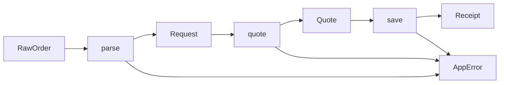

# 46장. Railway-Oriented Programming


입력을 읽고 상품을 확인하고 견적을 저장하는 흐름에는 각기 다른 실패가 있다.
성공값을 다음 단계로 넘기고 실패를 보존하는 분기를 모든 단계에 직접 쓰면 반복이 많아진다.
Railway Oriented Programming은 이런 성공·실패 경로를 연결하는 방식을 설명하는 패턴이다.

이번 장은 파싱 오류, 업무 규칙 오류, 저장 오류를 구분한 작은 파이프라인을 만든다.
비유보다 실제 결과 타입과 함수 시그니처를 중심으로 읽는다.
이 패턴을 모든 코드에 적용하거나 예외와 자원 문제까지 자동 해결하는 도구로 과장하지 않는다.

---

## 1. 개념과 기본 구분

### 성공과 실패의 두 경로

한 단계는 성공값 또는 오류값을 반환한다.
다음 단계는 성공값을 받아 새로운 결과를 만들며 앞의 오류는 그대로 전달할 수 있다.
이 구조는 앞에서 배운 `Either`와 `flatMap`의 구체적인 활용이다.

```text
step1: A -> Either[E, B]
step2: B -> Either[E, C]
연결:  A -> Either[E, C]
```

기차 선로라는 비유는 성공과 실패의 흐름을 시각화하는 데 도움이 된다.
그러나 모든 프로그램의 동시성·취소·자원·상태를 두 선로만으로 설명할 수는 없다.
비유의 적용 범위를 결과 연결에 한정하여 읽는다.

### 값 변환과 결과 연결

성공값을 일반 값으로 바꾸는 함수에는 `map`을 사용한다.
성공값에서 다시 오류 가능 결과를 만드는 함수에는 `flatMap`을 사용한다.
잘못 선택하면 결과가 중첩되거나 오류가 정상값처럼 취급될 수 있다.

### 오류의 공통 타입

서로 다른 단계의 오류를 하나의 합 타입으로 표현할 수 있다.
파싱·업무·저장 오류를 구분하면 마지막 경계에서 다른 대응을 선택할 수 있다.
모든 오류를 같은 문자열로 평평하게 만들 필요는 없다.

### 실패 시 생략

첫 오류 이후의 성공 의존 단계는 실행되지 않는다.
독립적인 여러 입력 오류를 모으는 Validation과 다른 정책이다.
사용자에게 어떤 오류를 언제 보여 줄지에 따라 적절한 조합을 선택한다.

---

## 2. 명령형 스타일과 함수형 스타일

### 반복적인 분기

```text
파싱한다
실패면 반환한다
상품을 확인한다
실패면 반환한다
저장한다
실패면 반환한다
성공 응답을 만든다
```

이 형태는 명확하며 작은 코드에서는 충분히 좋은 선택이다.
같은 결과 전달이 여러 함수에 반복되면 공통 연결 연산을 사용할 수 있다.
명시적 분기가 항상 나쁘다는 뜻은 아니다.

### 연결된 결과 함수

```text
parse(raw)
  .flatMap(checkAndQuote)
  .flatMap(save)
```

각 업무 함수는 자신의 성공값과 오류를 만든다.
연결 연산은 앞 오류를 보존하고 뒤 단계를 생략한다.
전체 흐름에서 어떤 단계가 실행될 수 있는지 읽기 쉬워진다.

### 오류를 성공 기본값으로 바꾸는 실수

상품 부재를 금액 0의 견적으로 바꾸면 뒤 저장 단계가 정상 실행될 수 있다.
정말 무료 상품이라는 업무 정책인지 실패 은폐인지 구분해야 한다.
복구는 의미 있는 대체 결과를 만들 수 있을 때만 명시적으로 적용한다.

### 광범위한 예외 포착

전체 파이프라인을 감싸 모든 예외를 입력 오류로 바꾸면 버그와 장애가 숨는다.
예상한 실패는 결과 타입으로, 예상하지 못한 실행 문제는 적절한 운영 경계로 처리한다.
결과 연결이 예외 포착 정책을 자동으로 정하지 않는다.

---

## 3. 왜 이 개념을 사용하는가?

### 성공 흐름의 가독성

파싱, 판단, 저장이라는 주요 단계가 드러난다.
반복되는 오류 전파 코드를 공통화할 수 있다.
하지만 함수 이름과 결과 타입이 충분히 구체적이어야 의미가 보인다.

### 오류 분류의 보존

실패의 종류를 끝까지 유지하면 사용자 응답과 운영 진단을 분리할 수 있다.
저장소 장애를 입력 오류처럼 안내하는 실수를 줄인다.
민감한 내부 원인은 외부 응답에서 적절히 숨긴다.

### 단계별 테스트

각 함수의 성공·실패를 따로 검사한다.
전체 파이프라인에서는 실패 이후 저장이 호출되지 않는지 확인한다.
반환값과 외부 호출 횟수라는 서로 다른 관측을 함께 사용한다.

### 복구 위치의 명시

특정 오류에서만 대체 경로를 선택할 수 있다.
복구를 모든 단계에 흩뿌리는 대신 필요한 경계에 모으면 정책을 읽기 쉽다.
대체 결과가 원래 성공과 구분되어야 하는지도 검토한다.

### 기존 코드의 점진적 개선

기존 예외 기반 외부 API 앞에 작은 결과 어댑터를 둘 수 있다.
전체 시스템의 오류 방식을 한 번에 바꾸지 않아도 된다.
어떤 예외를 어떤 오류값으로 번역하는지 범위를 좁힌다.

---

## 4. Scala에서의 표현

### Scala의 세 종류 오류와 파이프라인

예제의 저장소는 메모리 테스트 대역이다.
정상 저장, 예상한 저장 거부, 예상하지 못한 버그를 서로 다른 모드로 확인한다.
응답 코드의 선택은 예제 애플리케이션의 정책이며 오류 구조를 보여 주기 위한 것이다.

<!-- executable:scala -->
```scala
object Chapter46:
  enum AppError:
    case Input(field: String, code: String)
    case Rule(code: String)
    case Storage(code: String)

  final case class RawOrder(sku: String, quantity: String)
  final case class Request(sku: String, quantity: Int)
  final case class Product(unitPrice: BigInt, stock: Int)
  final case class Quote(sku: String, quantity: Int, amount: BigInt)
  final case class Receipt(id: String, amount: BigInt)
  final case class Response(status: Int, body: String)

  def parse(raw: RawOrder): Either[AppError, Request] =
    if !raw.sku.matches("[A-Z0-9][A-Z0-9-]{0,31}") then Left(AppError.Input("sku", "invalid_format"))
    else if raw.quantity.isEmpty || raw.quantity.length > 7 ||
      !raw.quantity.forall(ch => ch >= '0' && ch <= '9') then
      Left(AppError.Input("quantity", "invalid_format"))
    else
      val quantity = raw.quantity.toInt
      if quantity < 1 || quantity > 1000000 then Left(AppError.Input("quantity", "out_of_range"))
      else Right(Request(raw.sku, quantity))

  def quote(request: Request, catalog: Map[String, Product]): Either[AppError, Quote] =
    catalog.get(request.sku) match
      case None => Left(AppError.Rule("missing_product"))
      case Some(product) if product.stock < request.quantity => Left(AppError.Rule("out_of_stock"))
      case Some(product) => Right(Quote(request.sku, request.quantity, product.unitPrice * request.quantity))

  enum StoreMode:
    case Normal, Reject, Bug

  final class Store(mode: StoreMode):
    var calls = 0
    def save(value: Quote): Either[AppError, Receipt] =
      calls += 1
      mode match
        case StoreMode.Normal => Right(Receipt("R-1", value.amount))
        case StoreMode.Reject => Left(AppError.Storage("unavailable"))
        case StoreMode.Bug => throw new IllegalStateException("unexpected bug")

  def process(raw: RawOrder, catalog: Map[String, Product], store: Store): Either[AppError, Receipt] =
    parse(raw).flatMap(request => quote(request, catalog)).flatMap(store.save)

  def respond(result: Either[AppError, Receipt]): Response = result match
    case Right(receipt) => Response(201, s"created:${receipt.id}")
    case Left(AppError.Input(field, code)) => Response(400, s"$field:$code")
    case Left(AppError.Rule(code)) => Response(409, code)
    case Left(AppError.Storage(_)) => Response(503, "temporarily_unavailable")

  def check(): Unit =
    val catalog = Map("A" -> Product(1000, 3))
    val store = new Store(StoreMode.Normal)
    assert(process(RawOrder("A", "2"), catalog, store) == Right(Receipt("R-1", 2000)))
    assert(store.calls == 1)
    val malformed = process(RawOrder("A", "bad"), catalog, store)
    assert(malformed == Left(AppError.Input("quantity", "invalid_format")))
    assert(store.calls == 1)
    val outOfStock = process(RawOrder("A", "4"), catalog, store)
    assert(outOfStock == Left(AppError.Rule("out_of_stock")))
    assert(store.calls == 1)
    val rejected = process(RawOrder("A", "1"), catalog, new Store(StoreMode.Reject))
    assert(rejected == Left(AppError.Storage("unavailable")))
    assert(respond(rejected) == Response(503, "temporarily_unavailable"))
    assert(respond(malformed).status == 400)
    assert(respond(outOfStock).status == 409)
    assert(respond(Right(Receipt("R-1", 2000))) == Response(201, "created:R-1"))
    var bugEscaped = false
    try process(RawOrder("A", "1"), catalog, new Store(StoreMode.Bug))
    catch case _: IllegalStateException => bugEscaped = true
    assert(bugEscaped)
```

### 오류 선로가 포괄하지 않는 것

저장 단계의 예상하지 못한 예외는 결과의 왼쪽 값으로 자동 변환되지 않는다.
이것은 예제에서 의도한 계약이다.
실제 서버의 최상위 오류 경계는 예외를 관측하고 안전한 응답을 만들 수 있지만 원인을 입력 오류로
위장해서는 안 된다.

### 응답 번역

저장 오류의 내부 코드는 외부 응답에서 일반적인 일시 장애 안내로 바꾼다.
로그에는 필요한 원인을 별도로 남길 수 있다.
오류 타입과 사용자에게 공개할 메시지를 분리한다.

---

## 5. 상태 변경보다 값 변환

### 성공값은 단계마다 바뀐다

파싱 후에는 Request, 판단 후에는 Quote, 저장 후에는 Receipt가 된다.
실패 타입은 공통 합 타입으로 유지한다.
성공 경로의 타입 변화를 읽으면 각 단계의 책임을 이해하기 쉽다.



그림의 오류 합류는 오류의 종류를 없앤다는 뜻이 아니다.
합 타입의 태그와 필드로 각 원인을 보존한다.
마지막 경계에서 필요한 대응을 선택한다.

### 저장 전의 값

Quote는 저장할 수 있는 계산 결과다.
저장 영수증과 같지 않으므로 `Right(Quote)`만으로 저장 완료를 주장하지 않는다.
각 성공값이 어떤 사실을 나타내는지 명확히 한다.

### 관측 가능한 호출

파싱이나 업무 판단이 실패하면 저장 호출은 생략된다.
이미 수행된 앞 단계의 외부 읽기까지 취소되는 것은 아니다.
결과 연결의 단락 동작과 과거 효과의 취소를 구분한다.

---

## 6. 함수 합성과 데이터 흐름

### 연결 연산의 유도

성공이면 다음 함수를 호출하고 실패면 오류를 그대로 반환하는 작은 분기가 기본이다.
`flatMap`은 이 분기를 공통 연산으로 묶는다.
연산을 풀어 썼을 때의 동작을 이해하면 체이닝을 검토하기 쉽다.

```text
bind(Success(value), next) = next(value)
bind(Failure(error), next) = Failure(error)
```

### 일반 함수의 들어 올리기

실패하지 않는 값 변환은 `map`으로 연결할 수 있다.
오류 결과를 반환하는 함수를 `map`하면 결과가 한 층 더 중첩될 수 있다.
반환 타입을 보고 어떤 연결이 필요한지 선택한다.

### 오류 변환

오류의 타입을 바꾸거나 정보를 추가하는 연산을 별도로 둘 수 있다.
중요한 원인을 잃지 않도록 변환 규칙을 명시한다.
모든 오류를 같은 메시지로 바꾸는 것은 간단하지만 복구 가능성을 줄일 수 있다.

### 독립 검증과의 연결

여러 필드의 오류를 먼저 모은 뒤 유효한 요청에서 의존적인 처리로 넘어갈 수 있다.
Validation과 Railway 패턴은 서로 다른 단계에서 함께 사용할 수 있다.
모든 구간에 같은 오류 정책을 강제하지 않는다.

---

## 7. 장점과 트레이드오프

### 장점과 트레이드오프

| 선택 | 이점 | 주의점 |
| --- | --- | --- |
| 결과 함수 연결 | 반복 분기 감소 | 체이닝의 가독성 |
| 오류 합 타입 | 원인별 처리 | 지나치게 큰 오류 타입 |
| 첫 오류 중단 | 의존 흐름에 적합 | 독립 오류 누락 |
| 마지막 응답 변환 | 공개 정책 통일 | 내부 진단 보존 |
| 명시적 복구 | 대체 경로 가시화 | 실패 은폐 위험 |

### 과도한 적용

실패 가능성이 없는 단순 계산까지 모두 결과 래퍼로 감싸면 잡음이 늘 수 있다.
명시적인 분기문이 더 읽기 쉬운 작은 흐름도 있다.
패턴은 반복되는 실패 연결이 실제로 있는 곳에서 사용한다.

### 거대한 오류 합 타입

프로그램 전체의 모든 오류를 하나의 타입에 넣으면 각 함수의 가능한 실패가 흐려질 수 있다.
하위 도메인의 오류를 경계에서 상위 오류로 번역할 수 있다.
필요한 범위의 오류만 노출하는 계약을 검토한다.

### 로그 콜백

중간 성공값을 관찰하는 `tap`이나 `tee`가 외부 로그를 출력하면 새로운 실패 경계가 생길 수 있다.
그 콜백의 예외와 실행 횟수를 확인해야 한다.
단순한 관찰 함수라는 이름이 무해함을 보장하지 않는다.

---

## 8. 상태와 부수효과의 경계

### 자원 정리

오류 선로로 이동해도 열린 파일이나 연결이 자동으로 닫히는 것은 아니다.
자원 범위를 별도로 구성해야 한다.
결과 타입의 실패 전파와 획득·해제 정책을 함께 검토한다.

### 부분 저장

한 저장이 성공한 뒤 다른 저장이 실패할 수 있다.
파이프라인이 왼쪽 결과를 반환해도 앞 저장은 남을 수 있다.
트랜잭션과 보상, 멱등성은 외부 실행의 별도 책임이다.

### 재시도

모든 오류에서 전체 파이프라인을 다시 실행하면 이미 성공한 효과를 반복할 수 있다.
재시도 가능한 단계와 오류를 구분한다.
시간 초과 후 외부 성공 여부가 불명확한 경우도 고려해야 한다.

### 취소와 버그

취소 요청과 예상하지 못한 버그를 모두 일반적인 업무 오류로 바꾸지 않는다.
정리와 관측을 수행한 뒤 적절한 경계로 전파해야 할 수 있다.
두 선로의 비유만으로 모든 제어 흐름을 설명하려 하지 않는다.

---

## 9. Python에서 적용하기

### Python의 명시적인 결과 연결

Python 예제는 성공과 실패 래퍼를 만들고 작은 `bind`로 연결한다.
오류는 종류와 안정적인 코드를 가진 값이다.
정상 분기문으로 풀어 쓰는 대안과 의미가 같은지 확인할 수 있다.

<!-- executable:python -->
```python
from collections.abc import Callable
from dataclasses import dataclass
from enum import Enum
from typing import Generic, TypeVar
import re

A = TypeVar("A")
B = TypeVar("B")


@dataclass(frozen=True)
class Success(Generic[A]):
    value: A


@dataclass(frozen=True)
class AppError:
    kind: str
    code: str
    field: str = ""


@dataclass(frozen=True)
class Failure:
    error: AppError


def bind(value: Success[A] | Failure, function: Callable[[A], Success[B] | Failure]) -> Success[B] | Failure:
    return value if isinstance(value, Failure) else function(value.value)


@dataclass(frozen=True)
class Request:
    sku: str
    quantity: int


@dataclass(frozen=True)
class Product:
    unit_price: int
    stock: int


@dataclass(frozen=True)
class Quote:
    sku: str
    quantity: int
    amount: int


@dataclass(frozen=True)
class Receipt:
    receipt_id: str
    amount: int


def parse(sku: str, quantity: str) -> Success[Request] | Failure:
    if re.fullmatch(r"[A-Z0-9][A-Z0-9-]{0,31}", sku) is None:
        return Failure(AppError("input", "invalid_format", "sku"))
    if not 1 <= len(quantity) <= 7 or any(ch < "0" or ch > "9" for ch in quantity):
        return Failure(AppError("input", "invalid_format", "quantity"))
    value = int(quantity)
    if not 1 <= value <= 1_000_000:
        return Failure(AppError("input", "out_of_range", "quantity"))
    return Success(Request(sku, value))


def quote(request: Request, catalog: dict[str, Product]) -> Success[Quote] | Failure:
    product = catalog.get(request.sku)
    if product is None:
        return Failure(AppError("rule", "missing_product"))
    if product.stock < request.quantity:
        return Failure(AppError("rule", "out_of_stock"))
    return Success(Quote(request.sku, request.quantity, product.unit_price * request.quantity))


class Mode(Enum):
    NORMAL = "normal"
    REJECT = "reject"
    BUG = "bug"


class Store:
    def __init__(self, mode: Mode) -> None:
        self.mode = mode
        self.calls = 0

    def save(self, value: Quote) -> Success[Receipt] | Failure:
        self.calls += 1
        if self.mode is Mode.REJECT:
            return Failure(AppError("storage", "unavailable"))
        if self.mode is Mode.BUG:
            raise RuntimeError("unexpected bug")
        return Success(Receipt("R-1", value.amount))


def process(sku: str, quantity: str, catalog: dict[str, Product], store: Store) -> Success[Receipt] | Failure:
    checked = bind(parse(sku, quantity), lambda request: quote(request, catalog))
    return bind(checked, store.save)


def test_pipeline() -> None:
    catalog = {"A": Product(1000, 3)}
    store = Store(Mode.NORMAL)
    assert process("A", "2", catalog, store) == Success(Receipt("R-1", 2000))
    assert store.calls == 1
    assert process("A", "bad", catalog, store) == Failure(AppError("input", "invalid_format", "quantity"))
    assert process("A", "4", catalog, store) == Failure(AppError("rule", "out_of_stock"))
    assert store.calls == 1
    assert process("A", "1", catalog, Store(Mode.REJECT)) == Failure(AppError("storage", "unavailable"))
    try:
        process("A", "1", catalog, Store(Mode.BUG))
    except RuntimeError:
        pass
    else:
        raise AssertionError("bug was hidden")


if __name__ == "__main__":
    test_pipeline()
```

### 오류 타입의 단순화

Python 예제의 `kind` 문자열은 설명을 위해 간단히 표현했다.
실제 코드에서 잘못된 종류를 줄이려면 Enum이나 개별 오류 데이터 클래스의 합 타입을 사용할 수
있다.
결과 연결 방식과 오류 모델의 정밀도는 별도로 개선할 수 있다.

---

## 10. Python의 표현 한계

### 전용 연결 문법

Python에는 모든 결과 컨텍스트에 공통으로 적용되는 전용 Railway 문법이 없다.
명시적인 `bind`나 일반적인 분기문을 사용할 수 있다.
연산자 오버로딩을 과도하게 도입하여 디버깅을 어렵게 만들 필요는 없다.

### 예상하지 못한 객체

동적 호출 경계에서 Success도 Failure도 아닌 객체가 들어올 수 있다.
외부 데이터의 파싱과 포트 계약을 실제로 확인해야 한다.
타입 주석만으로 실행 시 모든 결과 구조가 강제되지는 않는다.

### 예외의 전파

예제 `bind`는 콜백의 예외를 포착하지 않는다.
결과 타입과 예외 포착 범위를 명시적으로 구분한다.
외부 어댑터에서 필요한 기술 오류만 번역하는 방식을 사용할 수 있다.

### 비동기 결과

함수가 코루틴을 반환하면 이 동기 `bind`가 자동으로 await하지 않는다.
비동기 실행과 실패 결과의 중첩을 별도로 설계해야 한다.
동일한 메서드 이름으로 모든 실행 모델이 통합되었다고 가정하지 않는다.

---

## 11. 핵심 정리

### 핵심 결론

Railway Oriented Programming은 성공·실패 결과 함수의 연결을 설명하는 패턴이다.
`map`과 `flatMap`의 차이, 오류 합 타입, 실패 이후 생략되는 실행을 명확히 한다.
독립적인 오류 누적과 의존적인 첫 오류 중단을 구분해야 한다.
예외, 자원, 취소, 부분 외부 성공은 추가적인 실행 계약이 필요하다.

### 연습 1: 잘못된 `map`

이미 오류 결과를 반환하는 저장 함수를 성공값에 `map`했다.
어떤 타입 문제가 생길 수 있는가?

**해설.** 결과 컨텍스트가 한 층 더 중첩될 수 있다.
같은 오류 흐름으로 연결하려면 `flatMap`이 필요한지 확인한다.
함수의 반환 타입을 먼저 읽어야 한다.

### 연습 2: 무료 견적 복구

상품 부재를 금액 0의 견적으로 복구한 뒤 저장했다.
어떤 업무 위험이 있는가?

**해설.** 실패가 정상적인 무료 주문으로 바뀔 수 있다.
복구 결과가 실제로 유효한 업무 대안인지 확인해야 한다.
편리한 기본값을 오류 은폐에 사용하지 않는다.

### 연습 3: 저장 호출

파싱 실패 테스트에서 오류값만 비교했다.
어떤 관측을 추가하면 좋은가?

**해설.** 뒤의 저장 함수가 호출되지 않았는지 확인할 수 있다.
반환값이 맞아도 불필요한 외부 효과가 발생했을 수 있다.
결과와 실행 이력을 함께 검토한다.

### 연습 4: 패턴의 한계

오류 선로가 있으니 파일 해제 코드는 필요 없다는 주장을 평가하라.

**해설.** 실패 결과 전파와 자원 수명 관리는 다른 책임이다.
자원 범위와 정상·실패·취소 시 정리를 별도로 설계한다.
비유를 실행기의 모든 보장으로 확대하지 않는다.

### 다음 장과 참고 자료

다음 장은 외부 기능을 핵심에 주입하기보다 필요한 데이터를 먼저 확보해 전달하는 Dependency
Rejection을 다룬다.
의존성을 더 작은 인터페이스로 바꾸는 것과 핵심에서 제거하는 것의 차이를 살펴본다.

[Scott Wlaschin: Railway Oriented Programming](https://fsharpforfunandprofit.com/rop/)
[Scott Wlaschin: Against Railway-Oriented Programming](https://fsharpforfunandprofit.com/posts/against-railway-oriented-programming/)
[Cats 공식 문서: Either](https://typelevel.org/cats/datatypes/either.html)
