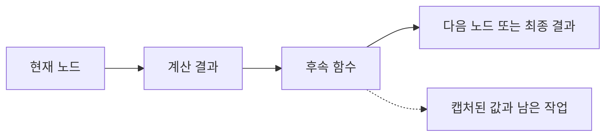

# 57장. Continuation-Passing Style (CPS)

앞 장에서는 재귀 구조와 노드의 의미를 분리했다.
그러나 구조를 잘 분리한 평가기도 깊은 트리에서는 호출 스택을 소진할 수 있다.
이 장은 아직 수행하지 않은 계산을 함수로 표현하여 제어 흐름을 명시하는 방법을 다룬다.

Continuation-Passing Style, 줄여서 CPS의 핵심 질문은 “결과를 어디로 반환할까?”가 아니다.
“이 결과를 얻은 다음 무엇을 해야 하는가?”를 인자로 전달하는 것이다.
후속 계산을 값으로 다루되, 그 사실만으로 비동기 실행이나 스택 안전성이 생기지는 않는다.

일급 함수, 클로저, 재귀, 오류의 값 표현을 선수 지식으로 사용한다.
산술 트리를 직접 평가하는 코드부터 CPS, 트램펄린, 명시적 프레임으로 이어지는 과정을 비교한다.

---

## 1. 개념과 기본 구분

### 연속체는 남은 계산이다

`1 + twice(3)`을 평가한다고 생각하자.
`twice(3)`의 결과를 기다리는 동안 “그 결과에 1을 더한다”는 계산이 남아 있다.
이를 `value => 1 + value`라는 함수로 표현할 수 있다.

```text
현재 계산: twice(3)
남은 계산: value => 1 + value
최종 결과: 남은 계산(6) = 7
```

이 남은 계산을 continuation, 여기서는 후속 계산이라고 부른다.
프로그램 전체의 실행 상태를 항상 완전하게 저장한다는 뜻은 아니다.
이 장의 예제는 필요한 값을 클로저에 보관하는 일반 함수다.

### 직접 스타일의 타입

```text
직접 스타일: A -> B
CPS:        A -> (B -> R) -> R
```

`B`는 현재 계산의 결과 타입이다.
`R`은 그 결과를 받은 이후 계산까지 마친 최종 답의 타입이다.
둘은 같을 필요가 없다.
정수 계산의 결과를 문자열 보고서로 만드는 continuation을 전달할 수 있다.

### 답 타입을 구분한다

```scala
def twiceCps[R](value: Int)(next: Int => R): R =
  next(value * 2)

val number = twiceCps(3)(identity)
val message = twiceCps(3)(n => s"계산 결과: $n")
```

첫 번째 호출의 답 타입은 정수다.
두 번째 호출의 답 타입은 문자열이다.
후속 계산의 타입이 전체 호출의 결과를 결정한다.

### 콜백과의 관계

결과를 받는 함수를 넘긴다는 점에서 콜백과 닮았다.
그러나 콜백을 하나 받는 모든 API가 프로그램 전체를 CPS로 표현한 것은 아니다.
CPS는 각 계산이 자신의 결과를 후속 계산에 전달하는 일관된 표현 방식이다.

콜백이 언제 실행되는지는 별도의 계약이다.
동기적으로 즉시 호출할 수도 있고, 이벤트 루프에 등록할 수도 있다.
CPS라는 이름만 보고 실행 시점이나 스레드를 추정하지 않는다.

---

## 2. 명령형 스타일과 함수형 스타일

### 보이지 않는 스택 프레임

직접 스타일은 언어의 호출 스택이 다음 작업을 기억하게 한다.
아래 덧셈에서는 왼쪽 계산의 결과를 보관하고 오른쪽을 계산한 다음 두 값을 더한다.

```scala
def combine(left: Int, right: Int): Int =
  left + right
```

산술 트리 평가에서는 같은 과정이 노드마다 반복된다.
스택에는 방문해야 할 오른쪽 자식과 먼저 계산한 왼쪽 값이 남는다.
코드가 짧다는 것은 이 상태가 없다는 뜻이 아니다.

### 남은 일을 함수로 꺼낸다

```text
evaluate(left, leftValue =>
  evaluate(right, rightValue =>
    next(leftValue + rightValue)))
```

첫 번째 continuation은 오른쪽 자식과 마지막 `next`를 캡처한다.
두 번째 continuation은 계산한 왼쪽 값과 마지막 `next`를 캡처한다.
이제 “무엇을 기다리는가”를 함수의 환경에서 읽을 수 있다.

### 평가 순서를 보존한다

CPS 변환은 왼쪽과 오른쪽의 계산 순서를 선택해야 한다.
원래 프로그램이 왼쪽부터 평가했다면 같은 순서를 유지한다.
부수효과가 있는 계산에서는 순서 변경이 관찰 가능한 결과를 바꾼다.

```text
왼쪽 계산 -> 왼쪽 결과 보관 -> 오른쪽 계산 -> 결합 -> 다음 계산
```

수학적으로 덧셈이 교환 가능해도 두 피연산자를 계산하는 효과까지 교환 가능한 것은 아니다.
제어 흐름 변환에서는 값과 효과의 순서를 함께 검토한다.

### 무리하게 적용한 예

단순한 `price * quantity`에 continuation을 여러 겹 넣으면 이해하기 어려워진다.
직접 스타일이 충분히 명확한 계산은 그대로 둔다.
후속 작업을 재구성해야 하는 해석기나 실행 엔진에서 CPS의 이점이 드러난다.

---

## 3. 왜 이 개념을 사용하는가?

### 제어 흐름을 조합한다

계산을 끝내고 출력할지, 다른 계산을 수행할지 호출자가 결정할 수 있다.
현재 계산은 결과를 받을 함수를 알고 있을 뿐 최종 사용처를 알 필요가 없다.
일급 함수로 데이터 변환을 조합했던 사고를 제어 흐름으로 확장한다.

### 성공과 실패의 후속 계산

오류 결과도 별도 continuation으로 표현할 수 있다.
성공 경로와 실패 경로 중 어느 쪽을 호출할지는 현재 계산이 결정한다.
다음은 개념을 설명하는 동기적 함수다.

```scala
def divideCps[R](a: Int, b: Int)(ok: Int => R, fail: String => R): R =
  if b == 0 then fail("division by zero")
  else ok(a / b)
```

`Either`는 분기 결과를 데이터로 반환한다.
두 continuation은 각 분기 이후의 행동을 함수로 받는다.
두 표현은 관련되지만 데이터 보관과 제어 실행이라는 차이가 있다.

### 중단과 재개의 설계 재료

후속 계산을 저장하면 나중에 실행하는 구조를 만들 수 있다.
그러나 취소, 자원 해제, 한 번만 호출하기 같은 정책은 직접 정해야 한다.
후속 함수가 두 번 호출되면 그 뒤의 결제나 저장도 두 번 수행될 수 있다.

### 스택 안전성을 분석할 수 있다

후속 작업을 함수나 데이터로 드러내면 호출 스택과 분리하는 방법을 설계할 수 있다.
다음 절에서는 트램펄린으로 각 호출을 작은 단계로 지연한다.
이것은 CPS 자체의 자동 성질이 아니라 추가 실행 모델이다.

---

## 4. Scala에서의 표현

### 세 가지 평가기를 비교한다

아래 코드는 같은 트리를 직접 스타일, CPS, 트램펄린 CPS로 평가한다.
작은 트리에서는 세 결과가 같아야 한다.
깊은 트리는 트램펄린 평가기에만 전달하여 프로세스를 일부러 스택 오류로 종료하지 않는다.

<!-- executable:scala -->
```scala
object Chapter57:
  import scala.util.control.TailCalls.{TailRec, done, tailcall}

  enum Expr:
    case Lit(value: BigInt)
    case Add(left: Expr, right: Expr)
    case Mul(left: Expr, right: Expr)

  def direct(expr: Expr): BigInt = expr match
    case Expr.Lit(value) => value
    case Expr.Add(left, right) => direct(left) + direct(right)
    case Expr.Mul(left, right) => direct(left) * direct(right)

  def cps[R](expr: Expr)(next: BigInt => R): R = expr match
    case Expr.Lit(value) => next(value)
    case Expr.Add(left, right) =>
      cps(left)(a => cps(right)(b => next(a + b)))
    case Expr.Mul(left, right) =>
      cps(left)(a => cps(right)(b => next(a * b)))

  def safe(expr: Expr)(next: BigInt => TailRec[BigInt]): TailRec[BigInt] =
    expr match
      case Expr.Lit(value) => tailcall(next(value))
      case Expr.Add(left, right) =>
        tailcall(safe(left)(a =>
          tailcall(safe(right)(b => tailcall(next(a + b))))))
      case Expr.Mul(left, right) =>
        tailcall(safe(left)(a =>
          tailcall(safe(right)(b => tailcall(next(a * b))))))

  def evaluate(expr: Expr): BigInt = safe(expr)(done(_)).result

  def divideCps[R](a: BigInt, b: BigInt)(ok: BigInt => R, fail: String => R): R =
    if b == 0 then fail("division by zero") else ok(a / b)

  enum Frame:
    case Visit(expr: Expr)
    case AddValues
    case MultiplyValues

  def machine(expr: Expr): BigInt =
    var work: List[Frame] = List(Frame.Visit(expr))
    var values: List[BigInt] = Nil
    while work.nonEmpty do
      val frame = work.head
      work = work.tail
      frame match
        case Frame.Visit(Expr.Lit(value)) => values = value :: values
        case Frame.Visit(Expr.Add(left, right)) =>
          work = Frame.Visit(left) :: Frame.Visit(right) :: Frame.AddValues :: work
        case Frame.Visit(Expr.Mul(left, right)) =>
          work = Frame.Visit(left) :: Frame.Visit(right) :: Frame.MultiplyValues :: work
        case Frame.AddValues =>
          val right = values.head
          val left = values.tail.head
          values = (left + right) :: values.drop(2)
        case Frame.MultiplyValues =>
          val right = values.head
          val left = values.tail.head
          values = (left * right) :: values.drop(2)
    require(values.size == 1)
    values.head

  def check(): Unit =
    import Expr.*
    val examples = List(
      Lit(0),
      Add(Lit(2), Lit(3)),
      Mul(Add(Lit(2), Lit(3)), Lit(4)),
      Add(Mul(Lit(-2), Lit(5)), Lit(3))
    )
    for expr <- examples do
      val expected = direct(expr)
      assert(cps(expr)(identity) == expected)
      assert(evaluate(expr) == expected)
      assert(machine(expr) == expected)
    assert(cps(Add(Lit(2), Lit(3)))(n => s"value=$n") == "value=5")
    assert(divideCps(BigInt(12), BigInt(3))(_.toString, identity) == "4")
    assert(divideCps(BigInt(12), BigInt(0))(_.toString, identity) == "division by zero")
    var deep: Expr = Lit(0)
    for _ <- 1 to 20000 do deep = Add(deep, Lit(1))
    assert(evaluate(deep) == BigInt(20000))
    assert(machine(deep) == BigInt(20000))
```

### 트램펄린의 계약

`done`은 완성된 답을 표현한다.
`tailcall`은 다음 계산을 즉시 호출하지 않고 지연된 단계로 만든다.
`result`가 반복적으로 단계를 해석한다.
이 역할은 Scala 표준 라이브러리의 [TailCalls 문서](https://www.scala-lang.org/api/2.13.16/scala/util/control/TailCalls%24.html)에 설명되어 있다.

### continuation 호출도 지연한다

자식 평가만 지연하고 마지막 `next`를 곧바로 호출하면 긴 continuation 연쇄가 스택을 만들 수 있다.
리터럴 결과를 넘기는 지점과 덧셈 결과를 넘기는 지점도 `tailcall`로 감싼 이유다.
“재귀 호출 하나에 표시를 붙였다”가 아니라 전체 호출 경로를 점검해야 한다.

---

## 5. 상태 변경보다 값 변환

### 클로저도 실행 상태다

CPS는 상태를 없애지 않는다.
반환 주소와 지역 변수로 숨겨진 상태를 함수의 환경으로 옮긴다.
이 때문에 실행 순서를 이해하기 쉬워질 수 있지만 메모리 사용이 사라지지는 않는다.



### 탈함수화

후속 함수의 모양이 유한하게 정해져 있으면 각 모양에 데이터 생성자를 대응시킬 수 있다.
함수 호출 대신 생성자를 분기하는 해석기를 작성한다.
이를 defunctionalization, 탈함수화라고 부른다.

```text
오른쪽을 계산하는 함수 -> Visit(right) 프레임
덧셈 결과를 전달하는 함수 -> AddValues 프레임
곱셈 결과를 전달하는 함수 -> MultiplyValues 프레임
```

앞 절의 `machine`은 같은 평가 순서를 작업 목록과 값 목록으로 나타낸 명시적 실행기다.
CPS 코드를 기계적으로 모두 변환한 구현은 아니지만 남은 작업을 데이터로 만드는 핵심을 보여준다.
작업 목록의 지역 변수 변경은 평가기 내부에 제한된다.

### 프레임의 불변조건

`AddValues`에 도달할 때 값 목록에는 두 피연산자의 결과가 있어야 한다.
외부에서 임의 프레임을 주입하는 인터페이스는 제공하지 않는다.
프레임을 공개하거나 직렬화한다면 잘못된 순서와 손상된 상태를 검사해야 한다.

### 재개 가능한 데이터와 직렬화

일반 클로저를 저장한다고 프로세스 재시작 후 재개할 수 있는 것은 아니다.
파일 핸들, 연결, 함수 포인터를 직렬화할 수 있다는 보장이 없다.
영속적인 작업 재개에는 명시적인 데이터 형식과 버전, 효과의 중복 방지가 필요하다.

---

## 6. 함수 합성과 데이터 흐름

### 계산 순서와 데이터 의존성

CPS의 함수 합성은 앞 단계의 결과를 후속 함수에 전달한다.
중첩은 단순히 오른쪽으로 코드를 밀어 쓰는 기법이 아니다.
어떤 값이 준비되어야 다음 단계가 시작되는지를 명시한다.

### 종료 continuation

최종 값 자체를 얻을 때는 항등 함수를 전달한다.
트램펄린에서는 값을 완료 단계로 바꾸는 `done`을 전달한다.
결과의 표현 방식에 따라 종료 continuation의 타입도 달라진다.

```text
일반 CPS 종료: value => value
문자열 출력값: value => format(value)
트램펄린 종료: value => Done(value)
```

### continuation을 두 번 부르는 경우

다음 구조는 현재 계산 하나에 대해 후속 계산을 두 번 실행한다.
순수한 리스트 탐색에서는 여러 답을 열거하는 설계일 수 있다.
파일 저장 같은 후속 효과에는 중복 실행 위험이다.

```text
next(firstResult)
next(secondResult)
```

콜백 타입 하나만으로 정확히 한 번 호출한다는 성질을 표현하지 못한다.
취소된 작업의 continuation을 다시 실행하지 않도록 실행 상태를 관리해야 할 수도 있다.

### 오류의 데이터 표현과 조합

오류를 여러 단계에 걸쳐 보관하거나 검사해야 한다면 `Either`가 더 명확할 수 있다.
즉시 어느 경로로 제어를 넘길지가 중요하다면 두 continuation이 자연스러울 수 있다.
오류 처리 방식은 추상화의 유명세가 아니라 필요한 관찰과 실행 정책으로 선택한다.

---

## 7. 장점과 트레이드오프

### 장점

남은 계산을 함수로 전달하면 실행 순서가 명시된다.
평가기를 트램펄린이나 명시적 기계로 바꾸는 출발점이 된다.
성공, 실패, 조기 종료 같은 제어 흐름을 같은 함수 전달 관점에서 읽을 수 있다.

### 비용

continuation은 캡처 환경과 함수 호출을 만들 수 있다.
트램펄린은 추가 단계 객체와 해석 루프를 사용한다.
이 예제를 zero-cost abstraction이라고 부르지 않는다.

| 표현 | 제어 상태의 위치 | 깊은 입력 | 주된 비용 |
| --- | --- | --- | --- |
| 직접 재귀 | 호출 스택 | 스택 제한 영향 | 프레임 |
| 일반 CPS | 스택과 클로저 | 여전히 제한 영향 | 프레임과 클로저 |
| 트램펄린 CPS | 지연 단계와 클로저 | 예제에서 스택 안전 | 할당과 해석 |
| 명시적 기계 | 프레임 목록 | 예제에서 스택 안전 | 목록과 분기 |

### 종료는 별도 문제다

스택을 소비하지 않는 무한 반복도 종료하지 않는다.
트리의 크기, 순환 여부, 작업 예산은 별도로 관리한다.
스택 안전성과 전체 프로그램의 자원 안전성을 구분해야 한다.

### 디버깅

일반 스택 추적만으로 논리적 호출 흐름을 읽기 어려워질 수 있다.
실행 단계에 노드 위치나 작업 이름을 보관하면 진단에 도움이 된다.
그 메타데이터 역시 메모리와 유지보수 비용을 가진다.

---

## 8. 상태와 부수효과의 경계

### 자원의 생존 범위

파일을 열어 continuation을 만들고 파일을 닫은 뒤 continuation을 실행하면 문제가 생긴다.
함수가 남았다는 사실은 그 함수가 의존하는 자원이 살아 있다는 보장이 아니다.
실행 기간과 자원 획득·해제 기간을 함께 설계한다.

```text
파일 열기 -> 후속 함수 만들기 -> 파일 닫기 -> 후속 함수 실행
                                        ^ 이미 닫힌 파일 사용 가능
```

### 예외가 통과하는 범위

후속 함수 실행을 나중으로 미루면 현재 호출을 감싼 예외 처리 구문 밖에서 실패할 수 있다.
어느 실행기가 오류를 받는지 명시해야 한다.
성공 continuation만 있는 API에 실패를 숨기지 않는다.

### 비동기와는 다른 축이다

이 장의 트램펄린은 하나의 스레드에서 끝까지 실행한다.
네트워크가 준비될 때까지 자동으로 양보하거나 다른 작업을 예약하지 않는다.
그 기능에는 별도의 스케줄러와 중단 가능한 효과 모델이 필요하다.

### 공정성과 작업 예산

반복 루프가 모든 단계를 처리하면 다른 요청이 오래 기다릴 수 있다.
서버 실행기에서는 일정 단계마다 작업 예산을 확인하는 정책을 고려한다.
그러나 양보 지점을 넣으면 취소와 재개, 자원 정리 계약도 함께 검토해야 한다.

---

## 9. Python에서 적용하기

### Python에서도 후속 계산은 함수다

아래 코드는 재귀를 즉시 실행하는 대신 `Call`을 반환한다.
반복 실행기는 `Done`을 만날 때까지 다음 단계를 꺼낸다.
입력 트리는 불변 데이터로 두고 실행기의 현재 단계만 지역적으로 변경한다.

<!-- executable:python -->
```python
from __future__ import annotations
from dataclasses import dataclass
from typing import Callable, Generic, TypeVar, Union

A = TypeVar("A")
R = TypeVar("R")

@dataclass(frozen=True)
class Lit:
    value: int

@dataclass(frozen=True)
class Add:
    left: Expr
    right: Expr

@dataclass(frozen=True)
class Mul:
    left: Expr
    right: Expr

Expr = Union[Lit, Add, Mul]

@dataclass(frozen=True)
class Done(Generic[A]):
    value: A

@dataclass(frozen=True)
class Call(Generic[A]):
    thunk: Callable[[], Step[A]]

Step = Union[Done[A], Call[A]]

def run(step: Step[A]) -> A:
    while isinstance(step, Call):
        step = step.thunk()
    return step.value

def direct(expr: Expr) -> int:
    match expr:
        case Lit(value):
            return value
        case Add(left, right):
            return direct(left) + direct(right)
        case Mul(left, right):
            return direct(left) * direct(right)
    raise TypeError("unknown expression")

def cps(expr: Expr, next: Callable[[int], R]) -> R:
    match expr:
        case Lit(value):
            return next(value)
        case Add(left, right):
            return cps(left, lambda a: cps(right, lambda b: next(a + b)))
        case Mul(left, right):
            return cps(left, lambda a: cps(right, lambda b: next(a * b)))
    raise TypeError("unknown expression")

def safe(expr: Expr, next: Callable[[int], Step[int]]) -> Step[int]:
    match expr:
        case Lit(value):
            return Call(lambda: next(value))
        case Add(left, right):
            def receive_left(a: int) -> Step[int]:
                def receive_right(b: int) -> Step[int]:
                    return Call(lambda: next(a + b))
                return Call(lambda: safe(right, receive_right))
            return Call(lambda: safe(left, receive_left))
        case Mul(left, right):
            def receive_left(a: int) -> Step[int]:
                def receive_right(b: int) -> Step[int]:
                    return Call(lambda: next(a * b))
                return Call(lambda: safe(right, receive_right))
            return Call(lambda: safe(left, receive_left))
    raise TypeError("unknown expression")

def evaluate(expr: Expr) -> int:
    return run(safe(expr, Done))

examples: tuple[Expr, ...] = (
    Lit(0),
    Add(Lit(2), Lit(3)),
    Mul(Add(Lit(2), Lit(3)), Lit(4)),
    Add(Mul(Lit(-2), Lit(5)), Lit(3)),
)
for example in examples:
    expected = direct(example)
    assert cps(example, lambda value: value) == expected
    assert evaluate(example) == expected

assert cps(Add(Lit(2), Lit(3)), lambda value: f"value={value}") == "value=5"
assert run(Done(7)) == 7
assert run(Call(lambda: Done(9))) == 9

deep: Expr = Lit(0)
for _ in range(20000):
    deep = Add(deep, Lit(1))
assert evaluate(deep) == 20000
```

### 실험의 의미

깊이 20,000인 왼쪽 편향 트리는 한쪽에 재귀가 집중되는 입력이다.
성공은 이 실행 경로가 Python 호출 스택에 깊이만큼 프레임을 쌓지 않았음을 보여준다.
모든 형태의 프로그램에서 무제한 자원을 보장한다는 뜻은 아니다.

### 변환의 범위를 좁힌다

일반 업무 코드를 전부 트램펄린으로 바꿀 필요는 없다.
깊은 트리 해석, 명시적인 탐색 엔진처럼 이유가 분명한 부분에 국한한다.
일반 반복문으로 해결되는 누적 계산에는 반복문이 더 단순할 수 있다.

---

## 10. Python의 표현 한계

### 꼬리 위치와 최적화

함수가 마지막 동작으로 다른 함수를 호출해도 Python이 그 호출 프레임을 제거한다고 가정하지
않는다.
재귀 제한을 높이는 것은 이 장의 실행 모델과 다른 조치다.
예제는 제한값 변경 없이 반복 실행기로 진행한다.
Python의 [재귀 제한 문서](https://docs.python.org/3/library/sys.html#sys.getrecursionlimit)는 이 제한이 인터프리터 스택을 보호함을 설명한다.

### 함수 타입은 호출 횟수를 증명하지 않는다

`Callable[[A], R]`은 입력과 출력의 형태를 설명한다.
호출이 정확히 한 번인지, 호출 전에 취소할 수 있는지, 자원을 캡처했는지는 표현하지 않는다.
프로토콜 문서와 실행기 테스트가 필요하다.

### 임의 continuation의 캡처가 아니다

일반 Python 함수 인자는 현재 프로그램의 전체 실행 문맥을 자동으로 캡처하지 않는다.
이 장의 CPS는 개발자가 필요한 후속 계산을 직접 구성한 것이다.
`call/cc` 같은 언어 기능과 동일한 지원을 제공한다고 설명해서는 안 된다.

### 타입 검사와 실행 검사는 다르다

본문 예제의 실행 검사는 실제 값과 결과를 확인한다.
타입 주석의 모든 성질을 정적 타입 검사기로 확인했다는 뜻은 아니다.
프로젝트에 도입할 때는 사용하는 검사기의 지원 범위를 별도로 검증한다.

---

## 11. 핵심 정리

### 이 장에서 얻은 기준

CPS는 후속 계산을 함수 인자로 드러내는 표현 방식이다.
현재 계산의 결과 타입과 전체 답 타입을 구분한다.
스택 안전성을 원하면 후속 함수 호출까지 포함하여 지연 단계나 명시적 기계로 바꾼다.

### 연습 1: 결과를 보고서로 바꾸기

트리의 정수 결과를 `result=20` 형태로 만드는 continuation을 작성하라.
평가기 내부에서 문자열을 만들지 않아야 한다.

해설: `cps(tree)(n => s"result=$n")`처럼 최종 소비자를 전달한다.
Python에서는 두 번째 인자로 포맷 함수를 전달한다.
평가기는 여전히 정수 계산만 수행한다.

### 연습 2: 순서 추적

리터럴 방문을 리스트에 기록하는 평가기를 가정하자.
왼쪽과 오른쪽 continuation의 순서를 바꾸면 무엇이 변하는가?

해설: 최종 정수 결과가 같아도 기록 순서는 달라질 수 있다.
효과를 포함한 관찰 기준에서는 같은 프로그램이 아니다.
순수한 값 계산의 대수적 법칙을 효과의 교환 법칙으로 확대하지 않는다.

### 연습 3: 지연 누락 찾기

`Lit` 분기에서 `Call(lambda: next(value))`를 `next(value)`로 바꾸면 안전한가?

해설: 이 한 줄만으로 항상 실패한다고 단정할 수는 없지만 실행 경로를 다시 분석해야 한다.
다른 continuation이 즉시 다음 continuation을 호출한다면 연쇄가 스택에 쌓일 수 있다.
모든 경계에서 지연한다는 현재 구현의 간단한 불변조건을 유지하는 편이 검토하기 쉽다.

### 연습 4: 명시적 프레임 확장

뺄셈 노드를 추가하고 직접 평가기, CPS, 트램펄린, 명시적 기계를 같은 테스트로 비교하라.

해설: 프레임 기계에서 오른쪽 결과가 값 목록의 맨 앞이라는 순서를 주의한다.
뺄셈은 덧셈과 달리 피연산자 순서 오류가 결과에 드러난다.
`7 - 2 = 5`와 `2 - 7 = -5`를 모두 검사한다.

### 다음 장으로

이 장은 남은 제어 흐름을 합성 가능한 값으로 표현했다.
다음 장의 Lens는 중첩 데이터의 접근과 갱신 경로를 합성 가능한 값으로 표현한다.
함수를 값으로 다룬다는 공통점은 있지만 CPS는 제어, Lens는 데이터의 초점이라는 차이가 있다.
