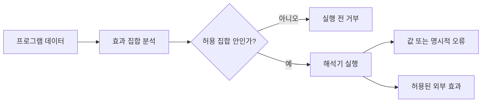

# 61장. Effect Systems


함수의 반환 타입이 `Int`라는 사실만으로 그 함수가 숫자만 계산한다고 결론 내릴 수 없다.
파일을 읽거나 로그를 출력하거나 실패한 뒤에도 정수 타입의 인터페이스를 가질 수 있다.
효과 시스템은 결과값의 타입과 함께 계산이 수행할 수 있는 동작을 추적하는 방법을 다룬다.

이 장은 언어 차원의 정적 효과 검사, `IO[A]` 같은 라이브러리 기반 효과 표현, 필요한 객체를 넘기는
능력 기반 설계를 구분한다.
이들은 관련되지만 같은 범위의 보장을 주지 않는다.
효과를 명시한다는 말이 무엇을 의미하는지 확인하는 것이 목표다.

실행 예제는 환경 읽기와 로그, 명시적인 실패만 있는 작은 정수 언어다.
그 언어의 효과를 계산하고 허용된 효과만 실행하게 한다.
일반 Scala나 Python 함수 전체를 검사하는 도구를 구현했다고 주장하지 않는다.

---

## 1. 개념과 기본 구분

### 값 타입과 계산 효과

값 타입은 계산이 성공했을 때 어떤 값을 제공하는지 설명한다.
효과는 계산 중 어떤 종류의 동작이 가능하다고 정적으로 추정하는지 설명한다.
두 정보는 서로 다른 질문에 답한다.

```text
결과 타입: Int
가능한 효과: 환경 읽기, 로그 출력, 명시적 실패
```

가능한 효과의 집합은 실제 실행에서 반드시 발생하는 동작 목록이 아니다.
조건 분기 때문에 어떤 효과는 실행되지 않을 수 있다.
보수적인 분석은 실행 가능성을 넓게 포함한다.

### 효과 표기의 개념

```text
A -{ReadEnv, Log}-> B
```

이 표기는 설명을 위한 수학적 표기이며 Scala나 Python의 일반 문법이 아니다.
입력 A를 받아 결과 B를 만들면서 표시된 효과를 사용할 수 있다는 뜻으로 읽는다.
실제 언어의 문법과 효과 의미는 해당 언어의 정의를 따라야 한다.

### 상한과 실제 흔적

정적 효과 집합은 어떤 종류의 동작이 가능한지 나타내는 상한이다.
실제 실행 로그는 이번 실행에서 일어난 순서와 횟수를 기록한다.
단순한 집합에는 호출 횟수, 정확한 파일 이름, 실행 순서가 들어 있지 않다.

| 층 | 예 | 보장 범위를 판단할 질문 |
| --- | --- | --- |
| 언어의 효과 검사 | 함수 효과 추론 | 어떤 문법과 외부 호출을 검사하는가? |
| 효과 라이브러리 | IO, Reader, State | 어떤 경로로 효과를 표현하게 하는가? |
| 능력 기반 API | 환경·로그 객체 인자 | 다른 전역 접근 경로를 차단했는가? |

라이브러리 타입이 존재한다고 언어의 모든 숨은 효과가 자동 추적되는 것은 아니다.
능력 객체를 인자로 받지 않는 함수도 전역 API에 접근할 수 있는 언어가 있다.
계약의 경계를 정확하게 명시해야 한다.

---

## 2. 명령형 스타일과 함수형 스타일

### 숨은 의존성

```text
calculateTotal() 내부:
    전역 설정 읽기
    현재 시간 읽기
    로그 출력
    정수 반환
```

호출자는 반환 타입만 보고 실제 실행 요구를 알기 어렵다.
테스트에서는 전역 설정과 시간, 로그까지 통제해야 한다.
효과를 명시하면 어떤 실행 환경을 제공해야 하는지 드러난다.

### 입력값으로 옮기기

설정값을 먼저 읽어 순수 계산에 전달하면 핵심 계산의 환경 읽기를 제거할 수 있다.
이것은 Dependency Rejection과 Functional Core, Imperative Shell에서 다룬 설계다.
효과 타입을 추가하기 전에 계산과 실행을 나누는 것만으로도 복잡성이 줄어들 수 있다.

### 연산을 데이터로 표현하기

```text
Read("base") + Emit("fee", Lit(2))
```

데이터로 된 프로그램에는 사용할 수 있는 연산 생성자가 정해져 있다.
검사기는 각 생성자의 효과를 조합할 수 있다.
임의의 호스트 언어 함수를 허용하지 않으면 검사의 범위를 닫힌 문법으로 제한할 수 있다.

### 효과 객체만 감싸는 경우

임의 함수를 저장하는 `Task(() => value)`에는 그 함수가 수행할 효과를 검사하는 정보가 없을 수
있다.
호출을 늦추는 기능과 정적 효과 분석은 별개다.
IO 장의 지연 실행을 언어 전체의 순수성 검사로 확대하지 않는다.

### 직접 스타일도 검사할 수 있다

효과 시스템이 반드시 모든 코드를 모나드의 `flatMap`으로 쓰게 하는 것은 아니다.
언어에 따라 직접 스타일의 호출에서 효과를 추론할 수 있다.
표면 문법과 정적 분석 규칙, 실행 모델을 서로 다른 층으로 비교한다.

---

## 3. 왜 이 개념을 사용하는가?

### 실행 요구를 드러낸다

어떤 프로그램이 환경 읽기나 로그 출력을 요구하는지 실행 전에 볼 수 있다.
허용되지 않은 연산이 있으면 실행을 시작하기 전에 거부할 수 있다.
테스트 실행기와 실제 실행기가 같은 문법을 서로 다르게 해석할 수 있다.

### 합성에서 효과를 추적한다

두 계산을 연결하면 둘의 가능한 효과를 함께 고려한다.
단순한 집합 모델에서는 합집합으로 표현한다.
실제 언어는 순서, 영역, 오류 타입 등 더 많은 정보를 추적할 수 있다.

### 처리된 효과를 구분한다

환경 읽기를 고정된 메모리 값으로 처리하거나 로그 요청을 버리는 handler를 생각할 수 있다.
이때 바깥쪽에 노출되는 효과가 줄어들 수 있다.
단, handler 자체가 새 효과를 수행하면 그 효과는 다시 포함해야 한다.

### 효과 다형성

`map` 같은 함수는 전달받은 함수의 효과를 보존하여 일반화할 수 있다.
모든 고차 함수에 효과를 한 종류로 고정하면 재사용성이 줄어든다.
효과 변수나 타입 생성자 매개변수는 이런 일반화를 위한 서로 다른 도구다.

### 무엇을 못 보장하는가

효과 목록만으로 프로그램의 종료, 성능, 자원 해제, 업무상 권한을 모두 증명하지는 않는다.
메모리 부족이나 외부 프로세스 종료처럼 모델 밖의 실패도 있다.
추적하는 효과의 의미를 정하는 것이 보장의 출발점이다.

---

## 4. Scala에서의 표현

### 닫힌 정수 언어의 검사기

아래 문법의 모든 계산 결과는 정수 또는 명시적인 오류다.
환경 읽기는 키 부재로 실패할 수 있으므로 두 효과를 가진다.
검사기는 실행 전 효과 집합을 계산하고 허용 집합과 비교한다.

<!-- executable:scala -->
```scala
object Chapter61:
  enum Effect:
    case ReadEnv, Log, Fail

  enum Expr:
    case Lit(value: BigInt)
    case Add(left: Expr, right: Expr)
    case Read(key: String)
    case Emit(message: String, body: Expr)
    case Provide(bindings: Map[String, BigInt], body: Expr)
    case Silence(body: Expr)
    case Recover(body: Expr, fallback: Expr)

  def effects(expr: Expr): Set[Effect] = expr match
    case Expr.Lit(_) => Set.empty
    case Expr.Add(left, right) => effects(left) ++ effects(right)
    case Expr.Read(_) => Set(Effect.ReadEnv, Effect.Fail)
    case Expr.Emit(_, body) => effects(body) + Effect.Log
    case Expr.Provide(_, body) => effects(body) - Effect.ReadEnv
    case Expr.Silence(body) => effects(body) - Effect.Log
    case Expr.Recover(body, fallback) => (effects(body) - Effect.Fail) ++ effects(fallback)

  private def evaluate(expr: Expr, env: Map[String, BigInt], sink: String => Unit): Either[String, BigInt] =
    expr match
      case Expr.Lit(value) => Right(value)
      case Expr.Add(left, right) =>
        for
          a <- evaluate(left, env, sink)
          b <- evaluate(right, env, sink)
        yield a + b
      case Expr.Read(key) => env.get(key).toRight(s"missing key: $key")
      case Expr.Emit(message, body) =>
        sink(message)
        evaluate(body, env, sink)
      case Expr.Provide(bindings, body) => evaluate(body, bindings, sink)
      case Expr.Silence(body) => evaluate(body, env, _ => ())
      case Expr.Recover(body, fallback) =>
        evaluate(body, env, sink) match
          case success @ Right(_) => success
          case Left(_) => evaluate(fallback, env, sink)

  def runChecked(expr: Expr, allowed: Set[Effect], env: Map[String, BigInt], sink: String => Unit): Either[String, BigInt] =
    val forbidden = effects(expr) -- allowed
    if forbidden.nonEmpty then Left("forbidden effects: " + forbidden.toList.map(_.toString).sorted.mkString(","))
    else evaluate(expr, env, sink)

  def check(): Unit =
    import Expr.*
    import Effect.*
    val events = scala.collection.mutable.ArrayBuffer.empty[String]
    val sink: String => Unit = message => { events += message; () }
    val program = Add(Read("base"), Emit("fee", Lit(2)))
    assert(effects(program) == Set(ReadEnv, Log, Fail))
    assert(runChecked(program, Set.empty, Map("base" -> BigInt(10)), sink).isLeft)
    assert(events.isEmpty)
    assert(runChecked(program, Set(ReadEnv, Log, Fail), Map("base" -> BigInt(10)), sink) == Right(BigInt(12)))
    assert(events.toVector == Vector("fee"))
    val supplied = Provide(Map("base" -> BigInt(10)), program)
    assert(effects(supplied) == Set(Log, Fail))
    val closed = Silence(Recover(supplied, Lit(0)))
    assert(effects(closed).isEmpty)
    events.clear()
    assert(runChecked(closed, Set.empty, Map.empty, sink) == Right(BigInt(12)))
    assert(events.isEmpty)
    val missing = Silence(Recover(Provide(Map.empty, program), Lit(99)))
    assert(runChecked(missing, Set.empty, Map.empty, sink) == Right(BigInt(99)))
    assert(runChecked(Provide(Map.empty, Read("x")), Set(Fail), Map("x" -> BigInt(7)), sink).isLeft)
    val conservative = Recover(Lit(1), Read("unused"))
    assert(effects(conservative) == Set(ReadEnv, Fail))
    assert(runChecked(conservative, Set.empty, Map.empty, sink).isLeft)
    val handledLog = Silence(Emit("hidden", Lit(3)))
    assert(runChecked(handledLog, Set.empty, Map.empty, sink) == Right(BigInt(3)))
    assert(events.isEmpty)
```

### Provide의 정확한 의미

`Provide`는 바깥 환경에 일부 키를 덧붙이는 것이 아니라 환경 전체를 교체한다.
외부 환경에 우연히 같은 키가 있어도 새 환경에 없으면 실패한다.
이 계약 때문에 바깥 환경 읽기 효과를 제거할 수 있다.

### 보수적인 실패 효과

고정된 환경에 키가 있는지 정적으로 추가 분석하지 않으므로 `Provide` 뒤에도 Fail이 남을 수 있다.
`Recover`가 그 명시적인 실패를 처리하면 바깥 실패 효과를 제거한다.
정확도와 구현 복잡도의 트레이드오프가 있다.

### 실제 Scala의 효과 관련 기능

Scala의 [Capture Checking 문서](https://docs.scala-lang.org/scala3/reference/experimental/cc.html)는 값이 보관하는 능력 참조를 타입으로 추적하는 실험적 기능을 설명한다.
이 책의 실행 예제는 그 기능을 활성화하지 않은 일반 Scala 코드다.
문법과 안정성은 변경될 수 있으므로 사용하려는 컴파일러 버전의 문서를 따로 확인해야 한다.

---

## 5. 상태 변경보다 값 변환

### 효과를 제거한다는 말

`Silence`는 로그 요청을 받은 뒤 아무 외부 출력도 하지 않는다.
해당 로그 요청의 외부 효과를 내부에서 처리한 것이다.
로그를 파일로 전달하는 handler라면 파일 쓰기 효과가 새로 남아야 한다.



### 상태 전환도 효과 모델에 따라 다르다

지역 변수로 값을 누적하는 것과 외부에서 관찰되는 상태 변경을 같은 효과로 볼 필요는 없다.
모델이 무엇을 관찰하는지 먼저 정의한다.
이 예제는 해석기의 내부 변수와 메모리 할당까지 효과 집합에 넣지 않는다.

### 값으로 받은 환경

`Provide`의 bindings는 이미 만들어진 불변 맵이다.
그 맵을 파일에서 읽어 만드는 과정은 이 AST 바깥의 계산이다.
프로그램 데이터가 순수해 보여도 그 데이터를 준비한 외곽 효과를 별도로 추적해야 한다.

### 실패 결과의 범위

`Fail`은 DSL의 키 부재처럼 `Left`로 표현한 실패를 가리킨다.
호스트 언어의 모든 예외, 프로세스 종료, 메모리 부족을 포괄하지 않는다.
검사기가 다루는 오류 모델을 문서화하지 않으면 보장을 과대해석하게 된다.

---

## 6. 함수 합성과 데이터 흐름

### 효과의 합집합

덧셈은 왼쪽과 오른쪽의 효과를 모두 포함한다.
오른쪽이 실제로 실행되지 않을 수 있어도 가능한 효과의 상한에는 남는다.
이 모델은 경로에 민감한 정밀 분석보다 단순하고 보수적인 분석을 택한다.

### 처리된 효과와 handler 효과

```text
바깥 효과 = 처리되지 않은 내부 효과 + handler가 수행하는 효과
```

예제의 Silence handler는 외부 로그를 발생시키지 않으므로 Log를 제거한다.
Recover의 fallback은 실행될 수 있으므로 그 효과를 다시 합친다.
효과 이름을 집합에서 삭제하는 것만으로 안전한 handler가 되는 것은 아니다.

### 효과의 약화

아무 효과가 없는 계산은 로그가 허용된 곳에서도 실행할 수 있다.
허용 집합이 실제 필요 집합을 포함하면 실행을 허용하는 것이 이 검사기의 규칙이다.
이런 포함 관계와 정확히 같은 효과 집합을 요구하는 규칙을 구분한다.

### 고차 함수와 숨은 효과

임의 `Int => Int`를 AST 노드로 추가하면 그 함수의 내부 효과를 이 검사기가 알 수 없다.
함께 제공한 효과 표기를 믿으면 거짓 표기가 가능하다.
검사를 유지하려면 함수 표현까지 언어에 포함하거나 신뢰 경계를 분명히 해야 한다.

### 효과 다형성의 다른 표현

Koka의 [언어 문서](https://koka-lang.github.io/koka/doc/book.html)는 효과를 함수 타입과 함께 추론하고 효과 다형성 및 handler를 다룬다.
`F[_]`를 받는 Scala 라이브러리 설계와 효과 행을 추적하는 언어 설계는 같은 문법적 장치가 아니다.
어떤 정보를 타입에 넣고 어느 단계에서 검사하는지 비교해야 한다.

---

## 7. 장점과 트레이드오프

### 장점

실행 요구를 명시하고 허용되지 않은 계산을 일찍 발견할 수 있다.
효과 경계가 드러나면 테스트 해석기를 작성하기 쉬워진다.
고차 함수와 handler를 통한 합성에서도 효과의 흐름을 추적할 수 있다.

### 보수성의 비용

실제로 실행되지 않는 분기의 효과 때문에 프로그램이 거부될 수 있다.
예제의 `Recover(Lit(1), Read("unused"))`가 그렇다.
정밀 분석을 추가할 수 있지만 구현과 추론 비용도 커진다.

### API 전파

함수 하나에 새로운 효과가 생기면 호출자와 상위 인터페이스에도 변경이 전파될 수 있다.
이 전파는 숨은 의존성을 드러내는 장점이면서 유지보수 비용이다.
무작정 모든 효과를 넓은 하나의 타입으로 합치면 정밀도를 잃는다.

| 관점 | 얻는 정보 | 남는 문제 |
| --- | --- | --- |
| 결과 타입 | 값의 형태 | 숨은 실행 동작 |
| 효과 집합 | 가능한 동작 종류 | 순서·횟수·자원 예산 |
| 능력 매개변수 | 사용할 인터페이스 | 전역 우회·수명 |
| 실행 테스트 | 관찰한 실행 결과 | 미실행 경로 |
| 정형 증명 | 정의한 모델의 성질 | 모델과 구현의 연결 |

### 성능 보장과는 다르다

효과 정보가 정적 메타데이터로 소거되는 설계도 가능하다.
하지만 이 장의 검사기는 실제 AST를 순회하고 집합을 구성한다.
이 구현의 분석 비용이 자동으로 0이 된다고 설명하지 않는다.

### 명시성과 사용성

매 함수마다 긴 효과 목록을 쓰게 하면 인터페이스가 부담스러워질 수 있다.
추론과 효과 다형성은 표기의 반복을 줄이는 방법이다.
간결한 문법을 얻기 위해 검사 범위를 모호하게 만드는 것과는 구분해야 한다.

---

## 8. 상태와 부수효과의 경계

### 검사기가 신뢰하는 영역

AST 생성자와 효과 분석 함수, 해석기 구현을 신뢰한다.
`Read`의 해석기가 몰래 파일을 쓰면 분석과 실행의 대응이 깨진다.
효과 시스템의 건전성은 규칙과 실행 의미 사이의 관계에 대한 주장이다.

### 간단한 건전성 논증의 구조

리터럴은 외부 효과가 없다.
덧셈은 하위 식의 효과를 합친 범위를 벗어나지 않는다.
읽기와 출력 노드는 각각 선언된 효과를 발생시킨다.
handler는 해당 효과를 외부에 전달하지 않는다는 구현 계약을 만족해야 한다.

이 과정을 문법의 각 생성자에 대해 귀납적으로 검토할 수 있다.
본문은 논증의 구조를 설명하며 기계 검증된 증명을 제공하는 것은 아니다.
호스트 콜백이나 새 생성자를 추가하면 논증도 갱신해야 한다.

### 보안 샌드박스가 아니다

교육용 Python AST 검사기는 운영체제 수준 권한을 제한하지 않는다.
같은 프로세스에서 임의 Python 코드를 실행할 권한이 있으면 다른 API를 직접 호출할 수 있다.
허용 효과 목록과 운영체제 격리 경계를 동일시하지 않는다.

### 자원 수명

능력 객체를 함수에 넘겼더라도 나중에 실행되는 클로저가 이를 보관할 수 있다.
파일을 닫은 뒤 그 클로저를 실행하는 문제는 수명 추적이나 구조화된 자원 관리가 필요하다.
CPS, 비동기 효과, capture checking의 논의가 이 지점에서 만난다.

### 외부 구현의 실패

로그 함수가 예외를 던지거나 종료하지 않는 상황은 이 작은 언어의 Fail에 포함하지 않는다.
외부 구현을 연결할 때는 그 실패를 모델에 넣거나 신뢰하는 전제로 명시한다.
단순한 집합 검사만으로 외부 코드의 행위를 검증했다고 말하지 않는다.

---

## 9. Python에서 적용하기

### Python에서 같은 작은 언어를 검사한다

Python 구현도 임의 함수를 프로그램 노드로 받지 않는다.
닫힌 데이터 생성자만 분석하고 해석한다.
결과값과 명시적 실패를 별도 데이터로 구분한다.

<!-- executable:python -->
```python
from __future__ import annotations
from dataclasses import dataclass
from enum import Enum, auto
from typing import Callable, Mapping, Union

class Effect(Enum):
    READ_ENV = auto()
    LOG = auto()
    FAIL = auto()

@dataclass(frozen=True)
class Lit:
    value: int

@dataclass(frozen=True)
class Add:
    left: Expr
    right: Expr

@dataclass(frozen=True)
class Read:
    key: str

@dataclass(frozen=True)
class Emit:
    message: str
    body: Expr

@dataclass(frozen=True)
class Provide:
    bindings: tuple[tuple[str, int], ...]
    body: Expr

@dataclass(frozen=True)
class Silence:
    body: Expr

@dataclass(frozen=True)
class Recover:
    body: Expr
    fallback: Expr

Expr = Union[Lit, Add, Read, Emit, Provide, Silence, Recover]

@dataclass(frozen=True)
class Ok:
    value: int

@dataclass(frozen=True)
class Error:
    message: str

Result = Union[Ok, Error]

def effects(expr: Expr) -> frozenset[Effect]:
    match expr:
        case Lit():
            return frozenset()
        case Add(left, right):
            return effects(left) | effects(right)
        case Read():
            return frozenset((Effect.READ_ENV, Effect.FAIL))
        case Emit(_, body):
            return effects(body) | {Effect.LOG}
        case Provide(_, body):
            return effects(body) - {Effect.READ_ENV}
        case Silence(body):
            return effects(body) - {Effect.LOG}
        case Recover(body, fallback):
            return (effects(body) - {Effect.FAIL}) | effects(fallback)
    raise TypeError("unknown expression")

def _evaluate(expr: Expr, env: Mapping[str, int], sink: Callable[[str], None]) -> Result:
    match expr:
        case Lit(value):
            return Ok(value)
        case Add(left, right):
            first = _evaluate(left, env, sink)
            if isinstance(first, Error):
                return first
            second = _evaluate(right, env, sink)
            return second if isinstance(second, Error) else Ok(first.value + second.value)
        case Read(key):
            return Ok(env[key]) if key in env else Error(f"missing key: {key}")
        case Emit(message, body):
            sink(message)
            return _evaluate(body, env, sink)
        case Provide(bindings, body):
            return _evaluate(body, dict(bindings), sink)
        case Silence(body):
            return _evaluate(body, env, lambda _: None)
        case Recover(body, fallback):
            result = _evaluate(body, env, sink)
            return _evaluate(fallback, env, sink) if isinstance(result, Error) else result
    raise TypeError("unknown expression")

def run_checked(expr: Expr, allowed: frozenset[Effect], env: Mapping[str, int], sink: Callable[[str], None]) -> Result:
    forbidden = effects(expr) - allowed
    if forbidden:
        return Error("forbidden effects: " + ",".join(sorted(effect.name for effect in forbidden)))
    return _evaluate(expr, env, sink)

program = Add(Read("base"), Emit("fee", Lit(2)))
all_effects = frozenset(Effect)
none = frozenset()
events: list[str] = []
assert effects(program) == all_effects
assert isinstance(run_checked(program, none, {"base": 10}, events.append), Error)
assert events == []
assert run_checked(program, all_effects, {"base": 10}, events.append) == Ok(12)
assert events == ["fee"]

supplied = Provide((("base", 10),), program)
assert effects(supplied) == frozenset((Effect.LOG, Effect.FAIL))
closed = Silence(Recover(supplied, Lit(0)))
assert effects(closed) == none
events.clear()
assert run_checked(closed, none, {}, events.append) == Ok(12)
assert events == []
missing = Silence(Recover(Provide((), program), Lit(99)))
assert run_checked(missing, none, {}, events.append) == Ok(99)
assert isinstance(run_checked(Provide((), Read("x")), frozenset((Effect.FAIL,)), {"x": 7}, events.append), Error)
conservative = Recover(Lit(1), Read("unused"))
assert effects(conservative) == frozenset((Effect.READ_ENV, Effect.FAIL))
assert isinstance(run_checked(conservative, none, {}, events.append), Error)
```

### 불변 입력의 범위

Python의 `Provide`는 바인딩을 튜플로 보관한다.
실행 중 지역 사전을 만들어 환경으로 사용하며 원래 튜플을 변경하지 않는다.
키가 중복되면 사전 생성 규칙에 따라 마지막 바인딩이 사용되므로 외부 파서에서 중복을 거부하는
정책을 추가할 수 있다.

### 분석기의 종료와 입력 크기

분석기와 해석기는 문법 트리를 재귀적으로 방문한다.
깊이가 큰 외부 입력은 재귀 제한과 자원 예산을 고려해야 한다.
CPS 장의 명시적 스택 기법을 적용하거나 입력 깊이를 제한하는 별도 설계가 필요하다.

---

## 10. Python의 표현 한계

### 타입 힌트는 런타임 효과 검사가 아니다

Python의 [typing 공식 문서](https://docs.python.org/3/library/typing.html)는 타입 주석을 런타임에서 자동 강제하지 않는다는 점을 설명한다.
`Callable[[int], int]` 안에서 파일을 쓰는 동작을 이 주석이 막아 주지는 않는다.
본문의 검사는 Python 타입 검사기가 아니라 직접 만든 AST 분석기가 수행한다.

### Protocol로 능력을 설명할 수 있다

로그 인터페이스나 환경 조회 인터페이스를 Protocol로 표현하면 필요한 메서드를 설명할 수 있다.
그러나 그 객체를 가진 함수만 전역 로그 API를 호출할 수 있게 제한하는 기능은 아니다.
의존성의 명시와 효과의 완전한 추적을 구분한다.

### 런타임 검사의 한계

함수에 장식자를 붙여 실행 중 호출을 기록하는 방법은 실제 실행 경로를 관찰한다.
실행하지 않은 경로의 효과까지 정적으로 증명하는 것은 아니다.
외부 C 확장이나 시스템 호출의 관찰 범위도 별도로 정해야 한다.

### 거짓 표기를 막는 범위

개발자가 임의 함수와 함께 `effects=set()`을 넘길 수 있다면 검사기는 그 말을 믿게 된다.
본문은 그런 노드를 제공하지 않고 정해진 생성자만 사용한다.
호스트 언어에 대한 보안 경계가 아니라 DSL 내부의 계약이다.

### 소거와 실행 비용

정적 효과 추론을 갖춘 언어와 달리 Python 예제는 실행 전에 실제로 집합을 계산한다.
반복 실행에서는 AST가 불변이라는 전제 아래 분석 결과를 캐시할 수 있다.
캐시 역시 입력과 분석 규칙의 버전에 맞게 무효화되어야 한다.

---

## 11. 핵심 정리

### 핵심 판단

효과 시스템을 평가할 때는 무엇을 추적하고 어떤 코드를 신뢰하는지 먼저 확인한다.
효과 타입, 라이브러리의 지연 계산, 능력 전달은 서로 다른 층의 도구다.
handler는 효과를 단순히 숨기는 것이 아니라 정해진 의미로 처리해야 한다.

### 연습 1: handler의 새 효과

로그 요청을 문자열 목록에 모으는 대신 파일에 쓰는 handler로 바꾼다.
바깥 효과에서 Log만 제거하면 충분한가?

해설: 파일 쓰기를 모델에 포함한다면 그 효과를 바깥에 추가해야 한다.
효과 이름을 지우는 행위와 외부 동작을 제거하는 행위는 다르다.
handler의 의미를 먼저 정의하고 분석 규칙을 맞춘다.

### 연습 2: 환경 합치기의 문제

`Provide`를 바깥 환경과 합치는 방식으로 바꾸면서 ReadEnv 제거 규칙을 유지한다.
어떤 입력으로 문제가 드러나는가?

해설: 제공한 바인딩에는 없지만 바깥 환경에는 있는 키를 읽어 본다.
실제 결과가 바깥 환경에 의존하는데 분석은 그 의존성을 제거한 상태가 된다.
환경 전체 교체와 부분 확장을 서로 다른 문법이나 효과 규칙으로 구분한다.

### 연습 3: 호스트 함수 추가

`Native(() => Int)` 생성자를 추가하고 효과 집합을 비어 있다고 정한다.
왜 기존 논증을 그대로 사용할 수 없는가?

해설: 저장된 함수는 외부 상태를 변경하거나 임의 API를 호출할 수 있다.
분석기가 그 동작을 검사하지 않으므로 실행과 효과 상한의 대응이 깨진다.
신뢰된 기본 연산만 허용하거나 호스트 함수의 검증 방식이 추가되어야 한다.

### 연습 4: 보수성 개선

`Recover(Lit(1), Read("unused"))`에서 불필요한 효과를 없애려면 어떻게 할 수 있는가?

해설: 앞 계산이 명시적 실패를 하지 않는다는 사실을 이용해 fallback 효과를 제외하는 규칙을 생각할
수 있다.
그러나 규칙이 정확한지는 새로운 문법과 실패 모델 전체에 대해 검토해야 한다.
정밀도 향상은 검사기와 증명 의무를 함께 바꾼다.

### 다음 장으로

이 장은 계산의 결과뿐 아니라 실행 가능한 동작의 범위를 구분했다.
마지막 장은 시간에 따라 변하는 값과 사건을 합성하고 그 결과를 외부 UI나 시스템에 연결한다.
값의 모델, 계산 순서, 효과 경계를 함께 설계한다는 책 전체의 관점을 다시 적용한다.
