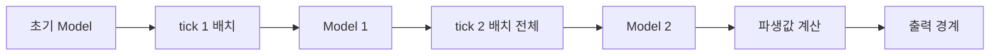

# 62장. Functional Reactive Programming (FRP)

이 책은 값을 계산하는 표현식에서 시작해 함수, 데이터, 오류, 효과를 조합하는 방법을 살펴보았다.
마지막 장에서는 시간에 따라 변하는 값과 사건도 같은 관점에서 다룬다.
수량과 단가가 바뀔 때마다 표시 금액을 어떻게 일관되게 계산할 것인가?

Functional Reactive Programming, FRP는 변화하는 값과 사건의 관계를 선언적으로 표현하는 접근이다.
여기서 핵심은 콜백을 많이 쓰는 것이 아니라 시간에 대한 의미를 가진 계산을 합성하는 것이다.
시간의 의미, 동시에 일어난 변경의 경계, 외부 효과의 실행 위치를 함께 설계한다.

이 장의 실행 예제는 정수 시각의 유한한 이벤트 기록과 구간별 상수 Behavior를 사용한다.
연속 시간을 완전히 구현한 FRP 엔진이나 실시간 네트워크 런타임은 아니다.
작은 결정적 모델로 의미를 확인한 뒤 실제 시스템에서 추가할 책임을 구분한다.

---

## 1. 개념과 기본 구분

### Behavior와 Event

Behavior는 시간에 따라 달라지는 값을 나타낸다.
개념적으로 특정 시각을 넣으면 그 시각의 값을 얻는 함수로 볼 수 있다.
Event는 특정 시각에 발생한 사건과 그 사건이 가진 정보를 나타낸다.

```text
Behavior[A]: Time -> A
Event[A]:    시간에 붙은 A의 발생들
```

현재 온도는 변화하는 값으로 볼 수 있다.
버튼을 누른 순간은 사건으로 볼 수 있다.
사건이 없다고 현재 값까지 없어지는 것은 아니다.

### 연속 모델과 이산 구현

원래 FRP 연구는 시간에 따라 변하는 값과 사건에 의미를 부여한다.
[Functional Reactive Animation의 저자 소개 페이지](https://conal.net/papers/icfp97/)는 Behavior와 Event를 중심 개념으로 설명한다.
이 장은 실수 시간의 애니메이션 의미론 전체를 구현하지 않고 이산적인 학습 모델로 제한한다.

### 초기값이 필요한 이유

첫 수량 변경 사건 이전에도 화면에는 수량이 표시되어야 한다.
이벤트를 누적하여 Behavior를 만들 때 초기 상태를 지정한다.
초기값 없이 “가장 최근 이벤트”만 찾으면 사건이 없던 시각의 의미가 빠진다.

### 시간 계약

본문에서 시간은 음수가 아닌 정수 tick이다.
같은 tick의 사건은 입력 순서대로 하나의 배치 안에서 처리한다.
그 tick을 조회하면 배치의 모든 사건을 적용한 최종 상태를 얻는다.

```text
t보다 작은 사건: 이미 적용됨
t와 같은 사건:   해당 배치까지 적용됨
t보다 큰 사건:   아직 적용되지 않음
```

이 선택은 명시적인 정책이다.
모든 FRP 라이브러리나 이벤트 시스템이 같은 경계 규칙을 가진다고 가정하지 않는다.

---

## 2. 명령형 스타일과 함수형 스타일

### 콜백의 중간 상태

수량 2, 단가 100인 화면에서 같은 논리적 작업으로 수량을 3, 단가를 120으로 바꾼다고 하자.
수량 콜백이 먼저 금액을 계산하면 300을 표시할 수 있다.
단가 콜백이 뒤늦게 실행되면 360으로 다시 바뀐다.

```text
기존 상태: 수량 2, 단가 100, 금액 200
수량만 갱신한 중간 관찰: 3 * 100 = 300
모두 갱신한 최종 관찰:   3 * 120 = 360
```

두 변경을 하나의 원자적 입력으로 정의했다면 300은 노출하면 안 되는 중간 상태다.
이런 불일치 관찰을 여기서는 glitch라고 부른다.
어떤 상태가 불일치인지는 시스템이 정한 변경 단위에 따라 달라진다.

### 하나의 원본 모델

수량과 단가를 하나의 상태 값에 모은다.
같은 tick의 변경을 모두 적용한 뒤 파생 금액을 계산한다.
파생값이 서로 다른 버전의 입력을 섞어 읽지 않게 한다.

### 관계를 선언한다

```text
quantity = model.map(_.quantity)
unitPrice = model.map(_.unitPrice)
total = lift2(quantity, unitPrice)(_ * _)
```

이 식은 계산 관계를 표현한다.
어느 스레드에서 갱신하고 언제 화면에 출력할지는 별도 실행 계층의 책임이다.
관계식만으로 모든 런타임 동시성 문제가 해결되지는 않는다.

### Observer와의 차이

Observer는 변경을 알리는 연결 구조를 제공할 수 있다.
FRP식 모델에서는 변화하는 값과 사건의 합성에 시간 의미와 법칙을 부여하는 것이 중요하다.
Observer를 사용한다고 자동으로 일관된 동시 갱신 의미가 생기는 것은 아니다.

---

## 3. 왜 이 개념을 사용하는가?

### 시간도 입력으로 다룬다

시스템 시계를 직접 읽는 대신 명시적인 시각으로 값을 조회하면 테스트가 결정적이다.
사건의 순서와 시간을 고정해 같은 계산을 재현할 수 있다.
순수 함수 장의 입력 명시 원칙을 시간에 적용한다.

### 상태 변화의 의미를 분리한다

`step: State × Event -> State`는 어떤 사건이 상태를 어떻게 바꾸는지 정의한다.
이벤트 전달과 구독, 네트워크, 화면 출력은 바깥으로 분리한다.
State와 Fold, Functional Core, Imperative Shell을 함께 사용하는 구조다.

### 파생 상태의 중복을 줄인다

금액을 별도 가변 변수로 저장하면 수량이나 단가와 불일치할 수 있다.
원본 값에서 파생하면 변경 경로가 단순해진다.
다만 계산 비용 때문에 캐시를 넣는다면 무효화와 버전 정책이 필요하다.

### 기록을 재생한다

같은 초기값과 사건 기록으로 상태를 재구성할 수 있다.
장애 재현과 테스트에 유용하지만 외부 효과를 그대로 재실행해서는 안 된다.
재생 가능한 값 계산과 한 번만 수행할 업무 효과를 구분한다.

### 반응형이라는 이름의 범위

[ReactiveX 공식 소개](https://reactivex.io/intro.html)는 observable sequence 기반의 비동기·이벤트 합성을 설명하며 고전적인 FRP와의 차이도 명시한다.
이 장은 모든 스트림 라이브러리를 같은 시간 모델로 분류하지 않는다.
제품 이름보다 값·사건·시간·구독의 실제 계약을 확인한다.

---

## 4. Scala에서의 표현

### 유한 이벤트 기록과 Behavior

아래 구현은 정렬된 사건을 받아 같은 tick별로 상태를 누적한다.
각 배치가 끝난 뒤의 상태만 Behavior의 갱신 목록에 남긴다.
샘플링과 두 Behavior의 결합도 같은 tick 규칙을 사용한다.

<!-- executable:scala -->
```scala
object Chapter62:
  final case class Occurrence[A](tick: Int, value: A):
    require(tick >= 0, "tick must be nonnegative")

  final case class Behavior[A](initial: A, updates: Vector[Occurrence[A]]):
    require(updates.map(_.tick) == updates.map(_.tick).distinct.sorted, "updates must have unique ordered ticks")
    def at(tick: Int): A =
      require(tick >= 0, "tick must be nonnegative")
      updates.takeWhile(_.tick <= tick).lastOption.map(_.value).getOrElse(initial)
    def map[B](f: A => B): Behavior[B] =
      Behavior(f(initial), updates.map(event => Occurrence(event.tick, f(event.value))))

  final case class EventStream[A](events: Vector[Occurrence[A]]):
    require(events.map(_.tick) == events.map(_.tick).sorted, "events must be ordered")
    def map[B](f: A => B): EventStream[B] =
      EventStream(events.map(event => Occurrence(event.tick, f(event.value))))
    def filter(p: A => Boolean): EventStream[A] =
      EventStream(events.filter(event => p(event.value)))
    def merge(other: EventStream[A]): EventStream[A] =
      val tagged = events.zipWithIndex.map { case (event, index) => (event, 0, index) } ++
        other.events.zipWithIndex.map { case (event, index) => (event, 1, index) }
      EventStream(tagged.sortBy { case (event, side, index) => (event.tick, side, index) }.map(_._1))
    def scan[S](initial: S)(step: (S, A) => S): Behavior[S] =
      var state = initial
      val updates = events.groupBy(_.tick).toVector.sortBy(_._1).map { case (tick, batch) =>
        state = batch.foldLeft(state)((current, event) => step(current, event.value))
        Occurrence(tick, state)
      }
      Behavior(initial, updates)
    def sample[B](behavior: Behavior[B]): EventStream[B] =
      EventStream(events.map(event => Occurrence(event.tick, behavior.at(event.tick))))

  def lift2[A, B, C](left: Behavior[A], right: Behavior[B])(f: (A, B) => C): Behavior[C] =
    val ticks = (left.updates.map(_.tick) ++ right.updates.map(_.tick)).distinct.sorted
    Behavior(f(left.initial, right.initial), ticks.map(tick => Occurrence(tick, f(left.at(tick), right.at(tick)))))

  final case class Model(quantity: Int, unitPrice: Int):
    require(quantity >= 0 && unitPrice >= 0)
  enum Change:
    case SetQuantity(value: Int)
    case SetUnitPrice(value: Int)

  def step(model: Model, change: Change): Model = change match
    case Change.SetQuantity(value) => model.copy(quantity = value)
    case Change.SetUnitPrice(value) => model.copy(unitPrice = value)

  def check(): Unit =
    import Change.*
    val changes = EventStream[Change](Vector(
      Occurrence(1, SetQuantity(2)),
      Occurrence(2, SetQuantity(3)),
      Occurrence(2, SetUnitPrice(120)),
      Occurrence(4, SetQuantity(1))
    ))
    val model = changes.scan(Model(1, 100))(step)
    val quantities = model.map(_.quantity)
    val prices = model.map(_.unitPrice)
    val total = lift2(quantities, prices)((q, p) => q.toLong * p.toLong)
    assert(total.at(0) == 100L)
    assert(total.at(1) == 200L)
    assert(total.at(2) == 360L)
    assert(total.at(3) == 360L)
    assert(total.at(4) == 120L)
    assert(total.updates.map(_.value) == Vector(200L, 360L, 120L))
    val clicks = EventStream(Vector(Occurrence(2, ()), Occurrence(3, ())))
    assert(clicks.sample(total).events.map(_.value) == Vector(360L, 360L))
    assert(changes.map(identity).events == changes.events)
    assert(changes.filter(_ => false).events.isEmpty)
    val first = EventStream[Change](Vector(Occurrence(2, SetQuantity(2))))
    val second = EventStream[Change](Vector(Occurrence(2, SetQuantity(3))))
    assert(first.merge(second).scan(Model(0, 100))(step).at(2).quantity == 3)
    assert(second.merge(first).scan(Model(0, 100))(step).at(2).quantity == 2)
    val unchanged = EventStream[Change](Vector.empty).scan(Model(1, 100))(step)
    assert(unchanged.at(999) == Model(1, 100))
    val direct = model.map(state => state.quantity.toLong * state.unitPrice.toLong)
    for tick <- 0 to 8 do assert(direct.at(tick) == total.at(tick))
    assert(scala.util.Try(EventStream(Vector(Occurrence(2, 1), Occurrence(1, 2)))).isFailure)
    assert(scala.util.Try(total.at(-1)).isFailure)
    assert(scala.util.Try(step(Model(1, 100), SetQuantity(-1))).isFailure)
```

### 이 구현의 일관성 범위

같은 원본 모델에서 파생된 두 Behavior를 같은 tick으로 조회한다.
따라서 본문의 배치 모델에서는 수량과 단가의 중간 버전을 섞지 않는다.
임의의 비동기 그래프에 대한 일반적인 glitch-free 스케줄러를 구현한 것은 아니다.

### 이벤트 순서 검증

입력 스트림은 이미 시간 순서대로 정렬되어 있어야 한다.
잘못된 순서는 자동으로 고쳐 해석하지 않고 거부한다.
늦게 도착한 이벤트를 어떻게 처리할지는 외곽 계층의 별도 정책이다.

---

## 5. 상태 변경보다 값 변환

### 사건 누적은 값 변환이다

사건이 들어올 때 기존 모델 객체의 내부를 직접 바꾸지 않는다.
현재 상태와 사건으로 새 상태를 만든다.
실행기의 지역 변수는 다음 상태를 가리키도록 갱신할 수 있다.



### 배치 안의 순서

같은 tick에 같은 필드를 두 번 설정하면 입력 순서상 마지막 값이 남는다.
이 규칙은 실행 예제의 merge 테스트에서 확인한다.
동시 사건을 무조건 교환 가능하다고 가정하지 않는다.

### 시간과 도착 순서

사건 발생 시각과 서버가 받은 시각은 다를 수 있다.
본문은 발생 시각이 이미 정렬된 유한 기록을 처리한다.
실시간 시스템에서는 지연 도착, 재정렬 범위, 중복 제거 정책을 정해야 한다.

### 값 스냅샷과 이벤트 저장

모든 상태 스냅샷을 저장하면 재조회가 쉬워지지만 메모리 비용이 늘어난다.
사건만 저장하면 재구성 비용이 늘어날 수 있다.
체크포인트와 보존 기간은 영속 자료구조 및 메모이제이션의 비용 논의와 연결된다.

### 파생값은 원본과 버전을 맞춘다

수량과 가격을 별도 캐시에 넣으면 각 캐시가 같은 원본 버전을 나타내는지 확인해야 한다.
FRP라는 이름을 사용해도 서로 다른 스냅샷을 섞으면 불일치가 생긴다.
배치 ID나 논리 시각은 그 관계를 명시하는 한 방법이다.

---

## 6. 함수 합성과 데이터 흐름

### map과 filter

이벤트의 `map`은 발생 시각을 유지하고 내용만 바꾼다.
`filter`는 조건을 만족하는 발생만 남긴다.
일반 컬렉션 변환과 닮았지만 사건의 시각과 순서를 함께 보존한다는 계약이 있다.

### scan과 hold

`scan`은 이전 상태와 사건을 결합하여 새 상태를 누적한다.
이벤트의 마지막 값을 현재 값으로 유지하는 hold는 그 특수한 형태로 볼 수 있다.
둘 다 첫 사건 이전의 값을 정의할 초기값이 필요하다.

### lift2

두 Behavior의 같은 시각 값을 함수에 전달하여 새 Behavior를 만든다.
순수한 함수 합성을 시간 의존 값 위로 확장한 것이다.
서로 다른 시각의 값을 임의로 조합하면 같은 의미가 아니다.

### sample

클릭 사건이 발생한 시각의 금액을 읽는 것이 sample의 예다.
본문에서는 같은 tick의 변경을 모두 적용한 뒤 값을 읽는다.
다른 라이브러리에서 sample이 변경 전 값을 보는지 이후 값을 보는지는 따로 확인한다.

### merge의 비가환성

본문의 merge는 같은 tick이면 왼쪽 스트림의 사건을 먼저 둔다.
두 설정 사건의 순서를 바꾸면 최종 상태가 달라질 수 있다.
시간순 합치기라는 말만으로 동시 사건의 의미가 정해지는 것은 아니다.

### 동적인 전환

실제 FRP에서는 어떤 Behavior나 Event를 구독할지 동적으로 바꾸는 연산도 중요하다.
이 장의 유한 기록 모델은 switch나 동적 구독 그래프를 구현하지 않는다.
전환 시 기존 구독 해제와 같은 tick의 사건 처리 정책이 추가로 필요하다.

---

## 7. 장점과 트레이드오프

### 장점

변화하는 값의 관계를 명시하고 파생 상태의 중복을 줄일 수 있다.
시간과 사건을 입력으로 고정하면 계산을 재현하기 쉽다.
상태 전이와 외부 실행을 분리하여 테스트 가능한 핵심을 만들 수 있다.

### 런타임 비용

구독 그래프, 이벤트 큐, 파생값 캐시, 과거 상태 보존에는 비용이 든다.
본문의 `at`은 갱신 목록을 선형 탐색하므로 많은 조회에 비효율적이다.
실제 구현에서는 정렬된 인덱스와 이진 탐색, 순차 커서, 보존 정책을 검토할 수 있다.

### 추상화의 복잡성

단순한 클릭 처리 하나를 거대한 스트림 그래프로 만드는 것은 오히려 어려울 수 있다.
반복되는 시간 의존 관계와 합성 요구가 있는지 먼저 확인한다.
명령형 이벤트 루프도 명확한 상태 전이 함수를 사용하면 충분히 검토 가능한 설계가 된다.

| 요구 | 핵심 설계 요소 | 자동으로 보장되지 않는 것 |
| --- | --- | --- |
| 결정적 재생 | 초기값과 정렬된 사건 | 외부 효과의 중복 방지 |
| 일관된 파생값 | 같은 논리 시각·배치 | 임의 스레드의 원자성 |
| 무한 스트림 | 제한된 버퍼와 수명 | 무제한 메모리 안전 |
| UI 상태 | 구독과 해제 | 자동 자원 해제 |
| 연속 물리 모델 | 시간 의미와 수치 해석 | 유한 샘플의 완전한 정확성 |

### 표현력과 검증 범위

시간 의존성을 함수처럼 표현해도 외부 세계의 불확실성이 사라지지는 않는다.
네트워크 지연과 사용자 입력, 장치 시계의 차이는 별도로 모델링한다.
작은 의미 모델의 성공을 운영 환경 전체의 보장으로 확대하지 않는다.

### 불필요한 갱신

같은 값으로 설정한 사건도 모델에 따라 새 발생이나 갱신으로 남을 수 있다.
값이 같을 때 알림을 생략하려면 어떤 동등성을 사용할지 정해야 한다.
알림을 생략하는 최적화가 관찰되는 이벤트 횟수를 바꿀 수 있다.

---

## 8. 상태와 부수효과의 경계

### 출력은 경계에서 수행한다

Behavior를 조합하는 함수 안에서 화면을 갱신하거나 메시지를 전송하지 않는다.
확정된 스냅샷을 외곽 실행기에 전달한다.
같은 계산을 여러 번 샘플링해도 업무 효과가 중복되지 않도록 분리한다.

```text
외부 입력 -> 입력 해석 -> 사건 값 -> 순수 상태 전이 -> 파생값 -> 출력 경계
```

### 구독의 수명

화면이나 연결이 사라졌는데 구독이 남아 있으면 콜백과 데이터가 유지될 수 있다.
구독 생성과 해제를 같은 수명 범위에서 관리한다.
클로저가 캡처한 자원이 언제까지 유효한지 확인한다.

### 역압력

생산자가 소비자보다 빠르면 큐가 계속 커질 수 있다.
[Reactive Streams의 공식 설명](https://www.reactive-streams.org/)은 비동기 경계에서 비차단 역압력과 제한된 버퍼의 중요성을 다룬다.
이 장의 유한 입력 모델은 그런 통신 프로토콜을 구현하지 않는다.

### 데이터별 과부하 정책

화면의 최신 상태처럼 중간값을 생략해도 되는 데이터가 있다.
반면 사용자 명령이나 감사 기록처럼 임의로 버리면 의미가 달라지는 데이터도 있다.
버퍼링, 병합, 드롭, 생산자 속도 제한은 데이터의 계약에 따라 선택한다.

### 오류와 종료

입력 검증 실패, 스트림 자체의 종료, 네트워크 일시 장애를 구분한다.
재시도하면 같은 사건이 다시 들어올 수 있으므로 중복 처리 정책을 정한다.
완료 신호와 구독 취소가 어느 자원을 해제하는지 문서화한다.

### 재생과 외부 효과

과거 사건을 재생하여 화면 상태를 재구성하는 것은 가능하다.
재생 때마다 알림 전송이나 저장을 다시 수행하면 중복 효과가 발생할 수 있다.
순수한 상태 투영과 실제 명령 실행 경로를 분리한다.

---

## 9. Python에서 적용하기

### Python의 결정적 시간 모델

아래 예제는 실제 시계를 읽거나 `sleep`을 호출하지 않는다.
모든 시각이 입력 데이터에 포함되어 있어 테스트가 실행 속도에 영향을 받지 않는다.
같은 tick의 배치 처리, 샘플링, 병합 순서의 차이를 확인한다.

<!-- executable:python -->
```python
from __future__ import annotations
from dataclasses import dataclass, replace
from itertools import groupby
from typing import Callable, Generic, TypeVar, Union

A = TypeVar("A")
B = TypeVar("B")
C = TypeVar("C")
S = TypeVar("S")

@dataclass(frozen=True)
class Occurrence(Generic[A]):
    tick: int
    value: A

    def __post_init__(self) -> None:
        if self.tick < 0:
            raise ValueError("tick must be nonnegative")

@dataclass(frozen=True)
class Behavior(Generic[A]):
    initial: A
    updates: tuple[Occurrence[A], ...]

    def __post_init__(self) -> None:
        ticks = tuple(event.tick for event in self.updates)
        if ticks != tuple(sorted(set(ticks))):
            raise ValueError("updates must have unique ordered ticks")

    def at(self, tick: int) -> A:
        if tick < 0:
            raise ValueError("tick must be nonnegative")
        current = self.initial
        for event in self.updates:
            if event.tick > tick:
                break
            current = event.value
        return current

    def map(self, f: Callable[[A], B]) -> Behavior[B]:
        return Behavior(f(self.initial), tuple(Occurrence(event.tick, f(event.value)) for event in self.updates))

@dataclass(frozen=True)
class EventStream(Generic[A]):
    events: tuple[Occurrence[A], ...]

    def __post_init__(self) -> None:
        ticks = tuple(event.tick for event in self.events)
        if ticks != tuple(sorted(ticks)):
            raise ValueError("events must be ordered")

    def map(self, f: Callable[[A], B]) -> EventStream[B]:
        return EventStream(tuple(Occurrence(event.tick, f(event.value)) for event in self.events))

    def filter(self, predicate: Callable[[A], bool]) -> EventStream[A]:
        return EventStream(tuple(event for event in self.events if predicate(event.value)))

    def merge(self, other: EventStream[A]) -> EventStream[A]:
        tagged = [(event, 0, index) for index, event in enumerate(self.events)]
        tagged += [(event, 1, index) for index, event in enumerate(other.events)]
        tagged.sort(key=lambda item: (item[0].tick, item[1], item[2]))
        return EventStream(tuple(item[0] for item in tagged))

    def scan(self, initial: S, step: Callable[[S, A], S]) -> Behavior[S]:
        state = initial
        updates: list[Occurrence[S]] = []
        for tick, batch in groupby(self.events, key=lambda event: event.tick):
            for event in batch:
                state = step(state, event.value)
            updates.append(Occurrence(tick, state))
        return Behavior(initial, tuple(updates))

    def sample(self, behavior: Behavior[B]) -> EventStream[B]:
        return EventStream(tuple(Occurrence(event.tick, behavior.at(event.tick)) for event in self.events))

def lift2(left: Behavior[A], right: Behavior[B], f: Callable[[A, B], C]) -> Behavior[C]:
    ticks = sorted({event.tick for event in left.updates} | {event.tick for event in right.updates})
    return Behavior(f(left.initial, right.initial), tuple(Occurrence(tick, f(left.at(tick), right.at(tick))) for tick in ticks))

@dataclass(frozen=True)
class Model:
    quantity: int
    unit_price: int

    def __post_init__(self) -> None:
        if self.quantity < 0 or self.unit_price < 0:
            raise ValueError("model values must be nonnegative")

@dataclass(frozen=True)
class SetQuantity:
    value: int

@dataclass(frozen=True)
class SetUnitPrice:
    value: int

Change = Union[SetQuantity, SetUnitPrice]

def step(model: Model, change: Change) -> Model:
    match change:
        case SetQuantity(value):
            return replace(model, quantity=value)
        case SetUnitPrice(value):
            return replace(model, unit_price=value)
    raise TypeError("unknown change")

changes: EventStream[Change] = EventStream((
    Occurrence(1, SetQuantity(2)), Occurrence(2, SetQuantity(3)),
    Occurrence(2, SetUnitPrice(120)), Occurrence(4, SetQuantity(1)),
))
model = changes.scan(Model(1, 100), step)
total = lift2(model.map(lambda value: value.quantity), model.map(lambda value: value.unit_price), lambda q, p: q * p)
assert tuple(total.at(tick) for tick in range(5)) == (100, 200, 360, 360, 120)
assert tuple(event.value for event in total.updates) == (200, 360, 120)
clicks = EventStream((Occurrence(2, None), Occurrence(3, None)))
assert tuple(event.value for event in clicks.sample(total).events) == (360, 360)
assert changes.map(lambda value: value) == changes
assert changes.filter(lambda _: False).events == ()
first: EventStream[Change] = EventStream((Occurrence(2, SetQuantity(2)),))
second: EventStream[Change] = EventStream((Occurrence(2, SetQuantity(3)),))
assert first.merge(second).scan(Model(0, 100), step).at(2).quantity == 3
assert second.merge(first).scan(Model(0, 100), step).at(2).quantity == 2
assert EventStream(()).scan(Model(1, 100), step).at(999) == Model(1, 100)
for tick in range(9):
    state = model.at(tick)
    assert total.at(tick) == state.quantity * state.unit_price

def expect_value_error(action: Callable[[], object]) -> None:
    try:
        action()
    except ValueError:
        return
    raise AssertionError("expected ValueError")

expect_value_error(lambda: EventStream((Occurrence(2, 1), Occurrence(1, 2))))
expect_value_error(lambda: total.at(-1))
expect_value_error(lambda: step(Model(1, 100), SetQuantity(-1)))
```

### 외부 입력의 검증

예제의 모델 생성자는 음수를 거부한다.
외부 JSON이나 문자열에서 정수 타입과 허용 범위를 확인하는 파서는 별도 경계에 둔다.
Python 타입 주석만으로 임의 입력의 타입이 검증되었다고 생각하지 않는다.

---

## 10. Python의 표현 한계

### 비동기 함수와 FRP는 다르다

`async def`는 비동기 제어 흐름을 표현하는 도구다.
Behavior의 시간 의미나 같은 tick의 일관된 갱신 정책을 자동으로 제공하지 않는다.
동시성 도구와 반응형 값 모델을 구분한다.

### 유한 기록 모델의 한계

본문은 전체 사건을 메모리에 가지고 있다.
끝없는 스트림의 구독 수명, 취소, 역압력, 점진적 계산은 구현하지 않았다.
운영 환경에는 그 책임을 가진 별도 런타임이 필요하다.

### 연속 시간의 근사

정수 tick 모델로 실제 물리 현상을 샘플링하면 샘플 사이의 동작은 별도로 가정해야 한다.
수치 적분이나 보간의 오차까지 자동으로 해결되지 않는다.
이 장의 단순 상태 누적을 연속 시간 FRP 전체와 동일시하지 않는다.

### 타입과 시간 법칙

`Behavior[int]`라는 주석은 같은 tick의 입력 버전을 일치시킨다는 법칙을 증명하지 않는다.
순수성, 시간 경계, 동시 사건의 순서에 대한 테스트가 필요하다.
선택한 라이브러리의 스케줄러와 operator 계약도 확인한다.

### 라이브러리 대응

Python의 이벤트·스트림 라이브러리를 사용할 때는 이 장의 이름과 연산이 정확히 대응하는지
살펴본다.
같은 `merge`나 `sample` 이름이라도 동시 발생과 오류 처리 정책이 다를 수 있다.
호스트 언어가 같다는 이유로 시간 의미까지 같다고 가정하지 않는다.

---

## 11. 핵심 정리

### 핵심 판단

FRP를 이해할 때는 변화하는 값과 사건을 먼저 구분한다.
초기값, 같은 시각의 배치, 샘플링 경계, 외부 효과의 위치를 명시한다.
시간 의존 계산의 합성과 실제 비동기 런타임의 책임을 구분한다.

### 연습 1: 경계 시각

tick 2에 수량과 단가가 바뀌고 클릭도 발생한다.
본문의 sample은 어떤 금액을 읽는가?

해설: 같은 tick의 모든 변경을 적용한 뒤의 금액 360을 읽는다.
다른 정책도 가능하지만 하나를 선택하여 문서와 테스트를 일치시켜야 한다.
콜백 실행 순서에 우연히 맡기면 재현성이 떨어질 수 있다.

### 연습 2: 병합 순서

같은 tick에 수량 2 설정과 수량 3 설정이 서로 다른 스트림에서 들어온다.
merge의 입력 순서를 바꾸면 무엇이 달라지는가?

해설: 본문은 같은 tick에서 왼쪽 스트림부터 처리한다.
마지막 설정이 최종값이므로 입력 순서를 바꾸면 최종 수량도 바뀐다.
동시 사건의 충돌 해결 정책은 데이터 변환 법칙의 일부다.

### 연습 3: 재생 중 알림

과거 사건을 재생할 때마다 고객에게 알림이 다시 전송된다.
어느 경계를 잘못 나눈 것인가?

해설: 상태를 재구성하는 순수 계산 안에 외부 알림 효과를 넣었다.
사건 기록에서 상태를 만드는 경로와 실제 명령에 따라 알림을 보내는 경로를 나눈다.
필요하면 명령 식별자와 실행 기록으로 중복 효과를 제어한다.

### 연습 4: 책 전체를 연결하는 과제

외부 주문 변경 입력을 받아 유효한 명령으로 파싱하고, 사건으로 바꾸고, 같은 tick별로 상태를
갱신하라.
수량·단가·상태의 불변조건을 검사하고 실패는 명시적인 값으로 반환하라.
순수한 핵심은 네트워크와 현재 시간을 직접 읽지 않아야 한다.

해설: 데이터 모델링과 Smart Constructor로 유효한 입력을 만든다.
Validation 또는 Either로 오류 정책을 정하고 State 형태의 전이 함수를 작성한다.
시간과 의존성은 값으로 주입하고 화면 출력과 저장은 외곽 실행 계층에서 수행한다.

### 책을 마치며

처음에는 표현식이 값을 만든다는 관점에서 출발했다.
함수를 값으로 전달하고, 가능한 상태를 타입으로 표현하고, 오류와 효과를 명시적인 계산으로 다뤘다.
마지막에는 시간에 따라 변하는 값도 같은 합성의 관점으로 보았다.

이 과정의 목적은 모든 프로그램에 고급 추상화를 최대한 많이 넣는 것이 아니다.
입력과 출력, 가능한 상태, 실패, 시간, 효과의 계약을 분리하여 코드를 이해하고 검증하기 쉽게
만드는 것이다.
직접 함수와 작은 데이터 타입으로 충분하다면 그 지점에서 멈추는 판단도 함수형 설계의 일부다.
