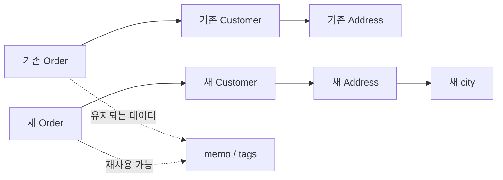

# 58장. Lens

불변 데이터를 사용하면 원본을 보존할 수 있지만 깊은 필드 하나를 바꾸는 코드가 길어질 수 있다.
주문의 고객 주소에서 도시 이름만 바꾸려면 바깥 객체들을 차례로 다시 구성해야 한다.
이 경로가 여러 함수에 반복되면 데이터 구조와 업무 규칙이 강하게 결합한다.

Lens는 항상 존재하는 하나의 부분값에 접근하고 그 부분만 교체하는 경로를 값으로 표현한다.
경로를 먼저 합성하고 나중에 데이터를 전달하므로 깊은 갱신의 반복을 줄일 수 있다.
그러나 일반 setter에 Lens라는 이름을 붙이는 것만으로는 충분하지 않다.
읽기와 쓰기가 일관된다는 법칙이 핵심 계약이다.

이 장은 곱 타입, 불변성, 함수 합성에 이어진다.
다음 장의 Prism과 대비하기 위해 초점이 반드시 하나 존재하는 경우만 다룬다.

---

## 1. 개념과 기본 구분

### 전체와 초점

`Lens[S, A]`에서 `S`는 전체 데이터, `A`는 그 안의 초점이다.
예를 들어 `Lens[Address, String]`은 주소 전체와 도시 문자열의 관계를 나타낼 수 있다.
타입이 같아도 거리 이름을 가리키는 Lens와 도시를 가리키는 Lens는 서로 다른 값이다.

```text
get:     S -> A
replace: (S, A) -> S
```

읽기 함수는 전체에서 부분값을 얻는다.
교체 함수는 원본 전체와 새로운 부분값을 받아 새로운 전체를 만든다.
이 장에서는 `replace(source, value)` 순서를 사용한다.
라이브러리에 따라 인자 순서와 커링 방식은 달라질 수 있다.

### 총체적인 접근

Lens의 초점은 모든 유효한 `S`에서 존재해야 한다.
주소가 없는 주문에서 기본 주소를 임의로 만드는 접근은 이 계약과 다르다.
선택적으로 존재하는 값은 다음 장과 Optics 장의 부분 접근으로 다룬다.

### 세 가지 기본 법칙

```text
Get-Put: replace(s, get(s)) == s
Put-Get: get(replace(s, a)) == a
Put-Put: replace(replace(s, a), b) == replace(s, b)
```

읽은 값을 다시 넣으면 원래 데이터가 유지된다.
넣은 값을 다시 읽으면 바로 그 값을 얻는다.
두 번 교체한 결과는 마지막 값만 한 번 넣은 결과와 같다.

이 식에서 동등성은 예제 데이터의 값 동등성이다.
메모리 주소나 객체 식별자가 같아야 한다는 뜻은 아니다.
법칙을 검사하려면 무엇을 같은 값으로 볼지 먼저 정해야 한다.

### 법칙이 필요한 이유

교체할 때마다 수정 횟수를 증가시키면 첫 번째 법칙을 깨뜨릴 수 있다.
입력을 대문자로 바꾸어 저장하면 두 번째 법칙을 깨뜨릴 수 있다.
경로의 합성이 예측 가능하려면 단순한 읽기·쓰기보다 강한 일관성이 필요하다.

---

## 2. 명령형 스타일과 함수형 스타일

### 가변 객체의 직접 갱신

```text
order.customer.address.city = nextCity
```

표현은 간단하지만 같은 주소 객체를 공유한 다른 주문까지 바뀔 수 있다.
별칭을 추적해야 갱신의 영향을 알 수 있다.
불변 모델에서는 원본 객체를 변경하지 않는 대신 새 값을 구성한다.

### 불변 복사의 중첩

```scala
final case class Address(city: String, street: String)
final case class Customer(name: String, address: Address)
final case class Order(customer: Customer, memo: String)

def changeCity(order: Order, city: String): Order =
  order.copy(customer = order.customer.copy(
    address = order.customer.address.copy(city = city)))
```

이 코드는 명확하고 작은 모델에서는 충분하다.
문제는 같은 경로가 여러 화면, 정책, 테스트에 반복될 때다.
중간 구조가 바뀌면 여러 갱신 함수를 동시에 수정하게 된다.

### 경로와 변환을 분리한다

```text
경로 정의: Order -> Customer -> Address -> city
업무 변환: city -> nextCity
실행:      경로를 따라 부분값을 바꾼 새 Order 생성
```

Lens 합성은 경로의 지식을 한곳에 모은다.
업무 함수는 도시 값을 어떻게 바꿀지만 전달할 수 있다.
경로를 감췄다고 모델 의존성이 사라지는 것은 아니며 정의 위치로 모인 것이다.

### 필요하지 않은 추상화

한 번만 수정하는 얕은 레코드라면 `copy`나 `dataclasses.replace`가 더 직접적이다.
단순 필드 갱신을 모두 Lens로 바꾸는 것이 목표는 아니다.
반복되는 경로와 변환의 분리가 실제로 읽기 쉬워지는지를 판단한다.

---

## 3. 왜 이 개념을 사용하는가?

### 데이터 구조와 정책을 나눈다

도시 이름을 표시하는 정책은 도시가 주문의 몇 단계 아래에 있는지 알 필요가 없다.
접근 경로를 값으로 전달하면 같은 변환을 다른 전체 데이터에도 재사용할 수 있다.
함수를 인자로 받는 고차 함수와 같은 분리 원리다.

### 법칙 기반 테스트

특정 도시 하나를 바꾸는 테스트만으로는 잘못된 Lens를 발견하기 어렵다.
원래 값 다시 쓰기, 연속 쓰기, 새 값 읽기를 함께 검사한다.
정규화나 감사 기록처럼 몰래 섞인 동작이 이런 테스트에서 드러난다.

### 구조 보존의 기대

도시를 바꾸는 Lens는 고객 이름과 주문 메모를 바꾸지 않아야 한다.
기본 법칙과 함께 업무상 보존되어야 할 필드도 검사한다.
복잡한 사용자 정의 동등성 때문에 일부 필드가 비교에서 빠지는 경우 특히 중요하다.

### 다른 값 변환과 결합

`modify`는 `A => A`를 `S => S`로 끌어올린다.
그 결과는 일반 함수이므로 파이프라인에 넣을 수 있다.
부분값 변환과 전체값 변환을 구분하면 함수 합성의 타입을 읽기 쉽다.

```text
도시 변환: String -> String
Lens.modify로 확장한 변환: Order -> Order
```

### 추상화의 책임을 제한한다

Lens는 도메인 명령 처리기나 저장소가 아니다.
주소 변경 권한, 변경 가능 상태, 저장 충돌 같은 정책은 별도 계층에서 처리한다.
경로 추상화에 정책을 모두 숨기면 법칙과 업무 계약을 함께 잃기 쉽다.

---

## 4. Scala에서의 표현

### 최소 구현과 법칙 검사

아래 구현은 타입을 보존하는 monomorphic Lens다.
입력 전체 타입과 출력 전체 타입이 같고, 교체 전후 초점 타입도 같다.
라이브러리의 매크로 없이 작동 원리와 합성을 직접 살펴본다.

<!-- executable:scala -->
```scala
object Chapter58:
  final case class Lens[S, A](get: S => A, replace: (S, A) => S):
    def modify(f: A => A)(source: S): S = replace(source, f(get(source)))
    def andThen[B](inner: Lens[A, B]): Lens[S, B] = Lens(
      source => inner.get(get(source)),
      (source, value) => replace(source, inner.replace(get(source), value))
    )

  final case class Address(city: String, street: String)
  final case class Customer(name: String, address: Address, tags: Vector[String])
  final case class Order(customer: Customer, memo: String, revision: Int)

  val orderCustomer = Lens[Order, Customer](
    _.customer, (source, value) => source.copy(customer = value))
  val customerAddress = Lens[Customer, Address](
    _.address, (source, value) => source.copy(address = value))
  val addressCity = Lens[Address, String](
    _.city, (source, value) => source.copy(city = value))
  val city = orderCustomer.andThen(customerAddress).andThen(addressCity)

  def identityLens[S]: Lens[S, S] = Lens(identity, (_, value) => value)

  def laws[S, A](lens: Lens[S, A], source: S, first: A, second: A): Unit =
    assert(lens.replace(source, lens.get(source)) == source)
    assert(lens.get(lens.replace(source, first)) == first)
    assert(lens.replace(lens.replace(source, first), second) == lens.replace(source, second))
    assert(lens.modify(identity)(source) == source)

  def validatedCity(source: Order, raw: String): Either[String, Order] =
    val candidate = raw.trim
    if candidate.isEmpty then Left("city must not be empty")
    else Right(city.replace(source, candidate))

  def check(): Unit =
    val source = Order(Customer("Min", Address("Seoul", "First Street"), Vector("member")), "fragile", 7)
    val another = source.copy(customer = source.customer.copy(address = Address("", "Second Street")))
    val samples = Vector(source, another)
    val cities = Vector("Seoul", "Busan", "", "  Mixed Case  ", "제주")
    for sample <- samples; first <- cities; second <- cities do
      laws(city, sample, first, second)
    val changed = city.replace(source, "Busan")
    assert(city.get(changed) == "Busan")
    assert(city.get(source) == "Seoul")
    assert(changed.customer.name == source.customer.name)
    assert(changed.customer.tags == source.customer.tags)
    assert(changed.customer.address.street == source.customer.address.street)
    assert(changed.memo == source.memo)
    assert(changed.revision == source.revision)
    val leftGrouped = orderCustomer.andThen(customerAddress).andThen(addressCity)
    val rightGrouped = orderCustomer.andThen(customerAddress.andThen(addressCity))
    for value <- cities do
      assert(leftGrouped.replace(source, value) == rightGrouped.replace(source, value))
      assert(identityLens[Order].andThen(city).replace(source, value) == city.replace(source, value))
    val f: String => String = _ + "!"
    val g: String => String = _.reverse
    assert(city.modify(g)(city.modify(f)(source)) == city.modify(f.andThen(g))(source))
    assert(validatedCity(source, "   ").isLeft)
    assert(validatedCity(source, " Busan ") == Right(changed))
    val normalizing = Lens[Address, String](
      _.city, (address, value) => address.copy(city = value.trim))
    assert(normalizing.get(normalizing.replace(source.customer.address, " Busan ")) != " Busan ")
    val auditing = Lens[Order, String](
      city.get, (order, value) => city.replace(order, value).copy(revision = order.revision + 1))
    assert(auditing.replace(source, auditing.get(source)) != source)
```

### 합성의 갱신 방향

읽기는 바깥에서 안쪽으로 진행한다.
쓰기는 가장 안쪽 초점을 교체한 뒤 바깥 객체들을 다시 구성한다.
원래 전체값을 함께 받기 때문에 초점 밖의 필드를 보존할 수 있다.

### 예제와 실제 라이브러리

Monocle의 [Lens 문서](https://www.optics.dev/Monocle/docs/optics/lens)는 읽기·교체·수정과 합성, 법칙 검사를 설명한다.
본문은 그 API를 그대로 복제한 것이 아니라 핵심 계약을 드러내는 교육용 구현이다.
특히 코드 생성, 다형적 갱신, 효과가 있는 수정 연산은 구현하지 않았다.

---

## 5. 상태 변경보다 값 변환

### 원본 보존과 새 경로 구성

Lens는 원본 주소를 바꾸지 않고 새 주소를 만든다.
그 주소를 가진 새 고객을 만들고, 그 고객을 가진 새 주문을 만든다.
변하지 않은 부분은 재사용할 수 있다.



이 다이어그램은 논리적 참조 관계다.
컴파일러가 실제로 몇 개의 객체를 할당할지는 별도로 측정해야 한다.
자동으로 전체 구조를 깊은 복사한다는 뜻도 아니다.

### 불변성의 깊이

바깥 레코드가 불변이어도 내부 필드가 가변 리스트라면 공유된 내부 상태는 바뀔 수 있다.
예제에서는 Scala의 `Vector`, Python의 `tuple`로 태그를 표현한다.
그 안의 원소도 불변 문자열로 제한한다.

### 값의 동등성

원래 값을 다시 넣은 결과가 원본과 같은 값을 가진다면 Get-Put을 만족할 수 있다.
새 인스턴스가 만들어졌다는 사실은 그 자체로 위반이 아니다.
테스트에서 `==`와 객체 식별성 검사를 혼동하지 않는다.

### 캐시된 파생 필드

전체 데이터에 도시에서 파생한 표시 문자열이 함께 저장되어 있다면 단일 필드 교체가 불일치를 만들
수 있다.
이 경우 모델을 바꾸어 파생값을 계산하거나, 함께 갱신해야 할 단위를 초점으로 삼는다.
Lens 법칙만으로 도메인 전체의 불변조건을 보장할 수는 없다.

---

## 6. 함수 합성과 데이터 흐름

### 경로의 결합 법칙

`Order -> Customer`, `Customer -> Address`, `Address -> city`를 합성한다.
괄호를 어느 쪽에 묶어도 읽기와 교체 결과가 같아야 한다.
이는 함수의 객체 식별성이 같다는 뜻이 아니라 데이터에 적용한 결과의 동등성이다.

```text
(orderCustomer andThen customerAddress) andThen addressCity
orderCustomer andThen (customerAddress andThen addressCity)
```

### 수정 함수의 결합

먼저 `f`, 다음 `g`로 초점을 수정한 결과는 `g(f(value))`로 한 번 수정한 결과와 같다.
이 설명은 순수한 전체 함수와 법칙을 만족하는 Lens를 전제로 한다.
콜백이 시간이나 전역 상태를 읽으면 단순한 대수적 치환을 적용하기 어렵다.

### 여러 필드의 수정

도시와 메모를 각각 바꾸는 두 전체 변환을 일반 함수 합성으로 연결할 수 있다.
서로 독립적인 초점이라면 순서 변경이 가능할 수 있다.
같은 초점이나 겹치는 경로는 덮어쓰기가 발생하므로 교환 가능하다고 가정하지 않는다.

```text
customer 전체 교체 -> city 교체
city 교체 -> customer 전체 교체
```

두 순서는 일반적으로 다른 결과를 낸다.
부분 경로의 겹침은 데이터 의존성 분석의 일부다.

### 하나의 초점과 여러 초점

주문의 모든 상품 수량을 바꾸는 것은 초점이 하나인 Lens의 문제가 아니다.
컬렉션 전체를 초점으로 삼고 `map`을 적용할 수는 있다.
각 원소를 독립된 초점으로 다루는 추상화는 Optics 장의 Traversal로 이어진다.

---

## 7. 장점과 트레이드오프

### 장점

깊은 데이터 접근 경로를 재사용할 수 있다.
부분값 변환을 전체값 변환으로 일관되게 확장한다.
읽기와 쓰기의 법칙을 명시하여 숨은 갱신을 발견하기 쉬워진다.

### 추상화 비용

단순한 복사보다 타입과 함수 값이 늘어난다.
라이브러리 문법을 모르면 실제 갱신 경로를 읽기 어려울 수 있다.
몇 단계의 중첩을 없앴다는 이유만으로 항상 더 나은 코드가 되는 것은 아니다.

| 상황 | 검토할 표현 | 이유 |
| --- | --- | --- |
| 얕은 레코드 한 번 갱신 | 직접 복사 | 경로가 이미 명확하다 |
| 깊은 경로 반복 사용 | Lens | 경로를 재사용한다 |
| 값이 존재하지 않을 수 있음 | Optional 등 | 부재를 드러낸다 |
| 검증 실패가 있음 | Either를 반환하는 명령 | 실패를 보존한다 |
| 상태 전이와 감사 기록 | 도메인 함수 | 업무 의미를 명시한다 |

### 성능의 범위

경로 깊이만큼 재구성이 필요할 수 있다.
넓은 레코드, 컬렉션 복사, 반복 호출에서는 실제 할당량을 확인한다.
Lens는 영속 자료구조의 비용 모델을 대체하지 않는다.

### 법칙 검사는 증명이 아니다

본문은 유한한 샘플에 대해 법칙을 실행한다.
모든 가능한 값에 대한 정리가 자동으로 증명된 것은 아니다.
정의가 단순한 필드 교체인지 논리적으로 검토하고 속성 기반 테스트도 추가할 수 있다.

---

## 8. 상태와 부수효과의 경계

### 정규화를 경계로 옮긴다

도시 입력을 공백 제거 후 저장하고 싶을 수 있다.
Lens의 setter 안에 몰래 넣으면 Put-Get이 깨질 수 있다.
예제의 `validatedCity`는 입력 파싱과 검증을 먼저 수행하고 유효한 결과를 Lens에 전달한다.

### 권한 검사는 명령의 책임이다

주소에 접근할 수 있는 경로를 가졌다는 사실이 그 주소를 변경할 업무 권한을 뜻하지 않는다.
인증·인가 결과는 외곽 계층에서 확인한다.
중요한 상태 전이는 공개된 임의 Lens 대신 제한된 도메인 함수로 노출한다.

### 저장 시점의 충돌

원본을 읽은 뒤 새 객체를 계산하는 동안 다른 요청이 데이터를 바꿀 수 있다.
순수한 갱신이 성공해도 저장 충돌은 남아 있다.
버전 비교나 트랜잭션 같은 저장소 정책은 Lens 바깥에서 처리한다.

```text
스냅샷 읽기 -> 순수한 Lens 갱신 -> 기대 버전으로 저장 -> 성공 또는 충돌
```

### 감사 이벤트

변경 사실을 기록할 때는 갱신 결과와 이벤트를 함께 반환하는 도메인 연산을 만들 수 있다.
이벤트 생성은 Writer나 Functional Core, Imperative Shell의 논의와 연결된다.
Lens 자체를 호출할 때마다 로그를 출력하는 방식과 구분한다.

---

## 9. Python에서 적용하기

### dataclass로 같은 구조를 구현한다

`dataclasses.replace`는 지정된 필드를 바꾸어 새 객체를 만드는 데 사용한다.
깊은 필드의 복사를 Lens 합성으로 연결한다.
아래 예제는 외부 패키지 없이 실행된다.

<!-- executable:python -->
```python
from __future__ import annotations
from dataclasses import dataclass, replace
from typing import Callable, Generic, TypeVar

S = TypeVar("S")
A = TypeVar("A")
B = TypeVar("B")

@dataclass(frozen=True)
class Lens(Generic[S, A]):
    get: Callable[[S], A]
    put: Callable[[S, A], S]

    def replace(self, source: S, value: A) -> S:
        return self.put(source, value)

    def modify(self, source: S, update: Callable[[A], A]) -> S:
        return self.put(source, update(self.get(source)))

    def and_then(self, inner: Lens[A, B]) -> Lens[S, B]:
        return Lens(
            lambda source: inner.get(self.get(source)),
            lambda source, value: self.put(
                source, inner.put(self.get(source), value)
            ),
        )

@dataclass(frozen=True)
class Address:
    city: str
    street: str

@dataclass(frozen=True)
class Customer:
    name: str
    address: Address
    tags: tuple[str, ...]

@dataclass(frozen=True)
class Order:
    customer: Customer
    memo: str
    revision: int

order_customer: Lens[Order, Customer] = Lens(
    lambda order: order.customer,
    lambda order, customer: replace(order, customer=customer),
)
customer_address: Lens[Customer, Address] = Lens(
    lambda customer: customer.address,
    lambda customer, address: replace(customer, address=address),
)
address_city: Lens[Address, str] = Lens(
    lambda address: address.city,
    lambda address, city: replace(address, city=city),
)
city = order_customer.and_then(customer_address).and_then(address_city)

def assert_laws(lens: Lens[S, A], source: S, first: A, second: A) -> None:
    assert lens.replace(source, lens.get(source)) == source
    assert lens.get(lens.replace(source, first)) == first
    assert lens.replace(lens.replace(source, first), second) == lens.replace(source, second)
    assert lens.modify(source, lambda value: value) == source

source = Order(
    Customer("Min", Address("Seoul", "First Street"), ("member",)),
    "fragile",
    7,
)
cities = ("Seoul", "Busan", "", "  Mixed Case  ", "제주")
for first in cities:
    for second in cities:
        assert_laws(city, source, first, second)

changed = city.replace(source, "Busan")
assert city.get(changed) == "Busan"
assert city.get(source) == "Seoul"
assert changed.customer.name == source.customer.name
assert changed.customer.tags == source.customer.tags
assert changed.customer.address.street == source.customer.address.street
assert changed.memo == source.memo
assert changed.revision == source.revision

left = order_customer.and_then(customer_address).and_then(address_city)
right = order_customer.and_then(customer_address.and_then(address_city))
for value in cities:
    assert left.replace(source, value) == right.replace(source, value)

f = lambda value: value + "!"
g = lambda value: value[::-1]
assert city.modify(city.modify(source, f), g) == city.modify(source, lambda value: g(f(value)))

normalizing: Lens[Address, str] = Lens(
    lambda address: address.city,
    lambda address, value: replace(address, city=value.strip()),
)
assert normalizing.get(normalizing.replace(source.customer.address, " Busan ")) != " Busan "

auditing: Lens[Order, str] = Lens(
    city.get,
    lambda order, value: replace(city.replace(order, value), revision=order.revision + 1),
)
assert auditing.replace(source, auditing.get(source)) != source
```

### 표준 라이브러리와의 경계

객체 생성과 `frozen` 옵션의 의미는 [dataclasses 공식 문서](https://docs.python.org/3/library/dataclasses.html)에 정의되어 있다.
Lens 합성 및 법칙 검사는 이 장에서 별도로 구현한 부분이다.
`dataclass`를 사용했다는 사실이 Lens 법칙을 검사해 주지는 않는다.

---

## 10. Python의 표현 한계

### 필드 이름의 정적 보장

문자열 경로 `"customer.address.city"`를 받는 API는 쓰기 편할 수 있다.
하지만 경로의 유효성과 중간 타입을 정적으로 보장하기 어렵다.
오타가 실행 시점까지 남을 수 있으므로 본문은 명시적인 함수를 사용한다.

### frozen의 한계

`frozen=True`는 일반적인 필드 재대입을 제한하는 장치다.
내부 가변 객체까지 재귀적으로 얼리거나 모든 우회 조작을 막는 보안 경계가 아니다.
불변 모델을 만들려면 내부 필드의 표현도 검토해야 한다.

### 생성 후 검증

`replace`로 새 객체를 생성할 때 사용자 정의 초기화나 검증이 영향을 줄 수 있다.
교체 가능한 `A`의 모든 값이 허용되지 않는다면 단순 Lens 계약과 충돌할 수 있다.
유효한 값만 담는 초점 타입을 사용하거나 실패를 반환하는 별도 갱신 함수를 선택한다.

### 다형적인 갱신

실제 optics에는 `S`를 `T`로, 초점 `A`를 `B`로 바꾸는 다형적 형태도 있다.
이 장의 두 타입 매개변수 구현은 그 범위를 포함하지 않는다.
Python의 임의 타입 생성자와 고차 다형성까지 모두 지원한다고 주장하지 않는다.

### 순수성은 호출자와 구현자의 계약

`Callable` 안에서 전역 상태를 바꾸어도 타입 주석은 이를 막지 않는다.
읽기 함수가 호출마다 다른 값을 반환하면 법칙적 추론이 무너진다.
정적 타입, 불변 표현, 순수성, 법칙은 서로 관련되지만 같은 보장이 아니다.

---

## 11. 핵심 정리

### 핵심 판단

Lens는 항상 존재하는 하나의 초점에 대한 읽기와 교체를 묶는다.
경로 합성과 수정 함수의 합성을 구분한다.
정규화, 검증, 감사 기록, 저장 효과는 단순 Lens의 계약 바깥에 둔다.

### 연습 1: 법칙 위반 분류

setter가 도시를 교체하면서 주문의 `revision`을 증가시킨다.
어떤 법칙을 가장 간단하게 반례로 보일 수 있는가?

해설: 원래 도시를 읽어서 그대로 다시 넣어도 revision이 증가한다.
따라서 `replace(s, get(s)) == s`가 성립하지 않는다.
수정 횟수 기록은 별도 도메인 연산으로 분리한다.

### 연습 2: 정규화된 타입

공백 없는 도시 이름만 유효하다는 정책을 유지하면서 법칙을 지키려면 어떻게 하는가?

해설: 외부 문자열을 유효한 도시 타입으로 파싱한 뒤 그 타입을 Lens의 초점으로 삼는다.
Lens가 받는 모든 유효한 값에 대해 교체와 읽기가 일치해야 한다.
문자열 전체를 받아 일부를 몰래 바꾸는 setter와 차이가 있다.

### 연습 3: 중첩 합성

주문 메타데이터 아래 배송 설정과 알림 설정이 있다고 가정하자.
알림 설정의 언어 필드를 가리키는 Lens를 세 단계로 나누어 정의하라.

해설: 각 곱 타입의 직접 필드 Lens를 먼저 만들고 바깥부터 합성한다.
합성된 Lens에는 같은 세 법칙과 관련 없는 필드 보존 검사를 적용한다.
테스트가 특정 데이터 한 개만 다루지 않도록 서로 다른 설정을 포함한다.

### 연습 4: 부재를 가진 주소

`address: Option[Address]`에서 도시로 직접 Lens를 만들 수 있는가?

해설: 주소가 없는 값에서 도시를 읽을 수 없으므로 일반적인 총체 Lens는 적절하지 않다.
기본 주소를 채우는 정책은 별도 명령이며 같은 접근 계약이 아니다.
다음 장의 Prism과 이후 Optional을 합성하여 부재를 표현한다.

### 다음 장으로

곱 타입에서는 여러 필드가 동시에 존재한다.
합 타입에서는 여러 경우 중 하나만 존재하므로 초점이 없을 수 있다.
Prism은 이 차이를 선택과 재구성의 법칙으로 표현한다.
