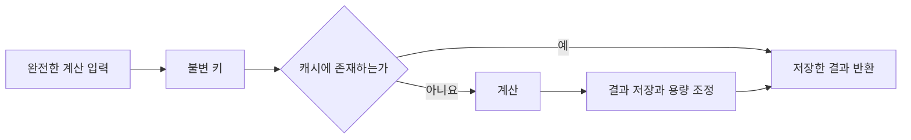

# 54장. Memoization

같은 입력의 계산 결과를 반복해서 사용한다면 매번 다시 계산할 필요가 없을 수 있다.
메모이제이션은 입력과 결과의 대응을 보관하여 계산을 재사용하는 기법이다.
그러나 캐시 키에 필요한 입력이 빠지거나 결과가 가변이면 올바른 프로그램을 잘못된 프로그램으로
바꿀 수 있다.

이번 장은 가격과 수량, 할인 정책 버전을 키로 사용하는 견적 캐시를 만든다.
Scala에서는 작은 용량 제한 캐시를 직접 구현하고 Python에서는 표준 lru_cache를 사용한다.
성능의 이득보다 먼저 무엇을 같은 계산으로 볼 수 있는지 정의한다.

---

## 1. 개념과 기본 구분

### 입력과 결과의 대응

순수한 함수는 같은 입력에 같은 결과를 돌려준다.
그 결과를 보관했다가 다시 사용하는 것은 의미를 유지하면서 반복 비용을 줄일 수 있다.
함수의 실제 의존성이 모두 키에 반영되어 있어야 한다.

```text
memoized(key)
  키가 있으면 저장한 결과
  없으면 계산한 뒤 저장
```

이 구조는 단순하지만 캐시의 정책은 단순하지 않을 수 있다.
키 비교, 용량, 제거, 실패, 동시 접근, 결과의 공유를 각각 정해야 한다.
메모이제이션이라는 이름 하나로 모든 정책이 결정되지는 않는다.

### 메모이제이션과 일반 캐시

메모이제이션은 함수 입력과 계산 결과의 재사용에 초점을 둔다.
외부 서비스 응답 캐시는 시간과 원격 상태 변화의 영향을 받을 수 있다.
두 구조를 구현하는 자료구조가 비슷하더라도 유효성의 근거는 다르다.

### 완전한 키

가격 계산이 단가와 수량, 할인율에 의존한다면 모두 키에 포함해야 한다.
정책 버전이나 통화가 의미에 영향을 주면 그것도 필요하다.
상품 코드만 같다는 이유로 다른 시점의 가격을 같은 계산으로 취급하지 않는다.

### 결과의 공유

캐시는 보통 이전에 만든 결과 객체를 다시 반환할 수 있다.
그 객체가 가변이면 호출자가 변경한 결과를 다음 호출자가 받게 될 수 있다.
값의 의미와 객체 별칭의 의미를 함께 검토한다.

---

## 2. 명령형 스타일과 함수형 스타일

### 상품 코드만 캐시한다

```text
key = sku
result = quantity * currentPrice
```

같은 상품을 다른 수량으로 주문해도 기존 결과를 받을 수 있다.
가격이 바뀌어도 같은 키에 이전 결과가 남는다.
캐시가 빠른 잘못된 답을 돌려주는 상황이다.

### 계산 입력을 키로 만든다

```text
PricingKey(unitPrice, quantity, discountBps, policyVersion)
```

계산에 필요한 값을 명시적인 불변 키로 만든다.
같은 키가 같은 계산을 의미하는지 리뷰할 수 있다.
정책 버전을 넣어도 실제 계산이 숨은 전역 정책을 읽으면 문제가 남는다.

### 무제한 보관

모든 입력을 영원히 보관하면 반복이 적은 작업에서 메모리만 늘 수 있다.
용량과 제거 정책이 필요할 수 있다.
항목 개수 제한과 실제 바이트 수 제한은 다르다.

### 실패를 저장하는 경우

예외가 발생했을 때 저장하지 않으면 다음 호출에서 다시 계산할 수 있다.
실패를 결과값으로 반환하면 그것도 정상 반환값으로 캐시될 수 있다.
오류 모델과 캐시 정책의 결합을 명시해야 한다.

---

## 3. 왜 이 개념을 사용하는가?

### 반복 계산의 절약

입력이 반복되고 계산이 비싸면 효과가 클 수 있다.
입력이 거의 반복되지 않으면 키 생성과 조회, 보관 비용만 추가될 수 있다.
실제 적중률과 계산 비용을 측정해야 한다.

### 재귀 계산의 재사용

동일한 부분 문제를 반복하는 재귀 알고리즘에서 중복을 줄일 수 있다.
하지만 재귀 깊이 자체를 자동으로 줄여 주는 것은 아니다.
시간 복잡도 개선과 호출 스택의 안전성을 구분한다.

### 명시적인 계산 경계

캐시 키를 설계하면서 함수의 숨은 의존성을 발견할 수 있다.
시간과 설정, 외부 상태를 값으로 전달하면 재사용의 의미가 더 명확해진다.
캐시 도입은 의존성 검토의 계기가 될 수 있다.

### 운영 관측

적중과 실패, 제거 횟수를 보면 캐시가 실제로 도움이 되는지 판단할 수 있다.
캐시만으로 원본 계산의 지연과 실패가 가려지지 않도록 관측한다.
성능 수치는 재현 가능한 부하 조건에서 해석해야 한다.

### 제한된 보관

사용하지 않는 항목을 제거하면 메모리 증가를 통제할 수 있다.
다시 필요한 항목은 재계산된다.
올바른 순수 함수에서는 제거가 성능을 바꾸더라도 계산 결과의 의미를 바꾸지 않아야 한다.

---

## 4. Scala에서의 표현

### Scala의 용량 제한 메모이제이션

이 예제는 단일 스레드용 LRU 형태의 캐시다.
최근 조회한 항목을 끝으로 이동하고 용량을 넘으면 가장 오래 사용하지 않은 키를 제거한다.
동시 접근과 바이트 단위 용량 제한은 구현하지 않았다.

<!-- executable:scala -->
```scala
object Chapter54:
  import scala.collection.mutable

  final class Memo[K, V](capacity: Int, compute: K => V):
    require(capacity > 0)
    private val values = mutable.LinkedHashMap.empty[K, V]
    var hits = 0
    var misses = 0
    def size: Int = values.size
    def keys: Vector[K] = values.keysIterator.toVector
    def apply(key: K): V =
      values.remove(key) match
        case Some(value) =>
          hits += 1
          values.update(key, value)
          value
        case None =>
          misses += 1
          val value = compute(key)
          values.update(key, value)
          if values.size > capacity then values.remove(values.head._1)
          value
    def clear(): Unit = values.clear()

  final case class PricingKey(unitPrice: BigInt, quantity: Int, discountBps: Int, policyVersion: Int)
  def calculate(key: PricingKey): BigInt =
    require(key.unitPrice >= 0 && key.quantity > 0)
    require(key.discountBps >= 0 && key.discountBps <= 10000)
    require(key.policyVersion == 1)
    val gross = key.unitPrice * key.quantity
    gross - gross * key.discountBps / 10000

  def check(): Unit =
    var calls = 0
    val cache = new Memo[PricingKey, BigInt](2, key => { calls += 1; calculate(key) })
    val a = PricingKey(1000, 2, 1000, 1)
    val b = PricingKey(1000, 3, 1000, 1)
    val c = PricingKey(2000, 2, 1000, 1)
    assert(cache(a) == 1800)
    assert(cache(a) == 1800)
    assert(calls == 1 && cache.hits == 1 && cache.misses == 1)
    assert(cache(b) == 2700)
    assert(cache.keys == Vector(a, b))
    assert(cache(a) == 1800)
    assert(cache.keys == Vector(b, a))
    assert(cache(c) == 3600)
    assert(cache.keys == Vector(a, c))
    assert(cache(b) == 2700)
    assert(calls == 4 && cache.size == 2)
    cache.clear()
    assert(cache.size == 0)
    assert(cache(a) == 1800)
    assert(calls == 5)

    var attempts = 0
    val retry = new Memo[Int, Int](2, value =>
      attempts += 1
      if attempts == 1 then throw new IllegalStateException("transient test failure")
      value * 2)
    var failed = false
    try retry(3)
    catch case _: IllegalStateException => failed = true
    assert(failed && retry.size == 0)
    assert(retry(3) == 6 && retry(3) == 6)
    assert(attempts == 2)

    val unsafe = new Memo[Int, mutable.ArrayBuffer[Int]](2, value => mutable.ArrayBuffer(value))
    unsafe(1) += 99
    assert(unsafe(1).toVector == Vector(1, 99))
    val safe = new Memo[Int, Vector[Int]](2, value => Vector(value))
    assert((safe(1) :+ 99) == Vector(1, 99))
    assert(safe(1) == Vector(1))

    var currentPrice = BigInt(1000)
    val incompleteKey = new Memo[String, BigInt](2, _ => currentPrice * 2)
    assert(incompleteKey("A") == 2000)
    currentPrice = 2000
    assert(incompleteKey("A") == 2000)
    assert(currentPrice * 2 == 4000)
```

### LRU 순서의 검사

A와 B를 넣은 뒤 A를 다시 읽으면 B가 더 오래 사용하지 않은 항목이 된다.
C를 넣을 때 B가 제거되어야 한다.
결과가 맞는지뿐 아니라 키의 순서와 재계산 횟수도 확인한다.

### 정책 버전의 의미

예제 계산기는 버전 1만 지원한다.
지원하지 않는 버전을 조용히 현재 정책으로 계산하지 않는다.
여러 버전을 지원하려면 실제 계산 규칙도 버전에 따라 명확히 선택해야 한다.

---

## 5. 상태 변경보다 값 변환

### 캐시 키는 도메인 모델이다

같은 계산의 기준을 타입과 필드로 드러낸다.
키에서 빠진 정보는 캐시의 정확성을 무너뜨릴 수 있다.
필요하지 않은 정보를 넣으면 의미가 같은 계산이 다른 키로 분리되어 적중률이 낮아질 수 있다.



키의 동등성과 해시가 값의 수명 동안 안정적이어야 한다.
가변 객체를 키로 사용하면 조회가 잘못되거나 자료구조 계약을 해칠 수 있다.
단순히 해시 가능하다는 사실과 올바른 업무 키라는 사실은 다르다.

### 불변 결과

불변 결과를 공유하면 호출자가 캐시의 원본을 변경하는 위험을 줄일 수 있다.
필드 내부에 가변 객체가 있으면 얕은 불변 래퍼만으로 충분하지 않다.
결과의 객체 그래프 전체를 확인한다.

### 보관 범위

요청 안의 캐시와 프로세스 전체의 캐시는 수명과 공개 범위가 다르다.
사용자별 데이터를 전역 캐시에 넣으면 키에 사용자 경계가 포함되어야 할 수 있다.
데이터의 민감성과 재사용 범위를 함께 설계한다.

---

## 6. 함수 합성과 데이터 흐름

### 참조 투명성과의 연결

계산을 이전 결과로 바꿔도 관측이 같아야 메모이제이션이 의미를 보존하기 쉽다.
매번 로그를 출력하거나 난수를 만드는 함수는 결과 재사용으로 관측이 달라질 수 있다.
무엇을 관측에 포함하는지 명확히 해야 한다.

```text
f(input)를 이전 결과로 대체해도 되는가?
```

### 재귀와 동적 계획법

재귀적으로 정의한 함수가 같은 부분 문제를 여러 번 계산하면 메모이제이션이 중복을 줄일 수 있다.
반복적인 표 채우기와 같은 문제를 다른 실행 구조로 풀 수도 있다.
함수형 문법과 알고리즘의 시간·공간 복잡도를 따로 검토한다.

### 실패값의 캐시

`Either`의 왼쪽 값이나 Python의 오류 데이터도 정상 반환값이면 저장될 수 있다.
일시적인 장애를 오래 캐시할지 정책을 정해야 한다.
예외를 저장하지 않는 구현과 오류값을 저장하는 구현의 차이를 이해한다.

### 정규화된 키

순서가 의미 없는 입력은 정규화하여 같은 키로 만들 수 있다.
그러나 순서가 실제 계산에 중요하면 정렬이 의미를 바꿀 수 있다.
적중률을 높이기 위한 정규화가 도메인 정보를 잃지 않는지 확인한다.

---

## 7. 장점과 트레이드오프

### 장점과 트레이드오프

| 정책 | 이점 | 주의점 |
| --- | --- | --- |
| 완전한 불변 키 | 올바른 재사용 | 키 생성과 비교 비용 |
| LRU 용량 제한 | 항목 수 제한 | 크기가 큰 결과는 별도 |
| 불변 결과 공유 | 별칭 변경 감소 | 내부 가변 필드 |
| 실패 재시도 | 일시 오류 회복 가능 | 반복 장애 부하 |
| 명시적인 무효화 | 정책 변경 대응 | 무효화 누락과 경쟁 |

### 캐시를 사용하지 않는 선택

계산이 매우 싸거나 키가 거의 반복되지 않으면 캐시가 더 비쌀 수 있다.
짧은 벤치마크보다 실제 입력 분포를 기준으로 판단한다.
메모이제이션을 모든 순수 함수에 자동으로 적용하지 않는다.

### 항목 수와 바이트 수

두 항목만 보관해도 각 결과가 매우 큰 객체라면 메모리를 많이 사용할 수 있다.
결과 크기와 참조하는 객체의 수명을 함께 고려한다.
용량이라는 단어가 무엇을 세는지 문서화한다.

### 무효화의 복잡성

외부 상태와 연결된 캐시는 변경 통지와 만료, 버전 정책이 필요할 수 있다.
완전히 순수한 입력 기반 계산의 캐시와 다른 문제다.
정확성을 보장하는 근거를 “캐시를 쓴다”는 설명으로 대신하지 않는다.

---

## 8. 상태와 부수효과의 경계

### 동시 접근

캐시 자료구조가 손상되지 않도록 보호하는 것과 같은 키를 정확히 한 번 계산하는 것은 다르다.
동시에 누락을 발견한 여러 호출이 같은 계산을 수행할 수 있다.
중복 실행이 위험한 효과에는 별도의 단일 실행 조정과 멱등성 정책이 필요하다.

### 시간 제한

TTL은 일정 시간이 지나면 값을 다시 읽게 하는 정책이다.
그 기간 안에 외부 상태가 바뀌지 않는다는 증명은 아니다.
허용 가능한 오래됨과 데이터 일관성 요구를 명시한다.

### 비밀과 사용자 경계

캐시 키나 결과에 토큰과 개인정보가 들어갈 수 있다.
사용자 간 결과가 섞이지 않도록 경계를 정하고 필요한 보관 기간을 제한한다.
성능 최적화가 접근 통제의 우회를 만들지 않도록 한다.

### 자원 객체

열린 연결이나 생성자 객체를 그대로 캐시하면 소모되거나 닫힌 객체를 다시 반환할 수 있다.
재사용 가능한 값과 수명이 있는 자원을 구분한다.
비동기 코루틴 객체 자체의 재사용도 실제 실행 계약을 확인해야 한다.

---

## 9. Python에서 적용하기

### Python의 lru_cache

표준 lru_cache는 해시 가능한 인자를 키로 사용하는 제한된 캐시를 제공한다.
아래 예제는 불변 키 하나를 받아 인자 전달 방식의 차이를 최소화한다.
적중과 누락, 가변 반환값, 예외 재시도를 각각 검사한다.

<!-- executable:python -->
```python
from dataclasses import dataclass
from functools import lru_cache


@dataclass(frozen=True)
class PricingKey:
    unit_price: int
    quantity: int
    discount_bps: int
    policy_version: int


@lru_cache(maxsize=2)
def calculate(key: PricingKey) -> int:
    if key.unit_price < 0 or key.quantity <= 0:
        raise ValueError("invalid item")
    if not 0 <= key.discount_bps <= 10_000 or key.policy_version != 1:
        raise ValueError("unsupported policy")
    gross = key.unit_price * key.quantity
    return gross - gross * key.discount_bps // 10_000


def test_keys_and_eviction() -> None:
    calculate.cache_clear()
    a = PricingKey(1000, 2, 1000, 1)
    b = PricingKey(1000, 3, 1000, 1)
    c = PricingKey(2000, 2, 1000, 1)
    assert calculate(a) == 1800
    assert calculate(a) == 1800
    assert calculate.cache_info().hits == 1
    assert calculate.cache_info().misses == 1
    assert calculate(b) == 2700
    assert calculate(a) == 1800
    assert calculate(c) == 3600
    before = calculate.cache_info().misses
    assert calculate(b) == 2700
    assert calculate.cache_info().misses == before + 1
    assert calculate.cache_info().currsize == 2


def test_mutable_result() -> None:
    @lru_cache(maxsize=2)
    def unsafe(value: int) -> list[int]:
        return [value]

    first = unsafe(1)
    first.append(99)
    assert unsafe(1) is first
    assert unsafe(1) == [1, 99]

    @lru_cache(maxsize=2)
    def safe(value: int) -> tuple[int, ...]:
        return (value,)

    assert safe(1) + (99,) == (1, 99)
    assert safe(1) == (1,)


def test_failures_and_incomplete_keys() -> None:
    attempts = 0

    @lru_cache(maxsize=2)
    def retry(value: int) -> int:
        nonlocal attempts
        attempts += 1
        if attempts == 1:
            raise ValueError("first attempt")
        return value * 2

    try:
        retry(3)
    except ValueError:
        pass
    else:
        raise AssertionError("first attempt unexpectedly succeeded")
    assert retry(3) == 6 and retry(3) == 6
    assert attempts == 2
    current_price = 1000

    @lru_cache(maxsize=2)
    def incomplete_key(sku: str) -> int:
        return current_price * 2

    assert incomplete_key("A") == 2000
    current_price = 2000
    assert incomplete_key("A") == 2000
    assert current_price * 2 == 4000
    incomplete_key.cache_clear()
    assert incomplete_key("A") == 4000


if __name__ == "__main__":
    test_keys_and_eviction()
    test_mutable_result()
    test_failures_and_incomplete_keys()
```

### 테스트 간 캐시 격리

모듈 수준 캐시는 여러 테스트에서 결과를 보관할 수 있다.
독립적인 횟수 검사를 하려면 초기 상태를 명확히 해야 한다.
이 예제는 첫 테스트에서 캐시를 비우고 각 지역 캐시는 새로 만든다.

---

## 10. Python의 표현 한계

### 키의 실제 구성

같은 의미의 호출이라도 위치 인자와 키워드 인자, 키워드 순서에 따라 캐시 항목이 달라질 수 있다.
필요하면 호출 경계에서 정규화된 불변 키를 만든다.
표준 캐시의 구현 계약과 업무상 동등성을 구분한다.

### 타입과 해시

frozen 데이터 클래스라도 필드가 해시 불가능한 객체이면 캐시 키로 사용할 수 없을 수 있다.
해시 가능성과 깊은 불변성, 도메인상 올바른 키는 별개의 조건이다.
실제 키의 필드와 동등성 정의를 확인한다.

### 동시성의 보장 범위

lru_cache는 캐시 자료구조의 일관성을 관리하지만 동시 누락에서 같은 함수가 여러 번 실행될 수
있다.
정확히 한 번 실행이 필요한 외부 작업의 제어 수단으로 사용하지 않는다.
키별 실행 조정이나 외부 멱등성은 별도다.

### 일회성 객체

생성자와 코루틴 객체를 캐시하면 이미 소비하거나 await한 객체를 다시 받을 수 있다.
보관하려는 것이 실행 결과인지 실행 중 객체인지 확인한다.
재사용 가능한 불변 데이터로 경계를 정리하는 것이 도움이 된다.

---

## 11. 핵심 정리

### 핵심 결론

메모이제이션은 같은 입력의 계산 결과를 재사용하는 기법이다.
키에는 의미에 필요한 모든 의존성이 포함되어야 한다.
용량과 제거, 실패, 결과의 별칭 공유, 동시 접근을 별도 정책으로 설계한다.
외부 상태 캐시의 유효성과 순수 함수 결과의 재사용 근거를 구분해야 한다.

### 연습 1: 불완전한 키

상품 코드만 키로 쓰고 수량과 현재 단가로 계산했다.
어떤 결과가 잘못될 수 있는가?

**해설.** 같은 상품의 다른 수량이나 가격에서도 이전 결과가 반환될 수 있다.
필요한 입력을 불변 키에 포함해야 한다.
숨은 전역 상태가 계산에 영향을 주는지도 확인한다.

### 연습 2: 가변 결과

캐시한 리스트를 호출자가 수정했다.
다음 호출에서 원래 리스트를 받을 것이라고 기대해도 되는가?

**해설.** 같은 객체가 반환되면 수정된 결과를 받게 된다.
불변 결과나 명시적인 복사 정책을 사용한다.
캐시는 계산뿐 아니라 객체 별칭도 공유할 수 있다.

### 연습 3: 실패 표현

예외는 캐시하지 않지만 오류 데이터는 정상 반환값으로 캐시한다.
일시적인 장애에서 무엇을 확인해야 하는가?

**해설.** 실패 결과가 얼마나 오래 재사용되는지 확인해야 한다.
오류를 값으로 표현한 선택이 캐시의 실패 정책과 결합된다.
재시도와 만료, 오류 종류에 따른 보관을 명시한다.

### 연습 4: 한 번 실행

스레드 안전한 캐시이므로 외부 결제도 같은 키에서 정확히 한 번 실행된다는 주장은 맞는가?

**해설.** 자료구조의 일관성과 단일 실행 보장은 다르다.
동시 누락에서 계산이 중복될 수 있다.
외부 효과에는 별도의 멱등성과 실행 조정이 필요하다.

### 다음 장과 참고 자료

다음 장은 이전 버전을 유지하면서 구조를 공유하는 영속 자료구조를 다룬다.
결과 캐시의 공유와 자료구조 자체의 공유가 어떻게 다른지 비교한다.

[Python 공식 문서: functools.lru_cache](https://docs.python.org/3.14/library/functools.html#functools.lru_cache)
[Scala API: mutable.LinkedHashMap](https://www.scala-lang.org/api/current/scala/collection/mutable/LinkedHashMap.html)
[Python 공식 문서: dataclasses](https://docs.python.org/3.14/library/dataclasses.html)
