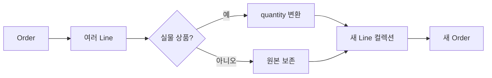

# 60장. Optics

Lens와 Prism을 배웠다면 모든 중첩 경로를 둘 중 하나로 표현할 수 있을 것처럼 보일 수 있다.
그러나 주문의 여러 상품 중 실물 상품만 골라 수량을 바꾸는 경로는 초점이 여러 개다.
또한 특정 경우 내부의 필드만 바꾸는 경로는 원본 없이 전체값을 재구성할 수 없다.

Optics는 이런 구조적 접근을 초점의 개수와 가능한 연산에 따라 구분하는 추상화들의 계열이다.
이 장은 이름을 많이 외우는 대신 경로가 약속할 수 있는 계약을 정확하게 읽는 데 집중한다.
잘못된 종류를 선택하면 부재를 숨기거나 정보가 없는 상태에서 전체값을 만들려 하게 된다.

곱·합 타입, Lens, Prism, Functor, Applicative를 연결한다.
Scala에서는 효과 있는 순회를 표현하고 Python에서는 제한된 순수 갱신 경로를 명시적으로 구현한다.

---

## 1. 개념과 기본 구분

### 접근 경로의 능력

같은 `S`에서 `A`로 향하는 경로도 항상 읽을 수 있는지, 여러 값을 읽는지, 쓸 수 있는지가 다르다.
이 능력을 타입으로 구분하면 잘못된 연산을 기대하지 않게 된다.
초점 개수만 같아도 재구성 능력은 다를 수 있다.

| 종류 | 초점 수 | 핵심 연산 | 필요한 정보 |
| --- | --- | --- | --- |
| Iso | 정확히 1 | 양방향 변환 | 어느 방향도 원본 불필요 |
| Lens | 정확히 1 | 읽기와 교체 | 교체 시 원본 전체 |
| Prism | 0 또는 1 | 선택과 구성 | 구성 시 내용만 |
| Optional | 0 또는 1 | 선택과 조건부 교체 | 교체 시 원본 전체 |
| Traversal | 0개 이상 | 모든 초점 순회·수정 | 전체 구조 보존 |
| Getter | 정확히 1 | 읽기 | 쓰기 기능 없음 |
| Fold | 0개 이상 | 여러 초점 읽기·축약 | 쓰기 기능 없음 |
| Setter | 개수 관찰 불필요 | 수정 | 읽기 기능을 요구하지 않음 |

이 표는 이 책에서 사용하는 대표적인 단형 계약의 요약이다.
모든 라이브러리가 정확히 같은 타입 이름과 API를 제공한다는 뜻은 아니다.
구체적인 라이브러리의 다형적 변형은 별도로 확인한다.

### Optional이 필요한 이유

배송 결과에서 성공 경우를 고른 뒤 그 안의 주소를 읽는다고 하자.
실패 결과에는 주소가 없으므로 Lens는 아니다.
주소만으로 배송 시각 등 전체 성공 데이터를 만들 수 없으므로 Prism도 아니다.

```text
Optional.getOption: S -> Option[A]
Optional.replace:   (S, A) -> S
```

이 장의 조건부 교체는 초점이 없으면 원본을 보존한다.
없는 초점을 새로 만들어 넣는 upsert 정책과 구분한다.

### Traversal의 효과 있는 표현

```text
modifyF: Applicative F => (A -> F[A]) -> S -> F[S]
```

각 초점의 변환 결과를 Applicative로 결합하고 원래 구조를 재구성한다.
초점이 없으면 원본을 `pure`로 반환한다.
일반적인 map과 달리 결과 안의 계산 문맥까지 하나로 모은다.

---

## 2. 명령형 스타일과 함수형 스타일

### 여러 겹의 구조 분기

```text
주문의 상품들을 순회한다
    실물 상품이면 수량을 변환한다
    디지털 상품이면 원본을 유지한다
변환한 상품들로 새 주문을 만든다
```

직접 반복문이나 `map`과 패턴 매칭으로 명확하게 구현할 수 있다.
여러 기능에서 같은 선택 경로를 반복하면 경로를 재사용 가능한 값으로 분리할 수 있다.
Optics는 반복문이 잘못되었다는 주장이 아니다.

### 경로를 네 단계로 나눈다

```text
Order --Lens--> Vector[Line]
Vector[Line] --Traversal--> Line
Line --Prism--> Physical
Physical --Lens--> quantity
```

첫 단계는 항상 하나의 상품 벡터를 가진다.
두 번째 단계에서 초점이 여러 개가 된다.
세 번째 단계는 실물 상품이 아닌 초점을 제외한다.
마지막 단계는 선택된 실물 상품의 수량을 읽거나 바꾼다.

### 결과 계약은 가장 강한 이름이 아니다

중간에 Traversal이 있으면 전체 경로의 초점은 0개 이상이다.
마지막이 Lens라고 해서 전체를 Lens라고 부를 수 없다.
경로를 합성할 때는 최종 연산이 보장하는 능력만 남긴다.

### 구조 지식을 모은다

업무 함수는 수량을 1 늘리는 변환만 제공할 수 있다.
상품이 실물인지 판별하는 경로는 optic 정의에 모인다.
도메인상 수량 수정이 허용되는지는 별도의 명령 검사가 담당한다.

---

## 3. 왜 이 개념을 사용하는가?

### 합성 결과를 미리 판단한다

반복되는 오류 중 하나는 존재하지 않는 초점에 총체 getter를 요구하는 것이다.
경로의 타입을 보면 부재나 다중 결과를 처리해야 함을 알 수 있다.
기초 장의 타입 기반 모델링을 접근 경로까지 확장한다.

### 동일한 경로에 여러 해석

같은 Traversal로 값을 수정하거나, 모으거나, 검증할 수 있다.
`Identity` 문맥은 순수한 수정 결과를 얻는 데 사용한다.
누적만 하는 문맥은 초점들을 수집하는 데 사용할 수 있다.

### 조건부 갱신의 검증

존재하는 모든 초점이 조건을 만족해야 새 전체값을 얻는 API를 만들 수 있다.
하나가 실패하면 전체 수정 결과를 실패로 표현한다.
실제 외부 부수효과를 되돌리는 트랜잭션과는 다른 개념이다.

### 법칙을 공유한다

항등 수정은 원본을 유지해야 한다.
수정 함수를 합성한 결과는 연속 수정과 일치해야 한다.
초점 수집과 수정이 서로 다른 경로를 사용하면 이 계약을 만족하기 어렵다.

### 범위를 제한한다

Optics는 접근과 구조 보존에 대한 도구다.
도메인 검증, 저장 충돌, 권한 검사를 자동으로 제공하지 않는다.
한 번의 경로 갱신을 완전한 업무 트랜잭션으로 오해하지 않는다.

---

## 4. Scala에서의 표현

### Applicative로 순회를 표현한다

아래 코드는 최소 Applicative와 Traversal을 직접 정의한다.
`getAll`은 수집용 문맥으로, `modify`는 항등 문맥으로 같은 순회를 해석한다.
일부 라이브러리의 축약 API와 달리 효과 있는 핵심 연산을 명시한다.

<!-- executable:scala -->
```scala
object Chapter60:
  trait Applicative[F[_]]:
    def pure[A](value: A): F[A]
    def map2[A, B, C](left: F[A], right: F[B])(f: (A, B) => C): F[C]
    def map[A, B](value: F[A])(f: A => B): F[B] =
      map2(value, pure(()))((a, _) => f(a))

  type Id[A] = A
  val idApplicative: Applicative[Id] = new Applicative[Id]:
    def pure[A](value: A): A = value
    def map2[A, B, C](left: A, right: B)(f: (A, B) => C): C = f(left, right)

  given optionApplicative: Applicative[Option] with
    def pure[A](value: A): Option[A] = Some(value)
    def map2[A, B, C](left: Option[A], right: Option[B])(f: (A, B) => C): Option[C] =
      for a <- left; b <- right yield f(a, b)

  trait Traversal[S, A]:
    def modifyF[F[_]](source: S)(f: A => F[A])(using Applicative[F]): F[S]
    final def modify(source: S)(f: A => A): S =
      modifyF[Id](source)(f)(using idApplicative)
    final def getAll(source: S): Vector[A] =
      type Acc[X] = Vector[A]
      given Applicative[Acc] with
        def pure[X](value: X): Vector[A] = Vector.empty
        def map2[X, Y, Z](left: Vector[A], right: Vector[A])(f: (X, Y) => Z): Vector[A] =
          left ++ right
      modifyF[Acc](source)(value => Vector(value))
    final def andThen[B](inner: Traversal[A, B]): Traversal[S, B] =
      val outer = this
      new Traversal[S, B]:
        def modifyF[F[_]](source: S)(f: B => F[B])(using Applicative[F]): F[S] =
          outer.modifyF(source)(value => inner.modifyF(value)(f))

  final case class Lens[S, A](get: S => A, put: (S, A) => S):
    def asTraversal: Traversal[S, A] = new Traversal[S, A]:
      def modifyF[F[_]](source: S)(f: A => F[A])(using ap: Applicative[F]): F[S] =
        ap.map(f(get(source)))(value => put(source, value))

  final case class Prism[S, A](preview: S => Option[A], review: A => S):
    def asTraversal: Traversal[S, A] = new Traversal[S, A]:
      def modifyF[F[_]](source: S)(f: A => F[A])(using ap: Applicative[F]): F[S] =
        preview(source) match
          case Some(value) => ap.map(f(value))(review)
          case None => ap.pure(source)

  def each[A]: Traversal[Vector[A], A] = new Traversal[Vector[A], A]:
    def modifyF[F[_]](source: Vector[A])(f: A => F[A])(using ap: Applicative[F]): F[Vector[A]] =
      source.foldLeft(ap.pure(Vector.empty[A])) { (result, value) =>
        ap.map2(result, f(value))((items, updated) => items :+ updated)
      }

  final case class Physical(sku: String, quantity: Int, grams: Int)
  enum Line:
    case Shipped(value: Physical)
    case Download(sku: String, license: String)
  final case class Order(id: String, lines: Vector[Line], note: String)

  val lines = Lens[Order, Vector[Line]](_.lines, (order, value) => order.copy(lines = value))
  val physical: Prism[Line, Physical] = Prism(
    {
      case Line.Shipped(value) => Some(value)
      case _ => None
    },
    Line.Shipped.apply
  )
  val quantity = Lens[Physical, Int](_.quantity, (item, value) => item.copy(quantity = value))
  val quantities: Traversal[Order, Int] = lines.asTraversal
    .andThen(each[Line]).andThen(physical.asTraversal).andThen(quantity.asTraversal)

  def unstable(values: Vector[Int])(f: Int => Int): Vector[Int] =
    values.map(value => if value > 0 then f(value) else value)

  def check(): Unit =
    val digital = Line.Download("ebook", "L-1")
    val source = Order("O-1", Vector(
      Line.Shipped(Physical("book", 2, 300)), digital,
      Line.Shipped(Physical("pen", 3, 10))), "fragile")
    assert(quantities.getAll(source) == Vector(2, 3))
    val updated = quantities.modify(source)(_ + 1)
    assert(quantities.getAll(updated) == Vector(3, 4))
    assert(updated.lines(1) == digital)
    assert(updated.id == source.id && updated.note == source.note)
    assert(quantities.modify(source)(identity) == source)
    val f: Int => Int = _ + 1
    val g: Int => Int = _ * 2
    assert(quantities.modify(quantities.modify(source)(f))(g) ==
      quantities.modify(source)(f.andThen(g)))
    val empty = source.copy(lines = Vector.empty)
    assert(quantities.getAll(empty).isEmpty)
    assert(quantities.modify(empty)(_ + 1) == empty)
    val validated = quantities.modifyF[Option](source)(q => if q > 0 then Some(q + 1) else None)
    assert(validated == Some(updated))
    val invalid = source.copy(lines = Vector(Line.Shipped(Physical("bad", 0, 10))))
    assert(quantities.modifyF[Option](invalid)(q => if q > 0 then Some(q + 1) else None).isEmpty)
    var visited = 0
    quantities.modifyF[Option](invalid.copy(lines = invalid.lines ++ source.lines)) { q =>
      visited += 1
      if q > 0 then Some(q) else None
    }
    assert(visited == 3)
    val before = Vector(3)
    assert(unstable(unstable(before)(_ - 5))(_ + 10) != unstable(before)(q => q - 5 + 10))
```

### 값 수준 결합과 실행 중단

`Option` 결과가 실패하면 최종 결과는 `None`이다.
하지만 이 `each`는 엄격한 `foldLeft`로 모든 `f(value)`를 호출한다.
실패 후 콜백 실행까지 중단하는 런타임이라고 설명해서는 안 된다.
예제의 방문 횟수 테스트가 이 차이를 드러낸다.

### 일반 Traversal의 참고점

[Monocle Traversal 문서](https://www.optics.dev/Monocle/docs/optics/traversal)는 여러 초점, Applicative 기반 수정, 수집 및 수정 법칙을 설명한다.
본문은 구조를 보여주는 작은 구현이며 스택·할당 최적화까지 갖춘 라이브러리는 아니다.
지원하는 효과의 실행 정책은 전달한 Applicative와 순회 구현에 따라 분석한다.

---

## 5. 상태 변경보다 값 변환

### 경로만 재구성한다

선택한 실물 상품의 수량을 바꾸면 새 실물 상품 값을 만든다.
디지털 상품은 그대로 보존하고 새로운 상품 컬렉션으로 주문을 다시 구성한다.
초점 밖 필드를 유지한다는 점에서 앞 장의 불변 갱신과 연결된다.



### 초점의 안정성

상품의 종류는 수량을 수정해도 바뀌지 않는다.
따라서 같은 경로를 다시 적용해도 같은 구조적 위치가 선택된다.
수량이 양수라는 조건으로 초점을 선택하면 수정 후 선택 집합이 달라질 수 있다.

### 임의 필터의 반례

```text
초기값: [3]
양수만 골라 5 빼기: [-2]
다시 양수만 골라 10 더하기: [-2]
처음 양수만 골라 한 번에 -5 +10 하기: [8]
```

두 번 수정과 합성한 함수를 한 번 수정한 결과가 다르다.
이런 값 의존 필터를 법칙적인 Traversal이라고 부르면 합성 추론이 깨진다.
일반적인 조건부 변환으로 사용하는 것 자체가 잘못된 것은 아니다.

### 구조와 도메인 조건

초점은 구조적으로 선택하고 유효성 조건은 별도 검증 결과로 반환할 수 있다.
경로 선택과 수정 허용 조건을 분리하면 법칙을 유지하기 쉽다.
임의 필터를 허용하는 라이브러리에서는 그 연산의 법칙 제한을 확인한다.

---

## 6. 함수 합성과 데이터 흐름

### 합성 표를 읽는 원리

Lens와 Lens를 합성하면 항상 존재하는 하나의 초점이 남는다.
Prism과 Prism은 성공한 경우를 안에서 밖으로 구성할 수 있다.
Lens와 Prism, Prism과 Lens는 보통 원본을 요구하는 부분 접근으로 약해진다.

| 합성 | 대표적인 결과 계약 |
| --- | --- |
| Lens 뒤 Lens | Lens |
| Prism 뒤 Prism | Prism |
| Lens 뒤 Prism | Optional |
| Prism 뒤 Lens | Optional |
| Optional 뒤 Lens | Optional |
| Traversal 뒤 Lens 또는 Prism | Traversal |
| 읽기 전용 경로와 다중 접근 | Fold 등 읽기 전용 계약 |

이 표는 보존되는 능력에 대한 보수적인 기준이다.
특수한 타입에서 추가 구조를 증명하면 더 강한 결과를 얻을 수 있지만 기본적으로 가정하지 않는다.

### Identity 해석

각 초점에서 `A => A`를 수행하면 문맥 없는 새 전체값을 얻는다.
예제의 `Id[A] = A`가 이 역할을 한다.
Functor와 Applicative 장의 타입 생성자 추상화가 실제로 쓰이는 지점이다.

### 수집 해석

수집용 Applicative는 재구성에 사용할 값을 계산하지 않고 초점 목록만 누적한다.
`pure`는 아무 초점도 추가하지 않고 `map2`는 두 목록을 연결한다.
결과 타입이 `F[S]`여도 `F`가 S를 보관하지 않을 수 있다는 사실이 중요하다.

### 효과 있는 수정

각 초점이 `Option[A]`를 반환하면 전체는 `Option[S]`가 된다.
오류 누적 문맥을 쓰면 여러 검증 결과를 누적할 수 있다.
그때는 오류 결합 순서와 반환할 전체값의 의미를 명시해야 한다.

---

## 7. 장점과 트레이드오프

### 장점

접근 경로와 값 변환을 분리한다.
초점의 개수와 읽기·쓰기 능력을 타입 수준에서 구분한다.
같은 순회를 수정, 수집, 검증처럼 여러 방식으로 해석할 수 있다.

### 학습 비용

Lens, Prism, Optional, Traversal을 구분하지 못하면 타입 오류가 낯설게 느껴질 수 있다.
작은 코드에서는 직접 `map`과 패턴 매칭이 더 명확할 수 있다.
반복되는 구조적 경로가 실제로 많을 때 도입하는 편이 이해하기 쉽다.

### 할당과 순회 비용

각 단계는 새 데이터와 문맥 값을 만들 수 있다.
목록을 반복 연결하는 누적 표현은 컬렉션 선택에 따라 비용이 커질 수 있다.
본문의 작은 수집 구현은 성능 벤치마크를 위한 구현이 아니다.

### 법칙의 범위

항등 수정과 합성 법칙은 필요한 검토 기준이다.
일반 Traversal의 모든 법칙과 자연성까지 이 테스트 몇 개로 증명한 것은 아니다.
검증된 라이브러리를 사용하더라도 사용자 정의 인스턴스는 별도 검토한다.

### 읽기만 필요하면 읽기만 노출한다

설정값을 조회하는 모듈에 전체 수정 능력을 넘길 필요는 없다.
Getter나 Fold처럼 더 작은 인터페이스로 요구를 표현할 수 있다.
접근 추상화에서도 최소한의 능력을 노출한다는 설계 원칙이 유효하다.

---

## 8. 상태와 부수효과의 경계

### 검증 실패와 롤백

순수한 변환을 `Option`으로 감싸면 실패 시 새 전체값을 제공하지 않을 수 있다.
그러나 콜백이 파일을 쓰거나 결제하면 이미 발생한 효과를 자동으로 되돌리지 못한다.
값 수준 실패와 외부 시스템 트랜잭션을 구분한다.

### 순서의 관찰

순회 순서가 로그 순서, 요청 순서, 오류 배열 순서를 결정할 수 있다.
`Vector` 예제는 입력 순서를 보존한다.
순서를 보장하지 않는 데이터 구조를 사용하면 같은 계약을 그대로 약속하지 않는다.

### 병렬 실행

Applicative가 있다는 사실만으로 병렬 실행이 자동으로 일어나지는 않는다.
동시에 시작할지, 순차 실행할지, 오류 후 취소할지는 효과 구현의 정책이다.
동시 실행을 도입하면 외부 자원의 제한과 결과 순서도 검토한다.

### 오래된 스냅샷

Optics가 만든 새 객체는 입력 스냅샷에 대한 결과다.
계산 중 실제 데이터가 바뀌었다면 저장 시 충돌을 확인해야 한다.
경로가 깊다고 해서 데이터베이스의 해당 필드만 원자적으로 바꿨다는 뜻은 아니다.

---

## 9. Python에서 적용하기

### Python의 제한된 순수 Traversal

아래 코드는 수집과 순수 수정만 제공한다.
Scala 예제의 임의 `F[_]`에 대한 `modifyF`를 Python에 완전히 재현한 것은 아니다.
실무에서 필요한 작은 인터페이스로 구조적 경로를 표현하는 대안이다.

<!-- executable:python -->
```python
from __future__ import annotations
from dataclasses import dataclass, replace
from typing import Callable, Generic, TypeVar, Union

S = TypeVar("S")
A = TypeVar("A")
B = TypeVar("B")

@dataclass(frozen=True)
class Traversal(Generic[S, A]):
    collect: Callable[[S], tuple[A, ...]]
    update: Callable[[S, Callable[[A], A]], S]

    def get_all(self, source: S) -> tuple[A, ...]:
        return self.collect(source)

    def modify(self, source: S, f: Callable[[A], A]) -> S:
        return self.update(source, f)

    def and_then(self, inner: Traversal[A, B]) -> Traversal[S, B]:
        def collect(source: S) -> tuple[B, ...]:
            return tuple(value for outer in self.collect(source) for value in inner.collect(outer))
        def update(source: S, f: Callable[[B], B]) -> S:
            return self.update(source, lambda value: inner.update(value, f))
        return Traversal(collect, update)

@dataclass(frozen=True)
class Physical:
    sku: str
    quantity: int
    grams: int

@dataclass(frozen=True)
class Shipped:
    value: Physical

@dataclass(frozen=True)
class Download:
    sku: str
    license: str

Line = Union[Shipped, Download]

@dataclass(frozen=True)
class Order:
    id: str
    lines: tuple[Line, ...]
    note: str

lines: Traversal[Order, tuple[Line, ...]] = Traversal(
    lambda order: (order.lines,),
    lambda order, f: replace(order, lines=f(order.lines)),
)
each: Traversal[tuple[Line, ...], Line] = Traversal(
    lambda items: items,
    lambda items, f: tuple(f(item) for item in items),
)
physical: Traversal[Line, Physical] = Traversal(
    lambda line: (line.value,) if isinstance(line, Shipped) else (),
    lambda line, f: Shipped(f(line.value)) if isinstance(line, Shipped) else line,
)
quantity: Traversal[Physical, int] = Traversal(
    lambda item: (item.quantity,),
    lambda item, f: replace(item, quantity=f(item.quantity)),
)
quantities = lines.and_then(each).and_then(physical).and_then(quantity)

digital = Download("ebook", "L-1")
source = Order("O-1", (
    Shipped(Physical("book", 2, 300)), digital,
    Shipped(Physical("pen", 3, 10)),
), "fragile")
assert quantities.get_all(source) == (2, 3)
updated = quantities.modify(source, lambda value: value + 1)
assert quantities.get_all(updated) == (3, 4)
assert quantities.get_all(source) == (2, 3)
assert updated.lines[1] == digital
assert updated.id == source.id and updated.note == source.note
assert quantities.modify(source, lambda value: value) == source

f = lambda value: value + 1
g = lambda value: value * 2
assert quantities.modify(quantities.modify(source, f), g) == quantities.modify(source, lambda value: g(f(value)))
assert quantities.get_all(quantities.modify(source, f)) == tuple(f(value) for value in quantities.get_all(source))

empty = replace(source, lines=())
assert quantities.get_all(empty) == ()
assert quantities.modify(empty, f) == empty
only_digital = replace(source, lines=(digital,))
assert quantities.modify(only_digital, f) == only_digital

def unstable(values: tuple[int, ...], update: Callable[[int], int]) -> tuple[int, ...]:
    return tuple(update(value) if value > 0 else value for value in values)

assert unstable(unstable((3,), lambda value: value - 5), lambda value: value + 10) == (-2,)
assert unstable((3,), lambda value: value - 5 + 10) == (8,)
```

### 별도 함수 두 개의 위험

수집 함수와 수정 함수를 독립적으로 제공하므로 서로 다른 초점을 다루는 잘못된 인스턴스도 만들 수
있다.
그 때문에 수집 후 수정 결과의 일관성을 추가로 검사한다.
Scala의 단일 핵심 연산에서 파생하는 구조와 차이를 이해해야 한다.

---

## 10. Python의 표현 한계

### 고차 타입의 표현 차이

Scala의 `F[_]`는 타입 생성자를 매개변수로 받는다.
본문의 Python `Traversal[S, A]`는 그 기능을 약속하지 않는다.
`Any`를 사용해 임의 문맥처럼 보이게 만드는 것은 같은 정적 보장을 제공하지 않는다.

### 법칙이 타입에 들어 있지 않다

함수의 입력·출력 주석이 맞아도 수집 경로와 수정 경로가 일치한다는 보장은 없다.
동일 초점을 두 번 수정하는 잘못된 인스턴스도 작성할 수 있다.
법칙 검사는 타입 검사와 별도의 층이다.

### 구조적 경로와 문자열 경로

문자열 경로 엔진은 동적으로 모델을 탐색할 수 있지만 필드 타입과 부재 정책이 실행 시점으로 밀릴
수 있다.
명시적인 함수 경로는 장황하지만 데이터 흐름을 코드에서 확인하기 쉽다.
구성 방식과 정적 보장의 차이를 문서화한다.

### 제한된 인터페이스의 가치

일반 optics 라이브러리를 모두 흉내 내지 않아도 반복되는 갱신 경로를 정리할 수 있다.
실제로 필요한 수집과 순수 수정만 구현하고 그 범위를 명확히 한다.
추상화의 이름보다 보장 범위가 중요하다.

---

## 11. 핵심 정리

### 핵심 판단

Optics의 종류는 초점 개수뿐 아니라 읽기·쓰기·재구성 능력으로 구분한다.
합성 결과에는 보존되는 능력만 약속한다.
임의 필터와 외부 효과를 넣을 때는 법칙과 실행 정책이 달라질 수 있다.

### 연습 1: 결과 타입 분류

`Order -> Option[Address] -> city` 경로를 총체 Lens로 표현할 수 있는가?

해설: 주소가 없으면 도시를 읽을 수 없으므로 일반적으로 Optional 계약이 필요하다.
기본 주소 삽입은 다른 연산이며 단순 조건부 교체와 구분한다.
마지막 단계가 Lens라는 사실만으로 전체가 Lens가 되지 않는다.

### 연습 2: 값 의존 필터

양수만 수정하는 경로에 `-5`와 `+10`을 연속 적용하라.
합성한 변환을 한 번 적용한 결과와 비교하라.

해설: 첫 수정으로 초점이 선택 범위 밖으로 나가면 두 번째 수정에서 건너뛴다.
본문의 `[3]` 반례가 이 차이를 보여준다.
구조적으로 안정된 경로와 도메인 검증을 분리한다.

### 연습 3: 효과의 중단

Scala 예제에서 첫 수량 검증이 실패해도 방문 횟수가 계속 증가하는 이유는 무엇인가?

해설: `f(value)`를 먼저 평가한 값을 엄격한 `map2`에 넘기기 때문이다.
최종 Option의 실패와 이후 함수 호출의 중단은 다른 계약이다.
실행을 제어하려면 지연된 효과와 그 해석 정책을 함께 설계해야 한다.

### 연습 4: 읽기 전용 인터페이스

보고서 모듈은 상품 수량의 합계만 필요하다.
어떤 능력을 노출하는 것이 충분한가?

해설: Fold나 수집 함수처럼 읽기만 가능한 인터페이스로 충분하다.
전체 모델을 교체할 수 있는 능력을 반드시 넘길 이유는 없다.
기능의 최소 범위를 타입과 API로 드러낸다.

### 다음 장으로

이 장에서는 효과가 있는 초점 변환을 `F`로 매개변수화했다.
다음 장은 함수가 수행할 수 있는 효과를 타입과 능력으로 추적한다는 말이 정확히 무엇인지 다룬다.
효과를 감싼 타입이 있다는 사실과 언어가 모든 효과를 검사한다는 사실을 구분한다.
