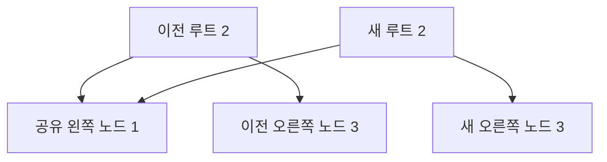

# 55장. Persistent Data Structures

불변 자료구조를 갱신할 때 매번 전체 데이터를 깊게 복사해야 하는 것은 아니다.
바뀐 부분으로 가는 경로만 새로 만들고 나머지 구조를 공유할 수 있다.
영속 자료구조는 갱신 후에도 이전 버전에 접근할 수 있도록 하는 자료구조다.

이번 장의 영속성은 디스크에 영구 저장한다는 뜻이 아니다.
메모리 안의 여러 버전을 유지하는 성질을 설명한다.
작은 불균형 이진 탐색 트리로 경로 복사와 구조 공유를 직접 확인하고, 균형 트리의 성능을 구현하지
않은 예제에 잘못 적용하지 않는다.

---

## 1. 개념과 기본 구분

### 이전 버전이 남는다

가변 자료구조를 직접 변경하면 같은 참조로 이전 상태를 다시 볼 수 없을 수 있다.
영속 자료구조의 갱신은 새 버전을 반환하면서 이전 버전의 의미를 유지한다.
호출자는 필요한 버전의 루트를 보관한다.

```text
oldTree --put(key, value)--> newTree
oldTree도 여전히 이전 내용을 제공한다
```

여기서 이전 버전은 반드시 전체 깊은 복사일 필요가 없다.
변하지 않은 부분을 새 버전과 공유할 수 있다.
공유하는 노드가 관측 가능한 변경을 일으키지 않아야 버전의 의미를 보존하기 쉽다.

### 불변성과 영속성

불변성은 기존 값을 바꾸지 않는 성질이다.
영속성은 갱신 후에도 이전 버전을 사용할 수 있는 성질에 초점을 둔다.
모든 불변 래퍼가 효율적인 구조 공유를 제공하는 것은 아니다.

### 부분 영속성과 완전 영속성

최신 버전만 갱신할 수 있는 구조와 과거 버전에서도 새 가지를 만들 수 있는 구조를 구분할 수 있다.
이 장의 순수한 `put`은 어느 유효한 루트에서든 새 버전을 만든다.
서로 다른 버전을 합치는 병합 정책까지 자동으로 제공하는 것은 아니다.

### 루트와 도달 가능성

각 루트가 가리키는 노드들이 그 버전의 내용이다.
같은 노드가 여러 루트에서 도달 가능할 수 있다.
어떤 버전을 보관하느냐가 메모리의 수명에 영향을 준다.

---

## 2. 명령형 스타일과 함수형 스타일

### 전체 깊은 복사

```text
전체 트리를 복사한다
복사본에서 하나의 값을 수정한다
```

원래 트리를 보존할 수 있지만 변경하지 않은 노드까지 복사하는 비용이 생긴다.
큰 자료구조에서 작은 변경이 반복되면 부담이 커질 수 있다.
값 보존과 전체 복사를 같은 의미로 이해하지 않는다.

### 경로만 복사한다

```text
루트에서 대상 키까지 탐색한다
대상 노드를 새 값으로 만든다
돌아오는 경로의 부모만 새로 만든다
다른 가지는 기존 노드를 공유한다
```

새 루트는 바뀐 경로를 통해 새 값을 가리킨다.
이전 루트는 이전 경로를 그대로 가리킨다.
변하지 않은 가지는 두 버전에서 같은 객체일 수 있다.

### 공유된 가변 값

노드가 불변이어도 값 필드에 가변 리스트를 넣으면 여러 버전이 그 리스트를 함께 볼 수 있다.
리스트를 바꾸면 과거 버전의 관측도 달라질 수 있다.
노드의 불변성과 저장된 값의 깊은 불변성을 구분한다.

### 균형의 문제

단순한 이진 탐색 트리는 입력 순서에 따라 한쪽으로 길어질 수 있다.
경로 복사를 사용해도 탐색 경로의 길이 자체가 줄어들지는 않는다.
균형 유지 알고리즘이 없는 구현에 항상 로그 시간이라고 설명하지 않는다.

---

## 3. 왜 이 개념을 사용하는가?

### 이전 상태의 비교

편집 이력과 실행 취소, 시뮬레이션에서 과거 루트를 보관할 수 있다.
새 버전과 이전 버전을 비교하는 테스트가 쉬워진다.
실제 외부 효과를 되돌리는 기능과는 다르다.

### 안전한 값 공유

변하지 않는 노드를 여러 계산에서 읽을 수 있다.
공유 변경으로 인한 추론 부담이 줄어든다.
외부 저장소나 노드 내부의 가변 참조가 있다면 별도 경쟁 문제가 남는다.

### 변경량에 비례하는 할당

경로 복사 방식은 전체 크기 대신 변경 경로의 길이에 따라 새 노드를 만들 수 있다.
구체적인 비용은 트리의 높이와 자료구조의 균형, 값 비교 비용에 달려 있다.
“불변이라 느리다”와 “구조 공유라 항상 빠르다”라는 두 단순화를 모두 피한다.

### 버전에서의 분기

같은 이전 상태에서 여러 대안의 새 상태를 만들 수 있다.
각 분기의 결과를 독립적으로 비교할 수 있다.
분기를 나중에 합칠 때의 충돌 해결은 별도의 도메인 정책이다.

### 명시적인 메모리 모델

루트와 공유 노드의 관계를 이해하면 불필요한 복사와 오래 남는 참조를 검토할 수 있다.
캐시와 이력 보관의 비용을 더 정확히 분석할 수 있다.
논리적인 값의 개수와 실제 노드의 개수는 같지 않을 수 있다.

---

## 4. Scala에서의 표현

### Scala의 경로 복사 이진 탐색 트리

키는 정수이고 값은 불변 문자열이다.
탐색은 반복문으로 수행하고 갱신은 경로를 따라 재귀한다.
이 구현에는 회전이나 균형 유지가 없으므로 높이가 커지면 갱신의 시간과 호출 스택도 커질 수 있다.

<!-- executable:scala -->
```scala
object Chapter55:
  enum Tree:
    case Empty
    case Node(key: Int, value: String, left: Tree, right: Tree)

  def get(root: Tree, key: Int): Option[String] =
    var current = root
    while current != Tree.Empty do
      current match
        case Tree.Empty => ()
        case Tree.Node(k, value, left, right) =>
          if key == k then return Some(value)
          current = if key < k then left else right
    None

  def put(root: Tree, key: Int, value: String): Tree = root match
    case Tree.Empty => Tree.Node(key, value, Tree.Empty, Tree.Empty)
    case node @ Tree.Node(k, old, left, right) =>
      if key == k then
        if value == old then node else Tree.Node(k, value, left, right)
      else if key < k then
        val next = put(left, key, value)
        if next eq left then node else Tree.Node(k, old, next, right)
      else
        val next = put(right, key, value)
        if next eq right then node else Tree.Node(k, old, left, next)

  def entries(root: Tree): Vector[(Int, String)] =
    val result = Vector.newBuilder[(Int, String)]
    var stack = List.empty[Tree]
    var current = root
    while current != Tree.Empty || stack.nonEmpty do
      current match
        case node @ Tree.Node(_, _, left, _) =>
          stack = node :: stack
          current = left
        case Tree.Empty =>
          stack.head match
            case Tree.Node(key, value, _, right) =>
              result += ((key, value))
              current = right
              stack = stack.tail
            case Tree.Empty => throw new IllegalStateException("invalid traversal stack")
    result.result()

  def check(): Unit =
    val empty = Tree.Empty
    val root = put(put(put(empty, 2, "B"), 1, "A"), 3, "C")
    val updated = put(root, 3, "changed")
    assert(get(root, 3) == Some("C"))
    assert(get(updated, 3) == Some("changed"))
    assert(get(root, 4).isEmpty)
    assert(entries(root) == Vector((1, "A"), (2, "B"), (3, "C")))
    assert(entries(updated) == Vector((1, "A"), (2, "B"), (3, "changed")))
    (root, updated) match
      case (Tree.Node(_, _, oldLeft, oldRight), Tree.Node(_, _, newLeft, newRight)) =>
        assert(oldLeft eq newLeft)
        assert(!(oldRight eq newRight))
        assert(!(root eq updated))
      case _ => throw new IllegalStateException("expected nonempty test trees")
    assert(put(root, 3, "C") eq root)
    val branchA = put(root, 4, "D")
    val branchB = put(root, 0, "Z")
    assert(get(branchA, 0).isEmpty && get(branchB, 4).isEmpty)
    assert(get(root, 0).isEmpty && get(root, 4).isEmpty)
    val versions = (1 to 30).scanLeft[Tree](Tree.Empty)((tree, key) => put(tree, key, key.toString))
    for size <- 0 to 30 do
      assert(entries(versions(size)).size == size)
      assert(entries(versions(size)).map(_._1) == (1 to size).toVector)
    assert(empty == Tree.Empty)
```

### 구조 공유의 실제 확인

오른쪽 키 3을 바꾸면 왼쪽 가지의 객체는 그대로 공유된다.
오른쪽 경로와 루트는 새 객체가 된다.
기존 값과 같은 값을 넣는 경우에는 이 구현이 원래 루트를 그대로 반환한다.

### 순수성과 지역 변경

탐색과 순회에 지역 변수를 사용하지만 입력 트리를 변경하지 않는다.
외부에서 관측하는 결과는 명시적인 입력 트리에 대한 계산이다.
대입 문법이 있다는 이유만으로 공유 상태를 변경하는 함수라고 판단하지 않는다.

---

## 5. 상태 변경보다 값 변환

### 두 루트와 공유 가지

버전의 차이는 루트와 일부 경로에 나타난다.
바뀌지 않은 하위 트리는 하나의 구조를 여러 루트가 공유한다.
전체 데이터를 버전마다 깊게 복제하는 모델과 다르다.



그림의 공유는 변경되지 않는 노드에 대한 공유다.
공유 노드를 직접 수정하면 여러 버전의 의미가 함께 바뀔 수 있다.
업데이트 연산이 기존 노드를 바꾸지 않는 계약을 지켜야 한다.

### 자료구조의 불변식

왼쪽 키는 현재 키보다 작고 오른쪽 키는 커야 한다.
공개된 Node 생성자로 임의의 구조를 만들면 이 조건을 위반할 수 있다.
내부에서는 유효한 루트와 `put`을 사용한다는 계약을 정하고 외부 역직렬화에서는 별도 검증이
필요하다.

### 버전과 외부 상태

과거 트리를 보관해도 외부 결제나 파일 변경이 과거 상태로 돌아가는 것은 아니다.
순수한 상태 모형의 버전과 실제 세계의 이력을 구분한다.
필요한 외부 복구는 별도의 트랜잭션이나 보상 정책이다.

---

## 6. 함수 합성과 데이터 흐름

### 비용 모델

높이를 h라고 하면 탐색과 한 번의 갱신은 이 구현에서 경로 길이에 영향을 받는다.
갱신은 바뀐 경로에 새 노드를 만든다.
균형이 없으므로 최악의 높이는 원소 수 n에 비례할 수 있다.

```text
검색 경로 길이: h
갱신 때 새로 만드는 경로: 최대 h에 비례
불균형 트리의 최악 높이: n에 비례
```

### 표준 자료구조와의 비교

Scala의 불변 List와 Vector, 맵은 서로 다른 구조와 비용 특성을 가진다.
같은 불변 컬렉션이라는 이유로 앞 삽입과 임의 접근, 갱신의 비용을 같게 보지 않는다.
사용하는 자료구조의 공식 성능 계약을 확인한다.

### 완전 복사와 구조 공유

작은 배열을 복사하는 방식이 실제 캐시 지역성과 단순함 때문에 유리할 수도 있다.
구조 공유에는 간접 참조와 노드 관리 비용이 있다.
자료 크기와 접근 패턴에 맞게 선택한다.

### 캐시와의 차이

이전 장의 메모이제이션은 함수 결과를 키로 찾아 재사용했다.
구조 공유는 서로 다른 값 내부의 변경되지 않은 부분을 함께 사용한다.
두 기법을 함께 사용할 수 있지만 같은 문제를 해결하는 것은 아니다.

---

## 7. 장점과 트레이드오프

### 장점과 트레이드오프

| 선택 | 이점 | 주의점 |
| --- | --- | --- |
| 이전 루트 보관 | 실행 취소와 비교 | 이력 메모리 |
| 경로 복사 | 전체 복사 감소 | 높이와 노드 비용 |
| 불변 노드 공유 | 별칭 추론의 단순화 | 내부 가변 값 |
| 과거 버전의 분기 | 대안 시뮬레이션 | 병합 정책은 별도 |
| 균형 없는 예제 | 구조가 단순 | 최악의 선형 경로 |

### 이력의 무제한 보관

모든 루트를 영원히 보관하면 더 이상 사용하지 않는 것처럼 보이는 노드도 남을 수 있다.
보관할 버전 수와 기간을 정한다.
공유가 메모리를 줄여 주더라도 무제한 이력을 무료로 만들지는 않는다.

### 키와 값의 비용

정수 키와 문자열 값은 예제의 단순한 선택이다.
비싼 비교나 큰 값 복사가 필요하면 실제 비용이 달라진다.
자료구조 연산 수와 요소 연산 비용을 구분한다.

### 균형 유지의 추가 책임

실용적인 검색 트리에는 회전이나 다른 균형 정책이 필요할 수 있다.
그 정책도 이전 버전을 보존하면서 불변식을 유지해야 한다.
경로 복사 예제에 균형 알고리즘이 구현되었다고 주장하지 않는다.

---

## 8. 상태와 부수효과의 경계

### 공유와 동시성

불변 버전의 읽기는 공유 변경을 줄여 준다.
하지만 “현재 루트”를 여러 스레드가 바꾸는 경우에는 원자적인 교체와 충돌 정책이 필요하다.
자료구조의 불변성과 애플리케이션의 동시 갱신은 별도의 층이다.

### 외부 저장

메모리의 영속 자료구조는 프로세스 종료 뒤의 보존을 자동 제공하지 않는다.
디스크 저장과 복구, 스키마 버전은 별도 기능이다.
영속성이라는 같은 단어의 두 의미를 문맥에 따라 구분한다.

### 참조 수명

자식 노드를 포함한 전체 구조는 루트와 외부 참조의 수명에 영향을 받는다.
보관 정책을 바꿀 때 어떤 노드가 여전히 접근 가능한지 확인한다.
단순한 항목 수만으로 실제 메모리 보관을 정확히 추정하기 어려울 수 있다.

### 보안과 삭제

현재 버전에서 개인정보를 제거해도 과거 버전에 남을 수 있다.
이력과 캐시, 외부 저장까지 포함한 삭제 정책이 필요하다.
새 값에서 보이지 않는다는 사실을 안전한 삭제와 동일시하지 않는다.

---

## 9. Python에서 적용하기

### Python의 불변 노드와 경로 복사

Python에서는 frozen 데이터 클래스로 노드의 정상적인 필드 갱신을 제한할 수 있다.
새 노드를 만드는 `put`은 변경되지 않은 가지를 그대로 재사용한다.
frozen은 보안 격리나 깊은 불변성의 완전한 강제 수단은 아니다.

<!-- executable:python -->
```python
from __future__ import annotations
from dataclasses import dataclass


@dataclass(frozen=True)
class Node:
    key: int
    value: str
    left: Node | None = None
    right: Node | None = None


def get(root: Node | None, key: int) -> str | None:
    current = root
    while current is not None:
        if key == current.key:
            return current.value
        current = current.left if key < current.key else current.right
    return None


def put(root: Node | None, key: int, value: str) -> Node:
    if root is None:
        return Node(key, value)
    if key == root.key:
        return root if value == root.value else Node(root.key, value, root.left, root.right)
    if key < root.key:
        next_left = put(root.left, key, value)
        return root if next_left is root.left else Node(root.key, root.value, next_left, root.right)
    next_right = put(root.right, key, value)
    return root if next_right is root.right else Node(root.key, root.value, root.left, next_right)


def entries(root: Node | None) -> tuple[tuple[int, str], ...]:
    result: list[tuple[int, str]] = []
    stack: list[Node] = []
    current = root
    while current is not None or stack:
        if current is not None:
            stack.append(current)
            current = current.left
        else:
            node = stack.pop()
            result.append((node.key, node.value))
            current = node.right
    return tuple(result)


def test_versions_and_sharing() -> None:
    root = put(put(put(None, 2, "B"), 1, "A"), 3, "C")
    updated = put(root, 3, "changed")
    assert get(root, 3) == "C"
    assert get(updated, 3) == "changed"
    assert entries(root) == ((1, "A"), (2, "B"), (3, "C"))
    assert entries(updated) == ((1, "A"), (2, "B"), (3, "changed"))
    assert updated is not root
    assert updated.left is root.left
    assert updated.right is not root.right
    assert put(root, 3, "C") is root
    branch_a = put(root, 4, "D")
    branch_b = put(root, 0, "Z")
    assert get(branch_a, 0) is None and get(branch_b, 4) is None
    assert get(root, 0) is None and get(root, 4) is None
    versions: list[Node | None] = [None]
    for key in range(1, 31):
        versions.append(put(versions[-1], key, str(key)))
    for size, version in enumerate(versions):
        assert len(entries(version)) == size
        assert tuple(key for key, _ in entries(version)) == tuple(range(1, size + 1))
    assert entries(None) == ()


def test_branch_from_old_version() -> None:
    first = put(None, 10, "original")
    second = put(first, 10, "updated")
    alternative = put(first, 5, "alternative")
    assert get(first, 10) == "original"
    assert get(second, 10) == "updated"
    assert get(alternative, 10) == "original"
    assert get(second, 5) is None
    assert get(alternative, 5) == "alternative"


if __name__ == "__main__":
    test_versions_and_sharing()
    test_branch_from_old_version()
```

### 선택적인 반환값의 범위

이 예제는 값 타입을 문자열로 제한하여 `None`을 키 부재로 사용한다.
실제 값으로 `None`도 저장하려면 존재와 부재를 별도의 태그로 표현해야 한다.
Option 장에서 다룬 부재 표현의 계약이 자료구조 API에서도 중요하다.

---

## 10. Python의 표현 한계

### 튜플과 영속 벡터

Python 튜플은 불변 순서 자료구조지만 연결과 부분 갱신에서 새 튜플을 만들 수 있다.
Scala의 영속 벡터와 같은 구조 공유 비용 모델을 자동으로 가지는 것은 아니다.
언어 간 문법의 비슷함과 자료구조의 실제 구현을 구분한다.

### 재귀 깊이

Python의 `put`은 트리 높이만큼 재귀 호출할 수 있다.
정렬된 큰 입력에서는 호출 스택 문제가 생길 수 있다.
균형 자료구조나 명시적인 경로 스택을 사용하는 구현이 필요할 수 있다.

### 깊은 불변성

노드 필드를 가변 객체로 확장하면 과거와 현재 버전이 그 객체를 공유할 수 있다.
frozen 선언만으로 모든 내부 데이터의 변경이 금지되지 않는다.
저장하는 값의 계약과 복사 정책을 함께 정한다.

### 해석과 저장

불변 노드를 JSON으로 저장했다가 다시 읽으면 새 신뢰 경계가 생긴다.
트리 순서와 키 중복, 깊이와 개수를 검사해야 한다.
메모리에서 유지하던 불변식이 직렬화 형식만으로 자동 복원되지는 않는다.

---

## 11. 핵심 정리

### 핵심 결론

영속 자료구조는 갱신 뒤에도 이전 버전을 사용할 수 있게 한다.
경로 복사는 변경되지 않은 부분을 공유하여 전체 복사를 줄일 수 있다.
자료구조의 균형과 높이, 값의 불변성, 버전의 수명이 실제 비용과 정확성을 결정한다.
메모리의 버전 보존과 디스크 내구성, 외부 효과 복구를 구분해야 한다.

### 연습 1: 공유 노드

오른쪽 가지의 값 하나를 바꾸었는데 왼쪽 가지가 같은 객체다.
이것은 반드시 버그인가?

**해설.** 변경되지 않는 노드를 공유하는 것은 의도한 구조 공유일 수 있다.
기존 노드를 직접 변경하지 않는 계약이 중요하다.
과거 루트가 이전 값을 계속 제공하는지 확인한다.

### 연습 2: 로그 시간

경로 복사를 구현했으므로 모든 검색이 로그 시간이라는 주장을 평가하라.

**해설.** 탐색 비용은 트리 높이에 달려 있다.
균형이 없으면 높이가 원소 수에 비례할 수 있다.
복사 방식과 균형 유지 알고리즘을 구분한다.

### 연습 3: 개인정보 삭제

현재 버전에서 사용자 정보를 제거했다.
과거 버전까지 삭제되었다고 할 수 있는가?

**해설.** 과거 루트와 공유 노드에 정보가 남을 수 있다.
이력과 캐시의 보관·삭제 정책을 함께 설계해야 한다.
현재 값에서 보이지 않는 것과 전체 정보 삭제는 다르다.

### 연습 4: 외부 복구

과거 재고 트리를 다시 현재 루트로 선택했다.
이미 보낸 결제 요청도 취소되었는가?

**해설.** 메모리 상태의 선택은 외부 효과를 되돌리지 않는다.
외부 시스템의 보상이나 취소 정책이 필요하다.
순수 상태 모형과 실제 세계의 실행을 구분한다.

### 다음 장과 참고 자료

다음 장은 여러 트리 해석기에 반복되는 재귀의 구조를 분리한다.
어떻게 순회할지와 각 노드를 어떤 값으로 해석할지를 다른 함수로 표현한다.

[Scala 공식 문서: Immutable Collections](https://docs.scala-lang.org/overviews/collections-2.13/immutable-collections.html)
[Scala 공식 문서: Performance Characteristics](https://docs.scala-lang.org/overviews/collections-2.13/performance-characteristics.html)
[Python 공식 문서: dataclasses](https://docs.python.org/3.14/library/dataclasses.html)
